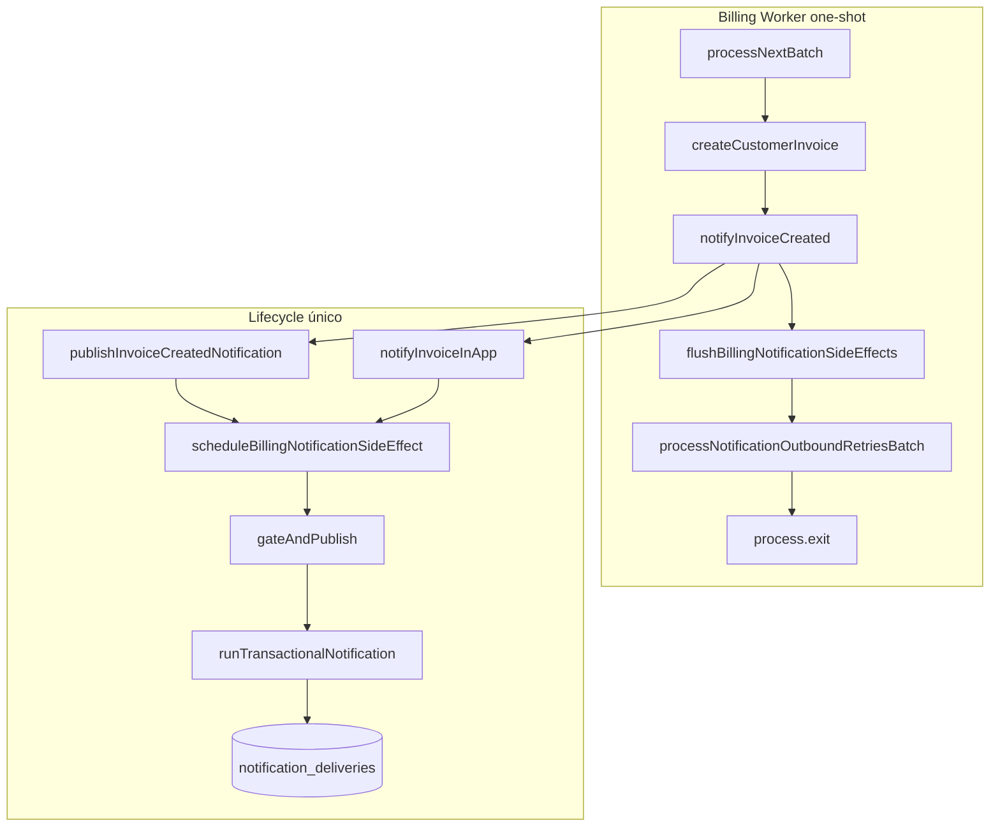

# Billing Engine — Hardening de notificações

Documentação da correção que torna notificações de faturas recorrentes confiáveis em **workers one-shot** (processo Node encerra após um batch).

---

## Problema

| Contexto | Comportamento |
|----------|----------------|
| API HTTP | `notifyInvoiceCreated()` → `enqueue()` fire-and-forget → processo permanece vivo → notificações completam |
| `runRecurringWorker.ts` | Mesmo fluxo, mas `main()` termina → event loop esvazia → promises em flight podem ser cortadas |
| `notification_deliveries` | Inserção ocorre dentro da promise do `enqueue('invoice.created', …)` |
| Retry outbound WhatsApp | `processNotificationOutboundRetriesBatch` rodava só no `index.ts` da API |

Investigação: `docs/INVESTIGACAO_RECORRENCIA_POS_FIX_WORKER.md`.

---

## Arquitetura (visão geral)



**Regra:** não duplicar `notify`; não mover lógica para controller. Ponto único: `notifyInvoiceCreated()` em `invoiceNotificationsService.ts`.

---

## Fluxo detalhado

### 1. Criação da fatura (recorrente ou manual)

`customerInvoiceService.createCustomerInvoice` chama `notifyInvoiceCreated({ tenantId, invoiceId, preferredSenderUserId })` após persistir a fatura — mesmo caminho para manual e recorrente.

### 2. `notifyInvoiceCreated`

1. **Outbound (WhatsApp / motor):** `publishInvoiceCreatedNotification` → `enqueue('invoice.created', …)`  
2. **In-app (admins do tenant):** `scheduleBillingNotificationSideEffect('invoice_in_app.created', …)` → `notifyInvoiceInApp`

Ambos passam pela fila rastreável (`billingNotificationFlush.ts`).

### 3. `enqueue` → `gateAndPublish` → `runTransactionalNotification`

| Etapa | Função | Notas |
|-------|--------|-------|
| Piloto / flags | `gateAndPublish` | `NOTIFICATIONS_ENGINE_*`, allowlist de tenant/evento |
| Telefone / remetente | `gateAndPublish` | Skip com log se ausente |
| Render + insert | `runTransactionalNotification` | `insertDelivery` com `idempotency_key` |
| Idempotência | `insertDelivery` ON CONFLICT | `duplicate: true` → sem novo envio |
| Janela horária | `resolveInvoiceTransactionalDispatchNotBefore` | `dispatch_not_before` na linha |
| Envio imediato | orchestrator | Só se `dispatch_not_before <= now()` e flag de envio ativa |
| Envio adiado | status `queued` | Worker de retry (API ou billing-worker pós-flush) |

### 4. Drain no worker

No fim de `runRecurringWorker.ts`:

1. `await flushBillingNotificationSideEffects()` — aguarda todas as side-effects enfileiradas até a fila estabilizar (rodadas com `Promise.allSettled`, sem `sleep`).
2. `await processNotificationOutboundRetriesBatch(50)` — dispara entregas `queued` já vencidas (`dispatch_not_before <= now()`) e retries.

Só então o processo encerra e grava heartbeat.

---

## Lifecycle e idempotência

| Canal | Chave / mecanismo |
|-------|------------------|
| WhatsApp `invoice.created` | `idempotency_key`: `invoice.created:{invoiceId}` em `notification_deliveries` |
| In-app | `notifications.data.invoice_id` + `type = invoice_created` |
| Digest due/overdue | `idempotency_day` no in-app; chaves com dia no outbound |

Reenvio do mesmo evento não cria segunda delivery (`duplicate: true`). Log `[BILLING_NOTIFY_DELIVERY_CREATED]` só quando `created` e não duplicata.

---

## Worker one-shot e flush strategy

### Fila rastreável (`billingNotificationFlush.ts`)

- `scheduleBillingNotificationSideEffect(label, fn)` — substitui `void fn().catch(...)` puro; mantém `Set<Promise<void>>`.
- `flushBillingNotificationSideEffects()` — drena em ondas até `pending.size === 0` (máx. 32 rodadas anti-loop).

**Por que ondas?** Tarefas enfileiradas durante o await de outras entram na rodada seguinte — sem timeout arbitrário.

**API HTTP:** não chama flush; o processo long-lived não precisa. Comportamento HTTP inalterado.

**Sem bloqueio indefinido:** flush só espera promises reais (I/O DB/rede). Se uma promise nunca resolver, o worker trava — equivalente a falha operacional explícita, não `setTimeout` mascarado.

### Outbound retry no worker

Replica capacidade mínima do intervalo da API para o one-shot: após persistir deliveries, processa batch de até 50 IDs devidos.

Entregas com `dispatch_not_before` no futuro **não** são enviadas no mesmo run (respeito à janela do tenant).

---

## Observabilidade

| Log | Quando |
|-----|--------|
| `[BILLING_NOTIFY_ENQUEUED]` | Cada `scheduleBillingNotificationSideEffect` |
| `[BILLING_NOTIFY_FLUSH]` | Fim do drain no worker (`rounds`, `drained`, `fulfilled`, `rejected`, `pending_remaining`) |
| `[BILLING_NOTIFY_DELIVERY_CREATED]` | Nova linha em `notification_deliveries` após `gateAndPublish` bem-sucedido |
| `[BILLING]` `worker_exit` | Inclui `notify_flush` e `outbound_retry` |

### Validação esperada (fatura recorrente)

1. Job `completed` com nova `customer_invoices`.
2. Linha em `notification_deliveries` para `invoice.created` e tenant correto.
3. Notificação in-app para admins (`notifications` com `invoice_created`).
4. WhatsApp: enviado se due imediato; caso contrário `queued` + `dispatch_not_before` preenchido.
5. Logs do worker com `notify_flush.rejected === 0` (ideal) e `outbound_retry.processed` conforme fila.

### SQL útil

```sql
SELECT id, event_key, status, dispatch_not_before, idempotency_key, created_at
FROM notification_deliveries
WHERE entity_id = '<invoice_uuid>'
ORDER BY created_at DESC;
```

---

## Arquivos alterados

| Arquivo | Papel |
|---------|--------|
| `packages/backend/src/services/notificationsEngine/billingNotificationFlush.ts` | Fila + flush |
| `packages/backend/src/services/notificationsEngine/businessTransactionalNotifications.ts` | `enqueue` → fila rastreável; log delivery |
| `packages/backend/src/services/invoiceNotificationsService.ts` | in-app na mesma fila |
| `packages/backend/src/scripts/runRecurringWorker.ts` | flush + outbound retry antes do exit |

---

## Deploy / ENV

Replicar no serviço **billing-worker** as mesmas variáveis `NOTIFICATIONS_ENGINE_*` do backend API (piloto, business events, WhatsApp send).

Ver também: `docs/EASYPANEL-BILLING-WORKER-SCHEDULER.md`.

---

## Referências

- `docs/INVESTIGACAO_RECORRENCIA_POS_FIX_WORKER.md` — causa raiz fire-and-forget
- `docs/INVESTIGACAO_WORKER_FINANCEIRO_PRODUCAO.md` — operação scheduler/worker
