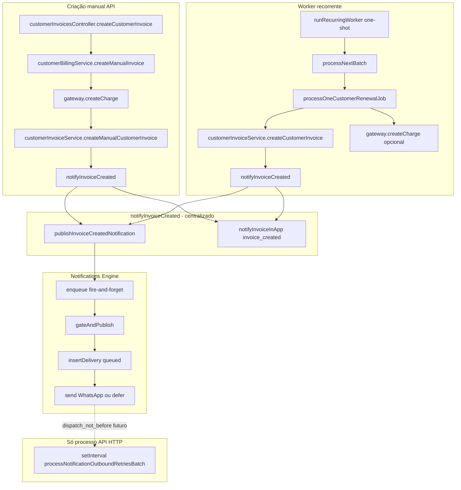

# Investigação — Pós-fix do worker (notificações + mês duplicado na UI)

**Data:** 2026-05-20  
**Contexto:** Worker e scheduler em produção; `scheduled_at` corrigido (`now()` no enqueue); faturas recorrentes passam a ser geradas. Restam:

1. Invoice automática **sem** notificação ao cliente (manual notifica).
2. Histórico na assinatura: `04/2026`, `05/2026`, `05/2026` — esperado `04` → `05` → `06`.

**Escopo:** investigação apenas — **sem correção aplicada** neste documento.

---

## Resumo executivo

| Problema | Causa raiz provável (código) | Severidade |
|----------|------------------------------|------------|
| Notificações automáticas | Notificação **não** está só no controller; `createCustomerInvoice` já chama `notifyInvoiceCreated`. Gap operacional: **fire-and-forget** + worker **one-shot** sem drenar fila async; envio WhatsApp **adiado** depende do loop na **API**, não no container do billing worker. | Alta |
| Mês duplicado `05/2026` | Coluna **«Mês de referência»** = `MM/yyyy` de `subscription_cycles.cycle_date` (= **vencimento** / `cycle_key`), não mês de geração nem índice sequencial. Duas linhas no mesmo mês civil (ex.: ciclo `queued` + fatura já gerada antecipadamente) aparecem como **dois 05/2026**. | Média (UX) |

---

# Problema 1 — Notificações da invoice automática

## Fluxo esperado (produto)

Após criar `customer_invoices` (recorrente), o tenant/cliente deve receber o mesmo tratamento que na criação manual:

- Notificação in-app (admins do tenant)
- Motor transacional (`invoice.created`) → WhatsApp / templates
- Sem duplicar canais (idempotency por `invoice_id`)

## Mapa de código



### Ficheiros

| Peça | Ficheiro |
|------|----------|
| Criação recorrente (worker) | `recurringBillingJobService.ts` → `processOneCustomerRenewalJob` → `createCustomerInvoice` |
| Criação manual | `customerBillingService.ts` → `createManualInvoice` → `createManualCustomerInvoice` |
| Persistência + notify | `customerInvoiceService.ts` — `createCustomerInvoice` (linha ~178) e `createManualCustomerInvoice` (linha ~376) |
| Orquestração notify | `invoiceNotificationsService.ts` — `notifyInvoiceCreated` |
| WhatsApp / templates | `businessTransactionalNotifications.ts` — `publishInvoiceCreatedNotification` |
| Agenda envio | `notificationTenantOutboundDispatchSchedule.ts` — `resolveInvoiceTransactionalDispatchNotBefore` |
| Retry envio adiado | `notificationOutboundRetryWorker.ts` — invocado em `index.ts` (API) |
| Controller manual | `customerInvoicesController.ts` — **não** chama notify diretamente |

## Descoberta principal: notify **não** está acoplado ao controller

Tanto o worker como o manual passam por `notifyInvoiceCreated` dentro de `createCustomerInvoice` / `createManualCustomerInvoice`.

**Conclusão:** a diferença manual vs automático **não** é «falta de chamada no worker», e sim **timing, ambiente e entrega assíncrona**.

## Por que o manual «funciona» e o automático «não»

### Hipótese A — Worker termina antes de concluir trabalho async (forte)

`publishInvoiceCreatedNotification` usa:

```typescript
enqueue('invoice.created', async () => { ... gateAndPublish ... });
// enqueue = void fn().catch(...) — sem await
```

`notifyInvoiceInApp` também é `void ...catch(...)`.

O script `runRecurringWorker.ts` executa **um batch** e o processo Node **encerra** quando `main()` resolve. Promessas em flight do motor de notificações podem **não completar** (insert em `notification_deliveries`, render, etc.).

A API HTTP mantém o processo vivo (minutos/horas) + `setInterval` de retry.

**Evidência a procurar em produção:**

- Invoice recorrente existe em `customer_invoices`
- **Ausência** de linha `notification_deliveries` com `event_key = invoice.created` e `entity_id = <invoice_id>`
- Logs `[notifications-engine/business] invoice.created` ausentes no container do **billing-worker**

### Hipótese B — WhatsApp adiado (`dispatch_not_before`) + retry só na API (forte)

`gateAndPublish` → `resolveInvoiceTransactionalDispatchNotBefore`:

- Se `invoice_notify_same_as_generation_effective === false` e existe `invoice_notify_time_local`, o envio fica **`queued`** com `dispatch_not_before` no futuro (mesmo dia, horário configurado).
- Envio real: `processNotificationOutboundRetriesBatch` em `packages/backend/src/index.ts` (poll ~contínuo na API).

O container **painelcrm-billing-worker** **não** executa esse `setInterval`. A fila **depende** do backend API estar no ar para disparar WhatsApp adiado.

Isto afeta **manual e automático** igualmente para WhatsApp adiado — mas no manual o utilizador pode testar **in-app** (resposta HTTP mais longa) ou já passou o horário de notify.

**Evidência SQL:**

```sql
SELECT id, event_key, status, dispatch_not_before, created_at, error_message
FROM notification_deliveries
WHERE entity_type = 'customer_invoice'
  AND entity_id = '<invoice_uuid>'
ORDER BY created_at DESC;
```

- `queued` + `dispatch_not_before` no futuro → aguardar API retry (comportamento esperado, não bug de criação).
- **Sem linhas** → hipótese A ou motor desligado (env).

### Hipótese C — Flags / ENV no worker (média)

`gateAndPublish` retorna cedo se:

| Condição | Efeito |
|----------|--------|
| `NOTIFICATIONS_ENGINE_ENABLED` ≠ true | Sem outbound engine |
| `NOTIFICATIONS_ENGINE_BUSINESS_EVENTS_ENABLED` ≠ true | Sem eventos de negócio |
| `NOTIFICATIONS_ENGINE_BUSINESS_EVENTS_KEYS` sem `invoice.created` | Skip allowlist |
| Piloto de tenants restringe tenant | `business_pilot_skip` |

**Validar:** comparar ENV do serviço `painelcrm-backend` vs `painelcrm-billing-worker` (devem ser **iguais**).

### Hipótese D — Sem telefone WhatsApp (fraca para «nada notifica»)

Sem telefone normalizado: skip WhatsApp com log  
`skip invoice.created: sem telefone de cliente`.

**In-app** (`notifyInvoiceInApp`) deveria correr na mesma mesma — salvo hipótese A.

### Hipótese E — Ordem gateway vs notify (secundária)

| Caminho | Ordem |
|-------|--------|
| Manual com gateway | `createCharge` → `createManualCustomerInvoice` → **notify** |
| Worker | `createCustomerInvoice` → **notify** → itens → `createCharge` |

Ambos chamam notify; ordem diferente **não** explica ausência total se `notify` completar.

## O que **não** duplicar (já centralizado)

- Um único `notifyInvoiceCreated` por insert de fatura.
- Idempotency: `invoice.created:${invoiceId}` em `notification_deliveries`.
- In-app: `hasRecentInAppInvoiceNotification` por `invoice_id` + tipo.

**Correção futura:** não adicionar segundo `notify` no controller; garantir **await/drain** no worker e/ou notify **após** gateway com a mesma função.

## Correção recomendada (Problema 1)

1. **Worker:** após `processNextBatch`, `await` drenagem explícita das publicações enfileiradas (ou tornar `publishInvoiceCreatedNotification` awaitable no caminho billing).
2. **Opcional:** no `runRecurringWorker.ts`, pequeno `await sleep(500)` + flush só se não houver API de drain — preferir fila awaitável.
3. **ENV:** replicar todas as variáveis `NOTIFICATIONS_ENGINE_*` no billing-worker.
4. **Operação:** confirmar API backend ativa para `notificationOutboundRetryWorker` quando notify horário ≠ geração.
5. **Observabilidade:** log `[BILLING_INVOICE_NOTIFY]` com `invoice_id`, `delivery_created`, `dispatch_not_before`, `in_app_sent`.

---

# Problema 2 — «Mês de referência» duplicado (05/2026)

## Sintoma na UI

Tabela **Histórico de cobranças** em `SubscriptionDetail.tsx`:

- Coluna **«Mês de referência»** ← `timeline[].month_ref`
- Utilizador vê: `04/2026`, `05/2026`, `05/2026`
- Espera progressão: `04` → `05` → `06`

## Origem dos dados

| Camada | Ficheiro | Função |
|--------|----------|--------|
| API detalhe | `crmSubscriptionsService.ts` | `getCrmSubscriptionDetail` |
| Timeline | `buildTimeline(cycles, invoices, ...)` | merge `subscription_cycles` + faturas órfãs |
| `month_ref` | `monthRefFromYmd(ymd)` | `ymd.slice(5,7)/ymd.slice(0,4)` → **só mês civil** |
| Ciclos | `subscriptionCyclesDualWriteService.ts` | `cycle_date` = `cycle_key` canónico |
| Enfileiramento | `insertOrReactivateRenewalJob` | `cycle_key` = `next_billing_date` (**vencimento**) |
| Worker período | `processOneCustomerRenewalJob` | `periodStart` = `job.cycle_key`; `periodEnd` = `nextSubscriptionBillingAfterCycle(periodStart)` |
| Avanço | `advanceSubscriptionAfterCompletedCycle` | `next_billing_date` += intervalo a partir de `cycleDateYmd` |

### Código de `month_ref`

```typescript
// crmSubscriptionsService.ts
month_ref: monthRefFromYmd(c.cycle_date?.slice(0, 10) ?? ps),
// ...
month_ref: monthRefFromYmd(ps ?? inv.due_date?.slice(0, 10)),
```

`cycle_date` no scheduler = **data de vencimento do ciclo** (`next_billing_date` na altura do enqueue), **não** a data de geração antecipada.

## Por que aparecem dois `05/2026`

Não é, em geral, falha de `addMonths` no avanço (`computeFinalNextBillingForCompletedCycle` + `calculateNextBillingDate` produzem o mês seguinte correto, ex. 24/05 → 24/06).

O duplicado vem da **camada de apresentação + duas linhas no mesmo mês civil**:

| Cenário | Linha A | Linha B | Ambas `month_ref` |
|---------|---------|---------|------------------|
| Geração antecipada | Fatura maio gerada em 19/05 (`due_date` 24/05) → ciclo `invoiced` | Job/ciclo `queued`/`pending` ainda com `cycle_date` 24/05 | `05/2026` |
| Timeline merge | Ciclo com `invoice_id` ligado | Fatura na lista `invoices` **sem** exclusão (bug de link) | `05/2026` |
| Dois jobs mesmo mês | `cycle_key` 2026-05-07 e 2026-05-24 | — | **ambos** `05/2026` (perde dia) |

Com antecipação de 5 dias (exemplo do pedido):

- Vencimento **24/05** → geração **19/05**.
- Após fix `scheduled_at`, worker gera fatura em **19/05**.
- `subscription_cycles.cycle_date` continua **2026-05-24** → `month_ref` = **05/2026**.
- Scheduler pode manter ciclo **queued** para o mesmo `cycle_date` antes de marcar `invoiced` → segunda linha **05/2026** na timeline.

O utilizador interpreta «mês de referência» como **índice do ciclo** (1º, 2º, 3º), mas o sistema grava **mês do vencimento**.

## Campos relacionados (não confundir)

| Campo | Significado | Usado em `month_ref`? |
|-------|-------------|----------------------|
| `cycle_key` | Vencimento canónico YYYY-MM-DD | Indiretamente (= `cycle_date`) |
| `cycle_date` | PK lógico do ciclo em `subscription_cycles` | **Sim** |
| `period_start` / `period_end` | Janela do ciclo na fatura | Só em `period_label`, não em `month_ref` |
| `due_date` | Vencimento da fatura | Coluna separada «Vencimento» |
| `next_billing_date` | Próximo vencimento da assinatura | Card «próxima cobrança», não histórico |
| `reference_month` | **Não existe** coluna com este nome | — |

## Avanço de `next_billing_date` (sanidade)

```typescript
// computeFinalNextBillingForCompletedCycle
computedNext = nextSubscriptionBillingAfterCycle(cycleDate, interval);
// cycleDate = periodStart do job processado (ex. 2026-05-24)
// monthly → 2026-06-24
```

Regra `kept_subscription_ahead_no_regress` evita regressão se `next_billing_date` já estiver à frente — **não** explica dois meses 05 na timeline; explica manter junho se já agendado.

## Impacto

| Área | Impacto |
|------|---------|
| UX assinatura | Confusão operacional; suporte interpreta «ciclo duplicado» |
| Relatórios | Se exportarem `month_ref`, colisão no mesmo MM/yyyy |
| Motor billing | **Baixo** — `period_start` / UNIQUE `(subscription_id, period_start)` seguem corretos por data ISO |
| Antecipação / vencimento | **Nenhum** — `due_date` e `cycle_key` não alterados por esta investigação |

## Correção recomendada (Problema 2)

1. **UI / API `month_ref`:** usar mês de **geração** (`metadata.generation_date` em `subscription_cycles`) ou exibir **`cycle_date` completo** (dd/MM/yyyy), não só `MM/yyyy`.
2. **Timeline:** deduplicar por `cycle_date` + `invoice_id`; não listar fatura órfã se já houver ciclo `invoiced` com mesmo `invoice_id`.
3. **Opcional produto:** coluna «Ciclo #» (`billing_cycle_count`) em vez de mês civil.
4. **Não alterar** `cycle_key` nem regra de avanço só por causa deste bug visual.

---

# Queries de diagnóstico (produção)

## Notificações para uma invoice recorrente

```sql
-- Fatura
SELECT id, invoice_number, origin, invoice_type, created_at, due_date, client_id
FROM customer_invoices
WHERE id = '<invoice_id>';

-- Entregas motor
SELECT event_key, status, dispatch_not_before, recipient_address, error_message, created_at
FROM notification_deliveries
WHERE entity_type = 'customer_invoice' AND entity_id = '<invoice_id>'
ORDER BY created_at;

-- In-app
SELECT type, title, created_at, data->>'invoice_id'
FROM notifications
WHERE data->>'invoice_id' = '<invoice_id>'
   OR data->>'customer_invoice_id' = '<invoice_id>';
```

## Ciclos duplicados no mesmo mês civil

```sql
SELECT cycle_date::text, status, invoice_id::text, job_id::text, period_start::text, period_end::text, metadata
FROM subscription_cycles
WHERE subscription_id = '<subscription_id>'
ORDER BY cycle_date, updated_at;

SELECT period_start::text, due_date::text, status, id::text
FROM customer_invoices
WHERE subscription_id = '<subscription_id>'
ORDER BY period_start, created_at;
```

---

# Resultado esperado pós-correções (futuro)

| # | Objetivo |
|---|----------|
| 1 | Invoice recorrente dispara `notifyInvoiceCreated` de forma **confiável** (in-app + engine + WhatsApp quando aplicável) |
| 2 | Histórico mostra sequência clara: **04 → 05 → 06** (por geração ou vencimento explícito, sem duplicar MM/yyyy) |
| 3 | Sem segunda notificação por canal; idempotency mantida |
| 4 | `due_date`, antecipação, `period_start`, relatórios financeiros permanecem consistentes |

---

## Referências

- `docs/INVESTIGACAO_WORKER_NAO_CONSOME_JOBS.md`
- `docs/INVESTIGACAO_ASSINATURAS_RECORRENTES_FATURAS_NAO_GERADAS.md`
- `docs/MAPA_TECNICO_HORARIO_RECORRENCIA_E_NOTIFICACAO.md`
- `packages/backend/src/services/customerInvoiceService.ts`
- `packages/backend/src/services/invoiceNotificationsService.ts`
- `packages/backend/src/services/crmSubscriptionsService.ts` (`buildTimeline`)
