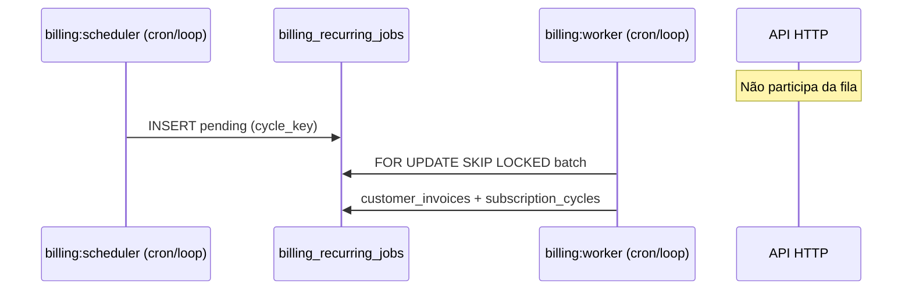

# Investigação — Worker financeiro não processando em produção

**Data:** 2026-05-19  
**Escopo:** execução operacional apenas (scheduler, worker, deploy, logs, fila).  
**Fora de escopo:** alterar regras de recorrência, motor de billing, geração de invoice.

**Sintoma em produção (reportado):**

- UI: **«Última verificação: —»**
- `subscription_cycles` em `pending`, `invoice_id` null por tempo indefinido
- Faturas não nascem após horário elegível

**Hipótese principal (código + deploy):** em produção corre **apenas** o processo HTTP da API; **não** correm `billing:scheduler` nem `billing:worker` (ou correm com intervalo/cron incorreto).

---

## 1. Mapeamento da execução

### 1.1 Entry points

| Papel | Script | NPM | Comportamento |
|-------|--------|-----|----------------|
| Scheduler | `packages/backend/src/scripts/runRecurringScheduler.ts` | `billing:scheduler` | **One-shot:** `enqueueRenewalJobs()` → log `scheduler_exit` → **processo termina** |
| Worker | `packages/backend/src/scripts/runRecurringWorker.ts` | `billing:worker` | **One-shot:** `processChildItemDueInvoices()` + `processNextBatch(workerId)` → log `worker_exit` → **processo termina** |

Núcleo de negócio: `packages/backend/src/services/recurringBillingJobService.ts`.

### 1.2 Quem chama / quem **não** chama

| Componente | Inicia scheduler/worker? |
|------------|---------------------------|
| `packages/backend/src/index.ts` (API HTTP) | **Não** — só `/health`, rotas `/api/*` |
| `Dockerfile.backend` `CMD ["node", "dist/index.js"]` | **Não** — só API |
| `docker-compose.prod.yml` serviço `backend` | **Não** — um container = API |
| `start.bat` (dev Windows) | **Sim** — 2 janelas PowerShell em loop (`Sleep 60s` / `15s`) |
| `DEPLOY.md` PM2 | **Só** `dist/index.js` — **sem** worker/scheduler documentados no mesmo bloco |

**Conclusão:** a recorrência **nunca** é disparada pelo processo da API. Depende de **processos ou cron externos** com o **mesmo** `.env` / `POSTGRES_*`.

### 1.3 Fluxo esperado (quando operacional)



---

## 2. Process manager / deploy

### 2.1 O que existe no repositório

| Mecanismo | Scheduler | Worker | API |
|-----------|-----------|--------|-----|
| `docker-compose.prod.yml` | ❌ | ❌ | ✅ `backend` |
| `Dockerfile.backend` | ❌ | ❌ | ✅ `node dist/index.js` |
| `ecosystem.config.js` / PM2 no repo | ❌ | ❌ | — |
| `start.bat` | ✅ loop 60s | ✅ loop 15s | ✅ `npm run dev` |
| GitHub Actions deploy | ❌ (sem workflow no repo) | ❌ | — |

### 2.2 Processos separados?

- **Sim, por desenho:** scheduler e worker são **binários/scripts distintos** do `index.js`.
- **Não sobem com a API** em Docker nem no exemplo PM2 de `DEPLOY.md`.

### 2.3 Causa provável de produção

**Processo faltando:** falta **dois** comandos recorrentes no painel (EasyPanel, systemd, cron, PM2 extra):

```bash
cd packages/backend && npm run billing:scheduler   # cada 10–15 min
cd packages/backend && npm run billing:worker      # cada 1–2 min
```

Documentação explícita: `env.example` (bloco Billing), `docs/ETAPA_1_CORRECAO_FATURAS_RECORRENTES.md`, `docs/FASE11-OPERACAO-E-QUALIDADE.md`.

---

## 3. DEV vs produção

| Ambiente | API | Scheduler | Worker |
|----------|-----|-----------|--------|
| **Local `start.bat`** | ✅ janela dedicada | ✅ loop 60s | ✅ loop 15s |
| **Local manual** | `npm run dev` só | ❌ se não abrir janelas | ❌ |
| **Docker prod** | ✅ container `backend` | ❌ | ❌ |
| **PM2 exemplo DEPLOY** | ✅ | ❌ | ❌ |

**Diferença crítica:** em DEV com `start.bat`, recorrência **parece “automática”**; em produção típica (só API), **nada enfileira nem processa** → ciclos `pending` eternos, «Última verificação: —».

---

## 4. Logs esperados

### 4.1 Formato

- `[BILLING]` — JSON via `billingLog()` (`packages/backend/src/services/billingLogger.ts`)
- `[SUBSCRIPTION_*]` — `subscriptionBillingLog()` (investigação recorrência)
- Scripts: linha final `[BILLING] {"type":"worker_exit"|"scheduler_exit",...}`

### 4.2 Evidência de worker **ativo**

Procurar em stdout do processo worker (não no log da API):

| `message` / `type` | Significado |
|--------------------|-------------|
| `batch_start` | Batch aberto (`batchSize` > 0 ou 0) |
| `job_processing_start` | Job locked |
| `customer_renewal_invoice_persisted` / `SUBSCRIPTION_INVOICE_CREATED` | Fatura criada |
| `batch_done` | Fim do batch |
| `worker_exit` (script) | Execução one-shot terminou |

### 4.3 Evidência de scheduler **ativo**

| `message` | Significado |
|-----------|-------------|
| `enqueue_run` | Passou candidatos |
| `enqueue_job_inserted` | Job novo |
| `enqueue_done` | Fim do run |
| `scheduler_exit` (script) | Execução terminou |

### 4.4 Se **não** existir em produção

→ processos não estão a correr **ou** logs vão para outro serviço/container inexistente.

**Nota:** filtrar logs **só** do container `painelcrm_backend_prod` **não** mostra billing se worker/scheduler não forem containers separados com logging próprio.

---

## 5. Jobs presos (SQL de diagnóstico)

Executar na **mesma base** que a API de produção.

### 5.1 Fila global

```sql
SELECT status, COUNT(*) AS n
FROM billing_recurring_jobs
GROUP BY status
ORDER BY status;
```

### 5.2 Pending elegíveis agora (worker parado)

```sql
SELECT id, subscription_id, tenant_id, cycle_key, status,
       scheduled_at, retry_at, attempts, error_message,
       locked_at, locked_by, created_at, updated_at
FROM billing_recurring_jobs
WHERE status = 'pending'
  AND scheduled_at <= now()
  AND (retry_at IS NULL OR retry_at <= now())
ORDER BY scheduled_at ASC
LIMIT 50;
```

**Interpretação:** muitas linhas antigas (`updated_at` horas/dias atrás) + **ausência** de logs `batch_start` → worker não consome.

### 5.3 Retry vencido não processado

```sql
SELECT COUNT(*) AS pending_retry_due
FROM billing_recurring_jobs
WHERE status = 'pending'
  AND retry_at IS NOT NULL
  AND retry_at <= now();
```

### 5.4 Processing preso (crash do worker)

Reclaim automático no código: `BILLING_WORKER_STALE_PROCESSING_RECLAIM_MINUTES` (default **20**). Se worker **nunca** corre, jobs ficam `processing` até outro worker passar reclaim.

```sql
SELECT id, subscription_id, cycle_key, locked_at, locked_by, updated_at
FROM billing_recurring_jobs
WHERE status = 'processing'
  AND updated_at < now() - interval '25 minutes';
```

### 5.5 Ciclos sem invoice (sintoma UI)

```sql
SELECT sc.id, sc.subscription_id, sc.cycle_date, sc.status,
       sc.invoice_id, sc.job_id, sc.updated_at
FROM subscription_cycles sc
WHERE sc.status = 'pending'
  AND sc.invoice_id IS NULL
  AND sc.cycle_date <= CURRENT_DATE
ORDER BY sc.updated_at ASC
LIMIT 30;
```

### 5.6 Assinatura sem `last_job_at` (worker nunca concluiu)

```sql
SELECT id, tenant_id, next_billing_date, last_job_at, status
FROM subscriptions
WHERE type = 'customer'
  AND status = 'active'
  AND next_billing_date <= CURRENT_DATE
  AND last_job_at IS NULL
LIMIT 20;
```

---

## 6. Healthcheck / observabilidade (implementado nesta investigação)

### 6.1 Tabela `billing_ops_heartbeat`

Migração: `database/init/248_billing_ops_heartbeat.sql` (e espelho Supabase).

Cada execução **bem-sucedida** dos scripts grava:

- `process_key`: `scheduler` | `worker`
- `last_run_at`, `last_exit_json`

Scripts atualizados: `runRecurringScheduler.ts`, `runRecurringWorker.ts`.

### 6.2 API Super Admin

`GET /api/superadmin/billing/recurring-jobs` passa a incluir `process_heartbeats`:

- `heartbeats[]` com `age_minutes`, `stale` (scheduler > 30 min, worker > 10 min)
- `inference` (proxies via `max(updated_at)` / `max(created_at)` em jobs) se tabela ausente

### 6.3 UI «Última verificação: —»

Em `src/lib/subscriptionRecurringDisplay.ts`, `lastCheckAt = job?.updated_at ?? subscription.last_job_at`.

**«—»** significa:

- sem job em `recentJobs` para o ciclo, **e**
- `subscriptions.last_job_at` null

Isto é **consistente** com worker que **nunca** completou um ciclo — não é bug de formatação isolado.

### 6.4 Verificação rápida em produção (pós-migrate)

```sql
SELECT * FROM billing_ops_heartbeat ORDER BY process_key;
```

| Resultado | Diagnóstico |
|-----------|-------------|
| 0 linhas | Scripts nunca correram com migração aplicada |
| só `scheduler`, worker ausente | Scheduler OK, **worker ausente** |
| `worker` `stale: true` (>10 min) | Worker parado / cron morto |
| ambos recentes | Infra OK — investigar janela horária, RLS, falhas de job |

---

## 7. Loop do worker

- **Não há** `setInterval` dentro de `runRecurringWorker.ts`.
- Cada invocação processa **até 100** jobs (`WORKER_BATCH_SIZE`) e **sai** (`process.exit` implícito ao terminar Node).
- Continuidade exige **cron** ou **loop externo** (como `start.bat`).

**Risco:** cron configurado como `@daily` ou one-shot manual → fila não drena a tempo.

**Não é** “morre após primeira execução” por bug de loop interno — é **by design** one-shot.

---

## 8. Startup / pipeline

| Artefacto | Comando real |
|-----------|--------------|
| `packages/backend/package.json` | `billing:scheduler`, `billing:worker` → `tsx src/scripts/...` |
| Build prod | `npm run build` → `dist/scripts/runRecurringWorker.js` (se quiser `node` em vez de `tsx`) |
| Docker prod | **Não** invoca estes scripts |
| `env.example` | Documenta 2 crons **obrigatórios** |

**Worker precisa comando manual / cron explícito** — não há “sidecar” no compose atual.

---

## 9. Erros silenciosos

| Ponto | Comportamento |
|-------|----------------|
| `main().catch` nos scripts | `console.error` + `process.exit(1)` — **não** engole fatal |
| Worker sem contexto RLS | `throw new Error('billing worker RLS context missing')` — batch aborta |
| `enqueueRenewalJobs` ON CONFLICT | Skip silencioso de duplicata — **não** impede novos ciclos se scheduler corre |
| Promise rejection na API | Irrelevante — worker não roda na API |

**Deadlock de fila:** improvável com `SKIP LOCKED`; cenário real é **zero consumidores**.

---

## 10. Timezone

- Scheduler: `next_billing_date <= CURRENT_DATE` (data do **PostgreSQL**).
- Worker: janela local Fase 2 via `tenants.timezone` (fallback documentado no serviço).
- Jobs fora da janela: `retry_at` futuro (`time_window_worker_requeued_outside_window`) — job **permanece pending**, não é “worker parado”.

**Com worker parado**, timezone **não** explica `invoice_id` null sem fim — explica atraso **após** worker voltar.

Validar em incidente:

```sql
SELECT id, company_name, timezone FROM tenants WHERE id = '<tenant_id>';
SHOW timezone;  -- sessão Postgres
```

Variável `TZ` no container worker deve ser coerente com Postgres (ideal `UTC` em DB + timezone por tenant na lógica).

---

## 11. Resultado consolidado

| Pergunta | Resposta (código + deploy repo) |
|----------|--------------------------------|
| **1. Worker está rodando?** | **Não comprovável no repo** — em Docker/PM2 exemplo **não sobe**. Confirmar em produção via logs `[BILLING]`, `billing_ops_heartbeat`, SQL §5. |
| **2. Scheduler está rodando?** | **Idem** — processo separado obrigatório. |
| **3. Jobs consumidos?** | Se pending antigos com `scheduled_at <= now()` e sem `batch_done` nos logs → **não**. |
| **4. Local vs produção** | Local `start.bat` = 4 processos; prod típico = **1** (API). |
| **5. Processo faltando?** | **Sim — scheduler + worker** (altamente provável). |
| **6. Logs encontrados?** | Ver §4 — devem estar no stdout dos **dois** processos, não só API. |
| **7. Jobs presos?** | SQL §5 — pending + `last_job_at` null reforçam hipótese. |
| **8. Causa raiz** | **Gap operacional de deploy:** recorrência assíncrona sem orquestração em produção alinhada ao DEV. |

### Infraestrutura no repositório (Docker / EasyPanel)

| Artefacto | Descrição |
|-----------|-----------|
| `Dockerfile.billing.worker` | Build backend + loop `scripts/start-billing-worker.sh` |
| `Dockerfile.billing.scheduler` | Build backend + loop `scripts/start-billing-scheduler.sh` |
| `docker-compose.prod.yml` | Serviços `billing-worker` e `billing-scheduler` |
| `docs/EASYPANEL-BILLING-WORKER-SCHEDULER.md` | Passo a passo EasyPanel |

### Correção esperada (confirmar no servidor)

1. Subir **dois** serviços (compose ou EasyPanel) com o mesmo `.env` que API:
   - Scheduler: cada **10–15 min**
   - Worker: cada **1–2 min**
2. EasyPanel / PM2 exemplo:

```bash
# PM2 (após build em packages/backend)
pm2 start npm --name painelcrm-billing-scheduler -- run billing:scheduler --cron "*/12 * * * *"
pm2 start npm --name painelcrm-billing-worker -- run billing:worker --cron "*/2 * * * *"
```

Ou loops dedicados / containers sidecar com `while true; do npm run billing:worker; sleep 15; done`.

3. Aplicar migração `248_billing_ops_heartbeat.sql` e validar `GET /api/superadmin/billing/recurring-jobs` → `process_heartbeats`.

4. Em logs, confirmar cadência de `worker_exit` / `scheduler_exit` e `batch_start`.

### Critérios de sucesso pós-correção

- `billing_ops_heartbeat`: `stale: false` em ambos
- `pending` elegível diminui; novas `customer_invoices` com `subscription_id`
- `subscription_cycles` passam a `invoiced` / `completed`
- UI: «Última verificação» com data/hora
- Logs `[SUBSCRIPTION_INVOICE_CREATED]` ou `customer_renewal_invoice_persisted`

---

## Referências no repositório

- `docs/INVESTIGACAO_ASSINATURAS_RECORRENTES_FATURAS_NAO_GERADAS.md`
- `docs/INVESTIGACAO_CANCELLED_CYCLE_MISMATCH_FILA_VAZIA.md` (one-shot)
- `docs/ETAPA_1_CORRECAO_FATURAS_RECORRENTES.md`
- `packages/backend/src/services/billingOpsHeartbeatService.ts`
- `env.example` (linhas Billing)
