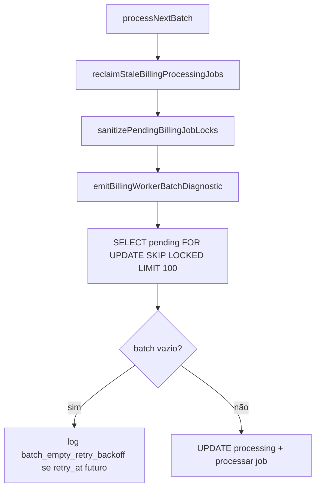

# Investigação — Worker não consome jobs `pending` (batchSize = 0)

**Data:** 2026-05-20  
**Contexto:** Scheduler e worker em produção; `enqueue_done` com jobs criados; worker reporta `batchSize: 0`, `processed: 0`.  
**Escopo:** diagnóstico e logs — **sem alteração** da query do batch nesta etapa.

---

## 1. Sintoma observado

| Processo | Log | Interpretação |
|----------|-----|----------------|
| Scheduler | `enqueue_done`, `enqueued: 2` | Jobs inseridos/reativados em `billing_recurring_jobs` |
| Worker | `batch_start`, `batchSize: 0` | SELECT do batch **não devolveu linhas** |

Jobs citados (exemplo):

- `cycle_key`: `2026-05-07`
- `cycle_key`: `2026-05-24`

---

## 2. Fluxo do worker (ordem real)



Ficheiro: `packages/backend/src/services/recurringBillingJobService.ts` — `processNextBatch`.

---

## 3. Query real do batch (claim)

Única query que define `batchSize`:

```sql
SELECT id, subscription_id, tenant_id, job_type, cycle_key,
       scheduled_at, retry_at, status, attempts, max_attempts
FROM billing_recurring_jobs
WHERE status = 'pending'
  AND scheduled_at <= now()
  AND (retry_at IS NULL OR retry_at <= now())
ORDER BY scheduled_at ASC
LIMIT 100
FOR UPDATE SKIP LOCKED;
```

Constante: `WORKER_BATCH_SIZE = 100`.

### O que **não** entra nesta query

| Estado / condição | Entra no batch? |
|-------------------|-----------------|
| `processing` | Não |
| `completed` | Não |
| `failed` | Não |
| `cancelled` | Não |
| `skipped` | Não existe no CHECK da tabela |
| `pending` + `scheduled_at > now()` | **Não** |
| `pending` + `retry_at > now()` | **Não** |
| Filtro por `tenant_id` | Não |
| Janela horária Fase 2 | Não (só **depois** do pickup) |
| `locked_at` / `locked_by` em `pending` | **Sim** (não bloqueia SELECT; locks órfãos são limpos antes) |

`FOR UPDATE SKIP LOCKED`: linhas já locked por outra transação em `processing` não aparecem; jobs `pending` sem lock concorrente entram.

---

## 4. Pré-passos antes do SELECT

### 4.1 Reclaim `processing` antigo

`reclaimStaleBillingProcessingJobs` — `BILLING_WORKER_STALE_PROCESSING_RECLAIM_MINUTES` (default **20**, `0` desliga):

```sql
UPDATE billing_recurring_jobs
SET status = 'pending', locked_at = NULL, locked_by = NULL, updated_at = now()
WHERE status = 'processing'
  AND (
    (locked_at IS NOT NULL AND locked_at < now() - (N minutes))
    OR (locked_at IS NULL AND updated_at < now() - (N minutes))
  );
```

Se jobs ficaram `processing` recentes (&lt; 20 min), **continuam fora** do batch até expirar o reclaim.

### 4.2 Sanitização de locks em `pending`

```sql
UPDATE billing_recurring_jobs
SET locked_at = NULL, locked_by = NULL, updated_at = now()
WHERE status = 'pending'
  AND (locked_at IS NOT NULL OR locked_by IS NOT NULL);
```

---

## 5. Como o scheduler grava `scheduled_at`

Insert / reativação (`insertOrReactivateRenewalJob`):

```sql
INSERT INTO billing_recurring_jobs (..., cycle_key, scheduled_at, status)
VALUES (..., $cycle_key, ($cycle_key::date)::timestamptz, 'pending');
```

- `cycle_key` = `subscriptions.next_billing_date` canónico (**data de vencimento** do ciclo).
- `scheduled_at` = meia-noite da **data de vencimento** na timezone da sessão PostgreSQL (`date` → `timestamptz`).

O scheduler enfileira quando:

```sql
(next_billing_date - recurring_invoice_generate_days_before_due) <= CURRENT_DATE
```

e a **janela local** Fase 2 está aberta (`buildBillingWindowDiagnostic`).

Ou seja: o job pode ser criado **dias antes** do vencimento, mas `scheduled_at` fica no **vencimento**, não na data de geração.

---

## 6. Causa raiz provável (batchSize = 0 com jobs “enfileirados”)

### Hipótese principal — **`scheduled_at` no futuro** (desalinhamento scheduler × worker)

| Campo | Scheduler | Worker |
|-------|-----------|--------|
| Elegibilidade para **criar** job | `(vencimento − N dias) <= CURRENT_DATE` + janela local | — |
| Elegibilidade para **consumir** job | — | `scheduled_at <= now()` onde `scheduled_at` ≈ **vencimento 00:00** |

**Exemplo (logs reais):**

- Hoje: `2026-05-20`
- Job `cycle_key = 2026-05-24` → `scheduled_at = 2026-05-24 00:00` (sessão TZ) → `scheduled_at > now()` → **excluído do batch** até 24/05.
- Job `cycle_key = 2026-05-07` → `scheduled_at = 2026-05-07 00:00` → em 20/05 deveria ser `scheduled_at <= now()` → **deveria entrar no batch** salvo outro bloqueio.

Se **ambos** ficam com `batchSize: 0`:

1. `2026-05-24` → explicado por `scheduled_at` futuro (**comportamento atual do código**, não bug de infra).
2. `2026-05-07` → investigar secundários abaixo (`processing`, `retry_at`, ou `pending_worker_query_eligible = 0` no diagnóstico).

### Hipóteses secundárias

| # | Condição | Efeito |
|---|----------|--------|
| 2 | `retry_at > now()` | `pending` visível no scheduler como “ativo”; worker ignora até `retry_at` (requeue janela +15 min ou backoff pós-erro) |
| 3 | `status = processing` recente | Worker não seleciona; reclaim só após N minutos |
| 4 | `pending_worker_query_eligible > 0` mas batch 0 | Possível contenção `SKIP LOCKED` (outro worker segurando locks) — raro com um worker |
| 5 | Timezone sessão Postgres | `date→timestamptz` desloca meia-noite; efeito marginal em ciclos já passados |
| 6 | Base diferente API vs worker | Improvável após corrigir ENV (já descartado se heartbeat OK) |

---

## 7. Logs de diagnóstico (implementados)

Antes do SELECT, com `BILLING_WORKER_BATCH_DIAGNOSTIC` ≠ `false` (default **ligado**):

```
[BILLING_WORKER_DIAGNOSTIC] { ... JSON ... }
```

Campos principais:

| Campo | Significado |
|-------|-------------|
| `counts.pending_total` | Todos `pending` |
| `counts.pending_scheduled_at_eligible` | `scheduled_at <= now()` |
| `counts.pending_worker_query_eligible` | Igual filtros do batch |
| `counts.pending_future_scheduled_at` | Bloqueados por vencimento futuro |
| `counts.pending_future_retry_at` | Bloqueados por backoff |
| `counts.processing_*` | Fila presa em processing |
| `pending_not_in_batch_sample` | Até 8 linhas + `block_reason` |
| `db_now`, `db_timezone` | Referência servidor |

Desligar ruído: `BILLING_WORKER_BATCH_DIAGNOSTIC=false`.

Código: `packages/backend/src/services/billingWorkerBatchDiagnostic.ts`.

---

## 8. Queries SQL para produção

Substituir datas conforme incidente.

### 8.1 Panorama

```sql
SELECT status, COUNT(*) AS n
FROM billing_recurring_jobs
GROUP BY status
ORDER BY status;
```

### 8.2 Pending elegíveis para o worker (mesma regra do batch)

```sql
SELECT id, subscription_id, tenant_id, cycle_key,
       scheduled_at, retry_at, locked_at, locked_by,
       attempts, error_message, created_at, updated_at
FROM billing_recurring_jobs
WHERE status = 'pending'
  AND scheduled_at <= now()
  AND (retry_at IS NULL OR retry_at <= now())
ORDER BY scheduled_at ASC;
```

### 8.3 Pending com `scheduled_at` futuro (hipótese principal)

```sql
SELECT id, subscription_id, cycle_key,
       scheduled_at, now() AS db_now,
       scheduled_at - now() AS until_eligible
FROM billing_recurring_jobs
WHERE status = 'pending'
  AND scheduled_at > now()
ORDER BY scheduled_at ASC;
```

### 8.4 Pending com `retry_at` futuro

```sql
SELECT id, subscription_id, cycle_key,
       scheduled_at, retry_at, error_message,
       retry_at - now() AS until_retry
FROM billing_recurring_jobs
WHERE status = 'pending'
  AND scheduled_at <= now()
  AND retry_at IS NOT NULL
  AND retry_at > now()
ORDER BY retry_at ASC;
```

### 8.5 Processing preso

```sql
SELECT id, subscription_id, cycle_key, status,
       locked_at, locked_by, updated_at,
       now() - updated_at AS age
FROM billing_recurring_jobs
WHERE status = 'processing'
ORDER BY updated_at ASC;
```

### 8.6 Cruzar com antecipação do tenant

```sql
SELECT j.id, j.cycle_key, j.scheduled_at, j.status,
       s.next_billing_date,
       t.recurring_invoice_generate_days_before_due,
       (s.next_billing_date::date - COALESCE(t.recurring_invoice_generate_days_before_due, 0)) AS generation_date_db
FROM billing_recurring_jobs j
JOIN subscriptions s ON s.id = j.subscription_id
JOIN tenants t ON t.id = j.tenant_id
WHERE j.status = 'pending'
ORDER BY j.cycle_key;
```

Se `generation_date_db <= CURRENT_DATE` mas `scheduled_at > now()` → confirma desalinhamento §6.

### 8.7 Sessão DB

```sql
SELECT now(), CURRENT_DATE, current_setting('TIMEZONE');
```

---

## 9. Status possíveis na tabela

Constraint: `pending | processing | completed | failed | cancelled`.

| Status | Worker batch | Scheduler “job ativo” |
|--------|--------------|------------------------|
| `pending` | Sim, se `scheduled_at`/`retry_at` OK | Sim |
| `processing` | Não | Sim (bloqueia novo insert) |
| `completed` | Não | Não (pode skip completed cycle) |
| `failed` | Não | Pode reativar |
| `cancelled` | Não | Pode reativar |

---

## 10. Correção aplicada

**Commit / código:** `insertOrReactivateRenewalJob` grava `scheduled_at = now()` no INSERT e na reativação (`cancelled`/`failed`), em vez de `(cycle_key::date)::timestamptz` (vencimento).

- `cycle_key` continua = vencimento (`next_billing_date`).
- Log: `[BILLING_SCHEDULED_AT_FIXED]` com `old_scheduled_at`, `new_scheduled_at`, `generation_date_ymd`.

Jobs enfileirados na data de geração antecipada passam `scheduled_at <= now()` no worker no mesmo dia.

### Se `pending_future_retry_at` > 0

Aguardar `retry_at` ou auditar `time_window_worker_requeued_outside_window` / falhas repetidas.

### Se `processing_active_recent` > 0 sem reclaim

Aguardar 20 min, reduzir reclaim, ou corrigir worker que morre após lock.

---

## 11. Resultado esperado desta investigação

| Pergunta | Resposta |
|----------|----------|
| Onde são filtrados? | No `WHERE` do SELECT §3 — principalmente `scheduled_at <= now()` |
| Por que batchSize 0 com enqueue? | Muito provável: `scheduled_at` = **vencimento** enquanto scheduler enfileira na **data de geração** |
| `2026-05-24` em 20/05 | Normalmente **não consumível** até 24/05 00:00 (TZ sessão) |
| `2026-05-07` em 20/05 | Deveria ser consumível; se não, ver `retry_at` / `processing` no diagnóstico |
| Próximo passo | Deploy com logs `[BILLING_WORKER_DIAGNOSTIC]` → validar contagens → aplicar correção §10 |

---

## Referências

- `docs/INVESTIGACAO_WORKER_FINANCEIRO_PRODUCAO.md`
- `docs/MAPA_TECNICO_JOB_RECORRENCIA_NAO_PROCESSADO.md`
- `docs/CORRECAO_NORMALIZACAO_CYCLE_KEY_E_ACTIVE_JOB_EXISTS.md`
- `packages/backend/src/services/recurringBillingJobService.ts` (linhas ~1295–1316 insert ~587)
