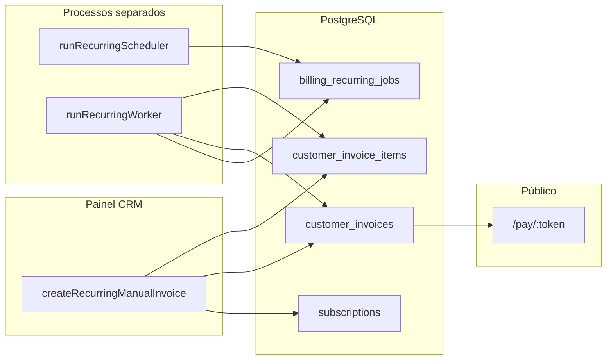

# Mapa técnico: faturas recorrentes (CRM) e link público

**Objetivo:** índice de arquivos, responsabilidades e fluxo de dados. Sem prescrever implementação.

---

## Visão rápida do fluxo

---

## Arquivos e responsabilidades

| Caminho | Responsabilidade |
|---------|------------------|
| `packages/backend/src/services/recurringBillingJobService.ts` | **Núcleo:** `enqueueRenewalJobs`, `processNextBatch`, `processOneCustomerRenewalJob`, `processChildItemDueInvoices`; lógica de itens recorrentes e gateway CRM. |
| `packages/backend/src/scripts/runRecurringScheduler.ts` | Entry: chama `enqueueRenewalJobs`, carrega `.env` da raiz do monorepo. |
| `packages/backend/src/scripts/runRecurringWorker.ts` | Entry: `processChildItemDueInvoices` + `processNextBatch`; `RECURRING_WORKER_ID` opcional. |
| `packages/backend/package.json` | Scripts `billing:scheduler`, `billing:worker`, `billing:reconciliation`. |
| `packages/backend/src/services/billingSubscriptionService.ts` | (Referenciado) `getSubscriptionById`, `updateSubscriptionAfterRenewal`, `expireCancelledSubscriptions`, etc. |
| `packages/backend/src/services/customerBillingService.ts` | `createManualInvoice`, **`createRecurringManualInvoice`**, `listInvoices`, `getInvoiceById`, fluxo público `completePaymentByToken` / pagamento por token. |
| `packages/backend/src/services/customerInvoiceService.ts` | **`createCustomerInvoice`** (worker), **`createChildCustomerInvoice`**, **`createManualCustomerInvoice`**, **`getByPaymentToken`**, `updateCustomerInvoiceSubscriptionLink`, itens. |
| `packages/backend/src/services/customerInvoiceSchema.ts` | Colunas opcionais (81/80); **`payment_token`** incluído em `selectList*`. |
| `packages/backend/src/controllers/publicCustomerInvoicesController.ts` | Rotas públicas `/api/public/customer-invoices/pay/:token` e ações relacionadas. |
| `packages/backend/src/services/billingLogger.ts` | `billingLog`, `notifyBillingJobFailed`. |
| `packages/backend/src/config/billingEnv.ts` | Flags E2 (`BILLING_CHILD_ITEM_INVOICES_ENABLED`, `BILLING_CHILD_BATCH_LIMIT`); Etapa 2: `BILLING_SCHEDULER_VERBOSE`, `BILLING_ALERT_ON_NO_INVOICE_CYCLE`. |
| `packages/backend/src/services/billingRecurringJobsOpsService.ts` | Resumo + listagem de `billing_recurring_jobs` para diagnóstico (Super Admin). |
| `packages/backend/src/services/recurringCustomerRenewalItemDueAnchor.ts` | Âncora de `itemDue` na renovação principal quando E2 está desligado. |
| `packages/backend/src/controllers/superadminBillingController.ts` | `GET /api/superadmin/billing/recurring-jobs` (Etapa 2). |
| `packages/backend/src/controllers/customerInvoicesController.ts` | `GET /api/customer-invoices/:id/recurrence-insight` — insight na tela da fatura. |
| `packages/backend/src/services/customerInvoiceRecurrenceInsightService.ts` | Subscription + último job (`billing_recurring_jobs`) para o bloco **Recorrência**. |
| `src/components/invoices/InvoiceRecurrenceBlock.tsx` | UI do card de recorrência no detalhe da fatura. |
| `packages/backend/src/routes/superadminRoutes.ts` | Rota `billing/recurring-jobs`. |
| `packages/backend/src/utils/db.ts` | `withBillingWorkerRlsBypass` — contexto para jobs. |
| `packages/backend/src/modules/payments/gatewayProvider.ts` | `getActiveGateway({ billingType: 'crm', tenantId })`. |
| `packages/backend/src/services/paymentGatewayConfigService.ts` | `getActiveConfig('crm', tenantId)`. |
| `database/init/67_subscriptions.sql` | DDL `subscriptions`. |
| `database/init/69_billing_recurring_jobs.sql` | DDL fila de jobs. |
| `database/init/77_payment_token_customer_invoices.sql` | Coluna `payment_token` + **`get_customer_invoice_by_payment_token`**. |
| `src/App.tsx` | Rota `"/pay/:token"`. |
| `src/pages/CustomerInvoicePay.tsx` | Consumo da API pública de pagamento. |
| `src/pages/CustomerInvoiceDetail.tsx` | Exibe link quando `payment_token` presente. |

---

## Onde a recorrência “nasce”

- **CRM:** `createRecurringManualInvoice` em `customerBillingService.ts`: cria `subscription` + primeira fatura via `createManualInvoice` + `updateCustomerInvoiceSubscriptionLink`.

---

## Onde a próxima fatura é gerada

- **Enfileiramento:** `enqueueRenewalJobs` → `subscriptions` com `status = 'active'` e `next_billing_date <= CURRENT_DATE` → `INSERT billing_recurring_jobs`.
- **Processamento:** `processNextBatch` → para `customer`, se não existir fatura para `(subscription_id, next_billing_date)`, **`processOneCustomerRenewalJob`**.
- **Persistência:** `createCustomerInvoice` em `customerInvoiceService.ts` + `INSERT customer_invoice_items` (com ou sem colunas avançadas conforme schema).

---

## Onde o link público é criado

- **Primeira fatura:** `createManualCustomerInvoice` — `payment_token` no `INSERT`.
- **Renovação:** `createCustomerInvoice` — `payment_token = crypto.randomUUID()` no `INSERT`.
- **Fatura filha (E2):** `createChildCustomerInvoice` — idem.

**Resolução:** função SQL `get_customer_invoice_by_payment_token` + `getByPaymentToken` no serviço.

---

## Onde a UI consome / exibe

- Detalhe da fatura (link copiável): `CustomerInvoiceDetail.tsx`.
- Página pública: `CustomerInvoicePay.tsx` → `GET /api/public/customer-invoices/pay/:token`.
- Chat (link em mensagem): `Chat.tsx` — `buildInvoiceLink(invoice.payment_token)`.

---

## Multi-tenant e gateways (pontos de atenção)

- Jobs carregam `tenant_id` em `billing_recurring_jobs`; processamento usa assinatura e `getActiveConfig('crm', tenant_id)`.
- `getByPaymentToken` carrega itens com `withTenantRlsContext(row.tenant_id, ...)`.
- Gateway CRM: `getActiveGateway({ billingType: 'crm', tenantId })`; erros de cobrança no worker são capturados e logados sem reverter a fatura criada.

---

## Checklist de diagnóstico rápido (produção)

1. Há processos rodando `billing:scheduler` e `billing:worker` com o mesmo banco que a API?  
2. Em `billing_recurring_jobs`: jobs `failed` com `error_message`? `cancelled` em volume?  
3. Jobs `completed` com `result_invoice_id` NULL em renovações customer — correlacionar com itens da fatura anterior.  
4. Em `customer_invoices`: novas linhas `invoice_type = recurring` e `payment_token` NOT NULL após a data esperada?  
5. Logs `[BILLING]` com `scheduler_exit` / `worker_exit` / `invoice_created`.
