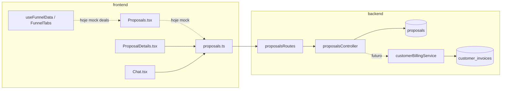

# Mapa técnico — Propostas / Orçamentos

Legenda de fluxo: **C** = criação, **L** = listagem, **V** = visualização, **E** = edição, **X** = exclusão, **S** = status/aceite, **F** = futuro faturamento.

---

## Banco de dados

| Caminho | Responsabilidade | Fluxo |
|---------|------------------|--------|
| `database/init/12_create_proposals.sql` | DDL `proposals`, índices, trigger `updated_at` | C, L, V, E, X, S |
| `database/init/57_rls_tenant_isolation.sql` | RLS `proposals_tenant_policy` | Isolamento multi-tenant |
| `database/init/70_customer_invoices.sql` | Faturas cliente (origem recorrente inicial) | **F** — destino conversão |
| `database/init/71_customer_invoices_manual_support.sql` | `origin`, `invoice_type`, `subscription_id` opcional | **F** — fatura manual |
| `database/init/76_customer_invoice_items.sql` | Linhas da fatura | **F** — cópia de itens da proposta |

---

## Backend — API e núcleo

| Caminho | Responsabilidade | Fluxo |
|---------|------------------|--------|
| `packages/backend/src/routes/proposalsRoutes.ts` | Monta router `/api/proposals` com auth CRM | C, L, V, E, X |
| `packages/backend/src/controllers/proposalsController.ts` | CRUD; filtros query; Zod; permissões create/edit/delete | C, L, V, E, X, S |
| `packages/backend/src/index.ts` | `app.use('/api/proposals', ...)` | Registro de rota |
| `packages/backend/src/services/modulePermissionsService.ts` | Definição módulo `proposals`, defaults *own* | Permissões |
| `packages/backend/src/permissions/permissionTypes.ts` | Tipo `ModuleId` inclui `proposals` | Permissões |
| `packages/backend/src/constants/features.ts` | Feature `proposals` | Habilitação produto |
| `packages/backend/src/utils/tenantSecurity.ts` | Lista de tabelas sensíveis inclui `proposals` | Segurança |
| `packages/backend/src/services/tenantUserRemovalService.ts` | Referência a módulo `proposals` | Operações de tenant |
| `packages/backend/src/controllers/dashboardController.ts` | KPI `proposals` (**implementação atual usa `contracts`**) | Métricas — **revisar** |
| `packages/backend/src/controllers/messageTemplatesController.ts` | Templates e eventos para `proposals` | Notificações / **F** `converted_to_invoice` |

### Backend — Faturamento (integração futura)

| Caminho | Responsabilidade | Fluxo |
|---------|------------------|--------|
| `packages/backend/src/controllers/customerInvoicesController.ts` | CRUD/lista faturas; schema create com `items` | **F** |
| `packages/backend/src/services/customerBillingService.ts` | `createManualInvoice`, pré-condições, gateway | **F** |
| `packages/backend/src/services/customerInvoiceService.ts` | Itens de fatura | **F** |

---

## Frontend — páginas e serviços

| Caminho | Responsabilidade | Fluxo |
|---------|------------------|--------|
| `src/services/proposals.ts` | Cliente REST tipado | C, L, V, E, X |
| `src/pages/Proposals.tsx` | Listagem **mock**; não chama API | **Gap** — L |
| `src/pages/ProposalDetails.tsx` | Detalhe real; aceite/recusa | V, S |
| `src/App.tsx` | Rotas `/proposals`, `/funnel/.../proposal/:proposalId` | Navegação |
| `src/layouts/AppLayout.tsx` | Menu Propostas + feature flag | Navegação |
| `src/components/RequireModuleView.tsx` | Módulo `proposals` para `/proposals` | Guard |
| `src/routePreload.ts` | Preload página Propostas | Performance |
| `src/hooks/useFunnelData.ts` | Funis reais + **deals mock** (`initialDeals`) | **Gap** — funil |
| `src/components/funnel/FunnelTabs.tsx` | Aba Propostas → `FunnelsList` com deals | **Gap** |
| `src/components/funnel/types.ts` | `FunnelType` inclui `proposals` | Modelo |
| `src/components/funnel/NewFunnelDialog.tsx` | Cria funil tipo propostas + estágios default | C funil |
| `src/pages/Dashboard.tsx` | Exibe KPI `proposals` | Métricas |
| `src/pages/Chat.tsx` | Cria proposta; notificação com link | C, **link inconsistente** |
| `src/services/dashboard.ts` | Tipos KPI | Métricas |
| `src/services/messageTemplates.ts` | Tipos `resource_type` inclui `proposals` | Templates |
| `src/components/settings/MessageTemplatesSection.tsx` | UI templates por módulo | Config |

---

## Permissões (seed)

| Caminho | Responsabilidade | Fluxo |
|---------|------------------|--------|
| `database/init/51_role_module_permissions.sql` | `proposals` para `admin` e `member` (*member* com *own* em edit/delete conforme serviço) | RBAC |

---

## Dependências entre partes

---

## Gaps explícitos (checklist rápido)

- [ ] `Proposals.tsx` → API real  
- [ ] Funil → propostas reais  
- [ ] Dashboard KPI → tabela correta ou rótulo ajustado  
- [ ] Link Chat ↔ rota de detalhe  
- [ ] `proposal_id` (ou equivalente) em faturas  
- [ ] Endpoint + UI “Gerar fatura”  
- [ ] Timeline / auditoria  
- [ ] Link público + permissões finas (`send`, `convert_to_invoice`)

---

*Documento gerado a partir da leitura do repositório em abril/2026; revisar após novas migrations ou refatorações do funil.*
