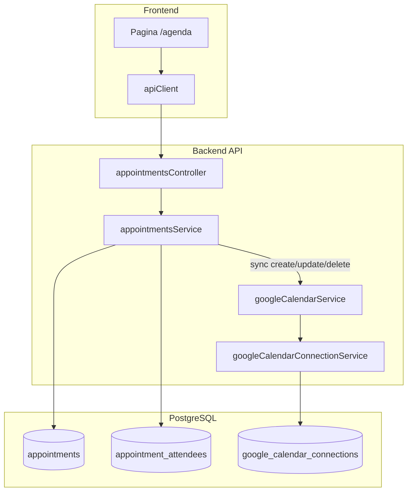

# Plano técnico: módulo Agenda / Compromissos (integração Google Calendar)

Documento de arquitetura e implementação em fases. **A Fase 1 (MVP)** deve ser implementada após aprovação deste plano, sem quebrar a integração OAuth existente.

**Data:** 2026-04-30 (rev.: decisões de nome, Google no criador, retentar sync, sem DELETE)  
**Contexto:** a ligação Google Agenda (OAuth) já funciona; `googleCalendarService` cria eventos com Meet e lista eventos no calendário primário do utilizador conectado.

---

## Convenções de nome (obrigatório)

| O quê | Nome / valor |
|--------|----------------|
| **Módulo** (permissões, `MODULE_IDS`, `canView('…')`, menu, `useFeatureFlag`) | sempre **`agenda`** |
| **Chave de feature** no plano / `useFeatureFlag` | **`agenda`** |
| **Rota** da aplicação | `/agenda` |
| Tabelas SQL (persistência) | `appointments`, `appointment_attendees` (nomes técnicos na BD) |
| Código (controllers, ficheiros) | pode usar `appointments` como sufixo (`appointmentsController`) — o produto fala em **Agenda** |

**Não usar** como id de módulo ou feature: `calendar_crm`, `appointments` (em permissões/flags), ou misturar com `calendar` genérico.

---

## 1. Investigação (estado atual do repositório)

### 1.1 Rotas protegidas (frontend)

- `src/App.tsx`: rotas de aplicação autenticada envolvidas em `AuthGuard` com `requireAuth={true}` e `AppLayout`.
- Padrão: rota de topo (ex. `/tasks`, `/clients`) com `lazy` + `Suspense` + `LoadingFallback`.
- **Ação para Agenda:** adicionar rota `/agenda` (e eventualmente `/agenda/:id`) com o mesmo padrão.

### 1.2 Menu lateral

- `src/layouts/AppLayout.tsx` — componente `Nav()`: grupos (CRM, Comercial, Atendimento, etc.) e `NavLinkItem` com `to`, `icon`, `preload`.
- Visibilidade: `useFeatureFlag('<feature>')` **e** `canView('<module>')` de `useModulePermissions()` (ex.: `show(hasTasks, 'tasks')`).
- **Ação:** novo item “Agenda” com `to="/agenda"`, ícone (ex. `Calendar`), `useFeatureFlag('agenda')` e `canView('agenda')`.
- Navegação móvel: `src/components/navigation/MobileAppNavigation.tsx` e `src/lib/mobileMoreQuickAccess.ts` — replicar entrada para teias móveis / “Mais”.

### 1.3 Permissões por tenant / utilizador

- Backend: `packages/backend/src/services/modulePermissionsService.ts` — `MODULE_IDS`, `MODULE_LABELS`, `getModulePermissionsSchema()`, tabela `role_module_permissions` (e perfis custom em `custom_role_module_permissions` via `modulePermissionsService` / `customRolesService`).
- Frontend: `src/contexts/ModulePermissionsContext.tsx` + `getMyPermissions()` em `src/services/modulePermissions.ts` (`/api/me/...`).
- Cada módulo tem `can_view`, `can_create`, `can_edit`, `can_delete` e opcional `edit_own_only` / `delete_own_only` (definido em `MODULES_SUPPORT_OWN`).
- **Estratégia recomendada para “ver só os meus” vs “ver todos”:**
  - **Base:** `agenda` com `supportsEditOwn` / `supportsDeleteOwn` = `true` e regra de listagem: se `!canEditRecord` com `edit_own` implícito… Na prática, o padrão do CRM é: **membro** com `edit_own_only` restringe por `responsible_user_id === currentUserId` nas queries; **manager/admin** vê todos (ou `manage_all` via `module_extras`).
  - **“agenda.manage_all”:** mapear para `module_extras` no módulo `agenda`, ex. `{ "manage_all": true }`, interpretado no serviço de listagem (semelhante a `proposals_manage_integrations` em propostas). Alternativa: roles `manager`/`admin` ignoram o filtro de responsável.
- **Ação:** adicionar `'agenda'` a `MODULE_IDS` e `MODULE_LABELS`, entrar `agenda` em `MODULES_SUPPORT_OWN` (edit/delete own por `responsible_user_id`), documentar `module_extras.agenda_manage_all` (ou nome acordado).

### 1.4 Clientes / leads (selects e autocomplete)

- Reutilizar os mesmos serviços que as páginas de CRM: listagens `/api/clients`, `/api/leads` (ou search existente) — confirmar no `clientsController` / `leadsController` os query params de pesquisa.
- Padrão de UI: `Combobox` / `Command` (shadcn) ou componentes já usados em propostas/contratos.
- **Fase 1:** um convidado interno = `responsible_user_id` (utilizadores do tenant via API de membros/equipas, se existir).

### 1.5 Migrations

- SQL versionado em `database/init/NNN_*.sql` e referência **obrigatória** no array `order` de `packages/backend/src/migrate.ts` (ficheiros novos **não** são descobertos automaticamente).
- Espelho Supabase: `supabase/migrations/YYYYMMDDHHMMSS_*.sql` quando o projeto usa Supabase CLI.
- Padrão de tabelas tenant-scoped: `tenant_id NOT NULL REFERENCES tenants`, índices por `tenant_id`, triggers `update_updated_at_column` onde existir coluna `updated_at`.

### 1.6 Integração Google Calendar atual

- Conexão: tabela `google_calendar_connections` (`159_google_calendar_connections.sql`); serviço `googleCalendarConnectionService` — chave lógica `(tenant_id, user_id)`.
- `packages/backend/src/services/googleCalendarService.ts`:
  - `createEvent(conn, { title, description, start, end, attendees?, createMeet? })` → `POST .../calendars/primary/events` com `conferenceDataVersion=1` se Meet.
  - `listEvents(conn, { timeMin, timeMax })` — já existente.
  - **Faltam para o módulo Agenda (Fase 1):** `updateEvent` (PATCH), `deleteEvent` ou `cancelEvent` (DELETE), extração explícita de link Meet (`hangoutLink` / `conferenceData` no JSON de resposta) — hoje `createEvent` devolve `hangoutLink` e `htmlLink`.
- **Regra de negócio (MVP, decidida):** o evento no **Google Calendar** é sempre criado/atualizado/cancelado na **conta Google do utilizador autenticado que cria o compromisso** (`req.userId` da sessão + `getConnectionForUser(tenantId, req.userId)`). **Não** usar a conta do `responsible_user_id`. Motivo: o responsável pode ainda não ter ligação Google, o que evita falhas e simplifica a UX. O `responsible_user_id` continua a ser puramente comercial/CRM.

### 1.7 Tarefas, lembretes, atividades existentes

- **Tarefas de projeto:** `project_tasks` (`08_create_projects.sql`) — escopo de projeto, não substitui agenda comercial.
- **Tarefas de lead/cliente:** `lead_tasks`, `client_tasks` em `04_create_leads_and_clients.sql` — estrutura antiga/paralela; **não reutilizar** como módulo Agenda unificado sem análise de produto.
- **Timeline de cliente:** `client_timeline_events` (`86_client_timeline_events.sql`) — **recomendado** para histórico CRM: ao criar/alterar/cancelar compromisso com `client_id`, inserir evento (`event_name`, `source: 'agenda'`, `reference_type: 'appointment'`, `reference_id: appointment.id`).

---

## 2. Arquitetura proposta



- **Regra de isolamento:** todas as queries filtram `tenant_id = requireTenantId(req)`.
- **Sincronização Google:** orquestrada no serviço de appointments após persistência (CRM primeiro; se Google falhar, `sync_status=error` + `sync_error` e o compromisso local mantém-se). **Conta Google:** só a do **criador** (autenticado), nunca a do `responsible_user_id`.
- **Referência Google na BD:** `google_calendar_connection_id` mapeia para `google_calendar_connections.id` do **utilizador que fez o sync** (o criador).

---

## 3. Modelo de dados

### 3.1 Tabela `appointments`

Ajustes sugeridos em relação ao enunciado:

| Coluna | Tipo | Notas |
|--------|------|--------|
| `id` | UUID PK | `gen_random_uuid()` |
| `tenant_id` | UUID NOT NULL FK `tenants` | |
| `client_id` | UUID NULL FK `clients` | CHECK: não obrigar lead e client simultaneamente se produto proibir |
| `lead_id` | UUID NULL FK `leads` | |
| `responsible_user_id` | UUID NULL FK `users` | responsável comercial no CRM |
| `title` | TEXT NOT NULL | |
| `description` | TEXT | |
| `type` | TEXT NOT NULL DEFAULT `'meeting'` | CHECK: valores fechados na app (`meeting`, `call`, `visit`, …) |
| `status` | TEXT NOT NULL DEFAULT `'scheduled'` | ex.: `scheduled`, `done`, `cancelled` |
| `starts_at` / `ends_at` | TIMESTAMPTZ | `ends_at > starts_at` (CHECK) |
| `location` | TEXT | |
| `create_google_event` | BOOLEAN DEFAULT false | desejo do utilizador; exige conexão Google |
| `google_calendar_connection_id` | UUID NULL FK `google_calendar_connections` | preenchido quando sync usou essa conexão |
| `google_event_id` | TEXT | id do evento no Google |
| `google_meet_link` / `google_html_link` | TEXT | |
| `sync_status` | TEXT DEFAULT `'not_synced'` | `not_synced`, `synced`, `error`, `cancelled` |
| `sync_error` | TEXT | mensagem **sanitizada** (sem stack/tokens) |
| `reminders_json` | JSONB NULL | opcional Fase 1: echos para o payload Google |
| `created_by` / `created_at` / `updated_at` / `cancelled_at` | conforme padrão | trigger `updated_at` |

**Índices (conforme enunciado):** `(tenant_id, starts_at)`, `tenant_id`, `responsible_user_id`, `client_id`, `status`, e índice útil em `(google_event_id)` com filtro `WHERE google_event_id IS NOT NULL` se necessário.

**RLS:** alinhar a `89_rls_sensitive_tables.sql` e políticas por `tenant_id` (padrão do projeto para APIs que usam pool de app).

### 3.2 Tabela `appointment_attendees`

- FK `appointment_id` → `appointments ON DELETE CASCADE`.
- `attendee_type`: ex. `internal` | `external` | `client` (definir enum CHECK ou documentação).

### 3.3 Migração

- Ficheiro: `database/init/165_appointments_module.sql` (número a seguir ao último usado no `migrate.ts` no merge).
- Entrada no `migrate.ts` e ficheiro espelhado em `supabase/migrations/`.

---

## 4. API (backend)

Base path sugerida: `/api/appointments` (registar router em `packages/backend/src/index.ts` com `authenticateToken`, `setCurrentTenant`, `setRequestDb` como restantes rotas CRM).

### 4.1 `GET /api/appointments`

**Query (todos opcionais):** `date_from`, `date_to` (ISO 8601), `responsible_user_id`, `client_id`, `lead_id`, `status`, `type`. Paginação: `limit`, `offset` (padrão do projeto).

**Autorização:** `agenda` `can_view`. Filtragem “só meus” se perfil com `edit_own_only` (ou sem `module_extras.manage_all`): `responsible_user_id = req.userId` **ou** `created_by = req.userId` (regra a fixar e documentar no código).

**Resposta:** lista de DTOs com campos necessários à lista + contagem de convidados (opcional).

### 4.2 `GET /api/appointments/:id`

Detalhe completo + `attendees` (join ou segundo query).

**Autorização:** view + ownership / manage_all.

### 4.3 `POST /api/appointments`

**Body (exemplo):**

```json
{
  "title": "Reunião comercial",
  "description": "…",
  "type": "meeting",
  "client_id": "uuid-ou-null",
  "lead_id": "uuid-ou-null",
  "responsible_user_id": "uuid-ou-null",
  "starts_at": "2026-05-10T15:00:00-03:00",
  "ends_at": "2026-05-10T16:00:00-03:00",
  "location": "…",
  "attendees": [
    { "name": "Ana", "email": "ana@acme.com", "phone": null, "attendee_type": "external" }
  ],
  "create_google_event": true,
  "create_meet": true,
  "reminders": [ { "method": "popup", "minutes": 10 } ]
}
```

**Comportamento:**

1. Inserir `appointments` + `appointment_attendees`.
2. Se `create_google_event` e existir `getConnectionForUser(tenantId, req.userId)` (sempre o **criador**; ver convenções acima):
   - chamar `createEvent` com `attendees` com emails válidos, `createMeet: create_meet`.
   - atualizar linha com `google_event_id`, links, `sync_status=synced`, `google_calendar_connection_id`.
3. Se Google falhar: `sync_status=error`, `sync_error` (mensagem curta), compromisso mantém-se.
4. Se `client_id`: inserir `client_timeline_events` (ver §1.7).

**Autorização:** `agenda` `can_create`.

### 4.4 `PATCH /api/appointments/:id`

Atualizar campos; se `google_event_id` existir, mapear para `PATCH` Calendar API; se alterar hora/local/participantes, refletir no Google.

**Autorização:** `can_edit` + `canEditRecord(..., responsible_user_id)`.

### 4.5 `POST /api/appointments/:id/cancel`

`status='cancelled'`, `cancelled_at=now()`. Se houver `google_event_id`, remover ou cancelar o evento no Google com a conexão do **criador** (mesma regra que a criação). Não fazer apagar linha do CRM: mantém-se histórico (soft cancel).

**Autorização:** idem edição.

### 4.6 `POST /api/appointments/:id/retry-sync` (Fase 1 — **obrigatório**)

- **Uso:** compromissos com `sync_status = 'error'` (e opcionalmente `not_synced` com `create_google_event = true`), para o utilizador **retentar** a sincronização.
- **Comportamento:** repetir a lógica de criação/actualização no Google usando **sempre** `getConnectionForUser(tenantId, req.userId)`; actualizar `sync_status` / `sync_error` / `google_event_id` / links em caso de sucesso ou falha.
- **Autorização:** `agenda` `can_edit` + regra de dono/ `manage_all` (quem puder editar o registo).
- **Frontend (Fase 1):** botão **“Sincronizar novamente”** visível quando `sync_status === 'error'`, a chamar este endpoint; feedback toast de sucesso/erro.

**DELETE** físico: **fora do MVP** (sem `DELETE /api/appointments/:id`). Cancelamento = §4.5. Futuras fases podem reavaliar apagar apenas com papel superprivilegiado.

### 4.7 Integração com plano (feature flag)

- Incluir chave de feature **`agenda`** na resposta de features do tenant/plano (`myTenantPlanController` / tabela de features) para `useFeatureFlag('agenda')` no front. **Não** introduzir chave paralela (ex. `calendar_crm`).

---

## 5. Serviço Google (extensões)

| Função | Descrição |
|--------|-------------|
| `updateCalendarEvent(conn, eventId, patch)` | `PATCH` em `.../calendars/primary/events/{eventId}` |
| `deleteCalendarEvent(conn, eventId)` | `DELETE` no mesmo path |
| `extractMeetAndLinks(json)` | Normalizar `hangoutLink`, `htmlLink` da resposta |
| (opcional) `listEvents` | já existe — útil para debug ou sync bidirecional fase 2 |

**Lembretes (reminders):** o payload Calendar API suporta `reminders` no resource `event`; adicionar ao `createEvent` / `updateEvent` quando o frontend enviar.

---

## 6. Frontend (Fase 1)

| Área | Entrega |
|------|--------|
| Rota | `/agenda` lazy em `App.tsx` |
| Menu | `AppLayout` + `MobileAppNavigation` + `mobileMoreQuickAccess` |
| Página | `src/pages/Agenda.tsx` (ou pasta `src/pages/agenda/`) — header, filtros, lista agrupada por dia |
| Criação | `Sheet` / `Dialog` “Novo compromisso” com form + queries React Query |
| Sincronização | Itens com **erro** de Google: ação **“Sincronizar novamente”** → `POST .../retry-sync` |
| Vazio | CTA + mensagem amigável |
| Google | se `!connected` (via `/api/integrations/google/status` ou contexto mínimo), `Alert` com link para `/settings/integrations` — texto **apenas de produto** (ex.: “Conecte a sua conta Google…”), **sem** referência a tokens, cifra ou termos técnicos na UI |
| i18n | PT (padrão do produto) |

**Não** incluir calendário mensal completo na Fase 1 se comprometer o prazo — lista + filtros é aceite.

---

## 7. Permissões (resumo prático)

| Código (documental) | Implementação sugerida |
|---------------------|------------------------|
| agenda.view | `can_view` no módulo `agenda` |
| agenda.create | `can_create` |
| agenda.update | `can_edit` + regra own / manage |
| agenda.delete | `can_delete` + regra own / manage |
| agenda.manage_all | `module_extras.agenda_manage_all` **ou** role `manager`/`admin` a ignorar filtro de responsável |

“Utilizador comum” = membro com `edit_own_only`: vê/ edita compromissos onde é `responsible_user_id` (ou `created_by`, conforme regra única acordada).

---

## 8. Plano de implementação por fases

| Fase | Conteúdo |
|------|----------|
| **Fase 1 (MVP)** | Módulo e feature **`agenda`**. Migrations `appointments` + `appointment_attendees`. RLS. API: GET/POST/PATCH, `POST .../cancel`, **`POST .../retry-sync`**. Google só na **conta do utilizador autenticado (criador)**. Integração create/update + cancel no Google; **botão** “Sincronizar novamente” para `sync_status=error`. **Sem** DELETE. Timeline opcional. Página `/agenda` (lista, filtros, modal). Textos de integração **sem** jargão de tokens. Checklist de testes. |
| **Fase 2** | Sincronização import (webhook ou polling) Google → CRM; conflitos; lembretes padrão; export ICS. |
| **Fase 3** | Vista calendário semana/mês; reagendamento drag; notificações in-app. |
| **Fase 4** | Recorrência; equipas múltiplas; relatórios. |

---

## 9. Riscos e mitigação

| Risco | Mitigação |
|-------|------------|
| Google não devolve `refresh_token` em reconexões | Já tratado no `upsertConnection`; manter. |
| Falha parcial (CRM gravado, Google não) | `sync_status=error` + `POST /retry-sync` e botão **Sincronizar novamente** na Fase 1. |
| Fuso horário | Guardar always **UTC** no DB, exibir com timezone do user (`profiles.timezone` se existir). |
| Cota / rate limit Google | Backoff, mensagem ao user, logs sem tokens. |
| RLS muito restritivo | Testar com dois utilizadores do mesmo tenant e outro tenant. |
| `lead_id` + `client_id` | CHECK DB ou validação: no máximo um, ou regra de negócio explícita. |

---

## 10. Checklist de testes (aceite)

- [ ] Menu “Agenda” visível com plano que inclui feature `agenda` e permissão de visualização.
- [ ] Criar compromisso **sem** Google: aparece na lista, `sync_status` adequado, sem erros 500.
- [ ] Criar com Google + Meet: `google_event_id` preenchido, links Meet/html na UI (evento na **conta do utilizador** que cria, não a do `responsible_user_id`).
- [ ] Vincular cliente/lead: FK correta; timeline do cliente com evento (se Fase 1 implementar timeline).
- [ ] Após falha de sync: `sync_status=error` e **“Sincronizar novamente”** (retry) conduz a sucesso corrigindo estado.
- [ ] PATCH altera no CRM e no Google quando sync existir.
- [ ] Cancelar: histórico no CRM (`cancelled`); no Google, evento removido/ cancelado; **não** existe DELETE físico no MVP.
- [ ] Filtros (datas, status, responsável) corretos.
- [ ] UI: sem mensagens técnicas sobre “tokens” ou cifrados (apenas copy de produto, alinhada a `GoogleCalendarSection`).
- [ ] Utilizador tenant A **não** lê `GET /api/appointments` de outro `tenant_id` (teste de API com token outro tenant).
- [ ] OAuth existente: `/api/integrations/google/connect` inalterado em comportamento; regressão zero em `googleCalendarService` básico (só adiciona funções novas).
- [ ] Nenhum segredo (tokens) em respostas JSON de erro ou logs.

---

## 11. Próximo passo

1. Revisar este documento (produto + tech lead).  
2. **Decisão congelada:** evento no Google = **só a conta do utilizador autenticado que cria/retenta o compromisso** (não o responsável).  
3. Implementar **Fase 1** conforme secções 3–6 e **4.6** (`retry-sync`), com PRs pequenos (migrations + backend + frontend + feature `agenda` no plano).  
4. Garantir copy de integração **sem** termos técnicos na UI (ex. configurações Google: ver `src/components/settings/GoogleCalendarSection.tsx`).

---

**Referências de ficheiros**

- Rotas: `src/App.tsx`, `AuthGuard`
- Menu: `src/layouts/AppLayout.tsx`
- Permissões: `packages/backend/src/services/modulePermissionsService.ts`, `src/contexts/ModulePermissionsContext.tsx`
- Migrations: `packages/backend/src/migrate.ts`, `database/init/`
- Google: `packages/backend/src/services/googleCalendarService.ts`, `.../googleCalendarConnectionService.ts`, `.../googleCalendarIntegrationController.ts`
- Timeline: `database/init/86_client_timeline_events.sql`
