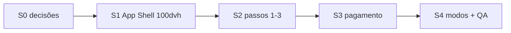

# Plano de sprints — Checkout `/checkout` (shell app · 100vh)

| Campo | Valor |
|-------|-------|
| **Data** | 2026-08-12 |
| **Tipo** | Plano de implementação (UX / front) |
| **Base** | [`PLANO-EXECUTIVO-FASE1-CHECKOUT-UNICO.md`](./PLANO-EXECUTIVO-FASE1-CHECKOUT-UNICO.md) · [`PLANO-TECNICO-CHECKOUT-REGISTRO-UNICO.md`](./PLANO-TECNICO-CHECKOUT-REGISTRO-UNICO.md) · [`PLANO-MESTRE-FLUXO-CONTRATACAO-NOVAS-EMPRESAS.md`](./PLANO-MESTRE-FLUXO-CONTRATACAO-NOVAS-EMPRESAS.md) |
| **Nome** | **Checkout UX App Shell — viewport fixo + contratação em etapas** |
| **Escopo** | Reorganização visual e de usabilidade do `/checkout` (`PlanCheckout.tsx`) para sensação de aplicativo: **sempre ~100vh**, chrome fixo (progresso + CTAs), conteúdo por passo sem scroll de página |
| **Princípio** | Fluxo e regras de negócio **permanecem**; muda **layout, densidade e hierarquia**. Sem alterar contratos de API (`plan-purchase`, trial, resume/renew/seat_addon) salvo necessidade pontual de UI |
| **Status** | **S0 · S1 · S2 · S3 · S4 feitos** — épico checkout app shell concluído |
| **Próximo** | QA manual em staging (matriz §6.4) |

---

## 1. Meta

Transformar a tela de contratação (`/checkout`) num **wizard em viewport fixo** (desktop e mobile), com impressão de app:

1. A página ocupa **100% da altura útil da viewport** (`100dvh` / `100vh` com fallback).
2. Em cada passo, o usuário **avança sem precisar rolar a página** para achar **Voltar / Continuar / Pagar**.
3. Layout e usabilidade **superiores** ao estado atual (já funcional), com hierarquia clara: progresso → conteúdo do passo → ações.
4. Manter todos os modos existentes: contratação nova, plano pré-selecionado (landing), resume, renew, seat_addon, trial, PIX / boleto / cartão.

**Fora de escopo deste plano:** redesign da landing, loja pública (`StorePublicCheckout`), billing interno SaaS dedicado (`InternalBillingCheckout`), mudanças de pricing/backend.

---

## 2. Diagnóstico — como está hoje

| Peça | Comportamento atual | Gap vs meta 100vh |
|------|---------------------|-------------------|
| **Shell** | `PlanCheckout` envolvido em `LandingLayout` → **Navbar + conteúdo + Footer** | Footer + paddings (`py-6`) empurram altura além da viewport → **scroll de página** |
| **Estrutura** | Título H1 + stepper em pills + `Card` com header/descrição + conteúdo do passo + botões **dentro** do fluxo do card | CTAs não ficam ancorados; em mobile somem abaixo da dobra |
| **Passos** | 1 Plano → 2 Empresa/admin → 3 Resumo → 4 Pagamento (`STEP_DEFS`) | Conteúdo denso (cards de plano, formulário longo, QR PIX `h-56`) compete com viewport |
| **Densidade** | Helper texts, badges, blocos de resumo repetidos no passo 4 | Redundância visual consome altura sem ganho de clareza |
| **Mobile** | Layout responsivo ok, mas **página rolável** | Não passa sensação de “app step-by-step” |
| **Lógica** | Persistência sessionStorage, validações, payment polling — estáveis | **Não mexer** salvo o necessário para montar o shell |

**Conclusão:** o produto do checkout está ok; o gap é **chrome de página de marketing** + **conteúdo vertical sem orçamento de altura**. A solução é um **Checkout App Shell** dedicado (sem Footer de landing) + densificação por passo + CTAs sticky.

---

## 3. Visão de UX alvo

```
┌─────────────────────────────────────────────┐
│  [Logo]  Checkout — Plano X     ·  compact  │  ← header fixo (~48–56px)
│  ● Plano ── ● Empresa ── ○ Resumo ── ○ Pag. │  ← stepper fino
├─────────────────────────────────────────────┤
│                                             │
│         Conteúdo do passo atual             │  ← flex-1; overflow interno
│         (único scroll permitido,            │     só se o passo estourar
│          se inevitável)                     │     (ex.: teclado iOS)
│                                             │
├─────────────────────────────────────────────┤
│  [ Voltar ]              [ Continuar → ]    │  ← footer de ações sempre visível
└─────────────────────────────────────────────┘
         = 100dvh (sem scroll da página)
```

### Princípios de layout

| ID | Princípio |
|----|-----------|
| **P1** | **Página não rola.** Só o painel central pode ter `overflow-y-auto` como escape hatch. |
| **P2** | **CTAs sempre visíveis** no rodapé do shell (safe-area iOS incluso). |
| **P3** | **Um job por passo** — título curto; descrição de 1 linha no máximo (ou omitida em mobile). |
| **P4** | **Densidade progressiva** — desktop pode usar 2 colunas; mobile prioriza campos essenciais acima da dobra. |
| **P5** | **Preservar lógica** — mesmos `step` ids, validações, modos e APIs. |
| **P6** | **Escape hatch documentado** — teclado virtual, zoom a11y, muitos planos, formulário de cartão: scroll **interno** ok; scroll de `body` não. |

---

## 4. Decisões de produto — **fechadas (S0 · 2026-08-12)**

| ID | Decisão | Fechado |
|----|---------|---------|
| **D1** | Remover **Footer** da landing no `/checkout` | **Sim** — shell próprio; landing/home mantém Footer |
| **D2** | Navbar full da landing vs header compacto | **Header compacto** no shell: logo + título curto do modo; à direita link **“Já tenho conta”** (`/login`) se anônimo, ou atalho conta/painel se logado. Sem âncoras #recursos/#planos |
| **D3** | Stepper | **Mobile:** dots + label só do passo ativo. **Desktop (`sm+`):** labels de todos os passos visíveis (estilo compacto, não pills altas). Altura alvo do bloco stepper ≤ ~36px |
| **D4** | Passo 2 cabe em 100vh? | **Desktop:** sim, grid 2 colunas densificado. **Mobile:** densificar gaps/helpers; **scroll interno do `main` permitido** quando teclado virtual abrir (P6) |
| **D5** | QR PIX | **Desktop:** split QR \| copia-cola. **Mobile:** QR **160px** (piso; ampliar opcional em S3/S4). Remover `h-56` (224px) atual |
| **D6** | Passo Resumo (3) | **Manter passo 3 separado** (confirmação rápida). **Não** fundir UI com pagamento no mobile — preserva stepper e validações |
| **D7** | Token CSS | **Tokens existentes** (landing / shadcn do app). Sem tema novo; sem purple-on-white genérico |
| **D8** | Escopo “sem scroll” | **Sem scroll de `document`/`body`** nos viewports de referência (§6.1) nos passos 1–3 e no passo 4 pré-QR. Overflow **interno** do `main` ok para: teclado, ≥4 planos, formulário cartão, QR+extras |

---

## 5. Visão dos sprints

| Sprint | Nome | Objetivo | Depende |
|--------|------|----------|---------|
| **S0** | Decisões + inventário | Fechar D1–D8; mapear altura por passo/modo; checklist de regressão | — |
| **S1** | Checkout App Shell | Layout `100dvh`, header + main + footer CTAs; sair do Footer da landing | S0 |
| **S2** | Densidade passos 1–3 | Plano / Empresa / Resumo cabem no painel com CTAs visíveis | S1 |
| **S3** | Densidade passo 4 (pagamento) | Métodos + PIX/boleto/cartão + estados de espera no viewport | S2 |
| **S4** | Modos especiais + polish | resume / renew / seat_addon / trial / upgrade; motion leve; a11y; QA matrix | S3 |



Ordem recomendada: **S0 → S1 → S2 → S3 → S4**. Não pular S1: sem shell, densificar conteúdo não resolve CTAs fora da dobra.

---

## 6. S0 — Decisões e inventário — **FEITO (2026-08-12)**

### Meta

Alinhar produto/design e registrar riscos de altura **antes** de codar o shell.

### Aceite S0

- [x] D1–D8 fechadas por escrito (§4).
- [x] Inventário de altura (§6.1–§6.3).
- [x] Sem código de UI neste sprint (spike opcional adiado para S1).

### Fora de S0

- Implementação do shell (→ S1).

---

### 6.1 Viewports de referência

| Nome | Largura × altura | Uso |
|------|------------------|-----|
| **M-360** | 360 × 740 | Android compacto (pior altura útil) |
| **M-390** | 390 × 844 | iPhone típico |
| **T-768** | 768 × 1024 | Tablet portrait |
| **D-1280** | 1280 × 800 | Desktop notebook (pior desktop) |
| **D-1440** | 1440 × 900 | Desktop confortável |

Critério D8: nestes viewports, **`document.documentElement.scrollHeight ≤ clientHeight`** (sem scroll de página) nos cenários “conteúdo médio” definidos em §6.3.

---

### 6.2 Orçamento do shell alvo

Chrome fixo proposto (S1):

| Zona | Altura alvo | Notas |
|------|-------------|-------|
| Header compacto | **48–56px** | Logo + título; safe-area top |
| Stepper | **28–36px** | D3 |
| Footer ações | **56–64px** + safe-area bottom | Voltar / Continuar |
| **Soma chrome** | **~140–160px** | + safe-areas (~0–34px iOS) |
| **Painel `main` (orçamento)** | `dvh − chrome` | Ver tabela abaixo |

| Viewport | `dvh` | Chrome ~152px | **Orçamento main** |
|----------|-------|---------------|-------------------|
| M-360 | 740 | 152 | **~588px** |
| M-390 | 844 | 152 | **~692px** |
| D-1280 | 800 | 152 | **~648px** |
| D-1440 | 900 | 152 | **~748px** |

Comparativo **hoje** (estimado, causa scroll de página):

| Peça atual | Altura típica |
|------------|---------------|
| Navbar landing `fixed` `h-16` | 64px (conteúdo pode iniciar sob ela — `PlanCheckout` não usa `pt-16`) |
| Título H1 + subtítulo + `mb-6` | ~72–96px |
| Stepper pills | ~40px |
| Card header + description | ~64–80px |
| Padding `py-6` | 48px |
| Footer landing `py-12` + links | **~180–220px** |
| **Total chrome + marketing** | **~470–580px** antes do miolo do passo |

→ Só o Footer já consome ~25–30% de um mobile 740px. Removê-lo (D1) é pré-requisito do 100vh.

---

### 6.3 Inventário por passo (altura do miolo vs orçamento)

Estimativas do **conteúdo do passo** (sem Footer landing). “Estoura?” = miolo + chrome shell > `dvh` no pior viewport (M-360 / D-1280).

| Passo | Conteúdo atual (estimativa) | Cabe no orçamento main? | Ação |
|-------|----------------------------|-------------------------|------|
| **1 Plano** (1 plano, selecionado + benefícios curtos) | ~420–560px | Desktop: sim / Mobile: **marginal** | S2: benefícios colapsáveis / lista curta; reduzir `min-h` cards |
| **1 Plano** (≥3 planos, mobile lista) | ~700px+ | **Não** sem scroll interno | S2: lista densa + scroll **só no main** (P6) |
| **2 Empresa/admin** (anônimo, 2 col desktop) | Desktop ~320px / Mobile empilhado ~520–600px | Desktop: sim / Mobile: **marginal** + teclado | S2 densificar; teclado → scroll main (D4) |
| **2 Upgrade** (só telefone) | ~120px | Sim | — |
| **3 Resumo** contratação | ~280–360px | Sim | S2: bloco único; CTAs no shell |
| **3 Resumo** seat_addon | ~320–400px | Sim | Idem |
| **4 Pagamento** pré-cobrança (método + CPF + resumo) | ~380–480px | Sim após compactar | S3 |
| **4 PIX** com QR `h-56` (224px) + copia + status | ~620–750px | **Não** no M-360 | S3: QR 160px + split desktop (D5) |
| **4 Cartão** inline | ~560–700px | Overflow interno ok | S3/S4 (P6) |
| **4 Confirmado** | ~200px | Sim | — |

**Modos com menos passos** (`resume` / `renew` / `seat_addon`): menos pressão no stepper; mesmo shell. Inventário do passo 4 aplica-se igual.

---

### 6.4 Checklist de regressão (S4)

| Fluxo | Código (estrutura) | Desktop (manual) | Mobile (manual) |
|-------|--------------------|------------------|-----------------|
| Contratação anônima completa (PIX) | [x] shell + passos + gerar cobrança | ☐ | ☐ |
| Plano pré-selecionado (`skipPlanStep`) | [x] stepper omite plano | ☐ | ☐ |
| Trial CTA no resumo | [x] CTA densificado S2 | ☐ | ☐ |
| Cartão inline | [x] form no passo 4 | ☐ | ☐ |
| Boleto | [x] UI compacta S3 | ☐ | ☐ |
| `mode=renew` | [x] shell + loader + títulos | ☐ | ☐ |
| `mode=resume` | [x] shell + loader + títulos | ☐ | ☐ |
| `mode=seat_addon` | [x] stepper 2 passos + CTAs | ☐ | ☐ |
| Upgrade logado | [x] passo 2 só telefone | ☐ | ☐ |
| Voltar + sessionStorage | [x] `handleBack` / persist intactos | ☐ | ☐ |
| Sem scroll de `document` (passos 1–3) | [x] overflow hidden no shell | ☐ | ☐ |
| Teclado mobile passo 2 | [x] visualViewport + scrollIntoView + esconde footer | ☐ | ☐ |
| QR PIX ampliar (tap) | [x] overlay S4 | ☐ | ☐ |
| `prefers-reduced-motion` | [x] classes `motion-safe:*` | ☐ | ☐ |

---

### 6.5 Implicações diretas para S1

1. **Não** reutilizar `LandingLayout` as-is (traz Footer + Navbar marketing).
2. Preferir componente **`CheckoutAppShell`** com slots; `PlanCheckout` só preenche conteúdo/ações.
3. Mover CTAs dos `render*` para `footerActions` já no S1 (mesmo que passos ainda altos — CTAs ficam na dobra).
4. `overflow-y-auto` no `main` desde o dia 1 (escape hatch); meta de “quase zero scroll” vem em S2/S3.
5. Usar `h-dvh` com fallback `h-screen`; incluir `pb-[env(safe-area-inset-bottom)]` no footer de ações.

---

## 7. S1 — Checkout App Shell (100dvh) — **FEITO (2026-08-12)**

### Meta

Criar o **esqueleto** da experiência app: altura travada, chrome fixo, CTAs sempre na dobra — **sem** ainda otimizar cada passo ao detalhe.

### Entregas

1. **`CheckoutAppShell`** — `src/components/checkout/CheckoutAppShell.tsx`
   - `100vh` / `100dvh`, flex column, `overflow` travado em `html`/`body` enquanto montado
   - slots: header, stepper, children, footerActions
   - `main` com `flex-1 min-h-0 overflow-y-auto`
   - safe-area top/bottom
2. **`CheckoutShellHeader`** + **`CheckoutCompactStepper`** (D2/D3)
3. **`PlanCheckout`** deixa de usar `LandingLayout` (sem Footer/Navbar marketing); mantém tokens via classe `landing-page`
4. CTAs Voltar / Continuar / Gerar cobrança / Cancelar no **footer** do shell
5. Títulos/descrições enxutos no painel

### Aceite S1

- [x] Shell em viewport fixo; scroll de documento bloqueado via overflow hidden
- [x] Botões de navegação no rodapé do shell (sempre na dobra)
- [x] Footer da landing **ausente** no `/checkout`
- [x] Fluxo de passos 1→4 preservado (mesma lógica de `handleNext` / pagamento)
- [x] resume/renew/seat_addon usam o mesmo shell (stepper filtrado como antes)

### Fora de S1

- Compactação agressiva dos cards de plano / QR (→ S2/S3).

---

## 8. S2 — Densidade e hierarquia (passos 1–3) — **FEITO (2026-08-12)**

### Meta

Cada um dos passos **Plano**, **Empresa e admin** e **Resumo** caber no painel central na maioria dos viewports de referência, com scroll interno raro.

### Entregas feitas

#### 8.1 Passo 1 — Plano
- Cards mais compactos (padding/gaps menores; sem `min-h` fixo)
- Benefícios: preview de 4 itens + toggle “Ver todos” (fechado por padrão)
- Intervalo / usuários mantidos no card selecionado

#### 8.2 Passo 2 — Empresa e admin
- Gaps menores; helpers removidos (WhatsApp via `title` no label)
- Senha + confirmação sem título extra longo

#### 8.3 Passo 3 — Resumo
- Bloco único de confirmação (plano + empresa + valor)
- Trial CTA mais baixo (menos padding / botão menor)
- seat_addon resumido (assentos em uma linha)

### Aceite S2

- [x] Passos 1–3 densificados para caber melhor no `main` do shell
- [x] Seleção de plano + intervalo + usersCount intactos
- [x] `validateStep2` / identidade inalterados
- [x] Tokens existentes (`landing-page` / design system)

### Fora de S2

- Pagamento / QR / cartão (→ S3).

---

## 9. S3 — Passo 4 (pagamento) no viewport — **FEITO (2026-08-12)**

### Meta

Escolha de método + geração de cobrança + estados PIX/boleto/cartão/confirmado caberem na sensação app, com CTAs/ações críticas na dobra.

### Entregas feitas

1. Resumo financeiro **único** (plano + valor + conta numa linha; sem bloco empresa duplicado)
2. Seletor de métodos **baixo** (ícone + label; description em `sr-only` / `title`)
3. **PIX:** grid split desktop (QR | copia-cola + status); QR **160px** (`h-40`) no mobile; status com spinner
4. **Boleto:** linha digitável + links compactos
5. **Cartão:** alerta curto + formulário inline (scroll interno do `main` se necessário)
6. Confirmado / loading compactos
7. Pix Automático em wrapper baixo

### Aceite S3

- [x] PIX gerado: QR reduzido + copia-cola + status no layout split
- [x] Cartão: submit permanece no formulário; CTAs de shell (Voltar) na dobra
- [x] Polling / confirmação / redirect inalterados (só UI)
- [x] seat_addon / renew usam o mesmo bloco compacto de valor

### Fora de S3

- Novos meios de pagamento ou mudança de gateway.
- Ampliar QR opcional (tap) — pode entrar em S4 se necessário.

---

## 10. S4 — Modos especiais, polish e QA — **FEITO (2026-08-12)**

### Meta

Fechar regressão em todos os modos e polish de produto (micro-interações, a11y, teclado).

### Entregas feitas

1. **Modos** no mesmo shell: resume/renew (loader `min-h` + títulos), seat_addon, trial, upgrade, `skipPlanStep` — lógica intacta
2. Loader / erro de hub centralizados no painel do shell (sem quebrar `100dvh`)
3. **Motion** (respeita `prefers-reduced-motion` via `motion-safe:`):
   - transição do painel ao mudar `step`
   - highlight do stepper (scale no dot ativo)
   - feedback leve no CTA Continuar (`active:scale`)
4. **A11y:** foco no `h2` do passo (`tabIndex={-1}` + `focus({ preventScroll })`); `aria-current` / `aria-live` no stepper; `role="alert"` no erro de hub
5. **Teclado mobile:** `visualViewport` → padding no `main` + esconde footer enquanto teclado aberto; `scrollIntoView` no `focusin` de inputs
6. **QR PIX:** tap para ampliar (overlay 256–288px) + Escape / clique fora para fechar
7. Matriz §6.4 atualizada (coluna código marcada; desktop/mobile manuais para staging)

### Aceite S4

- [x] Matriz QA no doc (§6.4) com coluna de estrutura de código
- [x] Sem mudança de contratos de API / polling
- [x] Status do plano = S0–S4 feitos
- [ ] Checklist desktop/mobile em staging (responsável: QA / produto)

### Fora de S4

- Mudanças de gateway ou novos meios de pagamento

---

## 11. Arquivos prováveis (orientação, não contrato rígido)

| Área | Arquivos |
|------|----------|
| Página | `src/pages/PlanCheckout.tsx` |
| Shell novo | `src/components/checkout/CheckoutAppShell.tsx` (nome livre) |
| Layout landing | `src/landingpage/components/LandingLayout.tsx` (não alterar para toda landing; checkout **para de usá-lo** ou ganha prop `variant="app"`) |
| Display helpers | `src/lib/planCheckoutDisplay.ts` (só se precisar de labels mais curtos) |
| Pagamento cartão | `src/components/payments/InlineCreditCardPaymentForm.tsx` (ajustes de densidade se necessário) |
| Rota | inalterada (`/checkout`) |

**Backend:** não esperado neste épico.

---

## 12. Riscos e mitigações

| Risco | Mitigação |
|-------|-----------|
| Muitos planos no catálogo | Lista com scroll **interno**; CTAs fixos |
| Teclado mobile cobre campos | Scroll interno + `visualViewport` se necessário na S4 |
| QR PIX ilegível se muito pequeno | Piso de tamanho + tap para ampliar (opcional S3/S4) |
| Regressão resume/seat_addon | Smoke em S1; matriz completa em S4 |
| Arquivo `PlanCheckout.tsx` já muito grande | Extrair shell + eventualmente subcomponentes por passo **sem** mudar lógica |

---

## 13. Critério de sucesso do épico

1. Usuário descreve a tela como “passo a passo de app”, não “página de site com formulário longo”.
2. Em mobile e desktop de referência: **CTAs sempre à vista**; **sem scroll de página** no fluxo principal.
3. Conversão/contratação continua possível em todos os modos atuais, com layout e usabilidade superiores.

---

## 14. Próxima ação

1. ~~S0–S4~~ **Feitos** (épico checkout app shell).
2. Rodar matriz §6.4 em **staging** (desktop + mobile) e marcar colunas manuais.
3. Abrir PR com link para este doc se ainda não houver.

Fonte de aceite: este documento.
)
