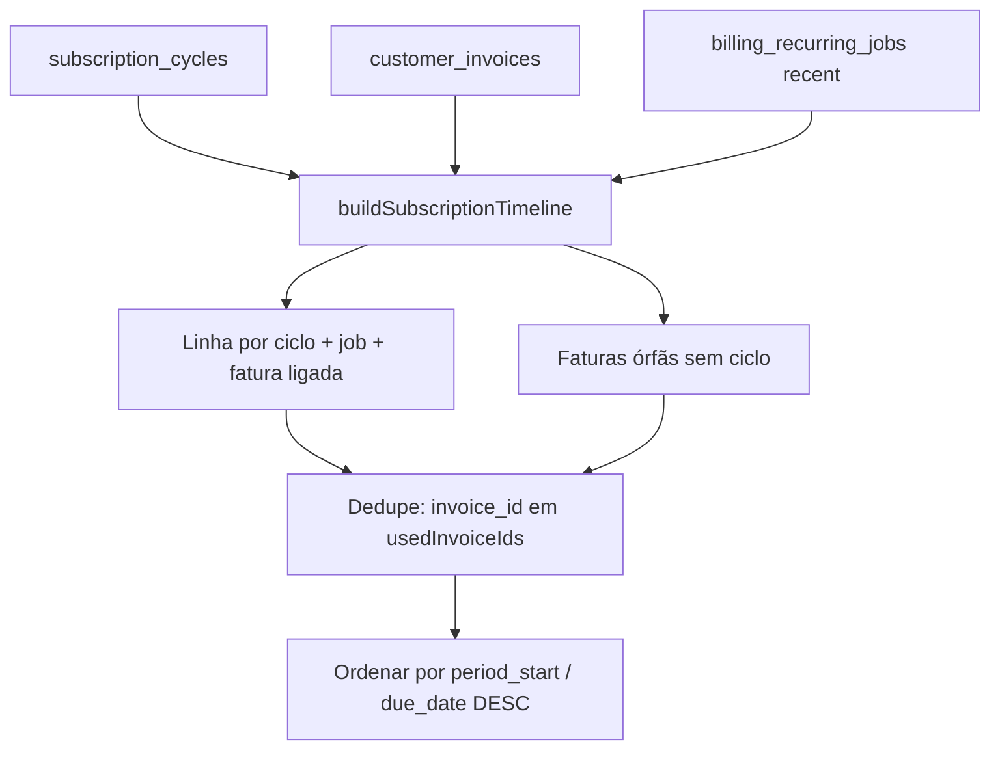

# Timeline financeira de assinaturas — refactor UX

Correção **somente de visualização** no detalhe CRM da assinatura recorrente. O motor de billing (`cycle_key`, `next_billing_date`, `period_start`/`period_end`, geração antecipada) **não foi alterado**.

---

## Problema anterior

| Sintoma | Causa |
|---------|--------|
| `04/2026`, `05/2026`, `05/2026` na tabela | `month_ref = MM/yyyy` derivado de `cycle_date` (vencimento) |
| Parecia “ciclo duplicado” | Dois ciclos com vencimentos no mesmo mês civil (ex.: geração antecipada) |
| Fatura + ciclo repetidos | Fatura órfã listada além do `subscription_cycle` com mesmo `invoice_id` |

Investigação: `docs/INVESTIGACAO_RECORRENCIA_POS_FIX_WORKER.md` (secção timeline).

---

## Nova estrutura

### API (`GET` detalhe assinatura)

| Campo | Descrição |
|-------|-----------|
| `timeline[]` | Linhas operacionais ordenadas por período (desc) |
| `automation_summary` | Resumo do card “Processamento automático” |

### Linha da timeline (`CrmSubscriptionTimelineRow`)

| Campo | Uso na UI |
|-------|-----------|
| `cycle_label` | Título principal — ex. `Ciclo · Vencimento 24/05/2026` |
| `cycle_subtitle` | Contexto civil — ex. `Mai/2026 · Venc. 24/05` |
| `month_ref` | Legado (= `cycle_subtitle`); **não** usar só `MM/yyyy` na UI nova |
| `cycle_date` | Data canónica do ciclo (`subscription_cycles.cycle_date`) |
| `period_label` | `24/05/2026 → 24/06/2026` |
| `due_date` | Vencimento da fatura |
| `operational_state` | Estado visual (enum) |
| `operational_state_pt` | Rótulo PT curto |
| `generation_note` | Ex. `Gerada automaticamente em 19/05/2026` |
| `has_auto_retry` | Badge “Reprocessamento automático” |
| `job_*` | Tentativas, retry, erro resumido |
| `merge_source` | `cycle` \| `invoice_only` (auditoria) |

### `automation_summary`

| Campo | Card |
|-------|------|
| `last_generation_label` | Última geração |
| `next_generation_ymd` | Próxima geração prevista |
| `next_charge_ymd` | Próxima cobrança (vencimento) |
| `worker_status_pt` | Status do worker |
| `last_worker_check_at` | Última verificação |

---

## Merge logic

1. **Ciclos** (`cycles_read_enabled`): uma linha por `subscription_cycles`, enriquecida com fatura e job.
2. **Faturas**: só entram se `invoice_id` **não** foi consumido por um ciclo (deduplicação).
3. **Jobs**: associados por `job_id`, `cycle_date`, `period_start` ou `due_date` (normalização `cycle_key`).

---

## Deduplicação

| Regra | Efeito |
|-------|--------|
| Ciclo com `invoice_id` | Fatura removida da lista órfã |
| Mesmo mês civil, `cycle_date` diferente | **Duas linhas** (correto) — rótulos distintos por vencimento |
| Sem ciclo, só fatura | `merge_source: invoice_only`, estado `manual_invoice` |

---

## Estados visuais (`operational_state`)

| Estado | Rótulo PT | Quando |
|--------|-----------|--------|
| `scheduled` | Agendado | `cycle.status = queued` |
| `awaiting_generation` | Aguardando geração | `pending` |
| `in_queue` | Em fila | Job `pending` |
| `processing` | Processando | Ciclo/job em processamento |
| `generated` | Gerado | Fatura existe, não paga |
| `paid` | Pago | Fatura `paid` |
| `gateway_failed` | Falha na cobrança | Gateway / fatura failed |
| `failed` | Falhou | Ciclo/job com falha |
| `skipped` | Sem nova fatura | Ciclo `skipped` |
| `cancelled` | Cancelado | Ciclo cancelado |
| `manual_invoice` | Fatura avulsa | Só fatura, sem ciclo |

Mapeamento antigo → novo (ciclos):

| Técnico | UI |
|---------|-----|
| `queued` | Agendado |
| `pending` | Aguardando geração |
| `invoiced` | Fatura gerada / Gerado |
| (fatura `paid`) | Pago |

---

## Regras de renderização (frontend)

| Componente | Função |
|------------|--------|
| `SubscriptionDetail.tsx` | Tabela: coluna Ciclo, Situação, badges retry |
| `SubscriptionTimelineStateDot.tsx` | Indicador colorido por `operational_state` |
| `SubscriptionRecurringStatusBadge` | Tooltip + detalhe (`generation_note`, retry) |
| `subscriptionRecurringDisplay.ts` | Prioriza `operational_state` da API |
| `SubscriptionOperationalHealthCard.tsx` | Usa `automation_summary` |

---

## Geração antecipada

- **Vencimento** na linha = `due_date` / `cycle_date` (regra financeira intacta).
- **`generation_note`**: se `created_at` da fatura &lt; `due_date`, texto “Gerada automaticamente em …”.
- Card superior explica antecipação (`N` dias antes) sem colapsar ciclos no mesmo `MM/yyyy`.

---

## Arquivos

| Arquivo | Alteração |
|---------|-----------|
| `packages/backend/src/services/subscriptionTimelineUx.ts` | `buildSubscriptionTimeline`, `buildSubscriptionAutomationSummary` |
| `packages/backend/src/services/crmSubscriptionsService.ts` | Integração + tipo exportado |
| `src/services/crmSubscriptions.ts` | Tipos frontend |
| `src/lib/subscriptionRecurringDisplay.ts` | Badges alinhados aos estados |
| `src/pages/SubscriptionDetail.tsx` | Tabela profissional |
| `src/components/subscriptions/SubscriptionOperationalHealthCard.tsx` | Card expandido |
| `src/components/subscriptions/SubscriptionTimelineStateDot.tsx` | Novo |

---

## O que não mudou

- `cycle_key`, scheduler, worker, `scheduled_at`
- Cálculo de `next_billing_date` e janelas de geração
- Escrita em `subscription_cycles` / `billing_recurring_jobs`

---

## Validação manual

1. Assinatura com dois ciclos em maio/2026 e vencimentos diferentes → duas linhas com `cycle_label` distintos (não dois `05/2026`).
2. Ciclo `invoiced` com fatura → uma linha só; fatura não aparece como órfã.
3. Fatura antiga sem ciclo → uma linha `manual_invoice`.
4. Card mostra última geração, próxima geração, próxima cobrança, status worker.
5. Job com `retry_at` futuro → badge “Reprocessamento automático”.
