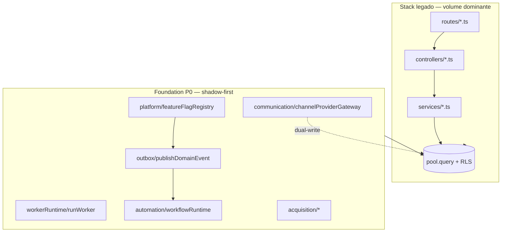
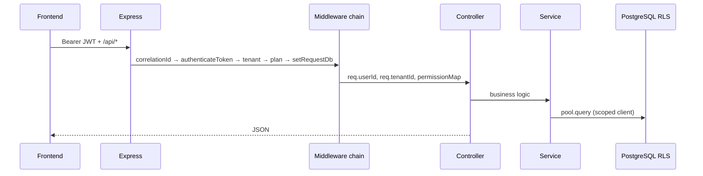
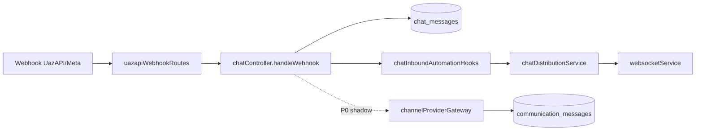
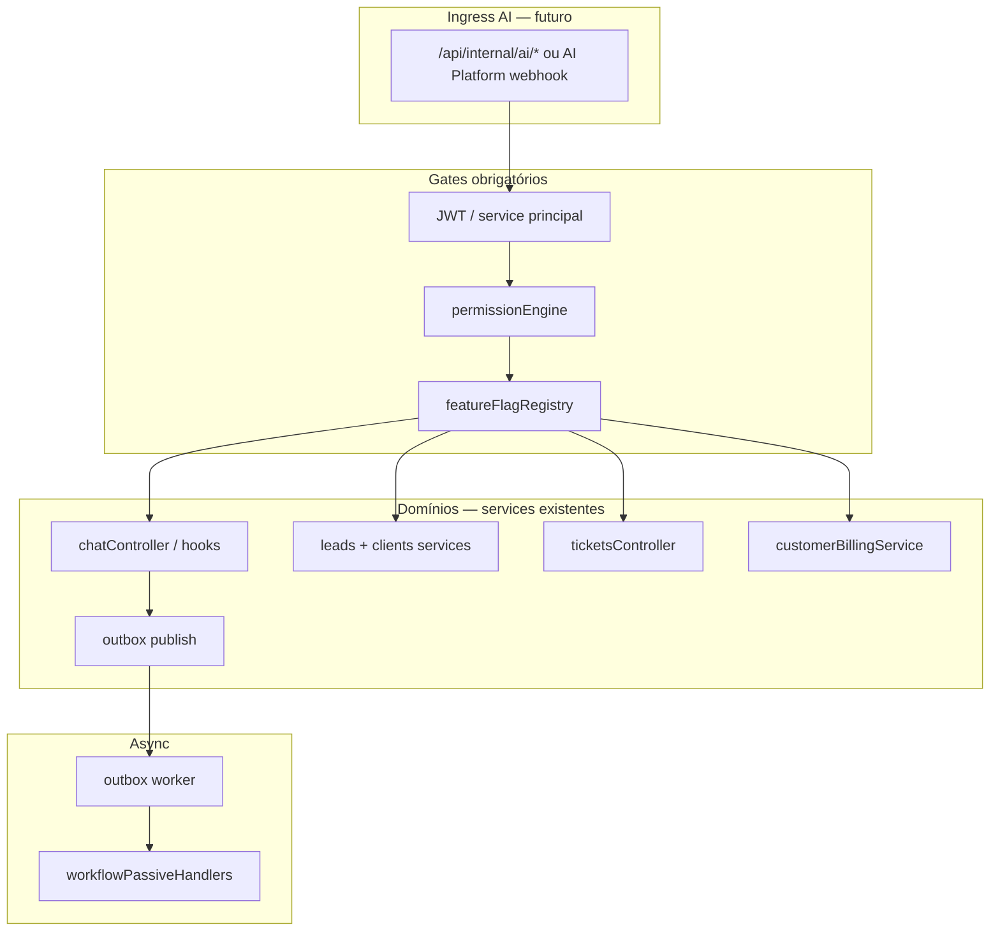

# Auditoria arquitetural — PainelCRM (pré-integração AI Platform)

**Tipo:** auditoria AS-IS do código em produção/desenvolvimento.  
**Versão:** 1.0  
**Data:** maio/2026  
**Status:** documentação apenas — **não implementar** integração AI, `internal-integrations` ou tools nesta etapa.

**Objetivo:** mapear a arquitetura **real** do PainelCRM para definir corretamente como o **AI Runtime** será integrado, sem duplicar lógica, acessar banco diretamente, quebrar RBAC ou criar services paralelos.

**Documentos relacionados:**

| Documento | Uso |
|-----------|-----|
| [`ARCHITECTURE_SYSTEM_CONTEXT_MAP.md`](./ARCHITECTURE_SYSTEM_CONTEXT_MAP.md) | Bounded contexts planejados (TO-BE) |
| [`IMPLEMENTATION_P0_FOUNDATION_EXECUTION_PLAN.md`](./IMPLEMENTATION_P0_FOUNDATION_EXECUTION_PLAN.md) | Foundation P0 (flags, outbox, workers) |
| [`automation/DOMAIN_EVENT_AND_OUTBOX_ARCHITECTURE.md`](./automation/DOMAIN_EVENT_AND_OUTBOX_ARCHITECTURE.md) | Outbox e eventos |
| [`communication/COMMUNICATION_PLATFORM_ARCHITECTURE.md`](./communication/COMMUNICATION_PLATFORM_ARCHITECTURE.md) | Gateway de comunicação |
| [`../PLANO-EVOLUCAO-CHAT-CRM-WHATSAPP.md`](../PLANO-EVOLUCAO-CHAT-CRM-WHATSAPP.md) | Chat ↔ CRM |

---

## Índice

1. [Visão executiva](#1-visão-executiva)
2. [Estrutura geral do projeto](#2-estrutura-geral-do-projeto)
3. [Autenticação e permissões](#3-autenticação-e-permissões)
4. [WhatsApp e atendimento](#4-whatsapp-e-atendimento)
5. [CRM / Leads](#5-crm--leads)
6. [Tickets e tarefas](#6-tickets-e-tarefas)
7. [Financeiro](#7-financeiro)
8. [Sistema de eventos, filas e jobs](#8-sistema-de-eventos-filas-e-jobs)
9. [APIs existentes](#9-apis-existentes)
10. [Realtime](#10-realtime)
11. [Arquitetura de banco de dados](#11-arquitetura-de-banco-de-dados)
12. [Frontend e contratos de API](#12-frontend-e-contratos-de-api)
13. [Pontos de extensão e integração AI](#13-pontos-de-extensão-e-integração-ai)
14. [Adapters necessários (planejamento)](#14-adapters-necessários-planejamento)
15. [Riscos arquiteturais](#15-riscos-arquiteturais)
16. [Recomendações para integração AI-native](#16-recomendações-para-integração-ai-native)
17. [Próximos passos (fora deste documento)](#17-próximos-passos-fora-deste-documento)

---

## 1. Visão executiva

### 1.1 O que o PainelCRM é hoje (AS-IS)

O PainelCRM é um **monólito modular** com:

| Camada | Tecnologia | Local |
|--------|------------|-------|
| **Frontend CRM** | React + Vite + TypeScript + TanStack Query | `src/` (raiz do repo) |
| **Backend API** | Express + TypeScript + `pg` | `packages/backend/src/` |
| **Banco** | PostgreSQL com **RLS** por tenant | `database/init/`, `supabase/migrations/` |
| **Realtime** | **Socket.IO** (mesmo processo HTTP) | `websocketService.ts`, `realtimeService.ts` |
| **Auth** | **JWT stateless** (não há sessão server-side) | `middleware/auth.ts`, `utils/jwt.ts` |
| **Deploy local** | `start.bat` / Docker Compose | raiz |

Não há microservices. Não há ORM (Prisma/TypeORM). A maior parte da lógica está em **`services/*.ts`** com SQL inline; controllers podem ser muito grandes (ex.: `chatController.ts`).

### 1.2 Duas camadas arquiteturais coexistindo



| Camada | Características | Implicação para AI |
|--------|-----------------|-------------------|
| **Legado** | Controllers + services + SQL direto; poucos repositories | Reutilizar **services** existentes; não criar SQL paralelo |
| **P0** | Feature flags, outbox, repos explícitos, correlation id, workers genéricos | Integrar workflows IA via **outbox** e flags; não bypass |

### 1.3 Princípio para integração AI

> O AI Runtime deve ser um **orquestrador externo ou camada fina** que chama **APIs e services já autorizados**, com o mesmo `tenantId`, `userId` (ou service principal) e matriz de permissões — nunca um atalho ao PostgreSQL.

---

## 2. Estrutura geral do projeto

### 2.1 Árvore resumida (repositório)

```text
painelcrm/
├── src/                          # Frontend React (CRM + landing merge)
│   ├── pages/                    # Rotas lazy-loaded (Chat, Leads, Finance, …)
│   ├── components/               # UI por domínio
│   ├── services/                 # Clientes HTTP → /api/*
│   ├── contexts/                 # AuthContext, ModulePermissionsContext
│   ├── hooks/                    # useRealtimeEvents, useNotifications, …
│   └── integrations/api/         # client.ts (Bearer token)
├── packages/backend/src/         # API Express
│   ├── controllers/              # ~140 handlers HTTP
│   ├── routes/                   # ~80 routers
│   ├── services/                 # ~200+ arquivos + 12 subpastas
│   ├── middleware/               # auth, correlation, multer
│   ├── permissions/              # engine RBAC + catalog
│   ├── modules/payments/         # gateway registry (Asaas, MP)
│   ├── modules/gateways/         # adapters Asaas
│   ├── outbox/                   # P0 transactional outbox
│   ├── platform/                 # P0 feature flags
│   ├── communication/            # P0 channel gateway (shadow)
│   ├── automation/               # P0 workflow runtime (shadow)
│   ├── acquisition/              # P0 signup/trial público
│   ├── workerRuntime/            # P0 worker lifecycle
│   ├── context/                  # ALS correlation + request context
│   ├── config/                   # env por domínio
│   ├── utils/                    # db.ts (RLS pool), jwt, tenant
│   └── scripts/                  # workers standalone (billing, outbox)
├── database/init/                # SQL ordenado (migrate.ts)
├── supabase/migrations/          # Migrations espelhadas
└── docs/architecture/            # Documentação enterprise
```

### 2.2 Domínios de negócio (bounded contexts operacionais)

| Domínio | Backend principal | Tabelas centrais (exemplos) |
|---------|-------------------|-----------------------------|
| **Identidade / tenant** | `authController`, `middleware/auth.ts`, `myTenantPlanController` | `users`, `tenants`, `user_profiles`, `user_roles` |
| **Chat / WhatsApp** | `chatController`, `uazapi.ts`, `communication/` P0 | `chat_instances`, `chat_conversations`, `chat_messages` |
| **CRM** | `leadsController`, `clientsController`, `proposalsController` | `leads`, `clients`, `proposals`, `sales_funnels` |
| **Tickets** | `ticketsController`, `platformSupportRepository` | `tickets`, `ticket_messages` |
| **Tarefas** | `tasksController`, `unifiedTasksService` | `tasks`, `lead_tasks`, `client_tasks`, `project_tasks` |
| **Financeiro tenant** | `financialController`, `financeModuleController` | módulo `financial_*`, legado `invoices` |
| **Billing cliente** | `customerInvoicesController`, `customerBillingService` | `customer_invoices`, `crm_subscriptions` |
| **Billing SaaS** | `billingService`, `myTenantPlanController` | `tenant_billing`, `billing_recurring_jobs` |
| **Projetos** | `projectsController`, `projectTasksController` | `projects`, `project_tasks` |
| **Agenda** | `appointmentsController` | appointments tables |
| **Plataforma** | `superadminRoutes`, `platformFeatureFlags*` | `platform_feature_flags`, `superadmin_*` |
| **Aquisição P0** | `acquisition/*`, `acquisitionPublicRoutes` | `acquisition_leads` |

### 2.3 Fluxo arquitetural HTTP típico



### 2.4 Dependências principais

| De | Para | Tipo |
|----|------|------|
| Routes | Controllers + `requirePermission` | síncrono |
| Controllers | Services (+ ocasional `pool.query`) | síncrono |
| Services | `pool`, outros services, `websocketService` | síncrono |
| P0 publish | `outboxRepository` (mesma transação quando possível) | transacional |
| Outbox worker | passive consumers → `workflowPassiveHandlers` | assíncrono |
| Webhooks | Controllers (chat, asaas, whatsapp-official) | HTTP inbound |
| Frontend | REST `/api/*` + Socket.IO | rede |

**Anti-padrão atual a evitar na IA:** novo módulo que faz `pool.query` copiando queries de `chatController` ou `customerBillingService`.

---

## 3. Autenticação e permissões

### 3.1 Autenticação — JWT stateless

| Aspecto | Implementação |
|---------|---------------|
| Emissão | `POST /api/auth/login` → `generateToken({ userId, email })` |
| Validação | `authenticateToken` em cada request protegido |
| Armazenamento FE | `localStorage.auth_token` via `src/integrations/api/client.ts` |
| Expiração | Default `7d` (`JWT_SECRET`) |
| Impersonation | JWT `purpose` dedicado, TTL 1h |
| Super admin | `users.is_super_admin` — rotas `/api/superadmin` com RLS bypass |

**Não há:** express-session, Supabase Auth no fluxo principal do CRM (Supabase client existe apenas em código legado Evolution/WhatsApp em `src/services/whatsapp/`).

### 3.2 Modelo de roles (RBAC)

```text
Plataforma
  └── is_super_admin → /api/superadmin (bypass RLS)

Tenant (empresa)
  ├── users.tenant_id
  ├── user_profiles (workspace; owner = conta principal)
  ├── user_roles → role: admin | manager | member | viewer
  ├── tenant_custom_roles + custom_role_module_permissions
  └── role_module_permissions (defaults por role sistema)
```

**Resolução efetiva:** `modulePermissionsService.ts` → cache via `permissionVersionService` → `permissionEngine.checkPermission`.

**Módulos:** `dashboard`, `clients`, `leads`, `funnels`, `products`, `projects`, `tasks`, `chat`, `tickets`, `proposals`, `contracts`, `billing`, `finance`, `settings`, `meu_plano`, `agenda`.

**Catálogo granular:** `permissions/permissionCatalog.ts` — chaves como `chat.transfer_attendance`, `finance.view_revenue`, `billing.create_invoice` (centenas de chaves).

**Atalho tenant admin:** `isTenantAdmin()` — bypass na maioria das verificações granulares.

### 3.3 Onde as permissões são aplicadas

| Camada | Mecanismo | Arquivo |
|--------|-----------|---------|
| Rota | `requirePermission('module.action')` | `permissions/requirePermission.ts` |
| Controller | `assertModulePermission`, `assertPermissionKey` | `permissions/assertModulePermission.ts` |
| Feature plano | `requireFeature('chat')`, `requireFeature('agenda')` | `middleware/auth.ts` |
| Frontend (UX) | `ModulePermissionsContext` | `src/contexts/ModulePermissionsContext.tsx` |
| API permissões | `GET /api/me/tenant/my-permissions` | `myTenantPlanController` |

**Regra para AI:** enforcement **só no backend**. UI é advisory. O AI Runtime deve receber um **actor** (`userId` + `tenantId`) e passar pelo mesmo middleware ou por um **service principal** com escopo explícito documentado — nunca “modo Deus” sem flag e auditoria.

### 3.4 Middleware chains (presets)

| Chain | Uso |
|-------|-----|
| `authSessionContext` | `/api/auth/me`, features |
| `tenantAuth` | CRM com gates comerciais + RLS |
| `tenantAuthCrm` | + bloqueia superadmin sem tenant no CRM |
| `tenantAuthCommercialHub` | `/meu-plano` sem bloqueio trial |
| `appointmentsAuth` | `tenantAuthCrm` + `requireFeature('agenda')` |
| `superadminAuth` | plataforma + `app.bypass_rls` |

**RLS:** `setRequestDb` abre `PoolClient` com `SET LOCAL app.current_tenant_id`, `app.actor_user_id`. O `pool` exportado em `utils/db.ts` é **facade** que roteia para esse client.

### 3.5 Como o AI Runtime deve respeitar RBAC

1. **Opção A (preferida):** AI chama **REST interno** com JWT do usuário humano (delegação) ou token de serviço com claims `tenantId` + `userId` mapeados.
2. **Opção B:** Camada `aiOrchestrationService` no backend que recebe `actorUserId` e chama `assertModulePermission` / `checkPermission` antes de cada mutação.
3. **Proibido:** connection string direta ao Postgres sem `SET LOCAL` e sem actor.
4. **own-only:** respeitar `edit_own_only` / `delete_own_only` do `permissionEngine` — relevante para leads, tasks, proposals.

---

## 4. WhatsApp e atendimento

### 4.1 Visão do domínio

Este é o domínio **mais crítico** para IA operacional (sugestões, triagem, respostas assistidas, resumo de conversa).

**Dois providers coexistem:**

| Provider | Integração | Rotas webhook |
|----------|------------|---------------|
| **UazAPI** (Evolution-style) | `services/uazapi.ts`, `chatController` | `/api/webhooks/uazapi`, `/webhooks/uazapi` |
| **Meta WhatsApp Official** | `services/whatsappOfficial/*` | `/api/webhooks/whatsapp-official`, `/webhooks/meta/whatsapp` |

**Camada P0 (shadow):** `communication/channelProviderGateway` + `uazapiBridgeAdapter` + `communication_messages` — dual-write quando flags ativas.

### 4.2 Estrutura de mensagens e conversas

| Entidade | Tabela | Responsável principal |
|----------|--------|------------------------|
| Instância WhatsApp | `chat_instances` | `chatController`, superadmin `connectionsRoutes` |
| Conversa | `chat_conversations` | `chatController`, matching por telefone |
| Mensagem | `chat_messages` | `chatController`, `messageService.ts` |
| Atendimento / fila | colunas + `chat_queues`, histórico assignment | `chatAttendanceController`, `chatDistributionService` |
| SLA / automação | regras phase 6–8 | `chatAutomationController`, `chatbotEngine`, `chatSlaWorkerService` |
| Kanban chat | `chat_kanban_*` | `chatKanbanController` |
| Templates | `whatsapp_message_templates`, `tenant_chat_templates` | rotas dedicadas |

**Link CRM:** `chat_conversations.client_id`, `lead_id` — matching em `conversationMatchingService.ts`.

### 4.3 Fluxo inbound (webhook)



### 4.4 Fluxo outbound

`chatController.sendMessage` → `uazapiService` (ou adapter Official) → provider externo.

Frontend: `src/services/chat.ts` → `POST /api/chat/...`.

### 4.5 Filas, usuários online, transferência

| Conceito | Service / controller |
|----------|---------------------|
| Atribuição / transferência | `chatAttendanceController`, `patchConversationAttendance` |
| Distribuição automática | `chatDistributionService` |
| Dashboard operacional | `chatOperationsDashboardService` (presença ≈ janela de atividade recente) |
| Permissões | `chat.transfer_attendance`, etc. no `permissionCatalog` |

### 4.6 Realtime no chat

Eventos legacy (`new_message`, `conversation_updated`, `conversation_attendance_updated`) e V2 (`message.created`, `conversation.updated`) — ver [§10](#10-realtime).

`Chat.tsx` pode manter **socket dedicado** além do bus global.

### 4.7 Services reutilizáveis para IA (chat)

| Service / função | Uso AI |
|------------------|--------|
| `conversationMatchingService` | Resolver lead/client por telefone |
| `getConversationProfile` (chatController) | Contexto unificado para prompt |
| `chatInboundAutomationHooks` | Hook pós-mensagem (não duplicar persistência) |
| `channelProviderGateway` (P0) | Envio futuro provider-agnóstico |
| `chatFinancialAdapter` (FE) | Padrão para enviar link de fatura no chat |
| `chatbotEngine` | Regras bot existentes — coordenar com IA, não substituir silenciosamente |

**Não fazer:** duplicar persistência de `chat_messages`; editar webhook security em vários lugares.

---

## 5. CRM / Leads

### 5.1 Entidades e ownership

| Entidade | Controller | Conversão / notas |
|----------|------------|-------------------|
| Leads | `leadsController.ts` | SQL no controller (sem repository dedicado) |
| Clientes | `clientsController.ts` | Timeline, financial summary |
| Status lead | `leadStatusesController.ts` | |
| Tarefas lead | `leadTasksController.ts` | |
| Funis | `funnelsController`, `funnelStagesController` | `sales_funnels`, `funnel_stages` |
| Propostas | `proposalsController.ts` | `convert-to-invoice` |
| Aquisição marketing | `acquisition/*` | `acquisition_leads` — **separado** de `leads` tenant |

### 5.2 Fluxos principais

1. **CRUD lead** → RLS por `tenant_id`.
2. **Lead → cliente** → `leadConversionMigrationService` (atualiza proposals, tickets, links chat) — **transação única obrigatória para IA**.
3. **Pipeline** → funis + propostas; chat kanban é paralelo (`chat_kanban_*`).
4. **Chat ↔ CRM** → link manual ou match telefone; política documentada em `PLANO-EVOLUCAO-CHAT-CRM-WHATSAPP.md`.

### 5.3 Services reutilizáveis para IA (CRM)

| Service | Uso |
|---------|-----|
| `leadConversionMigrationService` | Conversão atômica |
| `clientsController.getClientTimeline` | Contexto leitura |
| `proposalInvoiceConversionService` | Proposta → fatura (não recalcular preços) |
| `acquisition/signupOrchestrationService` | Apenas fluxo público signup |

---

## 6. Tickets e tarefas

### 6.1 Tickets (mesa de suporte tenant)

| Peça | Path |
|------|------|
| API | `/api/tickets`, `/api/ticket-categories` |
| Controllers | `ticketsController`, `ticketMessagesController` |
| Side effects | `ticketMessageSideEffects.ts`, `ticketNotificationsService.ts` |
| Worker | `scripts/runTicketAutoResolve.ts` + interval em `index.ts` |
| Público | `supportPortalRoutes`, `publicSupportPortalController` |

**Tabelas:** `tickets`, `ticket_messages`, `ticket_categories`, SLA policies, `tickets.lead_id` (extensão).

### 6.2 Platform support (operador SaaS ↔ tenant)

Separado de tickets tenant: `platformSupportController`, `platformSupportRepository` — publica `ticket.created` / `support.ticket.created` no **outbox**.

### 6.3 Tarefas unificadas

`services/tasks/unifiedTasksService.ts` agrega:

- `tasks`
- `lead_tasks`
- `client_tasks`
- `project_tasks`

API: `/api/tasks` com permissões granulares (`tasks.view_all` vs `view_own`).

**Para IA:** uma única API de listagem cross-entity via `unifiedTasksService` — evita quatro tools separadas com lógica duplicada.

---

## 7. Financeiro

### 7.1 Três sistemas financeiros distintos

> **Risco crítico para IA:** misturar conceitos em um único “tool financeiro”.

| Sistema | Quem paga quem | Tabelas / services |
|---------|----------------|-------------------|
| **A) Billing SaaS** | Tenant paga a plataforma PainelCRM | `tenant_billing`, `billingService`, webhooks Asaas/MP |
| **B) Billing cliente** | Cliente final paga ao tenant CRM | `customer_invoices`, `customerBillingService` |
| **C) Financeiro interno** | Fluxo de caixa do tenant | `financialController`, `financeModuleController`, `/api/financial` |

Há ainda legado `/api/finance` vs `/api/financial` — verificar qual UI consome qual mount.

### 7.2 Gateways de pagamento

| Gateway | Módulo |
|---------|--------|
| Asaas | `modules/gateways/asaas/`, `asaasWebhookRoutes` |
| Mercado Pago | `mercadoPagoIntegrationController`, webhooks |
| Abstração | `modules/payments/gatewayRegistry.ts`, `paymentDomainService.ts` |

### 7.3 Workers billing

| Script | npm | Função |
|--------|-----|--------|
| `runRecurringScheduler.ts` | `billing:scheduler` | Agenda jobs |
| `runRecurringWorker.ts` | `billing:worker` | Processa cobranças |
| `runBillingReconciliation.ts` | `billing:ops-reconciliation` | Reconciliação |
| `billingWorkerAdapter.ts` | — | Adapter P0 `workerRuntime` |

### 7.4 Eventos financeiros

Outbox (quando publicado): `invoice.created`, `billing.invoice.created`.

Webhooks: atualizam estado via `paymentWebhookEventsService`, `paymentDomainService`.

Notifications: `notificationsEngine/billingNotificationFlush.ts`.

### 7.5 Services reutilizáveis para IA (financeiro)

| Service | Uso |
|---------|-----|
| `customerBillingService` / `customerInvoicesController` | Faturas cliente — PIX/boleto/cartão |
| `customerInvoiceRecurrenceNextBillingService` | Recorrência |
| `billingService` | Apenas contexto SaaS do tenant |
| `chatFinancialAdapter` (FE) | Listar faturas abertas + link no chat |

---

## 8. Sistema de eventos, filas e jobs

### 8.1 Outbox P0 (event bus transacional)

| Componente | Path |
|------------|------|
| Publicação | `outbox/publishDomainEvent.ts` |
| Persistência | `outbox/outboxRepository.ts` |
| Worker | `scripts/runOutboxPublisherWorker.ts` |
| Consumers | `outbox/passiveConsumers/registry.ts` |
| Bridge workflow | `automation/outboxWorkflowBridge.ts` |

**Catálogo atual de event keys** (`outbox/domainEventKeys.ts`):

```text
signup.completed, onboarding.*, acquisition.*,
invoice.created, billing.invoice.created,
ticket.created, support.ticket.created, workflow.started,
communication.message.sent|received|delivered|read|failed
```

**Estado hoje:** maioria dos passive consumers faz **shadow log** apenas; `workflowPassiveHandlers` preparado para automação futura.

### 8.2 O que NÃO existe (ainda)

- Event bus global legado unificado (hooks ad-hoc em services)
- `lead.created` no catálogo outbox
- Message queue externa (RabbitMQ, SQS) — tudo PostgreSQL + polling

### 8.3 Workers in-process (`index.ts` — `setInterval`)

| Worker | Env poll (exemplo) |
|--------|-------------------|
| Feature flags refresh | 120s |
| Kanban scheduled moves | `KANBAN_SCHEDULED_MOVE_POLL_MS` |
| Proposal webhook delivery | `PROPOSAL_WEBHOOK_POLL_MS` |
| Notifications engine retry | `notificationsEngineEnv` |
| Platform notifications retry | `platformNotificationsEnv` |
| Invoice digest | flag-enabled |
| Billing overdue sync | `BILLING_OVERDUE_SYNC_POLL_MS` |
| Trial expiring notifications | `PLATFORM_TRIAL_EXPIRING_*` |
| Announcements send | `ANNOUNCEMENTS_SEND_POLL_MS` |
| Agenda reminders / automation | `AGENDA_*` |
| Chat SLA | `chatAutomationEnv` |
| Chat scheduled messages | `CHAT_SCHEDULED_MESSAGES_POLL_MS` |
| WhatsApp Official campaigns | flag-enabled |
| Avatar cache | `whatsappAvatarCacheWorker` |
| Ticket auto-resolve | `TICKET_AUTO_RESOLVE_POLL_MS` |

### 8.4 Workers standalone (processos separados)

| Script | Domínio |
|--------|---------|
| `runOutboxPublisherWorker.ts` | Outbox P0 |
| `runRecurringWorker.ts` / `runRecurringScheduler.ts` | Billing SaaS |
| `runBillingReconciliation.ts` | Reconciliação |
| `runTrialExpiration.ts` | Trials |
| `runTicketAutoResolve.ts` | Tickets (também interval no API) |
| `runWhatsappAvatarCacheBackfill.ts` | Chat media |

**Padrão P0:** `workerRuntime.runWorker()` — heartbeats em `platform_worker_heartbeats`, reclaim de locks.

### 8.5 Integração IA sem acoplamento

| Padrão | Recomendação |
|--------|--------------|
| Ação síncrona UI | REST → controller → service |
| Automação pós-fato | `publishDomainEvent` + consumer registrado |
| Long-running IA | Worker dedicado ou fila externa **depois** de contrato outbox estável |
| Shadow | `platform.featureFlagRegistry` — rollout gradual |

---

## 9. APIs existentes

### 9.1 Superfície REST

- **Base:** `/api/*` (sem versionamento `/v1` hoje).
- **Público:** `/api/public/*`, `/api/public/acquisition/*`, rotas `public*` controllers (token/slug).
- **Webhooks:** `/webhooks/*` e `/api/webhooks/*` (rate limit dedicado).
- **Health:** `GET /health` (DB ping).
- **Superadmin:** `/api/superadmin/*`.
- **Media estática:** `/media/catalog`, `/media/whatsapp-templates`.

Registro central: `packages/backend/src/index.ts` (~80 mounts).

### 9.2 Autenticação por tipo de rota

| Tipo | Auth |
|------|------|
| CRM tenant | `tenantAuthCrm` + permissions + features |
| Auth session | `authSessionContext` |
| Superadmin | `superadminAuth` |
| Público | Token/slug/rate limit — sem JWT usuário |
| Webhooks | Assinatura provider (Meta, Asaas) — sem JWT |
| Socket.IO | JWT em `auth.token` / `query.token` |

### 9.3 APIs “internas”

Não há pacote `internal-integrations` nem BFF separado. “Interno” = mesmos endpoints REST com JWT, ou chamadas service-to-service dentro do monólito.

**Para AI Platform:** expor camada **BFF ou internal routes** (`/api/internal/ai/*`) que delega aos services — ainda **não implementar** nesta fase.

### 9.4 Índice rápido de mounts (domínios AI-relevantes)

| Domínio | Prefixo |
|---------|---------|
| Chat | `/api/chat`, `/api/chat/kanban` |
| Leads / clients | `/api/leads`, `/api/clients` |
| Proposals / funnels | `/api/proposals`, `/api/funnels` |
| Tickets / tasks | `/api/tickets`, `/api/tasks` |
| Customer billing | `/api/customer-invoices`, `/api/customer-charges`, `/api/crm-subscriptions` |
| SaaS billing | `/api/billing`, `/api/me/tenant` |
| Financial | `/api/financial`, `/api/finance` |
| Notifications | `/api/notifications`, `/api/notifications-engine` |
| Feature flags P0 | `/api/superadmin/...` (admin flags) |
| Acquisition | `/api/public/acquisition` |

---

## 10. Realtime

### 10.1 Stack

| Tecnologia | Usado? |
|------------|--------|
| **Socket.IO** | Sim — servidor em `websocketService.ts` |
| Pusher | Não |
| Supabase Realtime | Não (client Supabase só legado WhatsApp) |
| Polling | Secundário; chat usa socket primário |

### 10.2 Rooms e auth

- Rooms: `user:{userId}`, `tenant:{tenantId}`
- Auth: mesmo JWT do REST

### 10.3 Eventos (dual stack — migração)

**Legacy → user/tenant room:**

`notification`, `unread_count`, `new_message`, `message_updated`, `conversation_updated`, `conversation_attendance_updated`, `assignment.changed`, `conversation.transferred`, `conversation.status_changed`, `conversation_deleted`

**V2 → tenant room (`realtimeService.emitToTenant`):**

`message.created`, `conversation.updated`, `conversation.deleted`, `notification.created`, `channel.status_changed`, `whatsapp.instance_removed`, `chat.message_comment.created`, `crm.note.created`

### 10.4 Frontend

| Cliente | Arquivo |
|---------|---------|
| Bus global V2 | `src/services/realtimeClient.ts` + `useRealtimeEvents` |
| Notificações | `src/hooks/useNotifications.ts` (socket separado) |
| Chat | `Chat.tsx` (terceiro socket; dedupe em `chatRealtimeDiagnostics`) |

**Implicação IA:** após ações mutantes, preferir **emit existente** via services — não criar canal realtime paralelo.

---

## 11. Arquitetura de banco de dados

### 11.1 Acesso a dados

| Aspecto | Implementação |
|---------|---------------|
| ORM | **Nenhum** — SQL parametrizado |
| Pool | `pg` em `utils/db.ts` |
| RLS | `SET LOCAL app.current_tenant_id`, `app.actor_user_id` |
| Bypass | Superadmin + `withBillingWorkerRlsBypass()` para workers |
| Migrations | `migrate.ts` → `database/init/*.sql` ordenados |
| Supabase | Migrations espelhadas; runtime principal é pool direto |

### 11.2 Padrão repository

| Camada | Repositories |
|--------|--------------|
| P0 | `outboxRepository`, `featureFlagRepository`, `communicationMessageRepository`, `acquisitionLeadRepository`, `workflowExecutionRepository`, `sagaRepository`, `workerHeartbeatRepository` |
| Legado | Esparsos: `notificationEngineRepository`, `platformSupportRepository`, MP credentials |

**~95% do código:** `pool.query` em services/controllers.

### 11.3 Regras para AI e banco

1. **Proibido** AI Runtime com connection string direta.
2. **Permitido** apenas via services que já aplicam tenant scope.
3. Transações multi-tabela: usar `PoolClient` existente do request (`setRequestDb`) ou `withTenantRlsContext`.
4. P0 outbox: publicar na **mesma transação** da mutação de domínio quando possível.

---

## 12. Frontend e contratos de API

### 12.1 Stack

- React 18 + Vite + TypeScript
- TanStack Query (`queryClient`)
- React Router — rotas lazy em `App.tsx`
- shadcn/ui + Tailwind

### 12.2 Organização

| Pasta | Conteúdo |
|-------|----------|
| `src/pages/` | Uma página por domínio (Chat ~7k linhas) |
| `src/services/` | Wrappers HTTP (`chat.ts`, `tickets.ts`, `customerInvoices.ts`) |
| `src/contexts/` | Auth, ModulePermissions |
| `src/components/` | UI por feature |

### 12.3 Contrato para AI

Os wrappers em `src/services/*` espelham contratos REST estáveis — **referência para definir tools** (schemas derivados dos endpoints existentes, não inventar campos).

---

## 13. Pontos de extensão e integração AI

### 13.1 Mapa de pontos ideais



### 13.2 Matriz: operação AI → reutilizar

| Capacidade AI | Service / API a reutilizar | Evitar |
|---------------|---------------------------|--------|
| Ler conversa | `getConversationProfile`, GET `/api/chat/conversations/:id` | SQL direto em `chat_messages` |
| Enviar mensagem | `chatController` send path / futuro `channelProviderGateway` | Segundo writer UazAPI |
| Criar lead | `leadsController` create | INSERT paralelo |
| Converter lead | `leadConversionMigrationService` | UPDATE manual multi-tabela |
| Criar ticket | `ticketsController` + `ticketNotificationsService` | INSERT sem notificações |
| Listar tarefas | `unifiedTasksService` | 4 queries separadas |
| Fatura / cobrança | `customerInvoicesController` | Duplicar regras PIX Asaas |
| Resumo financeiro cliente | `getClientFinancialSummary` | Misturar com `tenant_billing` |
| Automação pós-evento | `publishDomainEvent` | Webhook ad-hoc no controller |
| Feature rollout | `platform/featureFlagRegistry` | Env var solta por domínio |

### 13.3 Contexto para prompts (read models)

Priorizar endpoints/services que já agregam:

- `getConversationProfile` (chat + CRM link)
- `clientsController.getClientTimeline`
- `getClientFinancialSummary`
- `unifiedTasksService` list
- Dashboard cards (permissões `dashboard.view_*`)

### 13.4 Onde NÃO integrar na v1

| Área | Motivo |
|------|--------|
| `chatController` internals (12k+ linhas) | Refatorar antes de injetar IA no meio |
| Webhook signature paths | Superfície de segurança |
| `withBillingWorkerRlsBypass` | Apenas workers billing certificados |
| Superadmin bypass | Sem auditoria = risco compliance |

---

## 14. Adapters necessários (planejamento)

> **Não implementar** — apenas inventário para fase seguinte.

| Adapter | Função | Encapsula |
|---------|--------|-----------|
| **AI Actor Context** | Propagar `tenantId`, `userId`, `correlationId` | `requestContext` + auth |
| **Permission Gate Adapter** | `checkPermission` antes de tool | `permissionEngine` |
| **Chat Tool Adapter** | send/read/transfer | `chatController` exports finos ou novos métodos em service extraído |
| **CRM Tool Adapter** | leads/clients/proposals | controllers → services |
| **Ticket/Task Adapter** | CRUD + unified tasks | `ticketsController`, `unifiedTasksService` |
| **Billing Tool Adapter** | customer vs SaaS split | `customerBillingService` vs `billingService` |
| **Event Publisher Adapter** | async side effects | `publishDomainEvent` |
| **Realtime Notify Adapter** | UI refresh | `realtimeService.emitToTenant` |
| **Communication Gateway Adapter** | provider-agnostic send | P0 `channelProviderGateway` quando flag on |

---

## 15. Riscos arquiteturais

| # | Risco | Severidade | Mitigação |
|---|-------|------------|-----------|
| R1 | AI acessa Postgres direto | Crítica | Apenas via services + RLS |
| R2 | Bypass RBAC “service account” sem escopo | Crítica | Actor explícito + audit log |
| R3 | Duplicar lógica `chatController` | Alta | Extrair `chatMessageService` antes de tools |
| R4 | Misturar `customer_invoices` e `tenant_billing` em tools | Alta | Schemas/tools separados |
| R5 | Dual realtime (legacy + V2) — UI inconsistente | Média | Emitir ambos via adapter até deprecar legacy |
| R6 | `communication/` P0 vs `services/communication/` legado | Média | Naming claro; gateway único no TO-BE |
| R7 | Controllers fatos sem testes | Média | Testes de contrato nos adapters AI |
| R8 | Workers in-process + standalone — duplicidade ticket resolve | Baixa | Documentar qual ambiente roda qual script |
| R9 | Shadow outbox — IA acha que evento foi processado | Média | Distinguir `shadow: true` nos logs/métricas |
| R10 | Superadmin impersonation + IA | Alta | Proibir automação em token impersonation |

---

## 16. Recomendações para integração AI-native

### 16.1 Princípios

1. **Thin orchestration** — AI Platform orquestra; PainelCRM executa via services.
2. **Same security boundary** — JWT delegado ou service principal com RBAC idêntico.
3. **Feature flags first** — `platform.featureFlagRegistry` + flags por domínio (`communicationFlags`, etc.).
4. **Events over blocking** — ações que disparam workflows IA devem usar outbox quando assíncrono.
5. **Read vs write separation** — tools de leitura podem ser mais amplas; mutações sempre com permission check explícito.
6. **Correlation end-to-end** — `x-correlation-id` do HTTP até logs do worker e traces AI.
7. **Não criar `internal-integrations` monolítico** — preferir adapters por bounded context alinhados ao System Context Map.

### 16.2 Fases sugeridas (apenas planejamento)

| Fase | Escopo |
|------|--------|
| **0** | Este documento + ADR integração AI |
| **1** | Read-only tools (conversation profile, client timeline, tasks list) via BFF |
| **2** | Write tools com RBAC (nota CRM, ticket, rascunho mensagem human-in-the-loop) |
| **3** | Outbox consumers para automação IA (shadow → live) |
| **4** | Communication gateway como único send path |

### 16.3 Human-in-the-loop (chat)

Para envio de mensagens WhatsApp:

- IA produz **rascunho** → usuário com `chat.send` (ou permissão equivalente) confirma.
- Ou flag `ai.autonomous_reply` por tenant (futuro) com limites e auditoria em `chat_messages` metadata.

### 16.4 Observabilidade

Reutilizar:

- `correlationId` ALS
- `platformFeatureFlagLogger`, `outboxLogger`, domain loggers P0
- Adicionar (futuro): `ai_invocation_audit` table — tenant, user, tool, payload hash, outcome

---

## 17. Próximos passos (fora deste documento)

1. Revisão desta auditoria com time de produto + AI Platform.
2. ADR: modelo de actor (delegated JWT vs service principal).
3. Inventário OpenAPI ou Zod schemas exportáveis dos controllers prioritários.
4. Spike: extrair `chatMessagePersistenceService` de `chatController` (pré-requisito técnico).
5. Definir catálogo de **tools** mapeado 1:1 aos services da [§13.2](#132-matriz-operação-ai--reutilizar).
6. Alinhar com [`ARCHITECTURE_SYSTEM_CONTEXT_MAP.md`](./ARCHITECTURE_SYSTEM_CONTEXT_MAP.md) — contexto `Intelligence` / `Analytics`.

---

## Apêndice A — Inventário P0 foundation (código real)

| Módulo | Path | Flag / shadow |
|--------|------|---------------|
| Feature flags | `platform/featureFlagRegistry.ts` | DB `platform_feature_flags` |
| Correlation | `middleware/correlationId.ts` | `platform.correlation_middleware_v1` |
| Outbox | `outbox/*` | `outboxFlags.ts` |
| Workers | `workerRuntime/*` | heartbeats + reclaim |
| Communication | `communication/*` | `communicationFlags.ts` |
| Automation | `automation/workflowRuntime/*` | shadow execution |
| Acquisition | `acquisition/*` | public routes only |

## Apêndice B — Scripts npm backend relevantes

Ver `packages/backend/package.json`: `outbox:worker`, `billing:worker`, `billing:scheduler`, `trial:expire`, `tickets:auto-resolve`, etc.

---

*Documento gerado por auditoria de código — maio/2026. Não autoriza implementação sem sign-off explícito.*
