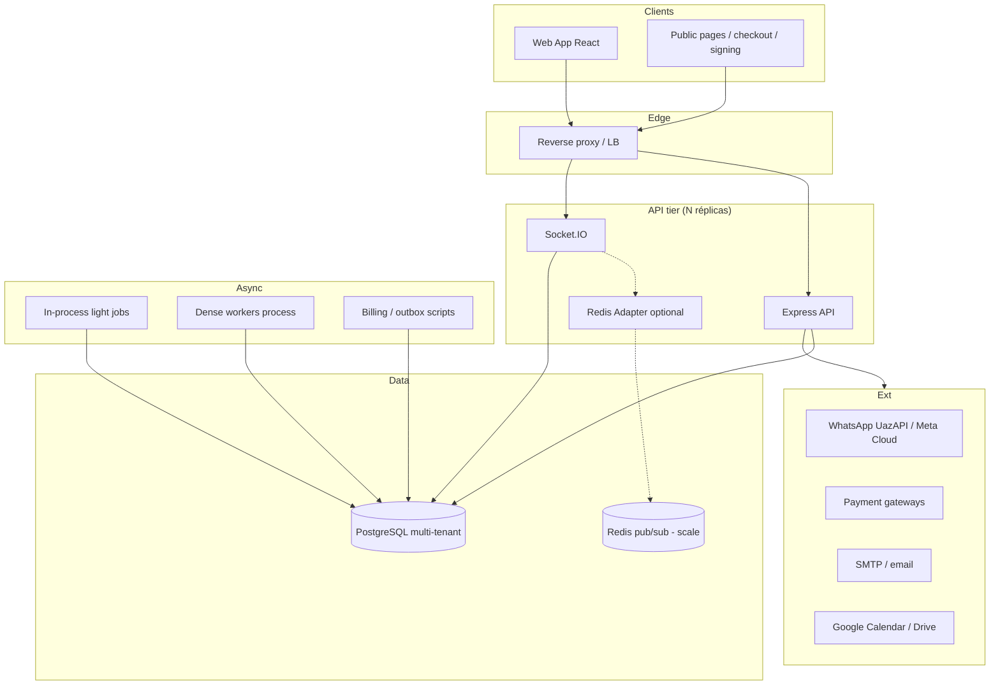
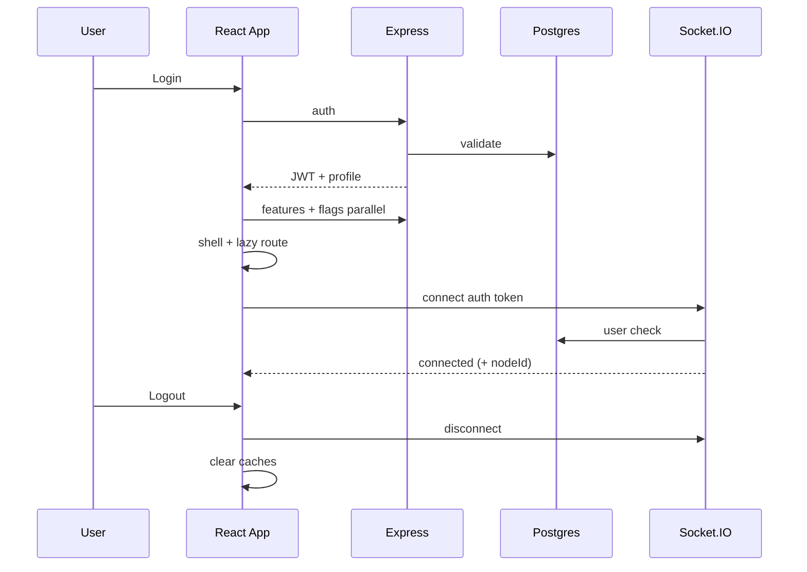
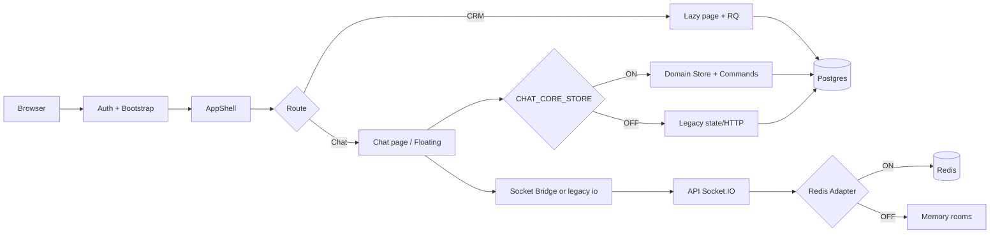
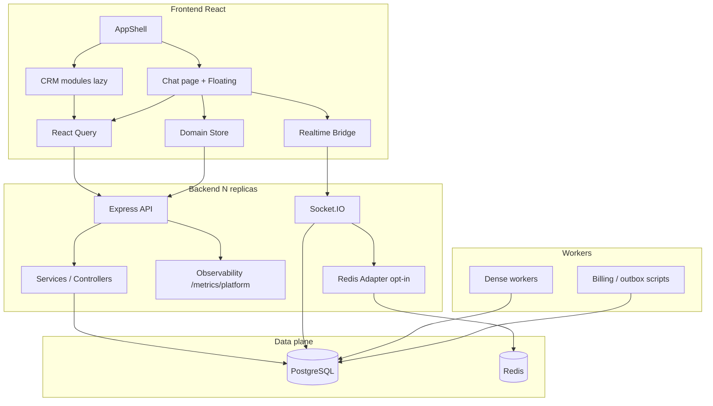

# ARCHITECTURE_BASELINE_2026

| Campo | Valor |
|---|---|
| **Documento** | ARCHITECTURE_BASELINE_2026 |
| **Tipo** | Permanent Architecture Baseline |
| **Data** | 2026-07-14 |
| **Status** | **Official Architecture Reference** |
| **Base** | MASTER_IMPLEMENTATION_FINAL_REPORT |
| **Substitui** | Consultas dispersas a audits, phases e reports históricos como ponto de partida |

---

Este documento é a **referência oficial permanente** da arquitetura do PainelCRM.

Audits, Phase closeouts, Master Implementation Plan e reports de sprint permanecem como **histórico e evidência**.  
**Nenhuma decisão futura deve contradizer esta baseline sem novo ADR e atualização simultânea deste documento.**

---

## 1. Executive Summary

### Plataforma

PainelCRM é um CRM multi-tenant SaaS (clientes, leads, funil, propostas, contratos, agenda, financeiro, atendimento WhatsApp/Chat, billing de plataforma e Super Admin).

### Estado atual (2026-07-14)

| Dimensão | Estado |
|---|---|
| Programa MASTER Phases 0–8 | **CLOSED** |
| Phase 9 Zero Polling Chat | **CLOSED** — runtime event-driven (Socket / manual / bootstrap) |
| Phase 10A/10B Conversation runtime | **CLOSED** — Store SoT writes Chat/Float; normalize idempotent |
| Produção single-node | Ready (defaults seguros) |
| Escala horizontal WebSocket | Ready **com** Redis Adapter ON + Redis HA |
| Chat Domain Store | Implementado; SoT quando `CHAT_CORE_STORE` ON |
| Coexistência legado Chat | Mantida (removido físico = Future) |
| Observabilidade plataforma | Opt-in (`OBS_METRICS`) + métricas zero-polling cliente |
| Feature flags Chat (catalog) | Default **OFF** |

### Objetivos arquiteturais

1. Isolar bounded contexts (Chat ≠ Billing ≠ Acquisition).  
2. Manter Source of Truth clara por domínio (Chat Store vs HTTP CRM vs Billing cycles).  
3. Permitir escala horizontal do realtime sem mudar contratos de domínio.  
4. Preferir flags + rollback a remoção precoce de legado.  
5. Observabilidade suficiente para canário e incidente.

### Princípios

| Princípio | Significado |
|---|---|
| Freeze sobre churn | Contratos Chat públicos exigem ADR |
| Flags-first | Catalog Super Admin; defaults OFF |
| Dual-path consciente | Legado suportado até canário estável |
| Opt-in infra | Redis Adapter, metrics, dense workers separados por env |
| Tenant isolation | JWT + RLS / escopos de permissão |
| Precedência de cache | Store > React Query > IDB (nunca IDB como SoT) |

---

## 2. System Overview



| Camada | Responsabilidade |
|---|---|
| **Frontend** | Shell, módulos de domínio, Chat UI, Floating Chat, Super Admin UI |
| **Backend** | HTTP API, Socket.IO, auth, regras de serviço |
| **Database** | PostgreSQL — dados tenant + customizações + migrations ordenadas |
| **Workers** | Jobs densos isoláveis (`workers:dense`), billing/outbox/schedulers |
| **Realtime** | Socket.IO; rooms `user:` / `tenant:`; Redis Adapter opt-in |
| **Storage** | Media local/catalog, templates WhatsApp, uploads |
| **Integrations** | WhatsApp, gateways, Google, SMTP, webhooks |
| **Super Admin** | Platform ops, flags Chat migration, tenants, Meta/WhatsApp platform |
| **Billing** | Planos, ciclos, invoices, gateways (ADRs 001/002) |
| **CRM** | Clients, leads, funnel, proposals, contracts, tasks, agenda |
| **Chat** | Inbox, mensagens, attendance, kanban tags, floating |

---

## 3. Technology Stack

| Área | Stack |
|---|---|
| **Frontend** | React, React Router, Vite, TanStack Query, contexts/providers |
| **Backend** | Node.js, Express, TypeScript (`packages/backend`) |
| **Database** | PostgreSQL (`pg`), migrations em `database/init` + `migrationOrder` |
| **Cache** | React Query, Domain Store (memória), HTTP single-flight caches, Redis (WS adapter) |
| **Realtime** | Socket.IO 4.x; `@socket.io/redis-adapter` + ioredis (opt-in) |
| **Workers** | Processos Node / scripts `tsx`; bootstrap denso separado |
| **CI/CD** | Scripts `check:migration-order`, `check:chat-sot-guards`; Vitest |
| **Storage** | Filesystem media roots (catalog, WhatsApp templates) |
| **Authentication** | JWT Bearer; AuthContext FE; ModulePermissions |
| **Observability** | `appLogger`, `/metrics/platform`, Chat metrics prod policy |
| **AI** | Preparação futura (MB-036) — **não** no runtime crítico atual |

---

## 4. Runtime Architecture

### Fluxo resumido

1. **Login** — `/api/auth` → JWT + perfil; redirect app.  
2. **Bootstrap** — AuthProvider; features ∥ flags em paralelo (`authBootstrap`); brand/unread soft-lazy.  
3. **Providers** — QueryClient, Theme, ModulePermissions, TenantBrand, FloatingChat deferred, shell.  
4. **Routing** — `App.tsx` lazy routes (`lazyWithReload`); Chat via `chatLazy` / `loadChatPage`.  
5. **Realtime** — Bridge (F1 ON) ou sockets dedicados (legado OFF); Notifications satélite.  
6. **Workers** — HTTP pode skip dense (`HTTP_SKIP_DENSE_WORKERS`); processo `workers:dense`.  
7. **Logout** — limpa sessão/query; encerra sockets.



---

## 5. Bounded Contexts

| Contexto | Ownership | Não atravessar |
|---|---|---|
| **Chat** | `src/features/chat-core`, floating-chat, chat services/controllers WS | Billing invariants; acquisition |
| **CRM** | Clients, leads, funnel, proposals, contracts, tasks | Chat Store contracts |
| **Finance** | Contas, lançamentos, AP/AR UI | Billing platform cycles |
| **Billing** | Subscriptions, cycles, invoices, gateways (ADR-001/002) | Chat realtime SoT |
| **Agenda** | Appointments, reminders, Google sync | Chat message SoT |
| **Acquisition** | Signup, trial, onboarding, checkout público | Chat Core freeze |
| **Automation** | Digests, notifications engine, webhooks | Chat Domain Store |
| **Super Admin** | Tenants, platform flags, Meta, ops kanban | Tenant CRM data paths |
| **Observability** | `packages/backend/src/observability`, chat metrics policy | Regras de negócio |
| **Infrastructure** | Redis adapter, workers topology, migration order | Domínio Chat/Billing |

Regra: mudanças cross-context exigem fronteira explícita (API/eventos) e, no Chat, ADR se tocarem freeze.

---

## 6. Chat Architecture

### Modelo definitivo

| Camada | Papel |
|---|---|
| **Bridge** | Socket único compartilhado (`CHAT_SINGLE_SOCKET`) |
| **Store** | Domain Store SoT (`CHAT_CORE_STORE`) — inbox/messages/selection |
| **Commands** | Load inbox/messages / send bridges — única pipeline com Store ON |
| **Repository** | Conversations aggregated vs legado por superfície F4 |
| **Virtualization** | Conversation list + message list (F6) |
| **Realtime** | WS-patch F2; engines F3; policy bridge-first |
| **Floating Chat** | Latest-page mensagens (ADR-011); Load More |
| **Cache** | Store > RQ > IDB; `cachePrecedence` |
| **Warmup / Window** | Warm window + sliding window cache (F6) |
| **Legacy coexistence** | Path OFF intacto; telemetria sockets residuais; sem remoção física padrão |

### Superfícies

| UI | Path / módulo |
|---|---|
| Página Chat | `/chat`, `src/pages/Chat.tsx` + `src/pages/chat/*` |
| Floating | `src/features/floating-chat/*` |
| Kanban Chat | `/chat/kanbam` |
| ClientProfile thread | perfil + bridge |

### Freeze

Ver §20 e ADR-010 / DOMAIN_STORE_FREEZE / PUBLIC_API_FREEZE.

---

## 7. Frontend Architecture

| Tema | Padrão atual |
|---|---|
| **Providers** | Auth, ModulePermissions, Theme, Query, TenantBrand, Mobile chrome, Floating deferred |
| **Contexts** | Auth, permissions, brand, unread nav, shell chrome |
| **Layouts** | `AppShell` (Header/Sidebar/Main memoizados), `AppLayout` lazy |
| **Feature modules** | `src/features/*` (chat-core, floating-chat, …) |
| **Lazy loading** | Rotas domínio + commerce forms dentro do Chat |
| **Query** | TanStack Query para listas CRM / floating aggregates |
| **Store** | Chat Domain Store (feature-flagged) |
| **Cache** | RQ + Store + small HTTP caches (`chatInstancesHttpCache`, `tenantCompanyHttpCache`) |

---

## 8. Backend Architecture

| Camada | Local típico |
|---|---|
| **Routes** | `packages/backend/src/routes/*` |
| **Controllers** | `controllers/*` (incl. chat monólito residual) |
| **Services** | `services/*` (chat, websocket, billing, …) |
| **Repositories / SQL** | Serviços + builders SQL chat agregados |
| **Middlewares** | Auth, rate limit, correlation id, CORS, helmet |
| **Realtime** | `websocketService` + `realtime/redisSocketAdapter` |
| **Workers** | `workers/denseWorkerBootstrap`, scripts `run*` |
| **Observability** | `observability/*` |
| **Config** | `config/*` env tipados |

---

## 9. Database

| Tema | Baseline |
|---|---|
| **Modelo** | Multi-tenant (`tenant_id`); RLS onde aplicável |
| **Ownership** | Domínio dono da tabela; Chat conversations/messages vs Billing cycles |
| **Migrations** | `database/init/*.sql` + `migrationOrder.ts`; CI `check:migration-order` |
| **Índices** | Hot paths inbox/messages otimizados (Phase 3); EXPLAIN documentado em sprints |
| **Boas práticas** | Sem SQL ad-hoc fora do order; `wa_archived` CRM-only; env rollbacks onde documentados |

---

## 10. Runtime Flow

### Diagrama de alto nível



Detalhe operacional: closeouts Phases 0–8 (evidência).

**Phase 9:** após bootstrap, Chat dinâmico atualiza via Socket → Store/engines; HTTP contínuo (polling / refetch periódico / focus-reconcile) está **fora** do runtime Chat. Ver `PHASE9_RUNTIME_FLOW.md`.

---

## 11. Feature Flags

### Política

- Catalog Super Admin (`chat_migration_flags`); **defaults OFF**.  
- Novas flags Chat → ADR + `catalog.ts` + BE keys.  
- Certificação canário recomendada: Store + Single Socket + Aggregated por superfície.

### Catálogo Chat Migration

| Flag | Objetivo | Default | Dependências / notas |
|---|---|---|---|
| `CHAT_SINGLE_SOCKET` | Bridge único | OFF | Pré-requisito escala limpa |
| `CHAT_WS_PATCH_*` (5) | Patch eventos WS | OFF | Alias estável = todas ON |
| `CHAT_INSTANCE_REGISTRY` | Registry instâncias | OFF | F3 |
| `CHAT_UNREAD_ENGINE` | Unread engine | OFF | F3 |
| `CHAT_ATTENDANCE_RECONCILE` | Reconcile attendance | OFF | F3 |
| `CHAT_AGGREGATED_FLOAT` | Inbox agregado Float | OFF | F4 superfície |
| `CHAT_AGGREGATED_LEAD` | Agregado Lead | OFF | F4 |
| `CHAT_AGGREGATED_SIDEBAR` | Agregado Sidebar | OFF | F4 |
| `CHAT_AGGREGATED_CHAT` | Agregado Chat page | OFF | F4 |
| `CHAT_AGGREGATED_API_SHADOW` | Shadow BE | OFF | Staging |
| `CHAT_AGGREGATED_DEV_LOG` | Logs agregados | OFF | DEV |
| `CHAT_CORE_METRICS` | Telemetria Chat | OFF | Prod: + env sampling |
| `CHAT_CORE_STORE` | Domain Store SoT | OFF | Canário longo |
| `CHAT_REDIS_WS` | Habilita Redis Adapter (com Redis) | OFF | Ou `SOCKET_IO_REDIS_ADAPTER=1` |

### Stub residual

| Flag | Estado |
|---|---|
| `CHAT_INBOX_CURSOR` | Sempre false no FE phase map; cursor coberto via Store |

### Flags plataforma / produto

Module feature flags (`useFeatureFlag`: `chat`, `clients`, `billing`, …) e `system_feature_flags` / platform registry — ownership Super Admin / tenant; **fora** do catalog Chat Migration.

---

## 12. WebSocket

| Modo | Comportamento |
|---|---|
| **Bridge (F1 ON)** | Um socket compartilhado no FE |
| **Legado (F1 OFF)** | `io()` dedicados telemetrados; CI SoT guards |
| **Single node** | Adapter memory (default) |
| **Multi node** | Redis Adapter ON — rooms/presence/fan-out cross-node |
| **Fallback** | Redis indisponível → memory; HTTP não crasha |
| **Enable** | `SOCKET_IO_REDIS_ADAPTER=1` **ou** `CHAT_REDIS_WS` + `REDIS_*` |

Salas: `user:{userId}`, `tenant:{tenantId}`.  
Config: `PHASE8_REDIS_CONFIGURATION.md` (evidência). ADR-012.

---

## 13. Workers

| Classe | Exemplos | Isolamento |
|---|---|---|
| **Dense (Chat/ops)** | Kanban, announcements, SLA, scheduled msgs, avatar | `npm run workers:dense`; skip no HTTP via env |
| **Billing / SaaS** | Recurring, reconciliation, outbox, trial | Scripts dedicados |
| **Agenda / misc** | Reminders, digests | Tick no HTTP ou script |

Princípio Phase 4: não sobrecarregar o processo HTTP com loops densos em produção multi-tenant.

---

## 14. Cache Layers

| Camada | Uso | SoT? |
|---|---|---|
| **Domain Store** | Conversas/mensagens Chat (flag ON) | **Sim** (Chat) |
| **React Query** | Listas CRM, floating aggregates | Não (cache UI/server) |
| **IndexedDB / page cache** | Warm/offline auxiliar | **Nunca** SoT |
| **HTTP single-flight** | Instances, tenant company | Dedup rede |
| **Redis** | Pub/sub Socket.IO (não cache de domínio Chat) | N/A domínio |

**Precedência Chat:** Store > React Query > IDB.

---

## 15. Observability

| Domínio | Mecanismo |
|---|---|
| HTTP | Counters/hist latency (`OBS_METRICS`) |
| SQL | Timing em `pool.query` |
| Runtime | CPU, heap, event-loop, GC best-effort |
| Workers | API `recordWorkerRun` / backlog |
| Socket | Connections, rooms, redis health |
| Chat FE | Production policy + beacon amostrado |
| Endpoint | `GET /metrics/platform` (+ Prometheus text) |
| Dashboards / Alertas | Documentados Phase 7 (`PHASE7_DASHBOARDS`, `PHASE7_ALERT_POLICY`) |

Logger: `appLogger` (`LOG_LEVEL`, `LOG_JSON`, `LOG_HTTP` opt-in).

---

## 16. Performance

Estado atual (sem baselines históricos):

- Auth bootstrap paralelo; brand/unread soft-lazy.  
- HTTP dedup instances/company; CRM lazy no Chat.  
- SQL inbox/messages hot path reshaped.  
- Workers densos isoláveis; logs estruturados.  
- Chat: Store path, virtualização, window, floating latest-page.  
- UI: Chat decomposição parcial; shell memo; lazy commerce no Chat.  
- Observabilidade e Redis Adapter **opt-in** (overhead zero no default OFF).

---

## 17. Security

| Controle | Baseline |
|---|---|
| **JWT** | Bearer; verify no HTTP e Socket handshake |
| **Tenant isolation** | `tenant_id`, RLS contexts, asserts SQL |
| **Permissions** | ModulePermissions + permission keys (`chat.*`, `billing.*`, …) |
| **Feature Flags** | Super Admin catalog; defaults OFF |
| **Ownership** | Rooms por user/tenant; métricas scrape com token opcional |
| **Metrics scrape** | `OBS_METRICS_TOKEN` recomendado em prod |

---

## 18. Scalability

| Modo | Como operar |
|---|---|
| **Single node** | Default; sem Redis Adapter |
| **Horizontal API** | N processos + Redis Adapter ON + mesmo key prefix |
| **Workers** | Escalar processo dense / billing independentemente |
| **Future** | Redis HA, sticky opcional no LB, outbox domain events (Phase B) |

Rollback escala: desligar adapter → 1 node / sticky.

---

## 19. Active ADRs

| ADR | Domínio | Título | Status |
|---|---|---|---|
| **ADR-001** | Billing | Domain Invariants | Active |
| **ADR-002** | Billing | Subscription Cycle Materialization | Active |
| **ADR-010** | Chat | Architecture Freeze (F1–F6) | Active |
| **ADR-011** | Chat | Floating Latest-Page Messages | Active |
| **ADR-012** | Chat / Infra | Redis Socket.IO Adapter | Active |

Novos ADRs: numeração sequencial; devem atualizar esta baseline (§24).

---

## 20. Architecture Freezes

| Área | Pode mudar (sem ADR Chat) | Exige ADR | Proibido sem programa |
|---|---|---|---|
| CRM / Finance UI | Evolução produto | Se tocar Chat contracts | — |
| Billing | Conforme ADR-001/002 | Novo invariante billing | Quebrar cycles |
| Chat UI apresentação | Layout/CSS sem contratos | Props públicas Store/Commands/Repo | Remover legado físico prematuro |
| Chat Store / Commands / Public API | — | **Sempre ADR** | Mutação silenciosa |
| Feature flags Chat | Valores ops | Nova flag | Flag sem catalog |
| Redis Adapter | Config ops ON/OFF | Mudança de protocolo adapter | Multi-réplica sem adapter |
| SQL schema Chat | Migration ordenada | Mudança de contrato FE | SQL fora do order |

Documentos de freeze: `DOMAIN_STORE_FREEZE.md`, `PUBLIC_API_FREEZE.md`, ADR-010.

---

## 21. Technical Debt

Somente backlog futuro (não concluído):

| ID | Débito |
|---|---|
| MB-028 | Remoção física legado Chat (após canário longo) |
| MB-029 | Decompor `chatController` |
| MB-032 | Soft-delete / limpeza page cache legado |
| MB-034 | Phase B Billing continuity |
| MB-035 | Phase B Acquisition / Onboarding |
| MB-036 | AI Platform prep |
| MB-037 | Outbox / workers P0 SaaS |
| Ops | Canário produção Store+F1+F4+F5 + Redis HA |
| Residual | Stub `CHAT_INBOX_CURSOR`; eventos WS legacy (L-RT-06); Notifications socket satélite |

---

## 22. Future Roadmap

| Trilha | Escopo |
|---|---|
| **Phase B** | Billing / Acquisition / Outbox — paralelo, zero touch Chat freeze |
| **AI** | MB-036 — ADR próprio; não misturar hot path Chat |
| **Remoção legado** | MB-028 pós-canário + tracker `REMOVE_READY` |
| **Controller decomposition** | MB-029 |
| **Outbox / domain events** | MB-037 |

**Não reabrir Phases 0–8** como programa; evoluções pontuais via ADR + atualização desta baseline.

---

## 23. Document Hierarchy

```
ARCHITECTURE_BASELINE_2026          ← referência oficial atual
        ↓
ADRs (decisões vinculantes)
        ↓
Sprint Plans (escopo autorizado)
        ↓
Sprint Closeouts (evidência de gate)
        ↓
Audits (análise)
        ↓
Reports / Master Plan histórico
```

Em conflito: **Baseline + ADR vigente** prevalecem sobre audits e closeouts antigos.

---

## 24. Maintenance Rules

1. Toda alteração arquitetural relevante **atualiza este documento** na mesma mudança.  
2. Nenhuma ADR pode contradizer a baseline **sem** atualizar a baseline no mesmo PR.  
3. Toda nova feature deve respeitar bounded contexts e freezes (§5, §20).  
4. Novas flags Chat → ADR + catalog + linha nesta baseline (§11).  
5. Histórico (Phases, audits) não é ponto de partida para implementação — é evidência.  
6. IAs e novos desenvolvedores consultam **prioritariamente** este arquivo antes de propor mudanças.

---

## 25. Final Architecture Diagram



---

## Apêndice — Ponteiros de evidência (não baseline)

| Tema | Documento histórico |
|---|---|
| Programa 0–8 | `MASTER_IMPLEMENTATION_PLAN.md`, `MASTER_IMPLEMENTATION_FINAL_REPORT.md` |
| Status curto | `ARCHITECTURE_STATUS_2026.md` |
| Closeouts | `docs/architecture/sprints/PHASE*_CLOSEOUT.md` |
| Chat freeze detalhe | `chat/ADR-010*`, `DOMAIN_STORE_FREEZE`, `PUBLIC_API_FREEZE` |
| Flags audit | `chat/FEATURE_FLAGS_AUDIT.md` |
| Redis ops | `sprints/PHASE8_REDIS_CONFIGURATION.md` |
| Métricas/alertas | `sprints/PHASE7_*` |

---

**Fim da ARCHITECTURE_BASELINE_2026 — Official Architecture Reference.**
