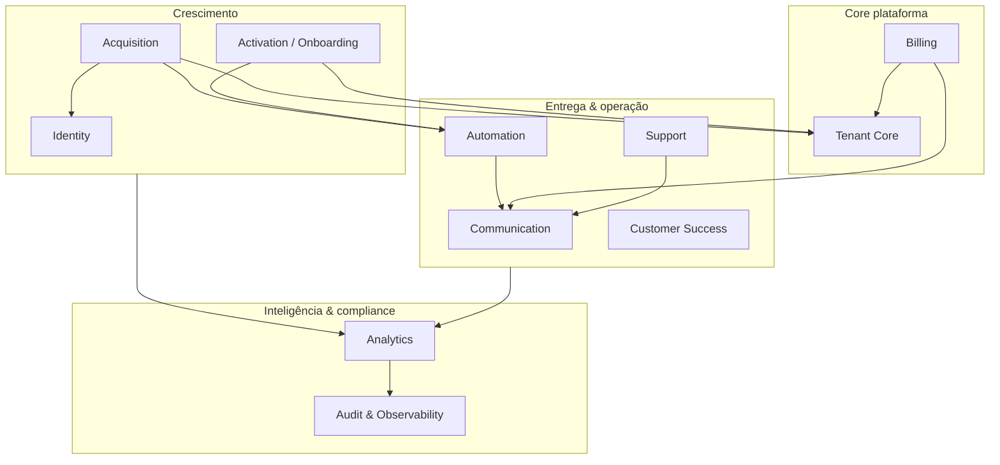
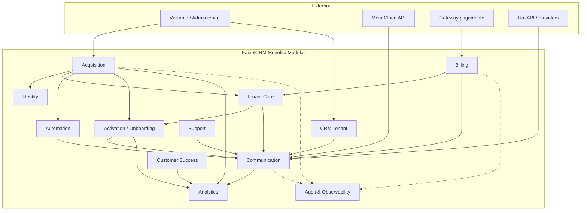
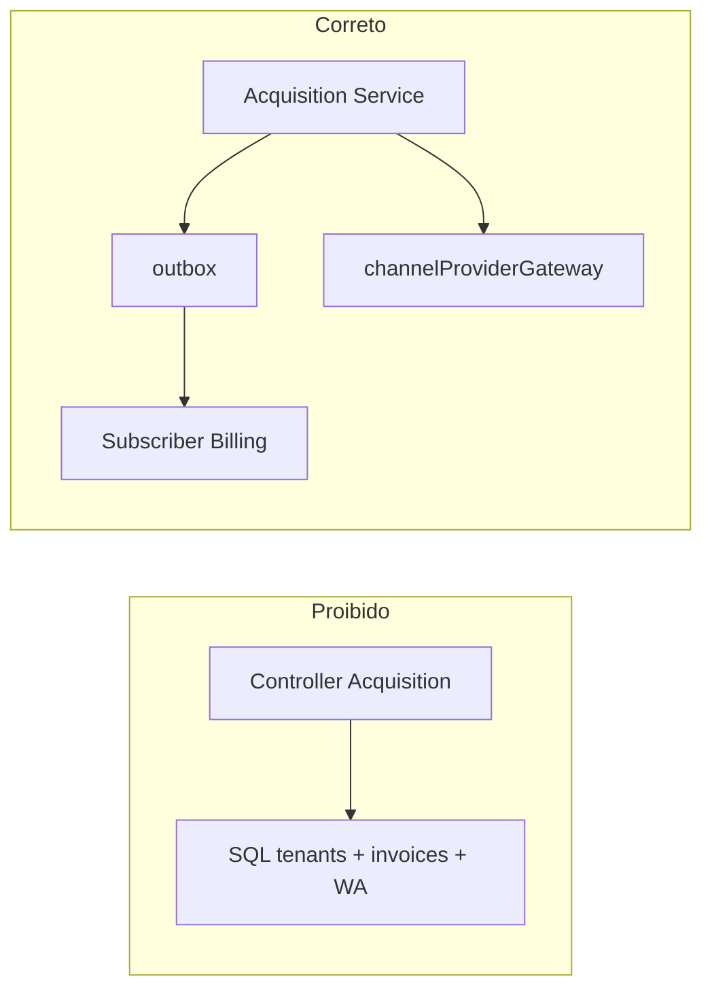
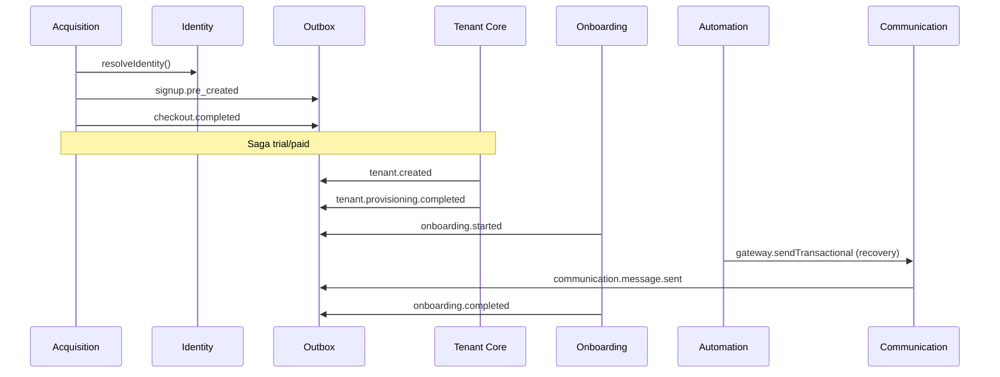
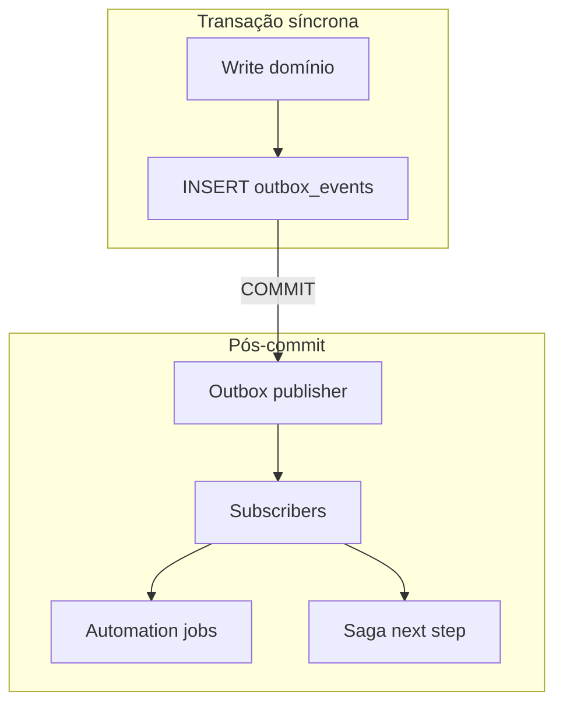
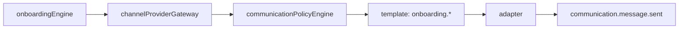
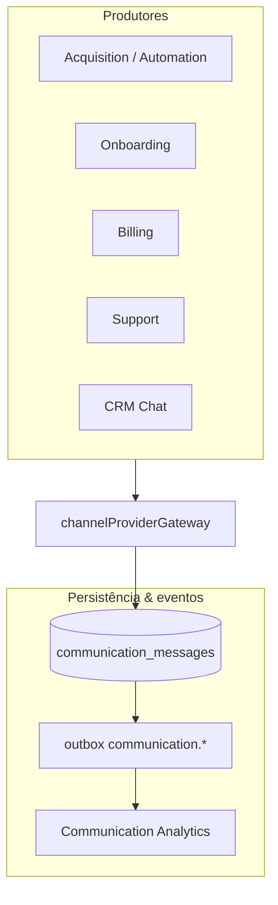

# Architecture — System Context Map (PainelCRM)

**Tipo:** documentação arquitetural oficial (base de implementação).  
**Versão:** 1.0  
**Data:** maio/2026  
**Status:** planejamento — **não implementar** código com base apenas neste documento sem alinhamento de ownership e sign-off P0.

**Documento mestre de detalhe:** [`MASTER_PLAN_SIGNUP_TRIAL_ONBOARDING_CONVERSION.md`](./MASTER_PLAN_SIGNUP_TRIAL_ONBOARDING_CONVERSION.md) (aquisição, lifecycle, outbox, communication platform).

**Objetivo deste mapa:** definir **bounded contexts**, ownership, eventos, dependências permitidas/proibidas e fronteiras transacionais para evitar acoplamento, serviços gigantes e refatorações repetidas ao escalar SaaS, automações, IA e multi-provider.

---

## Índice

1. [Visão geral da plataforma](#1-visão-geral-da-plataforma)
2. [Princípios arquiteturais](#2-princípios-arquiteturais)
3. [System Context Map — bounded contexts](#3-system-context-map--bounded-contexts)
4. [Relacionamento entre contextos](#4-relacionamento-entre-contextos)
5. [Domain Events Map](#5-domain-events-map)
6. [Transaction boundaries](#6-transaction-boundaries)
7. [Communication Flow Map](#7-communication-flow-map)
8. [Data ownership](#8-data-ownership)
9. [Future expansion strategy](#9-future-expansion-strategy)
10. [Implementation guidelines](#10-implementation-guidelines)
11. [Conclusão](#11-conclusão)

---

## 1. Visão geral da plataforma

### 1.1 O que o PainelCRM está se tornando

O PainelCRM evolui de **CRM operacional com WhatsApp** para **plataforma SaaS modular orientada a eventos**, capaz de:

- Adquirir e converter clientes (pré-cadastro → checkout → trial → pagamento).
- Provisionar tenants com limites e lifecycle explícito.
- Cobrar e recuperar inadimplência sem acoplar aquisição ao core financeiro.
- Comunicar por múltiplos canais e providers (Meta Cloud API-ready).
- Orquestrar automações com delays, retries e compensação.
- Medir ativação, saúde, adoção e funil de produto.
- Operar customer success e suporte com auditoria e rastreio ponta a ponta.

O **produto CRM** (chat, agenda, propostas, financeiro do tenant) permanece; a **plataforma SaaS** envolve camadas transversais que hoje estão parcialmente espalhadas (`planPurchaseController`, `platformNotifications`, checklist de ativação, billing workers).

### 1.2 Visão SaaS operacional

| Camada | Papel |
|--------|--------|
| **Experiência** | Landing, checkout, onboarding guiado, superadmin operacional |
| **Plataforma** | Identidade global, sessão de signup, lifecycle tenant/user, flags, audit |
| **Crescimento** | Aquisição, recovery, trial, activation, health, CS pipeline |
| **Receita** | Billing SaaS (assinatura plataforma), webhooks gateway, reconciliação |
| **Comunicação** | Gateway único, templates, policy, webhooks normalizados |
| **Inteligência** | Analytics, timelines IA-ready, métricas de comunicação |
| **CRM tenant** | Domínio de negócio do cliente final (fora do escopo detalhado deste mapa, mas com fronteiras claras) |

### 1.3 Arquitetura modular dentro do monólito

**Estratégia:** **modular monolith** em `packages/backend` — módulos por contexto com APIs internas explícitas, sem microservices prematuros.

```text
packages/backend/src/
  acquisition/          # Acquisition Context (futuro)
  identity/             # Identity Context (futuro, extrai utils atuais)
  platform/             # Tenant Core + flags + audit (parcial hoje)
  billing/              # Billing Context (existente, contrato estável)
  onboarding/           # Activation / Onboarding (futuro engine)
  communication/        # Communication Platform (futuro)
  automation/           # Automation Context (futuro orchestrator)
  analytics/            # Analytics Context (futuro + rollups)
  customerSuccess/      # CS Context (futuro pipeline)
  support/              # Support Context (parcial: platform support)
  observability/        # Audit, correlation, métricas transversais
  domainEvents/         # Outbox + subscribers (futuro canônico)
  # ... CRM existente: chat, appointments, proposals, etc.
```

Deploy único, schema PostgreSQL compartilhado, **ownership por tabela e por serviço** — não por “pacote gigante `services/`”.

### 1.4 Estratégia futura (sem microservices prematuros)

| Fase | Forma |
|------|--------|
| **Agora** | Monólito modular + outbox + workers no mesmo processo |
| **Escala média** | Workers dedicados (outbox, automation, billing) — mesmo repo |
| **Escala alta** | Extrair **um** contexto por vez (ex. `communication-service`) mantendo contratos de eventos |
| **Nunca cedo** | Dividir antes de fronteiras e ownership estarem estáveis neste documento |

Critério de extração: contexto com **equipe dedicada**, **carga isolável** e **zero JOIN cross-context em hot path**.

### 1.5 Domínios transversais do ecossistema SaaS



| Domínio | Contexto principal | Pergunta que responde |
|---------|-------------------|------------------------|
| **Onboarding** | Activation / Onboarding | “O tenant atingiu valor inicial?” |
| **Acquisition** | Acquisition | “Como entrou e em que etapa está a intenção comercial?” |
| **Activation** | Activation / Onboarding | “Qual score e checkpoints de ativação?” |
| **Billing** | Billing | “Está pago, em trial ou inadimplente na plataforma?” |
| **Communication** | Communication | “Como enviamos e recebemos mensagens?” |
| **Automation** | Automation | “Quando e o que executar de forma assíncrona?” |
| **Analytics** | Analytics | “Como medimos funil, saúde e adoção?” |
| **Lifecycle** | Tenant Core (+ User) | “Em que estado está a conta na plataforma?” |

---

## 2. Princípios arquiteturais

### 2.1 Modular monolith

- Um repositório, um deploy principal, **múltiplos módulos com fronteiras**.
- Imports entre contextos só via **API pública do módulo** (`index.ts` / facade), nunca controllers cruzados.
- CRM tenant não importa `acquisition/*` diretamente.

### 2.2 Event-driven internally

- Comunicação **entre contextos** preferencialmente por **domain events** + **transactional outbox** (MASTER §44, §68).
- Síncrono apenas quando necessário para UX ou consistência imediata na mesma transação.

### 2.3 Provider abstraction

- Qualquer envio (WhatsApp, e-mail, SMS futuro) passa por **`channelProviderGateway`** (MASTER §59).
- Adapters: `metaCloudAdapter`, `uazapiAdapter`, `smtpEmailAdapter` — plugáveis.

### 2.4 Domain ownership

- Cada entidade tem **um** contexto dono; outros leem via API ou projeção/evento, não SQL ad hoc.
- Violação = débito técnico registrado e corrigido no próximo sprint do contexto dono.

### 2.5 Eventual consistency controlada

- Aceitável: analytics, health score, kanban coluna, métricas de comunicação (segundos/minutos).
- Inaceitável: tenant criado sem user; cobrança confirmada sem evento de ativação; mensagem enviada sem registro `communication_messages`.

### 2.6 Transactional boundaries

- Uma transação PostgreSQL por **comando de negócio** dentro do mesmo contexto ou saga explícita (MASTER §45).
- Side-effects externos **sempre** após COMMIT via outbox.

### 2.7 Outbox pattern

- Tabela `outbox_events`; publisher worker; dead-letter; replay; idempotência no consumer (MASTER §44).

### 2.8 Orchestration

- **Sagas** para fluxos multi-contexto (trial activation, paid conversion) — MASTER §45.
- **Automation orchestrator** para jobs agendados (delays, retries) — MASTER §36.
- Não confundir os dois.

### 2.9 Anti-acoplamento

| Permitido | Proibido |
|-----------|----------|
| Context A publica evento; B consome | A importa serviço interno de B |
| Facade síncrona documentada (ex. `resolveIdentity`) | Query JOIN cross-context em controller |
| Anti-corruption layer em adapter | Copiar tipos de outro contexto no controller |
| Read model / rollup alimentado por eventos | Duplicar lógica de billing em acquisition |

---

## 3. System Context Map — bounded contexts

Legenda de colunas:

- **Emitidos / Consumidos:** prefixos de evento; catálogo completo na [§5](#5-domain-events-map).
- **Deps permitidas:** facades ou eventos.
- **Deps proibidas:** acoplamento direto a implementação interna.

---

### 3.1 Acquisition Context

| Atributo | Definição |
|----------|-----------|
| **Nome** | `Acquisition` |
| **Responsabilidade** | Intenção comercial antes e durante conversão: pré-cadastro, sessão, checkout, abandono, oferta trial, magic link de ativação, anti-abuso trial |
| **Entidades principais** | `signup_sessions`, `signup_session_transitions`, `activation_tokens`, `acquisition_idempotency_keys`, `signup_pipeline_cards` (projeção) |
| **Serviços principais** | `signupSessionStateMachine`, `TrialActivationService`, `trialAbuseProtectionService`, `acquisitionSagaOrchestrator` (coordena com Tenant/Onboarding) |
| **Ownership** | Squad **Growth / Platform** |
| **Eventos emitidos** | `signup.pre_created`, `signup.plan_selected`, `checkout.started`, `checkout.abandoned`, `checkout.completed`, `trial.offered`, `trial.activated`, `signup.session.merged` |
| **Eventos consumidos** | `billing.payment_confirmed`, `communication.conversation.replied` (resposta “quero trial”), `tenant.lifecycle.transition` |
| **Deps permitidas** | Identity (`resolveIdentity`), Tenant Core (criar tenant via saga), Billing (metadata sessão), Automation (agendar recovery), Communication (via gateway apenas), Analytics (emitir fatos) |
| **Deps proibidas** | `activatePlanFromBilling` direto; UazAPI/Meta direto; INSERT `tenants` sem saga; leitura de tabelas de chat CRM |

**AS-IS (referência):** `planPurchaseController`, `authController.register`, checkout trial, `sessionStorage` recovery no front.

**TO-BE:** MASTER §4, §18, §24, §45.

---

### 3.2 Identity Context

| Atributo | Definição |
|----------|-----------|
| **Nome** | `Identity` |
| **Responsabilidade** | Resolução global de identidade (e-mail, WhatsApp, CPF/CNPJ), deduplicação, vínculo sessão↔tenant↔user, política de conflito |
| **Entidades principais** | `identity_resolution_log`, índices em `users` / `signup_sessions` (não duplica ownership de user) |
| **Serviços principais** | `globalIdentityService.resolveIdentity()`, normalização (reuso `userIdentity.ts`) |
| **Ownership** | Squad **Platform** |
| **Eventos emitidos** | `identity.resolved`, `identity.conflict`, `identity.merged` |
| **Eventos consumidos** | — (serviço chamado; poucos subscribers) |
| **Deps permitidas** | Leitura controlada de `users`, `signup_sessions` (via repositório identity) |
| **Deps proibidas** | Criar tenant; enviar WhatsApp; alterar billing; lógica de onboarding |

**Regra:** todo fluxo de aquisição **chama** `resolveIdentity` antes de mutação (MASTER §17).

---

### 3.3 Tenant Core Context

| Atributo | Definição |
|----------|-----------|
| **Nome** | `TenantCore` |
| **Responsabilidade** | Tenant como conta na plataforma: status, lifecycle, quotas, provisioning de recursos, limites de plano |
| **Entidades principais** | `tenants`, `tenant_lifecycle_transitions`, `tenant_provisioning_runs`, `tenant_communication_routing` (com Communication) |
| **Serviços principais** | `tenantLifecycleService`, `userLifecycleService` (coordenação com Identity), `tenantProvisioningService`, `featureFlagRegistry` (avaliação tenant) |
| **Ownership** | Squad **Platform** |
| **Eventos emitidos** | `tenant.created`, `tenant.lifecycle.transition`, `tenant.provisioning.completed`, `tenant.provisioning.failed`, `tenant.suspended`, `tenant.cancelled` |
| **Eventos consumidos** | `billing.subscription.changed`, `acquisition.trial.activated`, `billing.payment_confirmed` |
| **Deps permitidas** | Identity (resolve antes de criar), Billing (estado comercial espelhado), Onboarding (`initialize` idempotente), Communication (routing row) |
| **Deps proibidas** | Templates WhatsApp; jobs de recovery; SQL de `signup_sessions` em controllers tenant; alterar faturas |

**AS-IS:** `tenants.status`, `onboarding_completed` setado cedo no trial.

**TO-BE:** MASTER §28, §46, §47.

---

### 3.4 Billing Context

| Atributo | Definição |
|----------|-----------|
| **Nome** | `Billing` |
| **Responsabilidade** | Assinatura SaaS da plataforma, faturas, webhooks Asaas/MP, recorrência, inadimplência, reconciliação, recovery financeiro — **contrato estável** |
| **Entidades principais** | `tenant_billing`, faturas plataforma, jobs recorrência, logs reconciliação |
| **Serviços principais** | `subscriptionService`, `activatePlanFromBilling` (**não reescrever**), `billingReconciliationService`, workers financeiros, `billingOverdueStatusService` |
| **Ownership** | Squad **Billing / Finance Platform** |
| **Eventos emitidos** | `billing.payment_confirmed`, `billing.payment_failed`, `billing.subscription.changed`, `billing.invoice.created`, `billing.overdue` |
| **Eventos consumidos** | `tenant.created` (vincular), `acquisition.checkout.completed` (metadata) |
| **Deps permitidas** | Tenant Core (tenant_id), Communication (notificações transacionais via gateway), Audit |
| **Deps proibidas** | Criar signup_session; onboarding steps; chamar provider WhatsApp direto; lógica de trial abuse |

**Docs relacionados:** `BILLING_RECOVERY_ENGINE.md`, `BILLING_NOTIFICATION_HARDENING.md`.

---

### 3.5 Activation / Onboarding Context

| Atributo | Definição |
|----------|-----------|
| **Nome** | `ActivationOnboarding` |
| **Responsabilidade** | Jornada pós-conta: engine de passos, activation score, first value, recovery de onboarding parado |
| **Entidades principais** | `onboarding_progress`, `tenant_first_value_events`, `onboarding_recovery_logs`, `activation_score_snapshots` |
| **Serviços principais** | `onboardingEngine/`, `activationScoreService`, `firstValueService`, checkpoints API |
| **Ownership** | Squad **Product Growth** |
| **Eventos emitidos** | `onboarding.started`, `onboarding.step_completed`, `onboarding.completed`, `onboarding.stalled`, `activation.score.updated`, `first_value.achieved` |
| **Eventos consumidos** | `tenant.provisioning.completed`, `communication.message.delivered`, `communication.whatsapp.connected` (via milestone), `trial.activated` |
| **Deps permitidas** | Tenant Core (tenant status), Communication (nudges), Automation (reminders), Analytics |
| **Deps proibidas** | Criar tenant; processar pagamento; adapters Meta/UazAPI; estado de signup session (só leitura via API Acquisition) |

**AS-IS:** `activationChecklistService`, `/onboarding` fragmentado.

**TO-BE:** MASTER §30, §31, §32, §22.

---

### 3.6 Communication Context

| Atributo | Definição |
|----------|-----------|
| **Nome** | `Communication` |
| **Responsabilidade** | Envio e recebimento omnichannel; templates; policy Meta; webhooks normalizados; conversas lógicas |
| **Entidades principais** | `communication_messages`, `communication_conversations`, `communication_templates`, `communication_webhook_receipts`, `tenant_communication_routing` |
| **Serviços principais** | `channelProviderGateway`, `communicationPolicyEngine`, `communicationTemplateRegistry`, `communicationWebhookNormalizer`, `providerRoutingService`, `conversationOrchestrator`, `communicationAnalyticsService` |
| **Ownership** | Squad **Platform Messaging** |
| **Eventos emitidos** | `communication.message.*`, `communication.conversation.*`, `communication.template.*`, `communication.provider.failover` |
| **Eventos consumidos** | Comandos de outros contextos via **gateway API** (não eventos de negócio para “enviar agora” — isso é síncrono no gateway + outbox de resultado) |
| **Deps permitidas** | Outbox (publicar após send), Tenant routing row, Audit |
| **Deps proibidas** | Regras de billing; transição signup SM; criar tenant |

**AS-IS:** `platformNotifications/*`, `notificationsEngine/*`, chat UazAPI — **bridge** até C0–C2 (MASTER §59, §71).

**Bridge temporária:** `uazapiAdapter` delega ao motor legado.

---

### 3.7 Automation Context

| Atributo | Definição |
|----------|-----------|
| **Nome** | `Automation` |
| **Responsabilidade** | Agendamento, delays, retries, fan-out multi-canal, cancelamento por conversão, workflows futuros |
| **Entidades principais** | `automation_jobs`, `recovery_automation_logs` (projeção recovery) |
| **Serviços principais** | `automationOrchestrator/`, executors por `job_type` |
| **Ownership** | Squad **Platform** (compartilhado com Growth para jobs de aquisição) |
| **Eventos emitidos** | `automation.job.scheduled`, `automation.job.completed`, `automation.job.failed`, `automation.job.cancelled` |
| **Eventos consumidos** | `checkout.abandoned`, `onboarding.stalled`, `trial.offered`, `billing.overdue` (política futura), `communication.message.failed` |
| **Deps permitidas** | Communication (**somente** gateway), Acquisition (ler sessão), Onboarding, Customer Success (criar task) |
| **Deps proibidas** | Provider SDK; SQL cross-context sem facade; enviar e-mail/WhatsApp fora do orchestrator |

**TO-BE:** MASTER §36.

---

### 3.8 Analytics Context

| Atributo | Definição |
|----------|-----------|
| **Nome** | `Analytics` |
| **Responsabilidade** | Métricas de produto, funil SaaS, health score, feature adoption, rollups de comunicação — **read-heavy**, eventual |
| **Entidades principais** | `product_analytics_events`, `trial_conversion_metrics`, `saas_funnel_cohorts`, `tenant_health_snapshots`, `tenant_feature_adoption`, `communication_metrics_daily` |
| **Serviços principais** | `productAnalyticsService`, `healthScoreRecalculator`, `featureAdoptionService`, `communicationAnalyticsService` (métricas comm delegadas) |
| **Ownership** | Squad **Data / Growth Analytics** |
| **Eventos emitidos** | `analytics.rollup.updated` (interno) |
| **Eventos consumidos** | Quase todos os eventos de domínio (subscriber dedicado, baixa prioridade) |
| **Deps permitidas** | Leitura de read models e snapshots; nunca mutar domínio fonte |
| **Deps proibidas** | Alterar tenant, enviar mensagens, disparar billing |

**TO-BE:** MASTER §25, §34, §35, §48, §67.

---

### 3.9 Customer Success Context

| Atributo | Definição |
|----------|-----------|
| **Nome** | `CustomerSuccess` |
| **Responsabilidade** | Operação humana e semi-automática: pipeline signup/CS, SLA, churn risk, tarefas HITL |
| **Entidades principais** | `signup_pipeline_cards`, `cs_pipeline_cards`, SLA metadata |
| **Serviços principais** | Pipeline services superadmin, integração HITL (MASTER §52) |
| **Ownership** | Squad **CS Operations** + **Platform** (UI superadmin) |
| **Eventos emitidos** | `cs.task.created`, `cs.task.escalated`, `cs.pipeline.moved` |
| **Eventos consumidos** | `onboarding.stalled`, `health.score.critical`, `saga.failed`, `provisioning.failed`, `checkout.abandoned` |
| **Deps permitidas** | Analytics (scores), Acquisition (read sessão), Communication (notificar CS interno) |
| **Deps proibidas** | Ativar plano; criar tenant; bypass gateway para cliente final |

**TO-BE:** MASTER §23, §33, §52.

---

### 3.10 Support Context

| Atributo | Definição |
|----------|-----------|
| **Nome** | `Support` |
| **Responsabilidade** | Tickets plataforma (tenant ↔ PainelCRM), SLA suporte, notificações de ticket, conversas support |
| **Entidades principais** | tickets plataforma, mensagens públicas, SLA configs |
| **Serviços principais** | `platformSupportNotifications`, controllers superadmin/tenant support |
| **Ownership** | Squad **Support Platform** |
| **Eventos emitidos** | `support.ticket.created`, `support.ticket.replied`, `support.ticket.status_changed` |
| **Eventos consumidos** | — |
| **Deps permitidas** | Communication (`message_intent=support.platform_ticket`), Tenant Core (resolver admin), Audit |
| **Deps proibidas** | Signup SM; billing core; CRM tenant tickets (contexto separado no monólito) |

**AS-IS:** `platformSupport/platformSupportNotifications.ts` — migrar para gateway (MASTER §60).

---

### 3.11 Audit & Observability Context

| Atributo | Definição |
|----------|-----------|
| **Nome** | `AuditObservability` |
| **Responsabilidade** | Audit trail global, correlation ID, logs estruturados, traces, dashboards operacionais, retenção |
| **Entidades principais** | `platform_audit_trail`, `outbox_events` (observabilidade), métricas agregadas |
| **Serviços principais** | `auditTrailService`, middleware `correlationId`, retenção (MASTER §49), exporters futuros |
| **Ownership** | Squad **Platform SRE** |
| **Eventos emitidos** | — (audit é persistência, não domínio de negócio) |
| **Eventos consumidos** | Hooks em todos os contextos (via facade `audit.record`) |
| **Deps permitidas** | Leitura append-only de audit; métricas de filas |
| **Deps proibidas** | Lógica de negócio; enviar mensagens |

**TO-BE:** MASTER §50, §54, §56, §70.

---

### 3.12 Contextos CRM (referência — fora do escopo detalhado)

O monólito contém **CRM tenant** (chat, clientes, propostas, agenda, financeiro do tenant). Regras:

| Regra | Detalhe |
|-------|---------|
| CRM **não** importa Acquisition | Anti-corruption: tenant já existe |
| CRM usa Communication para chat | `message_intent=crm.chat` |
| CRM **não** altera `tenant_billing` plataforma | Billing Context only |
| Notificações negócio tenant | `notificationsEngine` → migrar para Communication bridge |

---

### 3.13 Mapa resumo (tabela)

| # | Contexto | Módulo alvo | Criticidade P0 |
|---|----------|-------------|----------------|
| 1 | Acquisition | `acquisition/` | Sim |
| 2 | Identity | `identity/` | Sim |
| 3 | Tenant Core | `platform/tenant*` | Sim |
| 4 | Billing | existente | Estável (não quebrar) |
| 5 | Activation / Onboarding | `onboarding/` | Sim |
| 6 | Communication | `communication/` | Sim (C0–C2) |
| 7 | Automation | `automation/` | Sim |
| 8 | Analytics | `analytics/` | P1 |
| 9 | Customer Success | `customerSuccess/` + superadmin UI | P1 |
| 10 | Support | `support/` + existente | P1 |
| 11 | Audit & Observability | transversal | Sim |

---

## 4. Relacionamento entre contextos

### 4.1 Diagrama de contextos (C4 — nível sistema)



### 4.2 Matriz “quem pode falar com quem”

| De \ Para | Identity | Acquisition | Tenant | Billing | Onboarding | Communication | Automation | Analytics | CS | Support | Audit |
|-----------|----------|-------------|--------|---------|------------|---------------|------------|-----------|-----|---------|-------|
| **Identity** | — | API | API | — | — | — | — | — | — | — | log |
| **Acquisition** | API | — | saga/API | metadata | API init | **gateway** | schedule | event | event | — | log |
| **Tenant** | API | event | — | API | API | routing | — | event | event | — | log |
| **Billing** | — | event | API | — | — | **gateway** | schedule | event | — | — | log |
| **Onboarding** | — | read | API | — | — | **gateway** | schedule | event | event | — | log |
| **Communication** | — | event | routing | — | event | — | event | event | — | event | log |
| **Automation** | — | read | — | — | read | **gateway** | — | event | API task | — | log |
| **Analytics** | — | read | read | read | read | read | read | — | read | read | read |
| **CS** | — | read | read | — | read | **gateway** | — | read | — | — | log |
| **Support** | — | — | API | — | — | **gateway** | — | — | — | — | log |
| **CRM** | — | — | — | — | — | **gateway** | engine legado | event | — | tickets tenant | log |

**Legenda:** **API** = chamada síncrona à facade pública; **gateway** = `channelProviderGateway` apenas; **event** = outbox/subscriber; **saga** = orchestrator multi-contexto.

### 4.3 Anti-Corruption Layers (ACL)

| Fronteira | ACL |
|-----------|-----|
| Acquisition → Billing | DTO `SignupBillingMetadata`; nunca importar `subscriptionService` internals |
| Communication → UazAPI/Meta | Adapters `uazapiAdapter`, `metaCloudAdapter` |
| Automation → Communication | `SendTransactionalInput` — sem tipos de provider |
| Analytics → qualquer | Subscribers + snapshots; proibido `UPDATE tenants` |
| CRM → Communication | `crm.chat` intent; não usar `platformNotifications` direto em código novo |
| AS-IS notifications → Communication | Bridge adapter até deprecar |

### 4.4 Ownership boundaries (regra de ouro)



---

## 5. Domain Events Map

### 5.1 Convenções

| Regra | Valor |
|-------|--------|
| Nome | `contexto.entidade.verbo` ou `contexto.verbo` |
| Transporte | `outbox_events` → publisher → subscribers |
| Idempotência | `idempotency_key` por transição |
| Correlation | `correlation_id` obrigatório em fluxos aquisição (MASTER §54) |

### 5.2 Catálogo principal

| Evento | Emissor | Consumidores típicos | Prioridade fila |
|--------|---------|----------------------|-----------------|
| `identity.resolved` | Identity | Acquisition (opcional log) | P2 |
| `identity.conflict` | Identity | CS, Audit | P2 |
| `signup.pre_created` | Acquisition | Analytics, CS pipeline | P2 |
| `signup.plan_selected` | Acquisition | Analytics | P3 |
| `checkout.started` | Acquisition | Analytics | P3 |
| `checkout.abandoned` | Acquisition | **Automation**, Analytics, CS | P2 |
| `checkout.completed` | Acquisition | Billing (metadata), Analytics | P1 |
| `trial.offered` | Acquisition | Automation, Communication (via job) | P2 |
| `trial.activated` | Acquisition | Tenant Core, Onboarding, Analytics | P1 |
| `tenant.created` | Tenant Core | Billing, Onboarding, Analytics | P1 |
| `tenant.lifecycle.transition` | Tenant Core | Analytics, CS, Audit | P2 |
| `tenant.provisioning.completed` | Tenant Core | Onboarding, Analytics | P1 |
| `tenant.provisioning.failed` | Tenant Core | Automation, CS, Saga compensate | P0 |
| `billing.payment_confirmed` | Billing | Acquisition (fechar sessão), Tenant, Onboarding, Communication | **P0** |
| `billing.payment_failed` | Billing | Communication, CS | P1 |
| `billing.subscription.changed` | Billing | Tenant Core, Analytics | P1 |
| `billing.overdue` | Billing | Automation (futuro), Communication | P1 |
| `onboarding.started` | Onboarding | Analytics, Automation | P2 |
| `onboarding.step_completed` | Onboarding | Analytics, Activation score | P2 |
| `onboarding.completed` | Onboarding | Analytics, CS | P2 |
| `onboarding.stalled` | Onboarding | **Automation**, CS | P2 |
| `activation.score.updated` | Onboarding | Analytics, CS | P3 |
| `first_value.achieved` | Onboarding | Analytics, Health | P2 |
| `communication.message.sent` | Communication | Analytics, Recovery logs | P2 |
| `communication.message.delivered` | Communication | Onboarding milestones | P2 |
| `communication.message.read` | Communication | Analytics, Health | P3 |
| `communication.message.failed` | Communication | Automation failover, HITL | P1 |
| `communication.conversation.started` | Communication | Onboarding, Analytics | P2 |
| `communication.conversation.replied` | Communication | Acquisition SM, Automation | P1 |
| `communication.template.approved` | Communication | Template registry | P3 |
| `communication.template.rejected` | Communication | CS, Audit | P2 |
| `communication.provider.failover` | Communication | Audit, Observability | P1 |
| `automation.job.scheduled` | Automation | Audit | P3 |
| `automation.job.completed` | Automation | Analytics | P3 |
| `automation.job.failed` | Automation | CS, HITL | P2 |
| `saga.step.completed` | Acquisition (saga) | Audit | P2 |
| `saga.failed` | Acquisition (saga) | CS, Compensation | **P0** |
| `support.ticket.created` | Support | Communication, Audit | P2 |
| `support.ticket.replied` | Support | Communication | P2 |
| `health.score.critical` | Analytics | CS, Automation | P2 |
| `cs.task.created` | Customer Success | Communication (interno) | P2 |

### 5.3 Eventos legados (AS-IS — migrar)

| Legado | Alvo |
|--------|------|
| `platform.trial.started` | `trial.activated` + `tenant.lifecycle.transition` |
| `platform.billing.*` | namespace `billing.*` |
| Dispatches diretos `platformNotifications` | gateway + `communication.message.sent` |

### 5.4 Diagrama de fluxo de eventos (aquisição feliz)



---

## 6. Transaction boundaries

### 6.1 Síncrono (mesma request / mesma transação PG)

| Operação | Contexto | Notas |
|----------|----------|-------|
| `resolveIdentity` | Identity | Leitura + log; pode ser transação curta |
| Transição signup SM | Acquisition | + INSERT outbox na mesma TX |
| `tenantLifecycle.dispatch` | Tenant Core | Uma TX por transição |
| `activatePlanFromBilling` | Billing | **Contrato imutável** — uma TX billing |
| `gateway.send*` (registro) | Communication | INSERT `communication_messages` + outbox na mesma TX; adapter async após commit |
| Checkpoint onboarding | Onboarding | `onboarding_progress` + outbox |

### 6.2 Assíncrono (pós-COMMIT)

| Mecanismo | Uso |
|-----------|-----|
| **Outbox** | Domain events, comunicação status, side-effects |
| **Automation jobs** | Delays 24h/48h, retries recovery |
| **Saga orchestrator** | Passos multi-contexto com compensação |
| **Workers** | Outbox publisher, billing recurrence, health recalc |

### 6.3 O que usa outbox (obrigatório)

- Todo evento da [§5](#5-domain-events-map) que cruza contexto ou dispara side-effect.
- Resultado de envio Communication (`message.sent` / `failed`).
- Webhooks normalizados (MASTER §62).

### 6.4 O que usa orchestration (saga vs automation)

| Tipo | Quando | Exemplo |
|------|--------|---------|
| **Saga** | Fluxo com compensação e estado multi-passo | Trial activation, paid conversion |
| **Automation job** | Tempo, retry, fan-out canal | Abandono +24h WhatsApp |
| **Nenhum** | Leitura analytics, UI superadmin | Dashboard funil |

### 6.5 Diagrama de boundary



---

## 7. Communication Flow Map

**Regra absoluta:** todos os fluxos abaixo terminam em `channelProviderGateway` — nunca provider direto (MASTER §59).

### 7.1 Onboarding



| Passo | `message_intent` | Template (ex.) |
|-------|------------------|----------------|
| Nudge WhatsApp | `onboarding.nudge` | `onboarding.whatsapp.connect` |
| Lembrete passo | `onboarding.nudge` | `onboarding.step.{step}` |

### 7.2 Recovery (acquisition)

| Fluxo | Intent | Canal primário | Fallback |
|-------|--------|----------------|----------|
| Checkout abandonado | `recovery.checkout` | WhatsApp plataforma | email |
| Trial offer | `recovery.trial` | WhatsApp | email + magic link |
| Onboarding stalled | `recovery.onboarding` | WhatsApp | email → CS task |

Orquestração: **Automation** agenda → executor chama **gateway** → **Communication** persiste → **outbox**.

### 7.3 Billing notifications

| Evento billing | Intent | Owner contexto |
|----------------|--------|----------------|
| Pagamento confirmado | `transactional.billing` | Billing → Communication |
| Fatura / PIX | `transactional.billing` | Billing → Communication |
| Inadimplência | `transactional.billing` | Billing → Communication |

**ACL:** Billing não conhece Meta/UazAPI — só `SendTransactionalInput`.

### 7.4 Support notifications

| Evento | Intent |
|--------|--------|
| Ticket criado | `support.platform_ticket` |
| Resposta pública | `support.platform_ticket` |
| Status alterado | `support.platform_ticket` |

Migrar `platformSupportNotifications` para gateway (MASTER §60).

### 7.5 Mapa unificado



---

## 8. Data ownership

### 8.1 Matriz de ownership (entidades SaaS)

| Entidade / tabela | Dono | Leitura por outros | Escrita por outros |
|-------------------|------|--------------------|--------------------|
| `signup_sessions` | Acquisition | CS, Analytics (read API) | **Proibido** |
| `signup_session_transitions` | Acquisition | Audit, Analytics | **Proibido** |
| `activation_tokens` | Acquisition | Onboarding (validate API) | **Proibido** |
| `identity_resolution_log` | Identity | Audit | **Proibido** |
| `users` (campos identidade) | Identity + Tenant | Vários | Via lifecycle APIs |
| `tenants` | Tenant Core | Todos (read) | **Só Tenant / saga** |
| `tenant_lifecycle_transitions` | Tenant Core | Analytics | **Proibido** |
| `tenant_provisioning_runs` | Tenant Core | CS, Audit | **Proibido** |
| `tenant_billing` | Billing | Tenant (read status) | **Só Billing** |
| Faturas plataforma | Billing | Tenant UI | **Só Billing** |
| `onboarding_progress` | Onboarding | Tenant UI, CS | **Só Onboarding** |
| `communication_messages` | Communication | Analytics, CS | **Só Communication** |
| `communication_conversations` | Communication | CRM (via API) | **Só Communication** |
| `communication_templates` | Communication | Automation (resolve key) | **Só Communication** |
| `automation_jobs` | Automation | Audit | **Só Automation** |
| `product_analytics_events` | Analytics | — | **Só Analytics ingest** |
| `tenant_health_snapshots` | Analytics | CS, superadmin | **Só Analytics jobs** |
| `platform_audit_trail` | Audit | superadmin | **Só Audit facade** |
| `outbox_events` | Infra (Outbox) | Observability | Publishers registrados |
| `cs_pipeline_cards` | Customer Success | superadmin | **Só CS** |
| Tickets plataforma | Support | Tenant, superadmin | **Só Support** |

### 8.2 Projeções e read models

| Read model | Alimentado por | Dono da projeção |
|------------|----------------|------------------|
| `signup_pipeline_cards` | eventos Acquisition | Customer Success |
| `trial_conversion_metrics` | eventos Analytics | Analytics |
| Dashboard superadmin funil | rollups Analytics | Analytics |
| `activation_score` cache em `tenants` | Onboarding / Analytics | Onboarding (write), Analytics (recalc) |

**Regra:** projeção nunca é fonte de verdade para mutação de domínio.

### 8.3 Queries cruzadas

| Permitido | Alternativa proibida |
|-----------|----------------------|
| Facade `getSignupSessionForTenant(sessionId)` | JOIN `signup_sessions` em controller Billing |
| API `getTenantBillingStatus(tenantId)` | SELECT invoice em Acquisition |
| Snapshot health em Analytics | Calcular health em Onboarding controller |

---

## 9. Future expansion strategy

### 9.1 IA

| Hoje (preparar) | Futuro |
|-----------------|--------|
| `context_timelines` + eventos completos (MASTER §38) | RAG / recomendações CS |
| `message_intent=ai.assistant` | Copilot onboarding |
| Communication events em warehouse | Treino e avaliação |

**Fronteira:** IA **nunca** escreve em `tenants` ou `signup_sessions` — só sugere ações → HITL ou Automation.

### 9.2 Múltiplos produtos

| Mecanismo | Uso |
|-----------|-----|
| `featureFlagRegistry` | Módulos por produto |
| Tenant provisioning | `enable_modules` por plano |
| Contextos isolados | Novo produto = novo subdomínio eventos, mesmo monólito |

### 9.3 Meta Cloud API

- Novo adapter; routing por tenant (MASTER §65, §69).
- Sem alterar Acquisition/Onboarding — só `template_key` e capabilities.

### 9.4 Omnichannel

Communication Context absorve SMS, push, voice — mesma `communication_messages`, canal enum.

### 9.5 Analytics avançado

- Export outbox → ClickHouse/BigQuery (MASTER §58).
- Analytics Context único consumidor de export.

### 9.6 Event streaming

- Outbox fan-out para NATS/Kafka **read-only**.
- Monólito permanece source of truth até extração madura.

### 9.7 Workers distribuídos

| Worker | Contexto |
|--------|----------|
| `outbox-publisher` | Infra |
| `automation-executor` | Automation |
| `billing-financial` | Billing |
| `health-recalc` | Analytics |
| `comm-webhook-ingest` | Communication |

---

## 10. Implementation guidelines

### 10.1 Regras obrigatórias para código novo

1. Identificar **bounded context** antes de criar arquivo.
2. Expor **facade** em `{context}/index.ts` — imports externos só daí.
3. Mutação crítica: **idempotency_key** (MASTER §19).
4. Cross-context: **outbox event**, não import de service interno.
5. Mensagens: **somente** `channelProviderGateway`.
6. Logs: prefixo do contexto + `correlation_id`.
7. Audit: `auditTrailService.record` em transições e side-effects.
8. Flags: `featureFlagRegistry` — não `process.env` em controller.
9. Testes: unit no domínio; integração com outbox dry-run.

### 10.2 Padrões de pasta (novo módulo)

```text
{context}/
  index.ts                 # public API
  domain/
    types.ts
    events.ts
  application/
    {useCase}Service.ts
  infrastructure/
    {entity}Repository.ts
  adapters/                # ACL externos (se necessário)
```

### 10.3 Como novos módulos devem nascer

| Passo | Ação |
|-------|------|
| 1 | Entrada neste mapa + linha na tabela §3 |
| 2 | Eventos em §5 (draft PR doc) |
| 3 | Ownership squad no README do módulo |
| 4 | Facade + outbox antes de UI |
| 5 | Bridge AS-IS se legado existir |

### 10.4 Anti-patterns proibidos

| Anti-pattern | Por quê | Correção |
|--------------|---------|----------|
| Chamar provider (Meta/UazAPI) direto | Acoplamento | Adapter + gateway |
| Automação fora do orchestrator | Duplicata cron, sem retry | `automation_jobs` |
| Lógica onboarding em controller/page | Fragmentação | `onboardingEngine` |
| Bypass do gateway | Multi-ponto notify | `sendTransactionalMessage` |
| Múltiplos pontos de notify | Inconsistência | Communication Context |
| Serviço cross-domain gigante | Ownership difuso | Split por contexto |
| Queries cruzadas sem ownership | Acoplamento DB | Facade + read model |
| Publicar evento antes do COMMIT | Race / perda | Outbox na TX |
| Subscriber síncrono pesado no request | Latência | Worker |
| `activatePlanFromBilling` duplicado | Regressão financeira | Chamar contrato existente |

### 10.5 Checklist PR (arquitetura)

- [ ] Contexto identificado no título do PR
- [ ] Sem imports proibidos da matriz §4.2
- [ ] Eventos documentados se novos
- [ ] Gateway usado se comunicação
- [ ] Idempotência em webhook/job
- [ ] Audit + correlation_id
- [ ] Flag registry se comportamento novo

### 10.6 Documentação filha (a gerar)

| Documento | Conteúdo |
|-----------|----------|
| [`onboarding/ONBOARDING_ENGINE_ARCHITECTURE.md`](./onboarding/ONBOARDING_ENGINE_ARCHITECTURE.md) | Onboarding engine, activation, recovery (v1) |
| `ARCHITECTURE_ACQUISITION.md` | Detalhe Acquisition + sagas |
| [`communication/COMMUNICATION_PLATFORM_ARCHITECTURE.md`](./communication/COMMUNICATION_PLATFORM_ARCHITECTURE.md) | Communication Platform completa (v1) |
| `ARCHITECTURE_BILLING_BOUNDARIES.md` | Contrato Billing ↔ Tenant |
| [`automation/DOMAIN_EVENT_AND_OUTBOX_ARCHITECTURE.md`](./automation/DOMAIN_EVENT_AND_OUTBOX_ARCHITECTURE.md) | Outbox + event bus (v1) |
| [`automation/AUTOMATION_ORCHESTRATOR_ARCHITECTURE.md`](./automation/AUTOMATION_ORCHESTRATOR_ARCHITECTURE.md) | Workflow engine + scheduling (v1) |
| `ARCHITECTURE_EVENT_CATALOG.md` | Catálogo machine-readable (futuro) |
| `runbooks/acquisition/*` | Operação (MASTER §57) |
| `runbooks/communication/*` | Operação comm (MASTER §70) |

---

## 11. Conclusão

O PainelCRM deixa de ser tratado como um único “backend de CRM” e passa a ser uma **plataforma SaaS operacional modular**:

- **Onboarding e aquisição** deixam de espalhar SQL e WhatsApp em controllers.
- **Billing** permanece núcleo estável, integrado por eventos — não por atalhos.
- **Communication** unifica o que hoje está em `platformNotifications`, `notificationsEngine` e chat.
- **Automation** centraliza tempo e retries.
- **Analytics e Audit** tornam o sistema observável e orientado a dados para CS e produto.

Este **System Context Map** é a **base** para:

- Implementação faseada (MASTER §27, Communication C0–C7).
- Reviews de PR com ownership claro.
- Expansão Meta Cloud API, IA e omnichannel **sem** refatoração traumática.

**Próximo documento recomendado:** [`communication/COMMUNICATION_PLATFORM_ARCHITECTURE.md`](./communication/COMMUNICATION_PLATFORM_ARCHITECTURE.md) ou `ARCHITECTURE_EVENT_CATALOG.md` (derivados deste mapa).

---

## Referências

| Documento | Relação |
|-----------|---------|
| [`MASTER_PLAN_SIGNUP_TRIAL_ONBOARDING_CONVERSION.md`](./MASTER_PLAN_SIGNUP_TRIAL_ONBOARDING_CONVERSION.md) | Especificação detalhada TO-BE |
| [`BILLING_RECOVERY_ENGINE.md`](../BILLING_RECOVERY_ENGINE.md) | Billing Context recovery |
| [`BILLING_NOTIFICATION_HARDENING.md`](../BILLING_NOTIFICATION_HARDENING.md) | Notificações billing → Communication |
| [`PLANO-MESTRE-FLUXO-CONTRATACAO-NOVAS-EMPRESAS.md`](../PLANO-MESTRE-FLUXO-CONTRATACAO-NOVAS-EMPRESAS.md) | AS-IS contratação |

---

*Documento oficial v1.0 — System Context Map — PainelCRM — maio/2026. Não implementar código sem alinhamento a este mapa e sign-off P0 do MASTER PLAN.*
