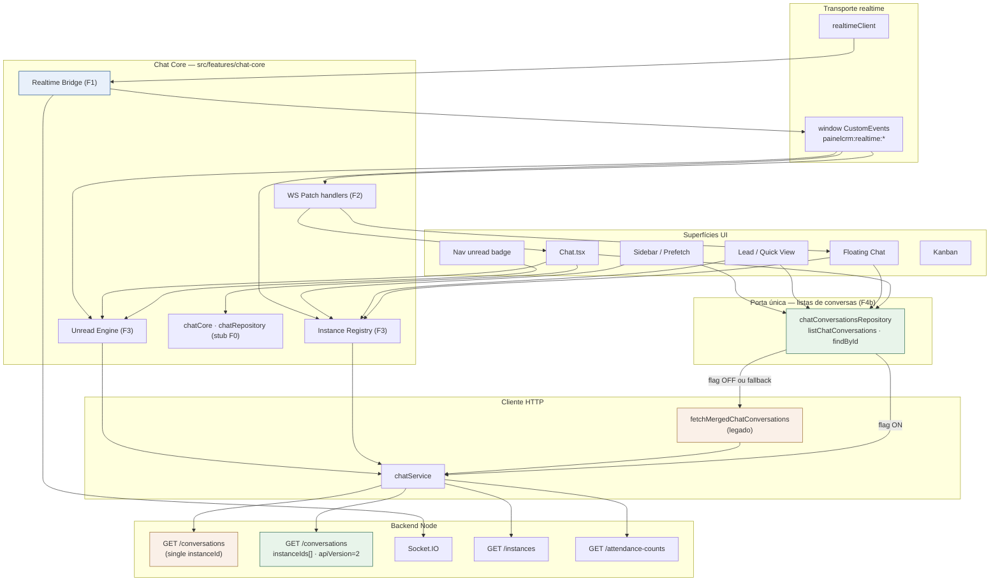
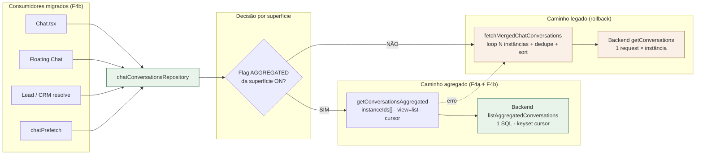
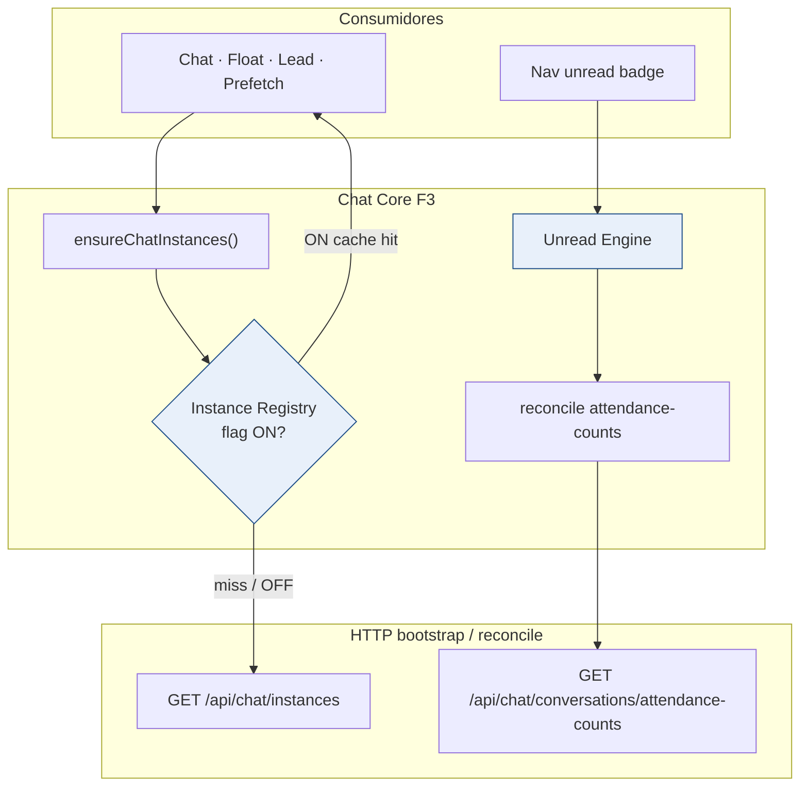
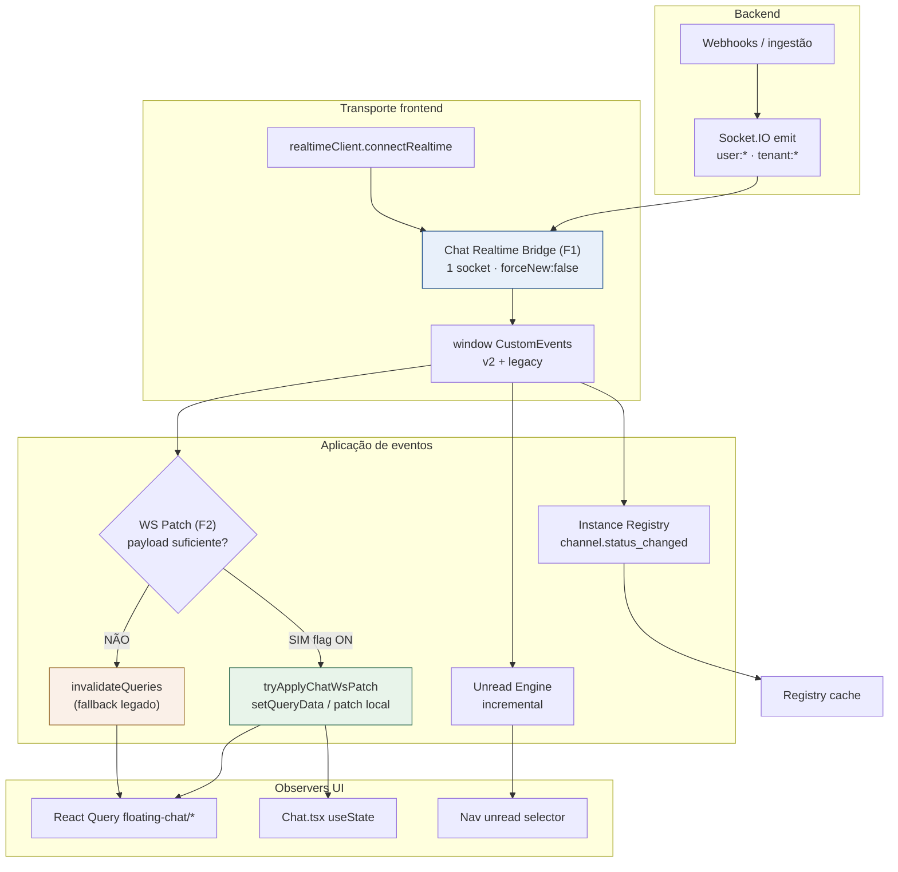
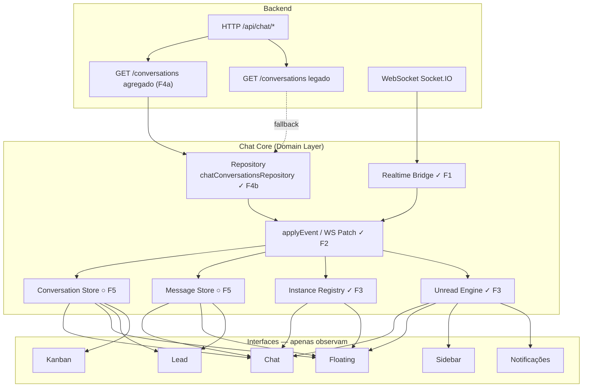
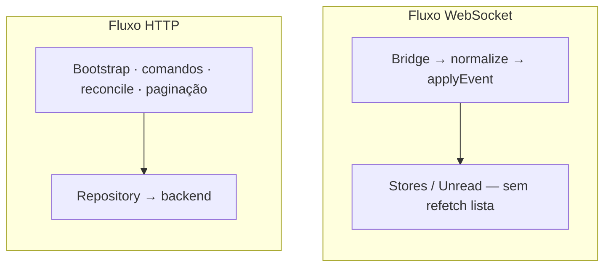
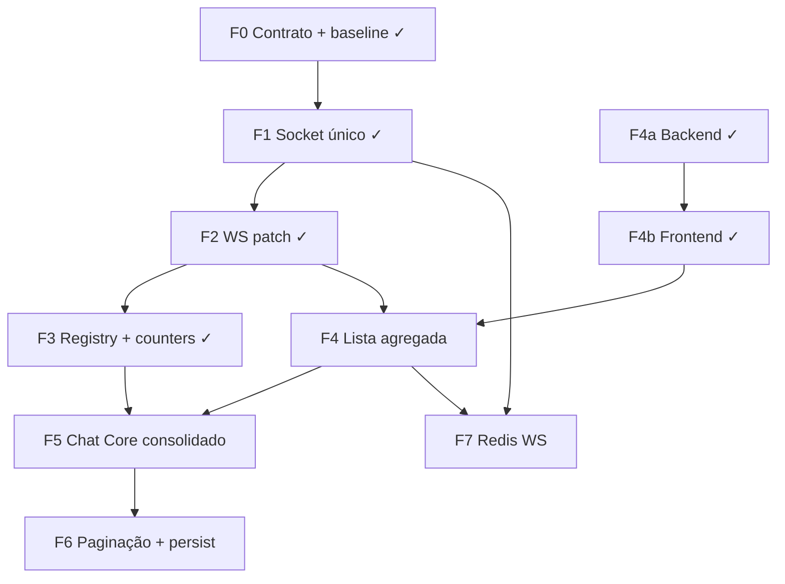

# Chat Enterprise Migration — Plano Mestre

| Campo | Valor |
|---|---|
| **Documento** | Especificação arquitetural permanente e guia oficial de migração do módulo Chat |
| **Versão** | 1.3 |
| **Data** | 2026-07-08 |
| **Idioma** | pt-BR |
| **Status** | **Especificação oficial permanente** — obrigatória para toda evolução futura do Chat |
| **Tipo** | Documentação de arquitetura e execução (sem implementação neste documento) |

### Fontes de verdade (auditorias)

Este plano consolida **exclusivamente** as três auditorias abaixo. Nenhuma decisão aqui pode contradizê-las.

| Ordem | Auditoria | Documento |
|---|---|---|
| 1 | Otimização de requisições HTTP | Investigação de endpoints, polling, duplicidades e WS→HTTP *(chat da sessão / inventário técnico)* |
| 2 | Arquitetura realtime | [`docs/architecture/chat/AUDIT_CHAT_REALTIME_ARCHITECTURE.md`](./chat/AUDIT_CHAT_REALTIME_ARCHITECTURE.md) |
| 3 | Scale readiness & migração | [`docs/architecture/chat/AUDIT_CHAT_SCALE_READINESS.md`](./chat/AUDIT_CHAT_SCALE_READINESS.md) |

**Regra:** em caso de dúvida de implementação, este plano mestre decide **ordem e governança**; as auditorias decidem **detalhe técnico e evidências**. Se houver conflito aparente, prevalece a cadeia 3 → 2 → 1 (escala/ordem → arquitetura → inventário).

---

## 1. Objetivo

### 1.1 Por que migrar

O Chat do PainelCRM **funciona** para poucos usuários simultâneos, mas a arquitetura atual **multiplica custo** (HTTP, CPU, SQL, sockets) a cada usuário, instância WhatsApp e superfície de UI (página `/chat`, floating chat, lead embed, badge nav, kanban).

As auditorias demonstraram que o problema **não é falta de WebSocket** nem ausência de React Query: é a **ausência de um núcleo de domínio único (Chat Core)** que centralize:

- bootstrap HTTP,
- aplicação de eventos realtime,
- cache/SoT,
- propagação para todas as UIs.

Sem migração, crescimento de empresas e usuários **não escala linearmente no produto** — escala linearmente (ou pior) no **desperdício**.

### 1.2 Problemas atuais (por que urgente)

1. **Arquitetura híbrida** — `/chat` usa `useState` + socket dedicado; Floating Chat usa React Query + socket global; não compartilham estado.
2. **Excesso de HTTP** — prefetch agressivo, N+1 por instância, `invalidateQueries` em toda mensagem no float (~7–9 HTTP por mensagem recebida).
3. **Múltiplas Sources of Truth** — conversas/mensagens em estado local, RQ e `chatPageCache` ao mesmo tempo.
4. **Dois sockets** na mesma sessão quando o usuário está em `/chat`.
5. **WebSocket usado como gatilho de refetch**, em vez de atualizar o cache com o payload do evento.
6. **Falta de escala horizontal WS** — Socket.IO em processo único, sem adapter Redis evidenciado.
7. **Readiness enterprise atual ~3.5/10** — inadequado para milhares de empresas e dezenas de milhares de CCU sem este roadmap.

### 1.3 Objetivos de longo prazo

| Objetivo | Resultado esperado |
|---|---|
| Escala multi-tenant | Suportar milhares de empresas sem noisy-neighbor por amplificação HTTP |
| Usuários simultâneos | Caminho certificado até ~10k CCU (com F0–F7); planejamento além via ops |
| Manutenção | Novas features sem nova refatoração estrutural |
| Multi-canal | WhatsApp (UazAPI/Oficial) + futuros canais via adapters, sem fork de UI |
| Realtime confiável | Mensagens e conversas atualizam **instantaneamente** com **mínimo HTTP** |
| Governança | Todo PR de Chat segue as regras deste documento |

**Princípio norteador (inalterável):**

> **HTTP carrega; WebSocket atualiza; o Chat Core decide; múltiplas UIs observam.**

**Ordem obrigatória da migração:**

> **Contrato → transporte (socket) → cache (patch) → registry/counters → API de lista → Chat Core consolidado → paginação → escala horizontal WS → canais.**

---

## 2. Princípios Fundamentais da Arquitetura

Estes princípios são **permanentes**. Qualquer implementação futura do módulo Chat — durante ou após a migração F0→F7 — **deve** respeitá-los. Violá-los exige **ADR** explícita (§12).

1. **Existe apenas uma Source of Truth para cada domínio de dados.**  
   Conversas, mensagens, instâncias e contadores derivados têm um único owner oficial dentro do Chat Core. Não coexistem “versões oficiais” paralelas em UI, Provider ou cache satélite.

2. **HTTP é utilizado apenas para:**  
   - bootstrap  
   - comandos  
   - sincronização explícita  
   - reconcile  
   - paginação  

   **HTTP nunca deverá ser utilizado como consequência direta de um evento realtime** quando o payload recebido for suficiente para atualizar o estado.

3. **WebSocket é responsável exclusivamente por manter o estado sincronizado.**  
   Não é um “gatilho genérico” para refetch HTTP. Entrega deltas; o Chat Core aplica.

4. **Toda atualização recebida via WebSocket deverá passar obrigatoriamente pelo Chat Core antes de chegar à interface.**  
   Nenhum componente visual aplica evento de mensagem/conversa/instância diretamente a partir do socket ou de `CustomEvent` como SoT.

5. **Nenhum componente visual poderá manter estado oficial de mensagens, conversas ou instâncias.**  
   Estado de UI (drafts, painéis abertos, scroll, foco) é permitido; SoT de domínio não.

6. **Toda interface deve apenas observar o estado publicado pelo Chat Core.**  
   Via selectors / subscriptions oficiais — não via cópia local do domínio.

7. **Nenhum componente poderá abrir uma conexão Socket.IO própria.**  
   Existe um único ponto de conexão gerido pelo Chat Core (Realtime Bridge).

8. **Toda comunicação com o backend deverá passar pelos serviços oficiais do domínio.**  
   Repository / APIs do Chat Core — interfaces não chamam HTTP de domínio ad hoc.

9. **Toda nova funcionalidade deverá seguir esta arquitetura.**  
   Feature nova não inventa canal paralelo de dados ou realtime.

10. **Toda exceção arquitetural deverá ser documentada através de uma ADR.**  
    Sem ADR, a exceção não é válida.

---

## 3. O que é o Chat Core

O Chat Core é o núcleo do módulo Chat e a única camada responsável pelo domínio da aplicação. Toda comunicação HTTP, eventos WebSocket, sincronização, aplicação de eventos, gerenciamento de estado e distribuição de dados passam obrigatoriamente por ele. As interfaces (Chat, Floating Chat, Kanban, Lead, Sidebar e futuras integrações) apenas consomem o estado publicado pelo Chat Core e enviam comandos, nunca acessando diretamente a lógica de domínio.

A especificação detalhada (responsabilidades, subpartes e diagramas) está na **§4.6** (implementação atual pós-F4b) e na **§5.3** (alvo arquitetural).

---

## 4. Estado atual

### 4.1 Baseline histórica (pré-migração F0)

> **Nota:** diagrama de referência do estado **antes** do roadmap F0→F7. A arquitetura **implementada hoje** está na §4.6.

```
UI:  Chat.tsx | FloatingChat | LeadEmbed | NavUnread | Kanban | ClientProfile
        │            │              │            │
   useState+cache   React Query   React Query   HTTP poll
        │            │              │            │
   socket dedicado  window events ← realtimeClient (socket global)
        │                              │
        └──────────── chatService ─────┘
                         │
                    /api/chat/* + Socket.IO (1 processo Node)
```

| Superfície | Estado | Realtime | HTTP |
|---|---|---|---|
| Página `/chat` | `useState` + `chatPageCache` | Socket próprio (`forceNew`) | loadInstances / loadConversations / loadMessages |
| Floating Chat | React Query (`floating-chat/*`) | CustomEvents do socket global | prefetch + invalidate → refetch |
| Lead embed | React Query (`lead-profile/*`) | CustomEvents | sync + get messages |
| Nav unread | estado local no hook | CustomEvents + poll 120s | `listInstances` + `attendance-counts` |

Backend: REST multi-tenant com `tenant_id`; WS em salas `user:{id}` / `tenant:{id}`; ingestão por webhooks. **A fragmentação crítica está no frontend.**

### 4.2 Principais problemas

| # | Problema | Evidência consolidada |
|---|---|---|
| P1 | Dual Socket.IO | `realtimeClient` + `Chat.tsx` `io()` |
| P2 | WS → `invalidateQueries` | FloatingChatProvider + FloatingConversationWindow |
| P3 | N+1 `getConversations` | Loop por instância em `chatConversationsFetch` / Chat.tsx |
| P4 | Prefetch não coordenado | prefetch idle + hover + Provider |
| P5 | Contadores reconsultados | poll + pós-lista + eventos WS |
| P6 | God component | `Chat.tsx` domínio + UI + realtime + CRM |
| P7 | Keys RQ fragmentadas | `floating-chat` vs `lead-profile` vs `chat` |
| P8 | Sem cursor de inbox | risco em tenants com muitas conversas |
| P9 | Sem Redis WS adapter | bloqueia multi-réplica Node |

### 4.3 Duplicidades

- Dois tratamentos do mesmo evento WS (patch na página, refetch no float).
- Dois listeners de `message.created` no float (Provider + Window).
- Múltiplos `listInstances` (Chat, Provider, NavUnread, queries `connected-instances`, prefetch).
- Prefetch e Provider repetem as mesmas listas (`all` / `mine` / `unread` / bubble).
- `sync` + `get` messages em paralelo na abertura.

### 4.4 Excesso de requisições (ordem de magnitude)

| Cenário | HTTP estimado (N≈4 instâncias) |
|---|---|
| Idle/prefetch do shell | ~20–25 |
| Abrir `/chat` | ~9 (+ socket extra) |
| 1 mensagem recebida com float aberto | ~7–9 |
| Após migração F0–F6 (alvo) | idle ~3–5; por mensagem ~0–1 |

### 4.5 Múltiplas Sources of Truth

| Dado | Fontes atuais | SoT alvo |
|---|---|---|
| Conversas | useState + RQ + pageCache | Chat Core — Conversation Store |
| Mensagens | useState + RQ + pageCache | Chat Core — Message Store |
| Instâncias | 5+ consumidores sem registry | Chat Core — Instance Registry |
| Contadores unread | estado Chat + NavUnread + prefetch | Chat Core — Unread Engine (derivado + reconcile) |
| UI float (painéis) | Provider + localStorage | Permanece UI state (não domínio) |

### 4.6 Arquitetura atual (pós-F4b)

Estado **implementado** após F0–F4b (flags OFF por default). O código novo coexiste com o legado; ativação é incremental por feature flag.

**Documentos relacionados:** [`SPRINT_F4b_FRONTEND_AGGREGATED_MIGRATION_REPORT.md`](./chat/SPRINT_F4b_FRONTEND_AGGREGATED_MIGRATION_REPORT.md) · [`LEGACY_REMOVAL_TRACKER.md`](./chat/LEGACY_REMOVAL_TRACKER.md)

#### 4.6.1 Visão geral — camadas



| Camada | Implementação atual | Flag / gate |
|---|---|---|
| Listas de conversas | `chatConversationsRepository` (porta única F4b) | `VITE_CHAT_FF_AGGREGATED_*` por superfície |
| API agregada | `getConversationsAggregated` → backend F4a | `CHAT_AGGREGATED_CONVERSATIONS=1` |
| Fallback listas | `fetchMergedChatConversations` (N+1) | automático em erro ou flag OFF |
| Socket único | `ChatRealtimeBridge` via `realtimeClient` | `VITE_CHAT_FF_SINGLE_SOCKET` |
| Patch WS | `tryApplyChatWsPatch` antes de invalidate | `VITE_CHAT_FF_WS_PATCH_*` |
| Instâncias | `ensureChatInstances` → Instance Registry | `VITE_CHAT_FF_INSTANCE_REGISTRY` |
| Contadores | Unread Engine + reconcile | `VITE_CHAT_FF_UNREAD_ENGINE` |
| Conversation / Message Store | **Ainda não consolidado (F5)** | `useState` Chat + RQ float/lead |

#### 4.6.2 Fluxo HTTP — listas de conversas

HTTP de bootstrap de inbox **não** chama `getConversations` diretamente nas superfícies migradas. O repository decide o caminho.



**Regras operacionais (F4b):**

- Superfícies migradas: **sem merge/sort no frontend** quando flag ON — renderizam o payload da API.
- Fallback silencioso para legado em qualquer erro da API agregada.
- Mensagens, comandos e sync **ainda** usam `chatService` direto (fora do escopo F4b).

#### 4.6.3 Fluxo HTTP — instâncias e contadores



#### 4.6.4 Fluxo WebSocket — separado do HTTP

O transporte realtime **não** dispara listas HTTP por padrão quando F2 está ON. Eventos entram pelo Bridge, propagam via `CustomEvent` e são aplicados por patch ou reconcile.



| Evento WS | Bridge | Patch F2 | HTTP extra |
|---|---|---|---|
| `message.created` | ✓ | `setQueryData` mensagens | Não (fallback invalidate se OFF) |
| `conversation.updated` | ✓ | merge lista em cache | Não |
| `conversation_attendance_updated` | ✓ | patch campos + Unread Engine | reconcile opcional (F3) |
| `channel.status_changed` | ✓ | Instance Registry | Não |

#### 4.6.5 Gap até o alvo (F5–F7)

| Componente | Hoje (pós-F4b) | Alvo (F5+) |
|---|---|---|
| Conversation Store | RQ + `useState` + `chatPageCache` | Chat Core store único |
| Message Store | idem | Chat Core store único |
| Listas | Repository F4b (porta única HTTP) | selector do Core |
| Paginação inbox | cursor na API; UI load-more pendente | F6 |
| WS horizontal | processo único Node | F7 Redis adapter |

---

## 5. Chat Core

### 5.1 Definição

O **Chat Core** (também referido como **Chat Core (Domain Layer)**) é o **núcleo do módulo Chat** no frontend.

Não é um componente React. Não renderiza UI. Não é “apenas um Store”: é a camada que concentra o domínio e a orquestração.

Ele é o **único responsável** por:

| Responsabilidade | Descrição |
|---|---|
| HTTP | Conversar com o backend via serviços oficiais (Repository) |
| WebSocket | Manter a conexão única (Realtime Bridge) e receber eventos |
| Aplicar eventos | `applyEvent` idempotente (normalize → merge) |
| Cache / SoT | Atualizar e publicar o estado oficial |
| Distribuir estado | Notificar observers (selectors / subscriptions) |
| Comandos | Expor actions (`sendMessage`, `markRead`, `loadInbox`, …) |
| Selectors | Expor leitura tipada para as UIs |
| Sincronização | Coordenar bootstrap, sync explícito, reconcile e paginação |

**As interfaces nunca deverão conversar diretamente com o backend** para dados de domínio (mensagens, conversas, instâncias, contadores de inbox). Toda comunicação passa pelo Chat Core.

### 5.2 Subpartes internas do Chat Core

Dentro do Chat Core convivem (como módulos internos, não como SoTs independentes expostas à UI):

| Módulo interno | Papel |
|---|---|
| **Conversation Store** | Mapa e listas oficiais de conversas |
| **Message Store** | Threads oficiais de mensagens |
| **Instance Registry** | Instâncias / contas de canal |
| **Unread Engine** | Contadores derivados + reconcile |
| **Realtime Bridge** | Único Socket.IO + normalização v2/legacy |
| **Repository** | Único acesso HTTP de domínio |

A UI **não** importa esses módulos para manter cópia oficial — apenas consome o que o Chat Core publica.

### 5.3 Diagrama arquitetural (alvo F5)

Diagrama de **estado alvo** após consolidação F5. O mapeamento da implementação **atual** (transição F0–F4b) está na **§4.6**.



Legenda: **✓** implementado (flag) · **○** pendente F5+

#### 5.3.1 Fluxos separados no alvo



Fluxo resumido:

```
                    ┌── HTTP  → Repository → backend (agregado | legado)
Backend ────────────┤
                    └── WS    → Realtime Bridge → applyEvent / Patch
                                        ↓
                              Chat Core (stores + registry + unread)
                                        ↓
                    Chat · Floating · Lead · Kanban · Sidebar · Notificações
```

**Implementação atual:** ver §4.6.2 (HTTP listas) e §4.6.4 (WebSocket).

---

## 6. Arquitetura de referência

### 6.1 Conceito de domínio Chat

O domínio Chat materializa-se no **Chat Core (Domain Layer)**. Ele detém o estado de negócio (conversas, mensagens, instâncias, contadores derivados, meta de sync) e as regras de merge de HTTP e WebSocket.

Expõe:

- **selectors** (ler),
- **commands** (enviar, marcar lido, selecionar thread),
- **applyEvent** (aplicar delta realtime).

Superfícies (`Chat`, Floating, Lead, Nav/Sidebar) passam a ser **observers**.

### 6.2 Single Source of Truth (SoT)

| Tipo de dado | Owner oficial |
|---|---|
| Conversas | Chat Core — Conversation Store |
| Mensagens | Chat Core — Message Store |
| Instâncias | Chat Core — Instance Registry |
| Contadores | Chat Core — Unread Engine |
| Perfil CRM da conversa | Query satélite por `conversationId` (não inbox) |
| Painéis float / drafts | Floating UI Provider apenas (estado de UI) |
| Kanban board | Domínio Kanban satélite; consome eventos publicados pelo Chat Core |

**Proibido:** manter a mesma conversa/mensagem em estado paralelo “oficial” fora do Chat Core.

### 6.3 Fluxo HTTP

HTTP, **sempre via Chat Core / Repository**, é permitido apenas para:

1. **Bootstrap** — carregar inbox, instâncias, thread.
2. **Comandos** — enviar mensagem, attend, transfer, mark-read.
3. **Sincronização explícita** — sync disparado por ação do usuário ou fluxo definido.
4. **Reconcile** — correção periódica de drift (baixa frequência).
5. **Paginação / histórico** — cursor, carregar mais.

HTTP **não** é o mecanismo padrão de “chegou mensagem no WS”.

Pós-F4b: listas passam por `chatConversationsRepository`; com flag ON, **um** request agregado para N instâncias (fim do N+1 no frontend). Legado permanece como fallback.

### 6.4 Fluxo WebSocket

```
Webhook/Backend → emit → Chat Core Realtime Bridge (1 socket)
                      → normalize (v2 + legacy)
                      → Chat Core applyEvent (idempotente)
                      → Stores / Unread Engine
                      → selectors → todas as UIs
```

| Evento | Ação no Chat Core | HTTP extra? |
|---|---|---|
| `message.created` | upsert mensagem + preview + unread | Não (exceto gap) |
| `conversation.updated` | merge + reordenar | Não |
| `conversation_attendance_updated` | patch attendance; recount local | reconcile opcional |
| `conversation.deleted` | remover do mapa | Não |
| `channel.status_changed` | patch instance | Não |

### 6.5 Responsabilidades por camada

```
┌─────────────────────────────────────────┐
│ UI — render, input, navegação           │
├─────────────────────────────────────────┤
│ UI State — painéis, drafts, foco        │
├─────────────────────────────────────────┤
│ Chat Core (Domain Layer)                │
│  Bridge · Repository · applyEvent       │
│  Conversation / Message Stores          │
│  Instance Registry · Unread Engine      │
├─────────────────────────────────────────┤
│ Socket.IO (+ Redis F7) │ /api/chat/*    │
└─────────────────────────────────────────┘
```

React Query pode permanecer como **mecanismo de cache/subscription** sob o Chat Core, com keys unificadas `['chat', …]` e **`setQueryData` / applyEvent** como caminho pós-WS; `invalidateQueries` só em erro/reconcile — nunca como reação padrão a realtime com payload suficiente.

---

## 7. Roadmap de migração (F0–F7)

Implementação ocorre **somente** após autorização por fase. Este documento **não** implementa.  
O roadmap **permanece integralmente** na ordem F0→F7 definida nas auditorias.



### F0 — Contrato, baseline e governança

| | |
|---|---|
| **Objetivo** | Congelar contrato do Chat Core e medir o “antes”. |
| **Pré-requisitos** | Auditorias 1–3 aprovadas; acesso a ambiente com tráfego representativo. |
| **Entregas** | DTO de eventos; normalizers oficiais; checklist de PR; baseline (HTTP/sessão, sockets/user, p95 lista). Sem mudança de comportamento. |
| **Aceite** | Contrato publicado; baseline anexada; checklist adotado pelo time. |
| **Rollback** | Remover docs auxiliares — zero impacto runtime. |

### F1 — Socket único

| | |
|---|---|
| **Objetivo** | Uma conexão Socket.IO por sessão, sob o Chat Core; `Chat.tsx` deixa de abrir `io({ forceNew })`. |
| **Pré-requisitos** | F0 concluída; flag `CHAT_SINGLE_SOCKET`. |
| **Aceite** | Flag on; 1 socket/sessão em `/chat`; QA reconnect, mobile, dual-tab, legacy+v2 sem double-fire. |
| **Rollback** | Flag off → socket local antigo. |

### F2 — Realtime por patch (anti-invalidate)

| | |
|---|---|
| **Objetivo** | Payload WS aplica via Chat Core (`setQueryData` / stores); um listener de domínio; prefetch coordenado (não 4× merge). |
| **Pré-requisitos** | F1; testes de normalizers. |
| **Aceite** | ≤1 HTTP excepcional por mensagem no float; Provider≠Window duplicados. |
| **Rollback** | Flag off → invalidate atual. |

### F3 — Instance Registry + contadores

| | |
|---|---|
| **Objetivo** | Instance Registry único no Chat Core; unread via Unread Engine + reconcile 2–5 min. |
| **Pré-requisitos** | F2 (patches mantêm unread no mapa). |
| **Aceite** | Um `listInstances` até invalidação real; badge alinhado no reconcile. |
| **Rollback** | Hook unread legado (poll 120s + refetch). |

### F4 — API de lista agregada

| | |
|---|---|
| **Objetivo** | Eliminar N+1: um HTTP para N instâncias, via Repository do Chat Core. |
| **Pré-requisitos** | F2 estável para ligar no frontend; backend (F4a) pode desenvolver em paralelo a F1–F3. |
| **Aceite** | 1 request/lista; paridade de filtros; p95 ≤ pior caso do loop atual. |
| **Rollback** | Flag → loop legado. |

### F5 — Consolidação do Chat Core + desacoplar Chat.tsx

| | |
|---|---|
| **Objetivo** | Chat Core como SoT única; UI só observa/comando; dados de inbox hoje em `lead-profile` sob keys/`chat` do Core. Inclui stores internos (Conversation / Message) e remoção de estado oficial paralelo. |
| **Pré-requisitos** | F1–F4 estáveis em produção; E2E inbox/send/receive/float. |
| **Aceite** | Sem estado paralelo oficial de mensagens/conversas; fatias migradas com flags. |
| **Rollback** | Flag por fatia → useState legado. **Maior risco do roadmap.** |

### F6 — Paginação, memória e persistência

| | |
|---|---|
| **Objetivo** | Inbox com cursor/janela quente no Chat Core; unificar ou deprecar caches shadow. |
| **Pré-requisitos** | F5. |
| **Aceite** | Carga inicial limitada (ex. 50–100); “carregar mais”; F5 ok. |
| **Rollback** | Modo full dump interno temporário. |

### F7 — Escala horizontal WebSocket

| | |
|---|---|
| **Objetivo** | Multi-réplica Node com fan-out consistente (`@socket.io/redis-adapter` ou equivalente). |
| **Pré-requisitos** | F1; Redis HA; runbooks. Recomendado após F2–F4 (tráfego HTTP estabilizado). |
| **Aceite** | ≥2 réplicas; mensagem entregue cross-node; dashboards de sockets. |
| **Rollback** | 1 réplica + sticky; adapter off. |

**Nota:** Fase **F8 (multi-canal)** está nas auditorias como extensão pós-F5/F6 — fora do núcleo F0–F7, mas obrigatória antes de copiar UI por canal.

### O que nunca fazer fora de ordem

| Proibido | Antes de |
|---|---|
| Consolidar Chat Core / extrair estado oficial de `Chat.tsx` (F5) | F1 + F2 |
| Deprecar `chatPageCache` | F5 |
| Desligar poll unread | F3 validado |
| Multi-réplica WS sem adapter | F7 |
| Novo canal como fork de FloatingChat | F5 (+ preferível F6) |

---

## 8. Regras arquiteturais

### 8.1 Princípios operacionais (complementares à §2)

1. **HTTP carrega; WS atualiza; Chat Core decide.**
2. **Uma SoT** por domínio de dados no frontend (dentro do Chat Core).
3. **Um socket** por sessão autenticada (Bridge do Chat Core).
4. **UI não é dona do domínio** — só selectors/commands (meta F5; até lá, não criar novos padrões híbridos).
5. **applyEvent idempotente.**
6. **Cliente channel-agnostic** — canal no modelo (`channel` / `channelAccountId`), adapters no backend.
7. **Feature flag por fase** — toda mudança estrutural reversível.
8. **Ordem do roadmap** — não inverter fases bloqueantes F0→F7.

### 8.2 O que novos desenvolvedores devem seguir

1. Ler este Master Plan + as três auditorias linkadas.
2. Abrir PR de Chat com o **checklist** da §8.5.
3. Qualquer listener realtime novo → encaminhar ao **Chat Core (Bridge)**, nunca `io()` novo.
4. Qualquer lista de conversas → comando/selector do Chat Core (pós-F4: endpoint agregado) — **sem** loop por instância em componente.
5. Badge unread → Unread Engine / selector oficial — **sem** segundo poller.

### 8.3 Antipadrões proibidos

Ver também a lista canônica na §11 (Restrições Arquiteturais). Em resumo:

- Novo `io()` / `forceNew` fora do Chat Core.
- `invalidateQueries` em árvore inteira **em reação a realtime** com payload suficiente.
- `for (instanceId of …) getConversations` em componente de UI.
- Prefetch sem stale check / `ensureQueryData`.
- Segundo contador unread com intervalo próprio.
- Fork de UI por canal paralelo ao Chat Core.
- Misturar CRM (faturas, propostas) como SoT de mensagens.

### 8.4 Boas práticas obrigatórias

- Keys sob `['chat', resource, …escopo]` no Chat Core.
- Pós-WS: `applyEvent` / `setQueryData` via Core.
- Escopo mínimo de invalidação (só reconcile/erro).
- Comandos HTTP únicos e tipados via Repository do Core.
- Logs/correlation em caminhos críticos (send, applyEvent, reconnect).
- Testes de normalizer e de idempotência em eventos duplicados.

### 8.5 Checklist de PR (obrigatório)

- [ ] Mudança de domínio? → Chat Core (stores / Repository / Bridge) — não só UI.
- [ ] Realtime? → Bridge do Chat Core; sem socket novo.
- [ ] Novo HTTP? → bootstrap, comando, sync explícito, reconcile ou paginação; sem N+1.
- [ ] Cache? → apenas Chat Core; sem invalidate global por mensagem.
- [ ] Multi-tenant / inboxScope revisados?
- [ ] Observabilidade no caminho crítico?
- [ ] Flag / rollback se fase ainda aberta?
- [ ] Validado contra este Master Plan e as auditorias?
- [ ] Exceção? → ADR anexada?

---

## 9. Responsabilidades

| Função | Quem pode | Quem não pode |
|---|---|---|
| **Abrir WebSocket** | Apenas Chat Core — Realtime Bridge | Páginas, float, lead, onboarding com `io()` paralelo* |
| **Consumir eventos WS (dados)** | Bridge → Chat Core (`applyEvent`) | UI aplicando SoT a partir de socket/`CustomEvent` |
| **Chamadas HTTP de domínio** | Chat Core — Repository | Componentes visuais (meta F5; até F5: não aumentar a superfície) |
| **Atualizar cache / SoT** | Chat Core (`applyEvent`, handlers) | UI com `setState` oficial paralelo |
| **Apenas observar estado** | Chat, Floating, Lead, Sidebar, Kanban UI, Notificações | — |
| **Estado de UI (não domínio)** | Floating UI Provider (painéis, drafts, persist) | Usar Provider como SoT de mensagens/conversas/instâncias |
| **Poll QR / bootstrap sync de conexão** | Settings / InstancesList (escopo conexão) | Inbox / unread como mecanismo realtime |

\*Onboarding deve reutilizar o **mesmo** Bridge do Chat Core.

---

## 10. Critérios de escalabilidade

### 10.1 Milhares de usuários

| CCU | Certificação |
|---|---|
| 100 | OK hoje |
| 1.000 | Viável hoje com atenção; OK pós F1–F4 |
| 5.000 | Risco alto hoje; OK com F0–F7 e multi-node |
| 10.000 | Não certificado hoje; certificável com F0–F7 + F6 + ops |
| 50k+ | Exige particionamento / serviço WS dedicado (além do núcleo F0–F7) |

**Primeiros gargalos:** (1) rajada HTTP, (2) SQL de listas N+1, (3) Socket.IO single-node, (4) memória do browser com dump completo.

### 10.2 Múltiplas instâncias por tenant

- Hoje: custo **linear N** por lista.
- Critério: pós-**F4**, custo de lista **O(1) request** independentemente de N (dentro do orçamento de query agregada).
- Instance Registry no Chat Core (**F3**) evita refetch de instâncias a cada badge.

### 10.3 Novos canais

- Critério: segundo canal entra como **adapter backend** + campos de canal no modelo.
- UI filtra por canal — **sem** novo Chat Core paralelo nem novo socket.
- Bloqueio: não iniciar canal novo antes de **F5** (preferível também F6).

### 10.4 Crescimento futuro

| Capacidade | Fase mínima |
|---|---|
| Reduzir custo por usuário | F2 + F4 |
| Consistência página ↔ float | F5 |
| Tenants com dezenas de milhares de conversas na UI | F6 |
| Multi-réplica backend | F7 |
| Manutenção sustentável | F5 + princípios §2 + governança §12 |

A arquitetura alvo (Chat Core) foi desenhada para **crescer anos sem nova refatoração estrutural**, desde que a governança seja aplicada.

---

## 11. Restrições Arquiteturais

Tudo abaixo é **proibido** na evolução do módulo Chat (salvo ADR aprovada).

| Proibição | Detalhe |
|---|---|
| ❌ Abrir novo Socket.IO fora do Chat Core | Inclui `io()`, `forceNew`, sockets em página/perfil/lead |
| ❌ Criar novo polling sem justificativa arquitetural | Poll só com ADR + escopo (ex.: QR connecting); nunca como substituto de WS no inbox |
| ❌ Criar novo cache paralelo | Sem segundo `pageCache` / RQ tree / memória que seja SoT de domínio |
| ❌ Duplicar Source of Truth | Uma conversa/mensagem/instância oficial só no Chat Core |
| ❌ Buscar conversations diretamente em componentes | Só via Chat Core (commands/selectors/Repository) |
| ❌ Buscar instances diretamente em componentes | Só via Instance Registry do Chat Core |
| ❌ Atualizar mensagens diretamente na UI | UI não faz merge oficial; no máximo estado local transitório de UI (optimistic coordenado por comando do Core) |
| ❌ Criar novo Provider contendo domínio do Chat | Provider pode ter UI state; domínio fica no Chat Core |
| ❌ Criar outro mecanismo realtime paralelo | Sem segundo bridge, window-bus paralelo como SoT, ou SSE/WS paralelo para inbox |
| ❌ Utilizar `invalidateQueries` em árvore inteira após eventos realtime quando existir payload suficiente | Reação correta: `applyEvent` / patch no Chat Core |

---

## 12. Governança Arquitetural

Regras obrigatórias para evolução sustentável do módulo:

1. **Toda feature nova deverá ser validada contra este Master Plan** (checklist §8.5).
2. **Toda alteração arquitetural deverá ser registrada em ADR** (Architecture Decision Record), referenciando este documento.
3. **Nenhuma funcionalidade poderá introduzir uma nova Source of Truth** para mensagens, conversas, instâncias ou contadores de inbox.
4. **Nenhuma funcionalidade poderá criar novo canal de comunicação (HTTP/WS/polling) fora do Chat Core** para dados de domínio.
5. **Toda implementação estrutural deverá respeitar o Roadmap F0 → F7** — não inverter fases bloqueantes.
6. Exceções só com **ADR + justificativa + plano de remoção** quando temporárias.
7. Code review de Chat deve rejeitar PRs que violem §2, §11 ou §12 sem ADR.

---

## 13. Métricas de sucesso

### 13.1 Como medir evolução

1. Coletar **baseline F0** (staging ou amostra produção).
2. Por fase: comparar KPIs abaixo **antes/depois** com flag.
3. Gate de promoção de flag: KPIs não degradam estabilidade; melhoram (ou empatam) performance.

### 13.2 KPIs técnicos

| KPI | Baseline (ordem de mag.) | Alvo pós F2–F4 | Alvo pós F5–F6 |
|---|---|---|---|
| Sockets / sessão em `/chat` | 2 | **1** | 1 |
| HTTP / mensagem recebida (float) | ~7–9 | **0–1** | 0–1 |
| HTTP / bootstrap idle | ~20–25 | ~5–10 | **~3–5** |
| Requests `getConversations` / open lista | N+1 | **1** | 1 |
| Fontes oficiais conversas/mensagens | 3 | ≤2 | **1** (Chat Core) |

### 13.3 KPIs de performance

| KPI | Direção |
|---|---|
| p95 `GET /conversations` | ↓ após F4 |
| Tempo até primeira lista utilizável | ↓ |
| Tempo até thread aberta (messages) | ≤ atual; sem double sync+get desnecessário |
| Delivery lag WS (emit → apply no Chat Core) | p95 &lt; 1s (SLO sugerido pós-F2) |

### 13.4 KPIs de estabilidade

| KPI | Direção |
|---|---|
| Taxa de reconnect WS / usuário | estável ou ↓ |
| Double-apply / mensagens duplicadas na UI | ≈0 (dedupe no Chat Core) |
| Taxa de erro send | sem regressão |
| Drift badge unread vs API (no reconcile) | dentro de tolerância definida em F3 |
| Incidentes “só no float / só no /chat” | →0 após F5 |

---

## 14. Objetivo Final da Migração

O objetivo principal desta migração **não é** reduzir requisições HTTP.

A redução de requisições — e o melhor uso de CPU, SQL, memória e sockets — é **consequência natural** de uma arquitetura correta.

O **verdadeiro objetivo** é construir um **Chat Core** único, consistente e desacoplado:

- uma Source of Truth por domínio,
- um canal realtime,
- um caminho HTTP de domínio,
- interfaces apenas observadoras,

preparado para **escalar durante os próximos anos** (multi-tenant, multi-instância, multi-canal, alto CCU) **sem necessidade de nova refatoração estrutural**.

Este Master Plan, junto às três auditorias, é a especificação que torna esse objetivo verificável e governável.

---

## 15. Conclusão

Este documento é a **especificação arquitetural permanente** e a **referência oficial** de migração e governança do módulo Chat no PainelCRM.

- **Toda** evolução futura do Chat (features, canais, performance, realtime) **deve** seguir este Master Plan.
- **Nenhuma** implementação estrutural deve inverter a ordem F0→F7 nem violar os princípios (§2), restrições (§11) ou governança (§12).
- Detalhes de evidência e desenho fino permanecem nas auditorias linkadas; este plano define **o que fazer, em que ordem, com quais gates e quem é responsável (Chat Core)**.

**Objetivo da migração:** construir uma arquitetura única, consistente e escalável, capaz de sustentar a evolução do módulo Chat pelos próximos anos sem necessidade de novas refatorações estruturais. A redução de requisições HTTP será consequência natural dessa arquitetura.

| Nota enterprise atual | Nota alvo (F0–F7) |
|---|---|
| **~3.5 / 10** | **~8.5 / 10** |

**Próximo passo operacional:** aprovar este Master Plan como ADR; abrir épicos F0…F7; coletar baseline F0 **antes** de qualquer PR de F1.

---

*CHAT_ENTERPRISE_MIGRATION_MASTER_PLAN v1.2 — especificação permanente. Somente documentação. Sem alteração de código, commits ou implementação.*
