# P0 Foundation — Plano de Execução Técnica (Fase 2: Implementação Controlada)

**Tipo:** blueprint operacional executável — **somente planejamento** (sem código neste documento).  
**Versão:** 1.0  
**Data:** maio/2026  
**Status:** aprovação obrigatória antes de qualquer PR de implementação P0.

**Programa:** Fase 2 — Implementação Controlada (transformar arquitetura enterprise documentada em produção incremental).  
**Escopo deste documento:** **P0 Foundation** apenas — infraestrutura transversal; **não** inclui onboarding completo, IA, Meta Cloud, omnichannel, workflow builder ou analytics avançado.

**Documentos pai / irmãos:**

| Documento | Uso |
|-----------|-----|
| [`IMPLEMENTATION_ROADMAP_AND_ROLLOUT_STRATEGY.md`](./IMPLEMENTATION_ROADMAP_AND_ROLLOUT_STRATEGY.md) | Fases 0–9, governança, kill switches |
| [`automation/DOMAIN_EVENT_AND_OUTBOX_ARCHITECTURE.md`](./automation/DOMAIN_EVENT_AND_OUTBOX_ARCHITECTURE.md) | Outbox, workers, idempotência |
| [`communication/COMMUNICATION_PLATFORM_ARCHITECTURE.md`](./communication/COMMUNICATION_PLATFORM_ARCHITECTURE.md) | Gateway, bridge UazAPI |
| [`automation/AUTOMATION_ORCHESTRATOR_ARCHITECTURE.md`](./automation/AUTOMATION_ORCHESTRATOR_ARCHITECTURE.md) | Workflows, scheduler |
| [`MASTER_PLAN_SIGNUP_TRIAL_ONBOARDING_CONVERSION.md`](./MASTER_PLAN_SIGNUP_TRIAL_ONBOARDING_CONVERSION.md) | §47 flags, §54 correlation |

---

## Índice

1. [Visão e mandato P0](#1-visão-e-mandato-p0)
2. [Feature flag foundation](#2-feature-flag-foundation)
3. [Outbox foundation](#3-outbox-foundation)
4. [Worker foundation](#4-worker-foundation)
5. [Correlation ID foundation](#5-correlation-id-foundation)
6. [Communication gateway bridge](#6-communication-gateway-bridge)
7. [Observabilidade mínima](#7-observabilidade-mínima)
8. [Shadow mode](#8-shadow-mode)
9. [Deployment strategy](#9-deployment-strategy)
10. [Migration strategy](#10-migration-strategy)
11. [Operational safety](#11-operational-safety)
12. [Implementation order](#12-implementation-order)
13. [Success criteria](#13-success-criteria)
14. [Risk matrix](#14-risk-matrix)
15. [Ownership](#15-ownership)
16. [Anti-patterns proibidos](#16-anti-patterns-proibidos)
17. [Conclusão](#17-conclusão)

---

## 1. Visão e mandato P0

### 1.1 Objetivo

Entregar o **backbone operacional** que permite todas as fases seguintes (acquisition, communication cutover, onboarding engine, orchestrator) **sem alterar o comportamento default** em produção.

### 1.2 O que P0 entrega vs o que P0 não entrega

| Entrega P0 | Fora de escopo P0 |
|------------|-------------------|
| `featureFlagRegistry` + kill switches | Onboarding engine MVP |
| `outbox_events` + publisher shadow/passive | Meta Cloud adapter |
| Workers P0 (heartbeat, outbox, retry shells) | Omnichannel |
| `correlation_id` end-to-end | Workflow builder UI |
| Bridge `channelProviderGateway` (adapter only) | Analytics funnel completo |
| Dashboards/logs mínimos | Cutover de billing core |
| Shadow publish + validação | IA / scoring avançado |

### 1.3 Princípio de coexistência (mandatório)

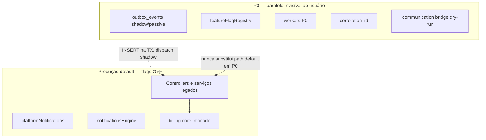

### 1.4 Localização de código alvo (referência futura)

```text
packages/backend/src/
  services/platform/featureFlagRegistry.ts
  domainEvents/
    types.ts
    publisher.ts
    outboxRepository.ts
    outboxPublisherWorker.ts
    subscriberRegistry.ts
  services/communication/
    channelProviderGateway.ts
    providerRegistry.ts
    adapters/uazapiBridgeAdapter.ts
  workers/
    outboxPublisherWorker.ts
    workflowSchedulerWorker.ts
    workflowRetryWorker.ts
    notificationRetryWorker.ts
    heartbeatWorker.ts
  middleware/correlationId.ts
```

---

## 2. Feature flag foundation

### 2.1 Arquitetura `featureFlagRegistry`

| Camada | Responsabilidade | Tecnologia |
|--------|------------------|------------|
| **Registry (código)** | Catálogo tipado, defaults, kill switches | TypeScript module |
| **Storage** | Definições + overrides por tenant/env | PostgreSQL `platform_feature_flags`, `platform_feature_flag_overrides` |
| **Cache** | Leitura quente &lt; 1 ms p95 | In-memory LRU + TTL 30–60 s; invalidação via NOTIFY ou poll leve |
| **API admin** | Superadmin: override, allowlist, % rollout | `GET/PATCH /api/superadmin/feature-flags` |
| **SDK consumo** | `isEnabled(key, context)` | Usado em controllers, workers, subscribers |

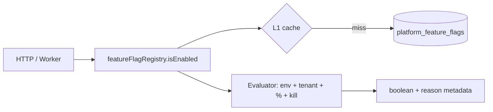

### 2.2 Modelo de dados (storage)

**Tabela `platform_feature_flags` (definição global)**

| Coluna | Tipo | Descrição |
|--------|------|-----------|
| `key` | text PK | ex. `outbox.publisher_v1` |
| `namespace` | text | `acquisition`, `communication`, … |
| `description` | text | Runbook |
| `default_enabled` | boolean | **false** em prod para P0 |
| `kill_switch_key` | text nullable | ex. `outbox.master_off` |
| `rollout_type` | enum | `off`, `internal`, `allowlist`, `percent`, `global` |
| `rollout_percent` | int 0–100 | Hash estável |
| `shadow_mode` | boolean | Compute without side-effect |
| `schema_version` | int | Evolução |
| `updated_at` | timestamptz | |

**Tabela `platform_feature_flag_overrides`**

| Coluna | Tipo | Descrição |
|--------|------|-----------|
| `id` | uuid PK | |
| `flag_key` | text FK | |
| `tenant_id` | uuid nullable | null = global override |
| `enabled` | boolean | |
| `expires_at` | timestamptz nullable | Piloto temporário |
| `created_by` | uuid | Audit |

### 2.3 Avaliação de rollout

| Mecanismo | Algoritmo | Uso |
|-----------|-----------|-----|
| **Environment** | `NODE_ENV` / `DEPLOY_ENV` | staging on, prod off |
| **Tenant allowlist** | `tenant_id IN (...)` | Beta tenants |
| **Rollout %** | `hash(tenant_id + flag_key) % 100 < N` | Canary gradual |
| **Internal tenants** | `tenant.is_internal = true` | Dogfood |
| **Shadow mode** | `shadow_mode=true` → retorna `{ enabled: false, shadow: true }` | Validação |
| **Emergency disable** | `kill_switch_key` global ON | &lt; 5 min |

**Ordem de precedência (maior vence):**

1. Kill switch global do namespace  
2. Override explícito tenant (não expirado)  
3. Internal-only gate  
4. Allowlist  
5. Rollout %  
6. `default_enabled`

### 2.4 Catálogo inicial de flags P0

| Key | Namespace | Default prod | Shadow | Kill switch |
|-----|-----------|--------------|--------|-------------|
| `acquisition.signup_session_v1` | acquisition | off | sim (F1) | `acquisition.master_off` |
| `acquisition.trial_activation_v1` | acquisition | off | sim | `acquisition.master_off` |
| `acquisition.defer_tenant_v1` | acquisition | off | sim | `acquisition.master_off` |
| `communication.gateway_v1` | communication | off | **sim P0** | `communication.master_off` |
| `communication.bridge_dual_dispatch` | communication | off | sim | `communication.master_off` |
| `communication.webhook_normalizer_v1` | communication | off | sim | `communication.master_off` |
| `outbox.write_v1` | outbox | off → internal | sim | `outbox.master_off` |
| `outbox.publisher_v1` | outbox | off | sim | `outbox.publisher_off` |
| `outbox.subscribers_v1` | outbox | off | sim | `outbox.master_off` |
| `workflow.scheduler_v1` | workflow | off | sim | `orchestrator.master_off` |
| `workflow.retry_v1` | workflow | off | sim | `orchestrator.master_off` |
| `onboarding.engine_v1` | onboarding | off | sim (F4) | `onboarding.master_off` |
| `onboarding.recovery_v1` | onboarding | off | sim | `onboarding.master_off` |
| `billing_recovery.shadow_metrics_v1` | billing_recovery | off | **sim P0** | — |
| `meta_readiness.probe_v1` | meta_readiness | off | sim | `communication.master_off` |

### 2.5 Tipos de flag

| Tipo | Comportamento | Exemplo |
|------|---------------|---------|
| **Shadow** | Executa código novo; **não** altera resposta ao cliente | Gateway dry-run log |
| **Internal-only** | Só tenants `is_internal` | Outbox write em dogfood |
| **Beta tenants** | Allowlist explícita | 3–10 pilotos |
| **Rollout progression** | off → internal → 5% → 25% → 100% | `outbox.publisher_v1` |

### 2.6 Rollout progression oficial (flags)

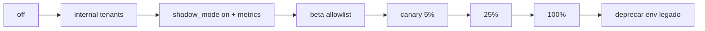

| Gate | Critério |
|------|----------|
| INT → SH | 0 erros registry 48 h |
| SH → PIL | Shadow diff &lt; threshold §13 |
| PIL → C5 | Sign-off Communication Ops + Eng |
| C5 → C25 | 7 dias métricas §13 |

### 2.7 Emergency disable (kill switch)

| Switch | Efeito imediato | Owner |
|--------|-----------------|-------|
| `outbox.publisher_off` | Para dispatch; fila acumula (não perde) | Platform Eng |
| `outbox.master_off` | Para write + publish | Platform Eng |
| `communication.master_off` | Bridge/gateway off; 100% legado notify | Communication Ops |
| `orchestrator.master_off` | Sem novos jobs; running completa ou pause | Automation Eng |
| `acquisition.master_off` | Fluxos novos acquisition off | Growth Eng |

**Runbook:** kill ON → validar legado → drain backlog → post-mortem → re-enable gradual.

---

## 3. Outbox foundation

### 3.1 Tabela `outbox_events`

Alinhada a [`DOMAIN_EVENT_AND_OUTBOX_ARCHITECTURE.md`](./automation/DOMAIN_EVENT_AND_OUTBOX_ARCHITECTURE.md) §4.1.

| Coluna | Tipo | P0 |
|--------|------|-----|
| `id` | uuid PK | sim |
| `event_name` | text | sim |
| `event_version` | int default 1 | sim |
| `aggregate_type` | text | sim |
| `aggregate_id` | text | sim |
| `payload` | jsonb | sim |
| `idempotency_key` | text UNIQUE | sim |
| `correlation_id` | uuid | sim |
| `causation_id` | uuid | opcional |
| `priority` | smallint P0–P3 | sim |
| `status` | enum | sim |
| `available_at` | timestamptz | sim |
| `attempts` | int | sim |
| `max_attempts` | int default 8 | sim |
| `last_error` | text | sim |
| `locked_by` | text | sim |
| `locked_at` | timestamptz | sim |
| `created_at` | timestamptz | sim |
| `processed_at` | timestamptz | sim |

**Status enum:** `pending` | `processing` | `done` | `dead`

**Índices obrigatórios:**

- `(status, available_at, priority) WHERE status IN ('pending','processing')`
- UNIQUE `(idempotency_key)`
- `(correlation_id)`
- `(aggregate_type, aggregate_id, created_at DESC)`

**Tabelas auxiliares P0:**

| Tabela | Função |
|--------|--------|
| `outbox_dispatch_log` | Auditoria por tentativa de dispatch |
| `outbox_subscriber_idempotency` | `(subscriber_name, idempotency_key)` UNIQUE |
| `outbox_events_archive` | Retenção (opcional F0, recomendado antes F3 cutover) |

### 3.2 Publisher worker

| Parâmetro | Valor inicial |
|-----------|---------------|
| Batch size | 100 |
| Poll interval | 2 s |
| Claim | `FOR UPDATE SKIP LOCKED` |
| Stale reclaim | `processing` &gt; 5 min sem heartbeat worker |
| Max attempts default | 8 |
| Backoff | exponencial: 30s, 2m, 10m, 30m, 2h, 6h, 12h, 24h |

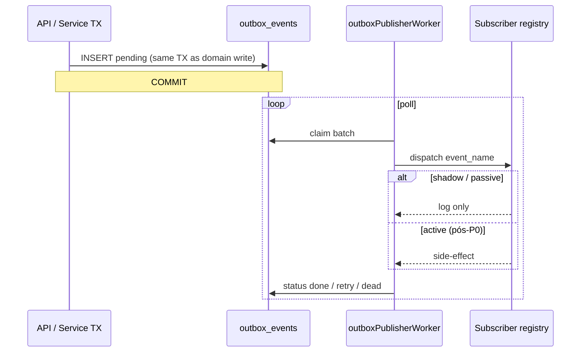

### 3.3 Retries, dead-letter, replay

| Conceito | Regra |
|----------|-------|
| **Retry** | `attempts++`, `available_at = now + backoff`, `status=pending` |
| **Dead-letter** | `attempts >= max_attempts` → `dead` + alerta |
| **Replay admin** | Nova key `{original}:replay:{uuid}`; `causation_id` original; audit superadmin |
| **Idempotência publish** | UNIQUE `idempotency_key` no INSERT |
| **Idempotência consume** | `outbox_subscriber_idempotency` antes de efeito irreversível |

### 3.4 Observabilidade outbox

| Métrica | Alerta |
|---------|--------|
| `outbox_pending_count` | &gt; 10k ou &gt; 7 dias idade |
| `outbox_processing_stale` | &gt; 0 após 5 min |
| `outbox_dead_rate` | &gt; 0.1% / 1 h |
| `outbox_dispatch_latency_p95` | &gt; 5 min (pós-cutover) |

**Logs:** prefixo `[OUTBOX]` — ver §7.

### 3.5 Eventos iniciais P0 (catálogo mínimo)

| event_name | aggregate_type | Producer (futuro) | Subscriber P0 |
|------------|------------------|-------------------|---------------|
| `signup.completed` | signup_session | acquisition (F1) | shadow log only |
| `tenant.created` | tenant | provisioning | shadow log only |
| `invoice.created` | invoice | billing | shadow log only |
| `ticket.created` | ticket | support | shadow log only |
| `workflow.started` | automation_job | orchestrator | shadow log only |
| `communication.message.sent` | communication_message | gateway bridge | shadow log only |

**P0:** apenas **instrumentar publish** em 1–2 pontos de baixo risco (ex. `ticket.created` platform support) com flag `outbox.write_v1` internal — **sem** desligar notify legado.

### 3.6 Modos P0: shadow publish + passive consumers

| Modo | `outbox.write_v1` | `outbox.publisher_v1` | `outbox.subscribers_v1` | Efeito |
|------|-------------------|----------------------|-------------------------|--------|
| **A — infra only** | off | off | off | Só tabela + métricas migração |
| **B — shadow write** | internal | off | off | INSERT na TX; publisher off |
| **C — shadow dispatch** | internal | on + shadow | on + passive | Dispatch → log `[OUTBOX] would handle` |
| **D — passive consumer** | internal | on | on passive | 1 subscriber métricas; zero WA/email |

**Produção inicial recomendada:** modo **C** em internal tenants; modo **A** global default.

---

## 4. Worker foundation

### 4.1 Workers P0 (escopo)

| Worker | Processo | Frequência | P0 entrega |
|--------|----------|------------|------------|
| **outboxPublisherWorker** | `node dist/workers/outboxPublisher.js` | poll 2s | shadow + claim + DLQ |
| **workflowSchedulerWorker** | `workflowScheduler.js` | 30s tick | shell: poll `automation_jobs` vazio OK |
| **workflowRetryWorker** | `workflowRetry.js` | 60s | shell: reclaim stale |
| **notificationRetryWorker** | estende/reusa legado | existente | wrapper heartbeat + logs `[WORKER]` |
| **heartbeatWorker** | `heartbeat.js` | 15s | `worker_heartbeats` + stale alert |

### 4.2 Tabela `worker_heartbeats`

| Coluna | Tipo |
|--------|------|
| `worker_name` | text PK |
| `instance_id` | text PK |
| `last_seen_at` | timestamptz |
| `metadata` | jsonb |
| `status` | enum `healthy`, `degraded`, `stopped` |

### 4.3 Lifecycle

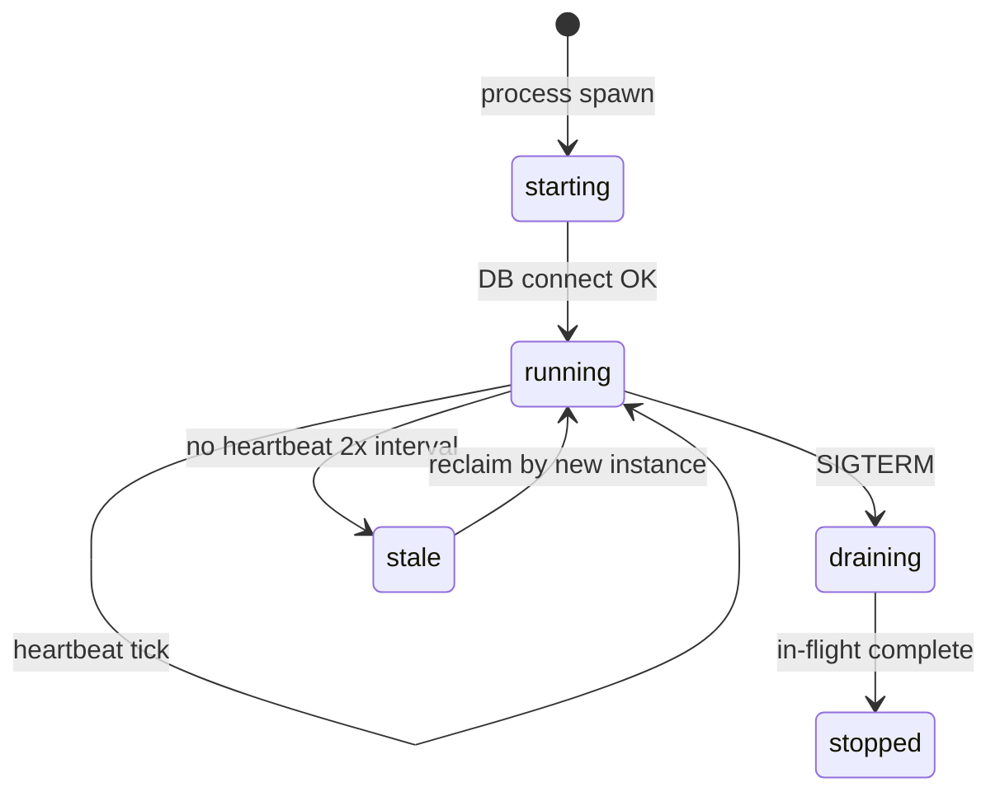

| Fase | Comportamento |
|------|---------------|
| **Start** | Registrar `instance_id` (hostname + pid); migrar locks stale |
| **Run** | Loop com `AbortSignal`; heartbeat cada 15s |
| **Stale reclaim** | Jobs `processing` sem heartbeat &gt; 5 min → `pending` |
| **Graceful shutdown** | SIGTERM → stop poll; finish batch; heartbeat `stopped` |
| **Restart** | Kubernetes / PM2 / systemd — max 3 restarts / 5 min |

### 4.4 Observabilidade workers

| Log prefix | Conteúdo |
|------------|----------|
| `[WORKER]` | start/stop/batch/stale |
| `[OUTBOX]` | claim/dispatch/dead |
| `[WORKFLOW]` | schedule/retry (shell P0) |

### 4.5 Deploy workers P0

| Ambiente | Processos |
|----------|-----------|
| **local** | `npm run worker:outbox` (dev) |
| **staging** | 1 réplica cada worker P0 |
| **prod** | 1–2 réplica outbox; heartbeat dedicado; retry notification colocated OK |

**Coexistência:** workers financeiros legados **inalterados**; novos workers em filas/processos separados.

---

## 5. Correlation ID foundation

### 5.1 Padrão HTTP

| Header | Direção | Regra |
|--------|---------|-------|
| `x-correlation-id` | Request | Cliente pode enviar UUID v4; senão servidor gera |
| `x-correlation-id` | Response | Ecoar mesmo ID |
| `x-request-id` | opcional | ID por request HTTP (filho de correlation em sagas) |

**Middleware:** `packages/backend/src/middleware/correlationId.ts` — registra em `AsyncLocalStorage` / `req.context`.

### 5.2 Propagação

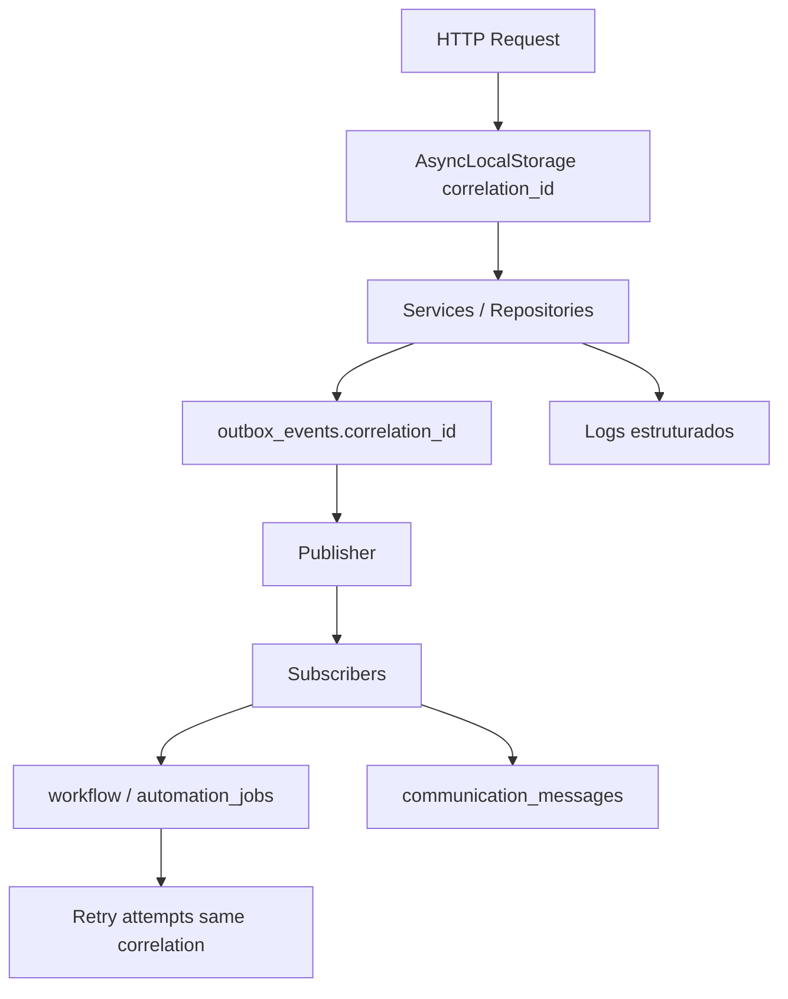

| Domínio | Onde persistir |
|---------|----------------|
| **Request** | ALS + access log |
| **Workflow** | `automation_jobs.correlation_id` |
| **Event** | `outbox_events.correlation_id` |
| **Communication** | `communication_messages.correlation_id` (futuro) |
| **Retry** | Mesmo `correlation_id`; novo `causation_id` por tentativa |

### 5.3 Regras

- **Nunca** gerar novo correlation no meio de uma saga — propagar do root.  
- **Webhook inbound:** normalizer extrai ou gera e associa conversa.  
- **Workers:** ler `correlation_id` do evento/job; não gerar aleatório salvo worker tick técnico (log separado).

### 5.4 Rollout P0

| Sprint | Entrega |
|--------|---------|
| P0.1 | Middleware em **todas** rotas `/api/*` |
| P0.2 | Logs estruturados com campo `correlation_id` |
| P0.3 | `outbox_events.correlation_id` obrigatório em publish helper |
| P0.4 | Dashboard trace lookup por correlation (superadmin) |

---

## 6. Communication gateway bridge

### 6.1 Mandato

Introduzir `channelProviderGateway` como **fachada** sem remover `platformNotifications` nem `notificationsEngine`.

### 6.2 Interface adapter (contrato)

```text
ICommunicationProviderAdapter
  send(input: SendCommunicationInput): Promise<SendCommunicationResult>
  healthCheck(): Promise<ProviderHealth>
  supportsChannel(channel): boolean
```

**Gateway:**

```text
channelProviderGateway.send(intent, context)
  → communicationPolicyEngine (rate, quiet hours) — stub P0
  → providerRegistry.resolve(intent, tenant)
  → adapter.send()
  → persist communication_messages (shadow table P0 opcional)
  → emit communication.message.sent → outbox (shadow)
```

### 6.3 Bridge UazAPI (P0)

| Modo | Comportamento |
|------|---------------|
| **Flag off** | Nenhuma chamada ao gateway |
| **Shadow** | Gateway chama `uazapiBridgeAdapter` → delega **mesmo** código legado; **não** envia duas vezes; compara log `[COMMUNICATION] shadow` |
| **Dual dispatch** | flag `communication.bridge_dual_dispatch` — **OFF em prod P0**; só staging com idempotency compartilhada |

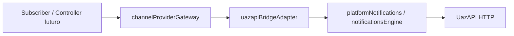

### 6.4 Provider registry P0

| Provider key | Adapter | Status P0 |
|--------------|---------|-----------|
| `uazapi` | `uazapiBridgeAdapter` | ativo (bridge) |
| `smtp` | stub | registry only |
| `meta_cloud` | stub | `meta_readiness.probe_v1` health only |

### 6.5 Rollback comunicação

1. `communication.master_off` ON.  
2. Confirmar tráfego 100% motores legados (métricas send).  
3. Gateway permanece deployado mas no-op.

---

## 7. Observabilidade mínima

### 7.1 Prefixos de log obrigatórios

| Prefixo | Domínio |
|---------|---------|
| `[OUTBOX]` | publish, dispatch, dead, replay |
| `[WORKER]` | lifecycle, heartbeat, stale |
| `[FEATURE_FLAG]` | evaluation, kill switch |
| `[ROLLOUT]` | stage transitions, % changes |
| `[COMMUNICATION]` | gateway, bridge, shadow |
| `[WORKFLOW]` | schedule, retry (shell) |

**Formato JSON recomendado:**

```json
{
  "level": "info",
  "prefix": "[OUTBOX]",
  "correlation_id": "uuid",
  "tenant_id": "uuid",
  "event_name": "ticket.created",
  "outbox_id": "uuid",
  "msg": "dispatch shadow"
}
```

### 7.2 Dashboards P0 (superadmin)

| Dashboard | Painéis |
|-----------|---------|
| **Outbox health** | pending count, age p95, dead count, dispatch rate |
| **Worker health** | last_seen por worker, stale locks |
| **Rollout** | flags on por tenant, kill switch status |
| **Communication bridge** | shadow vs legado send count (deve ser 0 dup) |
| **Correlation trace** | busca por `correlation_id` → logs + outbox rows |

### 7.3 Alertas P0

| Alerta | Severidade | Condição |
|--------|------------|----------|
| Outbox backlog | P2 | pending &gt; 5k por 15 min |
| Outbox dead spike | P1 | &gt; 50 dead / 1 h |
| Worker down | P1 | heartbeat &gt; 2 min |
| Kill switch activated | P2 | audit log |
| Duplicate send suspicion | P0 | mesmo idempotency 2 sends |

### 7.4 Tracing

| Fase | Escopo |
|------|--------|
| P0 mínimo | `correlation_id` em logs + DB |
| P0+ opcional | OpenTelemetry span root = correlation |

---

## 8. Shadow mode

### 8.1 Definição oficial

**Shadow execution** = executar código novo em paralelo ao legado, **sem** efeito colateral observável pelo cliente (sem segundo WhatsApp, sem segunda fatura, sem mudança de resposta HTTP).

### 8.2 Matriz shadow P0

| Capacidade | Shadow behavior | Validação |
|------------|-----------------|-----------|
| **Outbox publish** | INSERT real; publisher log-only | Count events = business actions |
| **Outbox dispatch** | Subscribers log `[OUTBOX] would…` | Payload schema validate |
| **Gateway send** | Bridge calcula rota; log intent | Diff intent vs legado path |
| **Workflow schedule** | Insert `automation_jobs` flagged `shadow=true` | No notify from shadow jobs |
| **Analytics** | Duplicate metrics row `source=shadow` | Compare counts |

### 8.3 Fluxo de validação

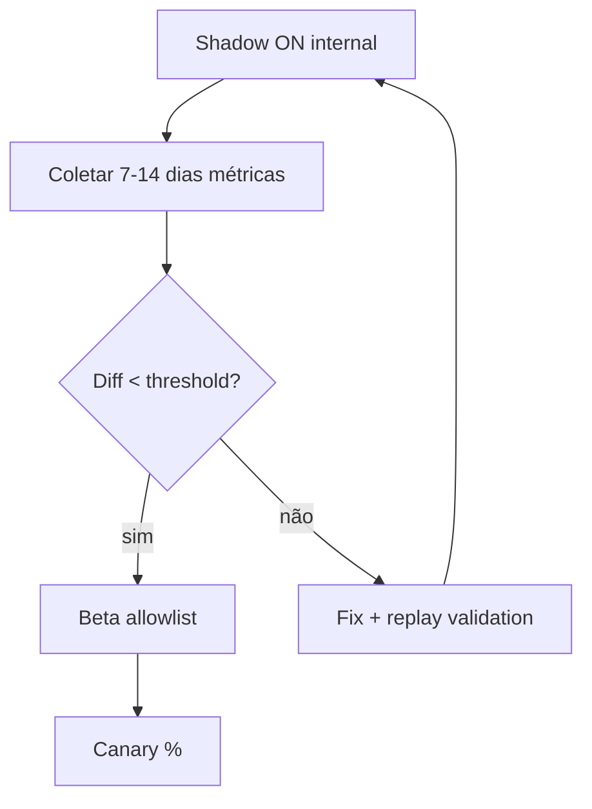

| Threshold exemplo | Métrica |
|-------------------|---------|
| Event loss | 0 |
| Duplicate WA | 0 |
| Pending outbox p95 | &lt; 60 s (shadow dispatch) |
| Error rate shadow | &lt; 0.01% |

### 8.4 Replay validation

Antes de cutover: replay `dead` events em staging com subscribers passive → depois active em cópia DB.

---

## 9. Deployment strategy

### 9.1 Pipeline

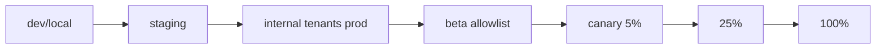

### 9.2 Regras deploy P0

| Regra | Detalhe |
|-------|---------|
| **Additive migrations only** | Sem DROP coluna em P0 |
| **Flags default OFF** | Verificação CP1 pós-deploy |
| **Workers deploy separado** | API rolling; workers após migração |
| **Reversible** | Kill switch testado em staging antes prod |
| **Freeze windows** | Sem rollout % em Black Friday / fechamento |

### 9.3 Deploy flow (API + workers)

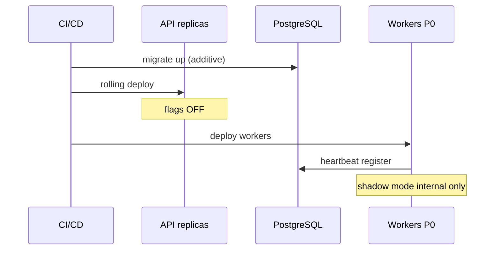

### 9.4 Rollback deploy

| Cenário | Ação | Tempo alvo |
|---------|------|------------|
| Bug publisher | `outbox.publisher_off` | &lt; 2 min |
| Bug gateway | `communication.master_off` | &lt; 5 min |
| Bug flags | Revert deploy + kill switches | &lt; 15 min |
| Migração ruim | Forward-only fix; **não** down migration destrutiva em prod |

---

## 10. Migration strategy

### 10.1 Migrations P0 (ordem)

| # | Migration | Tipo | Rollback |
|---|-----------|------|----------|
| M1 | `platform_feature_flags` + overrides | CREATE | leave tables |
| M2 | `outbox_events` + índices | CREATE | stop workers |
| M3 | `outbox_dispatch_log`, `outbox_subscriber_idempotency` | CREATE | — |
| M4 | `worker_heartbeats` | CREATE | — |
| M5 | `platform_audit_trail` (mínimo) | CREATE | — |
| M6 | `acquisition_idempotency_keys` | CREATE | — |
| M7 | `communication_messages` (opcional shadow) | CREATE | — |
| M8 | Seed flags P0 | INSERT | DELETE seeds |

**Sem** alterar tabelas billing, tenants core, messages chat existentes.

### 10.2 Dual-write (quando aplicável)

| Domínio | Dual-write P0 | Notas |
|---------|---------------|-------|
| Outbox | Sim — INSERT outbox + fluxo legado continua | Shadow |
| Notify | **Não** em prod P0 | Bridge shadow only |
| Feature flags | Registry + manter env legado até deprecação | Matriz roadmap §6.4 |

### 10.3 Backward compatibility

- `process.env.SIGNUP_SESSION_V1` continua funcionando até registry 100%.  
- Controllers **não** mudam response shape com flag off.  
- Workers legados financeiros sem alteração de cron.

### 10.4 Replay-safe

Migrations **não** reescrevem histórico. Replay de eventos usa keys novas — ver §3.3.

---

## 11. Operational safety

### 11.1 Regras obrigatórias

| # | Regra |
|---|-------|
| R1 | **Sem remoção** de fluxo legado em P0 |
| R2 | **Sem desligar** provider atual (UazAPI / motores notify) |
| R3 | **Sem alterar** billing core (`activatePlanFromBilling`, webhooks Asaas) |
| R4 | **Sem migration destrutiva** (DROP/ALTER bloqueante) |
| R5 | **Sem workflow ativo** com side-effect sem observabilidade |
| R6 | **Sem retries infinitos** — `max_attempts` obrigatório |
| R7 | **Sem big bang** — uma onda dominante por sprint |
| R8 | **Kill switch testado** antes de cada aumento de % |

### 11.2 Checklist pré-deploy P0

- [ ] Flags default OFF em prod  
- [ ] Rollback drill staging executado  
- [ ] Dashboards outbox + worker verdes em staging  
- [ ] Shadow 48 h internal sem P0 incident  
- [ ] Runbooks kill switch publicados  
- [ ] Sign-off §15 owners  

---

## 12. Implementation order

### 12.1 Ordem oficial (sprints sugeridos)

| Ordem | Entrega | Sprint | Dependências |
|-------|---------|--------|--------------|
| **1** | Feature flags — schema + registry + admin read API | S1 | — |
| **2** | Correlation ID — middleware + ALS + logs | S1 | — |
| **3** | Outbox infra — migrations + repository + publish helper | S2 | 1, 2 |
| **4** | Worker foundation — heartbeat + outbox publisher shadow | S2 | 3 |
| **5** | Observabilidade — prefixos, dashboards, alertas | S2–S3 | 4 |
| **6** | Communication bridge — gateway + uazapi adapter shadow | S3 | 1, 2 |
| **7** | Shadow publish — 1–2 eventos internal | S3 | 3, 4 |
| **8** | Passive consumers — registry log-only | S4 | 7 |
| **9** | Validation phase — 7–14 dias métricas internal | S4–S5 | 8 |
| **10** | Gradual rollout — beta → canary (flags) | S5+ | 9 |

### 12.2 Diagrama de dependências

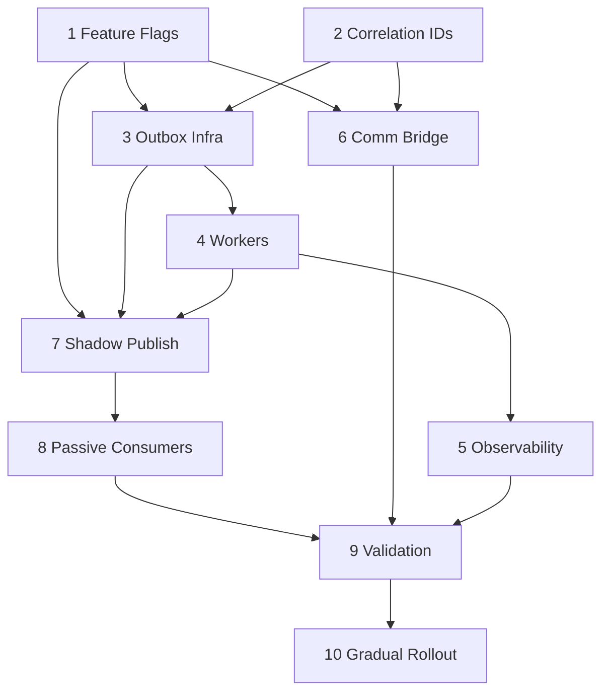

### 12.3 Entregáveis por PR (granularidade)

| PR | Conteúdo | Flag |
|----|----------|------|
| PR-P0-01 | Migrations M1 + seed flags | — |
| PR-P0-02 | `featureFlagRegistry` + unit tests | — |
| PR-P0-03 | `correlationId` middleware | — |
| PR-P0-04 | Migrations M2–M4 | — |
| PR-P0-05 | `publishDomainEvent` + repository | `outbox.write_v1` internal |
| PR-P0-06 | `outboxPublisherWorker` shadow | `outbox.publisher_v1` |
| PR-P0-07 | `worker_heartbeats` + heartbeat worker | — |
| PR-P0-08 | Logs + superadmin dashboard v1 | — |
| PR-P0-09 | `channelProviderGateway` + bridge shadow | `communication.gateway_v1` |
| PR-P0-10 | Passive subscriber registry | `outbox.subscribers_v1` |
| PR-P0-11 | Runbooks + alert wiring | — |

---

## 13. Success criteria

### 13.1 Critérios de saída P0 (obrigatórios)

| ID | Critério | Medição |
|----|----------|---------|
| SC-01 | Outbox estável em internal 14 dias | 0 lost events; dead &lt; 0.01% |
| SC-02 | Workers confiáveis | heartbeat &lt; 30 s; 0 stale &gt; 5 min sem reclaim |
| SC-03 | Heartbeat funcionando | dashboard verde 99.9% |
| SC-04 | Logs rastreáveis | 100% `/api` com `correlation_id` |
| SC-05 | Rollback validado | drill &lt; 5 min kill switches |
| SC-06 | Provider bridge estável | 0 duplicate sends shadow vs legado |
| SC-07 | Zero downtime deploy P0 | sem incident P0 atribuível |
| SC-08 | Zero impacto financeiro | 0 regressão webhooks/métricas billing |
| SC-09 | Shadow execution validada | diff thresholds §8.3 verdes |
| SC-10 | Flags default OFF prod | audit pós-deploy |

### 13.2 Métricas de aceitação

| Métrica | Alvo P0 |
|---------|---------|
| `outbox_pending_age_p95` (shadow) | &lt; 120 s |
| `worker_heartbeat_lag` | &lt; 30 s |
| `flag_evaluation_p99` | &lt; 5 ms |
| `correlation_coverage` | 100% API |
| `duplicate_notification_rate` | 0 |

---

## 14. Risk matrix

| Risco | Prob. | Impacto | Mitigação | Observabilidade | Rollback | Owner |
|-------|-------|---------|-----------|-----------------|----------|-------|
| **Retry storm** | Média | Alto | `max_attempts`, backoff, circuit breaker subscriber | `outbox_attempts`, rate dispatch | `outbox.publisher_off` | Platform Eng |
| **Duplicated events** | Média | Alto | `idempotency_key` UNIQUE + subscriber idempotency | dead + dup detector | pause publisher | Platform Eng |
| **Duplicated notifications** | Média | Crítico | **No dual dispatch prod P0**; bridge shadow | `[COMMUNICATION]` dup metric | `communication.master_off` | Communication Ops |
| **Worker crash loop** | Baixa | Alto | max restarts; heartbeat stale reclaim | `[WORKER]` + alert | scale down worker | SRE |
| **Provider instability** | Média | Médio | bridge → legado; timeout | provider health | master_off | Communication Ops |
| **Replay inconsistency** | Baixa | Alto | replay keys novas; audit | dispatch_log | disable replay admin | Platform Eng |
| **Queue overload** | Baixa | Médio | batch size; backpressure | pending count | publisher_off | SRE |
| **Migration rollback failure** | Baixa | Alto | additive only; forward fix | migration version | kill switches, não down | Platform Eng |
| **Flag misconfiguration** | Média | Alto | default off; admin audit | `[FEATURE_FLAG]` | kill switch | Superadmin |
| **Shadow sem validação** | Média | Médio | gate §8.3 antes pilot | shadow dashboards | shadow off | Eng Lead |

---

## 15. Ownership

| Área | Responsável | Accountable | Consulted | Informed |
|------|-------------|-------------|-----------|----------|
| **P0 program** | Eng Lead (Platform) | CTO / Head Eng | — | All squads |
| **Feature flags** | Platform Eng | Eng Lead | Superadmin | Support |
| **Outbox + workers** | Platform Eng | Eng Lead | Automation | SRE |
| **Correlation / logs** | Backend Eng | Platform Eng | SRE | Support |
| **Communication bridge** | Communication squad | Communication Ops | Platform | CS |
| **Billing touchpoints** | — (no touch P0) | Billing Ops | Platform | Finance |
| **Rollout / kill switch** | SRE + Eng Lead | Communication Ops (comms flags) | Legal/CS | Superadmin users |
| **Onboarding flags** | Growth Eng | Product | Platform | — |
| **Support escalations** | Support Lead | CS Manager | Eng on-call | — |
| **Superadmin UI flags** | Platform Eng | Product | Superadmin ops | — |

### 15.1 RACI por entrega P0

| Entrega | R | A | C | I |
|---------|---|---|---|---|
| featureFlagRegistry | Platform | Eng Lead | Product | Support |
| outbox_events | Platform | Eng Lead | Automation | SRE |
| outboxPublisherWorker | Platform | Eng Lead | SRE | — |
| correlation middleware | Backend | Platform | SRE | — |
| communication bridge | Comm squad | Comm Ops | Platform | CS |
| dashboards/alerts | SRE | Eng Lead | Platform | — |
| shadow validation report | Eng Lead | Product | Ops | Leadership |

---

## 16. Anti-patterns proibidos

| Anti-pattern | Por que proíbe | Alternativa |
|--------------|----------------|-------------|
| Big bang migration | Incidente multi-domínio | Flags + shadow + % |
| Refactor destrutivo legado | Sem rollback | Strangler + bridge |
| Provider hardcoded em controller | Meta/UazAPI lock-in | Gateway + registry |
| Workflows invisíveis | Debug impossível | `automation_jobs` + logs `[WORKFLOW]` |
| Retries sem limites | Retry storm | `max_attempts` + dead-letter |
| Workers sem heartbeat | Locks eternos | `worker_heartbeats` |
| Deploy sem rollback testado | MTTR alto | Kill switch drill |
| Shadow sem validação | Falsa confiança | §8.3 gates |
| `process.env` em controller para rollout | Drift staging/prod | `featureFlagRegistry` |
| Segundo WhatsApp em shadow mal implementado | CS nightmare | shadow = log only |
| DROP column em produção P0 | Downtime | additive migrations |
| Subscriber síncrono no request | Acoplamento | outbox only |

---

## 17. Conclusão

A **P0 Foundation** não muda a experiência do cliente em produção com flags default OFF. Ela instala o **sistema nervoso** da arquitetura enterprise documentada:

| Capacidade | Função no produto futuro |
|------------|-------------------------|
| **featureFlagRegistry** | Rollout seguro de onboarding, gateway, outbox, recovery |
| **outbox_events** | Desacoplamento real entre billing, acquisition, communication, automation |
| **Workers P0** | Confiança operacional (heartbeat, retry, reclaim) |
| **correlation_id** | Incident response e auditoria ponta a ponta |
| **Communication bridge** | Caminho para Meta Cloud sem rewiring do monólito |
| **Shadow mode** | Prova empírica antes de cutover |
| **Observabilidade** | Operação em escala sem “caixa preta” |

Após sign-off deste plano e critérios §13 verdes em internal tenants, a **Fase 1 (Acquisition foundation)** e **Fase 3 (Outbox backbone ativo)** do [roadmap](./IMPLEMENTATION_ROADMAP_AND_ROLLOUT_STRATEGY.md) podem executar com risco controlado — sempre **coexistindo** com billing, UazAPI e motores de notificação atuais.

**Próximo passo formal:** checklist §11.2 + aprovação owners §15 → iniciar PR-P0-01 (migrations flags).

---

*Documento executável — revisar a cada sprint P0. Não substitui runbooks de incidente em `docs/runbooks/` (a criar).*
