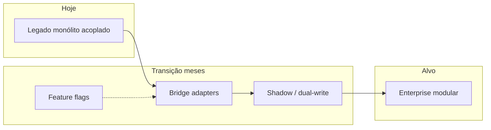
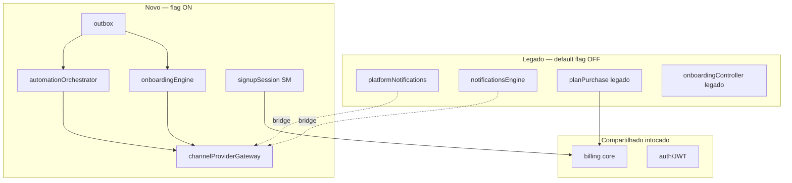
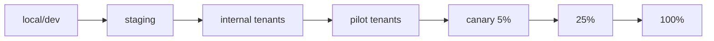
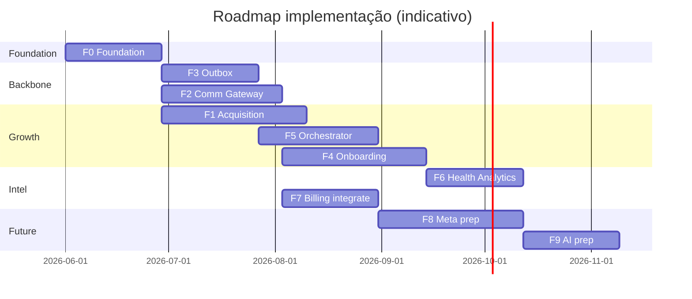
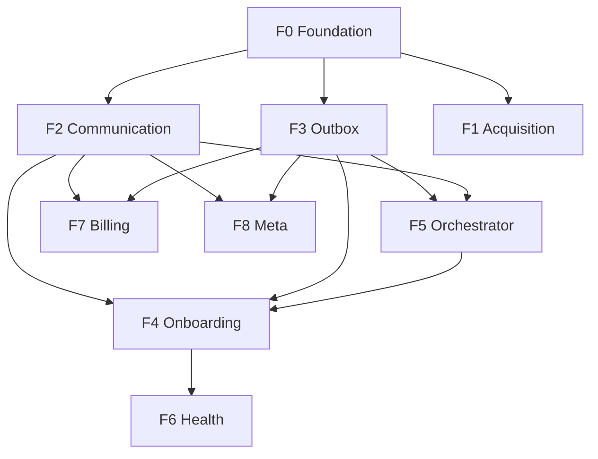

# Implementation Roadmap & Rollout Strategy (PainelCRM)

**Tipo:** documentação oficial de implantação — ponte entre arquitetura enterprise e execução em produção.  
**Versão:** 1.0  
**Data:** maio/2026  
**Status:** governança e planejamento — **não implementar** código sem sign-off §18.

**Premissa:** PainelCRM em **produção ativa** (clientes, billing, WhatsApp, notificações). Evolução **incremental, coexistente, reversível** — sem big bang.

---

## Índice

1. [Visão geral](#1-visão-geral)
2. [Princípios de implementação](#2-princípios-de-implementação)
3. [Estado atual (AS-IS)](#3-estado-atual-as-is)
4. [Estado futuro (TO-BE)](#4-estado-futuro-to-be)
5. [Estratégia de coexistência](#5-estratégia-de-coexistência)
6. [Feature flag strategy](#6-feature-flag-strategy)
7. [Rollout strategy](#7-rollout-strategy)
8. [Implementation phases](#8-implementation-phases)
9. [Dependency graph](#9-dependency-graph)
10. [Data migration strategy](#10-data-migration-strategy)
11. [Observability before cutover](#11-observability-before-cutover)
12. [Operational safety](#12-operational-safety)
13. [Test strategy](#13-test-strategy)
14. [Pilot tenant strategy](#14-pilot-tenant-strategy)
15. [Governança](#15-governança)
16. [Riscos e mitigações](#16-riscos-e-mitigações)
17. [Documentos relacionados](#17-documentos-relacionados)
18. [Critérios para início de implementação](#18-critérios-para-início-de-implementação)
19. [Critérios de sucesso](#19-critérios-de-sucesso)
20. [Conclusão](#20-conclusão)

---

## 1. Visão geral

### 1.1 Por que rollout controlado é obrigatório

A arquitetura enterprise (bounded contexts, outbox, gateway, orchestrator) **não substitui** o sistema de uma vez. Em produção:

- Um bug em billing ou trial afeta receita imediata.
- Mensagem WhatsApp duplicada destrói confiança.
- Tenant criado duas vezes corrompe suporte e LGPD.

**Rollout controlado** = entregar valor por fatias com **flag**, **shadow**, **piloto** e **rollback** em minutos.

### 1.2 Riscos de refatoração em produção

| Risco | Consequência |
|-------|--------------|
| Big bang cutover | Incidente P0 multi-domínio |
| Remover código legado cedo | Sem rollback |
| Migrar billing core | Regressão `activatePlanFromBilling` |
| Trocar notify sem bridge | Silêncio ou duplicata |
| Outbox sem idempotência | Spam e estado inconsistente |

### 1.3 Pilares da evolução

| Pilar | Significado |
|-------|-------------|
| **Coexistência** | Legado e novo caminho em paralelo |
| **Feature flags** | Comportamento por tenant / % / env |
| **Dual-write** | Escrever novo + legado até validar |
| **Shadow mode** | Novo calcula/envia em dry-run ou paralelo read-only |
| **Rollout gradual** | internal → pilot → canary → global |
| **Arquitetura evolutiva** | Modular monolith; extrair depois |

### 1.4 Estratégia incremental

1. **Adicionar** tabelas e workers sem alterar path default.  
2. **Shadow** métricas e eventos.  
3. **Pilot** tenants com flag on.  
4. **Cutover** por domínio (comunicação piloto → onboarding → acquisition).  
5. **Deprecar** legado só com 0 regressões + período de observação.

---

## 2. Princípios de implementação

| # | Princípio | Regra operacional |
|---|-----------|-------------------|
| 1 | **Backward compatibility first** | Flag off = byte-a-byte comportamento AS-IS |
| 2 | **Zero-downtime evolution** | Migrações additive; deploy rolling |
| 3 | **Feature-flag-first** | Nenhuma rota nova obrigatória sem flag |
| 4 | **Shadow before cutover** | Comparar métricas 7–14 dias |
| 5 | **Observability before migration** | §11 checklist verde |
| 6 | **Rollback always possible** | Kill switch + flag off &lt; 5 min |
| 7 | **Gradual tenant rollout** | Nunca 100% dia 1 de feature crítica |
| 8 | **Anti-big-bang** | Uma “onda” dominante por sprint |
| 9 | **Billing sacred** | Não reescrever `activatePlanFromBilling` |
| 10 | **One owner per wave** | Squad accountable por fase |

---

## 3. Estado atual (AS-IS)

### 3.1 Mapa por domínio

| Domínio | AS-IS (produção) | Fragilidade |
|---------|------------------|-------------|
| **Onboarding** | `/onboarding`, `DashboardActivationBlock`, `onboarding_completed` cedo no trial | Fragmentado; boolean enganoso |
| **Acquisition** | `planPurchaseController`, `auth/register`, checkout trial | Tenant cedo; sem `signup_session` |
| **Billing** | `subscriptionService`, webhooks Asaas, workers financeiros, `billingRecoveryService` | **Estável** — não quebrar |
| **Notificações** | `platformNotifications/*`, `notificationsEngine/*` | Acoplado UazAPI |
| **WhatsApp** | UazAPI tenant + instância plataforma | Sem gateway |
| **Automações** | Crons, notification workers, billing jobs | Sem orchestrator unificado |
| **Recovery checkout** | `sessionStorage` 30 min (front) | Sem servidor |
| **Support** | `platformSupportNotifications` | Direto motor notify |

### 3.2 Workers e jobs AS-IS

| Worker / script | Função |
|-----------------|--------|
| Billing financial worker | Recorrência, faturas |
| `billingRecoveryService` / cron | Diagnóstico órfãos |
| Notification outbound retry | Tenant notify |
| Platform notification retry | Plataforma |
| Appointment reminders | Agenda (fora escopo aquisição) |

### 3.3 Gaps arquiteturais (vs TO-BE)

| Gap | Doc alvo |
|-----|----------|
| Sem outbox transacional | [DOMAIN_EVENT_AND_OUTBOX](./automation/DOMAIN_EVENT_AND_OUTBOX_ARCHITECTURE.md) |
| Sem gateway comunicação | [COMMUNICATION_PLATFORM](./communication/COMMUNICATION_PLATFORM_ARCHITECTURE.md) |
| Sem onboarding engine | [ONBOARDING_ENGINE](./onboarding/ONBOARDING_ENGINE_ARCHITECTURE.md) |
| Sem workflow orchestrator | [AUTOMATION_ORCHESTRATOR](./automation/AUTOMATION_ORCHESTRATOR_ARCHITECTURE.md) |
| Identity/sessão fragmentada | [MASTER_PLAN](./MASTER_PLAN_SIGNUP_TRIAL_ONBOARDING_CONVERSION.md) §17–§18 |
| Sem correlation end-to-end | MASTER §54 |

### 3.4 Dependências críticas (não alterar sem plano)

| Artefato | Motivo |
|----------|--------|
| `activatePlanFromBilling` | Contrato financeiro |
| Webhooks Asaas | Ativação plano |
| JWT / `middleware/auth` | Acesso tenant |
| `trialSignupGuardService` | Anti-abuso |
| Tenant isolation RLS | Segurança |

### 3.5 Riscos operacionais atuais

- Tenants `payment_pending` órfãos.
- Trial com `onboarding_completed=true` sem uso real.
- Possível duplicata e-mail/WhatsApp em fluxos paralelos.
- Workers financeiros parados (ver docs investigação worker).

---

## 4. Estado futuro (TO-BE)

### 4.1 Componentes alvo

| Componente | Responsabilidade | Doc |
|------------|------------------|-----|
| **signup_sessions + SM** | Intenção comercial | MASTER §18 |
| **globalIdentityService** | Deduplicação | MASTER §17 |
| **outbox + publisher** | Eventos | DOMAIN_EVENT |
| **channelProviderGateway** | Toda comunicação | COMMUNICATION |
| **onboardingEngine + activationEngine** | Ativação | ONBOARDING |
| **automationOrchestrator** | Workflows/delays | AUTOMATION_ORCHESTRATOR |
| **acquisitionSagaOrchestrator** | Trial/paid saga | MASTER §45 |
| **featureFlagRegistry** | Rollout | MASTER §47 |
| **auditTrailService** | Compliance | MASTER §50 |
| **communicationAnalytics / productAnalytics** | Métricas | MASTER §25, §34 |

### 4.2 Coexistência TO-BE (visão)

### 4.3 Default em produção (até cutover global)

| Tráfego | Path |
|---------|------|
| 100% billing | Legado |
| Maioria comunicação tenant | `notificationsEngine` |
| Maioria plataforma | `platformNotifications` → bridge quando C0 |
| Checkout/signup | Legado até `acquisition.signup_session_v1` |
| Onboarding UX | Legado até `onboarding.engine_v1` |

---

## 5. Estratégia de coexistência

### 5.1 Padrões de coexistência

| Padrão | Quando | Exemplo |
|--------|--------|---------|
| **Bridge adapter** | Novo chama legado por baixo | `uazapiAdapter` → platformNotifications |
| **Compatibility layer** | API antiga delega nova | `GET /activation-checklist` → `onboardingEngine.getProgress` |
| **Dual-write** | Persistir legado + novo | Evento outbox + log legado notify |
| **Dual-read** | Comparar shadow | Score novo vs checklist antigo |
| **Strangler** | % tráfego novo | Flag por tenant |
| **Cutover** | Desligar legado path | Após 14d métricas OK |

### 5.2 Casos obrigatórios

#### Novo onboarding vs signup atual

| Modo | Comportamento |
|------|---------------|
| Flag off | `onboarding_completed` legado; rotas atuais |
| Shadow | Engine calcula progress; UI ainda legado |
| Flag on pilot | `/welcome` + `onboarding_progress` |
| Cutover | Facade checklist; deprecar páginas soltas |

#### Gateway vs UazAPI

| Modo | Comportamento |
|------|---------------|
| Flag off | Todo notify via motor atual |
| Bridge | Novos fluxos (recovery) só gateway; resto legado |
| % cutover | Por `message_intent` — primeiro `recovery.*`, depois `transactional.billing` |
| Global | Todos intents no registry |

#### Orchestrator vs automações atuais

| Modo | Comportamento |
|------|---------------|
| Paralelo | Crons billing intactos |
| Bridge | `scheduleJob` → `automation_jobs` single-node workflow |
| Cancel | Evento `checkout.completed` cancela jobs novos **e** não dispara legado duplicado |

#### Outbox vs síncrono

| Modo | Comportamento |
|------|---------------|
| Fase A | Outbox write + **no-op** publisher (métricas only) |
| Fase B | Publisher ativo em subscribers shadow (log only) |
| Fase C | Subscribers com side-effects (gateway) |

### 5.3 Regra de ouro coexistência

> **Nunca** desligar legado e ligar novo no mesmo deploy sem flag; **nunca** dois paths enviando WhatsApp para mesmo evento sem idempotency compartilhada.

---

## 6. Feature flag strategy

### 6.1 Registry central

Implementar [`featureFlagRegistry`](./MASTER_PLAN_SIGNUP_TRIAL_ONBOARDING_CONVERSION.md) (MASTER §47) — **não** `process.env` em controllers para flags de aquisição.

### 6.2 Catálogo obrigatório por namespace

| Namespace | Flags (exemplos) | Kill |
|-----------|------------------|------|
| **acquisition.*** | `signup_session_v1`, `trial_activation_v1`, `defer_tenant_v1` | `ACQUISITION_MASTER_OFF` |
| **onboarding.*** | `engine_v1`, `recovery_v1`, `hard_block_chat` | master off |
| **communication.*** | `gateway_v1`, `webhook_normalizer_v1`, `meta_cloud_canary` | `communication.master_off` |
| **orchestrator.*** | `workflow_v1`, `checkout_recovery_wf` | master off |
| **outbox.*** | `publisher_v1`, `subscribers_v1` | `outbox.publisher_off` |
| **activation.*** | `score_v1`, `first_value_v1` | — |
| **analytics.*** | `funnel_v1`, `comm_metrics_v1` | — |
| **recovery.*** | `checkout_abandon_v1`, `onboarding_stall_v1` | master off |

### 6.3 Mecanismos de rollout

| Mecanismo | Uso |
|-----------|-----|
| **Environment** | staging: on; prod: off default |
| **Tenant allowlist** | pilot tenants |
| **Rollout %** | `hash(tenant_id) % 100 < N` |
| **Beta group** | `beta_group_ids` no registry |
| **Shadow mode** | `*.shadow_mode` — compute without effect |
| **Emergency disable** | kill switch global — §7.3 |
| **Experiment** | A/B onboarding order |

### 6.4 Matriz legado env → registry (transição)

| Env legado (hoje) | Registry alvo |
|-------------------|---------------|
| `SIGNUP_SESSION_V1` | `acquisition.signup_session_v1` |
| `RECOVERY_AUTOMATION_V1` | `recovery.checkout_abandon_v1` |
| `TRIAL_ACTIVATION_V1` | `acquisition.trial_activation_v1` |
| `ONBOARDING_V2_V1` | `onboarding.engine_v1` |
| `CHECKOUT_DEFER_TENANT_V1` | `acquisition.defer_tenant_v1` |

Conviver até migração config completa.

---

## 7. Rollout strategy

### 7.1 Pipeline de ambientes

| Estágio | Critério de saída |
|---------|------------------|
| **local** | Testes §13 smoke + integration |
| **staging** | E2E funil + load test outbox |
| **internal** | Dogfood 2 semanas; 0 P0 |
| **pilot** | 3–10 tenants reais consentidos |
| **canary** | Métricas §19 OK 7 dias |
| **gradual** | +25% a cada 7 dias se saudável |
| **global** | Sign-off §15 |

### 7.2 Rollout por dimensão

| Dimensão | Granularidade |
|----------|---------------|
| **Ambiente** | dev → staging → prod |
| **Tenant** | allowlist → % |
| **Feature** | flag por domínio |
| **Workflow** | `automation.workflow.{id}` |
| **Intent** | `recovery.*` antes de `crm.chat` |

### 7.3 Kill switch e rollback

| Switch | Efeito | Tempo alvo |
|--------|--------|------------|
| `ACQUISITION_MASTER_OFF` | Pré-cadastro/trial novos off; CTA checkout legado | &lt; 5 min |
| `communication.master_off` | Gateway off; bridge legado notify | &lt; 5 min |
| `outbox.publisher_off` | Stop dispatch; queue accumulates (não perde) | &lt; 2 min |
| `orchestrator.master_off` | Stop new workflows; running complete ou pause | &lt; 5 min |

**Rollback procedure:**

1. Kill switch ON.  
2. Confirmar métricas legado (notify sent).  
3. Drain ou pause outbox backlog.  
4. Post-mortem antes de re-enable.

### 7.4 Validation checkpoints

| Checkpoint | Validação |
|------------|-----------|
| CP1 | Flags default off em prod pós-deploy |
| CP2 | Shadow metrics diff &lt; threshold |
| CP3 | Pilot: 0 duplicate WA/email 7d |
| CP4 | Billing: 0 regressão webhooks 7d |
| CP5 | Rollback drill executado em staging |

### 7.5 Rollout pause / freeze

- **Freeze** antes de Black Friday / fechamento fiscal / migração DB pesada.
- **Incident mode** — auto-pause orchestrator P2/P3 (MASTER §55).

---

## 8. Implementation phases

Roadmap oficial **0–9** (este documento). Mapeamento para [MASTER_PLAN §27](./MASTER_PLAN_SIGNUP_TRIAL_ONBOARDING_CONVERSION.md) na tabela §8.10.

### Fase 0 — Foundation

**Objetivo:** infra transversal sem mudar UX default.

| Entrega | Detalhe |
|---------|---------|
| `featureFlagRegistry` seed + admin UI mínima | §6 |
| Middleware `correlation_id` | MASTER §54 |
| Logs estruturados `[ACQUISITION_*]` `[COMMUNICATION]` base | |
| Tabelas: `outbox_events`, `platform_audit_trail`, `acquisition_idempotency_keys` | additive |
| `outboxPublisherWorker` **dry-run** ou shadow log-only | |
| `worker_heartbeats` + alerta básico | |
| Dashboard superadmin: outbox pending, worker alive | §11 |

| Critério saída | Métrica |
|----------------|---------|
| Deploy prod flags all off | CP1 |
| 0 erros migração | |
| Correlation em 100% requests aquisição novos endpoints | |

**Risco:** baixo. **Rollback:** drop tables só dev; prod flags off.

---

### Fase 1 — Acquisition foundation

**Objetivo:** pré-cadastro, sessão, recovery triggers — checkout **ainda** pode criar tenant (híbrido).

| Entrega | Detalhe |
|---------|---------|
| `signup_sessions`, `signupSessionStateMachine` | MASTER §18 |
| `globalIdentityService` | §17 |
| `POST /api/public/pre-signup` | flag `acquisition.signup_session_v1` |
| Abandono servidor-side detect + evento | prepara Fase 5 |
| `activation_tokens` estrutura (sem cutover trial ainda) | §24 |

| Flags | Default prod |
|-------|--------------|
| `acquisition.signup_session_v1` | false → pilot |

| Critério saída | 0 tenants duplicados vs baseline; sessões dedup |

**Depende:** Fase 0.

**MASTER map:** Fases 2–3 parcial.

---

### Fase 2 — Communication gateway (sem Meta)

**Objetivo:** `channelProviderGateway` + bridge UazAPI — **sem** Meta Cloud.

| Entrega | Detalhe |
|---------|---------|
| `communication_messages` | COMMUNICATION §5 |
| `channelProviderGateway` + `uazapiAdapter` bridge | §59 |
| Primeiro intent: `recovery.checkout` (piloto) | |
| **Não** desligar platformNotifications global | |

| Flags | `communication.gateway_v1` |
|-------|------------------------------|
| Pilot | recovery intents only |

| Critério saída | Recovery piloto: delivery rate ≥ legado |

**Depende:** Fase 0; recomendado Fase 3 publisher para eventos `communication.*`.

**MASTER map:** Communication C0.

---

### Fase 3 — Outbox & event backbone

**Objetivo:** outbox ativo, retries, DLQ básico.

| Entrega | Detalhe |
|---------|---------|
| `outboxPublisherWorker` produção | DOMAIN_EVENT §4 |
| Subscribers: analytics shadow, automation schedule | |
| Dead-letter + superadmin list | |
| Replay admin auditado | |
| Idempotency subscribers | §6 |

| Flags | `outbox.publisher_v1`, `outbox.subscribers_v1` |
|-------|---------------------------------------------|

| Critério saída | 0 lost events em teste chaos; pending p95 &lt; 5 min |

**Depende:** Fase 0.

**Nota:** Pode **overlap** com Fase 2 em staging; **prod cutover** subscribers de side-effect após Fase 2 bridge validada.

**MASTER map:** Fase 1 infra + P0 extensões.

---

### Fase 4 — Onboarding engine MVP

**Objetivo:** engine, score MVP, first value, workflows básicos.

| Entrega | Detalhe |
|---------|---------|
| `onboarding_progress` / sessions | ONBOARDING §15 |
| `onboardingEngine` + `activationEngine` | |
| `activationScoreService` server-side | |
| `firstValueService` + `tenant_first_value_events` | |
| Facade `activation-checklist` API | |
| `/welcome` UI pilot | |
| Workflows: `wf.trial_onboarding` (via Fase 5) | |

| Flags | `onboarding.engine_v1` |
|-------|---------------------------|
| Shadow | score vs legado checklist |

| Critério saída | Pilot: score correlaciona WA connected |

**Depende:** Fase 2 (nudges), Fase 3 (eventos), Fase 5 (workflows).

**MASTER map:** Fase 5.

---

### Fase 5 — Automation orchestrator MVP

**Objetivo:** workflows, delays, checkout abandon, onboarding stalled.

| Entrega | Detalhe |
|---------|---------|
| `workflow_executions`, `workflow_delays` | AUTOMATION §14 |
| `executionWorker`, `schedulerWorker` | |
| `wf.checkout_abandon_recovery` | §6 exemplo |
| `wf.onboarding_stalled_recovery` | |
| Cancel on `checkout.completed` | |
| Bridge `automation_jobs` | §7.3 |

| Flags | `orchestrator.workflow_v1`, `recovery.checkout_abandon_v1` |

| Critério saída | 0 duplicate recovery 7d pilot; conversion ≥ baseline |

**Depende:** Fase 2, 3, 4 parcial.

**MASTER map:** Fase 3 + orchestrator P0.

---

### Fase 6 — Activation & health

**Objetivo:** health score, analytics, churn signals.

| Entrega | Detalhe |
|---------|---------|
| `tenant_health_snapshots` | MASTER §48 |
| `healthScoreRecalculator` job | |
| CS pipeline colunas risco | §33 |
| `product_analytics_events` / funil | §25, §34 |
| Dashboards §56 | |

| Flags | `activation.health_score_v1`, `analytics.funnel_v1` |

**Depende:** Fase 4 eventos.

**MASTER map:** Fase 7 parcial.

---

### Fase 7 — Billing & recovery evolution

**Objetivo:** integrar billing notify e recovery **sem** alterar core.

| Entrega | Detalhe |
|---------|---------|
| Billing intents via gateway: `transactional.billing` | BILLING_NOTIFICATION_HARDENING |
| `wf.billing_overdue_notify` | |
| Integração `billingRecoveryService` → trigger workflows | não merge filas |
| Invoice events → outbox | |

| Flags | por intent gradual |

| Critério saída | 0 billing regression; notify delivery ≥ baseline |

**Depende:** Fase 2, 3.

**Sacred:** `activatePlanFromBilling`, webhooks Asaas.

---

### Fase 8 — Meta readiness (prep only)

**Objetivo:** templates, policy, adapter em staging — **sem** rollout total prod.

| Entrega | Detalhe |
|---------|---------|
| `communication_templates` + registry | §63 |
| `communicationPolicyEngine` | §64 |
| `metaCloudAdapter` em staging | |
| `tenant_communication_routing` | |
| WABA plataforma sandbox | §69 |

| Flags | `communication.meta_cloud_canary` — 0% prod inicial |

**Depende:** Fase 2–3 completos.

**MASTER map:** Communication C4+.

---

### Fase 9 — AI readiness (prep)

**Objetivo:** hooks sem produção obrigatória.

| Entrega | Detalhe |
|---------|---------|
| `context_timelines` | MASTER §38 |
| `conversation_type=ai` schema | |
| Workflow stub `wf.ai_nudge` disabled | |
| Event export for analytics | |

**Depende:** Fase 3–6 estáveis.

---

### 8.10 Mapeamento roadmap ↔ MASTER_PLAN §27

| Este doc | MASTER §27 | Communication Cx |
|----------|------------|------------------|
| Fase 0 | Fase 1 Infra | — |
| Fase 1 | Fase 2–4 | — |
| Fase 2 | — | C0 |
| Fase 3 | Fase 1 outbox | C1 |
| Fase 4 | Fase 5 | — |
| Fase 5 | Fase 3 | — |
| Fase 6 | Fase 7 | — |
| Fase 7 | Billing docs | — |
| Fase 8 | — | C4–C5 |
| Fase 9 | Fase 7 IA | C6+ |
| — | Fase 8 defer tenant | após Fase 1–7 |
| — | Fase 6 Kanban | paralelo Fase 6 |

### 8.11 Gantt indicativo (sequência lógica)

---

## 9. Dependency graph

### 9.1 Grafo de dependências (hard)

### 9.2 Tabela dependências

| Componente | Depende de |
|------------|------------|
| Communication gateway | F0 flags, observability; F3 para eventos completos |
| Outbox subscribers (side-effect) | F2 gateway para `communication.*` handlers |
| Orchestrator | F3 outbox, F2 gateway (comm steps) |
| Onboarding engine | F2 nudges, F5 workflows, F3 eventos |
| Acquisition SM | F0, F3 (eventos), opcional F5 recovery |
| Billing notify migration | F2 gateway, F3 — **não** F4 |
| Meta adapter | F2, F3, template registry |

### 9.3 Paralelização permitida

| Paralelo | Notas |
|----------|-------|
| F1 + F2 + F3 em staging | Times diferentes; integração contínua |
| F6 + F7 | Após F4/F2 respectivamente |
| F8 + F6 | Meta prep não bloqueia health |

---

## 10. Data migration strategy

### 10.1 Princípios

| Regra | Descrição |
|-------|-----------|
| **Zero destructive** | Sem DROP coluna em `tenants` até deprecação formal |
| **Additive only** | Novas tabelas e colunas nullable |
| **Dual-write** | Quando migrar estado (ex. progresso onboarding) |
| **Shadow read** | Comparar novo vs legado |
| **Backfill background** | `signup_sessions` retroativas opcionais — não obrigatório |
| **Reconciliation** | Jobs detectam drift |
| **Rollback-safe** | Novas tabelas ignoradas se flags off |

### 10.2 Exemplos por entidade

| Entidade | Estratégia |
|----------|------------|
| `onboarding_progress` | Novo tenant só; legado tenants sem backfill obrigatório |
| `communication_messages` | Só mensagens pós-cutover gateway |
| `outbox_events` | Sempre novo path |
| `signup_sessions` | Só novos pré-cadastros |

### 10.3 Reconciliação

| Job | Função |
|-----|--------|
| `reconcile_orphan_tenants` | payment_pending — MASTER §10.5 |
| `reconcile_outbox_pending` | pending &gt; 7d |
| `reconcile_notify_duplicate` | mesmo idempotency cross-system |

---

## 11. Observability before cutover

### 11.1 Obrigatório antes de flag ON em prod

| Item | Componente |
|------|------------|
| **Logs** | Prefixos §16 docs (COMM, OUTBOX, WORKFLOW) |
| **Metrics** | outbox pending, worker heartbeat, delivery rate |
| **Traces** | correlation_id root span (opcional F0, mandatório F3+) |
| **Correlation IDs** | 100% fluxo aquisição |
| **Worker heartbeat** | billing + outbox + orchestrator |
| **Health dashboards** | superadmin mínimo Fase 0 |
| **Alerting** | P0: worker down, outbox backlog, billing webhook fail |
| **Replay audit** | `platform_audit_trail` |

### 11.2 Checklist go/no-go (por fase)

| Fase | Go se |
|------|-------|
| F2 gateway pilot | delivery_rate ≥ legado; policy violations logged |
| F3 outbox | pending p95 &lt; 300s; dead &lt; 10/dia |
| F5 orchestrator | 0 duplicate idempotency failures 7d |
| F4 onboarding | shadow score diff documented |

---

## 12. Operational safety

| Mecanismo | Descrição |
|-----------|-----------|
| **Rollout freeze** | Calendário — §7.5 |
| **Incident mode** | Kill switches + pause orchestrator P2/P3 |
| **Degraded mode** | MASTER §55 + COMMUNICATION §18 |
| **Emergency disable** | §7.3 |
| **Provider fallback** | WA → email via routing |
| **Worker isolation** | Processos separados outbox vs billing |
| **Queue protection** | Backpressure §51 — throttle P2/P3 |

---

## 13. Test strategy

| Tipo | Quando | Escopo |
|------|--------|--------|
| **Smoke** | Cada deploy | Health, flags off, login, webhook billing |
| **Integration** | CI | outbox publish/consume; gateway mock adapter |
| **Shadow validation** | Pré-pilot | Comparar métricas legado vs novo |
| **Replay validation** | Fase 3 | Dead-letter replay staging |
| **Workflow validation** | Fase 5 | Simular abandon + clock |
| **Recovery tests** | Fase 5–7 | Chaos: worker kill mid-workflow |
| **Rollback validation** | Quarterly drill | Kill switch → legado path &lt; 5 min |

### 13.1 Cenários críticos E2E

1. Checkout pago → tenant ativo → billing OK.  
2. Trial checkout legado (flag off) inalterado.  
3. Pré-cadastro → abandono → recovery WA (flag on pilot).  
4. Trial activation magic link (Fase 1+4).  
5. Onboarding pilot: WA step → score update.  
6. Webhook Asaas replay idempotent.

---

## 14. Pilot tenant strategy

### 14.1 Segmentação

| Grupo | Critério |
|-------|----------|
| **Internal** | Tenants PainelCRM / QA |
| **Pilot** | 3–10 clientes amigos com contrato claro |
| **Beta** | `beta_group` registry — até 50 tenants |
| **Canary** | 5% hash |
| **General** | gradual |

### 14.2 Rollout scoring (prioridade piloto)

| Fator | Prioriza piloto |
|-------|-----------------|
| Tenant novo (low risk) | sim |
| Baixo MRR | sim |
| Alto MRR enterprise | não até Fase 7+ |
| Billing inadimplente | não |
| Uso intenso WhatsApp | sim (validar comm) |

### 14.3 Rollback groups

- Pilot group A: primeiro a receber flag on.  
- Primeiro a receber flag off em incidente.  
- Documentar tenant_ids em runbook.

---

## 15. Governança

### 15.1 Aprovações

| Gate | Aprovador | Artefato |
|------|-----------|----------|
| **Architecture sign-off** | Tech lead + produto | Este doc + System Context Map |
| **Rollout approval** | Produto + CS | Plano pilot tenants |
| **Migration approval** | Tech lead + SRE | SQL migrations additive |
| **Billing touch** | Billing owner | Qualquer PR perto `activatePlanFromBilling` |
| **Kill switch prod** | On-call + tech lead | Runbook |

### 15.2 Ownership operacional

| Domínio | Squad |
|---------|-------|
| Acquisition / rollout | Growth + Platform |
| Communication | Platform Messaging |
| Orchestrator | Platform |
| Billing integration | Billing + Platform |
| Incident | SRE on-call |

### 15.3 Release cadence

- **Infra (F0, F3):** qualquer sprint com rollback claro.  
- **Customer-facing (F1, F4, F5):** bi-weekly após pilot semanal.  
- **Billing (F7):** monthly window + extra validation.

---

## 16. Riscos e mitigações

| Risco | Impacto | Mitigação | Rollback | Observabilidade |
|-------|---------|-----------|----------|-----------------|
| **Billing failure** | P0 receita | Não alterar core; shadow; test webhooks | Kill; revert PR | webhook metrics |
| **Duplicated workflows** | Spam | idempotency; cancel on complete | orchestrator off | duplicate key alert |
| **Duplicated notifications** | Spam | shared idempotency prefix | comm gateway off | intent dedupe |
| **Retry storm** | Outage | rate limits; circuit breaker | pause publisher | retry rate metric |
| **Provider outage** | WA down | email fallback | degraded mode | provider health |
| **Worker crash** | Delay | heartbeat reclaim | restart worker | heartbeat alert |
| **Migration inconsistency** | Bad data | additive only; reconcile | flags off | reconcile job |
| **Orphan workflows** | Cost/noise | cancel on events; stuck scanner | pause orchestrator | stuck count |
| **Outbox backlog** | Delay events | scale workers; throttle P2 | publisher off | pending p95 |
| **Trial double tenant** | P0 data | saga + idempotency | manual CS | saga.failed alert |

---

## 17. Documentos relacionados

| Documento | Papel |
|-----------|--------|
| [ARCHITECTURE_SYSTEM_CONTEXT_MAP.md](./ARCHITECTURE_SYSTEM_CONTEXT_MAP.md) | Bounded contexts, ownership, deps |
| [MASTER_PLAN_SIGNUP_TRIAL_ONBOARDING_CONVERSION.md](./MASTER_PLAN_SIGNUP_TRIAL_ONBOARDING_CONVERSION.md) | AS-IS/TO-BE detalhado, §27 histórico |
| [automation/DOMAIN_EVENT_AND_OUTBOX_ARCHITECTURE.md](./automation/DOMAIN_EVENT_AND_OUTBOX_ARCHITECTURE.md) | Outbox, eventos, workers |
| [onboarding/ONBOARDING_ENGINE_ARCHITECTURE.md](./onboarding/ONBOARDING_ENGINE_ARCHITECTURE.md) | Onboarding + activation |
| [communication/COMMUNICATION_PLATFORM_ARCHITECTURE.md](./communication/COMMUNICATION_PLATFORM_ARCHITECTURE.md) | Gateway, Meta-ready |
| [automation/AUTOMATION_ORCHESTRATOR_ARCHITECTURE.md](./automation/AUTOMATION_ORCHESTRATOR_ARCHITECTURE.md) | Workflows, sagas coord |
| [../BILLING_RECOVERY_ENGINE.md](../BILLING_RECOVERY_ENGINE.md) | Operação billing atual |
| [../BILLING_NOTIFICATION_HARDENING.md](../BILLING_NOTIFICATION_HARDENING.md) | Migração notify |

**Runbooks (criar):** `runbooks/acquisition/`, `runbooks/communication/` — MASTER §57.

---

## 18. Critérios para início de implementação

Checklist **go** antes do primeiro PR de produção:

### 18.1 Arquitetura e produto

- [ ] [ARCHITECTURE_SYSTEM_CONTEXT_MAP](./ARCHITECTURE_SYSTEM_CONTEXT_MAP.md) revisado e aprovado  
- [ ] Este roadmap aprovado (produto + eng + CS + billing owner)  
- [ ] Decisões MASTER §14 resolvidas ou aceitas como “decide in pilot”  
- [ ] Pilot tenant list definida (§14)  
- [ ] Kill switch owners e runbook draft  

### 18.2 Técnico

- [ ] `featureFlagRegistry` design aprovado  
- [ ] Migrações Fase 0 reviewed (additive only)  
- [ ] Observability §11 mínimo especificado em tickets  
- [ ] Rollback drill agendado em staging  
- [ ] Billing regression test suite identificada  

### 18.3 Operacional

- [ ] CS informado sobre recovery piloto  
- [ ] Comunicação clientes piloto (se aplicável)  
- [ ] Freeze calendar acordado  

**Sign-off P0:** Fase 0 + Fase 3 publisher + Fase 2 bridge — alinhado docs arquitetura Communication C0–C2 e Outbox.

---

## 19. Critérios de sucesso

### 19.1 Objetivos transversais (12 meses pós-início)

| Critério | Medição |
|----------|---------|
| **Zero downtime** | Sem incidente deploy-related P0 |
| **Zero billing corruption** | 0 divergência assinatura vs pagamento |
| **Rollback funcional** | Drill &lt; 5 min kill switch |
| **Onboarding conversion** | +X% activation_score≥70 em trial (baseline definido pré) |
| **Recovery conversion** | +Y% checkout abandon → paid/trial |
| **Communication reliability** | delivery_rate ≥ legado; duplicate &lt; 0.1% |

### 19.2 Por fase (exit criteria resumo)

| Fase | Sucesso |
|------|---------|
| F0 | Flags off estável; dashboards verdes |
| F1 | Sessões dedup; pré-cadastro em pilot |
| F2 | Gateway recovery ≥ legado delivery |
| F3 | Outbox sem perda em chaos test |
| F4 | Score correlaciona WA; pilot UX OK |
| F5 | 0 duplicate recovery 7d |
| F6 | Health correlaciona churn |
| F7 | Billing notify migrado sem regressão |
| F8 | Meta sandbox templates approved |
| F9 | Timelines prontos para IA experiment |

---

## 20. Conclusão

O PainelCRM passa de **arquitetura acoplada em produção** para **plataforma enterprise modular** através de:

1. **Fases 0–9** com entregas, flags e critérios de saída claros.  
2. **Coexistência** via bridge, dual-write e strangler — legado permanece default até prova contrária.  
3. **Rollout** internal → pilot → canary → global com kill switches.  
4. **Billing e auth intocados** no core — integração na borda.  
5. **Documentação arquitetural** ligada a execução real (§17).

Este documento é a **ponte oficial** entre os planos em `docs/architecture/` e o trabalho de engenharia em `packages/backend`.

**Primeira implementação recomendada:** **Fase 0** completa → **Fase 3** (outbox) em paralelo com **Fase 2** (gateway bridge) em staging → piloto recovery → **Fase 1** pré-cadastro → **Fase 5/4** onboarding.

**Não iniciar** Meta produção (Fase 8 global) antes de Communication C0–C2 e Outbox estáveis em pilot.

---

*Documento oficial v1.0 — Implementation Roadmap & Rollout — PainelCRM — maio/2026. Não implementar sem checklist §18 completo.*
