# Master Plan — Cadastro, Trial, Onboarding e Conversão (PainelCRM)

**Tipo:** investigação arquitetural + plano técnico de implementação futura (**v5** — v4 enterprise + **Communication Platform** Meta-ready e multi-provider).  
**Data de referência:** maio/2026 (código e docs do repositório).  
**Escopo:** somente planejamento — **não implementar** com base neste documento sem aprovação explícita de produto.

### Índice

| Parte | Seções |
|-------|--------|
| **A — AS-IS** | §1 Resumo · §2 Fluxo atual · §3 Riscos |
| **B — TO-BE núcleo** | §4 Arquitetura alvo · §5 Onboarding v2 · §6 Recovery checkout · §7 Eventos (legado) · §8 Kanban · §9 Métricas (base) |
| **C — Camadas críticas (v2)** | §17 Identity · §18 Signup SM · §19 Idempotência · §20 Trial abuse · §21 Domain bus (resumo) · §22 Activation score · §23 Kanban · §24 Magic link · §25 Analytics funil · §26 Observabilidade base |
| **D — Operação** | §10 Migração · §11 Impacto · §12 Riscos migração · §27 Roadmap · §14 Decisões · §15 Endpoints |
| **E — Plataforma SaaS (v3)** | §28–§43 Lifecycle, onboarding engine, orchestrator, analytics, rollout |
| **F — Enterprise (v4)** | §44–§58 Outbox, saga, provisioning, audit, operação em escala |
| **G — Communication Platform (v5)** | §59 Provider gateway · §60 Message domain · §61 Capabilities · §62 Webhook normalization · §63 Templates · §64 Policy engine · §65 Routing/failover · §66 Conversation orchestration · §67 Comm analytics · §68 Comm event bus · §69 Meta Cloud readiness · §70 Comm observability · §71 Visão omnichannel |

**Documentos relacionados (estado atual):**

| Documento | Conteúdo |
|-----------|----------|
| **[`IMPLEMENTATION_ROADMAP_AND_ROLLOUT_STRATEGY.md`](./IMPLEMENTATION_ROADMAP_AND_ROLLOUT_STRATEGY.md)** | **Roadmap de implementação Fases 0–9, rollout, coexistência, governança (executar antes do código)** |
| **[`ARCHITECTURE_SYSTEM_CONTEXT_MAP.md`](./ARCHITECTURE_SYSTEM_CONTEXT_MAP.md)** | **Mapa oficial de bounded contexts, eventos, ownership e fronteiras (base implementação)** |
| [`automation/DOMAIN_EVENT_AND_OUTBOX_ARCHITECTURE.md`](./automation/DOMAIN_EVENT_AND_OUTBOX_ARCHITECTURE.md) | Outbox, event bus, idempotência, workers, catálogo de eventos |
| [`onboarding/ONBOARDING_ENGINE_ARCHITECTURE.md`](./onboarding/ONBOARDING_ENGINE_ARCHITECTURE.md) | Onboarding engine, activation score, first value, recovery |
| [`communication/COMMUNICATION_PLATFORM_ARCHITECTURE.md`](./communication/COMMUNICATION_PLATFORM_ARCHITECTURE.md) | Communication Platform — gateway, Meta-ready, omnichannel |
| [`automation/AUTOMATION_ORCHESTRATOR_ARCHITECTURE.md`](./automation/AUTOMATION_ORCHESTRATOR_ARCHITECTURE.md) | Automation Orchestrator — workflows, delays, retries |
| [`PLANO-MESTRE-FLUXO-CONTRATACAO-NOVAS-EMPRESAS.md`](../PLANO-MESTRE-FLUXO-CONTRATACAO-NOVAS-EMPRESAS.md) | Mapa de contratação, tenants, trial, billing |
| [`PLANO-EXECUTIVO-TRIAL-CHECKOUT-COBRANCA-E-RETOMADA.md`](../PLANO-EXECUTIVO-TRIAL-CHECKOUT-COBRANCA-E-RETOMADA.md) | Trial no checkout, retomada, flags Fase 2 |
| [`IMPLANTACAO-FLUXO-CADASTRO-TENANT-ADMIN.md`](../IMPLANTACAO-FLUXO-CADASTRO-TENANT-ADMIN.md) | Wizard `/register` → `register/organization` |
| [`PLANO-TECNICO-CHECKOUT-REGISTRO-UNICO.md`](../PLANO-TECNICO-CHECKOUT-REGISTRO-UNICO.md) | Unificação checkout (histórico) |

---

## 1. Resumo executivo

### 1.1 Problema de negócio

O PainelCRM cria **tenant e/ou usuário cedo demais** em vários fluxos paralelos. Isso gera:

- **Tenants órfãos** (`payment_pending` abandonado, `trial` sem ativação real).
- **Duplicidade de identidade** (mesmo e-mail/WhatsApp em tentativas diferentes).
- **Onboarding fragmentado** (rota `/onboarding` opcional; trial checkout marca `onboarding_completed = true` na criação).
- **Recuperação de abandono inexistente** no servidor (só `sessionStorage` 30 min no checkout).

### 1.2 Modelo alvo (visão)

Separar **intenção comercial** (pré-cadastro / sessão) de **conta operacional** (tenant + admin + assinatura):

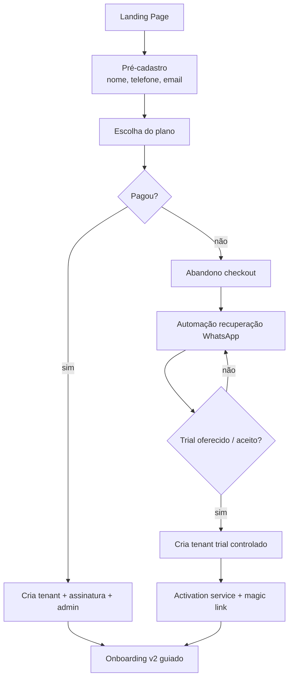
```mermaid
flowchart TB
  LP[Landing Page]
  PS[Pré-cadastro<br/>nome, telefone, email]
  PL[Escolha do plano]
  PAY{Pagou?}
  TEN[Cria tenant + assinatura + admin]
  ONB[Onboarding v2 guiado]
  AB[Abandono checkout]
  REC[Automação recuperação WhatsApp]
  OFF{Trial oferecido / aceito?}
  TRIAL[Cria tenant trial controlado]
  ACT[Activation service + magic link]

  LP --> PS --> PL --> PAY
  PAY -->|sim| TEN --> ONB
  PAY -->|não| AB --> REC --> OFF
  OFF -->|sim| TRIAL --> ACT --> ONB
  OFF -->|não| REC
```

### 1.3 Princípios arquiteturais

1. **Nenhum `INSERT INTO tenants` antes de compromisso claro** (pagamento confirmado ou trial ativado por resposta/autorização).
2. **Toda criação passa por `resolveIdentity()`** antes de lead, sessão, trial, tenant ou usuário (§17).
3. **Estado formal** via máquina de estados — sem `UPDATE status` ad hoc (§18).
4. **Idempotência em toda mutação crítica** — webhooks, workers, WhatsApp, ativação (§19).
5. **Eventos de domínio** via **transactional outbox** — não acoplamento direto controller → WhatsApp (§44; visão §21).
6. **Coexistência** com fluxos legados via feature flags até rollout completo (§10, §27).
7. **Multi-tenant seguro:** identidade global ≠ misturar dados entre tenants; conflitos explícitos (§17.5).
8. **Observabilidade e auditoria** em toda transição e side-effect (§26, §39).
9. **Lifecycle explícito** de tenant e usuário — não nascer “completo” num único INSERT (§28–§29).
10. **Onboarding engine central** — passos, SLA, recovery, não espalhado em páginas (§30).
11. **First value + feature adoption** — métricas de valor real e retenção (§31, §35).
12. **Orquestração** de automações e canais — delays, retries, multi-channel (§36–§37).
13. **Compensação e orphans** — falhas parciais com ações corretivas (§40).
14. **Rollout safety** — shadow mode, beta, rollback imediato (§42).
15. **Outbox transacional** — eventos só após COMMIT; worker + DLQ + replay (§44).
16. **Sagas distribuídas** — signup→trial→onboarding com compensação explícita (§45).
17. **Correlation ID end-to-end** — um fluxo, um ID (§54).
18. **Audit trail global** — mutações e side-effects rastreáveis (§50).
19. **Communication Platform desacoplada** — nenhum módulo de aquisição/onboarding/recovery conhece provider (Meta, UazAPI, etc.); só `channelProviderGateway` (§59).
20. **Webhooks normalizados** — eventos internos únicos; tradutores por provider (§62).
21. **Policy antes de envio** — janela 24h, templates, opt-in via `communicationPolicyEngine` (§64).

### 1.4 Pilares transversais (v5)

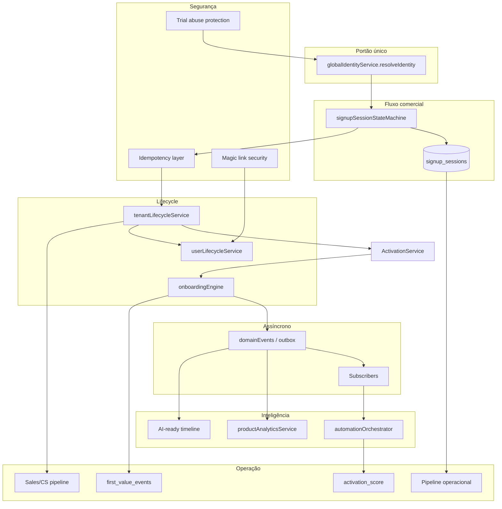
```mermaid
flowchart TB
  subgraph gate [Portão único]
    IR[globalIdentityService.resolveIdentity]
  end
  subgraph flow [Fluxo comercial]
    SM[signupSessionStateMachine]
    SS[(signup_sessions)]
  end
  subgraph safety [Segurança]
    IDEM[Idempotency layer]
    ABUSE[Trial abuse protection]
    ML[Magic link security]
  end
  subgraph async [Assíncrono]
    BUS[domainEvents / outbox]
    SUB[Subscribers]
  end
  subgraph lifecycle [Lifecycle]
    TLC[tenantLifecycleService]
    ULC[userLifecycleService]
    ONB[onboardingEngine]
  end
  subgraph ops [Operação]
    SCORE[activation_score]
    FV[first_value_events]
    KAN[Pipeline operacional]
    CS[Sales/CS pipeline]
  end
  subgraph intel [Inteligência]
    PA[productAnalyticsService]
    ORCH[automationOrchestrator]
    AI[AI-ready timeline]
  end

  IR --> SM --> SS
  SM --> IDEM
  IDEM --> TLC --> ACT[ActivationService]
  TLC --> ULC
  ACT --> ONB
  ONB --> BUS --> SUB
  SUB --> ORCH
  ORCH --> SCORE
  ONB --> FV
  SS --> KAN
  TLC --> CS
  BUS --> PA
  BUS --> AI
  ABUSE --> IR
  ML --> ULC
```

| Pilar | Módulo alvo (futuro) | Seção |
|-------|----------------------|-------|
| Identity resolution | `services/acquisition/globalIdentityService.ts` | §17 |
| Signup state machine | `services/acquisition/signupSessionStateMachine.ts` | §18 |
| Idempotência | `services/acquisition/idempotency/` | §19 |
| Anti-abuso trial | `services/acquisition/trialAbuseProtectionService.ts` | §20, §41 |
| Domain event bus | `domainEvents/` + **outbox** | §21, §44 |
| Saga orchestration | `acquisitionSagaOrchestrator` | §45 |
| Tenant provisioning | `tenantProvisioningService` | §46 |
| Feature flags | `featureFlagRegistry` | §47 |
| Health score (contínuo) | `healthScoreRecalculator` | §48 |
| Audit trail | `auditTrailService` | §50 |
| Correlation ID | middleware + colunas | §54 |
| Tenant lifecycle | `services/platform/tenantLifecycleService.ts` | §28 |
| User lifecycle | `services/platform/userLifecycleService.ts` | §29 |
| Onboarding engine | `services/onboarding/onboardingEngine/` | §30 |
| First value | `services/analytics/firstValueService.ts` | §31 |
| Activation / adoption score | `activationScoreService` + `featureAdoptionService` | §22, §35 |
| Kanban + CS pipeline | Superadmin funil + ownership | §23, §33 |
| Magic link | `activation_tokens` | §24, §41 |
| Product analytics | `services/analytics/productAnalyticsService.ts` | §34 |
| Automation orchestrator | `services/automation/automationOrchestrator/` | §36 |
| Multi-channel recovery | via **Communication Platform** (não adapters ad hoc) | §37, §59–§67 |
| Communication gateway | `channelProviderGateway` | §59 |
| Webhook normalization | `communicationWebhookNormalizer` | §62 |
| Template + policy | `communicationTemplateRegistry` + `communicationPolicyEngine` | §63–§64 |
| Comm analytics | `communicationAnalyticsService` | §67 |
| AI-ready | event stream + timelines | §38 |
| Observabilidade | logs + dashboards | §26, §39 |
| Compensation | `compensationService` | §40 |
| Rollout safety | flags + shadow mode | §42, §47 |
| Backpressure / HITL / degraded | policies + CS tasks | §51–§52, §55 |
| Ops dashboards / playbooks | superadmin + runbooks | §56–§57 |

**Reuso do código atual:** `normalizeEmailForUniqueness`, `normalizeWhatsappDigits` (`utils/userIdentity.ts`), `assertNewTrialSignupAllowed` (`trialSignupGuardService.ts`), `userIdentityValidationService` — encapsulados dentro de `globalIdentityService`, não duplicados.

---

## 2. Mapeamento do fluxo atual (AS-IS)

### 2.1 Entradas públicas (frontend)

| Rota / superfície | Destino | Cria tenant? | Cria user? |
|-------------------|---------|--------------|------------|
| Landing CTA | `/checkout` | Só após submit checkout/trial | Após submit |
| `/checkout` (`PlanCheckout.tsx`) | `POST /api/plan-purchase` ou `complete-signup-trial` | **Sim** (`payment_pending` ou `trial`) | Com senha (trial) ou placeholder (pago) |
| `/register` | Wizard → `POST /api/auth/register/organization` | **Sim** (`trial`) | **Sim** (admin completo) |
| `/login` aba cadastro | `POST /api/auth/register` | **Sim** se plano default | **Sim** |
| `/onboarding` | `POST /api/onboarding/create-admin` | Não (tenant já existe) | Atualiza senha |
| `/register/steps` | Completar perfil pós-registro | Não | PATCH perfil |

**Persistência local de abandono:** `painelcrm_checkout_context_v1` em `sessionStorage` (TTL 30 min) — **não** gera lead nem automação no backend.

**Atribuição marketing:** `painelcrm_marketing_attribution_v1` (localStorage) → enviado no body como `marketing_attribution` → `tenant_marketing_attribution` **após** tenant existir.

### 2.2 Backend — criação de tenant (único ponto por grep)

| Origem | Arquivo | Status inicial | Momento |
|--------|---------|----------------|---------|
| Checkout pago anônimo | `planPurchaseController.resolveTenantId` | `payment_pending` | Antes do pagamento |
| Trial checkout | `postCompleteSignupTrial` | `trial` + `trial_ends_at` + `has_used_trial` | Imediato |
| Registro legado | `authController.register` | `trial` | Após criar user |
| Wizard organização | `registerOrganizationController` | `trial` | Transação única |
| Super Admin | `tenantsController.createTenant` | configurável | Manual |

### 2.3 Backend — primeiro administrador

| Fluxo | Função | Senha |
|-------|--------|-------|
| Checkout pago | `createTenantAdminUser` | Placeholder se sem password; senha real se password no body |
| Trial checkout | `createTenantAdminUser` | Senha real; `onboarding_completed = true` no INSERT tenant |
| Register / organization | INSERT direto users + profiles | Senha real |
| Onboarding | `onboardingController.postOnboardingCreateAdmin` | Senha real; exige tenant `active` |

### 2.4 Contratação e billing SaaS

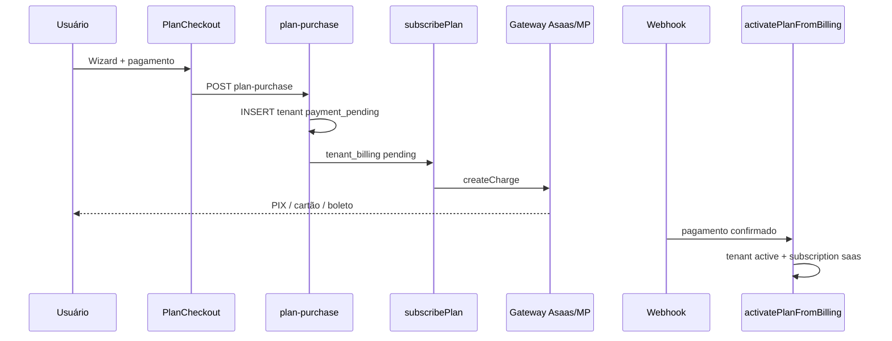
```mermaid
sequenceDiagram
  participant U as Usuário
  participant FE as PlanCheckout
  participant PP as plan-purchase
  participant SS as subscribePlan
  participant GW as Gateway Asaas/MP
  participant WH as Webhook
  participant AP as activatePlanFromBilling

  U->>FE: Wizard + pagamento
  FE->>PP: POST plan-purchase
  PP->>PP: INSERT tenant payment_pending
  PP->>SS: tenant_billing pending
  SS->>GW: createCharge
  GW-->>U: PIX / cartão / boleto
  WH->>AP: pagamento confirmado
  AP->>AP: tenant active + subscription saas
```

**Pontos críticos:**

- `validatePlanForPurchase` bloqueia plano `is_free` na compra com cobrança.
- `plans.trial_days` (Fase 2) habilita trial no checkout via `complete-signup-trial` **sem** `tenant_billing` inicial.
- `cancelExpiredPendingBillings` (48h): cancela faturas pendentes; com `isPhase2TrialCrmGateEnabled()` reverte tenant para `suspended` + `trial_expired` se `has_used_trial`.
- `expireTrialsPastDue` (flag `TRIAL_EXPIRATION_JOB`): suspende trial vencido sem `activated_billing_id`.

### 2.5 Trial — comportamento real

| Aspecto | Implementação |
|---------|----------------|
| Início trial checkout | `postCompleteSignupTrial` → `trial_ends_at`, `has_used_trial = true` |
| Bloqueio segundo trial | `trialSignupGuardService` (CPF/CNPJ, e-mail, WhatsApp) |
| Fim lógico (features) | `featureFlagService` — trial com data passada sem features |
| Bloqueio API pós-trial | `requireTrialNotExpired` middleware (flags Fase 2) → 403 `TRIAL_EXPIRED` |
| Retomada pagamento | `GET /api/me/tenant/checkout-context` + `CHECKOUT_RESUME_V1` |
| Convite WhatsApp trial | `publishPlatformTrialStarted` (após trial checkout) |
| Job expiração | `expireTrialsPastDue` — **opt-in** por env |

**Inconsistência:** trial checkout define `onboarding_completed = true` no tenant — onboarding guiado v2 fica sem obrigatoriedade estrutural.

### 2.6 Onboarding atual

| Peça | Estado |
|------|--------|
| Rota `/onboarding` | 3 passos: admin → empresa → finalizar; **não obrigatório** (`VITE_FORCE_LEGACY_ONBOARDING_ROUTE`) |
| Pós-pagamento legado | Esperava tenant `active` + senha placeholder |
| Ativação no produto | `DashboardActivationBlock` — checklist gamificado (WhatsApp, cliente, gateway, fatura, equipe) |
| API | `GET/POST /api/dashboard/activation-checklist` |

### 2.7 Auth / login / “magic link”

| Mecanismo | Existe? |
|-----------|---------|
| JWT login e-mail/senha | Sim (`authController.login`) |
| Login por WhatsApp (dígitos) | Sim |
| Magic link com token de ativação | **Não** — templates usam `auth.login_link` → `/login` |
| Recuperação senha | Fluxo WhatsApp (`ForgotPasswordWhatsapp`) |

### 2.8 WhatsApp e automações

> **Dívida arquitetural:** acoplamento direto a UazAPI/motor de notificações — alvo **Communication Platform** §59–§71.

| Canal | Uso atual |
|-------|-----------|
| Motor notificações plataforma | `platform.account.created`, `platform.trial.started`, `platform.trial.ended`, `platform.billing.*` |
| WhatsApp tenant (UazAPI / oficial) | Pós-tenant: chat, notificações negócio |
| Superadmin marketing | `superadmin_leads` + disparos — **separado** do funil SaaS |
| Kanban automação chat | `sendKanbanAutomationOutboundText` — compromissos, etc. |

**Gap:** não há automação de **abandono de checkout** nem **oferta de trial** ligada a pré-cadastro sem tenant.

### 2.9 Leads CRM (tenant) vs funil SaaS

- **`public.leads`**: CRM do tenant (módulo Leads) — não é funil de aquisição SaaS.
- **`superadmin_leads`**: importação/planilha para campanhas plataforma — **não** integrado ao checkout.
- **Novo funil operacional** precisa entidade própria (`signup_sessions` + estágio), não reutilizar `leads` do tenant sem adaptação.

### 2.10 Feature flags existentes (referência rollout)

| Env (backend) | Efeito |
|---------------|--------|
| `CHECKOUT_TRIAL_V1` | Ramo trial no checkout |
| `TRIAL_EXPIRATION_JOB` | `expireTrialsPastDue` |
| `CHECKOUT_RESUME_V1` | Retomada checkout pós-trial |
| `isPhase2TrialCrmGateEnabled()` | OR das três acima |

| Env (frontend) | Efeito |
|----------------|--------|
| `VITE_CHECKOUT_TRIAL_V1` | UI trial no checkout |
| `VITE_CHECKOUT_RESUME_V1` | UI retomada |
| `VITE_FORCE_LEGACY_ONBOARDING_ROUTE` | Força `/onboarding` |

---

## 3. Riscos e dependências ocultas (AS-IS)

### 3.1 Matriz de riscos

| Risco | Severidade | Evidência | Impacto no novo modelo |
|-------|------------|-----------|------------------------|
| Tenant órfão `payment_pending` | Alta | Tenant criado antes do pagamento; job 48h | Pré-cadastro não deve virar tenant |
| Tenant trial sem uso | Média | Múltiplos fluxos criam `trial` | Trial só após aceite explícito |
| Duplicidade e-mail/WhatsApp | Alta | Várias validações parciais | Unificar em `signup_sessions` + guard global |
| `onboarding_completed` prematuro no trial | Média | `postCompleteSignupTrial` SQL | Onboarding v2 com progresso real |
| Dupla mensagem WhatsApp | Média | `send_chat_confirmation` + `publishAppointmentInvite` (padrão em chat) | Padrão para convite pós-criação |
| Quebra billing recorrente | Alta se mexer em `activatePlanFromBilling` | Assinaturas pós-primeiro pagamento | Activation service deve **chamar** fluxos existentes, não reescrever |
| Quebra auth JWT / tenantAuth | Alta | Middleware trial + plan period | Novos estados exigem extensão cuidadosa |
| Revert abandon → `trial_expired` | Média | `cancelExpiredPendingBillings` Fase 2 | Sessões abandonadas ≠ tenant |
| CPF trial consumido | Baixa | `has_used_trial` | Amarrar a `signup_session` + tenant |
| Dependência Meta Pixel | Baixa | `/signup-success`, atribuição | Eventos devem espelhar novos estágios |

### 3.2 Eventos críticos atuais (não renomear sem migração)

- `activatePlanFromBilling(billingId)`
- `subscribePlan` / webhooks Asaas
- `publishPlatformTrialStarted` / `publishPlatformTrialEnded`
- `createTenantAdminUser`
- `assertNewTrialSignupAllowed`

### 3.3 Dependências ocultas

1. **`tenant_plan`** e **`subscriptions`** criados só após ativação paga (trial puro não cria assinatura recorrente).
2. **`featureFlagService`** usa `tenant.status` + `trial_ends_at` — novo estado `prospect` não pode existir em `tenants` sem migração de constraint.
3. **`AuthGuard`** usa `registration_complete` (perfil) distinto de `onboarding_completed` (tenant).
4. **Superadmin dashboard** agrega `trial`, `payment_pending`, `trial_expired` — métricas novas devem alimentar mesmo painel ou v2.

---

## 4. Arquitetura alvo (TO-BE)

### 4.1 Camadas

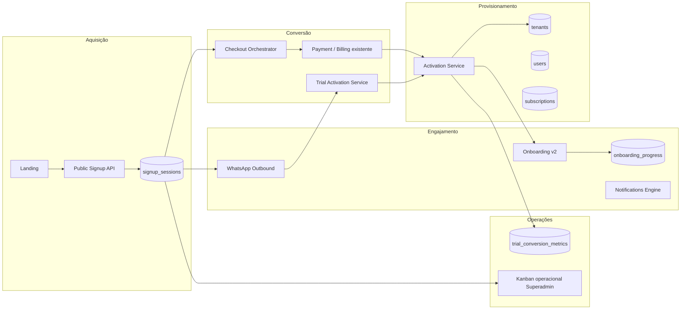
```mermaid
flowchart LR
  subgraph acquisition [Aquisição]
    LP[Landing]
    API_PUB[Public Signup API]
    SS[(signup_sessions)]
  end
  subgraph conversion [Conversão]
    CHK[Checkout Orchestrator]
    PAY[Payment / Billing existente]
    TRIAL[Trial Activation Service]
  end
  subgraph provisioning [Provisionamento]
    ACT[Activation Service]
    TEN[(tenants)]
    USR[(users)]
    SUB[(subscriptions)]
  end
  subgraph engagement [Engajamento]
    ONB[Onboarding v2]
    OBP[(onboarding_progress)]
    NOTIF[Notifications Engine]
    WA[WhatsApp Outbound]
  end
  subgraph ops [Operações]
    KAN[Kanban operacional Superadmin]
    MET[(trial_conversion_metrics)]
  end

  LP --> API_PUB --> SS
  SS --> CHK --> PAY --> ACT --> TEN
  SS --> WA --> TRIAL --> ACT
  ACT --> ONB --> OBP
  SS --> KAN
  ACT --> MET
```

### 4.2 Entidade central: `signup_sessions`

**Propósito:** representar uma jornada de compra **antes** de existir tenant.

| Campo (proposta) | Tipo | Notas |
|------------------|------|-------|
| `id` | UUID PK | |
| `public_token` | text unique | URL segura retomada / magic link |
| `status` | enum | Ver lifecycle §4.3 |
| `full_name` | text | Pré-cadastro |
| `email_normalized` | text | lower trim |
| `phone_digits` | text | E.164 ou BR digits |
| `plan_id` | uuid FK nullable | Preenchido na escolha do plano |
| `billing_interval` | text nullable | |
| `marketing_attribution` | jsonb | Antes do tenant |
| `tenant_id` | uuid FK nullable | Preenchido só após ativação |
| `checkout_started_at` | timestamptz | |
| `checkout_abandoned_at` | timestamptz | |
| `trial_offered_at` | timestamptz | |
| `trial_activated_at` | timestamptz | |
| `converted_at` | timestamptz | Primeiro pagamento |
| `expires_at` | timestamptz | Retenção LGPD / limpeza |
| `created_at` / `updated_at` | timestamptz | |

**Unique constraints (proposta):**

- `UNIQUE (email_normalized) WHERE status NOT IN ('converted','expired','merged')` — partial, evita duplicata ativa.
- `UNIQUE (phone_digits) WHERE ...` — idem, com política de merge manual.
- `UNIQUE (public_token)`.

**Índices:** `(status, updated_at)`, `(plan_id, status)`, `(tenant_id) WHERE tenant_id IS NOT NULL`.

### 4.3 Lifecycle `signup_sessions.status`

**Versão v2:** lifecycle completo, transições proibidas, guards e idempotência em **§18** (`signupSessionStateMachine`).

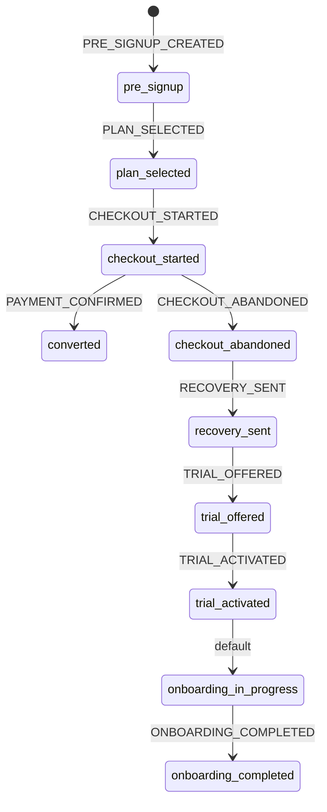
```mermaid
stateDiagram-v2
  [*] --> pre_signup: PRE_SIGNUP_CREATED
  pre_signup --> plan_selected: PLAN_SELECTED
  plan_selected --> checkout_started: CHECKOUT_STARTED
  checkout_started --> converted: PAYMENT_CONFIRMED
  checkout_started --> checkout_abandoned: CHECKOUT_ABANDONED
  checkout_abandoned --> recovery_sent: RECOVERY_SENT
  recovery_sent --> trial_offered: TRIAL_OFFERED
  trial_offered --> trial_activated: TRIAL_ACTIVATED
  trial_activated --> onboarding_in_progress: default
  onboarding_in_progress --> onboarding_completed: ONBOARDING_COMPLETED
```

Kanban operacional espelha estados via `signup_pipeline_cards` (§23).

### 4.4 Serviços (bounded contexts)

| Serviço | Responsabilidade | Reutiliza |
|---------|------------------|-----------|
| **globalIdentityService** | `resolveIdentity()` — portão único | `userIdentity`, `trialSignupGuard` |
| **signupSessionStateMachine** | Transições válidas + outbox | — |
| **SignupSessionService** | CRUD sessão, TTL; delega SM + identity | §17–§18 |
| **CheckoutOrchestrator** | Plano + pagamento; **não** INSERT tenant até confirmação | `planPurchaseController`, `subscribePlan` |
| **TrialActivationService** | Oferta → aceite → tenant trial controlado | `postCompleteSignupTrial` (refatorado), `assertNewTrialSignupAllowed` |
| **ActivationService** | Único portão `tenants` + admin + vínculos | `createTenantAdminUser`, `registerOrganization` (extraído) |
| **OnboardingV2Service** | Progresso por checkpoint | `dashboard` activation + novo `onboarding_progress` |
| **RecoveryAutomationService** | Abandono → filas WhatsApp → logs | Motor notificações + instância plataforma |
| **ConversionMetricsService** | Agregações funil | Novo + superadmin dashboard |
| **trialAbuseProtectionService** | Score + blocklist | `assertNewTrialSignupAllowed` |
| **domainEvents** (publisher/dispatcher) | Outbox + subscribers | Motor notificações plataforma |
| **activationScoreService** | Score + snapshots | `activation-checklist` |

### 4.5 Quando criar tenant (regra de ouro)

| Gatilho | Cria tenant? | Status tenant |
|---------|--------------|---------------|
| Pré-cadastro submit | **Não** | — |
| Checkout iniciado (sem pagamento) | **Não** | — |
| Pagamento confirmado (webhook/polling) | **Sim** | `active` (via `activatePlanFromBilling`) ou `payment_pending`→`active` |
| Trial aceito (link/token + confirmação) | **Sim** | `trial` + `trial_ends_at` |
| Resposta WhatsApp “quero trial” | **Sim** | Idem, após validação anti-fraude |

**Deprecar gradualmente:** `resolveTenantId` criando tenant em `payment_pending` **antes** do pagamento → substituir por sessão + cobrança com `metadata.signup_session_id`.

### 4.6 Magic link / activation tokens

Tabela proposta **`activation_tokens`**:

| Campo | Uso |
|-------|-----|
| `signup_session_id` | FK |
| `token_hash` | SHA-256 do token |
| `purpose` | `trial_activate`, `resume_checkout`, `set_password` |
| `expires_at` | Curto (15–72h conforme purpose) |
| `used_at` | Uso único |

Fluxo: WhatsApp envia `https://app.../activate?t=...` → valida token → `TrialActivationService` → JWT + redirect onboarding v2.

**Não confundir** com `auth.login_link` atual (apenas URL de login).

---

## 5. Onboarding v2 (especificação — UI; engine central em §30)

### 5.1 Checkpoints (ordem guiada)

| # | Checkpoint | Critério de conclusão | Bloqueio opcional |
|---|------------|----------------------|-------------------|
| 1 | Empresa | `tenants` nome, CPF/CNPJ, billing preenchidos | Soft — dashboard lembra |
| 2 | Usuários | ≥1 usuário além admin OU confirma “solo” | Soft até limite plano |
| 3 | WhatsApp | ≥1 instância `connected` no tenant | **Hard** para chat (já parcial no produto) |
| 4 | Primeira automação | Tag Kanban / resposta rápida / modelo mínimo | Soft |
| 5 | Primeiro atendimento | 1 conversa com mensagem outbound ou inbound | Soft (métrica de ativação) |

### 5.2 Persistência `onboarding_progress`

| Campo | Tipo |
|-------|------|
| `tenant_id` | UUID PK/FK |
| `checkpoints` | jsonb `{ company, users, whatsapp, automation, first_chat }` booleans + `completed_at` |
| `current_step` | text |
| `completed_at` | timestamptz nullable |
| `dismissed_at` | timestamptz nullable |

**Relação com `tenants.onboarding_completed`:** manter coluna como cache `checkpoints all required` ou deprecar em favor do jsonb (migração em fase 3).

### 5.3 UX

- Rota dedicada `/welcome` ou `/onboarding-v2` (flag).
- Barra de progresso global; deep links para Settings → WhatsApp.
- Coexistir com `DashboardActivationBlock` até unificação (mesmos critérios backend).

---

## 6. Recuperação de abandono e automações

### 6.1 Detecção abandono

| Sinal | Regra |
|-------|-------|
| Checkout abandonado | `checkout_started_at` + sem `converted_at` + TTL 1–24h |
| Sem pagamento pendente válido | Não existe `tenant_billing` paid ligado à sessão |
| Opcional front | `beforeunload` / heartbeat → `PATCH session heartbeat` |

### 6.2 Sequência WhatsApp (proposta)

1. **T+1h** — lembrete checkout (template `signup.checkout_abandoned`)
2. **T+24h** — oferta trial (se plano `trial_days > 0` e `!has_used_trial` na sessão)
3. **Resposta positiva** — link magic `trial_activate`
4. **T+72h** — encerrar com `expired` + log

Tabela **`recovery_automation_logs`**:

| Campo | Uso |
|-------|-----|
| `signup_session_id` | FK |
| `step` | `checkout_reminder`, `trial_offer`, `trial_followup` |
| `channel` | `whatsapp` |
| `provider_message_id` | idempotência |
| `status` | `queued`, `sent`, `failed`, `replied` |
| `payload` | jsonb |

**Integração:** estender `notifications_engine` com event keys novos (§7), fila outbound plataforma (instância superadmin / número comercial).

### 6.3 Anti-spam / compliance

- Máx. N mensagens por sessão por janela.
- Opt-out implícito se converter ou pedir parar.
- Não enviar trial se `TRIAL_ALREADY_CONSUMED` nos identificadores da sessão.

> **Nota v2:** Catálogo legado abaixo (§7) será **substituído formalmente** pelo Domain Event Bus (§21). Manter nomenclatura alinhada na implementação.

---

## 7. Eventos de domínio (catálogo alvo — legado, ver §21)

| Evento | Produtor | Consumidores |
|--------|----------|--------------|
| `pre_signup_created` | SignupSessionService | Métricas, Meta Pixel server-side (opcional) |
| `plan_selected` | SignupSessionService | Kanban |
| `checkout_started` | CheckoutOrchestrator | Métricas, abandono timer |
| `checkout_abandoned` | Job / timeout | RecoveryAutomationService |
| `trial_offered` | RecoveryAutomationService | Log + kanban |
| `trial_activated` | TrialActivationService | `publishPlatformTrialStarted`, onboarding |
| `tenant_provisioned` | ActivationService | `publishPlatformAccountCreated` |
| `onboarding_started` | OnboardingV2Service | Métricas |
| `onboarding_completed` | OnboardingV2Service | E-mail interno CS (opcional) |
| `whatsapp_connected` | Webhook instância | Checkpoint onboarding |
| `converted_to_paid` | `activatePlanFromBilling` | `publishPlatformPlanActivated`, métricas |

**Implementação:** tabela `domain_outbox` ou reuso `platform_notification_outbound` com `event_key` — decisão na Fase 1 (ver §10).

---

## 8. Kanban operacional (Superadmin)

### 8.1 Colunas

| Coluna | Critério |
|--------|----------|
| Novo lead | `pre_signup_created` |
| Checkout iniciado | `checkout_started` |
| Abandonado | `checkout_abandoned` |
| Trial enviado | `trial_offered` |
| Trial ativado | `trial_activated` + tenant existe |
| WhatsApp conectado | checkpoint onboarding |
| Primeiro atendimento | checkpoint `first_chat` |
| Convertido | `converted` + `active` + billing |

### 8.2 Implementação sugerida

- **Opção A:** vista SQL + UI em `SuperAdminMarketing` / novo `SuperAdminSignupFunnel`.
- **Opção B:** sincronizar estágio final para `superadmin_leads` (evitar duplicar — preferir **Opção A**).

Card = `signup_session` com drag apenas para estados manuais (`lost`, `contacted`) sem quebrar máquina de estados automática.

---

## 9. Métricas

### 9.1 Definições

| Métrica | Fórmula |
|---------|---------|
| Taxa abandono checkout | `abandoned / started` |
| Taxa ativação trial | `trial_activated / trial_offered` |
| Taxa conversão paga | `converted / pre_signup` |
| Onboarding completion | `onboarding_completed / trial_activated ∪ converted` |
| WhatsApp adoption | `whatsapp_connected / tenants provisioned` |
| Time to first chat | mediana `first_chat_at - tenant.created_at` |

### 9.2 Tabela `trial_conversion_metrics` (rollup diário)

| Coluna | Tipo |
|--------|------|
| `metric_date` | date |
| `plan_id` | uuid nullable |
| `pre_signups` | int |
| `checkouts_started` | int |
| `checkouts_abandoned` | int |
| `trials_offered` | int |
| `trials_activated` | int |
| `converted_paid` | int |
| `onboarding_completed` | int |
| `whatsapp_connected` | int |
| `first_chat_within_7d` | int |

Job noturno idempotente `UPSERT` por dia/plano.

> **Nota v2:** Métricas expandidas em §25 (analytics SaaS completo).

---

# Parte C — Camadas críticas (v2)

---

## 17. Identity Resolution Layer

### 17.1 Problema

O mesmo indivíduo percorre: checkout → abandono → recovery → trial → tenant → novo checkout. Sem camada única surgem leads/tenants/users duplicados, automações em duplicata e trials múltiplos.

### 17.2 Serviço: `globalIdentityService.ts`

**Localização proposta:** `packages/backend/src/services/acquisition/globalIdentityService.ts`

**API principal:**

```typescript
// Contrato conceitual (não implementar ainda)
type IdentityInput = {
  email?: string | null;
  phone?: string | null;
  cpf_cnpj?: string | null;       // futuro
  ip?: string | null;
  fingerprint?: string | null;    // futuro front
  signup_session_id?: string | null;
};

type ResolvedIdentity = {
  email_normalized: string | null;
  phone_digits: string | null;
  matches: {
    signup_sessions: Array<{ id: string; status: string; updated_at: string }>;
    tenants: Array<{ id: string; status: string; slug: string }>;
    users: Array<{ id: string; tenant_id: string | null; email: string }>;
    superadmin_leads: Array<{ id: string }>;  // opcional, marketing plataforma
  };
  resolution: 'new' | 'resume_session' | 'resume_tenant' | 'blocked' | 'merge_required';
  resume_signup_session_id: string | null;
  primary_tenant_id: string | null;
  primary_user_id: string | null;
  block_reason: string | null;
  idempotency_hint: string;  // hash estável email|phone|cpf
};

resolveIdentity(input: IdentityInput): Promise<ResolvedIdentity>;
```

**Responsabilidades:**

| Função | Descrição |
|--------|-----------|
| Normalização | Delegar a `normalizeEmailForUniqueness`, `normalizeWhatsappDigits` (BR: DDI 55, mín. 8–13 dígitos) |
| Deduplicação | Buscar sessões ativas (não terminais), tenants por `billing_email` / users, trial consumido |
| Prioridade | Ver §17.4 |
| Conflito multi-tenant | Ver §17.5 |
| Merge | Manual superadmin ou regra automática limitada (§17.3) |

### 17.3 Regras de merge

| Cenário | Ação automática | Ação manual |
|---------|-----------------|-------------|
| Mesmo e-mail, sessão `checkout_abandoned` + nova visita | **Resume** sessão existente (atualizar `updated_at`, atribuição) | — |
| Mesmo e-mail, tenant `payment_pending` sem pagamento | Vincular nova sessão ao `tenant_id` existente; não criar tenant | CS pode cancelar tenant órfão |
| Mesmo e-mail, tenant `active` | `resolution: resume_tenant` → login/checkout upgrade | — |
| Mesmo telefone, e-mail diferente | `merge_required` — fila CS | Superadmin vincula sessões |
| Sessão `converted` + novo pré-cadastro | Nova sessão permitida se `has_used_trial` e sem assinatura ativa; senão `blocked` | — |

**Proibido automaticamente:** fundir dois tenants `active` distintos; fundir users de tenants diferentes em um único login.

### 17.4 Prioridade de resolução (ordem)

1. **Bloqueio** — abuse score alto (§20), blacklist, trial consumido sem direito a novo trial.
2. **Tenant ativo ou com assinatura** — direcionar para login / `meu-plano` / retomada checkout (`checkout-context`).
3. **Sessão ativa não terminal** — retomar mesma `signup_session` (token público).
4. **Tenant `payment_pending` / `trial` não convertido** — associar sessão ao tenant existente (não INSERT novo).
5. **Novo** — criar apenas `signup_session` (ainda sem tenant).

### 17.5 Estratégia multi-tenant

- **Identidade global** é chave comercial (e-mail/telefone/CPF), não `tenant_id`.
- **Dados operacionais** permanecem isolados por `tenant_id` (RLS / `tenantAuth` inalterados).
- Um **user** pertence a um `tenant_id` (regra atual); segundo tenant exige segundo user ou convite — não “fundir” tenants.
- `resolveIdentity()` roda no **contexto plataforma** (sem `tenantAuth`) para endpoints públicos; resultados só expõem IDs, nunca dados de outro tenant no response público.

### 17.6 Tabela de apoio (opcional Fase 1)

`identity_resolution_log` — auditoria de cada `resolveIdentity`: input hash, resolution, matched ids, actor `system|user`, IP.

### 17.7 Contrato obrigatório para mutações

**ANTES de:**

| Ação | Chamada obrigatória |
|------|---------------------|
| `INSERT signup_sessions` | `resolveIdentity` → se `resume_session`, UPDATE; se `new`, INSERT |
| `INSERT tenants` | `resolveIdentity` + idempotency key (§19) |
| `INSERT users` (admin) | `resolveIdentity` + `createTenantAdminUser` guard |
| Oferta trial | `resolveIdentity` + abuse check (§20) |
| Recovery WhatsApp | `resolveIdentity` — uma sessão alvo por identidade |

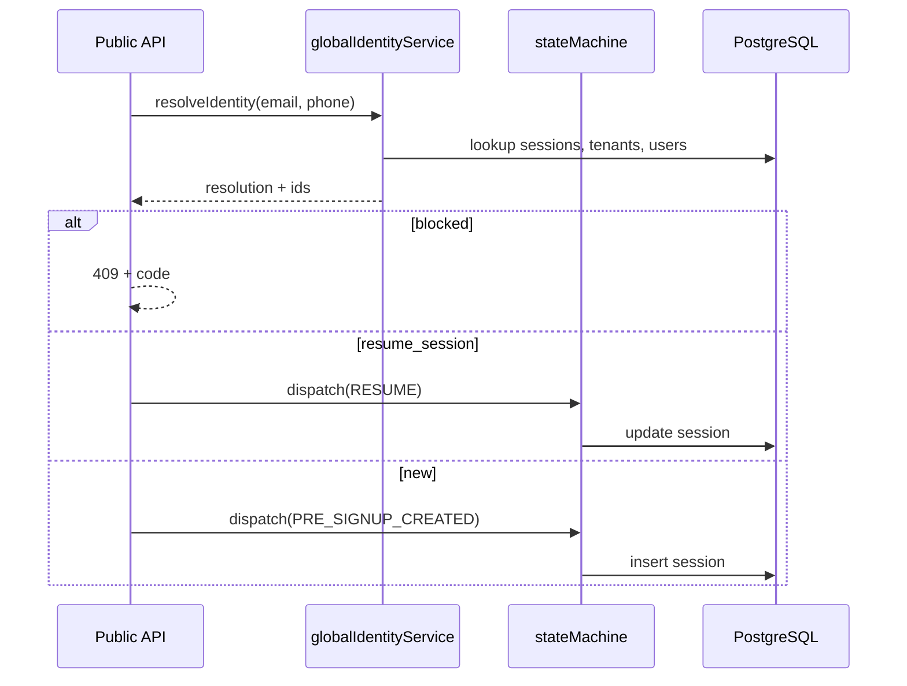
```mermaid
sequenceDiagram
  participant API as Public API
  participant IR as globalIdentityService
  participant SM as stateMachine
  participant DB as PostgreSQL

  API->>IR: resolveIdentity(email, phone)
  IR->>DB: lookup sessions, tenants, users
  IR-->>API: resolution + ids
  alt blocked
    API-->>API: 409 + code
  else resume_session
    API->>SM: dispatch(RESUME)
    SM->>DB: update session
  else new
    API->>SM: dispatch(PRE_SIGNUP_CREATED)
    SM->>DB: insert session
  end
```

---

## 18. State Machine formal (`signupSessionStateMachine`)

### 18.1 Por que formalizar

Status soltos em controllers permitem transições inválidas (ex.: `converted` → `abandoned`), retries perigosos e bugs em produção sob concorrência.

### 18.2 Estados

| Estado | Terminal? | Descrição |
|--------|-----------|-----------|
| `pre_signup` | não | Sessão criada, plano não escolhido |
| `plan_selected` | não | Plano/intervalo escolhidos |
| `checkout_started` | não | Entrou no wizard pagamento |
| `checkout_abandoned` | não | Timeout ou saída sem pagamento |
| `recovery_pending` | não | Elegível a automação, ainda não enviada |
| `recovery_sent` | não | Pelo menos uma mensagem recovery disparada |
| `trial_offered` | não | Oferta trial registrada (pode incluir `recovery_sent`) |
| `trial_activation_pending` | não | Link gerado, aguardando clique |
| `trial_activated` | não | Tenant criado em trial |
| `onboarding_in_progress` | não | Tenant existe, onboarding v2 incompleto |
| `onboarding_completed` | não | Checkpoints mínimos OK (score ≥ limiar opcional) |
| `converted` | **sim** | Pagamento confirmado + tenant active |
| `expired` | **sim** | TTL / opt-out / sem resposta |
| `merged` | **sim** | Sessão fundida em outra |
| `cancelled` | **sim** | Cancelamento manual CS |

**Aliases legados no doc v1:** `pre_signup_created` → evento, não estado; unificar nomes na implementação.

### 18.3 Eventos (inputs da máquina)

| Evento | Payload mínimo |
|--------|----------------|
| `PRE_SIGNUP_CREATED` | identity snapshot |
| `PLAN_SELECTED` | plan_id, billing_interval |
| `CHECKOUT_STARTED` | — |
| `CHECKOUT_ABANDONED` | reason, idle_minutes |
| `RECOVERY_SCHEDULED` | step |
| `RECOVERY_SENT` | channel, template_id |
| `TRIAL_OFFERED` | offer_id |
| `TRIAL_LINK_ISSUED` | token_id |
| `TRIAL_ACTIVATED` | tenant_id |
| `PAYMENT_CONFIRMED` | billing_id, tenant_id |
| `ONBOARDING_STEP_COMPLETED` | step |
| `ONBOARDING_COMPLETED` | score |
| `SESSION_EXPIRED` | — |
| `SESSION_MERGED` | target_session_id |
| `MANUAL_CANCEL` | actor_user_id |

### 18.4 Transições válidas (matriz resumida)

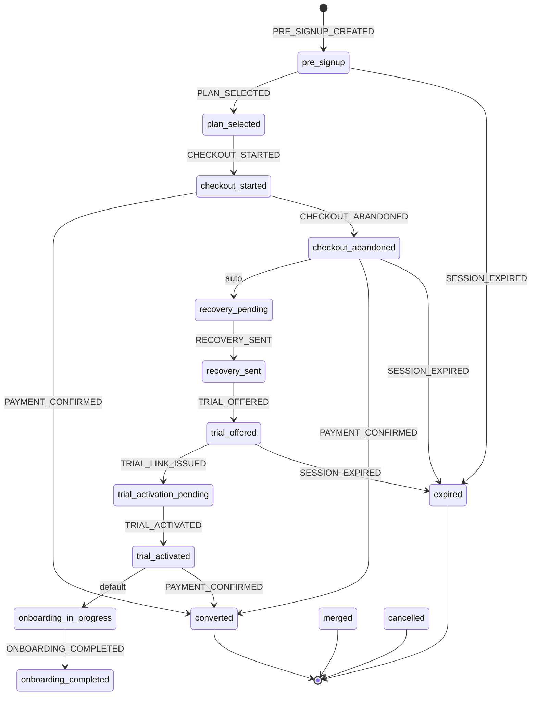
```mermaid
stateDiagram-v2
  [*] --> pre_signup: PRE_SIGNUP_CREATED
  pre_signup --> plan_selected: PLAN_SELECTED
  plan_selected --> checkout_started: CHECKOUT_STARTED
  checkout_started --> converted: PAYMENT_CONFIRMED
  checkout_started --> checkout_abandoned: CHECKOUT_ABANDONED
  checkout_abandoned --> recovery_pending: auto
  recovery_pending --> recovery_sent: RECOVERY_SENT
  recovery_sent --> trial_offered: TRIAL_OFFERED
  trial_offered --> trial_activation_pending: TRIAL_LINK_ISSUED
  trial_activation_pending --> trial_activated: TRIAL_ACTIVATED
  trial_activated --> onboarding_in_progress: default
  onboarding_in_progress --> onboarding_completed: ONBOARDING_COMPLETED
  trial_activated --> converted: PAYMENT_CONFIRMED
  checkout_abandoned --> converted: PAYMENT_CONFIRMED
  pre_signup --> expired: SESSION_EXPIRED
  checkout_abandoned --> expired: SESSION_EXPIRED
  trial_offered --> expired: SESSION_EXPIRED
  converted --> [*]
  expired --> [*]
  merged --> [*]
  cancelled --> [*]
```

### 18.5 Transições proibidas (exemplos)

| De | Para | Motivo |
|----|------|--------|
| `converted` | qualquer não terminal | Integridade comercial |
| `expired` | `checkout_started` | Criar nova sessão em vez de reativar |
| `trial_activated` | `pre_signup` | Irreversível sem CS |
| `merged` | * | Terminal |
| `checkout_abandoned` | `plan_selected` | Evento inválido; usar `CHECKOUT_STARTED` com mesma sessão |

**Enforcement:** `signupSessionStateMachine.dispatch(sessionId, event)` valida guard; `UPDATE` só via máquina.

### 18.6 Guards

| Guard | Condição |
|-------|----------|
| `canOfferTrial` | plan.trial_days > 0, !abuse_block, !has_used_trial para identidade |
| `canActivateTrial` | token válido, sessão em `trial_activation_pending` ou `trial_offered` |
| `canConvert` | billing paid, idempotency key única |
| `canAbandon` | checkout_started && !converted |

### 18.7 Retries seguros e eventos duplicados

- Persistir `signup_session_transitions` (append-only): `session_id`, `from`, `to`, `event`, `idempotency_key`, `created_at`.
- Se `dispatch` recebe mesmo `idempotency_key` → retorno idempotente (estado atual, sem reprocessar side-effects).
- Side-effects (WhatsApp, criar tenant) **só** em subscriber após transição commitada (§21).

### 18.8 Rollback

- **Não** há rollback de estado comercial (máquina forward-only).
- Compensação: eventos `MANUAL_CANCEL`, `SESSION_MERGED`, scripts CS; nunca `DELETE` tenant com billing ativo.

---

## 19. Idempotência global

### 19.1 Ameaças

| Fonte | Duplicação típica |
|-------|------------------|
| Webhook Asaas/MP | 2× `activatePlanFromBilling` |
| Worker recovery | 2× WhatsApp trial offer |
| Retry HTTP cliente | 2× `complete-signup-trial` |
| Double-click UI | 2× POST pre-signup |

### 19.2 Chaves e escopos

| Chave | Escopo | Exemplo de valor |
|-------|--------|------------------|
| `activation_idempotency_key` | Criar tenant + admin + trial | `activate:{session_id}:trial` ou `activate:{billing_id}` |
| `recovery_idempotency_key` | Cada passo recovery | `recovery:{session_id}:step:checkout_reminder_1h` |
| `onboarding_idempotency_key` | Inicializar progresso / complete | `onboarding:{tenant_id}:init` |
| `identity_idempotency_key` | resolveIdentity cache curto | hash(email\|phone) — opcional 60s |

**Tabela proposta:** `acquisition_idempotency_keys`

| Coluna | Tipo |
|--------|------|
| `key` | text PK |
| `scope` | text |
| `entity_type` | text |
| `entity_id` | uuid nullable |
| `result_snapshot` | jsonb nullable |
| `created_at` | timestamptz |
| `expires_at` | timestamptz |

`INSERT ... ON CONFLICT (key) DO NOTHING RETURNING` → se conflito, ler `result_snapshot` e retornar.

### 19.3 Unique constraints (PostgreSQL)

| Tabela | Constraint |
|--------|------------|
| `signup_sessions` | `UNIQUE (email_normalized) WHERE status NOT IN (terminais)` — partial index |
| `signup_sessions` | `UNIQUE (public_token)` |
| `activation_tokens` | `UNIQUE (token_hash)` |
| `users` | existente `email` / tenant — manter |
| `tenants` | `UNIQUE (slug)` — manter |
| `acquisition_idempotency_keys` | `PRIMARY KEY (key)` |

### 19.4 Lock strategy

| Operação | Lock |
|----------|------|
| Ativação tenant | `pg_advisory_xact_lock(hashtext(idempotency_key))` dentro da transação |
| Transição SM | `SELECT ... FOR UPDATE` na linha `signup_sessions` |
| Recovery job | `SKIP LOCKED` em fila de sessões elegíveis |

### 19.5 Transactional boundaries

```text
BEGIN
  advisory_lock(idempotency_key)
  insert idempotency_key (ou conflict → return cached)
  stateMachine.dispatch(...)
  insert outbox events
COMMIT
→ async: subscribers (WhatsApp, billing, score)
```

**Nunca** enviar WhatsApp ou chamar gateway **dentro** da mesma transação do INSERT tenant (padrão já desejável no billing).

### 19.6 Garantias alvo

| Nunca | Como |
|-------|------|
| 2 tenants mesma sessão + key pagamento | `activation_idempotency_key` + UNIQUE `signup_sessions.tenant_id` quando not null |
| 2 trials mesma identidade | `trialSignupGuard` + abuse + idempotency |
| 2 users admin mesmo tenant | `createTenantAdminUser` 23505 + idempotency |
| 2 onboardings init | `onboarding_idempotency_key` |

---

## 20. Trial abuse protection

### 20.1 Objetivo

Reduzir abuso de teste grátis sem bloquear lead legítimo (agência, reuso de e-mail corporativo, etc.).

### 20.2 Sinais e armazenamento

**Tabela proposta:** `trial_abuse_signals`

| Sinal | Campo | Peso inicial |
|-------|-------|--------------|
| E-mail | `email_normalized` | consulta `has_used_trial` |
| Telefone | `phone_digits` | consulta users/tenants |
| IP | `ip` /24 ou hash | rate limit |
| Fingerprint | `device_fingerprint_hash` | opcional front |
| Domínio e-mail | `email_domain` | freemail vs corporate |
| CNPJ | `cpf_cnpj` | futuro, igual trial guard |

**Tabela proposta:** `trial_abuse_blocklist` (e-mail, phone, ip cidr, reason, expires_at)

### 20.3 Score de abuso (0–100)

| Faixa | Ação |
|-------|------|
| 0–39 | Permitir trial |
| 40–69 | Permitir com captcha / verificação extra (futuro) |
| 70–89 | Trial negado; oferecer só checkout pago |
| 90–100 | Bloquear pré-cadastro; log CS |

**Componentes do score (exemplo):**

- +40 se `has_used_trial` por e-mail ou telefone
- +25 se ≥3 sessões `trial_activated` mesmo IP em 7 dias
- +15 se domínio descartável (lista configurável)
- +20 se fingerprint já ativou trial
- −10 se e-mail corporativo não freemail (whitelist domínios)

### 20.4 Limites operacionais

| Limite | Valor proposta |
|--------|----------------|
| Sessões ativas por e-mail | 1 |
| Ofertas trial WhatsApp por sessão | 2 (oferta + lembrete) |
| Ativações trial por IP / dia | 5 (configurável) |
| Cooldown novo trial mesma identidade | 180 dias (alinhado `has_used_trial`) |
| Tentativas magic link inválidas | 5 / hora → bloqueio token |

### 20.5 Integração

- `trialAbuseProtectionService.evaluate(input)` chamado **dentro** de `resolveIdentity` e antes de `TRIAL_OFFERED` / `TRIAL_ACTIVATED`.
- Reutilizar `assertNewTrialSignupAllowed` como hard rule; score como soft layer.

---

## 21. Domain Event Bus

> **Especificação canônica (enterprise):** §44 *Transactional Outbox* — esta seção mantém visão de produto; implementação deve seguir §44 (mesma tabela `outbox_events` / `domain_event_outbox` unificada).  
> **Eventos de comunicação:** catálogo `communication.*` em §68 — webhooks normalizados §62, nunca publicar side-effect WA fora do outbox.

### 21.1 Estrutura proposta

```text
packages/backend/src/domainEvents/
  types.ts              # event names + payloads
  publisher.ts          # publishDomainEvent()
  outboxRepository.ts   # INSERT domain_event_outbox
  dispatcher.ts           # poll + deliver
  subscribers/
    notificationsSubscriber.ts   # chama channelProviderGateway §59, não provider direto
    communicationSubscriber.ts # delivery analytics §67
    metricsSubscriber.ts
    kanbanSubscriber.ts
    activationScoreSubscriber.ts
    auditSubscriber.ts
```

### 21.2 Catálogo formal de eventos

| Event name | Quando | Payload mínimo |
|------------|--------|----------------|
| `signup.pre_created` | Sessão criada | session_id, attribution |
| `signup.plan_selected` | Plano escolhido | session_id, plan_id |
| `checkout.started` | Checkout iniciado | session_id |
| `checkout.abandoned` | Abandono detectado | session_id, idle_minutes |
| `trial.offered` | Oferta enviada | session_id, channel |
| `trial.activated` | Tenant trial criado | session_id, tenant_id |
| `tenant.activated` | Tenant active pós-pagamento | tenant_id, billing_id |
| `onboarding.started` | Primeiro acesso pós-ativação | tenant_id |
| `onboarding.completed` | Checkpoints OK | tenant_id, score |
| `whatsapp.connected` | Instância connected | tenant_id, instance_id |
| `converted.to_paid` | Primeira conversão paga | tenant_id, billing_id, mrr_cents |

**Compatibilidade:** mapear para `platform.*` existentes onde aplicável (`platform.trial.started` ← `trial.activated`).

### 21.3 Outbox pattern

**Tabela:** `domain_event_outbox`

| Coluna | Uso |
|--------|-----|
| `id` | uuid |
| `event_name` | text |
| `aggregate_type` | signup_session \| tenant |
| `aggregate_id` | uuid |
| `payload` | jsonb |
| `idempotency_key` | text UNIQUE |
| `status` | pending \| processing \| done \| dead |
| `attempts` | int |
| `available_at` | timestamptz |
| `created_at` | timestamptz |

### 21.4 Subscribers (inicial)

| Subscriber | Ação |
|------------|------|
| notifications | Templates WhatsApp/e-mail plataforma |
| metrics | Upsert `trial_conversion_metrics` / time-series |
| kanban | Atualizar coluna operacional / SLA clock |
| activationScore | Recalcular score (§22) |
| audit | `identity_resolution_log`, superadmin trail |

### 21.5 Retries e dead-letter

- Backoff exponencial: 1m, 5m, 30m, 2h; max 8 tentativas.
- `dead` → fila superadmin “Eventos falhos” + alerta opcional.
- **Replay manual:** requeue por `id` com auditoria (futuro).

### 21.6 Observabilidade

- Log estruturado: `[DOMAIN_EVENT] publish|deliver|fail` + `event_name`, `aggregate_id`, `latency_ms`.
- Métricas Prometheus-style (se existir stack): `domain_events_pending_total`, `domain_events_dead_total`.

### 21.7 Regra de ouro

Controllers e state machine **só** publicam eventos; **nunca** chamam WhatsApp ou `createTenant` diretamente nos subscribers críticos sem idempotency (§19).

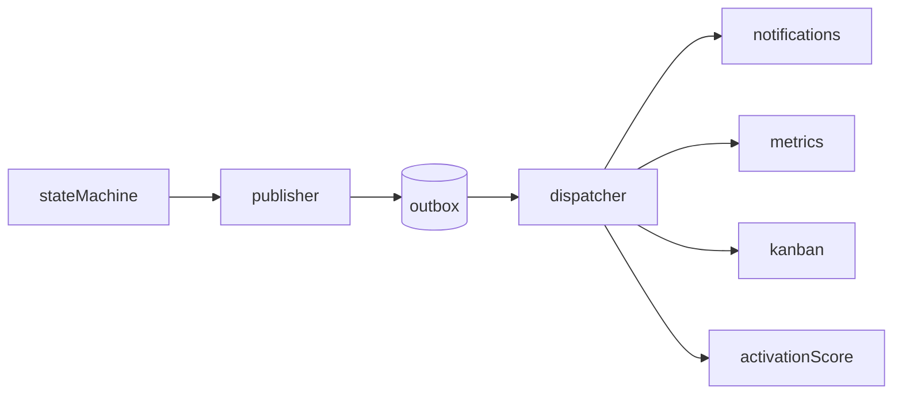
```mermaid
flowchart LR
  SM[stateMachine] --> PUB[publisher]
  PUB --> OUT[(outbox)]
  OUT --> DISP[dispatcher]
  DISP --> N[notifications]
  DISP --> M[metrics]
  DISP --> K[kanban]
  DISP --> S[activationScore]
```

---

## 22. Activation Score / Health Score

### 22.1 Limitação do modelo booleano

`onboarding_completed = true` (hoje setado cedo no trial) não distingue tenant “vivo” vs “fantasma”.

### 22.2 `activation_score` (0–100)

| Milestone | Pontos | Detecção |
|-----------|--------|----------|
| Conta provisionada (tenant + admin) | +10 | tenant exists |
| Dados empresa completos | +10 | CPF, billing_email preenchidos |
| Primeiro usuário extra (ou explícito solo) | +10 | users count ou flag |
| WhatsApp conectado | +40 | instância status connected |
| Primeira automação (tag/modelo/resposta) | +20 | config mínima |
| Primeiro atendimento (mensagem in/out) | +50 | chat_messages ou conversation |

**Cap:** 100 (normalizar se soma > 100: usar fórmula ponderada abaixo).

**Fórmula recomendada (ponderada, não soma linear):**

```text
score = min(100,
  10 * I(tenant_ok) +
  40 * I(whatsapp_ok) +
  25 * I(first_chat_ok) +
  15 * I(automation_ok) +
  10 * I(company_ok)
)
```

### 22.3 Health score (churn / conversão)

> **Especificação canônica (contínuo):** §48 — esta subseção mantém visão v2; implementação de `health_score`, snapshots e automações por risco seguem §48.

Derivado do activation_score + sinais comerciais:

| Sinal | Ajuste |
|-------|--------|
| Trial D-3 sem WhatsApp | −20 health |
| Trial expirado sem pagamento | health = 0, prioridade recovery |
| Pagamento confirmado | health ≥ 70 baseline |
| Inadimplência | −30 |

**Persistência:**

- `tenants.activation_score` INT (cache atual)
- `tenants.health_score` INT (opcional)
- `activation_score_snapshots` (tenant_id, score, health, milestones jsonb, recorded_at) — histórico diário ou por evento

### 22.4 Uso operacional

| Uso | Ação |
|-----|------|
| Priorizar suporte | Ordenar fila CS por score ascendente |
| Automação | Se score < 40 e trial D+2 → WhatsApp nudge |
| Prever conversão | trial→pago correlacionado com score D+7 |
| Funil | Coluna kanban “Ativação baixa” automática |

---

## 23. Kanban operacional vivo

### 23.1 Princípio

O kanban é **fonte de verdade operacional** espelhando `signup_sessions.status`, com capacidade de automação, SLA e tarefas — não apenas UI.

### 23.2 Colunas e regras

| Coluna | Estado SM | Automações entrada | SLA sugerido |
|--------|-----------|-------------------|--------------|
| Novo lead | `pre_signup`, `plan_selected` | Boas-vindas opcional | — |
| Checkout iniciado | `checkout_started` | — | — |
| Abandonado | `checkout_abandoned`, `recovery_pending` | Sequência recovery (§6) | 1h primeira msg |
| Trial enviado | `trial_offered`, `recovery_sent` | Template trial | 24h follow-up |
| Trial ativado | `trial_activated` | Onboarding nudge | Trial D+1 WhatsApp |
| WhatsApp conectado | milestone (score) | Parabéns + dica automação | — |
| Primeiro atendimento | milestone | CS alert se trial D+5 sem | — |
| Convertido | `converted` | `platform.plan.activated` | — |
| Perdido / Expirado | `expired`, `cancelled` | Pesquisa opcional | — |

### 23.3 Entidade operacional

**Tabela proposta:** `signup_pipeline_cards`

| Coluna | Uso |
|--------|-----|
| `signup_session_id` | FK UNIQUE |
| `column_key` | enum coluna |
| `sla_due_at` | timestamptz |
| `sla_breached_at` | nullable |
| `assigned_cs_user_id` | nullable |
| `last_automation_at` | nullable |
| `metadata` | jsonb (IA futura, notas) |

Transição de coluna **só** via subscriber do domain bus (consistência com SM).

### 23.4 Automações por coluna

| Trigger | Ação |
|---------|------|
| Entra `Abandonado` + 1h | `recovery_idempotency_key` checkout_reminder |
| Entra `Trial enviado` + 24h sem clique | Lembrete trial |
| SLA breach | Notificação superadmin + tag urgente |
| Score < 30 em trial D+3 | Tarefa CS automática |

### 23.5 IA futura (extensão)

- Payload em `metadata`: resumo conversa WhatsApp, probabilidade conversão (modelo offline).
- Não bloquear Fase 1–6; preparar hooks no event bus.

---

## 24. Magic link security

### 24.1 Tokens (`activation_tokens`)

| Campo | Política |
|-------|----------|
| Geração | 32+ bytes aleatórios (URL-safe); persistir só `token_hash` (SHA-256) |
| Expiração | `trial_activate`: 48h; `resume_checkout`: 24h; `set_password`: 2h |
| Uso | **Single-use** — `used_at` setado no primeiro redeem válido |
| Revogação | `revoked_at` + motivo; invalida imediatamente |

### 24.2 Validação no redeem

| Check | Falha |
|-------|-------|
| Hash match | 404 genérico (não vazar existência) |
| `expires_at > now()` | 410 `TOKEN_EXPIRED` |
| `used_at IS NULL` | 410 `TOKEN_USED` |
| `revoked_at IS NULL` | 403 `TOKEN_REVOKED` |
| Sessão SM permite `TRIAL_ACTIVATED` | 409 |
| abuse score | 403 |
| Rate limit IP | 429 (5 tentativas / 15 min) |

### 24.3 Fingerprint e IP (opcional)

- Armazenar `issued_ip`, `redeem_ip`, `user_agent_hash` em `activation_token_audit`.
- Se `redeem_ip` país divergente radical do `issued` → exigir login manual (flag configurável).

### 24.4 Login automático pós-redeem

- Emitir JWT curto (ex.: 15 min) + refresh padrão após `TrialActivationService` concluir.
- JWT claim: `activation_redeem: true` para forçar troca de senha no primeiro acesso (opcional).
- Não incluir `tenant_id` de outro usuário — validar `resolveIdentity` de novo no redeem.

### 24.5 Auditoria

`activation_token_audit`: token_id, action (issued|redeem|revoke|fail), ip, ua, created_at.

---

## 25. Métricas SaaS (analytics expandido)

### 25.1 Funil de aquisição

| Métrica | Definição |
|---------|-----------|
| Abandono checkout | `checkout_abandoned / checkout_started` |
| Recovery rate | `trial_activated (via recovery) / checkout_abandoned` |
| Trial offer rate | `trial_offered / checkout_abandoned` |
| Trial activation rate | `trial_activated / trial_offered` |
| Trial → pago | `converted within 30d of trial_activated / trial_activated` |
| Tempo até ativação | mediana `trial_activated_at - pre_signup_at` |
| Tempo até WhatsApp | mediana `whatsapp_connected_at - tenant.created_at` |
| Tempo até 1º atendimento | mediana `first_chat_at - tenant.created_at` |

### 25.2 Onboarding

| Métrica | Definição |
|---------|-----------|
| Abandono onboarding | sessões `onboarding_in_progress` sem evento 7d |
| Onboarding completion rate | `onboarding_completed / trial_activated ∪ converted` |
| Activation score médio | avg(score) por cohort semana |
| Score P50 / P90 por plano | distribuição |

### 25.3 Atribuição

| Dimensão | Fonte |
|----------|-------|
| Origem / campanha | `signup_sessions.marketing_attribution` (antes do tenant) |
| Conversão por origem | join `converted` + attribution |
| Conversão por campanha | utm_campaign |

### 25.4 Cohorts e armazenamento

- `trial_conversion_metrics` (diário) — §9.
- `saas_funnel_cohorts` (semanal): week, plan_id, pre_signups, activated, converted, avg_score.
- Dashboard superadmin + export CSV.

### 25.5 Integração produto

- Meta Pixel / server-side: mapear eventos §21 para pixels existentes (`SuperAdminTrackingSettings`).
- Não duplicar pageview; usar `signup.pre_created` como Lead equivalente.

---

## 26. Observabilidade e auditoria operacional

### 26.1 Logs estruturados (prefixos)

| Prefixo | Domínio |
|---------|---------|
| `[ACQUISITION_IDENTITY]` | resolveIdentity |
| `[ACQUISITION_SM]` | state transitions |
| `[ACQUISITION_IDEM]` | idempotency hit/miss |
| `[ACQUISITION_ABUSE]` | trial abuse decisions |
| `[DOMAIN_EVENT]` | outbox publish/deliver |
| `[ACTIVATION_SCORE]` | recalc |
| `[MAGIC_LINK]` | issue/redeem (sem token em claro) |

### 26.2 Tracing (recomendado)

- Propagar `signup_session_id`, `idempotency_key`, `correlation_id` (UUID por request) em todos os serviços acquisition.

### 26.3 Alertas operacionais

| Alerta | Condição |
|--------|----------|
| Outbox backlog | pending > 500 por 15 min |
| Dead events | qualquer `dead` em 1h |
| SLA breach spike | kanban `sla_breached` > N/hora |
| Abuse spike | blocks > baseline |
| Magic link abuse | rate limit 429 > threshold |

### 26.4 Auditoria LGPD

- Retenção `signup_sessions`: 24 meses ou `expires_at`.
- Export / delete sob demanda: anonimizar e-mail/telefone, manter métricas agregadas.

---

# Parte E — Plataforma SaaS (v3)

Camadas de **lifecycle**, **onboarding engine**, **orquestração**, **analytics de produto**, **compensação** e **visão de longo prazo**. Complementam Parte C (aquisição pré-tenant) e Parte B (TO-BE núcleo).

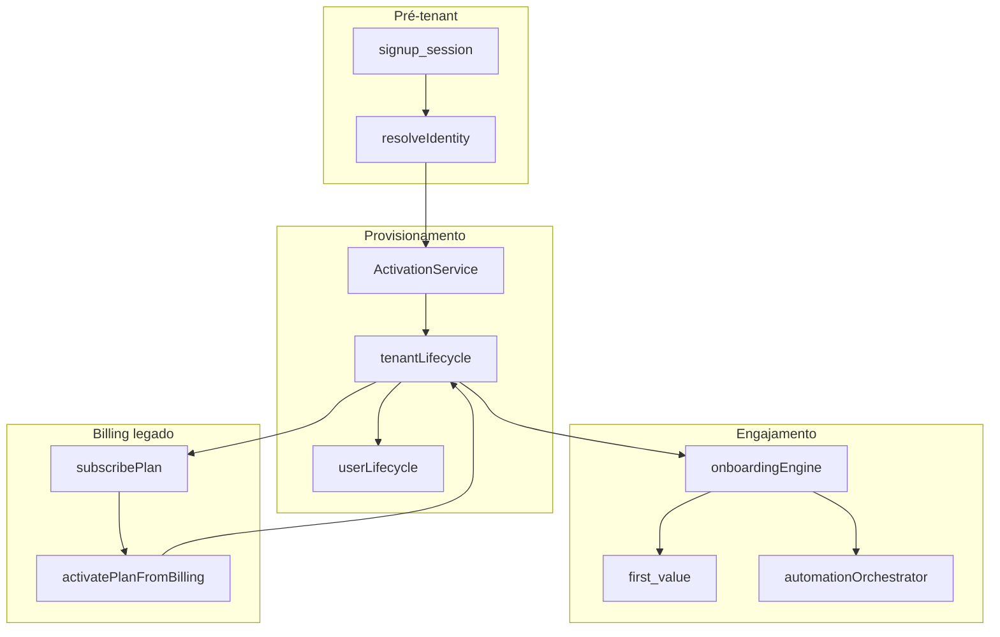
```mermaid
flowchart TB
  subgraph pre [Pré-tenant]
    SS[signup_session]
    IR[resolveIdentity]
  end
  subgraph prov [Provisionamento]
    TLC[tenantLifecycle]
    ULC[userLifecycle]
    ACT[ActivationService]
  end
  subgraph engage [Engajamento]
    ONB[onboardingEngine]
    FV[first_value]
    ORCH[automationOrchestrator]
  end
  subgraph bill [Billing legado]
    SUB[subscribePlan]
    AP[activatePlanFromBilling]
  end
  SS --> IR --> ACT
  ACT --> TLC --> ULC
  TLC --> ONB
  ONB --> FV
  ONB --> ORCH
  TLC --> SUB
  SUB --> AP
  AP --> TLC
```

---

## 28. Tenant Lifecycle Architecture

### 28.1 Problema

Hoje `tenants.status` é finito (`trial` | `payment_pending` | `active` | `suspended`) e o registro nasce **cedo** no checkout. Não há estados para “conta existe mas não ativou trial”, “em onboarding”, “inativa pós-uso” ou arquivamento.

### 28.2 Serviço: `tenantLifecycleService.ts`

**Localização proposta:** `packages/backend/src/services/platform/tenantLifecycleService.ts`

**Responsabilidades:**

| Método (conceitual) | Função |
|---------------------|--------|
| `getState(tenantId)` | Estado atual + metadados (`suspension_reason`, `trial_ends_at`, onboarding) |
| `dispatch(tenantId, event, idempotencyKey)` | Única porta de transição de status |
| `canAccessFeature(tenantId, feature)` | Combina lifecycle + `featureFlagService` + billing |
| `scheduleSuspension` / `reactivate` | Jobs e CS manual |

**Toda mutação de `tenants.status` fora de migrações legadas deve passar por este serviço** (alinha §19 idempotência).

### 28.3 Estados alvo

| Estado | Significado | Mapeamento legado (migração) |
|--------|-------------|----------------------------|
| `draft` | Tenant técnico criado (opcional Fase 8) ou reservado; **sem** acesso CRM | Novo — ou ausente até ativação |
| `trial_pending` | Compromisso trial; token emitido; aguardando redeem | — |
| `trial_active` | Trial vigente; `trial_ends_at` futuro | `trial` |
| `onboarding` | Conta utilizável; onboarding engine incompleto | `active` + `onboarding_progress` incompleto |
| `active` | Plano pago ou trial convertido; período válido | `active` |
| `inactive` | Acesso limitado (ex.: pós-trial sem pagamento, só leitura) | trial expirado sem suspend formal |
| `suspended` | Bloqueio operacional / inadimplência / abuse | `suspended` |
| `cancelled` | Encerramento comercial; dados retidos período legal | Novo |
| `archived` | Sem acesso; dados anonimizados ou cold storage | Novo |

**`payment_pending` (legado):** durante migração, mapear para `trial_pending` ou `draft` + flag `awaiting_payment`; não manter para sempre — ver §10.

### 28.4 Máquina de estados (tenant)

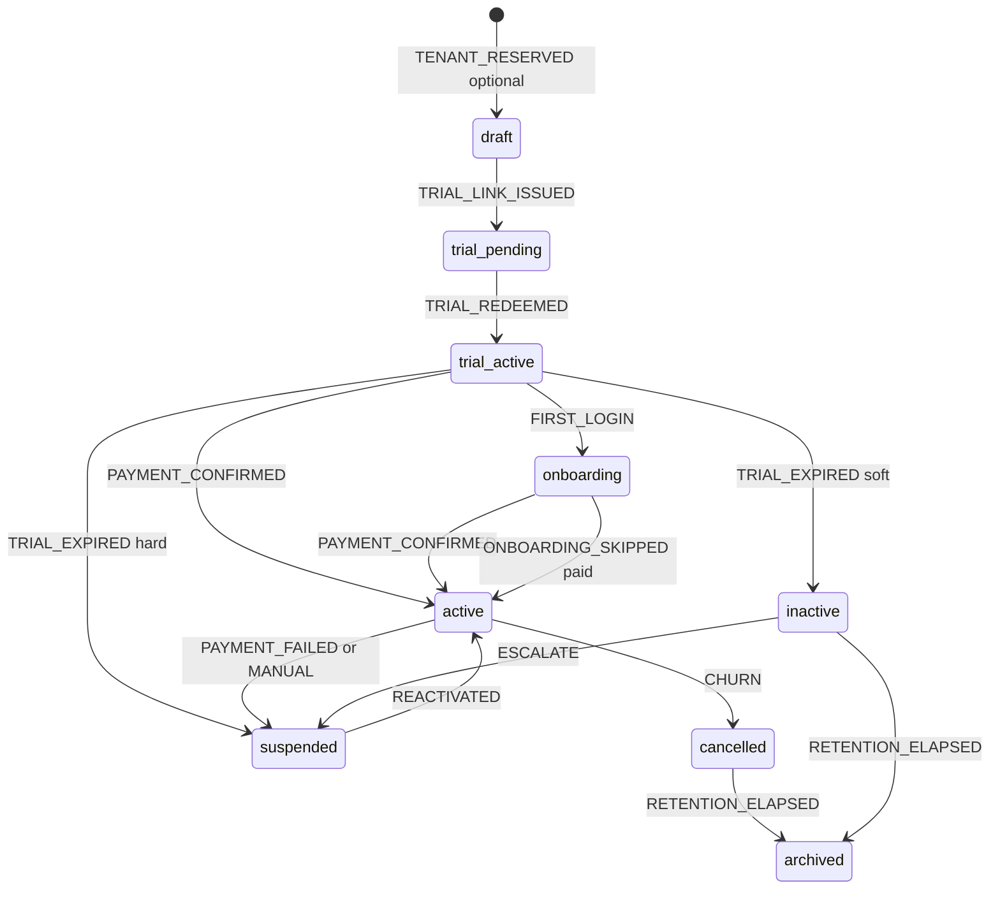
```mermaid
stateDiagram-v2
  [*] --> draft: TENANT_RESERVED optional
  draft --> trial_pending: TRIAL_LINK_ISSUED
  trial_pending --> trial_active: TRIAL_REDEEMED
  trial_active --> onboarding: FIRST_LOGIN
  trial_active --> active: PAYMENT_CONFIRMED
  trial_active --> inactive: TRIAL_EXPIRED soft
  trial_active --> suspended: TRIAL_EXPIRED hard
  onboarding --> active: PAYMENT_CONFIRMED
  onboarding --> active: ONBOARDING_SKIPPED paid
  active --> suspended: PAYMENT_FAILED or MANUAL
  active --> cancelled: CHURN
  inactive --> suspended: ESCALATE
  suspended --> active: REACTIVATED
  cancelled --> archived: RETENTION_ELAPSED
  inactive --> archived: RETENTION_ELAPSED
```

### 28.5 Interações obrigatórias

| Domínio | Regra |
|---------|------|
| **Billing** | `active` exige `activated_billing_id` ou assinatura SaaS válida; transições para `active` só via `activatePlanFromBilling` ou equivalente idempotente |
| **Onboarding** | `onboarding` até `onboardingEngine.isComplete()` ou score ≥ limiar (§30) |
| **Automações** | Subscribers reagem a `tenant.lifecycle.*` (§21) |
| **Permissões** | `tenantAuth` + lifecycle: `suspended`/`cancelled`/`archived` → 403 padronizado |
| **Suspensão automática** | `expireTrialsPastDue` → `suspended` + `trial_expired`; inadimplência → `suspended` + `payment_overdue` |
| **Retenção** | `cancelled` → `archived` após N meses (job) |
| **Reativação** | CS ou self-service checkout → `dispatch(REACTIVATED)` com nova sessão §18 |

### 28.6 Tabela de transições

**`tenant_lifecycle_transitions`** (append-only, espelho §18): `tenant_id`, `from`, `to`, `event`, `actor`, `idempotency_key`, `created_at`.

### 28.7 Migração SQL (futura)

- Expandir `CHECK` em `tenants.status` ou coluna nova `lifecycle_status` com view de compatibilidade.
- Fase 1: dual-write (`status` legado + `lifecycle_status`).
- Fase 2: ler só `lifecycle_status`; deprecar `status` antigo.

---

## 29. User Lifecycle

### 29.1 Problema

O admin nasce no mesmo instante do tenant (`createTenantAdminUser`), muitas vezes com senha placeholder. Convites de equipe usam outro fluxo. Não há estados para “convidado”, “aguardando magic link” ou `owner` explícito.

### 29.2 Serviço: `userLifecycleService.ts`

**Localização:** `packages/backend/src/services/platform/userLifecycleService.ts`

### 29.3 Estados

| Estado | Descrição |
|--------|-----------|
| `invited` | Convite enviado; sem login |
| `pending_activation` | Criado; aguarda magic link ou definir senha |
| `active` | Login normal |
| `suspended` | Usuário bloqueado no tenant |
| `owner` | Papel — não exclusivo de status; flag `is_tenant_owner` |
| `converted_from_trial` | Metadado: primeiro user pós trial redeem |

**Relação owner:** um `owner_user_id` em `tenants` (ou role `tenant_owner` existente) — transição `ASSIGN_OWNER` / `TRANSFER_OWNER` com auditoria.

### 29.4 Fluxos

| Fluxo | Sequência user |
|-------|----------------|
| Trial magic link | `pending_activation` → `active` + `converted_from_trial` |
| Checkout com senha | `active` direto |
| Convite equipe | `invited` → `pending_activation` → `active` |
| Onboarding admin | `pending_activation` até senha + perfil (§30) |

### 29.5 Magic link e recuperação

- Redeem token (§24) → `userLifecycleService.activateFromToken`.
- Esqueci senha — fluxo atual WhatsApp; unificar auditoria em `user_access_audit`.
- **Owner transfer:** exige `owner` + 2FA futuro ou confirmação CS; evento `tenant.owner_transferred`.

### 29.6 Multi-user onboarding

- Onboarding engine (§30): passos “usuários” aplicam-se ao **tenant**, não só ao owner.
- Convidados podem pular passos já completos no tenant (checkpoints globais).

---

## 30. Centralized Onboarding Engine

### 30.1 Problema

Hoje: `Onboarding.tsx` (legado), `DashboardActivationBlock`, flags em controllers — lógica espalhada (§5, §22).

### 30.2 Estrutura `onboardingEngine/`

```text
packages/backend/src/services/onboarding/
  onboardingEngine/
    engine.ts              # orquestra passos
    stepRegistry.ts        # definição estática + feature flags
    progressRepository.ts  # onboarding_progress
    stepStateMachine.ts     # por passo
    slaScheduler.ts
    reminderSubscriber.ts
    recoverySubscriber.ts  # §32
  types.ts
```

### 30.3 Modelo de passo

Cada passo (`company`, `users`, `whatsapp`, `automation`, `first_chat`):

| Atributo | Uso |
|----------|-----|
| `step_id` | string estável |
| `state` | `locked` \| `available` \| `in_progress` \| `completed` \| `skipped` |
| `required` | boolean — bloqueio hard vs soft |
| `sla_hours` | desde `available_at` |
| `weight` | contribuição ao activation_score (§22) |
| `automations` | lista de `automation_job_id` ao entrar/atrasar |
| `metrics_key` | product analytics (§34) |

### 30.4 API conceitual

| Operação | Descrição |
|----------|-----------|
| `initialize(tenantId)` | Cria progresso idempotente (§19) |
| `getProgress(tenantId)` | UI `/welcome` + dashboard |
| `completeStep(tenantId, stepId, evidence?)` | Valida evidência (ex.: instância WA connected) |
| `evaluateBlockers(tenantId)` | O que impede “conta pronta” |
| `dispatchReminder(tenantId, stepId)` | Via orchestrator (§36) |

### 30.5 Bloqueios

| Nível | Comportamento |
|-------|----------------|
| Soft | Banner + activation_score baixo |
| Hard | Bloqueia módulo (ex.: chat sem WhatsApp) — alinhado a regras atuais de produto |
| CS override | `onboarding_override` em metadata tenant (auditado) |

### 30.6 Relação com tenant lifecycle

- Entrada em `onboarding` (tenant LC) quando `trial_active` + primeiro login ou pós-pagamento.
- Saída: `onboardingEngine.isComplete()` → transição tenant para `active` (se já pago) ou permanece `trial_active` com onboarding done.

### 30.7 Unificação com dashboard

- `GET /api/dashboard/activation-checklist` passa a ser **facade** de `onboardingEngine.getProgress()` (compat API).

---

## 31. First Value Detection (FIRST_VALUE_EVENT)

### 31.1 Conceito

**First value** = momento em que o cliente percebe benefício tangível — distinto de “conta criada” ou “WhatsApp conectado” isoladamente.

### 31.2 Catálogo de eventos (v1)

| `first_value_type` | Detecção (fonte) | Peso score |
|--------------------|------------------|------------|
| `whatsapp_connected` | instância status connected | 40 |
| `first_chat_received` | inbound message em conversation tenant | 50 |
| `first_chat_replied` | outbound após inbound | 45 |
| `first_automation_used` | tag/quick reply/scheduled msg criada | 20 |
| `first_ticket_created` | tickets INSERT | 25 |
| `first_attendance_closed` | conversa closed + SLA ok | 35 |
| `first_invoice_generated` | customer_invoices | 30 |

### 31.3 Storage

**Tabela:** `tenant_first_value_events`

| Coluna | Tipo |
|--------|------|
| `tenant_id` | uuid |
| `first_value_type` | text |
| `occurred_at` | timestamptz |
| `entity_type` / `entity_id` | evidência |
| `idempotency_key` | UNIQUE `(tenant_id, first_value_type)` |

**Agregado:** `tenants.first_value_at` (primeiro evento de maior peso), `tenants.primary_first_value_type`.

### 31.4 Impacto no activation_score

- Recalcular score (§22) com bônus +25 na primeira ocorrência de qualquer `first_value_*`.
- **Time to first value (TTFV):** `first_value_at - tenant.provisioned_at` — métrica §34.

### 31.5 Triggers automáticos

Subscriber em domain bus: ao detectar evidência bruta (`message.created`, `instance.connected`) → `firstValueService.tryRecord()` → se primeiro, publicar `first_value.achieved` → orchestrator (§36) pode enviar parabéns WhatsApp interno (opcional).

---

## 32. Onboarding Recovery Automation

### 32.1 Escopo

Além de **checkout abandonado** (§6, §37), recuperar **onboarding parado** após trial/tenant ativo.

### 32.2 Detecção de inatividade

| Sinal | Regra |
|-------|-------|
| Onboarding incompleto | `onboarding_progress` sem `completed_at` |
| Passo crítico pendente | ex.: `whatsapp` não completed |
| Inatividade | `last_onboarding_activity_at` &lt; now() - 24h |
| Trial clock | trial D+2, D+5 sem first value |

**Job:** `onboardingInactivityScanner` (cron 1h) → emite `onboarding.stalled` no event bus.

### 32.3 Fluxos de recovery (escalonamento)

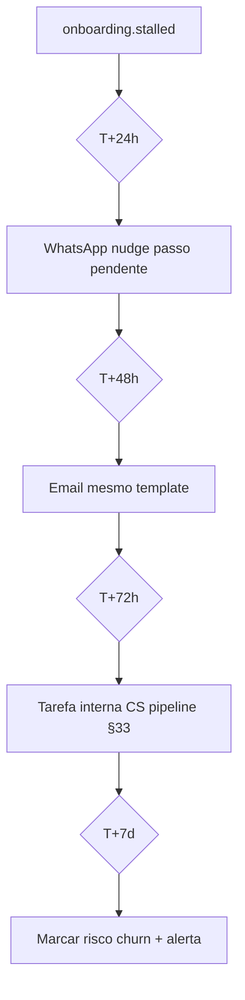
```mermaid
flowchart TD
  A[onboarding.stalled] --> B{T+24h}
  B --> C[WhatsApp nudge passo pendente]
  C --> D{T+48h}
  D --> E[Email mesmo template]
  E --> F{T+72h}
  F --> G[Tarefa interna CS pipeline §33]
  G --> H{T+7d}
  H --> I[Marcar risco churn + alerta]
```

### 32.4 Tabela

**`onboarding_recovery_logs`** — espelho `recovery_automation_logs` (§6) com `tenant_id`, `step_id`, `channel`, `idempotency_key`.

### 32.5 Integração

- Tudo via **automationOrchestrator** (§36), não cron solto chamando WhatsApp.
- Respeitar rate limits §41 e opt-out.

---

## 33. Internal Sales / Success Pipeline

### 33.1 Visão

Funil **externo** (`signup_sessions` §23) + funil **interno** do time PainelCRM (CS/Sales).

### 33.2 Colunas internas

| Coluna | Critério | Owner default |
|--------|----------|---------------|
| Lead novo | `pre_signup` sem contato | Pool SDR |
| Aguardando contato | atribuído; sem interação 4h | SDR |
| Trial ativo | `trial_active` + score &lt; 40 | CS |
| Onboarding parado | `onboarding.stalled` | CS |
| Risco de churn | trial D-2 sem FV ou score &lt; 20 | CS senior |
| Convertido | `active` + billing | AM opcional |
| Upsell possível | `active` + limite plano próximo | AM |
| Perdido | `expired` / `cancelled` | — |

### 33.3 Entidade

**`cs_pipeline_cards`** (ou extensão `signup_pipeline_cards` com `lane: commercial|cs`):

- `entity_type`: `signup_session` | `tenant`
- `entity_id`
- `column_key`
- `owner_user_id` (superadmin / platform user)
- `sla_due_at`, `sla_breached_at`
- `priority_score` (derivado activation_score + MRR potencial)

### 33.4 Automações internas

| Trigger | Tarefa |
|---------|--------|
| SLA breach | Notificação Slack/e-mail interno (futuro) |
| Trial ativo + 48h sem WA | Tarefa “ligar cliente” |
| Convertido | Tarefa “boas-vindas AM” opcional |

### 33.5 Relação com §23

- §23 = visão do funil **comercial** (cliente).
- §33 = **ownership humano** e escalonamento — mesma fonte de eventos, UI separada ou abas no superadmin.

---

## 34. Product Analytics Layer

### 34.1 Serviço: `productAnalyticsService.ts`

**Localização:** `packages/backend/src/services/analytics/productAnalyticsService.ts`

**Não substituir** `trial_conversion_metrics` (funil aquisição) — camada **pós-provisionamento** e **feature usage**.

### 34.2 Eventos (catálogo v1)

| Event | Quando |
|-------|--------|
| `signup_started` | `signup.pre_created` |
| `signup_completed` | tenant provisioned |
| `onboarding_step_completed` | cada passo §30 |
| `first_whatsapp_connected` | first value |
| `first_ticket_created` | first value |
| `first_chat_received` | first value |
| `first_invoice_generated` | first value |
| `plan_upgraded` | billing |
| `session_login` | auth (amostragem) |

### 34.3 Storage

**Opção A (recomendada):** `product_analytics_events` append-only (tenant_id nullable para pré-tenant).

| Coluna | Uso |
|--------|-----|
| `event_name` | text |
| `tenant_id` | uuid nullable |
| `user_id` | uuid nullable |
| `signup_session_id` | uuid nullable |
| `properties` | jsonb |
| `occurred_at` | timestamptz |

**Opção B:** dual-write para ferramenta externa (PostHog/Amplitude) via worker — planejar hook em §38.

### 34.4 Objetivos

| Uso | Métrica |
|-----|---------|
| Activation analytics | TTFV, % passo WA em D+1 |
| Adoption | MAU por feature |
| Churn prediction | features §38 |
| Roadmap | ranking `feature_adoption` §35 |

### 34.5 Privacidade

- Sem PII em `properties` (só ids hash).
- Retenção raw 90 dias; agregados indefinidos.

---

## 35. Feature Adoption Tracking

### 35.1 `featureAdoptionService.ts`

Rastreia **uso sustentado** por módulo (não só primeiro evento).

| Feature key | Sinal de adoção |
|-------------|-----------------|
| `whatsapp` | connected ≥7 dias |
| `chat` | ≥10 mensagens/semana |
| `tickets` | ≥1 ticket/semana |
| `crm_clients` | ≥5 clientes ativos |
| `kanban_chat` | ≥1 movimento kanban |
| `automations` | ≥1 regra disparada |
| `billing_invoices` | ≥1 fatura/mês |
| `agenda` | ≥1 compromisso |
| `ai` | reservado |

### 35.2 Feature adoption score (0–100)

```text
adoption_score = weighted_avg(features_adopted) * recency_factor
```

- Persistir em `tenant_feature_adoption` (tenant_id, feature_key, first_used_at, last_used_at, weekly_count).
- Rollup semanal em `tenant_adoption_snapshots`.

### 35.3 Retenção

Correlacionar `adoption_score` com conversão trial→pago e churn — alimentar §33 coluna “risco” e §38.

---

## 36. Automation Orchestration Layer

### 36.1 Problema

Automações hoje: cron solto, `setImmediate`, notification engine, jobs billing — sem fila unificada de **delays/retries**.

### 36.2 `automationOrchestrator/`

```text
packages/backend/src/services/automation/
  automationOrchestrator/
    scheduler.ts       # delayed jobs
    executor.ts
    jobRepository.ts   # automation_jobs
    policies.ts        # retry, backoff, max attempts
  channels/            # §37 adapters
```

### 36.3 Modelo de job

| Campo | Uso |
|-------|-----|
| `job_type` | `recovery_checkout`, `recovery_onboarding`, `onboarding_reminder`, `trial_offer`, `conversion_nudge` |
| `entity_type` / `entity_id` | session ou tenant |
| `run_at` | timestamptz |
| `status` | pending \| running \| done \| failed \| cancelled |
| `idempotency_key` | UNIQUE |
| `payload` | jsonb |
| `attempts` | int |

### 36.4 Capacidades

| Capacidade | Descrição |
|------------|-----------|
| Delays | “enviar em 24h” sem cron frágil |
| Retries | backoff; max 5 |
| Schedules | cron registrado no orchestrator |
| Cancelamento | ex.: usuário converteu → cancel jobs pendentes da sessão |
| Fan-out | um evento → N jobs (WA + email) |

### 36.5 Preparação IA / workflows

- Payload inclui `workflow_version` e `steps[]` para futuros multi-step.
- Jobs idempotentes — replay seguro (§19).

### 36.6 Relação com domain bus

```
domain event → subscriber → orchestrator.schedule(job)
job due → executor → channel adapter → log
```

---

## 37. Multi-Channel Recovery

> **Especificação canônica (canais):** §59–§67 — recovery, onboarding e notificações **devem** chamar `channelProviderGateway`, não motor WhatsApp direto. Esta seção mantém prioridade de negócio; implementação segue Communication Platform.

### 37.1 Princípio

**WhatsApp primeiro**, mas não exclusivo — aumenta conversão e compliance (e-mail auditável).

### 37.2 Prioridade de canais

| Ordem | Canal | Quando |
|-------|-------|--------|
| 1 | WhatsApp (plataforma) | Abandono checkout, trial offer, onboarding nudge |
| 2 | E-mail transacional | Mesmo conteúdo se WA falhou ou sem opt-in WA |
| 3 | Tarefa interna CS | SLA breach §33 |
| 4 | Notificação in-app | Se já existe login (banner) |
| 5 | Push (PWA) | Futuro |
| 6 | Webhook parceiro | Futuro (Zapier/CRM externo) |

### 37.3 Adapter pattern (legado → alvo)

**AS-IS:** canais acoplados ao motor de notificações / UazAPI.

**TO-BE:** adapters **dentro** de `packages/backend/src/services/communication/` (§59), registrados no gateway:

```text
communication/
  channelProviderGateway.ts      # API única sendMessage / sendTemplate
  adapters/
    metaCloudAdapter.ts          # Meta Cloud API (futuro)
    uazapiAdapter.ts             # bridge provider atual
    smtpEmailAdapter.ts
    internalTaskAdapter.ts
    inAppAdapter.ts
```

Recovery e `automationOrchestrator` (§36) chamam apenas o gateway com `message_intent` (§60).

### 37.4 Política por fluxo

| Fluxo | Canais |
|-------|--------|
| Checkout abandonado | WA → +24h email → +48h task |
| Trial offered | WA + email com magic link |
| Onboarding stalled | WA passo específico → email → task |
| Conversão | email confirmação (platform.billing.payment_confirmed) |

### 37.5 Falha de canal

- Se WA falha (`whatsapp_dispatch_failed`), orquestrador agenda email automaticamente (compensação leve §40).

---

## 38. AI-Ready Architecture

### 38.1 Objetivo

Permitir **timeline contextual**, scoring inteligente e recomendações **sem refatorar** o core após lançar IA.

### 38.2 Event stream unificado

Toda entidade relevante publica no **domain bus** (§21) + opcional export:

`signup_sessions`, `tenants`, `users`, `onboarding_progress`, `first_value_events`, `product_analytics_events`, `automation_jobs`.

### 38.3 `context_timelines` (proposta)

| Coluna | Uso |
|--------|-----|
| `entity_type` | signup_session \| tenant |
| `entity_id` | uuid |
| `occurred_at` | timestamptz |
| `kind` | event \| note \| ai_summary |
| `content` | jsonb (texto livre, embeddings futuros) |

### 38.4 Inteligência (fases futuras)

| Capability | Input |
|------------|-------|
| Lead intelligence | sessão + atribuição + interações WA |
| Activation intelligence | onboarding progress + first value |
| Churn prediction | adoption_score + billing + inactivity |
| Recommendation engine | “próximo melhor passo” no onboarding UI |

### 38.5 Contratos estáveis

- Payloads versionados (`schema_version` em jsonb).
- PII nunca em timelines exportadas para LLM — tokenização interna.

---

## 39. Observabilidade completa (trial / onboarding / conversão)

Estende §26 com domínios específicos v3.

### 39.1 Prefixos de log

| Prefixo | Domínio |
|---------|---------|
| `[TRIAL_FLOW]` | trial_pending → trial_active |
| `[ONBOARDING]` | engine steps, blockers |
| `[ACTIVATION]` | first value, scores |
| `[RECOVERY]` | checkout + onboarding recovery |
| `[CONVERSION]` | billing, trial→paid |
| `[TENANT_LC]` | tenant lifecycle transitions |
| `[USER_LC]` | user lifecycle |
| `[ORCH]` | automation jobs |

### 39.2 Métricas (sugestão)

| Métrica | Tipo |
|---------|------|
| `acquisition_sessions_active` | gauge |
| `onboarding_step_completion_rate` | counter por step |
| `ttfv_hours_histogram` | histogram |
| `recovery_jobs_failed` | counter |
| `lifecycle_transition_errors` | counter |
| `orphan_entities_detected` | gauge |

### 39.3 Dashboards

| Dashboard | Público |
|-----------|---------|
| Funil aquisição | Growth |
| Onboarding funnel | CS |
| Trial health | Ops |
| Orchestrator backlog | Eng |

### 39.4 Drop-off analytics

Registrar `failure_reason` / `drop_step` em:

- checkout (front + API code),
- magic link redeem,
- onboarding `evaluateBlockers`.

**Tabela:** `funnel_drop_events` (session_id, tenant_id, step, reason_code, created_at).

### 39.5 Tracing

Span names: `Acquisition.resolveIdentity`, `TenantLC.dispatch`, `OnboardingEngine.completeStep`, `Orchestrator.executeJob`.

---

## 40. Failure & Compensation Strategy

### 40.1 Cenários de falha parcial

| Cenário | Estado inconsistente | Compensação |
|---------|---------------------|-------------|
| Sessão criada; tenant falhou | session sem tenant_id | Retry `ActivationService`; job orphan scanner alerta |
| Tenant criado; user falhou | tenant sem admin | Compensating: `createTenantAdminUser` retry ou rollback tenant → `cancelled` |
| Trial ativado; onboarding init falhou | tenant sem progress | Job `onboardingEngine.initialize` idempotente |
| WA recovery enviado; API falhou | log failed | Retry orchestrator; fallback email §37 |
| Pagamento OK; activate falhou | billing paid, tenant trial | **Crítico** — reconciliação billing (já existe); replay `activatePlanFromBilling` |
| Evento publicado; subscriber falhou | outbox pending | Dispatcher retry; dead-letter §44 |
| Saga passo falhou mid-flight | saga `running` / `failed` | Compensate §45; HITL §52 |

> **Orquestração formal:** compensações multi-passo em **§45**; detecção de órfãos e playbooks leves permanecem aqui.

### 40.2 `compensationService.ts`

| Ação | Descrição |
|------|-----------|
| `detectOrphans()` | Cron: session→tenant, tenant→user, billing→tenant |
| `compensate(compensationId)` | Executa playbook pré-definido |
| `quarantine(entity)` | Impede automações até CS |

### 40.3 Rollback vs compensação

| Operação | Rollback (evitar) | Compensação (preferir) |
|----------|-------------------|------------------------|
| Tenant criado errado | DELETE | `cancelled` + anonimizar |
| Duplo trial | — | Bloquear segundo + merge sessão |
| Mensagem duplicada | — | Idempotency §19 |

### 40.4 Playbooks (runbook)

Documentar em `docs/architecture/runbooks/ACQUISITION_FAILURES.md` (futuro) — referência neste plano.

---

## 41. Security & Rate Limits

Consolida §20, §24 e expande superfícies públicas.

### 41.1 Endpoints sensíveis

| Rota (proposta) | Risco |
|-----------------|-------|
| `POST /api/public/pre-signup` | spam leads |
| `POST /api/public/trial-activate` | brute force token |
| `GET /api/public/resume-checkout` | enumeração |
| Magic link redeem | brute force |
| Recovery webhooks inbound | spoof |

### 41.2 Rate limits (proposta)

| Chave | Limite |
|-------|--------|
| Por IP | 30 req/h pre-signup; 10/h magic redeem |
| Por telefone | 3 trials / 180 dias (já trial guard) |
| Por e-mail | 5 sessões ativas / dia |
| Global | circuit breaker se spike &gt; 10x baseline |

**Implementação:** middleware `acquisitionRateLimit` + Redis ou PG sliding window.

### 41.3 CAPTCHA / Turnstile

- Flag `ACQUISITION_CAPTCHA_V1` em pre-signup e trial activate após abuse spike.

### 41.4 Anti-automação

- Honeypot field no form.
- Tempo mínimo entre render e submit.
- Correlacionar com `trialAbuseProtection` score (§20).

### 41.5 Auditoria de segurança

- `security_audit_log`: ip, route, identity_hash, action, blocked_reason.

---

## 42. Implementation Safety Plan (rollout operacional)

### 42.1 Ambientes

| Ambiente | Uso |
|----------|-----|
| Local / CI | SM + identity unit tests |
| Staging | flags on; shadow writes |
| Beta | 5–10 tenants reais voluntários |
| Produção | rollout % com flags |

### 42.2 Shadow mode (Fase 1–2)

- `resolveIdentity` roda em paralelo **sem** alterar resposta.
- Eventos publicados em `domain_event_outbox` com `shadow: true` — subscribers desligados.
- Comparar métricas shadow vs legado por 2 semanas.

### 42.3 Ativação gradual

| Estágio | Flags | Audiência |
|---------|-------|-----------|
| 0 | all off | 100% legado |
| 1 | infra shadow | 0% UX |
| 2 | `SIGNUP_SESSION_V1` | 10% tráfego landing |
| 3 | + recovery | 10% |
| 4 | + trial activation | planos piloto |
| 5 | + onboarding engine | beta tenants |
| 6 | 100% | desligar legado |

### 42.4 Rollback imediato

1. Kill switch env `ACQUISITION_MASTER_OFF=true` → todas rotas públicas novas 503 → fallback checkout legado.
2. Desligar orchestrator worker.
3. Flags off por camada (ordem inversa §27).
4. **Não** reverter migrações SQL destrutivas sem playbook.

### 42.5 Métricas pós-deploy (gate)

| Gate | Critério go/no-go |
|------|------------------|
| Erro 5xx | &lt; 0.1% em novas rotas |
| Duplicata tenant | 0 em 7 dias |
| Outbox lag | p95 &lt; 2 min |
| TTFV | não piorar vs baseline |

### 42.6 Migração tenants antigos

- Tenants legados permanecem em status antigo até job de **lifecycle backfill**.
- Backfill: `trial` → `trial_active`; `payment_pending` órfão → `suspended` ou campanha retomada.
- Não forçar onboarding engine retroativo em contas &gt; 90 dias (só novos).

---

## 43. Long-Term SaaS Vision

### 43.1 Direção estratégica (3–5 anos)

Arquitetura atual (v3) prepara o PainelCRM como **plataforma multi-produto**, não só um CRM monolítico com checkout.

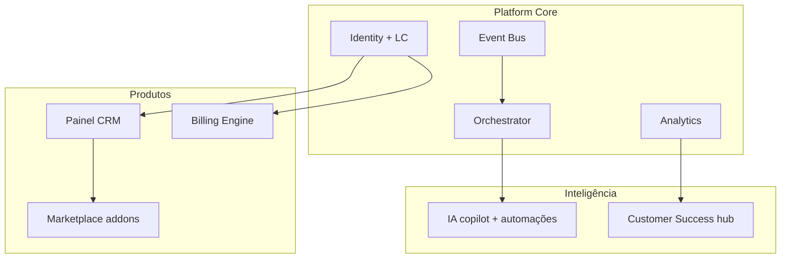
```mermaid
flowchart TB
  subgraph platform [Platform Core]
    ID[Identity + LC]
    BUS[Event Bus]
    ORCH[Orchestrator]
    ANAL[Analytics]
  end
  subgraph products [Produtos]
    CRM[Painel CRM]
    BILL[Billing Engine]
    MKT[Marketplace addons]
  end
  subgraph intel [Inteligência]
    AI[IA copilot + automações]
    CS[Customer Success hub]
  end
  ID --> CRM
  ID --> BILL
  BUS --> ORCH
  ORCH --> AI
  ANAL --> CS
  CRM --> MKT
```

### 43.2 Capacidades futuras habilitadas

| Capacidade | Fundação v3 |
|------------|-------------|
| Múltiplos produtos / planos addon | tenant LC + feature adoption |
| Onboarding inteligente (IA) | timelines §38 + onboarding engine |
| Marketplace | domain events + billing metadata |
| Billing avançado (usage-based) | product analytics + subscriptions |
| Workflows visuais | automation orchestrator jobs |
| Customer Success 360 | CS pipeline §33 + scores |
| Analytics SaaS B2B | product analytics + cohorts |

### 43.3 Anti-padrões a evitar

- Novos fluxos de cadastro **sem** `resolveIdentity`.
- Status de tenant em controllers.
- Automação WhatsApp direta sem orchestrator/idempotency.
- Onboarding só em front sem `onboardingEngine`.
- Métricas só em GA sem `product_analytics_events` server-side.

### 43.4 Princípio de evolução

**Additivo, não substitutivo:** cada fase adiciona camadas; billing (`activatePlanFromBilling`, webhooks) e `tenantAuth` permanecem contratos estáveis.

---

# Parte F — Enterprise (v4)

Endurecimento para **consistência distribuída**, **confiabilidade de eventos**, **provisioning operacional**, **auditoria**, **retenção** e **operação em escala**. Complementa §19 (idempotência), §21/§44 (eventos), §40 (compensação) e §42 (rollout).

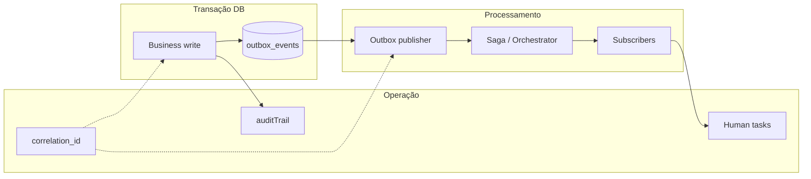
```mermaid
flowchart LR
  subgraph tx [Transação DB]
    BIZ[Business write]
    OUT[(outbox_events)]
  end
  subgraph async [Processamento]
    PUB[Outbox publisher]
    ORCH[Saga / Orchestrator]
    SUB[Subscribers]
  end
  subgraph ops [Operação]
    AUD[auditTrail]
    COR[correlation_id]
    HITL[Human tasks]
  end
  BIZ --> OUT
  OUT --> PUB --> ORCH --> SUB
  BIZ --> AUD
  COR -.-> BIZ
  COR -.-> PUB
  SUB --> HITL
```

---

## 44. Transactional Outbox Pattern (formal)

### 44.1 Problema

Publicar eventos **dentro** da transação de negócio sem outbox, ou via `setImmediate` após request, causa:

| Falha | Consequência |
|-------|----------------|
| Commit falha após publish | WhatsApp enviado, tenant inexistente |
| Worker cai antes de processar | Evento perdido |
| Retry duplicado do worker | Automação em duplicata |
| Subscriber síncrono no request | Latência e acoplamento |

**Regra v4:** nenhum side-effect externo (WhatsApp, e-mail, webhook) no mesmo request handler **após** write sem passar pelo outbox commitado.

### 44.2 Tabela `outbox_events` (canônica)

Unificar com `domain_event_outbox` (§21) — **um** nome em implementação.

| Coluna | Tipo | Notas |
|--------|------|-------|
| `id` | uuid PK | |
| `event_name` | text | ex. `trial.activated` |
| `aggregate_type` | text | `signup_session`, `tenant`, `user` |
| `aggregate_id` | uuid | |
| `payload` | jsonb | `schema_version`, dados sem PII sensível |
| `idempotency_key` | text UNIQUE | `(aggregate_type, aggregate_id, event_name, transition_id)` |
| `correlation_id` | uuid | §54 |
| `status` | enum | `pending`, `processing`, `done`, `dead` |
| `available_at` | timestamptz | delay scheduling |
| `attempts` | int | default 0 |
| `last_error` | text | truncado |
| `created_at` | timestamptz | **momento do COMMIT da transação de origem** |
| `processed_at` | timestamptz | nullable |

**Índices:** `(status, available_at) WHERE status IN ('pending','processing')`, `(correlation_id)`, `(aggregate_type, aggregate_id)`.

### 44.3 Fluxo transacional

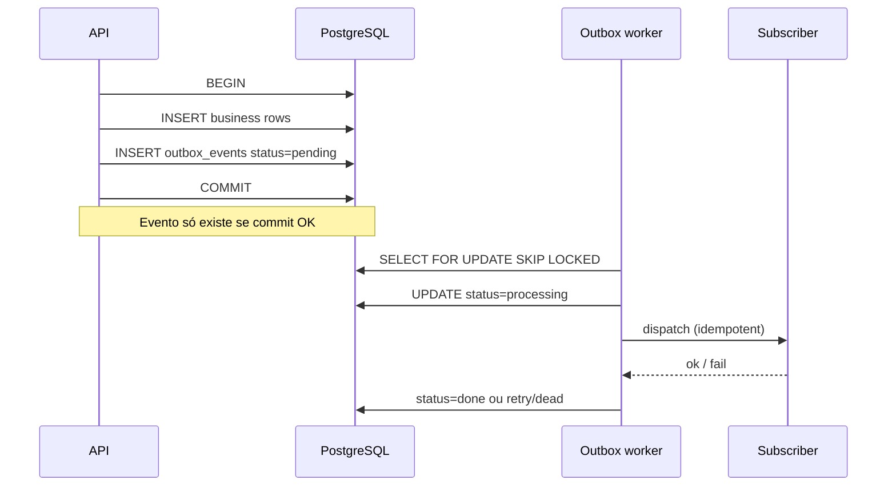
```mermaid
sequenceDiagram
  participant API
  participant DB as PostgreSQL
  participant W as Outbox worker
  participant S as Subscriber

  API->>DB: BEGIN
  API->>DB: INSERT business rows
  API->>DB: INSERT outbox_events status=pending
  API->>DB: COMMIT
  Note over API,DB: Evento só existe se commit OK
  W->>DB: SELECT FOR UPDATE SKIP LOCKED
  W->>DB: UPDATE status=processing
  W->>S: dispatch (idempotent)
  S-->>W: ok / fail
  W->>DB: status=done ou retry/dead
```

### 44.4 Publisher worker

| Aspecto | Política |
|---------|----------|
| Concorrência | N workers com `SKIP LOCKED` |
| Batch | 50–200 eventos/tick |
| Tick | 1–5 s (configurável) |
| Ordem | FIFO por `created_at` por aggregate (opcional partition key) |
| Exactly-once effect | **Idempotência no subscriber** (§19), não no broker |

**Processo dedicado:** `outboxPublisherWorker.ts` (pode coexistir com `automationOrchestrator` consumindo mesma fila lógica).

### 44.5 Retries e dead-letter

| Tentativa | Backoff |
|-----------|---------|
| 1–3 | 30s, 2m, 10m |
| 4–8 | 1h, 4h |
| &gt;8 | `status=dead` |

**Dead-letter:** fila inspecionável no superadmin; replay manual com novo `idempotency_key` sufixo `:replay:{uuid}`.

### 44.6 Replay

| Modo | Uso |
|------|-----|
| Single event | CS reprocessa um `id` dead |
| Aggregate catch-up | Rebuild projections após bug subscriber |
| Shadow replay | Novo subscriber em staging |

**Salvaguardas:** replay não reexecuta `ActivationService` se `idempotency_key` de ativação já existe.

### 44.7 Cleanup policy

| Status | Retenção |
|--------|----------|
| `done` | 90 dias → tabela arquivo `outbox_events_archive` |
| `dead` | 1 ano (auditoria) |
| `pending` órfão &gt;7d | alerta + auto-requeue |

### 44.8 Relação com §36

- `automation_jobs` = **agendamento** (run_at futuro).
- `outbox_events` = **fatos** commitados.
- Job pode ser **criado por subscriber** do outbox, nunca o contrário no mesmo tick síncrono.

---

## 45. Saga / Orchestration Strategy

### 45.1 Por que saga (não 2PC)

Fluxo distribuído sem transação global:

`signup_session` → `resolveIdentity` → `ActivationService` → `tenant` + `user` → `onboardingEngine.initialize` → `outbox` → WhatsApp → billing webhook.

**Escolha:** **orchestration-based saga** (coordenador explícito) + **compensating transactions** — adequado ao stack monólito Node + PG atual; evita 2PC.

### 45.2 Sagas definidas

| Saga | ID | Passos (happy path) |
|------|-----|-------------------|
| **TrialActivationSaga** | `saga.trial_activation` | identity → tenant LC → user LC → provisioning → onboarding init → outbox trial.activated → schedule recovery |
| **PaidConversionSaga** | `saga.paid_conversion` | webhook ack → tenant activate → subscription → provisioning → onboarding init → outbox converted |
| **CheckoutAbandonRecoverySaga** | `saga.checkout_recovery` | detect abandon → outbox → schedule WA/email jobs |

### 45.3 Tabela `saga_instances`

| Coluna | Uso |
|--------|-----|
| `id` | uuid |
| `saga_type` | text |
| `correlation_id` | uuid |
| `signup_session_id` / `tenant_id` | nullable FKs |
| `state` | `running`, `completed`, `compensating`, `failed` |
| `current_step` | text |
| `context` | jsonb |
| `idempotency_key` | UNIQUE |

**Append-only:** `saga_step_log` (step, status, error, at).

### 45.4 Failure handling

| Falha no passo | Ação |
|----------------|------|
| Retryable (timeout WA) | Retry passo com backoff; saga `running` |
| Non-retryable (duplicate tenant) | Compensate ou mark `failed` + HITL §52 |
| Partial commit | **Impossível** se passo = uma transação PG; passo nunca chama WA direto |

### 45.5 Compensating actions (mapa)

| Passo executado | Compensação |
|-----------------|-------------|
| Tenant criado | `tenantLifecycle.dispatch(CANCELLED)` + quarantine |
| User criado | suspend user / delete se sem billing |
| Provisioning iniciado | `provisioning.rollback` §46 |
| Outbox publicado | **Não deletar** — publicar `*.compensated` |
| WA enviado | Não “desenviar”; enviar mensagem correção opcional |

### 45.6 Boundaries

| Dentro da saga | Fora (async via outbox) |
|----------------|-------------------------|
| Writes PG + outbox insert | WhatsApp send |
| Provisioning síncrono leve | Heavy jobs (relatórios) |
| SM transitions | Analytics rollup |

### 45.7 Coordenador

`acquisitionSagaOrchestrator.ts` — invocado por API ou por subscriber quando evento `checkout.abandoned` etc.

**Não confundir** com `automationOrchestrator` (§36): saga = fluxo multi-passo com estado; automation = tarefas agendadas.

---

## 46. Tenant Resource Provisioning

### 46.1 Problema

§28 define lifecycle **lógico**; falta provisionamento **operacional** de limites e recursos do tenant no plano.

### 46.2 `tenantProvisioningService.ts`

**Localização:** `packages/backend/src/services/platform/tenantProvisioningService.ts`

| Responsabilidade | Detalhe |
|------------------|---------|
| Quotas | `max_users`, instâncias WhatsApp, storage MB — alinhado `plans` + overrides |
| Feature flags tenant | snapshot do plano no provision (até §47 centralizar) |
| Filas/jobs | seeds default (ex.: welcome job) |
| Cache | invalidação namespace `tenant:{id}` |
| Storage | buckets/prefixos se aplicável |
| WhatsApp slots | reservar slot no limite do plano |
| Progress | expor % para UI superadmin |

### 46.3 Estados de provisioning

| Estado | Significado |
|--------|-------------|
| `not_started` | Tenant existe, provisioning não rodou |
| `in_progress` | Passos parciais |
| `completed` | Todos os passos OK |
| `failed` | Passo falhou após retries |
| `rolled_back` | Compensado |

**Tabela:** `tenant_provisioning_runs` (tenant_id, run_id, state, steps jsonb, correlation_id).

### 46.4 Passos típicos (pipeline)

1. `apply_plan_limits` — copiar limites do plano  
2. `seed_default_roles` — roles/permissões tenant  
3. `enable_modules` — feature modules do plano  
4. `reserve_whatsapp_quota`  
5. `init_onboarding` — chama onboardingEngine  
6. `emit_provisioning_completed` — outbox  

Cada passo: idempotency key `provision:{tenant_id}:{step}`.

### 46.5 Retry e rollback

- Retry por passo (3x) dentro do run.
- Rollback reverso nos passos completados (best-effort); evento `tenant.provisioning.rolled_back`.
- Falha crítica → saga compensating (§45) + card CS (§33).

### 46.6 Observabilidade e audit

- Logs `[PROVISIONING]` + correlation_id.
- `auditTrail` (§50) em cada passo.
- Métrica: `provisioning_duration_seconds`, `provisioning_failures_total`.

---

## 47. Feature Flag Registry Central

### 47.1 Problema

Flags hoje: env vars (`CHECKOUT_TRIAL_V1`, `SIGNUP_SESSION_V1`, §10) + `featureFlagService` por tenant/plano — **espalhados**.

### 47.2 `featureFlagRegistry` (plataforma + produto)

**Localização:** `packages/backend/src/services/platform/featureFlagRegistry.ts`

| Capacidade | Descrição |
|------------|-----------|
| Definição | Catálogo de flags com owner, descrição, default, expiry |
| Rollout % | hash(`tenant_id`) % 100 &lt; rollout_percentage |
| Targeting | beta_group_ids, plan_ids, tenant_ids allowlist |
| Emergency off | `kill` override global |
| Analytics | expor avaliações em `product_analytics_events` |
| Override manual | superadmin UI com audit |

**Tabela:** `platform_feature_flags` (key, description, default_enabled, rollout_pct, expires_at, kill_switch).

**Tabela:** `platform_feature_flag_overrides` (tenant_id, flag_key, enabled, reason, actor, expires_at).

### 47.3 Flags de aquisição (catálogo inicial)

| Key | Default | Kill |
|-----|---------|------|
| `acquisition.signup_session_v1` | false | `ACQUISITION_MASTER_OFF` |
| `acquisition.defer_tenant_v1` | false | master off |
| `acquisition.onboarding_engine_v1` | false | per-tenant |
| `acquisition.orchestrator_v1` | false | master off |

**Regra:** código consulta `featureFlagRegistry.isEnabled('acquisition.signup_session_v1', { tenantId, sessionId })` — não `process.env` direto em controllers (env só bootstrap defaults).

### 47.4 Rollout gradual

1. 0% staging only  
2. 5% production canary (beta_group)  
3. 25% → 50% → 100%  
4. Expire flag → remover branches dead code em sprint posterior  

---

## 48. Customer Health Score

### 48.1 Distinção scores

| Score | Horizonte | Pergunta |
|-------|-----------|----------|
| **activation_score** (§22) | D+0 … D+14 | “Ativou valor inicial?” |
| **health_score** | Contínuo | “Está saudável e engajado agora?” |

### 48.2 Sinais health (exemplos)

| Sinal | Peso | Janela |
|-------|------|--------|
| WhatsApp connected + mensagens | 25% | 7d |
| Usuários ativos (login) | 15% | 7d |
| Automações disparadas | 10% | 14d |
| Tickets respondidos | 10% | 14d |
| Frequência login owner | 15% | 7d |
| Dias sem login | −20% | 14d idle |
| Billing ok | 15% | atual |
| Adoption score (§35) | 10% | rollup |

**Fórmula:** `health_score = clamp(0, 100, weighted_signals - risk_penalties)`.

### 48.3 Persistência

- `tenants.health_score` INT (cache diário ou horário).
- `tenant_health_snapshots` (tenant_id, score, components jsonb, recorded_at).
- Atualização: job `healthScoreRecalculator` + eventos `whatsapp.connected`, `session_login`.

### 48.4 Automações por risco

| health_score | Ação |
|--------------|------|
| &lt; 30 trial ativo | CS task + onboarding recovery (§32) |
| &lt; 20 active pago | AM alert churn |
| queda &gt;30 pts em 7d | `churn_risk` flag no pipeline §33 |

---

## 49. Data Retention Policy

### 49.1 Princípios

- Minimização LGPD: guardar só o necessário.
- Agregados longos, raw curto.
- Arquivo frio antes de delete.

### 49.2 Matriz de retenção

| Dado | Hot (PG) | Arquivo | Anonimização |
|------|----------|---------|--------------|
| `signup_sessions` PII | 24 meses após terminal | 5 anos sumarizado | após arquivo |
| `outbox_events` done | 90 dias | 1 ano | payload strip PII |
| `outbox_events` dead | 1 ano | 3 anos | — |
| `saga_step_log` | 180 dias | 2 anos | — |
| `onboarding_recovery_logs` | 1 ano | — | — |
| `product_analytics_events` raw | 90 dias | agregados ∞ | user_id hash |
| `audit_trail` | 2 anos | 7 anos compliance | — |
| `automation_jobs` done | 60 dias | — | — |
| `correlation_id` traces/logs | 30 dias logs | — | — |
| `tenant_health_snapshots` | 2 anos | agregados | — |
| Metrics rollups | ∞ | — | — |

### 49.3 Jobs

| Job | Função |
|-----|--------|
| `retention_archiver` | MOVE → `*_archive` |
| `retention_purger` | DELETE após arquivo + TTL |
| `retention_anonymizer` | signup_sessions expired |

### 49.4 LGPD

- Direito ao esquecimento: script `anonymizeSubject(email|phone)` liga §17 identity.
- DPA: subprocessadores (WhatsApp, e-mail) documentados.

---

## 50. Global Audit Trail

### 50.1 `auditTrailService.ts`

**Localização:** `packages/backend/src/services/platform/auditTrailService.ts`

**API:** `record({ actorType, actorId, action, entityType, entityId, before, after, correlationId, metadata })`

### 50.2 Escopo de ações (mínimo)

| Domínio | Exemplos `action` |
|---------|-------------------|
| Onboarding | `onboarding.step_completed`, `onboarding.override` |
| Activation | `tenant.activated`, `trial.redeemed` |
| Provisioning | `provisioning.step_failed` |
| Automação | `automation.job_scheduled`, `recovery.sent` |
| Recovery | `checkout.abandon_detected` |
| Trial | `trial.offered` |
| Magic link | `token.issued`, `token.redeemed`, `token.revoked` |
| Lifecycle | `tenant.lifecycle.transition`, `user.lifecycle.transition` |
| Permissions | `permission.granted`, `flag.override` |
| Saga | `saga.step_completed`, `saga.compensated` |

### 50.3 Tabela `platform_audit_trail`

| Coluna | Tipo |
|--------|------|
| `id` | uuid |
| `occurred_at` | timestamptz |
| `correlation_id` | uuid nullable |
| `actor_type` | `system`, `user`, `superadmin` |
| `actor_id` | uuid nullable |
| `action` | text |
| `entity_type` | text |
| `entity_id` | uuid nullable |
| `diff` | jsonb |
| `ip_hash` | text nullable |

**Índices:** `(entity_type, entity_id, occurred_at DESC)`, `(correlation_id)`, `(action, occurred_at)`.

### 50.4 Busca e UI

- Superadmin: busca por `correlation_id`, tenant_id, e-mail hash.
- Não expor trail completo a tenants (salvo ações do próprio tenant se necessário — §53).

---

## 51. Backpressure & Rate Control

### 51.1 Objetivo

Evitar avalanche quando: campanha marketing grande, fila outbox backlog, recovery em massa, worker lento.

### 51.2 Mecanismos

| Mecanismo | Aplicação |
|-----------|-----------|
| **Queue prioritization** | P0: billing webhooks; P1: activation; P2: recovery; P3: analytics |
| **Concurrency limits** | max 10 outbox processadores; max 5 WA sends/s por instância plataforma |
| **Internal rate limits** | §41 por endpoint |
| **Retry throttling** | max retries global/min por subscriber type |
| **Worker protection** | circuit breaker WhatsApp API |
| **Automation flood** | max jobs/tenant/dia; max recovery/session lifetime |

### 51.3 Sinais de backpressure

| Sinal | Resposta |
|-------|----------|
| outbox pending &gt; 10k | Pausar schedules recovery baixa prioridade |
| WA error rate &gt; 20% | degraded mode §55 |
| DB pool wait &gt; threshold | reduzir batch outbox |

### 51.4 Tabela opcional `rate_limit_buckets`

Sliding window por `(scope, key)` — Redis ou PG.

---

## 52. Human-in-the-Loop (HITL) Strategy

### 52.1 Princípio

Automação até N falhas ou score de risco; depois **humano obrigatório**.

### 52.2 Triggers HITL

| Condição | Tarefa |
|----------|--------|
| ≥3 falhas recovery mesmo canal | CS investigação |
| onboarding stalled &gt;72h + trial | Ligação |
| health_score &lt;25 em tenant pago | AM |
| provisioning `failed` | Eng on-call |
| saga `failed` | CS + eng |
| trial abuse score &gt;85 | Fraude review |
| dead-letter outbox &gt;10 mesmo event_name | Eng |

### 52.3 Criação automática

- `cs_pipeline_cards` (§33) com `source=hitl`, `priority`, `sla_due_at`.
- Notificação interna (e-mail/Slack futuro).

### 52.4 SLA e escalonamento

| Prioridade | SLA primeira resposta |
|------------|----------------------|
| P0 provisioning/billing | 4h úteis |
| P1 churn risk pago | 8h |
| P2 trial onboarding | 24h |
| P3 lead frio | 48h |

Escalonamento: owner → lead CS → on-call eng se SLA breach 2x.

### 52.5 O que NÃO automatizar

- Merge de tenants.
- Override trial após abuse block.
- Replay saga de ativação em produção.
- Alteração manual de billing.

---

## 53. Permission Model (futuro)

### 53.1 Escopos platform (superadmin)

| Permissão | Capacidade |
|-----------|------------|
| `platform.acquisition.view` | Ver funil, sessões (PII mascarado) |
| `platform.acquisition.operate` | Replay outbox, cancel session |
| `platform.cs_pipeline` | Mover cards, atribuir owner |
| `platform.analytics.view` | Dashboards §56 |
| `platform.flags.manage` | Overrides §47 |
| `platform.audit.view` | Audit trail |
| `platform.saga.replay` | Perigoso — só eng lead |

### 53.2 Escopos tenant (CRM)

| Permissão | Nota |
|-----------|------|
| `onboarding.manage` | Completar passos por cliente (CS embed) — futuro |
| Ver `activation_score` / `health_score` | owner + admin |

**Regra:** dados de **outros tenants** nunca vazam via APIs de aquisição — §17.5.

### 53.3 Separação sales vs CS vs eng

| Papel | Acesso |
|-------|--------|
| SDR | leads, pré-conversão, sem replay |
| CS | trial, onboarding, recovery |
| AM | converted, health, upsell |
| Eng | dead-letter, flags, saga |

Implementar via roles superadmin existentes + novas permission keys.

---

## 54. Correlation ID Strategy

### 54.1 Geração

| Origem | correlation_id |
|--------|----------------|
| Pré-cadastro | **Novo UUID** no primeiro `POST /pre-signup` |
| Checkout legado sem sessão | gerar no primeiro touch e cookie |
| Webhook billing | herdar de `metadata` ou lookup session/tenant |

**Header:** `X-Correlation-Id` aceito se válido UUID; senão gerar.

### 54.2 Propagação

| Camada | Obrigatório |
|--------|-------------|
| API middleware | `req.correlationId` |
| Logs | todo `[ACQUISITION_*]` inclui |
| outbox_events | coluna |
| saga_instances | coluna |
| audit_trail | coluna |
| automation_jobs | payload |
| provisioning_runs | coluna |
| HTTP interno | header downstream |

### 54.3 Tracing

- OpenTelemetry (futuro): span root = correlation_id.
- UI superadmin: “Ver fluxo completo” → timeline §38 + audit §50 filtrado.

### 54.4 Exemplo ponta a ponta

`correlation_id=abc` liga: signup_session → saga → tenant_id → outbox events → recovery logs → CS tasks → conversion billing_id.

---

## 55. Resilience & Degraded Mode

### 55.1 Modos

| Modo | Condição | Comportamento |
|------|----------|---------------|
| **Normal** | Todos deps OK | Full automation |
| **Degraded** | WA down ou outbox lag | Queue messages; UI “entrega atrasada” |
| **Read-only acquisition** | DB stress | Só pré-cadastro + sessão; pausar recovery |
| **Maintenance** | `ACQUISITION_MASTER_OFF` | Fallback checkout legado |

### 55.2 Por dependência

| Dependência | Fallback |
|-------------|----------|
| WhatsApp | Email §37 via gateway §59; failover §65; não falhar saga tenant create |
| Outbox worker stopped | Alert P0; API continua gravando outbox |
| Billing lento | UX “processando pagamento”; polling |
| Automations | Pausar schedules; manter transações |

### 55.3 Comunicação usuário

- Banner tenant: “Instabilidade no envio WhatsApp — e-mail enviado.”
- Não expor stack traces.

### 55.4 Recovery pós-degraded

Job `reconcile_deferred_side_effects` drena filas quando volta ao normal (idempotent).

---

## 56. Operational Dashboards

### 56.1 Superadmin (plataforma)

| Dashboard | Métricas principais |
|-----------|---------------------|
| **Onboarding pipeline** | passos completos/dia, stalled count |
| **Activation pipeline** | TTFV, activation_score P50 |
| **Recovery pipeline** | abandon → offer → activate funnel |
| **Provisioning** | duração, fail rate |
| **Failures** | outbox dead, saga failed, orphans |
| **Retries** | outbox attempts, automation retries |
| **Churn risk** | health_score &lt;30 count |
| **Outbox health** | pending age p95 |

### 56.2 Tenant (limitado)

- Onboarding progress próprio tenant.
- Sem dados de funil global.

### 56.3 Customer Success

- Vista `cs_pipeline_cards` + health_score + último correlation_id.
- Filtros: trial D-3, onboarding parado.

**Fonte de dados:** rollups §25 + §34 + snapshots §48 — não queries raw pesadas em produção.

---

## 57. Internal Operation Playbooks

Documentos filhos (criar na implementação); **esboço** arquitetural aqui.

| Playbook | Gatilho | Primeira ação |
|----------|---------|---------------|
| `PB-ONB-STUCK` | onboarding stalled &gt;48h | Ver correlation_id → WA connected? |
| `PB-RECOVERY-FAIL` | 3+ recovery dead-letter | Ver template + telefone |
| `PB-PROVISION-FAIL` | provisioning failed | saga log + retry step |
| `PB-TRIAL-ABUSE` | abuse block | Ver audit + CPF |
| `PB-CHURN-RISK` | health &lt;25 pago | AM contato |
| `PB-AUTO-FLOOD` | &gt;100 jobs/h tenant | Pausar orchestrator tenant |
| `PB-OUTBOX-BACKLOG` | pending &gt;10k | Scale worker + pause P2 |

Cada playbook: diagnóstico → ação segura → quando escalar eng → quando `compensate` §45.

**Localização proposta:** `docs/architecture/runbooks/acquisition/*.md`

---

## 58. Long-Term Scalability

### 58.1 Eixo de escala

| Dimensão | hoje (v4) | futuro |
|----------|-----------|--------|
| Workers | 1–N processos Node | filas dedicadas por domínio |
| Outbox | PG polling | PG + opcional Kafka/NATS export |
| Monólito | `packages/backend` modules | extrair `acquisition-service` se necessário |
| Analytics | PG warehouse | ClickHouse/BigQuery export |
| IA | timelines §38 | stream processors |

### 58.2 Preparação sem refatoração total

| Decisão v4 | Por quê escala |
|------------|---------------|
| Outbox como única porta side-effect | vira message bus |
| correlation_id everywhere | tracing distribuído |
| Saga + idempotency | microservices podem dividir passos |
| featureFlagRegistry | rollout independente de deploy |
| auditTrail append-only | compliance e debug |
| Retention/archive | custo controlado |

### 58.3 Multi-worker

- Outbox: `FOR UPDATE SKIP LOCKED` (§44).
- Automation: lease em `automation_jobs`.
- Provisioning: um run ativo por tenant (UNIQUE).

### 58.4 Event streaming (opcional)

Subscriber pode **fan-out** outbox → bus externo read-only para analytics/IA sem duplicar writes.

### 58.5 Limites conhecidos do monólito

Até ~X tenants/dia (definir em load test), single PG primary — plano de read replicas para analytics queries §56.

---

# Parte G — Communication Platform Architecture (v5)

Camada **desacoplada de providers** para que onboarding (§30), recovery (§37), `automationOrchestrator` (§36), notificações de billing e suporte **não** dependam de Meta Cloud API, UazAPI, Evolution ou Baileys. Toda saída/inbound passa pelo domínio de comunicação; providers são **adapters** plugáveis.

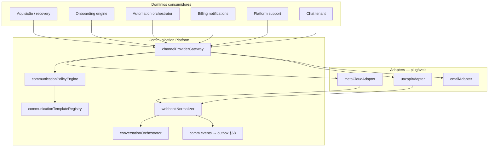
```mermaid
flowchart TB
  subgraph apps [Domínios consumidores]
    ACQ[Aquisição / recovery]
    ONB[Onboarding engine]
    AUTO[Automation orchestrator]
    BILL[Billing notifications]
    SUP[Platform support]
    CRM[Chat tenant]
  end
  subgraph comm [Communication Platform]
    GW[channelProviderGateway]
    POL[communicationPolicyEngine]
    TPL[communicationTemplateRegistry]
    NORM[webhookNormalizer]
    CONV[conversationOrchestrator]
    BUS[comm events → outbox §68]
  end
  subgraph providers [Adapters — plugáveis]
    META[metaCloudAdapter]
    UAZ[uazapiAdapter]
    SMTP[emailAdapter]
  end
  ACQ --> GW
  ONB --> GW
  AUTO --> GW
  BILL --> GW
  SUP --> GW
  CRM --> GW
  GW --> POL --> TPL
  GW --> META
  GW --> UAZ
  GW --> SMTP
  META --> NORM
  UAZ --> NORM
  NORM --> BUS
  NORM --> CONV
```

**Regra de ouro:** controllers, sagas (§45) e jobs **nunca** importam SDK/provider; só tipos do domínio `communication/*`.

---

## 59. Communication Abstraction Layer

### 59.1 Nome e localização

| Artefato | Caminho proposto |
|----------|------------------|
| Gateway principal | `packages/backend/src/services/communication/channelProviderGateway.ts` |
| Registry de adapters | `communication/providerRegistry.ts` |
| Contratos | `communication/contracts/` |

Alias aceitável em docs: `communicationProviderGateway` — implementação única: **`channelProviderGateway`**.

### 59.2 API pública (domínio)

Todo envio passa por estas operações (sync retorna `CommunicationDispatchResult`; side-effects pesados via outbox §68):

| Método | Uso |
|--------|-----|
| `sendMessage(input)` | Texto/mídia livre (dentro da policy) |
| `sendTemplate(input)` | Template oficial ou registry interno |
| `sendTransactionalMessage(input)` | Atalho: intent + template_key + vars (recovery, trial, billing) |
| `startConversation(input)` | Abre thread lógica; retorna `conversation_id` interno |
| `closeConversation(conversationId, reason)` | Encerra com audit |

**Input comum (`SendCommunicationInput`):**

| Campo | Obrigatório | Descrição |
|-------|-------------|-----------|
| `tenant_id` | tenant-scoped | null só para mensagens **plataforma** (recovery pré-tenant) |
| `channel` | sim | `whatsapp`, `email`, `sms`, `push`, `in_app` |
| `recipient` | sim | E.164, e-mail, user_id conforme canal |
| `message_intent` | sim | §60 — classifica uso (recovery, onboarding, …) |
| `body` / `template_key` | um deles | Conteúdo |
| `correlation_id` | recomendado | §54 |
| `idempotency_key` | crítico | §19 |
| `metadata` | opcional | JSON seguro |

### 59.3 Provider contract (adapter)

Cada adapter implementa `ICommunicationProviderAdapter`:

| Método | Descrição |
|--------|-----------|
| `providerId` | `meta_cloud`, `uazapi`, `smtp`, … |
| `capabilities()` | bitmask / objeto §61 |
| `sendMessage` / `sendTemplate` | traduz para API externa |
| `parseWebhook(raw)` | delega normalizer §62 |
| `healthCheck()` | para circuit breaker §65 |

### 59.4 Retries e fallback

- Gateway aplica retry **por adapter** (config §65), não no caller.
- Falha após retries → `delivery_status=failed` em `communication_messages` (§60) + evento `message.failed` (§68).
- Fallback: policy define próximo canal (ex. WA → email §37) — **mesmo** `sendTransactionalMessage` com `channel` diferente.

### 59.5 O que o resto do sistema NÃO pode fazer

| Proibido | Substituir por |
|----------|----------------|
| `fetch` direto Meta Graph API | `metaCloudAdapter` |
| Chamar UazAPI de recovery/onboarding | `channelProviderGateway.sendTransactionalMessage` |
| Branch `if (evolution)` em orchestrator | `providerRegistry.resolve(tenant)` |
| Publicar WhatsApp antes do outbox commit | outbox → subscriber chama gateway §68 |

### 59.6 Migração do AS-IS

| Módulo atual | Bridge |
|--------------|--------|
| Motor notificações plataforma | `uazapiAdapter` + intent `platform.*` |
| Chat tenant UazAPI | `uazapiAdapter` + intent `crm.chat` |
| E-mail transacional | `smtpEmailAdapter` |

Fase bridge: adapter delega ao código legado; callers novos só gateway.

---

## 60. Provider-Agnostic Message Domain

### 60.1 Entidade `communication_messages`

Tabela canônica — **fonte de verdade** de toda mensagem (inbound e outbound).

| Coluna | Tipo | Notas |
|--------|------|-------|
| `id` | uuid PK | |
| `channel` | enum | whatsapp, email, sms, push, in_app |
| `provider` | text | `meta_cloud`, `uazapi`, … |
| `direction` | enum | `outbound`, `inbound` |
| `conversation_id` | uuid FK | §66 |
| `tenant_id` | uuid nullable | null = plataforma |
| `message_intent` | text | ver §60.2 |
| `external_message_id` | text nullable | ID no provider |
| `delivery_status` | enum | `queued`, `sent`, `delivered`, `read`, `failed` |
| `template_id` | uuid nullable | FK registry §63 |
| `template_category` | text nullable | Meta category mirror |
| `retry_count` | int | |
| `idempotency_key` | text UNIQUE | |
| `correlation_id` | uuid | §54 |
| `payload` | jsonb | corpo normalizado (sem secrets) |
| `metadata` | jsonb | provider raw refs truncados |
| `failed_reason` | text | |
| `created_at` / `updated_at` | timestamptz | |

**Índices:** `(tenant_id, created_at)`, `(conversation_id)`, `(external_message_id, provider)`, `(correlation_id)`.

### 60.2 `message_intent` (separação de uso)

| Intent | Domínio consumidor | Exemplos |
|--------|-------------------|----------|
| `transactional.billing` | Billing | fatura, pagamento confirmado |
| `transactional.auth` | Auth | magic link, OTP |
| `onboarding.nudge` | Onboarding engine §30 | passo WhatsApp |
| `recovery.checkout` | Recovery §37 | abandono checkout |
| `recovery.trial` | Recovery | oferta trial |
| `recovery.onboarding` | Onboarding recovery §32 | stalled |
| `support.platform_ticket` | Platform support | ticket update |
| `crm.chat` | Chat tenant | mensagem operador |
| `marketing.campaign` | Futuro | campanhas (policy restrita §64) |
| `ai.assistant` | Futuro §71 | resposta assistente |

**Regra:** analytics e policy filtram por `message_intent`, não por tabela legada.

### 60.3 Mensagens transacionais vs conversacionais

| Tipo | `conversation_id` | Janela 24h Meta |
|------|-------------------|-----------------|
| Transacional (template) | opcional | N/A — template aprovado |
| Session (resposta usuário) | obrigatório | policy §64 |
| Chat CRM | obrigatório | tenant WABA |

---

## 61. Channel Capability Model

### 61.1 Objetivo

Automações consultam capabilities antes de agendar conteúdo — evita “enviar template” em provider que só suporta sessão Baileys.

### 61.2 Capability flags (por adapter)

| Capability | Descrição |
|------------|-----------|
| `text` | Mensagem texto livre em sessão |
| `media` | Imagem, áudio, documento |
| `official_template` | Templates aprovados Meta |
| `template_params` | Variáveis {{1}} |
| `reactions` | Emoji reaction |
| `typing_indicator` | typing on |
| `read_receipts` | delivered/read webhooks |
| `marketing_broadcast` | campanhas (futuro) |
| `session_window_24h` | exige sessão ativa para texto livre |
| `webhook_rich` | status + inbound + template events |
| `conversation_categories` | utility / marketing / authentication |

### 61.3 Matriz exemplo (planejamento)

| Provider | text | official_template | session_24h | webhook_rich |
|----------|------|-------------------|-------------|--------------|
| Meta Cloud API | sessão | sim | sim | sim |
| UazAPI (atual) | sim | parcial/none | informal | médio |
| SMTP | N/A | N/A | N/A | bounce only |
| SMS (futuro) | sim | N/A | N/A | delivery |

### 61.4 Uso no gateway

```text
resolveAdapter(tenant, channel)
  → capabilities = adapter.capabilities()
  → policyEngine.validate(intent, capabilities)
  → se falta capability: fallback channel ou template-only
```

Orchestrator (§36) recebe `capabilities_snapshot` no payload do job para replay determinístico.

---

## 62. Webhook Normalization Layer

### 62.1 Problema

Meta, UazAPI e futuros providers enviam payloads diferentes. Subscribers internos consomem **um** vocabulário.

### 62.2 `communicationWebhookNormalizer`

**Fluxo:**

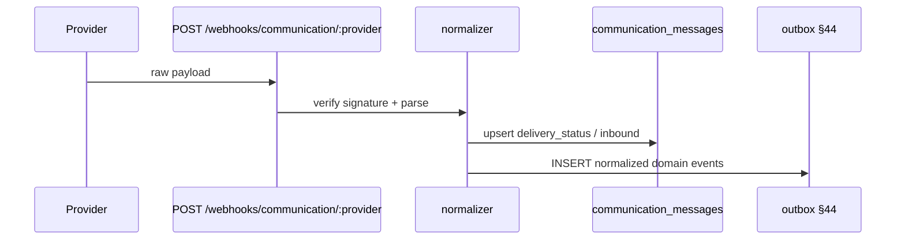
```mermaid
sequenceDiagram
  participant P as Provider
  participant WH as POST /webhooks/communication/:provider
  participant N as normalizer
  participant DB as communication_messages
  participant O as outbox §44

  P->>WH: raw payload
  WH->>N: verify signature + parse
  N->>DB: upsert delivery_status / inbound
  N->>O: INSERT normalized domain events
```

### 62.3 Eventos internos normalizados

| Evento | Quando |
|--------|--------|
| `communication.message.sent` | Aceito pelo provider |
| `communication.message.delivered` | Delivered |
| `communication.message.read` | Read |
| `communication.message.failed` | Erro permanente |
| `communication.conversation.started` | Primeira inbound ou template session |
| `communication.conversation.closed` | Timeout / close explícito |
| `communication.template.approved` | Meta aprovou |
| `communication.template.rejected` | Meta rejeitou |

Publicação via **outbox** (§44, §68) — nunca handler síncrono pesado.

### 62.4 Provider translators

| Arquivo | Provider |
|---------|----------|
| `translators/metaCloudWebhookTranslator.ts` | Graph API webhooks |
| `translators/uazapiWebhookTranslator.ts` | UazAPI atual |
| `translators/smtpBounceTranslator.ts` | Bounces |

Cada translator: `toNormalizedEvents(raw): NormalizedCommunicationEvent[]`.

### 62.5 Idempotência webhooks

- Chave: `(provider, external_event_id)` ou hash estável do payload.
- Tabela: `communication_webhook_receipts` (dedupe).
- Replay provider → no-op se já processado.

### 62.6 Rotas

| Rota | Notas |
|------|-------|
| `POST /webhooks/communication/meta` | Verify token Meta |
| `POST /webhooks/communication/uazapi` | Bridge atual |
| `POST /webhooks/communication/email` | Bounce/complaint |

**Não** misturar com `POST /webhooks/asaas` (billing isolado).

---

## 63. Template Management Architecture

### 63.1 `communicationTemplateRegistry`

**Localização:** `services/communication/communicationTemplateRegistry.ts`

### 63.2 Categorias de template (negócio)

| Categoria | Uso | Meta category (mirror) |
|-----------|-----|------------------------|
| `transactional` | billing, auth | `UTILITY` / `AUTHENTICATION` |
| `onboarding` | passos welcome | `UTILITY` |
| `recovery` | checkout, trial | `UTILITY` |
| `support` | tickets plataforma | `UTILITY` |
| `marketing` | campanhas futuras | `MARKETING` (opt-in §64) |

### 63.3 Tabela `communication_templates`

| Coluna | Uso |
|--------|-----|
| `key` | ex. `recovery.checkout.abandon_1` |
| `version` | semver interno |
| `channel` | whatsapp |
| `locale` | `pt_BR` (futuro i18n) |
| `category` | §63.2 |
| `provider_template_id` | ID Meta após sync |
| `approval_status` | `draft`, `pending`, `approved`, `rejected` |
| `body_schema` | jsonb variáveis |
| `fallback_template_key` | se rejeitado ou provider down |

### 63.4 Lifecycle

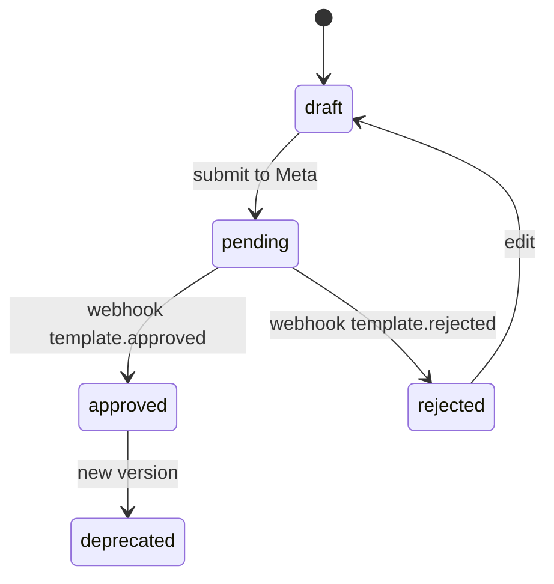
```mermaid
stateDiagram-v2
  [*] --> draft
  draft --> pending: submit to Meta
  pending --> approved: webhook template.approved
  pending --> rejected: webhook template.rejected
  rejected --> draft: edit
  approved --> deprecated: new version
```

### 63.5 Sync com providers

- Job `syncTemplatesFromMeta` (pull status).
- Push create/update via adapter (futuro).
- **Fallback:** se `approved` indisponível, `fallback_template_key` ou canal email (§65).

### 63.6 Consumo

```text
gateway.sendTemplate({ template_key: 'recovery.trial.offer', variables, tenant_id })
  → registry.resolve(key, locale, channel)
  → policyEngine.validate
  → adapter.sendTemplate(provider_template_id, vars)
```

---

## 64. Message Policy Engine

### 64.1 `communicationPolicyEngine`

Executa **antes** de qualquer dispatch no gateway. Falha = `PolicyViolationError` (audit §50).

### 64.2 Regras (Meta Cloud API-ready)

| Regra | Descrição |
|-------|-----------|
| **Session window 24h** | Texto livre só se `conversation.last_inbound_at` &lt; 24h (Meta); UazAPI: regra adaptada no adapter |
| **Template obrigatório** | Fora da janela → só `sendTemplate` |
| **Opt-in marketing** | `marketing.*` exige flag consent |
| **Marketing restrictions** | Limite por tenant/dia; horário comercial |
| **Rate limits** | por tenant, intent, canal (complementa §51) |
| **Tenant restrictions** | tenant suspenso → block outbound |
| **Abuse prevention** | link com §20 trial abuse + §41 rate limits |
| **Platform vs tenant** | recovery pré-tenant só instância plataforma WABA |

### 64.3 Decisão policy

```text
evaluate(input, capabilities) → { allowed, reason, required_template?, fallback_channel? }
```

### 64.4 Persistência de violações

`communication_policy_violations` (tenant_id, intent, reason, correlation_id) — analytics e CS.

---

## 65. Provider Routing & Failover

### 65.1 `providerRoutingService`

| Estratégia | Descrição |
|------------|-----------|
| **Primary** | Provider default por `(tenant_id, channel)` |
| **Fallback** | Segundo provider ou canal (WA → email) |
| **Tenant override** | Beta Meta: tenant X usa `meta_cloud` |
| **Weighted** (futuro) | % tráfego canary |
| **Circuit breaker** | N falhas → open 5 min → half-open |

### 65.2 Tabela `tenant_communication_routing`

| Coluna | Exemplo |
|--------|---------|
| `tenant_id` | uuid |
| `channel` | whatsapp |
| `primary_provider` | `uazapi` |
| `fallback_provider` | `meta_cloud` |
| `fallback_channel` | `email` |
| `enabled` | bool |

Plataforma (recovery): registro `tenant_id IS NULL`, `primary_provider` = instância comercial.

### 65.3 Failover automático

1. Primary send falha (retry esgotado).  
2. Se `fallback_provider` definido e capabilities compatíveis → retry.  
3. Senão `fallback_channel` via gateway (email).  
4. Evento `communication.provider.failover` no outbox.

**Objetivo:** trocar `uazapi` → `meta_cloud` por config, sem alterar onboarding/recovery.

### 65.4 Health

- `provider_health_snapshots` (provider, status, error_rate, updated_at).
- Alimenta degraded mode §55 e dashboards §56.

---

## 66. Conversation Orchestration

### 66.1 Além do chat simples

**AS-IS:** conversas CRM acopladas ao provider.

**TO-BE:** `conversationOrchestrator` + `communication_conversations` — thread lógica independente do adapter.

### 66.2 Tabela `communication_conversations`

| Coluna | Uso |
|--------|-----|
| `id` | uuid |
| `tenant_id` | nullable (plataforma) |
| `conversation_type` | §66.3 |
| `channel` | whatsapp, … |
| `provider` | último provider ativo |
| `external_thread_id` | ID WABA |
| `participant_address` | E.164 / email |
| `state` | `open`, `waiting_user`, `automated`, `human`, `closed` |
| `owner_type` | `automation`, `ai`, `user`, `cs` |
| `owner_id` | uuid nullable |
| `last_inbound_at` | policy 24h |
| `correlation_id` | vínculo aquisição |
| `metadata` | jsonb |

### 66.3 Tipos de conversa

| `conversation_type` | Origem |
|---------------------|--------|
| `onboarding` | Onboarding engine §30 |
| `recovery` | Recovery §37 |
| `support` | Platform tickets |
| `crm` | Chat operador |
| `automation` | Jobs §36 |
| `ai` | Assistente futuro §71 |

### 66.4 Lifecycle

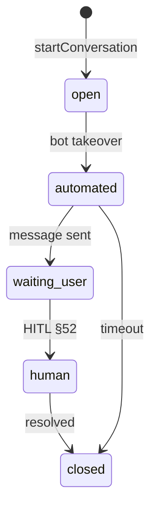
```mermaid
stateDiagram-v2
  [*] --> open: startConversation
  open --> automated: bot takeover
  automated --> waiting_user: message sent
  waiting_user --> human: HITL §52
  human --> closed: resolved
  automated --> closed: timeout
```

### 66.5 Automation takeover & AI handoff

| Transição | Regra |
|-----------|-------|
| Automation → human | health baixo, usuário pede humano, policy |
| AI → human | confidence &lt; threshold (futuro) |
| Human → automation | CS libera bot |

Eventos: `communication.conversation.replied`, `communication.conversation.escalated` (§68).

---

## 67. Communication Analytics

### 67.1 `communicationAnalyticsService`

**Localização:** `services/communication/communicationAnalyticsService.ts`

Rollups a partir de `communication_messages` + eventos §68 — não queries ad hoc em produção.

### 67.2 Métricas

| Métrica | Dimensões |
|---------|-----------|
| Delivery rate | provider, intent, template_key |
| Read rate | canal WA |
| Response rate | recovery / onboarding conversations |
| Recovery conversion | intent `recovery.*` → trial/paid |
| Onboarding conversion | intent `onboarding.*` → checkpoint |
| Activation via WhatsApp | link §22 / §48 |
| Provider performance | latency, error_rate |
| Template performance | approval, delivery, read |

### 67.3 Tabelas rollup

| Tabela | Granularidade |
|--------|---------------|
| `communication_metrics_daily` | tenant_id, provider, intent, date |
| `communication_template_metrics` | template_key, date |

### 67.4 Integração funil SaaS

- Export para §25 / §34 (`product_analytics_events` com `source=communication`).
- Dashboard §56: painel “Communication health”.

---

## 68. Communication Event Bus

### 68.1 Integração com outbox §44

**Todos** os eventos de comunicação (normalizados §62 + gateway §59) entram no **mesmo** `outbox_events` com prefixo `communication.*`.

### 68.2 Catálogo (extensão §21)

| Evento | Subscribers típicos |
|--------|---------------------|
| `communication.message.sent` | analytics §67 |
| `communication.message.delivered` | activation score §22 |
| `communication.message.read` | health §48 |
| `communication.message.failed` | failover §65, HITL §52 |
| `communication.conversation.started` | onboarding §30 |
| `communication.conversation.replied` | orchestrator §36, IA §38 |
| `communication.template.approved` | registry §63 |
| `communication.template.rejected` | alert CS |
| `communication.provider.failover` | observability §70 |

### 68.3 Fluxo aquisição (exemplo)

```text
recovery job due
  → orchestrator
  → gateway.sendTransactionalMessage (commit message row)
  → outbox communication.message.sent
  → subscriber: update recovery_automation_logs
  → webhook inbound
  → normalizer
  → outbox communication.conversation.replied
  → subscriber: advance signup SM §18
```

### 68.4 IA futura

Timelines §38 incluem eventos `communication.*` — modelo lê sequência sem provider-specific JSON.

---

## 69. Meta Cloud API Readiness

### 69.1 Objetivo

Garantir que **adicionar** Meta Cloud API = novo adapter + routing + templates — **sem** refatorar onboarding, recovery, notifications.

### 69.2 Checklist arquitetural (não implementação)

| Área | Preparação no plano |
|------|---------------------|
| **Templates oficiais** | Registry §63 + approval webhooks §62 |
| **Webhooks** | Rota dedicada + normalizer + verify signature |
| **Conversation categories** | UTILITY / MARKETING / AUTHENTICATION em policy §64 |
| **Quality rating** | Métricas §67 + alert se quality drop |
| **Messaging limits** | policy rate + tier no metadata tenant |
| **Phone verification** | provisioning §46 passo futuro `waba_verify` |
| **Business Manager** | `platform_waba_accounts` (futuro) — N WABAs |
| **Multi-tenant WABA** | 1 WABA plataforma (recovery) + 1 WABA por tenant (CRM) — routing §65 |

### 69.3 WABA strategy

| Escopo | WABA | Provider |
|--------|------|----------|
| Plataforma (recovery, trial offer) | WABA comercial PainelCRM | `meta_cloud` ou bridge UazAPI até cutover |
| Tenant CRM | WABA do cliente ou número compartilhado | tenant routing row |

**Não** misturar mensagens plataforma no adapter tenant sem `message_intent=platform.*`.

### 69.4 Desacoplamento do provider atual

| Hoje (AS-IS) | Caminho |
|--------------|---------|
| UazAPI direto em notificações/chat | `uazapiAdapter` único ponto |
| Sem templates Meta | `official_template` capability false → policy força texto ou email |
| Webhooks ad hoc | Migrar para `/webhooks/communication/uazapi` |

### 69.5 Decisões produto pendentes (Meta)

1. WABA único plataforma vs por parceiro?  
2. Tenant traz BM próprio ou PainelCRM hosted?  
3. Cutover UazAPI → Meta: big-bang vs tenant canary (§65 weighted)?

---

## 70. Communication Observability

### 70.1 Prefixos de log

| Prefixo | Conteúdo |
|---------|----------|
| `[COMMUNICATION]` | dispatch, policy decision |
| `[PROVIDER]` | adapter call, latency |
| `[WEBHOOK]` | receive, normalize, dedupe |
| `[TEMPLATE]` | resolve, approval |
| `[DELIVERY]` | status transitions |
| `[CONVERSATION]` | state changes |

Sempre incluir: `correlation_id`, `tenant_id`, `message_intent`, `provider`, `communication_message_id`.

### 70.2 Traces

- Span: `gateway.send` → `policy.evaluate` → `adapter.send`.
- Span: `webhook.normalize` → `outbox.publish`.

### 70.3 Métricas operacionais

| Métrica | Alerta |
|---------|--------|
| `comm_outbox_pending` | backlog §51 |
| `comm_provider_error_rate` | circuit open §65 |
| `comm_webhook_lag_seconds` | ingest delay |
| `comm_template_rejected_total` | CS |

### 70.4 Degraded mode (comunicação)

Estende §55:

| Modo | Comportamento |
|------|---------------|
| WA primary down | failover email; queue WA |
| Meta rate limited | throttle intents marketing |
| Webhook down | poll status (adapter opcional) — último recurso |

### 70.5 Playbooks

| ID | Gatilho |
|----|---------|
| `PB-COMM-PROVIDER-DOWN` | circuit open |
| `PB-COMM-TEMPLATE-REJECTED` | Meta rejected |
| `PB-COMM-WEBHOOK-BACKLOG` | lag &gt; 5 min |

Adicionar em `docs/architecture/runbooks/communication/` (§57).

---

## 71. Long-Term Communication Vision

### 71.1 Omnichannel alvo

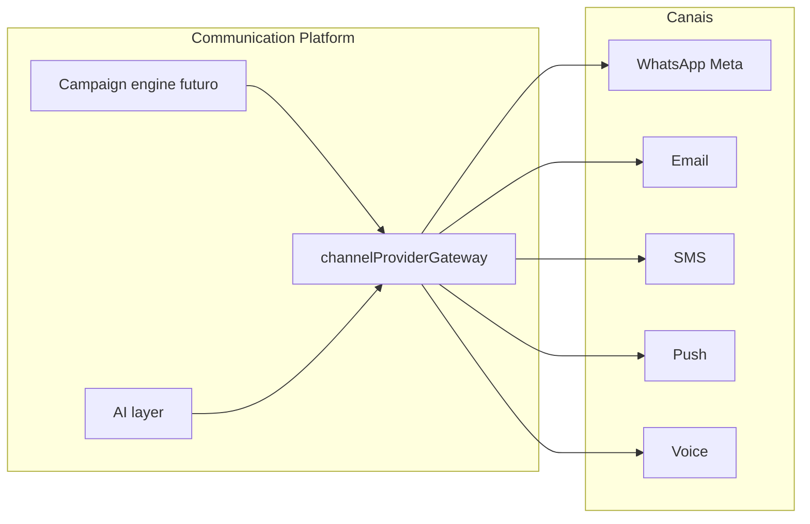
```mermaid
flowchart LR
  subgraph channels [Canais]
    WA[WhatsApp Meta]
    EM[Email]
    SMS[SMS]
    PU[Push]
    VO[Voice]
  end
  subgraph platform [Communication Platform]
    GW[channelProviderGateway]
    CAMP[Campaign engine futuro]
    AI[AI layer]
  end
  GW --> WA
  GW --> EM
  GW --> SMS
  GW --> PU
  GW --> VO
  CAMP --> GW
  AI --> GW
```

### 71.2 Roadmap comunicação (paralelo §27)

| Fase | Entrega |
|------|---------|
| **C0** | `communication_messages` + gateway skeleton + `uazapiAdapter` bridge |
| **C1** | Webhook normalizer + outbox events §68 |
| **C2** | Template registry + policy engine (UTILITY recovery/onboarding) |
| **C3** | Routing/failover + analytics rollups |
| **C4** | `metaCloudAdapter` canary + WABA plataforma |
| **C5** | Conversation orchestrator tipos recovery/onboarding |
| **C6** | Campaign engine + marketing policy |
| **C7** | AI handoff + voice/SMS |

### 71.3 O que NÃO refatorar depois

Com **C0–C2** estáveis, estes domínios só adicionam `template_key` / `intent`:

- Onboarding engine §30  
- Automation orchestrator §36  
- Multi-channel recovery §37  
- Platform support notifications  
- Billing notification hardening (doc existente)  
- Activation / health §22, §48  

### 71.4 Anti-patterns a evitar

| Anti-pattern | Correção |
|--------------|----------|
| Novo fluxo chama UazAPI | gateway + intent |
| Webhook controller com lógica de negócio | normalizer + outbox |
| Template hardcoded em TS | registry key |
| Ignorar 24h window | policy engine |

---

## 10. Estratégia de migração e coexistência

### 10.1 Feature flags (proposta)

Matriz completa em **§27**; catálogo central e rollout em **§47** (`featureFlagRegistry`). Resumo env/legado:

| Flag | Escopo |
|------|--------|
| `SIGNUP_SESSION_V1` | Pré-cadastro público grava sessão, checkout legado continua |
| `RECOVERY_AUTOMATION_V1` | Jobs abandono + WhatsApp |
| `TRIAL_ACTIVATION_V1` | Trial só via magic link + ActivationService |
| `ONBOARDING_V2_V1` | Nova rota + `onboarding_progress` + score |
| `SIGNUP_FUNNEL_KANBAN_V1` | Pipeline operacional vivo |
| `SAAS_FUNNEL_ANALYTICS_V1` | Dashboards §25 |
| `CHECKOUT_DEFER_TENANT_V1` | Tenant só após pagamento (Fase 8 — crítico) |

**Regra:** flags **desligadas** = comportamento idêntico ao AS-IS documentado em §2.

### 10.2 Coexistência fluxo antigo vs novo

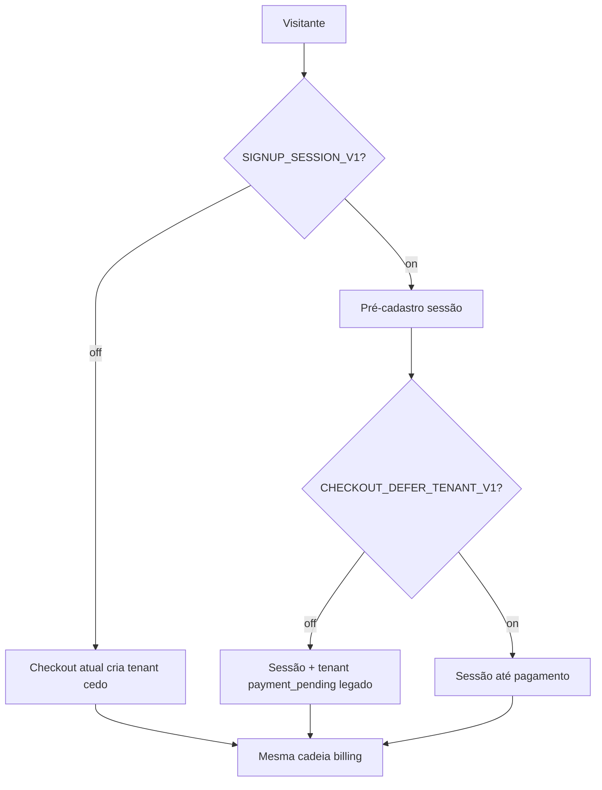
```mermaid
flowchart TD
  A[Visitante] --> F{SIGNUP_SESSION_V1?}
  F -->|off| OLD[Checkout atual cria tenant cedo]
  F -->|on| NEW[Pré-cadastro sessão]
  NEW --> G{CHECKOUT_DEFER_TENANT_V1?}
  G -->|off| HYB[Sessão + tenant payment_pending legado]
  G -->|on| DEFER[Sessão até pagamento]
  OLD --> BILLING[Mesma cadeia billing]
  HYB --> BILLING
  DEFER --> BILLING
```

### 10.3 Rollout gradual sugerido

| Fase | Entrega | Risco |
|------|---------|-------|
| 0 | Métricas + sessão read-only (espelha checkout) | Baixo |
| 1 | Pré-cadastro landing + sessão; checkout ainda cria tenant (híbrido) | Baixo |
| 2 | Recovery WhatsApp abandono (sessões sem tenant) | Médio |
| 3 | Trial via magic link sem tenant prévio | Médio |
| 4 | Defer tenant até pagamento | **Alto** — exige reescrever `plan-purchase` |
| 5 | Onboarding v2 obrigatório soft | Médio |
| 6 | Desligar `/api/auth/register` público | Médio (comunicação) |

### 10.4 Rollback

- Flags off → rotas antigas.
- Tenants já criados permanecem; `signup_sessions` pode arquivar sem delete.
- Não remover colunas `tenants` até Fase 6 estável.

### 10.5 Dados legados

| Situação | Ação |
|----------|------|
| `payment_pending` órfãos | Script one-shot: cancelar billing + suspender ou vincular sessão fictícia |
| `trial` sem login | Campanha retomada; não auto-criar sessão retroativa obrigatória |
| `has_used_trial` | Manter; sessão herda flag se identificadores batem |

---

## 11. Impacto em módulos existentes (checklist)

| Módulo | Mudança prevista |
|--------|------------------|
| `planPurchaseController` | Receber `signup_session_id`; defer INSERT tenant |
| `subscriptionService` | Metadata sessão em `tenant_billing` |
| `authController` | Deprecar register público; login inalterado |
| `registerOrganizationController` | Redirect para novo fluxo ou internal only |
| `onboardingController` | Delegar para OnboardingV2Service |
| `featureFlagService` | Ignorar tenants inexistentes; sem mudança se status igual |
| `middleware/auth` | Trial gate mantido |
| `PlanCheckout.tsx` | Step 0 pré-cadastro; token sessão |
| `Landing` | CTA → `/pre-cadastro` ou query sessão |
| `superadmin` | Kanban + métricas |
| `Meta Pixel` | Novos eventos mapeados em `SuperAdminTrackingSettings` |
| Motor notificações / UazAPI / chat | Bridge → `channelProviderGateway` §59; webhooks → §62 |
| Platform support notifications | `message_intent=support.platform_ticket` §60 |

---

## 12. Riscos da migração (TO-BE)

1. **Gateway:** cobrança sem `tenant_id` exige `customer` externo ou tenant “stub” — validar Asaas/MP **antes** Fase 4.
2. **Webhooks:** correlacionar pagamento → `signup_session_id` → criar tenant → chamar `activatePlanFromBilling`.
3. **SEO/URLs:** bookmarks `/checkout` devem continuar funcionando.
4. **Trials consumidos:** sessão deve consultar `has_used_trial` por identificadores mesmo sem tenant.
5. **LGPD:** retenção e exclusão em `signup_sessions` (política `expires_at`).

---

## 27. Implementation Roadmap (7 fases)

Roadmap completo **antes** de qualquer código. Cada fase inclui impacto, risco, rollback, flags, migrações e compatibilidade produção.

### Visão geral

```mermaid
gantt
  title Roadmap aquisição (indicativo)
  dateFormat YYYY-MM
  section Infra
  F1 Infra base           :f1, 2026-06, 6w
  section Aquisição
  F2 Pré-cadastro         :f2, after f1, 4w
  F3 Recovery             :f3, after f2, 4w
  F4 Trial controlado     :f4, after f3, 6w
  section Produto
  F5 Onboarding V2        :f5, after f4, 4w
  F6 Kanban operacional   :f6, after f3, 4w
  section Inteligência
  F7 Analytics e IA       :f7, after f5, 6w
```

---

### Fase 1 — Infra base

| Item | Detalhe |
|------|---------|
| **Entregas** | Migrações núcleo; `globalIdentityService`; `signupSessionStateMachine`; `outbox_events` (§44) + `outboxPublisherWorker`; `acquisition_idempotency_keys`; `correlationId` middleware (§54); `auditTrailService` mínimo (§50); `featureFlagRegistry` seed (§47); `saga_instances` skeleton (§45); `tenantProvisioningService` stub; **Communication C0:** `communication_messages` + `channelProviderGateway` + `uazapiAdapter` bridge (§59); logs `[ACQUISITION_*]` + `[COMMUNICATION]` |
| **Migrações** | `signup_sessions`, `signup_session_transitions`, `outbox_events`, `saga_instances`, `saga_step_log`, `platform_audit_trail`, `platform_feature_flags`, `acquisition_idempotency_keys`, `identity_resolution_log`, `communication_messages` |
| **Flags** | Registry: todas `acquisition.*` false; env legado inalterado |
| **Impacto** | Nenhum em UX produção se flags off |
| **Risco** | Baixo |
| **Rollback** | Drop tables só em dev; prod: flags off + worker off |
| **Compat** | 100% fluxo legado |
| **Critério de saída** | Testes SM + idempotency; outbox COMMIT→publish dry-run; audit em transição SM |

---

### Fase 2 — Pré-cadastro

| Item | Detalhe |
|------|---------|
| **Entregas** | `POST /api/public/pre-signup`; landing step; `resolveIdentity` em todo pré-cadastro; sessão em cookie/`?s=`; checkout lê sessão (tenant ainda criado como hoje — híbrido) |
| **Flags** | `SIGNUP_SESSION_V1=true` (rollout 10→100%) |
| **Impacto** | Médio — nova etapa antes do checkout |
| **Risco** | Médio — duplicata se identity mal configurada |
| **Rollback** | Flag off → CTA direto `/checkout` |
| **Compat** | `plan-purchase` inalterado na criação de tenant |
| **Eventos** | `signup.pre_created`, `signup.plan_selected`, `checkout.started` |
| **Critério de saída** | 0 tenants a mais vs baseline; sessões deduplicadas |

---

### Fase 3 — Recovery

| Item | Detalhe |
|------|---------|
| **Entregas** | Job abandono; `recovery_automation_logs`; templates WhatsApp; `trialAbuseProtection` soft; subscribers notifications + metrics |
| **Flags** | `RECOVERY_AUTOMATION_V1` |
| **Migrações** | `recovery_automation_logs`, `trial_abuse_signals` (opcional), templates engine |
| **Impacto** | Alto em conversão; baixo em core CRM |
| **Risco** | Médio — spam WhatsApp; mitigar idempotency §19 |
| **Rollback** | Flag off; jobs param |
| **Compat** | Tenants órfãos legados fora do funil até script |
| **Kanban** | Colunas read-only (pré-Fase 6) |
| **Critério de saída** | recovery_idempotency sem duplicata em 7 dias |

---

### Fase 4 — Trial controlado

| Item | Detalhe |
|------|---------|
| **Entregas** | `activation_tokens` + §24 security; `TrialActivationService`; trial só pós-link; remover `onboarding_completed=true` no INSERT trial; integrar `assertNewTrialSignupAllowed` + abuse |
| **Flags** | `TRIAL_ACTIVATION_V1`, `CHECKOUT_DEFER_TENANT_V1=false` (ainda) |
| **Impacto** | Alto — muda quando tenant nasce no trial |
| **Risco** | Alto — regressão login/JWT |
| **Rollback** | Flag → fluxo `complete-signup-trial` atual |
| **Compat** | Checkout trial legado em paralelo até 100% migrate |
| **Critério de saída** | 0 double tenant em testes de carga + webhook replay |

---

### Fase 5 — Onboarding V2

| Item | Detalhe |
|------|---------|
| **Entregas** | `onboarding_progress`; rota `/welcome`; API checkpoints; `activationScoreService`; unificar com `DashboardActivationBlock` |
| **Flags** | `ONBOARDING_V2_V1` |
| **Migração** | `onboarding_progress`, `activation_score_snapshots` |
| **Impacto** | Médio UX pós-login |
| **Risco** | Baixo |
| **Rollback** | Flag off → checklist dashboard only |
| **Eventos** | `onboarding.started`, `onboarding.completed`, `whatsapp.connected` |
| **Critério de saída** | score correlaciona com WhatsApp em pilotos |

---

### Fase 6 — Kanban operacional

| Item | Detalhe |
|------|---------|
| **Entregas** | `signup_pipeline_cards`; UI superadmin; SLA jobs; automações por coluna §23.4 |
| **Flags** | `SIGNUP_FUNNEL_KANBAN_V1` |
| **Impacto** | Operação CS — não afeta tenant |
| **Risco** | Baixo |
| **Rollback** | Hide UI; cards congelados |
| **Critério de saída** | SLA breach visível; sem drift coluna vs SM |

---

### Fase 7 — Analytics e IA

| Item | Detalhe |
|------|---------|
| **Entregas** | `trial_conversion_metrics` + `saas_funnel_cohorts`; dashboards §25; replay outbox; hooks IA em `metadata` (sem modelo obrigatório) |
| **Flags** | `SAAS_FUNNEL_ANALYTICS_V1` |
| **Impacto** | Reporting |
| **Risco** | Baixo |
| **Rollback** | Dashboard hide |
| **Critério de saída** | métricas batem com SQL audit manual |

---

### Fase 8 (opcional pós-7) — Defer tenant no pagamento

| Item | Detalhe |
|------|---------|
| **Entregas** | Tenant só após webhook; `subscribePlan` com `signup_session_id`; redesign gateway customer |
| **Flags** | `CHECKOUT_DEFER_TENANT_V1` |
| **Risco** | **Crítico** — ver §12 |
| **Rollback** | Flag off — maior risco de rollback em dados; exige playbook |

> Fase 8 mantida separada: não bloqueia valor das Fases 1–7.

---

### Matriz flags consolidada

| Flag | Fase | Default prod |
|------|------|--------------|
| `SIGNUP_SESSION_V1` | 2 | false |
| `RECOVERY_AUTOMATION_V1` | 3 | false |
| `TRIAL_ACTIVATION_V1` | 4 | false |
| `ONBOARDING_V2_V1` | 5 | false |
| `SIGNUP_FUNNEL_KANBAN_V1` | 6 | false |
| `SAAS_FUNNEL_ANALYTICS_V1` | 7 | false |
| `CHECKOUT_DEFER_TENANT_V1` | 8 | false |
| `CHECKOUT_TRIAL_V1` / `CHECKOUT_RESUME_V1` | legado | conforme env atual |

### Rollback strategy (global)

1. Desligar flags na ordem inversa (7 → 1).
2. Outbox dispatcher off → eventos ficam pending (não perder — replay depois).
3. Nunca apagar `tenants` em rollback.
4. Runbook: “modo legado” = todas flags acquisition false + comunicado CS.

### Dependências entre fases

```mermaid
flowchart TD
  F1[F1 Infra] --> F2[F2 Pré-cadastro]
  F1 --> F3[F3 Recovery]
  F2 --> F4[F4 Trial]
  F4 --> F5[F5 Onboarding Engine]
  F1 --> F5b[F5b Tenant+User LC]
  F5b --> F5
  F3 --> F6[F6 Kanban + CS pipeline]
  F2 --> F7[F7 Analytics]
  F5 --> F7
  F1 --> F9[F9 Orchestrator]
  F9 --> F3
  F9 --> F32[Onboarding recovery]
  F4 --> F8[F8 Defer tenant opcional]
```

### Roadmap v3/v4 — extensões (paralelo ao §27)

| Extensão | Fase roadmap | Seções | Prioridade |
|----------|--------------|--------|------------|
| Tenant + User lifecycle (dual-write) | F1 | §28–§29 | P0 |
| **Transactional outbox + publisher** | F1 | §44 | **P0** |
| **Saga orchestrator (trial/paid skeleton)** | F1 shadow, F4 ativo | §45 | **P0** |
| **Correlation ID + audit trail** | F1 | §54, §50 | **P0** |
| **Tenant provisioning pipeline** | F4–F5 | §46 | P0 |
| Onboarding engine (substitui espalhado) | F5 | §30 | P0 |
| First value + product analytics | F5–F7 | §31, §34 | P1 |
| Onboarding recovery | F5 + F3 | §32 | P1 |
| Automation orchestrator | F1 shadow, F3 ativo | §36 | P0 |
| Multi-channel recovery | F3 | §37 | P1 |
| **Backpressure + queue priority** | F3 | §51 | P1 |
| **Human-in-the-loop + CS tasks** | F3–F6 | §52 | P1 |
| Feature adoption score | F7 | §35 | P2 |
| **Health score contínuo** | F5–F7 | §48 | P1 |
| CS/Sales pipeline | F6 | §33 | P1 |
| Failure compensation + orphan scan | F1 | §40 (com §45) | P0 |
| Security rate limits | F2 | §41 | P0 |
| Rollout safety playbook | F1–F2 | §42, §47 | P0 |
| **Data retention jobs** | F2 | §49 | P1 |
| **Degraded mode + reconcile** | F3 | §55 | P1 |
| **Operational dashboards** | F6–F7 | §56 | P1 |
| **Runbooks operacionais** | F3+ | §57 | P2 |
| AI-ready timelines | F7 | §38 | P2 |
| **Long-term scale hooks** | contínuo | §58 | P2 |
| **Communication Platform C0** (gateway + messages) | F1 / C0 | §59–§60 | **P0** |
| **Webhook normalizer + comm outbox** | F1–F2 / C1 | §62, §68 | **P0** |
| **Template registry + policy engine** | F2–F3 / C2 | §63–§64 | P0 |
| **Provider routing / failover** | F3 / C3 | §65 | P1 |
| **Meta Cloud adapter canary** | F4+ / C4 | §69 | P1 |
| **Conversation orchestrator** | F5 / C5 | §66 | P1 |
| **Communication analytics** | F6–F7 / C3+ | §67, §70 | P1 |

### Flags adicionais v3

| Flag | Seção |
|------|-------|
| `TENANT_LIFECYCLE_V1` | §28 |
| `USER_LIFECYCLE_V1` | §29 |
| `ONBOARDING_ENGINE_V1` | §30 |
| `FIRST_VALUE_TRACKING_V1` | §31 |
| `ONBOARDING_RECOVERY_V1` | §32 |
| `CS_PIPELINE_V1` | §33 |
| `PRODUCT_ANALYTICS_V1` | §34 |
| `AUTOMATION_ORCHESTRATOR_V1` | §36 |
| `ACQUISITION_MASTER_OFF` | kill switch §42 |
| `ACQUISITION_SHADOW_MODE` | §42.2 |

### Flags adicionais v4 (registry §47)

| Registry key | Seção |
|--------------|-------|
| `acquisition.outbox_v1` | §44 |
| `acquisition.saga_orchestrator_v1` | §45 |
| `acquisition.provisioning_v1` | §46 |
| `acquisition.health_score_v1` | §48 |
| `acquisition.degraded_mode_auto` | §55 |

### Flags adicionais v5 — communication (registry §47)

| Registry key | Seção |
|--------------|-------|
| `communication.gateway_v1` | §59 |
| `communication.webhook_normalizer_v1` | §62 |
| `communication.policy_engine_v1` | §64 |
| `communication.meta_cloud_canary` | §69 |
| `communication.conversation_orchestrator_v1` | §66 |

### Roadmap Communication (C0–C7) — §71.2

Paralelo ao §27; **C0–C2** são pré-requisito para recovery/onboarding sem acoplamento provider.

| Fase | Entregas mínimas |
|------|------------------|
| C0 | `communication_messages`, `channelProviderGateway`, `uazapiAdapter` bridge |
| C1 | Normalizer + eventos `communication.*` no outbox |
| C2 | Templates + policy (recovery/onboarding UTILITY) |
| C3+ | Routing, analytics, Meta, conversas tipadas |

---

## 13. Plano de implementação (referência rápida — substituído por §27)

Ver **§27 Implementation Roadmap** para o plano oficial em 7 fases. Checklist legado Fase 0–5 arquivado abaixo apenas como histórico:

<details>
<summary>Checklist histórico v1 (colapsado)</summary>

- Fase 0 migrações tabelas base
- Fase 1 pré-cadastro híbrido
- Fase 2 recovery
- Fase 3 trial + onboarding API
- Fase 4 defer tenant
- Fase 5 consolidação legado

</details>

---

## 14. Decisões de produto pendentes (bloqueiam detalhe)

1. **Pagamento antes vs depois do tenant:** defer completo (**Fase 8** §27) ou híbrido indefinido?
2. **Trial automático no abandono** vs só após clique explícito no WhatsApp?
3. **Obrigatoriedade** dos 5 checkpoints (hard block login vs soft nudge)?
4. **Unificar `/register` e `/checkout`** em uma única URL pública?
5. **Instância WhatsApp** da plataforma para recovery (número comercial vs superadmin UazAPI)?
6. **Preço no pré-cadastro** ou só após escolha do plano?
7. **Pesos do activation_score** (§22) e limiar CS “conta em risco”.
8. **Merge automático** de sessões vs sempre manual CS (§17.3).
9. **Fingerprint** no front — obrigatório ou opcional para abuse (§20)?
10. **Replay de domain events** — quem pode reprocessar dead-letter (superadmin only)?
11. **Tenant `draft` / `trial_pending`** — usar na Fase 8 ou nunca criar tenant até pagamento?
12. **Onboarding hard block** — quais módulos bloquear sem WhatsApp (§30)?
13. **CS pipeline ownership** — SDR vs CS automático vs híbrido (§33)?
14. **Adoção de PostHog/Amplitude** vs só warehouse interno (§34)?
15. **Kill switch** — quem pode acionar `ACQUISITION_MASTER_OFF` em produção?
16. **Retenção LGPD** — prazos finais da matriz §49 (especialmente `signup_sessions` e audit).
17. **Health vs activation** — limiares automáticos de CS (§48.4).
18. **Replay outbox/saga** — papéis com `platform.saga.replay` (§53).
19. **Prioridade de filas** — billing sempre P0 em incidente? (§51).
20. **HITL obrigatório** — quantas falhas recovery antes de humano (§52)?
21. **WABA plataforma vs tenant** — modelo Business Manager (§69.3).
22. **Cutover UazAPI → Meta** — canary por tenant ou big-bang (§65, §69).
23. **Templates recovery** — UTILITY vs MARKETING e opt-in (§63–§64).
24. **Instância plataforma recovery** — permanece UazAPI até C4 ou exige Meta day-1?

---

## 15. Apêndice — mapa rápido de endpoints atuais

| Método | Rota | Função |
|--------|------|--------|
| POST | `/api/auth/register` | Registro legado + tenant trial |
| POST | `/api/auth/register/organization` | Wizard 4 etapas |
| POST | `/api/auth/register/check-admin` | Unicidade admin |
| POST | `/api/plan-purchase` | Checkout pago |
| POST | `/api/plan-purchase/complete-signup-trial` | Trial checkout |
| POST | `/api/plan-purchase/validate-admin` | Validação e-mail/WA |
| GET | `/api/me/tenant/checkout-context` | Retomada trial/pagamento |
| POST | `/api/onboarding/create-admin` | Senha pós-pagamento |
| GET | `/api/dashboard/activation-checklist` | Ativação gamificada |
| POST | `/webhooks/asaas` | Pagamento SaaS |

---

## 16. Conclusão

O sistema atual **funciona** para contratação paga e trial no checkout (legado), mas carece de camadas de **aquisição**, **lifecycle**, **onboarding centralizado**, **consistência distribuída** e **operação em escala** necessárias para um SaaS enterprise.

**v5** consolida cinco partes:

| Parte | Foco |
|-------|------|
| **A–B** | AS-IS + TO-BE comercial (sessão, checkout, trial) |
| **C (v2)** | Identity, signup SM, idempotência, event bus (resumo), magic link, funil |
| **E (v3)** | Lifecycle, onboarding engine, orchestrator, analytics, CS, compensação, rollout |
| **F (v4)** | Outbox, sagas, provisioning, audit, operação em escala |
| **G (v5)** | Communication Platform — gateway multi-provider, webhooks normalizados, templates, policy Meta-ready, failover, conversas, analytics, observabilidade |

**Treze blocos v5** (§59–§71) garantem que **Meta Cloud API**, e-mail, SMS e IA futura entrem como **adapters**, sem refatorar onboarding (§30), recovery (§37), automações (§36) nem notificações — desde que **C0–C2** precedam novos fluxos WhatsApp.

**Próximo passo (sem código):**

1. Aprovar **[`IMPLEMENTATION_ROADMAP_AND_ROLLOUT_STRATEGY.md`](./IMPLEMENTATION_ROADMAP_AND_ROLLOUT_STRATEGY.md)** (checklist §18).  
2. Workshop produto — §14 (incl. WABA §69, templates §63).  
3. Sign-off P0: Fase 0 + Outbox (Fase 3) + Communication bridge (Fase 2).  
4. Runbooks: `docs/architecture/runbooks/acquisition/` + `docs/architecture/runbooks/communication/` (§57, §70).  
5. Iniciar código pela **Fase 0**, depois **Fase 3 ∥ Fase 2** em staging.

---

### Apêndice B — Tabelas e módulos (consolidado v5)

| Tabela / artefato | Fase | Seção |
|-------------------|------|-------|
| `signup_sessions` | 1 | §4.2 |
| `signup_session_transitions` | 1 | §18 |
| `signup_pipeline_cards` | 6 | §23 |
| `cs_pipeline_cards` | 6 | §33 |
| `activation_tokens` + `activation_token_audit` | 4 | §24 |
| `onboarding_progress` | 5 | §30 |
| `tenant_lifecycle_transitions` | 1 | §28 |
| `tenant_first_value_events` | 5 | §31 |
| `onboarding_recovery_logs` | 5 | §32 |
| `product_analytics_events` | 7 | §34 |
| `tenant_feature_adoption` | 7 | §35 |
| `automation_jobs` | 1 | §36 |
| `context_timelines` | 7 | §38 |
| `funnel_drop_events` | 2 | §39 |
| `outbox_events` (+ archive) | 1 | §44 |
| `saga_instances` + `saga_step_log` | 1 | §45 |
| `tenant_provisioning_runs` | 4–5 | §46 |
| `platform_feature_flags` + overrides | 1 | §47 |
| `tenant_health_snapshots` | 5–7 | §48 |
| `platform_audit_trail` | 1 | §50 |
| `rate_limit_buckets` (opcional) | 2–3 | §51 |
| `acquisition_idempotency_keys` | 1 | §19 |
| `identity_resolution_log` | 1 | §17 |
| `security_audit_log` | 2 | §41 |
| `trial_conversion_metrics` / `saas_funnel_cohorts` | 7 | §25 |
| `globalIdentityService` | 1 | §17 |
| `tenantLifecycleService` | 1 | §28 |
| `userLifecycleService` | 1 | §29 |
| `onboardingEngine/` | 5 | §30 |
| `productAnalyticsService` | 7 | §34 |
| `automationOrchestrator/` | 1–3 | §36 |
| `compensationService` | 1 | §40 |
| `outboxPublisherWorker` | 1 | §44 |
| `acquisitionSagaOrchestrator` | 1–4 | §45 |
| `tenantProvisioningService` | 4–5 | §46 |
| `featureFlagRegistry` | 1 | §47 |
| `healthScoreRecalculator` | 5–7 | §48 |
| `auditTrailService` | 1 | §50 |
| `retention_archiver` / `purger` | 2 | §49 |
| `communication_messages` | C0 | §60 |
| `communication_conversations` | C5 | §66 |
| `communication_templates` | C2 | §63 |
| `communication_webhook_receipts` | C1 | §62 |
| `communication_policy_violations` | C2 | §64 |
| `tenant_communication_routing` | C3 | §65 |
| `communication_metrics_daily` | C3–C7 | §67 |
| `provider_health_snapshots` | C3 | §65, §70 |
| `platform_waba_accounts` (futuro) | C4 | §69 |
| `channelProviderGateway` | C0 | §59 |
| `communicationPolicyEngine` | C2 | §64 |
| `communicationTemplateRegistry` | C2 | §63 |
| `communicationWebhookNormalizer` | C1 | §62 |
| `providerRoutingService` | C3 | §65 |
| `conversationOrchestrator` | C5 | §66 |
| `communicationAnalyticsService` | C3+ | §67 |
| `metaCloudAdapter` / `uazapiAdapter` | C0 / C4 | §59, §69 |

> `domain_event_outbox` (§21) = alias legado → `outbox_events` (§44). Eventos `communication.*` (§68) no mesmo outbox.

---

*Documento v5 — investigação + arquitetura SaaS + Communication Platform `painelcrm` — maio/2026. Não implementar sem aprovação explícita de produto e sign-off P0 (incl. Communication C0–C2).*
