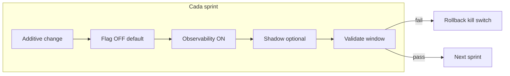
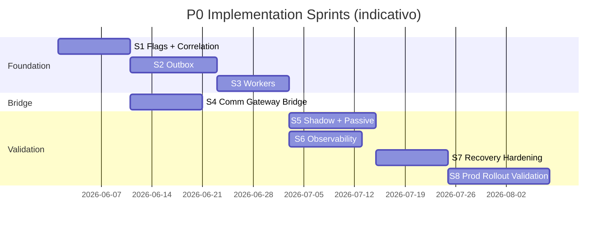
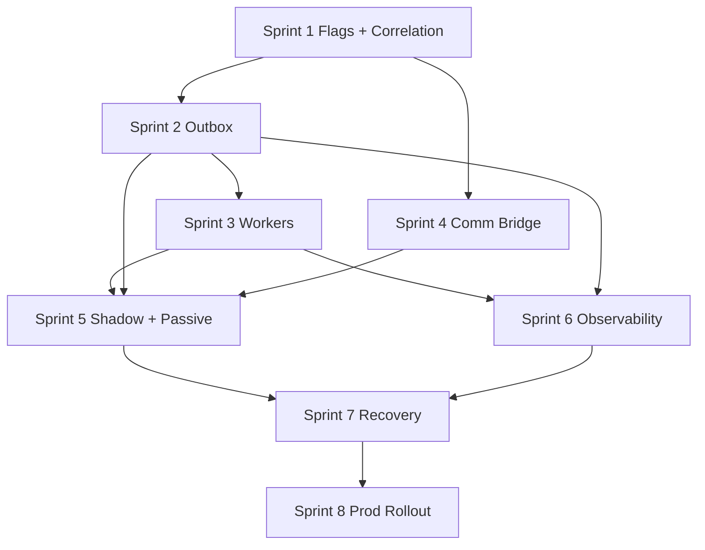
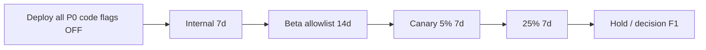
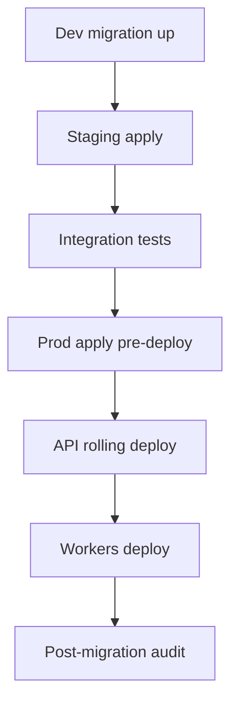
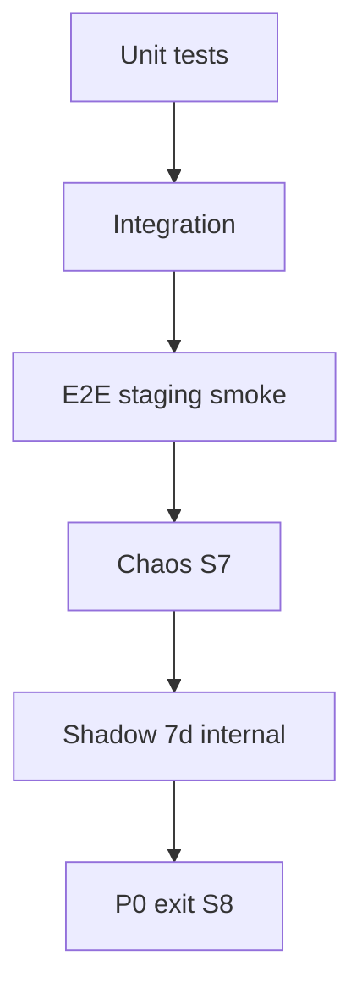

# P0 Implementation Sprints — Plano Operacional

**Tipo:** plano de execução por sprint — **somente documentação** (sem código neste documento).  
**Versão:** 1.0  
**Data:** maio/2026  
**Status:** governança de implementação — requer sign-off antes de abrir PRs.

**Transforma em operação:** [`IMPLEMENTATION_P0_FOUNDATION_EXECUTION_PLAN.md`](./IMPLEMENTATION_P0_FOUNDATION_EXECUTION_PLAN.md)  
**Contexto programa:** Fase 2 — Implementação Controlada · [`IMPLEMENTATION_ROADMAP_AND_ROLLOUT_STRATEGY.md`](./IMPLEMENTATION_ROADMAP_AND_ROLLOUT_STRATEGY.md) Fase 0

---

## Índice

1. [Visão geral](#1-visão-geral)
2. [Princípios operacionais](#2-princípios-operacionais)
3. [Roadmap de sprints](#3-roadmap-de-sprints)
4. [Sprint 1 — Feature Flags + Correlation IDs](#4-sprint-1--feature-flags--correlation-ids)
5. [Sprint 2 — Outbox Foundation](#5-sprint-2--outbox-foundation)
6. [Sprint 3 — Worker Foundation](#6-sprint-3--worker-foundation)
7. [Sprint 4 — Communication Gateway Bridge](#7-sprint-4--communication-gateway-bridge)
8. [Sprint 5 — Shadow Mode + Passive Consumers](#8-sprint-5--shadow-mode--passive-consumers)
9. [Sprint 6 — Observability & Rollout Controls](#9-sprint-6--observability--rollout-controls)
10. [Sprint 7 — Validation & Recovery Hardening](#10-sprint-7--validation--recovery-hardening)
11. [Sprint 8 — Production Rollout Validation](#11-sprint-8--production-rollout-validation)
12. [Migration strategy](#12-migration-strategy)
13. [Feature flag strategy](#13-feature-flag-strategy)
14. [Rollout strategy](#14-rollout-strategy)
15. [Testing strategy](#15-testing-strategy)
16. [Risk matrix](#16-risk-matrix)
17. [Operational ownership](#17-operational-ownership)
18. [Success criteria](#18-success-criteria)
19. [Anti-patterns proibidos](#19-anti-patterns-proibidos)
20. [Conclusão](#20-conclusão)

---

## 1. Visão geral

### 1.1 Por que dividir em sprints

O P0 Foundation cobre **oito capacidades transversais** (flags, outbox, workers, correlation, gateway bridge, shadow, observabilidade, rollout). Implementar tudo num único ciclo gera:

- PRs irrevisáveis (&gt; 3 000 linhas)
- Deploy de alto risco em produção ativa
- Impossibilidade de isolar regressões
- Rollback “tudo ou nada”

**Sprints** convertem o blueprint em **ondas dominantes** de 1–2 semanas, cada uma com critérios de aceite, métricas e rollback independente.

### 1.2 Por que evitar mega PRs

| Mega PR | PR pequeno (alvo) |
|---------|-------------------|
| Review superficial | Review focado (&lt; 400 LOC lógica) |
| Blast radius grande | Falha contida por sprint |
| Testes frágeis | Testes por entrega |
| Deploy bloqueado dias | Deploy contínuo com flags OFF |

**Meta:** 2–4 PRs por sprint; cada PR deployável com **flags default OFF**.

### 1.3 Por que rollout incremental

PainelCRM tem **billing**, **WhatsApp** e **notificações** em produção. Rollout incremental =:

- Internal tenants → beta → canary % → global
- Kill switch validado **antes** de aumentar %
- Shadow mode provando equivalência sem efeito ao cliente

### 1.4 Produção ativa e reversible-first

| Pilar | Significado |
|-------|-------------|
| **Produção ativa** | Clientes reais; zero downtime aceitável |
| **Reversible-first** | Toda entrega tem caminho de volta &lt; 15 min |
| **Compatibility-first** | Flag OFF = comportamento AS-IS byte-a-byte |
| **Validation-first** | Métricas verdes antes de ampliar rollout |

### 1.5 Sprint philosophy

| Princípio | Prática |
|-----------|---------|
| **One dominant wave** | Um subsistema “principal” por sprint |
| **Done = deployable** | Merge só com critérios § sprint atendidos em staging |
| **No silent behavior change** | Changelog + flag registry atualizado |
| **Instrument before amplify** | Logs/dashboards antes de % rollout |

### 1.6 Deployment cadence

| Ambiente | Cadência | Gate |
|----------|----------|------|
| **staging** | Diária (após merge main) | CI + integration tests |
| **prod** | 1–2× por semana por sprint | Checklist sprint + flags OFF audit |
| **internal tenants** | Após 48 h staging verde | Eng dogfood |
| **beta / canary** | Sprint 8+ ou gate explícito | Sign-off owners §17 |

### 1.7 Validation-first implementation

Ordem dentro de cada sprint:

1. Schema / contrato  
2. Código com flag OFF  
3. Testes automatizados  
4. Observabilidade (logs/métricas)  
5. Shadow / internal enable  
6. Janela de validação (mín. 48 h staging, 7 d internal quando aplicável)  
7. Documentar rollback drill  

### 1.8 Compatibility-first execution

- Nenhum controller altera response com flag OFF.  
- Workers financeiros legados **não** são movidos nem desligados.  
- `platformNotifications` / `notificationsEngine` permanecem path default até fase posterior.

---

## 2. Princípios operacionais

| # | Princípio | Enforcement |
|---|-----------|-------------|
| P1 | **PRs pequenos** | &lt; 400 LOC lógica; 1 conceito por PR |
| P2 | **Deploy reversível** | Kill switch + revert deploy testado |
| P3 | **Feature flag mandatory** | Nenhum comportamento novo sem `featureFlagRegistry` |
| P4 | **Observabilidade antes do rollout** | Prefixos log + métrica antes de % &gt; 0 |
| P5 | **Shadow-first** | Side-effects proibidos em prod até Sprint 5+ validado |
| P6 | **Coexistência obrigatória** | Legado + novo em paralelo |
| P7 | **Sem quebra de billing** | PR review bloqueia touch em `activatePlanFromBilling` / webhooks |
| P8 | **Sem remoção do legado** | Deprecation só pós-Sprint 8 sign-off global |

---

## 3. Roadmap de sprints

### 3.1 Visão timeline (8 sprints)

**Nota:** S4 pode **overlap** com S2–S3 em staging (equipe paralela); **prod** mantém sequência segura: S4 deploy após S1 em prod.

### 3.2 Mapa sprint → entregáveis P0

| Sprint | Objetivo one-liner | PRs alvo | Prod flag default |
|--------|-------------------|----------|-------------------|
| **S1** | Controle + tracing | PR-P0-01 … 03 | all OFF |
| **S2** | Event backbone | PR-P0-04 … 06 | `outbox.*` OFF |
| **S3** | Workers enterprise | PR-P0-07 | workers run shadow |
| **S4** | Gateway bridge | PR-P0-09 | `communication.gateway_v1` OFF |
| **S5** | Shadow validation | PR-P0-10 | internal shadow ON |
| **S6** | Ops dashboards | PR-P0-08, 11 | — |
| **S7** | Recovery hardening | PR-P0-12 … 14 | internal |
| **S8** | Prod readiness | PR-P0-15 | beta/canary |

### 3.3 Diagrama de dependências entre sprints

### 3.4 Milestones globais

| Milestone | Sprint | Critério |
|-----------|--------|----------|
| **M0** | S1 complete | Correlation 100% API; registry live |
| **M1** | S2 complete | Outbox write shadow internal |
| **M2** | S3 complete | Publisher + heartbeat verdes |
| **M3** | S4 complete | Bridge shadow sem dup |
| **M4** | S5 complete | Passive consumers 7 d internal |
| **M5** | S6 complete | Dashboards + alertas wired |
| **M6** | S7 complete | Replay drill + DLQ recovery |
| **M7** | S8 complete | Beta signed; P0 exit report |

---

## 4. Sprint 1 — Feature Flags + Correlation IDs

### Objetivo

Fundação de **rollout controlado** e **correlação ponta a ponta** — base para outbox, gateway e observabilidade.

### Escopo

| In | Out |
|----|-----|
| Registry + DB + middleware correlation | Outbox, workers, gateway |
| Admin read API flags | Alteração fluxos negócio |
| Seed flags P0 (OFF) | Rollout % &gt; 0 em prod |

### Entregáveis

| ID | Entregável | Artefato |
|----|------------|----------|
| S1-E1 | Migrations M1 | `platform_feature_flags`, `platform_feature_flag_overrides` |
| S1-E2 | `featureFlagRegistry` | `services/platform/featureFlagRegistry.ts` |
| S1-E3 | Cache L1 + TTL | LRU 60 s + invalidação admin |
| S1-E4 | Tenant targeting | allowlist, `is_internal`, hash % |
| S1-E5 | Kill switches | namespace masters seeded |
| S1-E6 | `correlationId` middleware | `middleware/correlationId.ts` |
| S1-E7 | ALS / request context | propagação em services |
| S1-E8 | Structured logging | campo `correlation_id` |
| S1-E9 | Superadmin read API | `GET /api/superadmin/feature-flags` |
| S1-E10 | Seed catálogo P0 | ver execution plan §2.4 |

### PRs

| PR | Conteúdo |
|----|----------|
| PR-P0-01 | M1 + seed flags |
| PR-P0-02 | Registry + unit tests |
| PR-P0-03 | Correlation middleware + access log |

### Migrations

| Migration | Tipo |
|-----------|------|
| M1 | CREATE flags + overrides |

### Feature flags

Todas **default OFF** em prod. Nenhuma flag de negócio ativada neste sprint.

### Shadow mode

N/A — infraestrutura apenas.

### Rollout

| Ambiente | Ação |
|----------|------|
| staging | Deploy; validar evaluation |
| prod | Deploy; audit all OFF |

### Rollback

| Cenário | Ação |
|---------|------|
| Registry bug | Revert PR; env legado continua |
| Middleware bug | Feature flag `correlation.middleware_v1` OFF ou revert |

### Riscos

| Risco | Mitigação |
|-------|-----------|
| Flag misconfiguration | default OFF; admin audit |
| Perf cache | benchmark p99 &lt; 5 ms |

### Critérios de aceite

- [ ] `correlation_id` em 100% requests `/api/*` staging  
- [ ] `isEnabled()` retorna false para todas keys prod pós-deploy  
- [ ] Kill switch drill &lt; 5 min staging  
- [ ] Zero alteração response APIs existentes  
- [ ] Unit tests registry &gt; 90% branches críticos  

### Dependências

Nenhuma (sprint inicial).

### Observabilidade

| Log | Exemplo |
|-----|---------|
| `[FEATURE_FLAG]` | evaluation result + reason |
| access log | `correlation_id` field |

### Métricas

| Métrica | Alvo |
|---------|------|
| `flag_evaluation_p99_ms` | &lt; 5 |
| `correlation_coverage_api` | 100% |

---

## 5. Sprint 2 — Outbox Foundation

### Objetivo

Criar **backbone de eventos** transacional — persistência, publisher, retries, DLQ, idempotência.

### Escopo

| In | Out |
|----|-----|
| Tabela + repository + publish helper | Subscribers com side-effect |
| Publisher worker (shadow) | Cutover notify |
| 4 eventos instrumentados (shadow write) | Acquisition F1 |

### Entregáveis

| ID | Entregável |
|----|------------|
| S2-E1 | Migrations M2, M3 |
| S2-E2 | `outbox_events` schema + índices |
| S2-E3 | `publishDomainEvent()` TX-only |
| S2-E4 | `outboxRepository` claim / update |
| S2-E5 | `outboxPublisherWorker` shadow dispatch |
| S2-E6 | Retry backoff + `max_attempts` |
| S2-E7 | Dead-letter status + alert hook |
| S2-E8 | Replay admin API (read + replay staging) |
| S2-E9 | `outbox_subscriber_idempotency` |
| S2-E10 | Correlation em cada row |

### Eventos iniciais (instrumentação shadow)

| event_name | Producer (piloto) | Sprint |
|------------|-------------------|--------|
| `ticket.created` | platform support | S2 |
| `invoice.created` | billing (read-only hook) | S2 |
| `signup.completed` | placeholder internal | S2 |
| `workflow.started` | automation shell | S2 |

**Modo:** `outbox.write_v1` **internal only**; publisher **shadow** (log dispatch).

### PRs

| PR | Conteúdo |
|----|----------|
| PR-P0-04 | M2, M3 |
| PR-P0-05 | publishDomainEvent + repository |
| PR-P0-06 | publisher worker shadow |

### Migrations

M2, M3 (ver execution plan §10.1).

### Feature flags

| Flag | Staging | Prod |
|------|---------|------|
| `outbox.write_v1` | internal ON | OFF → internal |
| `outbox.publisher_v1` | shadow ON | OFF |
| `outbox.subscribers_v1` | OFF | OFF |

### Shadow mode

Modo **B–C** execution plan §3.6: INSERT real; dispatch log-only.

### Rollout

1. staging: internal write + shadow publisher 48 h  
2. prod: migration only + flags OFF  
3. prod internal tenants: write + shadow 7 d  

### Rollback

| Ação | Tempo |
|------|-------|
| `outbox.publisher_off` | &lt; 2 min |
| `outbox.master_off` | stop write |
| Stop worker process | queue frozen, no data loss |

### Riscos

| Risco | Mitigação |
|-------|-----------|
| TX bloat | publish só em TX existente; async proibido |
| Duplicate publish | UNIQUE idempotency_key |

### Critérios de aceite

- [ ] 0 eventos lost em teste chaos staging  
- [ ] Shadow dispatch 100% logged com correlation  
- [ ] dead-letter manual replay OK staging  
- [ ] Prod: tabela vazia ou só internal; flags OFF global  

### Dependências

Sprint 1 (correlation + flags).

### Observabilidade

`[OUTBOX]` publish, claim, dispatch, dead.

### Métricas

| Métrica | Alvo (shadow) |
|---------|---------------|
| `outbox_pending_age_p95` | &lt; 120 s |
| `outbox_dead_count` | 0 em steady state |

---

## 6. Sprint 3 — Worker Foundation

### Objetivo

Padronizar **workers enterprise**: lifecycle, heartbeat, reclaim, graceful shutdown.

### Escopo

| In | Out |
|----|-----|
| Worker base + heartbeat | Workflow business logic |
| Integração outbox publisher | Notification cutover |
| Scheduler/retry shells | Meta Cloud |

### Entregáveis

| ID | Entregável |
|----|------------|
| S3-E1 | M4 `worker_heartbeats` |
| S3-E2 | `WorkerBase` lifecycle |
| S3-E3 | Heartbeat worker (15 s) |
| S3-E4 | Stale reclaim (5 min) |
| S3-E5 | Graceful SIGTERM |
| S3-E6 | `workflowSchedulerWorker` shell |
| S3-E7 | `workflowRetryWorker` shell |
| S3-E8 | `notificationRetryWorker` wrapper + heartbeat |
| S3-E9 | Health endpoint / superadmin status |
| S3-E10 | Deploy manifests (PM2/k8s) |

### PRs

| PR | Conteúdo |
|----|----------|
| PR-P0-07 | M4 + WorkerBase + heartbeat + outbox integration |

### Migrations

M4.

### Feature flags

| Flag | Uso |
|------|-----|
| `workflow.scheduler_v1` | shell poll OFF side-effect |
| `workflow.retry_v1` | reclaim only |

### Shadow mode

Workers rodam em staging; prod: heartbeat + outbox publisher apenas.

### Rollout

Deploy worker process **após** API migration S2; rolling 1 instância.

### Rollback

Scale workers to 0; API + legado crons continuam.

### Riscos

| Risco | Mitigação |
|-------|-----------|
| Crash loop | max restarts; alert |
| Stale locks | reclaim job |

### Critérios de aceite

- [ ] Kill worker → reclaim &lt; 6 min staging  
- [ ] Restart 3× sem duplicata dispatch  
- [ ] Heartbeat dashboard verde 99.9% 48 h staging  
- [ ] Graceful shutdown sem eventos stuck &gt; 5 min  

### Dependências

Sprint 2.

### Observabilidade

`[WORKER]` start, stop, heartbeat, stale_reclaim.

### Métricas

| Métrica | Alvo |
|---------|------|
| `worker_heartbeat_lag_s` | &lt; 30 |
| `worker_stale_locks` | 0 pós-reclaim |

---

## 7. Sprint 4 — Communication Gateway Bridge

### Objetivo

**Desacoplar provider** via `channelProviderGateway` — bridge para UazAPI/legado sem mudança funcional.

### Escopo

| In | Out |
|----|-----|
| Gateway + registry + bridge adapter | Meta Cloud send |
| Shadow send (log) | Desligar platformNotifications |
| `communication_messages` opcional | Dual dispatch prod |

### Entregáveis

| ID | Entregável |
|----|------------|
| S4-E1 | M7 `communication_messages` (shadow) |
| S4-E2 | `ICommunicationProviderAdapter` |
| S4-E3 | `channelProviderGateway` |
| S4-E4 | `providerRegistry` |
| S4-E5 | `uazapiBridgeAdapter` → legado |
| S4-E6 | Policy engine stub |
| S4-E7 | Provider health metrics |
| S4-E8 | Shadow intent logging |

### PRs

| PR | Conteúdo |
|----|----------|
| PR-P0-09 | Gateway + bridge + M7 |

### Migrations

M7 (opcional shadow table).

### Feature flags

| Flag | Prod |
|------|------|
| `communication.gateway_v1` | OFF (shadow internal) |
| `communication.bridge_dual_dispatch` | **OFF** always P0 |
| `communication.master_off` | kill |

### Shadow mode

Gateway invoked; bridge delega legado; **uma** execução real max; shadow = log diff intent.

### Rollout

staging internal → prod deploy code OFF → 7 d internal shadow.

### Rollback

`communication.master_off` &lt; 5 min.

### Riscos

| Risco | Mitigação |
|-------|-----------|
| Duplicate WA | no dual dispatch; idempotency shared |
| Latency | timeout; fallback legado path |

### Critérios de aceite

- [ ] 0 duplicate sends vs baseline 7 d internal  
- [ ] Flag OFF = 100% código legado path  
- [ ] Provider health visible em logs  

### Dependências

Sprint 1 (flags + correlation). Pode desenvolver em paralelo com S2–S3.

### Observabilidade

`[COMMUNICATION]` gateway, bridge, provider_health.

### Métricas

| Métrica | Alvo |
|---------|------|
| `comm_shadow_vs_legacy_diff` | 0 functional diff |
| `comm_gateway_latency_p95` | &lt; legado + 50 ms |

---

## 8. Sprint 5 — Shadow Mode + Passive Consumers

### Objetivo

Validar backbone **sem impacto real** — shadow workflows, passive consumers, dual execution validation.

### Escopo

| In | Out |
|----|-----|
| Subscriber registry passive | Active side-effect subscribers prod |
| Shadow `automation_jobs` | Real recovery sends |
| Replay validation staging | Global cutover |

### Entregáveis

| ID | Entregável |
|----|------------|
| S5-E1 | `subscriberRegistry` |
| S5-E2 | Passive handlers (log-only) |
| S5-E3 | Shadow publish all 4+ eventos |
| S5-E4 | `automation_jobs.shadow=true` column/flag |
| S5-E5 | Dual execution validator (compare metrics) |
| S5-E6 | Replay test suite staging |
| S5-E7 | `communication.message.sent` outbox shadow |

### PRs

| PR | Conteúdo |
|----|----------|
| PR-P0-10 | Passive subscribers + shadow automation |

### Feature flags

| Flag | Internal |
|------|----------|
| `outbox.subscribers_v1` | passive ON |
| `outbox.publisher_v1` | shadow ON |
| `workflow.scheduler_v1` | shadow jobs |

### Validações obrigatórias

| Validação | Critério |
|-----------|----------|
| Sem duplicidade | 0 duplicate WA/email 7 d |
| Sem impacto produção | flags OFF global default |
| Replay consistente | replay 100 events staging OK |
| Tracing completo | correlation end-to-end sample 50 flows |

### Rollback

Disable `outbox.subscribers_v1`; drain shadow jobs.

### Riscos

| Risco | Mitigação |
|-------|-----------|
| Passive vira active por bug | code review + flag guard |
| Shadow job notify | `shadow=true` blocks send |

### Critérios de aceite

- [ ] 7 d internal shadow green  
- [ ] Validator report signed Eng + Comm Ops  

### Dependências

S2, S3, S4.

### Observabilidade

`[SHADOW]` prefix + diff metrics.

---

## 9. Sprint 6 — Observability & Rollout Controls

### Objetivo

**Controle operacional enterprise** — dashboards, alertas, rollout visibility.

### Escopo

| In | Out |
|----|-----|
| Dashboards superadmin | OpenTelemetry full (opcional) |
| Alert rules | PagerDuty wiring prod (opcional) |
| Flag admin UI write | — |

### Entregáveis

| ID | Entregável |
|----|------------|
| S6-E1 | Outbox dashboard |
| S6-E2 | Worker health dashboard |
| S6-E3 | Queue / retry dashboard |
| S6-E4 | Feature flag dashboard |
| S6-E5 | Rollout stage dashboard |
| S6-E6 | Shadow diff dashboard |
| S6-E7 | Alert rules (§ execution plan 7.3) |
| S6-E8 | Correlation trace lookup |
| S6-E9 | Runbooks linked in UI |

### PRs

| PR | Conteúdo |
|----|----------|
| PR-P0-08 | Dashboards v1 (pode iniciar em S3 parcial) |
| PR-P0-11 | Alerts + runbooks |

### Logs (consolidação)

| Prefixo | Sprint origem |
|---------|---------------|
| `[OUTBOX]` | S2 |
| `[WORKER]` | S3 |
| `[FEATURE_FLAG]` | S1 |
| `[ROLLOUT]` | S6 |
| `[SHADOW]` | S5 |
| `[COMMUNICATION]` | S4 |

### Rollout

Dashboards em staging → prod (read-only, sem impacto).

### Critérios de aceite

- [ ] On-call consegue diagnosticar outbox pending em &lt; 5 min  
- [ ] Todos alertas fire em staging drill  
- [ ] Rollout dashboard reflete flags reais DB  

### Dependências

S2, S3 (métricas existem). S5 para shadow panels.

### Métricas

Dashboard coverage 100% P0 components.

---

## 10. Sprint 7 — Validation & Recovery Hardening

### Objetivo

Fortalecer **recovery operacional** — replay, DLQ, retry storms, queue overload.

### Entregáveis

| ID | Entregável |
|----|------------|
| S7-E1 | Replay validation playbook + automation |
| S7-E2 | Dead-letter recovery UI + audit |
| S7-E3 | Retry storm circuit breaker |
| S7-E4 | Stale workflow reclaim tests |
| S7-E5 | Queue overload backpressure |
| S7-E6 | `platform_audit_trail` M5 integrado |
| S7-E7 | Recovery workflow admin (requeue batch) |
| S7-E8 | Chaos test report |

### PRs

| PR | Conteúdo |
|----|----------|
| PR-P0-12 | DLQ recovery + audit |
| PR-P0-13 | Circuit breaker + backpressure |
| PR-P0-14 | Chaos + replay suite |

### Migrations

M5 `platform_audit_trail` se não em S1.

### Feature flags

Internal only; `outbox.replay_admin_v1` staging.

### Validações

| Teste | Resultado |
|-------|-----------|
| Replay 1k events | 0 dup side-effects |
| Worker kill mid-batch | reclaim OK |
| Publisher flood | backpressure triggers |

### Rollback

Disable replay admin; circuit breaker default permissive.

### Critérios de aceite

- [ ] Chaos report aprovado Eng Lead  
- [ ] DLQ recovery drill &lt; 30 min MTTR staging  

### Dependências

S5, S6.

### Observabilidade

Alertas retry storm, queue depth.

---

## 11. Sprint 8 — Production Rollout Validation

### Objetivo

Validar **readiness** para Fase 1+ — canary, beta, drills, checklist operacional.

### Entregáveis

| ID | Entregável |
|----|------------|
| S8-E1 | Beta tenant allowlist (3–10) |
| S8-E2 | Canary 5% → 25% plan |
| S8-E3 | Rollback drill prod (kill switches) |
| S8-E4 | P0 exit report |
| S8-E5 | Operational checklist assinado |
| S8-E6 | Runbook on-call final |
| S8-E7 | Sign-off billing (zero impact attestation) |
| S8-E8 | Sign-off communication ops |

### Rollout sequence (prod)

### Critérios (obrigatórios)

| ID | Critério |
|----|----------|
| CR-01 | Zero downtime durante S8 deploys |
| CR-02 | Zero billing impact (webhooks, activation) |
| CR-03 | Zero duplicated notifications |
| CR-04 | Workers estáveis 14 d |
| CR-05 | Observabilidade completa §6 |
| CR-06 | Rollback drill &lt; 5 min documented |

### Dependências

S7 complete.

### Ownership sign-off

Eng Lead, Billing Ops, Communication Ops, SRE (ver §17).

---

## 12. Migration strategy

### 12.1 Tipos de migration

| Tipo | Quando | Exemplo |
|------|--------|---------|
| **Additive** | Sempre P0 | CREATE TABLE |
| **Shadow** | Tabela nova sem read path prod | `communication_messages` |
| **Dual-write** | Outbox + legado | INSERT outbox shadow |
| **Rollback-safe** | Sem DROP | leave tables |

### 12.2 Calendário migrations

| Migration | Sprint | Rollback |
|-----------|--------|----------|
| M1 flags | S1 | leave |
| M2–M3 outbox | S2 | stop workers |
| M4 heartbeats | S3 | leave |
| M5 audit | S7 | leave |
| M6 idempotency | S2 ou S7 | leave |
| M7 comm messages | S4 | leave |
| M8 seed | S1 | DELETE seeds |

### 12.3 Diagrama migration flow

### 12.4 Regras

- Forward-only em prod.  
- Backup snapshot antes M2 em prod.  
- Nunca LOCK TABLE em horário pico.

---

## 13. Feature flag strategy

### 13.1 Progression por sprint

| Estágio | Sprints | Quem |
|---------|---------|------|
| **off** | S1 deploy | todos |
| **internal** | S2–S5 | `is_internal` tenants |
| **beta** | S8 | allowlist |
| **canary 5%** | S8 | hash % |
| **canary 25%** | S8+ | hash % |
| **global** | Pós-P0 | sign-off F1 |

### 13.2 Matriz flag × sprint

| Flag | S1 | S2 | S3 | S4 | S5 | S8 |
|------|----|----|----|----|----|-----|
| `outbox.write_v1` | — | int | int | int | int | beta |
| `outbox.publisher_v1` | — | sh | sh | sh | pass | canary |
| `communication.gateway_v1` | — | — | — | sh | sh | beta |
| `outbox.subscribers_v1` | — | — | — | — | pass | canary |

### 13.3 Emergency disable

Testar **cada sprint** em staging: kill switch → confirm legado 100%.

---

## 14. Rollout strategy

### 14.1 Deploy sequence (cada sprint)

1. Migração DB (se houver)  
2. API rolling deploy — flags OFF  
3. Workers deploy  
4. Smoke tests  
5. Enable internal (se aplicável)  
6. Validation window  
7. Documentar em sprint report  

### 14.2 Validation windows

| Sprint | Staging min | Internal prod min |
|--------|-------------|-------------------|
| S1 | 24 h | 48 h |
| S2–S4 | 48 h | 7 d |
| S5–S7 | 48 h | 7 d |
| S8 | 48 h | 14 d beta |

### 14.3 Rollback checkpoints

| Checkpoint | Após | Ação se fail |
|------------|------|--------------|
| CP-S1 | S1 prod | revert middleware |
| CP-S2 | S2 internal | publisher_off |
| CP-S5 | S5 7 d | subscribers_off |
| CP-S8 | S8 canary | master_off all |

### 14.4 Ownership rollout

| Decisão | Owner |
|---------|-------|
| internal → beta | Eng Lead |
| beta → canary | Eng Lead + Comm Ops |
| canary increase | SRE + Eng Lead |
| kill switch prod | On-call + Eng Lead |

---

## 15. Testing strategy

### 15.1 Por tipo

| Tipo | Sprint | Escopo |
|------|--------|--------|
| **Unit** | Todos | registry, publish, idempotency |
| **Integration** | S2+ | outbox TX + claim |
| **Replay** | S5, S7 | 1k events staging |
| **Workflow** | S5 | shadow jobs lifecycle |
| **Outbox chaos** | S7 | kill publisher mid-batch |
| **Retry** | S7 | max_attempts → dead |
| **Worker crash** | S3, S7 | SIGKILL → reclaim |
| **Rollback** | S1, S8 | kill switch drill |
| **Shadow validation** | S5 | diff metrics 7 d |

### 15.2 CI gates (obrigatório)

| Gate | Bloqueia merge |
|------|----------------|
| Unit tests pass | sim |
| Migration up/down staging | sim |
| No billing core diff without label | sim |
| Lint + typecheck | sim |

### 15.3 Test diagram

---

## 16. Risk matrix

| Risco | Sprint | Prob | Impact | Mitigação | Rollback | Owner |
|-------|--------|------|--------|-----------|----------|-------|
| Duplicated events | S2, S5 | M | H | idempotency_key | publisher_off | Platform |
| Duplicated notifications | S4, S5 | M | Crítico | no dual dispatch | communication.master_off | Comm Ops |
| Replay corruption | S7 | L | H | new replay keys | disable replay admin | Platform |
| Retry storm | S2, S7 | M | H | max_attempts, circuit | publisher_off | SRE |
| Stale workers | S3 | M | M | heartbeat reclaim | restart worker | SRE |
| Queue overload | S2 | L | M | backpressure S7 | publisher_off | SRE |
| Rollout inconsistency | S8 | M | H | registry single source | kill all | Eng Lead |
| Migration failure | S2 | L | H | additive only | forward fix | Platform |
| Flag misconfig | S1, S8 | M | H | default OFF audit | kill switch | Superadmin |
| Shadow → active leak | S5 | M | Crítico | code guards | subscribers_off | Platform |

---

## 17. Operational ownership

### 17.1 RACI por sprint

| Sprint | Responsible | Accountable | Consulted | Informed |
|--------|-------------|-------------|-----------|----------|
| S1 | Platform Eng | Eng Lead | SRE | Support |
| S2 | Platform Eng | Eng Lead | Automation | SRE |
| S3 | Platform Eng | Eng Lead | SRE | — |
| S4 | Comm squad | Comm Ops | Platform | CS |
| S5 | Platform + Comm | Eng Lead | Automation | Support |
| S6 | SRE | Eng Lead | Platform | On-call |
| S7 | Platform | Eng Lead | SRE | — |
| S8 | Eng Lead | CTO/Head Eng | Billing, Comm, Support | All |

### 17.2 Funções

| Função | Responsabilidade P0 |
|--------|---------------------|
| **Engineering** | Implementação, PRs, drills |
| **Communication ops** | Bridge, duplicate WA, sign-off S4/S8 |
| **Billing ops** | Attestation zero impact S2/S8 |
| **Onboarding ops** | Consulta flags `onboarding.*` (futuro) |
| **Support** | Comunicar beta tenants; escalations |
| **Superadmin** | Flag overrides; audit |

### 17.3 Cerimônias

| Cerimônia | Frequência |
|-----------|------------|
| Sprint planning | Início sprint |
| Daily standup | Diário |
| Sprint demo | Fim sprint (staging) |
| P0 steering | Quinzenal |
| Rollout go/no-go | Antes S8 canary |

---

## 18. Success criteria

### 18.1 Por sprint (resumo)

| Sprint | Success one-liner |
|--------|-------------------|
| S1 | Correlation + flags live, zero behavior change |
| S2 | Outbox shadow stable internal |
| S3 | Workers heartbeat green |
| S4 | Bridge zero dup internal |
| S5 | Shadow 7 d green |
| S6 | Dashboards + alerts operational |
| S7 | Chaos + replay passed |
| S8 | Beta/canary signed; P0 exit report |

### 18.2 P0 program exit (após S8)

| Critério | Status target |
|----------|---------------|
| Backbone estável | outbox + workers 14 d green |
| Workers confiáveis | heartbeat 99.9% |
| Rollout seguro | drills documented |
| Observabilidade enterprise | §6 complete |
| Tracing completo | correlation 100% |
| Rollback validado | &lt; 5 min kill switches |
| Shadow execution validada | 7–14 d metrics |
| Zero billing impact | Billing Ops sign-off |
| Zero dup notifications | Comm Ops sign-off |

### 18.3 Entrega formal

Documento **P0 Exit Report** (template a criar em `docs/runbooks/`) anexado ao steering.

---

## 19. Anti-patterns proibidos

| Anti-pattern | Sprint mais vulnerável | Alternativa |
|--------------|------------------------|-------------|
| Mega PR | Todos | 2–4 PRs/sprint |
| Rollout sem flag | S5+ | registry mandatory |
| Workflow invisível | S5 | shadow jobs + logs |
| Retry infinito | S2 | max_attempts |
| Deploy sem rollback | S8 | drill cada sprint |
| Provider hardcoded | S4 | registry |
| Replay sem idempotência | S7 | new keys |
| Dual dispatch prod P0 | S4, S5 | shadow only |
| Skip observability | S6 | dashboards before canary |
| Remove legado | Qualquer | **proibido** P0 |

---

## 20. Conclusão

Os **P0 Implementation Sprints** convertem [`IMPLEMENTATION_P0_FOUNDATION_EXECUTION_PLAN.md`](./IMPLEMENTATION_P0_FOUNDATION_EXECUTION_PLAN.md) em **execução semanal rastreável**:

| Outcome | Como |
|---------|------|
| **Novo core** | outbox, flags, workers, gateway bridge |
| **Produção intacta** | flags OFF, legado default, billing untouched |
| **Enterprise-safe rollout** | internal → beta → canary com kill switches |
| **Fundação definitiva** | base para Acquisition F1, Communication C0+, Orchestrator |

**Próximo passo operacional:** Sprint 1 kickoff — PR-P0-01 (M1 + seed) após sign-off steering e checklist execution plan §11.2.

**Documentos relacionados:**

- [`IMPLEMENTATION_P0_FOUNDATION_EXECUTION_PLAN.md`](./IMPLEMENTATION_P0_FOUNDATION_EXECUTION_PLAN.md) — detalhe técnico por componente  
- [`IMPLEMENTATION_ROADMAP_AND_ROLLOUT_STRATEGY.md`](./IMPLEMENTATION_ROADMAP_AND_ROLLOUT_STRATEGY.md) — fases 0–9 programa completo  

---

*Revisar ao fechar cada sprint — atualizar tabela §3.2 com datas reais e links para PRs.*
