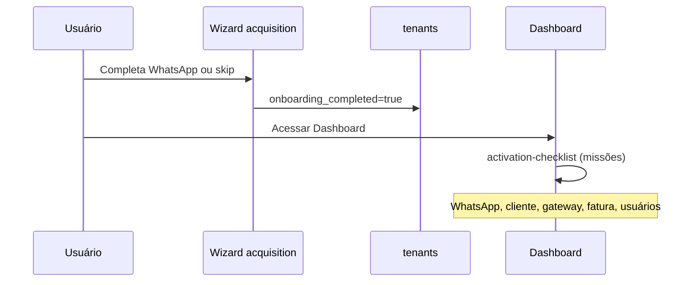

# Auditoria read-only — Ativação pós-onboarding (PainelCRM)

**Data:** 2026-05-28  
**Escopo:** Mapear o que existe hoje após o onboarding operacional de aquisição (`/onboarding/acquisition`), sem alterar código.

**Referências principais:** `packages/backend/src/acquisition/`, `docs/architecture/automation/SUPER_ADMIN_OPERATIONAL_LAYER.md`, `docs/architecture/onboarding/ONBOARDING_ENGINE_ARCHITECTURE.md`, `docs/architecture/MASTER_PLAN_SIGNUP_TRIAL_ONBOARDING_CONVERSION.md`.

---

## 1. Resumo executivo

| Camada | Situação |
|--------|----------|
| **Provisionamento do tenant** | Implementado no fluxo acquisition (senha + empresa); cria tenant + admin + vínculos de perfil/permissões |
| **Onboarding operacional (wizard)** | Implementado: Empresa → Equipe (condicional) → WhatsApp → tela `completed` |
| **Progresso durante wizard** | `activation_progress` na sessão (`acquisition_onboarding_sessions`) |
| **Pós-login no CRM** | `tenants.onboarding_completed` + checklist no dashboard (`DashboardActivationBlock`) |
| **Bootstrap automático de CRM** | **Limitado** — quase nada de funil/kanban/equipe/etiquetas é criado na origem do tenant |
| **Motor onboarding V2 (`onboarding_progress`)** | **Documentado / planejado** — tabela não encontrada em `database/init/` |
| **Kanban operacional Super Admin** | Implementado em **tenant virtual** separado; não é o kanban do cliente |

---

## 2. O que é criado quando um tenant nasce

Há **vários caminhos** de criação de tenant. O fluxo atual de aquisição usa **provisionamento tardio** (tenant nasce no passo de senha do wizard, não no cadastro público inicial).

### 2.1 Fluxo acquisition (`provisionWorkspaceFromSession`)

**Arquivo:** `packages/backend/src/acquisition/acquisitionProvisioningService.ts`

| Recurso | Criado automaticamente? | Detalhe |
|---------|-------------------------|---------|
| **Tenant** (`tenants`) | Sim | `name`, `slug`, `plan_id`, `status` (trial/active), `trial_ends_at`, `billing_email`, `billing_phone`, `cpf_cnpj`, `responsible_name`, `onboarding_completed = false` |
| **Usuário admin** | Sim | Via `createTenantAdminUser()` |
| **profiles** | Sim | `first_name`, `last_name`, `company_name`, `whatsapp_number`, `registration_complete` conforme senha |
| **user_profiles** | Sim | Perfil empresa admin (`is_admin`) |
| **profile_members** | Sim | Admin no perfil |
| **user_roles** | Sim | Role `admin` |
| **user_permissions** | Sim | Permissões do role admin |
| **tenant_plan** | **Não encontrado neste serviço** | Diferente de `authController.register` / `registerOrganization`, que inserem `tenant_plan` |
| **Sessão wizard** | Atualizada | `tenant_id` anexado; `current_step = company`, `activation_progress = 0` |
| **Lead aquisição** | Atualizado | Stage `onboarding_in_progress`, tags operacionais |
| **Notificações plataforma** | Sim (async) | `notifySuperAdminsNewTenant`, `schedulePublishPlatformAccountCreated`, `schedulePublishPlatformTrialStarted` (se trial) |
| **Kickoff onboarding** | Sim (flag) | `kickoffOnboarding()` — workflows + mensagem transacional shadow |

**Não criado neste momento:**

- Pipelines / funis de vendas (`funnels`, `funnel_stages`)
- Boards Kanban do tenant (`chat_kanban_boards`, colunas, cards)
- Equipes (`teams`, `team_members`) — módulo existe, sem seed na origem
- Etiquetas globais de CRM — etiquetas de conversa são por metadata (`kanban_labels` em conversas), sem seed tenant-wide
- Campos personalizados estruturados — usados em tickets/projetos sob demanda, sem bootstrap
- Dashboards pré-montados — dashboard é composição de widgets/consultas, sem seed documentado
- Instância WhatsApp — criada pelo usuário na etapa WhatsApp do wizard (ou depois em Configurações)
- Templates WhatsApp sistema — **não** chamados no provision acquisition (ver §2.3)

### 2.2 Fluxo legado `authController.register`

**Arquivo:** `packages/backend/src/controllers/authController.ts`

Além da estrutura acima (quando cria tenant): `tenant_plan`, e em background `ensureWhatsAppTemplateDefaults(tenantId)` (categorias + templates com `seed_key`).

### 2.3 Templates WhatsApp (tenant)

**Arquivo:** `packages/backend/src/services/whatsappTemplateDefaultsService.ts`

Templates de sistema (transferência, fechamento de conversa, mudança de coluna kanban, lembrete de pagamento, etc.) são inseridos por `ensureWhatsAppTemplateDefaults(tenantId)` — **idempotente por `seed_key`**.

**Disparo automático hoje:** registro legado (`authController`), e rotas de templates ao listar/criar (`whatsappMessageTemplatesController`). **Não** está ligado ao `provisionWorkspaceFromSession` do acquisition.

### 2.4 Financeiro

**Arquivo:** `packages/backend/src/services/financeModuleService.ts`

`ensureDefaultExpenseCategories(tenantId)` — categorias de despesa padrão (Aluguel, Salários, Marketing, …) — executado na **primeira** listagem de categorias do módulo financeiro, não na criação do tenant.

### 2.5 Kanban Super Admin (não é o tenant do cliente)

**Arquivo:** `packages/backend/src/services/superadminOpsKanbanSeedService.ts`

No **tenant virtual** `SUPERADMIN_OPS_KANBAN_TENANT_ID`, no bootstrap do Super Admin:

| Board | Colunas (exemplos) |
|-------|-------------------|
| Aquisição | Novo lead, Qualificado, Iniciou cadastro, Checkout, Checkout abandonado, Trial iniciado, Onboarding incompleto, Ativado, Perdido |
| Recovery | Novo caso, Contato tentado, Em recuperação, Reengajado, Perdido |
| Onboarding | Aguardando kickoff, Em progresso, Incompleto, Ativado |
| Expansão | Oportunidade, Negociação, Expandido |
| Reativação | Inativo detectado, Campanha enviada, Reativado |

Cards operacionais espelham `acquisition_leads` via `syncAcquisitionLeadToOpsKanban` — **visão interna da plataforma**, não o funil comercial do cliente.

### 2.6 Kanban / pipeline do tenant (CRM do cliente)

- Tabelas: `chat_kanban_boards`, `chat_kanban_columns`, `chat_kanban_cards` (migrations D2+).
- **Não há seed automático** de board/colunas ao criar tenant (busca em código: sem `ensureDefault` de kanban tenant).
- Funis clássicos: `funnels` / estágios — criados pelo usuário via `funnelsController`; sem bootstrap na origem.

---

## 3. Mapa da lógica de onboarding / activation / setup

### 3.1 Fluxos de UI (frontend)

| Rota | Papel | Estado |
|------|-------|--------|
| `/cadastro`, `/teste-gratis` | Aquisição pré-signup / trial | Ativo (flags) |
| `/onboarding/acquisition?session=` | Wizard operacional P0 (Empresa, Equipe, WhatsApp) | **Principal pós-checkout/trial** |
| `/onboarding` | Onboarding legado 3 passos (admin, empresa, finalizar) | Legado; `AuthGuard` só força se `VITE_FORCE_LEGACY_ONBOARDING_ROUTE` |
| `/onboarding/kickoff` | Placeholder Sprint 6 | Placeholder apenas |
| `/register/steps` | Cadastro organização legado | Paralelo |
| `/dashboard` | Checklist pós-onboarding | `DashboardActivationBlock` |

**Redirect pós-auth:** `src/utils/superAdminRedirect.ts` — se `onboarding_completed === false` e há `acquisition_onboarding_session` no `sessionStorage`, redireciona para `/onboarding/acquisition`.

### 3.2 Backend — módulo `acquisition/`

| Componente | Função |
|------------|--------|
| `acquisitionProvisioningService` | Cria tenant + admin (provision) |
| `acquisitionOnboardingWizardService` | Passos company / users / whatsapp / skip / complete |
| `acquisitionOnboardingSessionService` | Sessão, token, `loadSessionWithLead` (active **ou** completed para refresh) |
| `acquisitionOnboardingOrchestration` | Eventos wizard → stage lead, ops kanban, workflows, activation events |
| `onboardingKickoffService` | Kickoff pós-provision (workflows + comm shadow) |
| `activationTrackingService` | `acquisition_activation_events` |
| `activationScoreService` | Score `low` / `medium` / `high` / `at_risk` no lead |
| `trialOrchestrationService` / `signupOrchestrationService` | Orquestração pré-wizard |

### 3.3 APIs wizard

| Endpoint | Auth |
|----------|------|
| `GET /api/public/acquisition/onboarding/wizard/:sessionToken` | Público |
| `POST /api/public/acquisition/onboarding/provision` | Público |
| `POST /api/onboarding/wizard/company` | Tenant |
| `POST /api/onboarding/wizard/users` | Tenant |
| `POST /api/onboarding/wizard/whatsapp/complete` | Tenant |
| `GET /api/onboarding/wizard/whatsapp/status` | Tenant |
| `POST /api/onboarding/wizard/skip` | Tenant |
| `GET /api/onboarding/wizard/summary` | Tenant (resumo; fluxo UI atual usa tela `completed` no frontend) |

### 3.4 Conclusão do wizard

**Arquivo:** `completeWizardWhatsappStep` / `skipWizardWhatsappStep` em `acquisitionOnboardingWizardService.ts`

- `acquisition_onboarding_sessions`: `current_step = completed`, `status = completed`, `activation_progress = 100`
- `tenants.onboarding_completed = true`
- `step_data.whatsapp` persistido (instance_id, phone, profile_name, …)
- Eventos: `whatsapp.connected` ou skip; sync ops kanban coluna **Ativado**
- `emitOnboardingWizardEvent` → workflows + tracking

### 3.5 Onboarding legado tenant

**Arquivo:** `packages/backend/src/controllers/onboardingController.ts`

- Define senha / dados empresa em rotas `/api/onboarding/*`
- Marca `tenants.onboarding_completed = true`
- Coexiste com acquisition; produto tende ao wizard acquisition quando há sessão ativa

---

## 4. Progresso de ativação

### 4.1 O que existe no banco / API

| Campo / conceito | Onde | Uso |
|------------------|------|-----|
| **`activation_progress`** (0–100) | `acquisition_onboarding_sessions` | Wizard UI (`ActivationProgressRail`, trackers mobile) |
| **`completed_steps`** | `acquisition_onboarding_sessions` + `metadata_json` | `company`, `users`, `whatsapp` |
| **`current_step`** | Sessão | `provision`, `company`, `users`, `whatsapp`, `completed` |
| **`onboarding_completed`** | `tenants` | Auth, guards, redirect pós-login |
| **`onboarding_state`** | Payload wizard | `active` / `completed` |

**Não implementado em schema:**

- `onboarding_progress` (tabela) — apenas em documentação (`ONBOARDING_ENGINE_ARCHITECTURE.md`, `MASTER_PLAN_...`)
- `setup_progress`, `completion_percentage` genéricos — não encontrados no código de produção

### 4.2 Progresso pós-login (dashboard)

**Arquivo:** `packages/backend/src/services/activationChecklistService.ts`  
**API:** `GET /api/dashboard/activation-checklist`

Calcula `progressPercent` com base em **missões concluídas** (não reutiliza `activation_progress` da sessão):

1. WhatsApp configurado (`chat_instances` connected)
2. Primeiro cliente
3. Gateway de pagamento (Asaas ativo)
4. Primeira fatura
5. Convidar usuários (se plano permite >1 assento)

Dismissal: `profiles.hide_dashboard_activation_checklist`.

---

## 5. Checklist / primeiros passos

| Item | Status | Local |
|------|--------|-------|
| Checklist gamificado no dashboard | **Implementado** | `DashboardActivationBlock.tsx` + `activationChecklistService.ts` |
| Checklist no wizard acquisition | Não — é barra de etapas Empresa/Equipe/WhatsApp |
| Getting started dedicado (`/welcome`) | **Planejado** em MASTER_PLAN; rota não mapeada como produto final |
| Onboarding kickoff UI | **Placeholder** | `OnboardingKickoffPlaceholder.tsx` |
| Tarefas de ativação persistidas | Não — missões derivadas de estado do tenant em tempo real |

---

## 6. Kanban — onde ficam dados e quem cria

### 6.1 Kanban do cliente (tenant)

| Entidade | Tabela | Criação |
|----------|--------|---------|
| Board | `chat_kanban_boards` | Usuário / API `chatKanbanController` |
| Coluna | `chat_kanban_columns` | Usuário / automações de coluna (regras phase2) |
| Card | `chat_kanban_cards` | Conversas, leads internos, automações |
| Etiquetas em card | `chat_conversations.metadata` (`kanban_labels`, prioridade) | Uso operacional no chat |

**Pipeline de vendas clássico:** `funnels` + estágios — independente do chat kanban; manual.

### 6.2 Kanban operacional Super Admin

- **Quem cria estágios:** seed em `SUPERADMIN_OPS_KANBAN_BOARD_SEEDS` + bootstrap `ensureSuperadminOpsKanbanSeed`.
- **Quem move cards:** outbox + `syncAcquisitionLeadToOpsKanban` + automações de coluna (superadmin).
- **Mapeamento wizard → coluna Aquisição:** `acquisitionOnboardingOrchestration.ts` (`Onboarding incompleto`, `Trial iniciado`, `Ativado`).

### 6.3 Enriquecimento no Kanban do tenant

**Arquivo:** `packages/backend/src/services/kanbanCardEnrichmentQuery.ts`

Cards do tenant podem exibir dados do lead de aquisição (`op_activation_score`, etc.) quando vinculados — leitura, não criação de pipeline.

---

## 7. Automações e boas-vindas

### 7.1 Workflows (automation runtime)

| Workflow key | Disparo | Modo típico |
|--------------|---------|-------------|
| `onboarding.kickoff` | Após provision acquisition | Flag `acquisition.onboarding_kickoff_v1`; **shadow** por default |
| `onboarding.first_access` | Idem | Shadow |
| `onboarding.company.completed` | Fim etapa empresa | Via `emitOnboardingWizardEvent` |
| `onboarding.users.completed` | Fim etapa equipe | Idem |
| `whatsapp.connected` | Fim etapa WhatsApp | Idem |
| `acquisition.signup.started` | Signup acquisition | Sprint 6 |
| `acquisition.checkout.abandoned` | Abandono checkout | Recovery |
| `acquisition.trial.recovery` | Recovery trial | Jobs throttled |

Implementação: `startWorkflow()` em `orchestrationService.ts`; consumo passivo / jobs em `automation/`.

### 7.2 Comunicação

| Canal | O quê | Quando |
|-------|-------|--------|
| WhatsApp / email transacional | Mensagem shadow kickoff | `onboardingKickoffService` — corpo placeholder, flag off = não envia de fato |
| Notificações Super Admin | Novo tenant | `notifySuperAdminsNewTenant` |
| Notificações plataforma (tenant) | Conta criada, trial iniciado | `platformBusinessNotifications` |
| WebSocket | `channel.status_changed` | Conexão WhatsApp (pós-instância), não “boas-vindas” |

**Emails automáticos de boas-vindas ao admin:** não mapeado como fluxo dedicado pós-`onboarding_completed`; depende de workflows/flags estarem ON e templates reais (hoje foundation/shadow).

### 7.3 Jobs agendados

- Recovery acquisition: `automation_jobs` (documentado Sprint 6).
- Workers: `runRecurringWorker`, billing, outbox publisher — não específicos “welcome tenant” além dos workflows acima.
- Trial expiring: `platformTrialExpiringNotificationService`.

### 7.4 Outbox / eventos de domínio

- `publishAcquisitionStageChanged`, eventos wizard, passive consumers `opsKanbanAcquisitionHandlers.ts`.
- Bridge workflow ↔ outbox em `outboxWorkflowBridge.ts`.

---

## 8. Feature flags (acquisition)

Todas default **OFF** / shadow em `258_acquisition_foundation_p0.sql`:

- `acquisition.pre_signup_v1`
- `acquisition.signup_flow_v1`
- `acquisition.trial_flow_v1`
- `acquisition.recovery_v1`
- `acquisition.activation_tracking_v1`
- `acquisition.activation_score_v1`
- `acquisition.onboarding_kickoff_v1`
- Kill: `acquisition.master_off`

Impacto: em produção com flags desligadas, tracking/kickoff/workflows podem **não executar** comportamento visível, embora o código exista.

---

## 9. Matriz: existe / parcial / falta

### 9.1 Já existe (implementado e utilizável)

- Wizard operacional acquisition com persistência de sessão e refresh pós-conclusão.
- Provisionamento tenant + admin no passo de senha.
- Progresso percentual **durante** wizard (`activation_progress`).
- Conclusão: `onboarding_completed` + sessão `completed`.
- Checklist pós-login no dashboard (5 missões).
- Tracking de eventos em `acquisition_activation_events` (se flag + tabela).
- Activation score no lead (se flag).
- Ops Kanban Super Admin com pipelines de Aquisição/Recovery/Onboarding.
- Integração wizard → colunas ops + timeline.
- Templates WhatsApp sistema (após primeiro uso de rotas de template ou register legado).
- Categorias financeiras padrão (lazy).
- Redirect inteligente pós-login para retomar sessão acquisition.

### 9.2 Parcialmente implementado

| Área | Gap |
|------|-----|
| **Bootstrap do tenant** | Admin/tenant sim; `tenant_plan` no acquisition provision não confirmado no mesmo serviço |
| **Templates WhatsApp no acquisition** | Não disparados no provision; só em outros fluxos |
| **Kickoff / workflows** | Código pronto; flags shadow → execução efetiva limitada |
| **Mensagem boas-vindas** | Gateway + intent `onboarding`; conteúdo shadow |
| **`onboarding_progress` unificado** | Só documentação; wizard usa `activation_progress` de sessão |
| **Kickoff UI** | Placeholder `/onboarding/kickoff` |
| **Summary vs completed UI** | API `summary` existe; UI final usa step `completed` + `OperationReadyStep` |
| **Foto WhatsApp no refresh** | `step_data` sem URL de avatar; foto só em memória na mesma sessão |
| **Onboarding legado** | Coexiste com acquisition; pode confundir operação |

### 9.3 Falta implementar (produto pós-onboarding “completo”)

- Tabela e motor **`onboarding_progress`** / checkpoints unificados (MASTER / ONBOARDING_ENGINE).
- Seed automático de **funil + estágios** padrão por tenant.
- Seed automático de **board Kanban** comercial inicial.
- Seed de **equipes** padrão.
- Seed de **etiquetas** CRM globais.
- Seed de **campos personalizados** padrão por módulo.
- **Dashboard** inicial pré-configurado (widgets).
- Jornada **getting started** dedicada (`/welcome`) integrada ao mesmo progresso do wizard.
- **E-mail/WhatsApp de boas-vindas** production-ready (templates + flags ON).
- Unificação explícita: progresso wizard 100% → checklist dashboard (hoje são sistemas separados).
- Garantir **`ensureWhatsAppTemplateDefaults`** no mesmo momento do provision acquisition.

---

## 10. Fluxo recomendado para leitura (pós-onboarding do usuário)

---

## 11. Arquivos-chave para manutenção

| Tema | Caminhos |
|------|----------|
| Wizard | `src/pages/AcquisitionOperationalOnboarding.tsx`, `acquisitionOnboardingWizardService.ts` |
| Tela sucesso | `src/components/onboarding/wizard/OperationReadyStep.tsx` |
| Checklist | `activationChecklistService.ts`, `DashboardActivationBlock.tsx` |
| Provision | `acquisitionProvisioningService.ts`, `tenantAdminService.ts` |
| Ops Kanban | `superadminOpsKanbanSeedService.ts`, `superadminOpsKanbanLeadService.ts` |
| Eventos | `acquisitionOnboardingOrchestration.ts`, `onboardingKickoffService.ts` |
| Schema | `262_acquisition_onboarding_sessions.sql`, `263_onboarding_wizard_foundation.sql`, `65_tenants_onboarding_completed.sql` |
| Planejamento | `docs/architecture/onboarding/ONBOARDING_ENGINE_ARCHITECTURE.md` |

---

## 12. Conclusão

O PainelCRM hoje separa bem **três camadas**:

1. **Onboarding de aquisição (pré-CRM):** wizard com `activation_progress` na sessão até `completed`.
2. **Estado do tenant:** `onboarding_completed` libera o CRM.
3. **Ativação contínua no produto:** checklist no dashboard baseado em ações reais (WhatsApp, cliente, pagamentos, equipe).

O que **não** acontece automaticamente na origem do tenant é a montagem do **ambiente comercial** (funil, kanban do cliente, equipes, etiquetas, dashboards). Isso permanece sob responsabilidade do usuário após o login, com apoio do checklist.

A **visão operacional interna** (Super Admin Kanban) está mais madura que a **experiência pós-onboarding in-app** documentada no MASTER_PLAN (`onboarding_progress`, `/welcome`, kickoff real).

**Nenhum código foi alterado nesta auditoria.**
