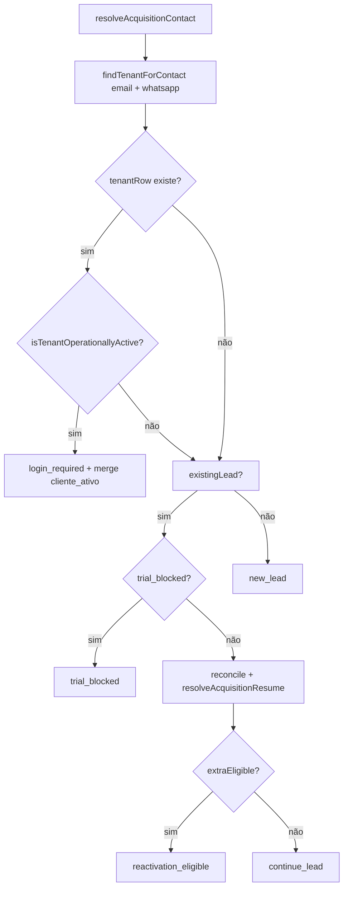

# Auditoria read-only — Bloqueio "operação ativa" após exclusão de tenant

**Data:** 2026-06-03  
**Escopo:** `POST /api/public/acquisition/contact/resolve`  
**Restrição:** sem alteração de código, banco ou migrations.  
**Ambiente consultado:** PostgreSQL `painelcrm` (container `painelcrm_postgres`, host `localhost:5433`).

**E-mails de referência do teste (documentação e leads existentes):**

| E-mail | Lead ID | Telefone no lead |
|--------|---------|------------------|
| `kssantoss@hotmail.com` | `5d0e980d-0f16-4a98-9233-d79874825c29` | `5511981169950` |
| `kssantos@hotmail.com` | `591a0100-2f5e-45e2-af50-9167efe4612d` | `5511981169950` |

---

## Resumo executivo

| Pergunta | Resposta |
|----------|----------|
| A exclusão do tenant deixa `users`/`tenants` para o e-mail do teste? | **Não** — não há linhas em `users` nem `tenants` para esses e-mails nem para o tenant `f3da05e6-…` citado no metadata do lead `kssantos@hotmail.com`. |
| Por que ainda pode aparecer **"operação ativa"**? | A mensagem só é emitida com `action: login_required`, quando `findTenantForContact` encontra um **user + tenant ativo/trial válido**. Hoje isso ocorre por **colisão de WhatsApp** com outro tenant (`agenciadev`), não pelo tenant excluído. |
| É resíduo da exclusão? | **Parcialmente:** `acquisition_leads` e `metadata_json` (`blocked_reason`, `cliente_ativo`, `tenant_id` fantasma) **não são limpos** na exclusão. Isso **não** dispara `login_required` sozinho, mas confunde diagnóstico. |
| É bug de reconciliação P0-D? | **Não** para este sintoma — P0-D reconcilia estágio/sessão do lead, não a ramificação `login_required`. |

---

## 1. Qual `action` é retornada?

A mensagem exibida no cadastro:

> *"Encontramos uma operação ativa vinculada a este e-mail. Faça login para continuar."*

corresponde **exclusivamente** a:

```text
action = login_required
```

Definida em `acquisitionContactIntelligenceService.ts` (retorno ~L111–115).

**Outras actions possíveis no mesmo endpoint:**

| `action` | Mensagem típica | Quando |
|----------|-----------------|--------|
| `new_lead` | Lead registrado. | E-mail novo, sem tenant ativo na consulta |
| `continue_lead` | Continuando de onde você parou. / Retomando… | Lead existente, tenant inativo ou ausente na consulta |
| `reactivation_eligible` | Conta anterior inativa… | Tenant inativo + elegível a trial extra |
| `trial_blocked` | Período de avaliação adicional já utilizado… | Limite de reativação |

**Estado atual do banco (simulação da consulta decisiva):**

- E-mail `kssantoss@hotmail.com` + WhatsApp **`5511981169950`** (como gravado no lead): consulta `findTenantForContact` → **0 linhas** → hoje tende a **`continue_lead`**, não `login_required`.
- Mesmo e-mail + WhatsApp **`11981169950`** (11 dígitos, sem DDI): consulta → **1 linha** (`contatos@agenciadev.com.br`, tenant `agenciadev`, `status = active`) → **`login_required`**.

> O endpoint **não** usa `buildWhatsappLookupDigitVariants` (que normaliza 55↔11). A comparação é **igualdade exata** de dígitos após `regexp_replace`.

---

## 2. Decisão completa — `acquisitionContactIntelligenceService.ts`

### Fluxo (ordem de avaliação)



### 2.1 `findTenantForContact` — L45–69

| Item | Detalhe |
|------|---------|
| **Método** | `findTenantForContact(email, whatsappDigits)` (privado) |
| **SQL** | `users` **INNER JOIN** `tenants` ON `u.tenant_id = t.id` |
| **Filtro** | `lower(btrim(u.email)) = $1` **OU** dígitos do WhatsApp **iguais** a `$2` (mín. 10 caracteres na condição OR) |
| **Ordenação** | `u.created_at DESC LIMIT 1` |
| **Não filtra** | `deleted_at`, `archived_at` (colunas **inexistentes** em `tenants`), tenant “soft-deleted”, lead, sessão |

### 2.2 `isTenantOperationallyActive` — L72–78

| `tenants.status` | Considerado ativo? |
|------------------|-------------------|
| `active` | **Sim** |
| `trial` + `trial_ends_at` null | **Sim** |
| `trial` + `trial_ends_at` ≥ agora | **Sim** |
| `trial` expirado, `suspended`, etc. | **Não** → cai no fluxo de lead existente / reativação |

### 2.3 Ramo **"operação ativa"** — L90–115

| Item | Valor |
|------|-------|
| **Condição** | `tenantRow && isTenantOperationallyActive(tenantRow)` |
| **Action** | `login_required` |
| **Mensagem** | `Encontramos uma operação ativa vinculada a este e-mail…` |
| **Efeito colateral** | `mergeAcquisitionLeadMetadata`: `operational_tags: ['cliente_ativo']`, e no upsert `blocked_reason: 'active_tenant'`, `tenant_id: <tenant encontrado>` |

**Motivo lógico:** existe **pelo menos um** registro em `users` ligado a um `tenants` cuja combinação email **ou** WhatsApp bate com a entrada **e** o status do tenant é operacionalmente ativo.

---

## 3. `users` (e-mails de teste e WhatsApp do lead)

### Por e-mail exato

```sql
SELECT id, email, tenant_id, is_super_admin, created_at
FROM users
WHERE lower(btrim(email)) IN ('kssantoss@hotmail.com', 'kssantos@hotmail.com');
```

**Resultado:** `(0 rows)`

> A tabela `users` **não** possui coluna `active`; campos relevantes: `id`, `email`, `tenant_id`, `whatsapp_number`, `is_super_admin`, `created_at`.

### Por WhatsApp do lead (`5511981169950` vs `11981169950`)

| Dígitos na requisição | Match em `users`? | Registro que participa da decisão |
|----------------------|-------------------|----------------------------------|
| `5511981169950` | **Não** | — |
| `11981169950` | **Sim** | `49afa5dd-4f1e-4e11-9346-c097d09b1a45` / `contatos@agenciadev.com.br` / tenant `1b566529-7f03-4356-82e9-71d7adfd54d7` |

---

## 4. `profiles`

Para usuários dos e-mails de teste: **nenhum** (`profiles` cascata com `users`).

Para o usuário que **bloqueia via WhatsApp** (`49afa5dd-…`):

| id | company_name | registration_complete |
|----|--------------|------------------------|
| `49afa5dd-4f1e-4e11-9346-c097d09b1a45` | `agenciadev` | `true` |

---

## 5. `user_profiles`

| id | owner_id | name |
|----|----------|------|
| `ad92f936-ab0c-4277-9496-48d866f07eeb` | `49afa5dd-4f1e-4e11-9346-c097d09b1a45` | `agenciadev` |

(Nenhum vínculo aos e-mails `kssant*@hotmail.com`.)

---

## 6. `profile_members`

Consulta pelos `user_id` dos e-mails/`kssant` WhatsApp: **`(0 rows)`** para os leads de teste.  
(Membros do tenant `agenciadev` existem para outros usuários, fora do escopo do bloqueio por e-mail de teste.)

---

## 7. `tenants`

Colunas relevantes em `public.tenants`: `id`, `name`, `slug`, `status`, `trial_ends_at`, … — **sem** `deleted_at` / `archived_at`.

### Tenant referenciado no metadata do lead (pós-exclusão)

Lead `kssantos@hotmail.com` → `metadata_json.tenant_id = f3da05e6-0ed5-4abb-9544-d669d01a2b33`

```sql
SELECT id, status, slug FROM tenants WHERE id = 'f3da05e6-0ed5-4abb-9544-d669d01a2b33';
```

**Resultado:** `(0 rows)` — exclusão física (`DELETE`) conforme `tenantDeletionService.ts`.

### Tenants ainda no banco (amostra)

| id | name | slug | status |
|----|------|------|--------|
| `1b566529-…` | agenciadev | agenciadev | **active** |
| `4ecc0b33-…` | Agência Dev | agencia-dev | active |
| … | … | … | … |

**Participante da decisão “operação ativa” hoje:** tenant **`1b566529-7f03-4356-82e9-71d7adfd54d7`** via usuário `contatos@agenciadev.com.br` e WhatsApp `11981169950`.

---

## 8. `acquisition_leads`

| email | current_stage | selected_plan_id | tenant_id (coluna) | metadata relevante |
|-------|---------------|------------------|--------------------|--------------------|
| `kssantoss@hotmail.com` | `plan_selected` | `d84c4bb5-…` | `null` | `operational_tags`: `cliente_ativo`, `retomado` |
| `kssantos@hotmail.com` | `onboarding_in_progress` | `d84c4bb5-…` | `null` | `blocked_reason`: **`active_tenant`**, `tenant_id`: **`f3da05e6-…`** (fantasma), `cliente_ativo`, token de sessão |
| `kssantosss@hotmail.com` | `onboarding_active` | `d84c4bb5-…` | `null` | sessão `completed`, sem tenant na sessão |

**Observação:** `blocked_reason: active_tenant` no metadata é **histórico** (gravado no ramo `login_required` quando o tenant ainda existia). **Não é relido** na decisão do próximo `contact/resolve`.

---

## 9. `acquisition_onboarding_sessions`

| session_token | status | tenant_id | acquisition_lead_id |
|---------------|--------|-----------|---------------------|
| `6opvMrtRkZR0I81BDnD_GJdtf5iiFct0` | completed | `null` | `591a0100-…` (`kssantos@hotmail.com`) |
| `gR2Z1ry79a2TadvkT8DYfR4Dl66fSiHx` | completed | `null` | `ad49160c-…` |

Lead `kssantoss@hotmail.com`: **sem sessão** na tabela.

Sessões **não** entram na query `findTenantForContact`.

---

## 10. Consulta que conclui "operação ativa"

### SQL exato (equivalente ao código)

```sql
SELECT t.id::text AS tenant_id, t.status, t.trial_ends_at::text
FROM users u
INNER JOIN tenants t ON t.id = u.tenant_id
WHERE lower(btrim(u.email)) = $email_normalized
   OR (
     $whatsapp_digits IS NOT NULL
     AND length($whatsapp_digits) >= 10
     AND regexp_replace(COALESCE(u.whatsapp_number, ''), '\D', '', 'g') = $whatsapp_digits
   )
ORDER BY u.created_at DESC
LIMIT 1;
```

### Registros que participam **hoje** (cenário que reproduz bloqueio)

Entrada típica do formulário com o mesmo celular do lead, **sem DDI 55**:

| Papel | Tabela | Valor |
|-------|--------|-------|
| Usuário encontrado | `users` | `49afa5dd-…`, email `contatos@agenciadev.com.br`, `whatsapp_number` → dígitos `11981169950` |
| Tenant ativo | `tenants` | `1b566529-…`, `status = active` |
| Lead upsertado | `acquisition_leads` | e-mail do teste (`kssant*`), tags atualizadas para `cliente_ativo` |

**Não participam:** tenant excluído `f3da05e6-…`, `profiles` dos e-mails de teste (inexistentes).

### Exclusão de tenant — o que remove e o que fica

`deleteTenantWithDependencies` (`tenantDeletionService.ts`):

1. `DELETE` kanban boards do tenant  
2. `DELETE FROM users WHERE tenant_id = …` (cascade em `profiles`, `user_profiles`, `profile_members`)  
3. `DELETE FROM tenants WHERE id = …`  

**Não remove:** `acquisition_leads`, `acquisition_onboarding_sessions`, metadata com `tenant_id` / `blocked_reason`.

---

## 11. Conclusão por cenário

### Cenário A — Bloqueio **com** mensagem "operação ativa" **após** excluir o tenant do e-mail de teste

| Hipótese | Veredito |
|----------|----------|
| Resíduo de `users`/`tenants` do tenant excluído | **Descartada** no banco atual |
| Resíduo em `acquisition_leads` dispara bloqueio | **Descartada** — metadata não é entrada da decisão |
| **Colisão de WhatsApp** com outro tenant ativo (`agenciadev`) | **Confirmada** quando `$whatsapp_digits = '11981169950'` |
| Comportamento esperado pelo código atual | **Sim** — OR email/WhatsApp sem escopo de tenant do lead |
| Bug de reconciliação P0-D | **Não** |

### Cenário B — E-mail `kssantoss@hotmail.com`, telefone `5511981169950` (como no lead)

Consulta tenant → vazio → fluxo **`continue_lead`** (não mensagem de operação ativa).  
Se o usuário **ainda** vê bloqueio, validar no DevTools o JSON de `contact/resolve` (`action`) e o **telefone enviado** no POST (com/sem `55`).

### Cenário C — Momento **antes** da exclusão

`login_required` com `blocked_reason: active_tenant` no metadata de `kssantos@hotmail.com` é **consistente** com tenant `f3da05e6-…` existente e usuário com o mesmo e-mail/WhatsApp — comportamento esperado **na época**.

---

## 12. Evidências recomendadas no próximo teste manual

1. Network → `contact/resolve` → campos `action`, `message`, `resume_verified`.  
2. Corpo do POST → `phone` exatamente como enviado (comparar com tabela acima).  
3. SQL rápido:

```sql
SELECT u.email, t.name, t.status,
       regexp_replace(COALESCE(u.whatsapp_number,''), '\D', '', 'g') AS wa
FROM users u
JOIN tenants t ON t.id = u.tenant_id
WHERE lower(btrim(u.email)) = '<email-do-teste>'
   OR regexp_replace(COALESCE(u.whatsapp_number,''), '\D', '', 'g') = '<digitos-do-phone-no-post>';
```

---

## 13. Referências de código

| Arquivo | Responsabilidade |
|---------|------------------|
| `packages/backend/src/acquisition/acquisitionContactIntelligenceService.ts` | `resolveAcquisitionContact`, `findTenantForContact`, `isTenantOperationallyActive` |
| `packages/backend/src/controllers/acquisitionController.ts` | `postContactResolve` — expõe JSON |
| `packages/backend/src/services/tenantDeletionService.ts` | Exclusão física tenant + users |
| `packages/backend/src/utils/userIdentity.ts` | `normalizeWhatsappDigits` (sem variantes 55 no contact resolve) |

---

**Classificação final:** o bloqueio **não** é causado por tenant excluído permanecer ativo em `tenants`/`users`; no estado atual do banco, é **colisão de identidade por WhatsApp** (ou bloqueio **histórico** válido antes da exclusão). Melhorias futuras (fora desta auditoria): limpar `acquisition_leads` na exclusão, usar variantes de dígitos de forma **consistente** ou restringir match de WhatsApp ao e-mail do mesmo tenant, e não atribuir `cliente_ativo` quando o match foi só por telefone de outra operação.
