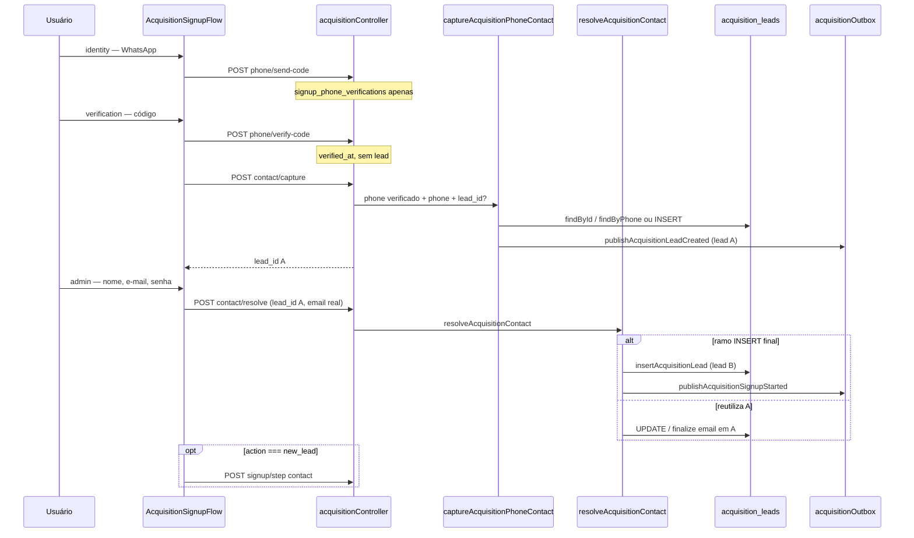

# AUDIT_DUPLICATE_ACQUISITION_LEADS_AFTER_PHONE_VERIFICATION

**Modo:** READ ONLY  
**Data:** 2026-06-12  
**Sintoma:** Ao informar o telefone aparece um lead no Kanban Ops; após confirmar o código WhatsApp surge um segundo `acquisition_lead` para o mesmo contato, em vez de reutilizar o original.

**Escopo:** investigação estática do código + queries sugeridas — sem alterações.

---

## Resumo executivo

| Pergunta | Resposta |
|----------|----------|
| Qual função cria o **primeiro** `acquisition_lead`? | `captureAcquisitionPhoneContact` → `insertAcquisitionLead` (se não houver lead por `lead_id`/`phone`). Disparada por `POST /contact/capture` **após** `verify-code` bem-sucedido. |
| O telefone digitado (send-code) cria lead? | **Não.** `sendSignupPhoneVerificationCode` só grava em `signup_phone_verifications`. |
| `phone/verify-code` cria lead? | **Não.** Apenas marca `verified_at` na verificação. |
| Qual função cria o **segundo** lead? | **`resolveAcquisitionContact`** → `upsertAcquisitionLeadContact` → `insertAcquisitionLead` no ramo final (linhas 237–250), quando o lead com e-mail placeholder não é reutilizado. |
| `contact.resolve` reutiliza ou cria? | **Ambos.** Reutiliza por `lead_id`, `phone` ou `email`; pode **inserir** novo registro se `existingLead` e `contextLead` (não-pending) forem nulos. |
| Existe dedupe por telefone? | **Parcial.** `findAcquisitionLeadByPhone` na captura; **sem UNIQUE** em `acquisition_leads.phone`. `upsertAcquisitionLeadContact` deduplica **só por e-mail**. |
| Existe dedupe por `correlation_id`? | **Não** — apenas índice; não usado em upsert/dedupe. |
| `publishAcquisitionLeadCreated` dispara de novo no verify? | **Não** no verify. Pode haver **segundo sync** via `publishAcquisitionSignupStarted` / `syncAcquisitionLeadOpsKanbanProfile` no `contact/resolve`. |
| Regressão K8.2? | **Não para leads duplicados.** K8.2 afeta **cards** Kanban (`chat_kanban_cards`), não `acquisition_leads`. Pode amplificar percepção de “dois leads” se forem **dois cards** (um por lead). |
| Primeiro ponto onde o **ID do lead muda**? | Etapa **admin** → `POST /contact/resolve` quando cai no INSERT final de `resolveAcquisitionContact` (~L237), ou antes se `lead_id`/`phone` não resolverem o lead A. |

**Classificação:** **C)** `contact.resolve` insere novo lead + **D)** dedupe só por e-mail + **E)** lookup de telefone sem variantes DDI + **F)** `finalizeAcquisitionLeadEmail` ignorado quando já existe outro lead com o mesmo e-mail real.

**Veredito:** o segundo registro **é um novo `acquisition_lead`**, não “apenas um card”. O evento que mais provavelmente dispara a duplicação é **`POST /contact/resolve`** na etapa do administrador principal (não o `verify-code` em si).

---

## 1. Timeline esperada vs real

### Esperado

```text
Telefone + código OK
  → 1 acquisition_lead (telefone verificado)
  → current_stage = contact_captured
  → e-mail real na etapa admin (finalize no mesmo ID)
  → qualificado após plano (lead.qualified / plan_selected)
  → recuperação/trial só para leads qualificados
```

### Real (sintoma reportado)

```text
Telefone informado → card/lead A no Kanban        ← ver nota de timing abaixo
Código confirmado  → lead B criado
Dois acquisition_leads coexistem para o mesmo contato
```

### Nota de timing (correção importante)

No código **atual** (E2 + E2.6), o **primeiro** `acquisition_lead` **não** nasce em `POST /phone/send-code`. Nasce em:

```text
POST /phone/verify-code  (OK)
  → captureVerifiedPhoneContact()
  → POST /contact/capture
  → captureAcquisitionPhoneContact()
  → insertAcquisitionLead + publishAcquisitionLeadCreated
```

Se o Kanban mostra card **antes** do admin, é porque o sync ocorre **logo após o capture pós-verificação**, não na digitação inicial do telefone. A percepção “ao informar o telefone” pode ser “ao concluir a etapa do WhatsApp”.

---

## 2. Mapa de endpoints e funções

| Ordem | Endpoint | Service | Cria `acquisition_lead`? | Eventos / sync Ops |
|-------|----------|---------|--------------------------|-------------------|
| 1 | `POST /phone/send-code` | `sendSignupPhoneVerificationCode` | Não | — |
| 2 | `POST /phone/verify-code` | `verifySignupPhoneCode` | Não | — |
| 3 | `POST /contact/capture` | `captureAcquisitionPhoneContact` | **Sim (lead A)** se novo | `publishAcquisitionLeadCreated` → outbox `acquisition.lead.created` ou fallback sync |
| 4 | `POST /contact/resolve` | `resolveAcquisitionContact` | **Pode (lead B)** | `publishAcquisitionSignupStarted` + `syncAcquisitionLeadOpsKanbanProfile` |
| 5 | `POST /signup/step` (`contact`) | `orchestrateSignupStep` → `resolveAcquisitionContact` | Só se `!lead` → `createPreSignupLead` | `publishAcquisitionSignupStarted`, `publishAcquisitionStageChanged` |

**Rotas:** `packages/backend/src/routes/acquisitionPublicRoutes.ts`  
**Controller:** `packages/backend/src/controllers/acquisitionController.ts`  
**Frontend:** `src/pages/AcquisitionSignupFlow.tsx` (`handleNext` por `wizardStep`)

---

## 3. Fluxo detalhado (frontend → backend)



### Trechos críticos do frontend

**Após verificação** — capture obrigatório:

```366:389:src/pages/AcquisitionSignupFlow.tsx
  async function captureVerifiedPhoneContact(): Promise<string | null> {
    ...
    const captureRes = await apiClient.post<{ ok: boolean; lead_id?: string; error?: string }>(
      '/api/public/acquisition/contact/capture',
      {
        name: ACQUISITION_CAPTURE_NAME_PLACEHOLDER,
        phone: form.lead_phone.replace(/\D/g, ''),
        lead_id: leadId || urlLeadId || undefined,
        phone_verification_id: phoneVerificationId,
      },
    );
```

**Etapa admin** — resolve com e-mail real:

```557:602:src/pages/AcquisitionSignupFlow.tsx
        const resolveRes = await apiClient.post<...>('/api/public/acquisition/contact/resolve', {
          name: form.lead_name.trim(),
          email: form.lead_email.trim(),
          phone: form.lead_phone.replace(/\D/g, ''),
          lead_id: leadId || urlLeadId || undefined,
        });
        ...
        if (resolveRes.data?.action === 'new_lead') {
          const body = await postSignupStep('contact');
```

---

## 4. Primeiro lead — `captureAcquisitionPhoneContact`

**Arquivo:** `packages/backend/src/acquisition/acquisitionPhoneCaptureService.ts`

| Passo | Comportamento |
|-------|----------------|
| Lookup | `findAcquisitionLeadById(leadId)` → senão `findAcquisitionLeadByPhone(phoneDigits)` |
| Reuso | Atualiza stage/metadata; **não** emite `lead.created` de novo |
| Novo | `insertAcquisitionLead` com `email = pending+{digits}@signup.painelcrm.local`, `stage = contact_captured` |
| Evento | `publishAcquisitionLeadCreated(lead)` (L87) |

```63:88:packages/backend/src/acquisition/acquisitionPhoneCaptureService.ts
  const placeholderEmail = pendingSignupEmailFromPhoneDigits(phoneDigits);
  ...
  lead = await insertAcquisitionLead({ ... stage: 'contact_captured', ... });
  ...
  void publishAcquisitionLeadCreated(lead);
```

**Gate:** `postContactCapture` exige `assertSignupPhoneVerified` — não há capture sem código confirmado (`acquisitionController.ts` L128–140).

---

## 5. Segundo lead — `resolveAcquisitionContact`

**Arquivo:** `packages/backend/src/acquisition/acquisitionContactIntelligenceService.ts`

### Ordem de decisão

1. `contextLead` ← `leadId` ou `findAcquisitionLeadByPhone(phone)`
2. Se `contextLead` com e-mail placeholder → tenta `finalizeAcquisitionLeadEmail` **somente se** não existir outro lead com o mesmo e-mail real (L121–127)
3. `existingLead` ← `findAcquisitionLeadByEmail(email)` ou `contextLead` (se e-mail já não for placeholder)
4. Se `existingLead` → upsert + `continue_lead` / `reactivation_eligible` (reuso)
5. Se `contextLead` com e-mail **já finalizado** → upsert (L223–234), `action: new_lead` (mesmo ID)
6. **Ramo duplicação:** L237–250 → `upsertAcquisitionLeadContact` → **`insertAcquisitionLead`** porque e-mail real ainda não existe na base

```237:250:packages/backend/src/acquisition/acquisitionContactIntelligenceService.ts
  const lead = await upsertAcquisitionLeadContact({
    name: input.name,
    email,
    phone: input.phone,
    ...
    stage: 'contact_captured',
    metadata: { operational_tags: ['novo'] },
  });
  await afterContactProfileResolved(lead, input.correlationId, 'new_lead');
  return { action: 'new_lead', lead, message: 'Lead registrado.' };
```

### Quando o ramo L237 é alcançado (lead B)

| Condição | Efeito |
|----------|--------|
| `lead_id` ausente na URL/estado **e** `findAcquisitionLeadByPhone` falha | `contextLead = null` |
| Telefone armazenado com DDI (`5511…`) vs busca sem DDI (`11…`) | lookup falha — **sem variantes** em `findAcquisitionLeadByPhone` |
| `contextLead` ainda com e-mail `pending+…` | bloco L223 **não** roda (`!isPendingSignupEmail` exigido) |
| `existingLead` null (e-mail real novo na base) | bloco L161 **não** roda |
| `finalizeAcquisitionLeadEmail` **não** executado | e-mail placeholder permanece até o INSERT |

### `upsertAcquisitionLeadContact` — dedupe só por e-mail

```153:159:packages/backend/src/acquisition/acquisitionLeadRepository.ts
  const existing = await findAcquisitionLeadByEmail(input.email);
  if (!existing) {
    return insertAcquisitionLead({ ... });  // novo UUID
  }
```

**Não há** `findAcquisitionLeadByPhone` no upsert. Dois leads com o mesmo telefone e e-mails diferentes (placeholder vs real) são **válidos** no schema atual.

---

## 6. Respostas às perguntas da auditoria

| # | Pergunta | Resposta |
|---|----------|----------|
| 1 | Primeiro lead — qual função? | `captureAcquisitionPhoneContact` → `insertAcquisitionLead` |
| 2 | Segundo lead após verify? | Verify **não** cria; o segundo nasce em **`resolveAcquisitionContact`** (admin / `contact/resolve`), não no verify |
| 3 | `contact.resolve` reutiliza? | Sim, se `lead_id`, telefone ou e-mail resolverem; senão **INSERT** |
| 4 | `capturePhone` / `insertAcquisitionLead` mais de uma vez? | Capture pode reusar; **insert** ocorre 1× no capture + potencial 2× no resolve |
| 5 | Dedupe telefone / correlation_id? | Telefone: lookup frágil, sem UNIQUE; correlation_id: **sem dedupe** |
| 6 | Corrida outbox vs sync direto? | Possível **dois syncs** (capture + resolve) para **IDs diferentes**; não cria segundo lead sozinho |
| 7 | Fallback cria lead de novo? | `syncLeadToOpsKanbanFallback` só sincroniza card; `createPreSignupLead` no `signup/step` se `!lead` (caminho raro pós-resolve) |
| 8 | `phone.verify` emite `lead.created`? | **Não** |
| 9 | `signup.started` cria lead? | **Não** — publica evento + sync; lead já deve existir |
| 10 | Eventos entre verify e resolve? | verify: nenhum domínio; capture: `acquisition.lead.created`; resolve: `acquisition.signup.started` + sync perfil |

### Perguntas finais

| # | Resposta |
|---|----------|
| Segundo lead é novo `acquisition_lead` ou só card? | **Novo `acquisition_lead`** no ramo INSERT de `resolveAcquisitionContact` / `upsertAcquisitionLeadContact` |
| Evento exato da duplicação? | **`POST /contact/resolve`** com `action: new_lead` após INSERT (tipicamente etapa admin) |
| Regressão K8.2? | **Não** na tabela `acquisition_leads`; K8.2 trata card único por lead no Kanban |
| Primeiro ponto onde o ID muda? | **`resolveAcquisitionContact` L237–250** (ou antes, se `lead_id` nunca foi propagado e capture criou A sem vínculo no resolve) |

---

## 7. Outbox, sync Ops e possível confusão com “dois no Kanban”

**Arquivo:** `packages/backend/src/acquisition/acquisitionOutbox.ts`

| Evento | Quando | Sync Ops |
|--------|--------|----------|
| `acquisition.lead.created` | Após capture (lead A) | Handler + fallback → `syncAcquisitionLeadToOpsKanban` |
| `acquisition.signup.started` | Após `contact/resolve` | Idem |
| `syncAcquisitionLeadOpsKanbanProfile` | Direto em capture (reuso) e resolve | Sem outbox |

Se existirem **dois** `acquisition_lead_id`, o Kanban pode ter **dois cards** (antes de K8.2: duplicata por board; após K8.2: um ativo + outro arquivado ou race). Isso **não** substitui a duplicação na tabela de leads.

**Corrida outbox + fallback:** mesmo lead, dois syncs concorrentes → risco de **cards** duplicados (auditado em `AUDIT_DUPLICATE_OPS_LEAD_CARDS`), não de dois UUIDs em `acquisition_leads`.

---

## 8. Regra de negócio — qualificado vs não verificado

| Regra | Estado no código |
|-------|------------------|
| Lead só qualificado após confirmar telefone | **Parcialmente alinhado:** capture exige `phone_verification_id` verificado; stage permanece `contact_captured`, não existe stage `qualified` no enum |
| Transição `lead` → `qualified` | Lifecycle: `inferLifecycleEventFromAcquisitionSync` emite `lead.qualified` quando `signupStep === 'plan'` (`lifecycleStageMapping.ts` L12) |
| Recuperação / trial só qualificados | `acquisitionRecoveryService` inclui `contact_captured` em estágios elegíveis — lead com placeholder ainda entra se já capturado pós-verify |
| Números não verificados fora de automações | **Alinhado no capture gate**; send-code sozinho não cria lead |

**Gap:** lead A com e-mail placeholder já sincronizado no Ops antes do admin; lead B com e-mail real pode parecer “segundo lead qualificado” enquanto A fica órfão.

---

## 9. Schema e constraints

**Migration:** `database/init/258_acquisition_foundation_p0.sql`

| Constraint | Presente? |
|------------|-----------|
| UNIQUE `email` | **Não** (apenas índice `lower(email)`) |
| UNIQUE `phone` | **Não** |
| UNIQUE `correlation_id` | **Não** |

Duplicata por telefone é **permitida** pelo banco.

---

## 10. Queries sugeridas (produção)

```sql
-- Duplicatas por telefone (mesmos dígitos)
SELECT regexp_replace(COALESCE(phone, ''), '\D', '', 'g') AS phone_digits,
       COUNT(*) AS lead_count,
       array_agg(id ORDER BY created_at) AS lead_ids,
       array_agg(email ORDER BY created_at) AS emails,
       array_agg(current_stage::text ORDER BY created_at) AS stages,
       array_agg(created_at ORDER BY created_at) AS created_ats
FROM acquisition_leads
WHERE phone IS NOT NULL
GROUP BY 1
HAVING COUNT(*) > 1
ORDER BY MAX(created_at) DESC
LIMIT 20;

-- Par suspeito: placeholder + e-mail real
SELECT a.id AS lead_a_id, a.email AS email_a, a.created_at AS created_a,
       b.id AS lead_b_id, b.email AS email_b, b.created_at AS created_b,
       a.correlation_id AS corr_a, b.correlation_id AS corr_b
FROM acquisition_leads a
JOIN acquisition_leads b
  ON regexp_replace(COALESCE(a.phone, ''), '\D', '', 'g')
   = regexp_replace(COALESCE(b.phone, ''), '\D', '', 'g')
 AND a.id <> b.id
WHERE a.email LIKE 'pending+%@signup.painelcrm.local'
  AND b.email NOT LIKE 'pending+%@signup.painelcrm.local'
ORDER BY b.created_at DESC
LIMIT 20;

-- Cards Ops por lead
SELECT kc.id AS card_id, kc.acquisition_lead_id, kc.archived_at,
       al.email, al.phone, al.current_stage, al.created_at
FROM chat_kanban_cards kc
JOIN acquisition_leads al ON al.id = kc.acquisition_lead_id
WHERE kc.acquisition_lead_id IS NOT NULL
ORDER BY al.phone, kc.created_at DESC;

-- correlation_id divergente no mesmo telefone
SELECT phone, correlation_id, id, email, created_at
FROM acquisition_leads
WHERE regexp_replace(COALESCE(phone, ''), '\D', '', 'g') = '<PHONE_DIGITS>'
ORDER BY created_at;
```

**Padrão esperado no bug:** lead A `pending+…@signup.painelcrm.local`, `created_at` logo após capture; lead B e-mail real, `created_at` na etapa admin; `correlation_id` **diferente**; card ativo provavelmente no B (último sync).

---

## 11. Causa raiz (síntese)

```text
                    ┌─────────────────────────────────────┐
                    │  Lead A: capture pós-verify-code      │
                    │  email = pending+phone@…            │
                    │  publishAcquisitionLeadCreated      │
                    └─────────────────┬───────────────────┘
                                      │
                    ┌─────────────────▼───────────────────┐
                    │  Admin: contact/resolve             │
                    │  lead_id perdido OU phone mismatch  │
                    │  OU finalize email bloqueado        │
                    │  OU contextLead ainda pending       │
                    └─────────────────┬───────────────────┘
                                      │
                    ┌─────────────────▼───────────────────┐
                    │  upsertAcquisitionLeadContact         │
                    │  findByEmail(real) → null           │
                    │  → insertAcquisitionLead (Lead B)   │
                    └─────────────────────────────────────┘
```

**Hipótese dominante:** falha de **reconciliação lead A (placeholder) → e-mail real** em `resolveAcquisitionContact`, combinada com **dedupe exclusivamente por e-mail** e **lookup de telefone sem variantes DDI 55**.

**Hipótese amplificadora (UX):** `lead_id` não persistido na URL imediatamente após capture em todos os caminhos (estado React vs `?lead=`), aumentando chance de resolve sem `contextLead`.

---

## 12. Arquivos auditados

| Arquivo | Linhas / papel |
|---------|----------------|
| `acquisitionPhoneCaptureService.ts` | L21–88 — primeiro INSERT |
| `signupPhoneVerificationService.ts` | L66–201 — verify sem lead |
| `acquisitionContactIntelligenceService.ts` | L102–250 — resolve + INSERT duplicado |
| `acquisitionLeadRepository.ts` | L53–65 phone lookup; L144–193 upsert por e-mail |
| `signupOrchestrationService.ts` | L27–71 `createPreSignupLead`; L106–156 orchestrate |
| `acquisitionOutbox.ts` | L51–113 eventos e fallback sync |
| `acquisitionController.ts` | L121–168 capture; L240–264 verify; L270–305 resolve |
| `acquisitionPublicRoutes.ts` | Rotas públicas |
| `AcquisitionSignupFlow.tsx` | L332–609 fluxo wizard |
| `acquisitionPendingEmail.ts` | Placeholder `pending+{digits}@…` |
| `opsKanbanAcquisitionHandlers.ts` | Sync passivo por evento |

---

## 13. Relação com auditorias anteriores

| Auditoria | Relação |
|-----------|---------|
| `AUDIT_SIGNUP_WIZARD_LOOP_AND_LEAD_NAME` | Mesmo fluxo capture com placeholder "Solicitante"; sync precoce no Kanban |
| `AUDIT_DUPLICATE_OPS_LEAD_CARDS` | Duplicata de **cards** no mesmo lead (K8.2); ortogonal a duplicata de **leads** |
| `AUDIT_OPS_LEAD_SYNC_STOPPED_AFTER_K8_2` | Deadlock no sync; não cria segundo `acquisition_lead` |

---

## 14. Conclusão

1. O fluxo **deveria** manter um único `acquisition_lead` do capture até o admin (`finalizeAcquisitionLeadEmail` no mesmo ID).
2. O **segundo lead** é criado no **`contact/resolve`**, não no `verify-code`.
3. Não há regressão K8.2 na **criação** de leads; no máximo confunde diagnóstico com cards duplicados.
4. Correções futuras (fora deste audit) devem atacar: reconciliação placeholder→real, dedupe por telefone, variantes DDI no lookup, e garantir `lead_id` na URL após capture — **não implementado aqui**.

---

*Auditoria READ ONLY — nenhuma alteração de código aplicada.*
