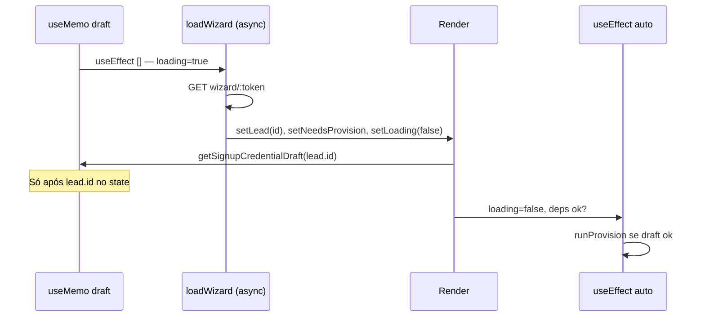

# Investigação P0-E.1 — Auto Provision não eliminou a segunda tela de senha

**Modo:** read-only (sem alteração de código, sem logs temporários).  
**Data:** 2026-06-02

---

## Respostas objetivas

| # | Pergunta | Resposta |
|---|----------|----------|
| 1 | O draft existe quando o onboarding abre? | **Depende do caminho no `/cadastro`.** Só existe se `saveSignupCredentialDraft` rodou antes do redirect. Vários caminhos **não** salvam. |
| 2 | O auto provision roda? | **Só se** `credentialDraftPassword` não for `null` após `loadWizard`. Sem draft, o `useEffect` de auto-provision **não dispara** (guard na linha 326). |
| 3 | O fallback está sendo acionado? | **Possível** se o POST provision falhar com `fromDraft: true` — aí `provisionManualFallback = true` e a senha volta **de forma intencional**. |
| 4 | Qual condição faz a senha reaparecer? | `showProvisionPasswordUi === true` → ver §2. |
| 5 | Causa raiz única? | **Não há uma só.** A mais provável no fluxo “cadastro completo” em dev: **draft ausente** (save não executado) **ou** **auto-provision falhou** → fallback. Secundária: **React StrictMode** pode gerar segunda chamada de provision após sucesso (menos comum para UI de senha persistente). |

**Condição exata que exibe a UI de senha:**

```582:583:src/pages/AcquisitionOperationalOnboarding.tsx
  const showProvisionPasswordUi =
    isProvisionStep && (!credentialDraftPassword || provisionManualFallback);
```

Com `isProvisionStep = (displayStep === 'provision')` e `displayStep = 'provision'` enquanto `needsProvision === true`.

---

## 1. Draft (`acquisitionSignupCredentialDraft.ts`)

### Funções

| Função | Arquivo | Comportamento |
|--------|---------|---------------|
| `saveSignupCredentialDraft(leadId, password)` | `src/lib/acquisitionSignupCredentialDraft.ts:9-13` | `sessionStorage.setItem` |
| `getSignupCredentialDraft(leadId)` | `:15-18` | Delega a `loadSignupCredentialDraft` |
| `loadSignupCredentialDraft(leadId)` | `:20-31` | Lê storage; exige `draft.leadId === leadId` e `password.length >= 6` |
| `clearSignupCredentialDraft()` | `:33-36` | `removeItem` |

### sessionStorage

| Campo | Valor |
|-------|--------|
| **Chave** | `acquisition_signup_credential_draft` |
| **Conteúdo JSON** | `{ leadId: string, password: string, savedAt: number }` |

### Momento do **save**

Único call site no cadastro:

```437:440:src/pages/AcquisitionSignupFlow.tsx
        const resolvedLeadId = body.lead_id ?? leadId;
        if (resolvedLeadId) {
          saveSignupCredentialDraft(resolvedLeadId, form.signup_password);
        }
```

**Condições para o save ocorrer:**

1. Usuário está em `stepId === 'lead'` e `leadSubStep === 'credentials'`.
2. `validateLeadCredentialsStep()` passou.
3. `POST /contact/resolve` não redirecionou para login/trial_blocked.
4. **Não** entrou no bloco `shouldSkipSignupStepOnResume` com `return` antecipado (linhas 386-428).
5. `POST /signup/step` (`postSignupStep('contact')`) retornou `body.ok` (linha 435-436).

**O save NÃO ocorre quando:**

- Retomada `continue_lead` / `reactivation_eligible` com `resume_path` → `return` **antes** de `postSignupStep` e **antes** do save (linhas 421-428).
- `postSignupStep` falha (`if (!body) return`).
- Usuário nunca passa pela sub-etapa credenciais (ex.: URL `?lead=…&step=plan` com estágio `contact_captured` → índice 1 direto, sem tela de senha nesta sessão).
- `sessionStorage` indisponível (SSR; não é o caso no browser).

### Momento do **clear**

```291:291:src/pages/AcquisitionOperationalOnboarding.tsx
        clearSignupCredentialDraft();
```

Somente após `POST /onboarding/provision` **bem-sucedido** (`ok`, `token`, `user`) dentro de `runProvision`.

### Draft existe ao abrir o onboarding?

**Somente se** o mesmo `lead.id` retornado por `GET /api/public/acquisition/onboarding/wizard/:token` for idêntico ao `leadId` gravado no save **e** o save tiver ocorrido na mesma origem (`sessionStorage` do mesmo tab).

Comparação estrita em `loadSignupCredentialDraft:26` — qualquer divergência de UUID → draft tratado como inexistente.

---

## 2. Fluxo onboarding — condições completas

Arquivo: `src/pages/AcquisitionOperationalOnboarding.tsx`

### Variáveis derivadas

```142:143:src/pages/AcquisitionOperationalOnboarding.tsx
  const serverStep = needsProvision ? 'provision' : (wizard?.current_step ?? 'company');
  const displayStep = stepOverride ?? (summary ? 'summary' : serverStep);
```

```581:585:src/pages/AcquisitionOperationalOnboarding.tsx
  const isProvisionStep = displayStep === 'provision';
  const showProvisionPasswordUi =
    isProvisionStep && (!credentialDraftPassword || provisionManualFallback);
  const isAutoProvisioning =
    isProvisionStep && Boolean(credentialDraftPassword) && needsProvision && !provisionManualFallback;
```

### `credentialDraftPassword` (entrada do auto-provision)

```137:140:src/pages/AcquisitionOperationalOnboarding.tsx
  const credentialDraftPassword = useMemo(() => {
    if (!lead?.id || provisionManualFallback) return null;
    return getSignupCredentialDraft(lead.id)?.password ?? null;
  }, [lead?.id, provisionManualFallback]);
```

| Estado | `credentialDraftPassword` |
|--------|---------------------------|
| `lead.id` ausente | `null` |
| `provisionManualFallback === true` | `null` (mesmo com draft no storage) |
| draft ausente / leadId diferente / senha &lt; 6 | `null` |
| draft válido | string (senha) |

### `provisionManualFallback`

- Estado inicial: `false` (linha 134).
- Reset para `false` quando `sessionToken` muda (linhas 249-252).
- Setado para `true` em `runProvision` quando `fromDraft: true` e:
  - senha &lt; 6 (linha 260),
  - resposta API sem sucesso (linhas 281-285),
  - `catch` (linhas 303-305).

### Qual variável faz a UI de senha aparecer?

**`showProvisionPasswordUi === true`**

Isso exige simultaneamente:

1. `needsProvision === true` (senão `displayStep` não é `'provision'`).
2. E (**`credentialDraftPassword` é `null`** OU **`provisionManualFallback` é `true`**).

Enquanto auto-provision deveria rodar: `isAutoProvisioning === true` → UI de senha **desligada**, loader “Preparando sua operação” (linhas 845-854).

---

## 3. Auto provision — `POST /api/public/acquisition/onboarding/provision`

### Onde é chamado

Função `runProvision` (linhas 254-323), URL linha 274.

### Quando é chamado automaticamente

```325:330:src/pages/AcquisitionOperationalOnboarding.tsx
  useEffect(() => {
    if (loading || !needsProvision || !lead?.id || !credentialDraftPassword) return;
    if (autoProvisionRanRef.current) return;
    autoProvisionRanRef.current = true;
    void runProvision({ passwordOverride: credentialDraftPassword, fromDraft: true });
  }, [loading, needsProvision, lead?.id, credentialDraftPassword, runProvision]);
```

**Guards (não chama API):**

| Condição | Efeito |
|----------|--------|
| `loading === true` | return |
| `needsProvision === false` | return |
| `!lead?.id` | return |
| `!credentialDraftPassword` | return — **sem draft, auto-provision não roda** |
| `autoProvisionRanRef.current === true` | return — evita duplicata no mesmo mount |

### Chamada manual (fallback)

`handleProvision` → `runProvision()` sem `fromDraft` — exige `password === confirmPassword`.

### Try/catch e fallback

| Situação | `fromDraft` | Resultado UI |
|----------|-------------|--------------|
| HTTP/ok falha | `true` | `setProvisionManualFallback(true)` + toast |
| `catch` | `true` | idem |
| Sucesso | qualquer | `clearSignupCredentialDraft`, `setNeedsProvision(false)`, `loadWizard()` |

Backend pode retornar `ALREADY_PROVISIONED` se tenant já existe (`acquisitionProvisioningService.ts:65-66`) — tratado como falha no front → **fallback com senha**.

---

## 4. Ordem de carregamento

### Sequência no mount do onboarding



**Resposta A vs B:**

- **Primeiro:** `loadWizard()` (assíncrono).
- **Depois:** `getSignupCredentialDraft(lead.id)` no **render** seguinte, via `useMemo` — **não** antes de `lead.id` existir.
- `loadWizard` também chama `loadSignupCredentialDraft` para preencher `password`/`confirmPassword` (linhas 193-197), mas isso **não** alimenta `credentialDraftPassword`; o useMemo é a fonte do auto-provision.

**Janela teórica:** entre `setLoading(false)` e o `useEffect` de auto-provision, um render com draft ausente mostraria senha por 1 frame; com draft presente, `showProvisionPasswordUi` é `false` nesse render.

---

## 5. Timeline — fluxo nominal vs fluxo que quebra

### Cenário A — cadastro completo (happy path esperado pelo P0-E)

| Tempo | Evento | leadId | draft (storage) | needsProvision | showProvisionPasswordUi | isAutoProvisioning |
|-------|--------|--------|-----------------|----------------|----------------------|-------------------|
| T0 | Credenciais OK → `postSignupStep` + `saveSignupCredentialDraft` | `L1` | `{ leadId:L1, password }` | — | — | — |
| T1 | Plano + `activate/trial` → `navigate(/onboarding/acquisition?session=S)` | `L1` | mantém | — | — | — |
| T2 | Mount onboarding, `loading=true` | — | mantém | `false`* | `false` | `false` |
| T3 | `loadWizard` OK: `lead.id=L1`, `needs_provision=true` | `L1` | mantém | `true` | `false` | `true` |
| T4 | `useEffect` → `POST provision` | `L1` | mantém | `true` | `false` | `true` |
| T5 | Provision OK → `clear` draft, `needsProvision=false` | `L1` | **removido** | `false` | `false` | `false` |
| T6 | `displayStep=company` | `L1` | — | `false` | `false` | `false` |

\*Estado inicial React antes do GET.

### Cenário B — retomada sem save (causa frequente em testes)

| Tempo | Evento | leadId | draft | needsProvision | showProvisionPasswordUi | isAutoProvisioning |
|-------|--------|--------|-------|----------------|----------------------|-------------------|
| T0 | `/cadastro?lead=L1&step=plan` (resume `contact_captured`) — **pula credenciais** | `L1` | **ausente** | — | — | — |
| T1 | `activate/trial` → onboarding | `L1` | ausente | `true` | **`true`** | `false` |
| T2 | `useEffect` auto: `!credentialDraftPassword` → **não chama API** | `L1` | ausente | `true` | **`true`** | `false` |

### Cenário C — `continue_lead` no resolve (senha digitada, save pulado)

| Tempo | Evento | draft |
|-------|--------|-------|
| T0 | Credenciais + senha preenchidas | — |
| T1 | `contact/resolve` → `continue_lead` + `resume_path` → **return linha 428** | **nunca salvo** |
| T2 | Onboarding abre | ausente → **tela senha** |

### Cenário D — auto-provision falha

| Tempo | Evento | showProvisionPasswordUi | provisionManualFallback |
|-------|--------|-------------------------|-------------------------|
| T0 | Draft OK, auto POST falha (rede, e-mail já existe, etc.) | `true` após falha | `true` |
| T1 | `credentialDraftPassword` useMemo → `null` por fallback | `true` | `true` |

---

## 6. Fatores adicionais (dev)

### React StrictMode (`src/main.tsx:45-47`)

Em desenvolvimento, efeitos podem rodar duas vezes. O `useEffect` em `sessionToken` (linhas 249-252) **zera** `autoProvisionRanRef` no remount, permitindo **segunda** chamada a `runProvision`. Se a primeira já provisionou, a segunda pode falhar com `ALREADY_PROVISIONED` → **fallback** → senha visível **mesmo com draft que existia**.

### Pré-preenchimento vs auto-provision

`loadWizard` preenche `password`/`confirmPassword` do draft (linhas 193-197), mas se `credentialDraftPassword` for `null`, o usuário ainda vê o formulário — campos podem aparecer vazios ou preenchidos sem disparar auto-provision.

---

## 7. Diagnóstico consolidado

### Árvore de decisão (por que a senha aparece)

```
needsProvision === true?
  └─ Não → senha não aparece (já em company+)
  └─ Sim → displayStep === 'provision'
        └─ credentialDraftPassword presente E !provisionManualFallback?
              └─ Sim → isAutoProvisioning (loader) — senha OCULTA
              └─ Não → showProvisionPasswordUi TRUE — senha VISÍVEL
                    ├─ draft ausente (save não rodou / leadId mismatch)
                    └─ provisionManualFallback (auto falhou)
```

### Causa raiz recomendada para investigação em produção/dev

1. **Primária (lógica de produto):** `saveSignupCredentialDraft` **não é chamado** em todos os caminhos que chegam ao trial com senha já digitada — em especial retomadas (`continue_lead`) e URL que pula credenciais.
2. **Secundária (runtime):** auto-provision executa mas **falha** → `provisionManualFallback` força `showProvisionPasswordUi`.
3. **Terciária (dev):** StrictMode + segunda chamada provision → falha `ALREADY_PROVISIONED` → fallback.

**Não é causado por:** etapa Empresa (`company`) — não há inputs de senha em `company-step`.

---

## Referências de código

| Tópico | Caminho |
|--------|---------|
| Draft storage | `src/lib/acquisitionSignupCredentialDraft.ts` |
| Save (único) | `src/pages/AcquisitionSignupFlow.tsx:437-440` |
| Skip save (resume) | `src/pages/AcquisitionSignupFlow.tsx:386-428` |
| Auto-provision effect | `src/pages/AcquisitionOperationalOnboarding.tsx:325-330` |
| UI senha | `src/pages/AcquisitionOperationalOnboarding.tsx:582-583, 855+` |
| Wizard lead.id | `packages/backend/src/controllers/acquisitionOnboardingWizardController.ts:42-47` |
| Sprint P0-E | `docs/architecture/acquisition/SPRINT_P0E_REMOVE_DUPLICATE_PASSWORD.md` |
| Auditoria duplicação | `docs/architecture/acquisition/AUDIT_DUPLICATE_PASSWORD_STEP_ONBOARDING.md` |

---

*Investigação read-only — nenhuma alteração aplicada.*
