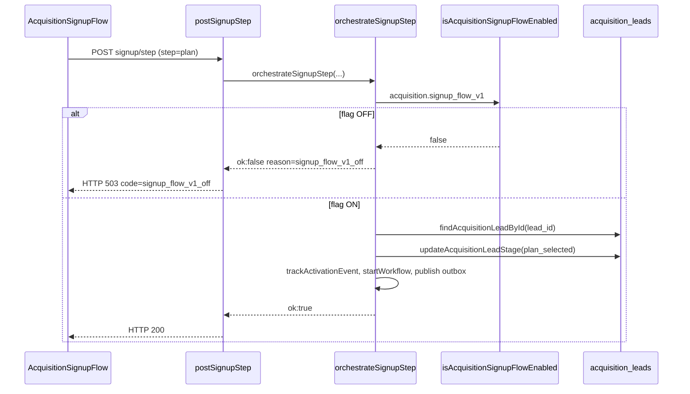

# AUDIT_SIGNUP_STEP_503_PRODUCTION

**Modo:** READ ONLY  
**Data:** 2026-06-11  
**Sintoma:** Após selecionar plano e quantidade de operadores, `POST /api/public/acquisition/signup/step` retorna **503** e o frontend retorna para `/cadastro`.

---

## Resumo executivo

| Pergunta | Resposta |
|----------|----------|
| O 503 é exceção não tratada? | **Não** na hipótese dominante. É resposta **HTTP mapeada de propósito** quando `orchestrateSignupStep` retorna `ok: false` e `reason` contém `"off"`. |
| Causa raiz mais provável em produção | **Split-brain:** `GET /api/public/acquisition/config` expõe `signup_flow_v1: true` via **estratégia Growth** (`exclusive_signup`), mas `POST /signup/step` exige a **feature flag** `acquisition.signup_flow_v1` — que no seed está `rollout_type=off`, `default_enabled=false`, `shadow_mode=true`. |
| `activateTrial` / `createTenant` / `createUser` no plan step? | **Não.** O step `plan` não chama esses serviços. |
| O “loop” do cadastro é do 503? | **Sim (A).** Erro em `postSignupStep` dispara `navigate(cfg.paths.signup)` → `/cadastro` em modo exclusive. Não é regressão da state machine E2.1 em si. |
| Stack trace em produção (código) | **Inexistente** para 503 mapeado — não há `throw`; retorno controlado no controller. |

**Classificação:** **A) consequência do 503** (flag + redirect do frontend), com **fator amplificador** de inconsistência config API vs gate do endpoint.

---

## 1. Endpoint e rota

| Item | Valor |
|------|--------|
| Método / path | `POST /api/public/acquisition/signup/step` |
| Router | `packages/backend/src/routes/acquisitionPublicRoutes.ts:40` |
| Rate limit | `acquisitionLimiter` — em falha retorna **429**, não 503 |
| Controller | `postSignupStep` — `packages/backend/src/controllers/acquisitionController.ts:469-514` |
| Service | `orchestrateSignupStep` — `packages/backend/src/acquisition/signupOrchestrationService.ts:70-216` |

### Schema do body (`signupStepSchema`)

```41:48:packages/backend/src/controllers/acquisitionController.ts
const signupStepSchema = z.object({
  lead_id: z.string().uuid().optional(),
  name: z.string().optional(),
  email: z.string().email(),
  phone: z.string().min(8).optional(),
  plan_id: z.string().uuid().optional(),
  step: z.enum(['contact', 'plan', 'checkout']),
  utm: z.record(z.unknown()).optional(),
});
```

No step `plan`, o frontend envia `step: 'plan'`, `plan_id`, `lead_id`, `email`, `name`, `phone`, `utm.users_count`.

---

## 2. Fluxo completo — step `plan`



### Passos em `orchestrateSignupStep` quando `step === 'plan'`

1. **`isAcquisitionSignupFlowEnabled()`** — se `false` → `{ ok: false, reason: 'signup_flow_v1_off' }` (**linha 87-89**). **Único retorno `off` esperado neste caminho.**
2. **Não** executa `resolveAcquisitionContact` (só no step `contact`).
3. Carrega lead por `lead_id` (**linha 130-132**).
4. Se lead ausente → `createPreSignupLead` (pode retornar `acquisition_leads_off` — também contém `"off"`).
5. `updateAcquisitionLeadStage(..., 'plan_selected', { selectedPlanId })` (**linha 149-161**).
6. `trackActivationEvent` — não lança se flag off; skip silencioso.
7. `startWorkflow` — se orchestration off, retorna `skipped`; **não lança**.
8. `publishAcquisitionSignupStarted` / `publishAcquisitionStageChanged` — fire-and-forget.
9. `refreshActivationScoreForLead` — não lança se flag off.
10. Retorna `ok: true` e `nextPath` com `step=plan` ou `conversion`.

### Serviços **não** chamados no step `plan`

| Serviço | Arquivo típico | No signup/step plan? |
|---------|----------------|----------------------|
| `activateAcquisitionTrial` | `acquisitionTrialActivationService` | Não (só `POST /activate/trial`) |
| `createTenant` / provision | `acquisitionProvisioningService` | Não |
| `createTenantAdminUser` | `tenantAdminService` | Não |
| `createCustomer` | — | Não neste fluxo |
| `resolvePlan` / `resolveDefaultTrialPlanId` | `signupOrchestrationService` | Não no step plan |

---

## 3. Onde o HTTP 503 é gerado

### 3.1 Mapeamento explícito (não é catch genérico)

```485:494:packages/backend/src/controllers/acquisitionController.ts
    if (!result.ok) {
      const status =
        result.reason === 'login_required' || result.reason === 'trial_blocked' ? 409 : result.reason?.includes('off') ? 503 : 400;
      res.status(status).json({
        ok: false,
        code: result.reason,
        contact_message: result.contact_message,
        fallback_path: result.nextPath ?? '/register',
      });
      return;
    }
```

**Regra:** qualquer `reason` cuja string **contenha** `"off"` → **503**.

### 3.2 `reason` values que produzem 503

| `reason` | Origem | Condição |
|----------|--------|----------|
| **`signup_flow_v1_off`** | `signupOrchestrationService.ts:87-89` | `isAcquisitionSignupFlowEnabled()` === false |
| **`acquisition_leads_off`** | `createPreSignupLead` via `signupOrchestrationService.ts:145` | Lead não encontrado e pré-signup desabilitado (raro com `lead_id` válido) |
| `trial_flow_v1_off` | Não em `orchestrateSignupStep` | Só em `/teste-gratis` |
| `pre_signup_v1_off` | Não neste endpoint | — |

**Hipótese dominante para o sintoma (primeiro `signup/step` no fluxo E2/E2.1):** `signup_flow_v1_off`.

### 3.3 Exceções → **500**, não 503

```506:512:packages/backend/src/controllers/acquisitionController.ts
  } catch (e) {
    if (e instanceof z.ZodError) {
      res.status(400).json({ ok: false, error: 'Dados inválidos', details: e.errors });
      return;
    }
    console.error('[SIGNUP] step_error', e);
    res.status(500).json({ ok: false, error: 'Erro no fluxo de signup' });
  }
```

Se produção mostra **503** com body JSON `{ ok: false, code: "..." }`, **não** entrou neste `catch`.  
Se for 503 **sem** body da aplicação (HTML/nginx), seria camada de proxy — ver seção 8.

---

## 4. Por que o wizard chega ao plano mas o step falha

### 4.1 Endpoints anteriores **não** checam `acquisition.signup_flow_v1`

| Etapa | Endpoint | Gate `signup_flow_v1`? |
|-------|----------|-------------------------|
| Telefone / código | `/phone/send-code`, `/phone/verify-code` | Não |
| Capture | `/contact/capture` | Não |
| Credenciais | `/contact/resolve` | Não |
| **Plano** | **`/signup/step`** | **Sim** |

### 4.2 E2.1 — primeiro `signup/step` costuma ser no plano

No caminho `continue_lead`, credenciais **não** chamam `postSignupStep('contact')`. O primeiro `POST /signup/step` ocorre em **`step: 'plan'`** — alinhado ao sintoma.

### 4.3 Split-brain: config vs gate

**Config pública** (`getAcquisitionConfig`):

```51:66:packages/backend/src/controllers/acquisitionController.ts
export async function getAcquisitionConfig(_req: Request, res: Response): Promise<void> {
  const [flags, entry, strategy] = await Promise.all([
    getAcquisitionPublicConfig(),
    getPublicSignupEntryPayload(),
    getSignupStrategy(),
  ]);
  res.json({
    ok: true,
    flags: {
      ...flags,
      signup_flow_v1: strategy.flow === 'exclusive_signup',
    },
```

**Gate do step** (`orchestrateSignupStep`):

```35:37:packages/backend/src/acquisition/acquisitionFlags.ts
export async function isAcquisitionSignupFlowEnabled(ctx: FlagCtx = {}): Promise<boolean> {
  return isAcquisitionPublicSurfaceEnabled('acquisition.signup_flow_v1', ctx);
}
```

**Seed da flag** (`database/init/258_acquisition_foundation_p0.sql`):

- `acquisition.signup_flow_v1`: `default_enabled=false`, `rollout_type=off`, `shadow_mode=true`
- Registry com `shadow_mode` retorna `enabled: false` (`featureFlagRegistry.ts:243-244`)
- `isAcquisitionPublicSurfaceEnabled` só libera em shadow se `default_enabled === true` — **false no seed**

**Conclusão:** Com Growth em `exclusive_signup`, a UI de `/cadastro` liga (`enabled=true` no config), mas `POST /signup/step` pode retornar **503 `signup_flow_v1_off`** até a flag real ser habilitada (Super Admin / ENV `PLATFORM_FLAG_ACQUISITION_SIGNUP_FLOW_V1=1` / `acquisition.master_off` inativo + rollout).

---

## 5. Mensagem, “stack trace”, arquivo e linha

### Cenário 503 mapeado (`signup_flow_v1_off`)

| Campo | Valor |
|-------|--------|
| **HTTP** | 503 |
| **Body** | `{ ok: false, code: "signup_flow_v1_off", fallback_path: "/register", contact_message?: ... }` |
| **“Exceção”** | Nenhuma — retorno `{ ok: false, reason: 'signup_flow_v1_off' }` |
| **Stack trace** | Não aplicável |
| **Arquivo / linha (gate)** | `signupOrchestrationService.ts:87-89` |
| **Arquivo / linha (HTTP)** | `acquisitionController.ts:486-487` |
| **Condição** | `!(await isAcquisitionSignupFlowEnabled())` |

### Cenário 500 (exceção real)

| Campo | Valor |
|-------|--------|
| **HTTP** | 500 |
| **Body** | `{ ok: false, error: "Erro no fluxo de signup" }` |
| **Log servidor** | `[SIGNUP] step_error` + stack do `catch` |
| **Causas possíveis** | FK inválida em `selected_plan_id`, DB down, erro em `pool.query`, etc. |

### Validação Zod

| Campo | Valor |
|-------|--------|
| **HTTP** | 400 |
| **Body** | `{ ok: false, error: "Dados inválidos", details: [...] }` |

---

## 6. try/catch que converte “qualquer erro” em 503?

**Não.** Só há conversão para 503 quando `result.reason?.includes('off')`.  
Exceções não tratadas viram **500**.  
`postActivateTrial` usa 503 para `CHECKOUT_TRIAL_V1_DISABLED` — endpoint **diferente** (`/activate/trial`).

---

## 7. Comportamento do frontend no erro

```443:455:src/pages/AcquisitionSignupFlow.tsx
    if (res.error || !body?.ok) {
      if (body?.code === 'login_required') {
        ...
      }
      if (body?.code === 'trial_blocked') {
        ...
      }
      const cfg = await loadSignupEntryConfig();
      navigate(body?.fallback_path ?? cfg.paths.signup);
      return null;
    }
```

### Problemas no handler de erro

1. Em respostas de erro, `apiClient` preenche **`res.error`** e **`res.code`**, não `res.data`.  
   `const body = res.data` fica **`undefined`**.
2. `body?.code === 'login_required'` / `trial_blocked` **não disparam** em erro HTTP (deveriam usar `res.code`).
3. `body?.fallback_path` é **sempre undefined** em erro → cai em **`cfg.paths.signup`**.
4. Em modo `exclusive_signup`, `cfg.paths.signup` = **`/cadastro`**.

**Efeito observado:** mesmo com `fallback_path: "/register"` no 503, o usuário é enviado para **`/cadastro`** → sensação de “loop” / reinício do wizard.

**Não** há `navigate('/cadastro')` literal no erro — é `navigate(cfg.paths.signup)` que resolve para `/cadastro`.

---

## 8. Outras fontes de 503 (fora do controller)

| Fonte | Aplica a signup/step? |
|-------|------------------------|
| `express-rate-limit` | 429 |
| Nginx upstream unhealthy | 503 genérico (sem `code: signup_flow_v1_off`) |
| `postActivateTrial` | Endpoint diferente |

**Como distinguir em produção:** inspecionar body da resposta. Se `code` = `signup_flow_v1_off` → aplicação; se HTML/empty → proxy.

---

## 9. Loop do cadastro: classificação

| Opção | Veredito |
|-------|----------|
| **A) Consequência do 503** | **Sim — primária.** Flag off → 503 → redirect para `/cadastro` via `loadSignupEntryConfig().paths.signup`. |
| **B) State machine independente** | **Não** como causa do sintoma pós-plano. E2.1 corrigiu loop credenciais↔plano; este comportamento é **pós-submit com erro**. |

---

## 10. Verificação recomendada em produção (read-only)

1. **Response do 503:** confirmar `code` no JSON (`signup_flow_v1_off` vs outro).
2. **Logs:** buscar `[SIGNUP] step_error` — se ausente, não houve exceção.
3. **DB:**  
   `SELECT key, default_enabled, rollout_type, shadow_mode FROM platform_feature_flags WHERE key IN ('acquisition.signup_flow_v1','acquisition.master_off');`
4. **Growth:** `SELECT active_signup_flow FROM platform_growth_settings;`
5. **Script local:** `packages/backend/src/scripts/debugAcquisitionFlags.ts` (comparar `resolve acquisition.signup_flow_v1` vs `getAcquisitionPublicConfig().signup_flow_v1`).
6. **ENV:** `PLATFORM_FLAG_ACQUISITION_SIGNUP_FLOW_V1`, `PLATFORM_FLAG_ACQUISITION_MASTER_OFF`.

---

## 11. Fluxo esperado vs real

### Esperado

```
Plano + operadores → POST signup/step (plan) → 200 → step=conversion
```

### Real (hipótese dominante)

```
Plano + operadores
  → POST signup/step
  → isAcquisitionSignupFlowEnabled() = false
  → 503 { code: "signup_flow_v1_off" }
  → frontend navigate(/cadastro)  // cfg.paths.signup
  → usuário “volta ao início” do cadastro
```

---

## 12. Mapa de arquivos

| Papel | Caminho |
|-------|---------|
| Controller 503 | `packages/backend/src/controllers/acquisitionController.ts` |
| Orquestração | `packages/backend/src/acquisition/signupOrchestrationService.ts` |
| Feature flags | `packages/backend/src/acquisition/acquisitionFlags.ts` |
| Registry | `packages/backend/src/platform/featureFlagRegistry.ts` |
| Config override | `getAcquisitionConfig` (strategy vs flag) |
| Frontend submit | `src/pages/AcquisitionSignupFlow.tsx` → `postSignupStep()` |
| Redirect erro | `loadSignupEntryConfig()` → `src/lib/signupEntry.ts` |

---

## Nota

Auditoria **somente diagnóstico**. Correções possíveis (fora do escopo): alinhar gate do `signup/step` com `getAcquisitionConfig`; habilitar flag em produção; corrigir handler de erro para usar `res.code` e `res.details.fallback_path`.
