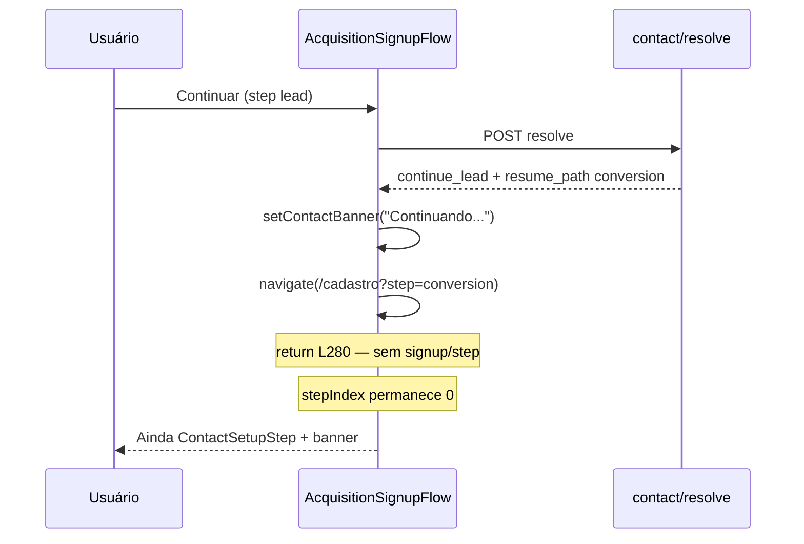

# P0-B — Investigação read-only: travamento após contact/resolve

**Data:** 2026-06-02  
**Restrição:** sem correção de código; sem logs temporários no repo (análise estática + SQL).

---

## Sintoma observado

- Rota: `/cadastro`
- Copy: **"Continuando de onde você parou."**
- Network: apenas `POST /api/public/acquisition/contact/resolve` → **200**
- **Ausente:** `POST /api/public/acquisition/signup/step`
- Usuário permanece na etapa de contato (sensação de travamento)

---

## ETAPA 1 — Resposta esperada de `contact/resolve`

O controller expõe (`acquisitionController.ts`):

```json
{
  "ok": true,
  "action": "<ContactResolveAction>",
  "message": "<string>",
  "lead_id": "<uuid>",
  "resume_step": <number | undefined>,
  "resume_path": "<string | undefined>",
  "resume_verified": <boolean | undefined>,
  "extra_trial_eligible": <boolean | undefined>,
  "operational_tags": <string[] | undefined>,
  "correlation_id": "<string>"
}
```

**Nota:** `current_stage`, `onboarding_session_token` e `selected_plan_id` **não** vêm neste JSON — só no banco / `GET /api/public/acquisition/leads/:id`.

### Caso provável do teste: `kssantoss@hotmail.com`

| Campo | Valor (derivado de DB + código) |
|-------|----------------------------------|
| `action` | `continue_lead` |
| `message` | `Continuando de onde você parou.` |
| `resume_path` | `/cadastro?lead=5d0e980d-0f16-4a98-9233-d79874825c29&step=conversion` |
| `resume_step` | `2` |
| `resume_verified` | `true` (`canContinueWhereLeftOff` em `resolveAcquisitionResume`) |
| `lead_id` | `5d0e980d-0f16-4a98-9233-d79874825c29` |
| `extra_trial_eligible` | `false` |

`canContinueWhereLeftOff` existe só no backend (`acquisitionResumeService`); o frontend **não lê** `resume_verified` em `handleNext`.

### Outro e-mail no mesmo ambiente (referência)

`thekiq@sda.com` → `onboarding_in_progress` + sessão `completed` com `tenant_id`:

| Campo | Valor |
|-------|--------|
| `action` | `continue_lead` |
| `message` | `Seu onboarding já foi concluído. Faça login para acessar o painel.` (não é a copy “Continuando…”) |
| `resume_path` | `/login` |
| `resume_verified` | `false` |

---

## ETAPA 2 — Mapa `handleNext()` (step `lead`)

Arquivo: `src/pages/AcquisitionSignupFlow.tsx`

```
validateLeadStep() → return se inválido (L243)
  ↓
POST contact/resolve (L246-257)
  ↓
action === login_required → navigate /login → return (L259-262)
  ↓
action === trial_blocked → toast → return (L264-266)
  ↓
setLeadId, setExtraTrialEligible, setContactBanner (L268-270)
  ↓
shouldResumeNow = resume_path && (continue_lead | reactivation_eligible) (L272-275)
  ↓
[SE shouldResumeNow]
  navigate(pathname + search) → return (L277-280)  ← signup/step NÃO roda
  ↓
postSignupStep('contact') (L283)
  ↓
body falsy → return (L284)
  ↓
setStepIndex(1) (L285)
```

**Returns antecipados que impedem `signup/step`:**

| Linha | Condição | Efeito |
|-------|----------|--------|
| 243 | validação falha | sem API |
| 262 | `login_required` | sem signup/step |
| 266 | `trial_blocked` | sem signup/step |
| **280** | **`shouldResumeNow`** | **sem signup/step (por design P0-A)** |
| 284 | `postSignupStep` falha | sem avanço de step |

---

## ETAPA 3 — Logs (simulação estática, sem alterar código)

Ordem real de execução para `continue_lead` + `plan_selected`:

| Momento | `action` | `resume_path` | `resume_verified` | `navigate` | `signup/step` |
|---------|----------|---------------|-------------------|------------|---------------|
| DEPOIS resolve | `continue_lead` | `/cadastro?lead=…&step=conversion` | `true` (ignorado no FE) | — | não |
| DEPOIS navigate | — | URL atualizada na barra | — | **chamado L279** | não |
| DEPOIS postSignupStep | — | — | — | — | **não executado** (return L280) |

---

## ETAPA 4 — `acquisition_leads` (e-mails de teste)

### `kssantoss@hotmail.com` (alinha com copy “Continuando…”)

| Campo | Valor |
|-------|--------|
| `id` | `5d0e980d-0f16-4a98-9233-d79874825c29` |
| `current_stage` | `plan_selected` |
| `selected_plan_id` | `d84c4bb5-8977-41df-904a-794acc59cfb9` |
| `onboarding_session_token` | *(ausente no metadata)* |
| `metadata_json` (resumo) | `last_step: plan`, `resumed: true`, tags `retomado` repetidas |

### `kssantos@hotmail.com` (variante — não deve dar “Continuando…”)

| Campo | Valor |
|-------|--------|
| `current_stage` | `contact_captured` |
| `metadata` | `blocked_reason: active_tenant` → resolve tende a `login_required` |

---

## ETAPA 5 — `acquisition_onboarding_sessions`

### `kssantoss@hotmail.com`

Nenhuma sessão (0 rows).

### `thekiq@sda.com`

| Campo | Valor |
|-------|--------|
| `status` | `completed` |
| `expires_at` | válido (`valid = t`) |
| `tenant_id` | `61cb28e3-d286-475b-9b8b-086a9eedd3b9` |
| `current_step` | `completed` |
| `session_token` | `IZ3oHCPtapBjziXeR83ySHFwmTweMc5U` |

---

## ETAPA 6 — Respostas objetivas

| # | Pergunta | Resposta |
|---|----------|----------|
| 1 | Frontend recebeu `continue_lead`? | **Sim** (para `kssantoss@hotmail.com` / `plan_selected`) |
| 2 | Frontend recebeu `resume_path`? | **Sim** — `/cadastro?lead=…&step=conversion` |
| 3 | `navigate` foi chamado? | **Sim** — linhas **277-279** |
| 4 | `navigate` falhou? | **Não** (não há evidência de exceção; o fluxo cai no `return` normal) |
| 5 | Retornou antes do `navigate`? | **Não** |
| 6 | Retornou antes do `signup/step`? | **Sim** — linha **280** (`return` imediato após `navigate`) |
| 7 | Linha exata do bloqueio percebido? | **277-280** + causa estrutural **44-48** |

---

## Causa raiz (por que o usuário fica “preso”)

### 1. `signup/step` ausente é **esperado** neste ramo

Após P0-A, `continue_lead` com `resume_path` faz **navegação imediata** e **return** antes de `postSignupStep('contact')`. O Network só com `contact/resolve` **não indica falha de backend**.

### 2. Bloqueio visual: `stepIndex` não acompanha a URL

```44:48:src/pages/AcquisitionSignupFlow.tsx
  const [stepIndex, setStepIndex] = useState(() => {
    const step = params.get('step');
    if (step === 'plan') return 1;
    if (step === 'conversion' || step === 'activate') return 2;
    return 0;
  });
```

- `stepIndex` é calculado **só na montagem inicial**.
- `navigate('/cadastro?lead=…&step=conversion')` altera **search params na mesma rota** `/cadastro` → React Router **reutiliza** o componente.
- **Não existe** `useEffect` que faça `setStepIndex(2)` quando `params.get('step') === 'conversion'`.
- Resultado: URL diz `step=conversion`, mas UI permanece em **`stepId === 'lead'`** (passo 0) com banner **"Continuando de onde você parou."**

```511:521:src/pages/AcquisitionSignupFlow.tsx
      ) : stepId === 'lead' ? (
        <ContactSetupStep
          ...
          contactBanner={contactBanner}
        />
```

### 3. Plano já escolhido no lead não hidrata o wizard

`applyContactAutofill` preenche nome/e-mail/telefone via `GET /leads/:id`, mas **não** aplica `selected_plan_id` ao `form.plan_id`. Mesmo que `stepIndex` fosse corrigido, a etapa conversão pode falhar validação de plano sem `postSignupStep` ou sync extra.

---

## Diagrama do bug



---

## Implementado — Sprint P0-B.1

Correção em `AcquisitionSignupFlow.tsx` + `src/lib/acquisitionSignupResume.ts`:

- `stepIndex` sincronizado com `useSearchParams` (`step` / `lead`)
- Reidratação de `selected_plan_id` via `GET /leads/:id`
- Hardening: `conversion` sem plano → `step=plan` (índice 1)
- `resumeHydrating` até concluir fetch do lead na URL
- Testes: `packages/backend/src/acquisitionSignupResume.p0b1.test.ts` (5 casos)

---

## Correção sugerida (histórico pré P0-B.1)

1. Sincronizar `stepIndex` e `leadId` com `useSearchParams()` quando `step` / `lead` mudarem (ou `key={location.search}` para remount).
2. Opcional: após `navigate` para `/cadastro?…&step=conversion`, chamar `setStepIndex(2)` explicitamente.
3. Hidratar `form.plan_id` a partir de `selected_plan_id` do lead no autofill.
4. Avaliar se `postSignupStep('contact')` ainda é necessário no ramo retomada (side effects / ops kanban) — hoje é pulado.

---

## Como reproduzir a evidência no browser (sem mudar código)

1. DevTools → Network → `contact/resolve` → Response: confirmar `action`, `resume_path`.
2. Após clicar Continuar: barra de endereço deve mostrar `?step=conversion`, mas o passo visual continua **Contato**.
3. Console: não haverá request `signup/step` — consistente com **L280**.
