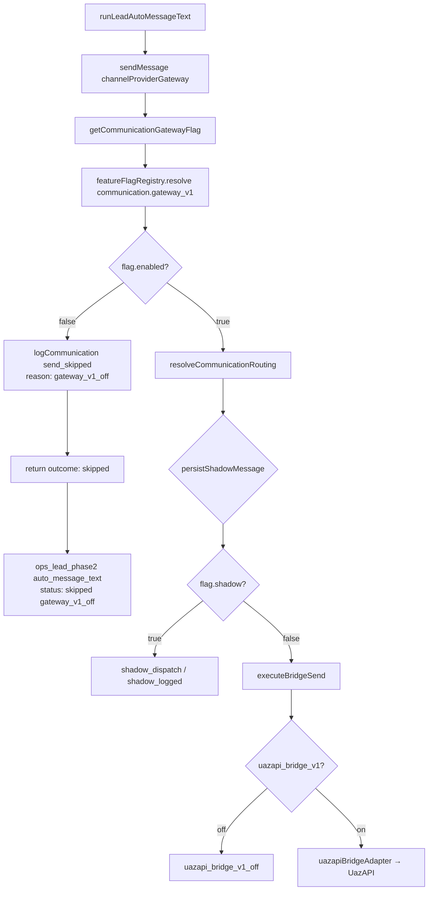

# AUDIT_COMMUNICATION_GATEWAY_V1_OFF

**Modo:** READ ONLY  
**Data:** 2026-06-10  
**Objetivo:** Identificar por que automações Phase2 do Ops Kanban chegam a `sendMessage()` mas retornam `send_skipped` / `gateway_v1_off`.

---

## Resumo executivo

O bloqueio **não é bug** do Ops Kanban (N4/N5/N5.1). O pipeline Ops está correto até `sendMessage()`. O skip ocorre porque a **feature flag `communication.gateway_v1` está desligada** (`enabled: false`) no registry P0 — comportamento **intencional** do Communication Gateway v1 em rollout.

**Causa raiz:** `getCommunicationGatewayFlag()` → `featureFlagRegistry.resolve('communication.gateway_v1')` → `enabled: false` → retorno antecipado em `sendMessage()` com `reason: 'gateway_v1_off'`.

**Classificação:** **B) Feature flag** (primária). Secundariamente compatível com **F) Desenvolvimento** se nenhum override de ENV/tenant estiver configurado.

Mensagens manuais do CRM **não passam** por este gateway — usam pipeline legado UazAPI direto — por isso podem funcionar enquanto Ops Phase2 falha.

---

## Parte 1 — Local exato do skip

| Pergunta | Resposta |
|----------|----------|
| **Arquivo** | `packages/backend/src/communication/channelProviderGateway/channelProviderGateway.ts` |
| **Função** | `sendMessage()` |
| **Linha aproximada** | 102–109 |
| **É retorno normal ou exceção?** | **Retorno normal** — `{ outcome: 'skipped', reason: 'gateway_v1_off' }` |
| **Quem chama** | `runLeadAutoMessageText()` / `runLeadWhatsappModelSequence()` em `kanbanLeadPhase2AutomationService.ts` |

```98:110:packages/backend/src/communication/channelProviderGateway/channelProviderGateway.ts
export async function sendMessage(input: SendCommunicationInput): Promise<CommunicationDispatchResult> {
  const flag = await getCommunicationGatewayFlag({ tenantId: input.tenantId ?? null });
  const correlationId = input.correlationId?.trim() || requireCorrelationId();

  if (!flag.enabled) {
    logCommunication('send_skipped', {
      reason: 'gateway_v1_off',
      intent: input.messageIntent,
      channel: input.channel,
      correlation_id: correlationId,
    });
    return { outcome: 'skipped', reason: 'gateway_v1_off' };
  }
```

Log `[COMMUNICATION] send_skipped` é emitido por `logCommunication()` em `communicationLogger.ts` (prefixo `[COMMUNICATION]`).

---

## Parte 2 — Flags ENV

Não existem variáveis `COMMUNICATION_GATEWAY_V1_ENABLED`, `CHANNEL_PROVIDER_GATEWAY_ENABLED`, `WHATSAPP_GATEWAY_ENABLED` ou `COMMUNICATION_ENABLED` no projeto.

O mecanismo ENV do registry usa o padrão:

```text
PLATFORM_FLAG_{KEY_COM_UNDERSCORES}
```

| Variável ENV | Exemplo para gateway | Default se ausente | Impacto |
|--------------|----------------------|--------------------|---------|
| `PLATFORM_FLAG_COMMUNICATION_GATEWAY_V1` | `1` / `true` = ON | **Não definida** → usa DB | Força gateway ON (fallback quando cache vazio ou flag desconhecida) |
| `PLATFORM_FLAG_COMMUNICATION_MASTER_OFF` | `1` = kill ativo | **Não definida** | Se `true`, `getCommunicationGatewayFlag` retorna `enabled: false` |
| `PLATFORM_FLAGS_ENABLE_ALL_IN_NON_PROD` | `1` | **Não definida** | Em ambiente **não-production**, habilita **todas** as flags |
| `PLATFORM_ROLLOUT_ENV` / `DEPLOY_ENV` | `production` / `development` | `NODE_ENV` | Define ambiente para rollout |
| `PLATFORM_INTERNAL_TENANT_IDS` | lista UUID | vazio | Rollout `internal` |
| `PLATFORM_FLAG_ALLOWLIST_COMMUNICATION_GATEWAY_V1` | lista UUID | vazio | Rollout `allowlist` por tenant |
| `PLATFORM_FEATURE_FLAG_CACHE_TTL_MS` | ms | `60000` | TTL cache em memória |
| `PLATFORM_FEATURE_FLAG_DEBUG` | `1` | off | Log `[FEATURE_FLAG] resolved` |

**Conclusão ENV:** sem `PLATFORM_FLAG_COMMUNICATION_GATEWAY_V1=1` (ou `PLATFORM_FLAGS_ENABLE_ALL_IN_NON_PROD=1` em dev), o gateway depende **exclusivamente** da tabela `platform_feature_flags` e overrides por tenant.

---

## Parte 3 — Feature flags (fonte de verdade)

### Resolução

```16:24:packages/backend/src/communication/communicationFlags.ts
export async function getCommunicationGatewayFlag(ctx: FlagCtx = {}): Promise<{
  enabled: boolean;
  shadow: boolean;
}> {
  const master = await isCommunicationMasterOff(ctx);
  if (master) return { enabled: false, shadow: true };
  const r = await resolve('communication.gateway_v1', ctx);
  return { enabled: r.enabled, shadow: r.shadow };
}
```

`resolve()` → `featureFlagRegistry.resolve()` → cache em memória (TTL ~60s) + tabela `platform_feature_flags` + `platform_feature_flag_overrides` por `tenantId`.

Log observado `[FEATURE_FLAG] cache_refreshed count:47` corresponde a `ensureCacheFresh()` em `featureFlagRegistry.ts` (linha ~108).

### Seed P0 (migration)

```50:51:database/init/253_platform_feature_flags_p0.sql
  ('communication.master_off', 'communication', 'Kill switch communication platform', false, NULL, 'off', 0, false),
  ('communication.gateway_v1', 'communication', 'channelProviderGateway', false, 'communication.master_off', 'off', 0, true),
```

| Flag | `default_enabled` | `rollout_type` | `shadow_mode` | `kill_switch_key` |
|------|-------------------|----------------|---------------|-------------------|
| `communication.master_off` | false | off | false | — |
| `communication.gateway_v1` | **false** | **off** | **true** | `communication.master_off` |
| `communication.uazapi_bridge_v1` | false | off | true | `communication.master_off` |
| `communication.routing_v1` | false | off | true | `communication.master_off` |

### Comportamento crítico do registry com `shadow_mode: true`

```243:245:packages/backend/src/platform/featureFlagRegistry.ts
    if (def.shadow_mode) {
      return { key, enabled: false, shadow: true, reason: 'shadow_mode' };
    }
```

Quando a flag tem `shadow_mode = true` no banco **e não há tenant override**, o registry retorna **`enabled: false`** antes de qualquer rollout. `sendMessage()` trata `!flag.enabled` como `gateway_v1_off` e **não entra** no ramo `shadow_dispatch` (que exige `flag.enabled === true`).

| Flag | Valor efetivo típico (sem override) | Origem |
|------|-------------------------------------|--------|
| `communication.gateway_v1` | **enabled: false**, shadow: true | DB seed P0 + ramo `shadow_mode` |
| `communication.master_off` | enabled: false | DB seed (kill desligado por default) |
| `communication.uazapi_bridge_v1` | enabled: false | DB seed (só relevante **após** gateway ON) |

### Tenant context no Ops Phase2

`runLeadAutoMessageText()` passa `tenantId: lead.tenant_id` para `sendMessage()`. Overrides em `platform_feature_flag_overrides` para o **tenant do lead** podem habilitar o gateway sem alterar global.

---

## Parte 4 — Modos de operação

| Modo / reason | Condição | Envia mensagem real? |
|---------------|----------|----------------------|
| `gateway_v1_off` | `communication.gateway_v1` → `enabled: false` | **Não** — retorno imediato |
| `shadow_mode` (registry) | `def.shadow_mode` no DB | **Não** — resulta em `enabled: false` → `gateway_v1_off` |
| `shadow_dispatch` | `enabled: true` **e** `shadow: true` | **Não** — persiste em `communication_messages`, log only |
| Envio real | `enabled: true`, `shadow: false`, bridge ON | **Sim** — via `executeBridgeSend()` |
| `uazapi_bridge_v1_off` | Gateway ON mas `communication.uazapi_bridge_v1` OFF | **Não** — reason diferente |
| `communication.master_off` ON | Kill switch | **Não** — `gateway_v1_off` |

**Nota arquitetural:** com o seed atual, o ramo `shadow_dispatch` do gateway **não é alcançado** para `communication.gateway_v1` sem tenant override ou ENV, porque `shadow_mode` no registry força `enabled: false`.

---

## Parte 5 — Provider

O código **não chega** ao provider quando `gateway_v1_off` ocorre. A cadeia posterior (se gateway estivesse ON):

```text
resolveCommunicationRouting() → primaryProvider: 'uazapi' (whatsapp)
↓
executeBridgeSend()
↓
isCommunicationUazapiBridgeEnabled()  // communication.uazapi_bridge_v1
↓
uazapiBridgeAdapter → whatsappChannelDispatcher (legado)
```

| Provider | Registrado | Status no skip atual |
|----------|------------|----------------------|
| **uazapi** (primário WhatsApp) | `uazapiBridgeAdapter` | **Não avaliado** |
| meta_cloud | stub P0 | Não avaliado |
| smtp | stub | Não avaliado |
| internal | stub | Não avaliado |

**Ausência de provider não causa `gateway_v1_off`.** Causaria `uazapi_bridge_v1_off` ou `failed` **depois** do gate do gateway.

---

## Parte 6 — Fluxo completo



### Condição de saída exata para o caso reportado

```text
featureFlagRegistry.resolve('communication.gateway_v1', { tenantId: lead.tenant_id })
  → enabled === false
    (reason típico: 'shadow_mode' ou 'rollout_off' ou 'kill_switch' ou 'unknown_flag')
↓
getCommunicationGatewayFlag().enabled === false
↓
sendMessage() linha 102: if (!flag.enabled) → gateway_v1_off
```

---

## Parte 7 — Ambiente

| Ambiente | Gateway habilitado por default? |
|----------|--------------------------------|
| **production** (`NODE_ENV=production`) | **Não** — seed P0 todas OFF |
| **development** | **Não** — salvo `PLATFORM_FLAGS_ENABLE_ALL_IN_NON_PROD=1` ou ENV/override |
| **staging** | **Não** — mesma lógica; docs P0 recomendam ligar manualmente em staging |

Não há ramo especial `NODE_ENV=development` dentro de `sendMessage()`. O único atalho de dev é:

```146:148:packages/backend/src/platform/featureFlagRegistry.ts
  if (env !== 'production' && process.env.PLATFORM_FLAGS_ENABLE_ALL_IN_NON_PROD === '1') {
    return { key, enabled: true, shadow: false, reason: 'rollout_global' };
  }
```

---

## Parte 8 — Comunicação normal vs Ops Phase2

| Fluxo | Pipeline | Depende de `communication.gateway_v1`? | Funciona com flag OFF? |
|-------|----------|----------------------------------------|-------------------------|
| **Mensagem manual CRM** | `chatController.sendMessage` → UazAPI direto | **Não** | **Sim** (se instância conectada) |
| **Kanban CRM Phase2** (`conversation`) | `sendKanbanAutomationOutboundText` → `saveMessage` + UazAPI | **Não** | **Sim** |
| **WhatsApp model sequence CRM** | `whatsappModelSequenceService` → `sendKanbanAutomationOutboundText` | **Não** | **Sim** |
| **Ops Phase2 lead** (`acquisition_lead`) | `channelProviderGateway.sendMessage` | **Sim** | **Não** → `gateway_v1_off` |
| **Checkout abandonado Ops** | `superadminOpsColumnAutomationService` → `sendMessage` gateway | **Sim** | **Não** |
| **Onboarding kickoff** | `sendTransactionalMessage` → gateway | **Sim** | **Não** |
| **Notification Engine / campanhas** | `notificationEngineOrchestrator` → `whatsappChannelDispatcher` | **Não** (path legado) | Independente do gateway v1 |
| **Workflow shadow** | `orchestrationService` (dry-run) | N/A | N/A |

**Conclusão:** o sistema de comunicação **não está globalmente desativado**. O **Communication Gateway v1** está desativado por feature flag, enquanto o **legado UazAPI** continua servindo CRM e notification engine.

Ops Kanban Phase2 (Sprint N4) foi implementado **em cima do gateway novo**, não do pipeline legado do Kanban de conversas.

---

## Parte 9 — Classificação

| Hipótese | Aplica? | Evidência |
|----------|---------|-----------|
| **A) ENV desabilitado** | Parcial | Sem `PLATFORM_FLAG_COMMUNICATION_GATEWAY_V1=1`; comportamento default = OFF |
| **B) Feature flag** | **Sim (primária)** | `communication.gateway_v1` seed `default_enabled=false`, `rollout_type=off`, `shadow_mode=true` |
| **C) Shadow mode** | Relacionado | `shadow_mode` no DB produz `enabled:false` → manifesta como `gateway_v1_off`, não como `shadow_logged` |
| **D) Provider ausente** | **Não** | Provider não é consultado antes do skip |
| **E) Bridge não inicializada** | **Não** | `uazapi_bridge_v1` só após gateway ON |
| **F) Desenvolvimento** | **Sim (contexto)** | P0 desenhou gateway OFF em todos os ambientes até rollout explícito |
| **G) Outro** | Parcial | Divergência arquitetural: CRM Kanban usa legado, Ops lead usa gateway |

---

## Sobre `phase2Executed: true` nos logs

`[ops_move_engine] phase2Executed: true` reflete `runKanbanPhase2Automations().attempted`, **não** envio WhatsApp bem-sucedido.

Após Sprint N5.1, `gateway_v1_off` **não marca** execução em `ops_lead_phase2_executions`, mas `attempted: true` ainda é retornado quando as ações foram tentadas. O move do card (`status: moved`) é independente do gateway.

---

## Como habilitar envio real (referência operacional — fora do escopo desta auditoria)

Opções documentadas no plano P0 (não executadas nesta auditoria):

1. **Tenant override:** `platform_feature_flag_overrides` → `communication.gateway_v1 = true` para o tenant do lead.
2. **ENV:** `PLATFORM_FLAG_COMMUNICATION_GATEWAY_V1=1`.
3. **Dev local:** `PLATFORM_FLAGS_ENABLE_ALL_IN_NON_PROD=1` (não-production).
4. **Rollout global:** atualizar `platform_feature_flags` (`rollout_type = 'global'` ou `default_enabled = true`) **e** habilitar `communication.uazapi_bridge_v1`.
5. **Staging:** sequência documentada em `docs/architecture/sprint4/SPRINT4_IMPLEMENTATION_NOTES.md` — gateway ON (shadow) → depois bridge.

---

## Conclusão

`sendMessage()` retorna `send_skipped` / `gateway_v1_off` porque:

1. `getCommunicationGatewayFlag()` consulta `communication.gateway_v1` via `featureFlagRegistry`.
2. No seed P0, essa flag está **intencionalmente desligada** (`default_enabled=false`, `rollout_type=off`, `shadow_mode=true`).
3. O registry retorna `enabled: false` (tipicamente `reason: 'shadow_mode'`).
4. `sendMessage()` aborta na linha 102 **antes** de routing, provider ou bridge.

**Não é regressão** das Sprints N4/N5/N5.1. É o **estado esperado** do Communication Gateway v1 até rollout/override explícito.

Para validar em runtime (read-only SQL):

```sql
SELECT key, default_enabled, rollout_type, shadow_mode, kill_switch_key
FROM platform_feature_flags
WHERE key LIKE 'communication.%';

SELECT tenant_id, flag_key, enabled
FROM platform_feature_flag_overrides
WHERE flag_key = 'communication.gateway_v1';
```

---

## Referências de código

| Arquivo | Papel |
|---------|-------|
| `packages/backend/src/communication/channelProviderGateway/channelProviderGateway.ts` | `sendMessage`, skip `gateway_v1_off` |
| `packages/backend/src/communication/communicationFlags.ts` | `getCommunicationGatewayFlag` |
| `packages/backend/src/platform/featureFlagRegistry.ts` | Resolução, cache, shadow_mode |
| `database/init/253_platform_feature_flags_p0.sql` | Seed flags OFF |
| `packages/backend/src/services/kanbanLeadPhase2AutomationService.ts` | Ops Phase2 → `sendMessage` |
| `packages/backend/src/services/moveOpsCardWithAutomations.ts` | Move engine → Phase2 |
| `packages/backend/src/controllers/chatController.ts` | `sendKanbanAutomationOutboundText` (legado CRM) |
| `docs/architecture/IMPLEMENTATION_P0_FOUNDATION_EXECUTION_PLAN.md` | Rollout communication |

---

**Fim do audit — READ ONLY. Nenhum código, flag, ENV ou banco foi alterado.**
