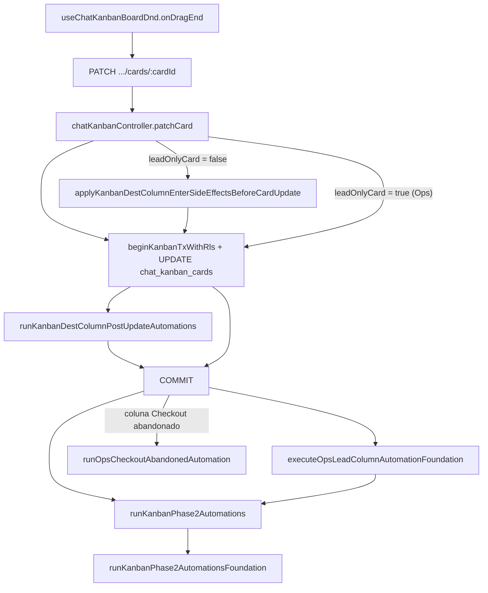

# AUDIT_KANBAN_AUTOMATIONS_CONSISTENCY

**Modo:** READ ONLY  
**Data:** 2026-05-24  
**Objetivo:** Auditar todas as formas de movimentação de cards e verificar se as automações Kanban (Phase2) são executadas de forma consistente — manual e automático.

---

## Resumo executivo

| Pergunta | Resposta |
|----------|----------|
| Existe um motor único? | **Parcialmente** — `runKanbanPhase2Automations()` é o entrypoint pós-commit, mas vários fluxos **não o chamam**. |
| Drag manual no Ops dispara mensagens? | **Não** — cards `acquisition_lead` entram em modo **foundation** (Sprint 3.1): timeline + logs, **sem side effects**. |
| Promotion Engine dispara automações? | **Não** — apenas `UPDATE` direto em `chat_kanban_cards`. |
| Trial Engagement / Recovery disparam automações? | **Não** — usam `promoteLifecycleCard()` → bypass total. |
| Causa raiz de “mover manualmente não envia mensagem” no Ops | **D + E** — subject `acquisition_lead` + `runKanbanPhase2AutomationsFoundation` com `side_effects: 'deferred'`; Lifecycle nunca passa pelo pipeline de `patchCard`. |

**Tabela rápida:**

| Fluxo | Move card | Executa automações reais | Mesmo motor |
|-------|-----------|--------------------------|-------------|
| Drag manual (tenant / conversa) | Sim | **Sim** (notify, WhatsApp, webhook) | `patchCard` → Phase2 conversation |
| Drag manual (Ops / lead) | Sim | **Não** (foundation only) | `patchCard` → foundation branch |
| Drag manual (Ops / Checkout abandonado) | Sim | **Sim** (automação hardcoded) | Caminho especial |
| Promotion Engine | Sim | **Não** | Bypass SQL |
| Trial Engagement / Recovery | Sim | **Não** | Bypass SQL |
| Lifecycle Billing / Onboarding | Sim | **Não** | Bypass SQL |
| `syncAcquisitionLeadToOpsKanban` | Sim | **Não** (timeline only) | Bypass SQL |
| `createCard` (tenant) | Sim | **Não** na criação | Só scheduled move + proposta auto |
| Scheduled move (worker) | Sim | **Sim** (conversa) | Mesmo pipeline que `patchCard` tenant |

---

## 1. Motor de automações

### Entrypoint principal (pós-commit)

```2383:2390:packages/backend/src/services/kanbanColumnAutomationService.ts
export async function runKanbanPhase2Automations(
  ctx: KanbanPhase2AutomationContext,
): Promise<{ attempted: boolean; foundation?: boolean }> {
  const subjectKind = ctx.subjectKind ?? 'conversation';

  if (subjectKind === 'acquisition_lead') {
    return runKanbanPhase2AutomationsFoundation(ctx);
  }
```

### Parâmetros (`KanbanPhase2AutomationContext`)

| Campo | Uso |
|-------|-----|
| `tenantId`, `actorUserId` | Escopo RLS e auditoria |
| `boardId`, `columnId`, `columnName`, `columnMetadata` | Config Phase2 da coluna destino |
| `cardId` | Cartão movido |
| `conversationId` | Obrigatório para side effects reais (mensagem, webhook audit) |
| `subjectKind` | `'conversation'` (default) ou `'acquisition_lead'` |
| `acquisitionLeadId`, `correlationId` | Ops / timeline |

Configuração lida de `chat_kanban_columns.metadata` → objeto `kanban_phase2` (via `parseKanbanPhase2`). **Não existe** tabela `chat_kanban_column_automations` no repositório — automações vivem no **metadata JSON** da coluna (+ `automation_config.enabled`).

### O que executa (subject `conversation`)

Após `parseKanbanPhase2` com `version === 1` e alguma ação habilitada:

- `notify_operator` / `notify_team`
- `auto_message_text` ou `whatsapp_model_sequence`
- `webhook` outbound (non-blocking)

### O que executa **in-transaction** (só conversa, via `patchCard`)

Em `runKanbanDestColumnPostUpdateAutomations` (antes do COMMIT):

- CRM stage sync
- Lead link/create
- Ensure client
- Task auto-create
- Auto-create proposal

### Branch Ops (`acquisition_lead`)

```2489:2538:packages/backend/src/services/kanbanColumnAutomationService.ts
/**
 * Sprint 3.1 — acquisition lead: atravessa phase2 sem side effects (mensagem, webhook, notify).
 */
async function runKanbanPhase2AutomationsFoundation(...) {
  // ...
  logKanbanPhase2Foundation(ctx, {
    // ...
    side_effects: 'deferred',
  });
  return { attempted: Boolean(hasConfiguredAction || parsed.version === 1), foundation: true };
}
```

### Pipeline Ops (wrapper)

`executeOpsLeadColumnAutomationFoundation()` → timeline + `[ops_kanban_column_automation]` → delega para `runKanbanPhase2Automations()` (que cai no foundation).

### Dependência de colunas

Sim: automações disparam na **entrada** na coluna destino (`destColumn.metadata`). Não há automações de “saída” genéricas no Phase2 — saída cancela scheduled moves (`cancelPendingScheduledMovesForCardColumn`).

---

## 2. Fluxo de movimento manual (`PATCH /cards/:id`)



### Controller / service / queries

| Camada | Implementação |
|--------|----------------|
| Rotas Ops | `PATCH /api/superadmin/ops/kanban/cards/:cardId` |
| Rotas tenant | `PATCH /api/chat/kanban/cards/:cardId` |
| Controller | `patchCard` em `chatKanbanController.ts` |
| Service | Lógica no controller + `kanbanInternalCardColumnPipeline`, `kanbanColumnAutomationService`, `kanbanOpsAutomationFoundation` |
| DB | `UPDATE chat_kanban_cards SET column_id, position, ...` |

### Ramificação crítica (`leadOnlyCard`)

```1447:1447:packages/backend/src/controllers/chatKanbanController.ts
    const leadOnlyCard = isOperationalAcquisitionLeadCard(tenantId, card as Record<string, unknown>);
```

```1532:1532:packages/backend/src/controllers/chatKanbanController.ts
    if (columnChanged && body.column_id && destColForRules && !leadOnlyCard) {
```

Cards Ops (`acquisition_lead_id` preenchido, `conversation_id` null) **pulam** todo o pipeline de conversa (side effects in-TX + Phase2 real).

Após COMMIT, só para Ops tenant:

```1645:1677:packages/backend/src/controllers/chatKanbanController.ts
    if (columnChanged && destColForRules && leadOnlyCard && tenantId === SUPERADMIN_OPS_KANBAN_TENANT_ID) {
      void resolveKanbanAutomationContext({ ... }).then((automationCtx) => {
        if (!automationCtx) return;
        return executeOpsLeadColumnAutomationFoundation(automationCtx, { ... });
      });
```

### O drag-and-drop manual executa automações?

| Contexto | Resposta |
|----------|----------|
| **Kanban tenant (conversa)** | **SIM** — `runKanbanPhase2Automations` com mensagens/webhook/notify |
| **Ops Kanban (lead)** | **NÃO (reais)** — apenas foundation + timeline; exceção: coluna **Checkout abandonado** |

---

## 3. Promotion Engine (`promoteLifecycleCard`)

```165:187:packages/backend/src/lifecycle/lifecyclePromotionService.ts
async function moveCardToDestination(input: { ... }): Promise<void> {
  // ...
  await client.query(
    `UPDATE chat_kanban_cards
     SET board_id = $1::uuid, column_id = $2::uuid, position = $3, updated_at = now()
     WHERE id = $4::uuid AND tenant_id = $5::uuid AND archived_at IS NULL`,
    [input.destBoardId, input.destColumnId, nextPos, input.cardId, SUPERADMIN_OPS_KANBAN_TENANT_ID],
  );
```

- **Chama Phase2?** **NÃO**
- **Momento:** só UPDATE; sem `patchCard`, sem `executeOpsLeadColumnAutomationFoundation`
- **Parâmetros:** `cardId`, `destBoardId`, `destColumnId`, `actorUserId` — sem `columnMetadata`, sem `correlationId` para automações

### Promotion Engine executa automações?

**NÃO.**

---

## 4. Trial Engagement (Sprint N)

```text
trialEngagementLifecycleJob
  → trialEngagementLifecycleService.processTrialEngagementStage()
    → promoteLifecycleCard({ eventType: 'trial.engagement.*' })
      → moveCardToDestination()  // UPDATE direto
```

Eventos: `trial.engagement.started`, `.day2`, `.day4`, `.day6`, `.finalizing`.

- **Automações Kanban disparadas?** **NÃO**
- **Bypass?** **SIM** — mesmo bypass do Promotion Engine

---

## 5. Trial Recovery (Sprint K)

```text
trialRecoveryLifecycleJob
  → trialRecoveryLifecycleService
    → promoteLifecycleCard({ eventType: 'trial.expired' | 'trial.recovery.*' })
```

- **Automações disparadas?** **NÃO**
- **Bypass?** **SIM**

---

## 6. Lifecycle Billing / Onboarding

| Evento | Chamador | Automações Phase2? |
|--------|----------|-------------------|
| `subscription.activated` | `subscriptionService.activatePlanFromBilling` | **NÃO** |
| `trial.expired` | `expireTrialsPastDue` | **NÃO** |
| `onboarding.started` | `acquisitionProvisioningService` | **NÃO** |
| `onboarding.completed` | `acquisitionOnboardingWizardService` | **NÃO** |

Todos usam `promoteLifecycleCard()` → `moveCardToDestination()` → UPDATE sem pipeline de coluna.

---

## 7. Criação de card (`POST .../cards`)

`createCard` em `chatKanbanController.ts`:

- `INSERT INTO chat_kanban_cards` (exige `conversation_id`)
- In-TX: `runKanbanAutoCreateProposalInTransaction`, `insertScheduledMoveIfColumnConfigured`
- **Não chama** `runKanbanPhase2Automations` nem `executeOpsLeadColumnAutomationFoundation`

Cards Ops são criados por `syncAcquisitionLeadToOpsKanban` (INSERT com `acquisition_lead_id`, `conversation_id NULL`) — também **sem** automações de entrada.

### Distinção create vs move

| Ação | Automações de entrada |
|------|----------------------|
| **create** (tenant) | Scheduled move futuro; proposta auto se configurado; **sem** Phase2 imediato |
| **move** (tenant conversa) | Pipeline completo `patchCard` |
| **create/move** (Ops lead via sync) | Timeline only |

---

## 8. Colunas com automações

### Onde vive a config

- `chat_kanban_columns.metadata.kanban_phase2` (version 1)
- `metadata.automation_config.enabled` (flag ops)
- Regras legadas: `metadata` com `require_move_reason`, `require_confirmation` (não são Phase2)

### Quando disparam

| Tipo | Momento |
|------|---------|
| Attendance / org rules | **Entrada** (antes do UPDATE, só conversa) |
| CRM / lead / client / task | **Entrada** (in-TX pós-UPDATE, só conversa) |
| Notify / WhatsApp / webhook | **Entrada** (pós-COMMIT, só conversa) |
| Auto-move por tempo | **Entrada** na coluna (agenda `chat_kanban_scheduled_moves`) |
| Ops foundation | **Entrada** (pós-COMMIT, lead — log only) |
| Checkout abandonado | **Entrada** (hardcoded, lead — workflow + WhatsApp) |

### Debounce / idempotência

| Mecanismo | Onde |
|-----------|------|
| Debounce 12s mesma coluna | `KANBAN_AUTO_TEXT_SAME_COLUMN_DEBOUNCE_MS` em auto_message / whatsapp sequence |
| Idempotência Promotion | `already_at_destination` no router |
| Idempotência sync lead | UPDATE se card já existe |
| Scheduled move | status `executed` / `skipped` na fila |
| Checkout abandonado | `idempotencyKey: ops-checkout-abandoned:{leadId}:{trigger}` |

---

## 9. `move_reason` e `move_confirmed`

Definidos em `patchCard` **antes** do UPDATE:

- `require_move_reason` → 400 `KANBAN_MOVE_REASON_REQUIRED` se ausente → **impede o move** (e portanto automações)
- `require_confirmation` → 400 se `move_confirmed !== true` → **impede o move**

Uma vez o PATCH aceito, `move_reason` é repassado a `applyKanbanColumnEnterSideEffectsBeforeCardUpdate` (regras de atendimento) — **não bloqueia** Phase2.

`promoteLifecycleCard` e `syncAcquisitionLeadToOpsKanban` **ignoram** esses campos.

---

## 10. Logs esperados

### Movimento manual — tenant conversa

- `[chatKanban] phase2 auto_message_text success` / `skipped` / `failed`
- `[chatKanban] whatsapp_model_sequence failed`
- `[chatKanban] phase2 webhook outbound failed`
- `[chatKanban] phase2 automations failed` (wrapper em `patchCard`)

### Movimento manual — Ops lead

- `[ops_kanban_column_automation]` — `column_automation_started` / `_completed` / `_failed`
- `[kanban_phase2_foundation]` — `side_effects: 'deferred'`
- Timeline no `metadata.operational_timeline` do card

### Movimento manual — Ops Checkout abandonado

- Workflow `acquisition.checkout.abandoned`
- Communication gateway (shadow/sent)
- Timeline `checkout_abandoned_automation`

### Promotion Engine

- `[lifecycle_promotion]` — status `moved` / `already_at_destination` / etc.
- **Sem** logs Phase2

### Trial Engagement / Recovery

- `[trial_engagement_lifecycle]` / logs do job recovery
- `[lifecycle_promotion]`
- **Sem** Phase2

### Lifecycle Billing

- `[lifecycle_promotion]`
- Billing observer shadow logs (separados do Kanban)

### Scheduled move worker

- `kanban_scheduled_move_executed`
- `[kanbanScheduledMove] phase2 automations failed`

---

## 11. Comparação completa

| Fluxo | Move card | Executa automações reais | Mesmo motor |
|-------|-----------|--------------------------|-------------|
| Drag manual (tenant conversa) | Sim | **Sim** | `patchCard` + `runKanbanPhase2Automations` |
| Drag manual (Ops lead) | Sim | **Não** (foundation) | Foundation branch |
| Drag manual (Ops Checkout abandonado) | Sim | **Sim** (hardcoded) | `runOpsCheckoutAbandonedAutomation` |
| Promotion Engine | Sim | **Não** | Bypass |
| Trial Engagement | Sim | **Não** | Bypass |
| Trial Recovery | Sim | **Não** | Bypass |
| `subscription.activated` | Sim | **Não** | Bypass |
| `onboarding.completed` | Sim | **Não** | Bypass |
| `syncAcquisitionLeadToOpsKanban` | Sim | **Não** | Bypass |
| `createCard` | Sim (insert) | **Não** (entrada imediata) | Parcial |
| Scheduled move (worker) | Sim | **Sim** (conversa) | ≈ `patchCard` tenant |

---

## 12. Arquitetura atual — classificação

| Hipótese | Aplica? | Evidência |
|----------|---------|-----------|
| **A** Múltiplos caminhos de movimentação | **Sim** | `patchCard`, `moveCardToDestination`, `syncAcquisitionLeadToOpsKanban`, scheduled worker, `runOpsCheckoutAbandonedAutomation` |
| **B** Bypass do motor de automações | **Sim** | Promotion Engine, Lifecycle jobs, sync lead |
| **C** UPDATE direto em `chat_kanban_cards` | **Sim** | `lifecyclePromotionService.moveCardToDestination`, `superadminOpsKanbanLeadService` |
| **D** Phase2 só em alguns fluxos | **Sim** | Completo: `patchCard` conversa + scheduled worker; parcial: Ops foundation; ausente: Lifecycle |
| **E** Inconsistência estrutural | **Sim** | Subject union criado (Sprint 3.1) mas side effects ainda `deferred` para leads |

---

## 13. Causa raiz mais provável

### Por que mover manualmente no Ops não envia mensagens

1. **Cards Ops são `acquisition_lead`**, não conversa — Phase2 real exige `conversationId` para WhatsApp/webhook/audit em `chat_conversation_assignment_history`.
2. **Sprint 3.1** implementou `runKanbanPhase2AutomationsFoundation` **de propósito** sem side effects — documentado em `SPRINT3_1_OPS_AUTOMATION_FOUNDATION.md`.
3. Mesmo após corrigir o drag (Sprint N2.2) para chegar em `patchCard`, o ramo `leadOnlyCard` **nunca** chama `runKanbanAutoOutboundText` nem workflows genéricos da coluna.

### Por que movimentos Lifecycle não enviam mensagens

`promoteLifecycleCard()` move o card com SQL direto e **não invoca** `patchCard`, `executeOpsLeadColumnAutomationFoundation`, nem `runOpsCheckoutAbandonedAutomation` (exceto se destino for Checkout abandonado **e** o move passar por `patchCard` — Lifecycle não faz isso).

### Pontas fora do padrão

| Ponta | Status |
|-------|--------|
| `promoteLifecycleCard` | Fora do pipeline |
| `syncAcquisitionLeadToOpsKanban` | Fora do pipeline |
| Ops lead manual drag | Pipeline foundation only |
| Ops Checkout abandonado | Automação paralela hardcoded |
| Tenant `createCard` | Sem Phase2 na criação |

---

## 14. Recomendações (somente análise)

### Arquitetura ideal

Extrair um único serviço, por exemplo `moveKanbanCardWithColumnAutomations()`, que:

1. Recebe `{ cardId, destColumnId, destBoardId?, actorUserId, tenantId, source, correlationId, moveReason?, moveConfirmed? }`
2. Carrega card + coluna destino + metadata
3. Resolve `subject` (`conversation` | `acquisition_lead`)
4. Executa o mesmo pipeline de `patchCard` (in-TX + COMMIT + pós-commit)
5. É chamado por:
   - `patchCard` (HTTP)
   - `promoteLifecycleCard` (após resolver rota)
   - `syncAcquisitionLeadToOpsKanban` (quando `moved === true`)
   - Scheduled move worker (já alinhado para conversa — reutilizar função)

### Ops lead — próxima sprint

Promover `runKanbanPhase2AutomationsFoundation` para execução real com `subject=acquisition_lead`:

- Templates via telefone do lead (`acquisition_leads.phone`)
- Workflows via `startWorkflow` + `automation_config`
- Communication gateway com `tenantId: null` (padrão Checkout abandonado)
- Manter idempotência por `correlationId` + coluna

### Critério de consistência

**Um movimento = um pipeline**, independente da origem (UI, Lifecycle, sync, job). Hoje só **~2 de ~8** caminhos executam automações reais de coluna.

---

## Referências investigadas

- `packages/backend/src/services/kanbanColumnAutomationService.ts` — `runKanbanPhase2Automations`
- `packages/backend/src/services/kanbanOpsAutomationFoundation.ts` — `executeOpsLeadColumnAutomationFoundation`
- `packages/backend/src/services/kanbanInternalCardColumnPipeline.ts`
- `packages/backend/src/controllers/chatKanbanController.ts` — `patchCard`, `createCard`
- `packages/backend/src/lifecycle/lifecyclePromotionService.ts` — `promoteLifecycleCard`, `moveCardToDestination`
- `packages/backend/src/lifecycle/trialEngagementLifecycleService.ts`
- `packages/backend/src/lifecycle/trialRecoveryLifecycleService.ts`
- `packages/backend/src/services/superadminOpsKanbanLeadService.ts` — `syncAcquisitionLeadToOpsKanban`
- `packages/backend/src/services/superadminOpsColumnAutomationService.ts` — Checkout abandonado
- `packages/backend/src/services/kanbanScheduledMoveService.ts`
- `packages/backend/src/services/kanbanAutomationContext.ts`
- `docs/architecture/automation/SPRINT3_1_OPS_AUTOMATION_FOUNDATION.md`
- `docs/architecture/automation/AUDIT_MANUAL_KANBAN_MOVE_TENANT_REQUIRED.md`
