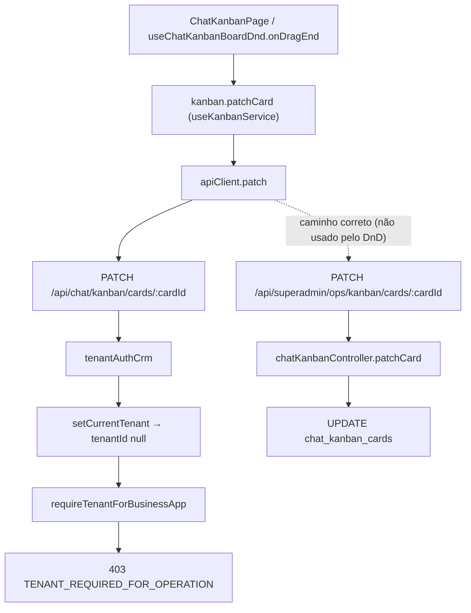

# AUDIT_MANUAL_KANBAN_MOVE_TENANT_REQUIRED

**Modo:** READ ONLY  
**Data:** 2026-05-24  
**Objetivo:** Explicar por que qualquer movimentação manual no Ops Kanban retorna `TENANT_REQUIRED_FOR_OPERATION`, sem alterar código.

---

## Resumo executivo

| Pergunta | Resposta |
|----------|----------|
| O Promotion Engine move cards? | **Sim** — SQL direto com `SUPERADMIN_OPS_KANBAN_TENANT_ID`, sem HTTP tenant-scoped. |
| O drag-and-drop manual falha em todos os boards? | **Sim** — o drop chama a API **errada** (`/api/chat/kanban`, não `/api/superadmin/ops/kanban`). |
| Causa raiz mais provável | **A + E** — payload/rota incorreta no frontend (escopo do `KanbanServiceProvider` não cobre o hook de DnD). |

**Hipótese vencedora:** o hook `useChatKanbanBoardDnd` é instanciado **fora** do `KanbanServiceProvider`. Ele usa o valor padrão do contexto (`chatKanbanService` → `/api/chat/kanban`). Essa rota passa por `tenantAuthCrm` → `requireTenantForBusinessApp`, que bloqueia super admins de plataforma sem `users.tenant_id` com exatamente `TENANT_REQUIRED_FOR_OPERATION`.

Leitura e listagem do Ops Kanban **funcionam** porque `ChatKanbanPage` usa a prop `service` diretamente (`superadminOpsKanbanService`). Apenas o **drop** herda o serviço errado.

---

## 1. Frontend — drag-and-drop

### Componente responsável

| Camada | Arquivo |
|--------|---------|
| Página Ops | `src/pages/superadmin/SuperAdminOpsKanbanPage.tsx` → reutiliza `ChatKanbanPage` com `service={superadminOpsKanbanService}` |
| UI + DnD | `src/pages/ChatKanbanPage.tsx` + `src/components/chat-kanban/useChatKanbanBoardDnd.ts` |
| Biblioteca | `@dnd-kit/core` (`DndContext`, `onDragEnd`) |

### Função ao soltar o card

`useChatKanbanBoardDnd` → `onDragEnd` (callback assíncrono):

```194:296:src/components/chat-kanban/useChatKanbanBoardDnd.ts
  const onDragEnd = useCallback(
    async (event: DragEndEvent) => {
      // ... validações, cálculo de position, move_reason / move_confirmed ...
      try {
        const updated = await kanban.patchCard(activeIdStr, {
          column_id: targetCol,
          position: newPos,
          ...(moveReason ? { move_reason: moveReason } : {}),
          ...(moveConfirmed ? { move_confirmed: true } : {}),
        });
        // ...
      } catch (e) {
        toast.error(e instanceof Error ? e.message : 'Não foi possível mover o cartão');
      }
    },
    [enabled, sortedColumns, setCards, requestMoveReason, requestMoveConfirmation, onCardSynced],
  );
```

`kanban` vem de `useKanbanService()` (linha 105 do mesmo arquivo).

### Endpoint, método e payload

Definido em `createChatKanbanService().patchCard`:

```274:281:src/services/chatKanban.ts
  async patchCard(
    cardId: string,
    payload: { column_id?: string; position?: number; move_reason?: string; move_confirmed?: boolean },
  ): Promise<ChatKanbanBoardCard> {
    const res = await apiClient.patch<ChatKanbanBoardCard>(`${base}/cards/${cardId}`, payload);
```

| Campo | Presente no payload? |
|-------|----------------------|
| `tenantId` | **Não** — tenant é inferido no backend via middleware |
| `boardId` | **Não** — implícito no card (`cardId` na URL) |
| `columnId` | **Sim** — como `column_id` |
| `cardId` | **Sim** — na URL (`/cards/:cardId`) |
| `position` | **Sim** |
| `move_reason` / `move_confirmed` | Opcionais (regras da coluna) |

### Headers

`apiClient.patch` envia apenas:

- `Authorization: Bearer <token>` (JWT da sessão)
- `Content-Type: application/json`

Não há header `X-Tenant-Id` nem query `tenantId`.

### Bug estrutural (causa raiz)

`ChatKanbanPage` resolve o serviço Ops corretamente na prop:

```86:88:src/pages/ChatKanbanPage.tsx
const ChatKanbanPage = ({ service }: Props) => {
  const kanban = service ?? chatKanbanService;
  const isOpsKanban = service === superadminOpsKanbanService;
```

Mas o hook de DnD é chamado **antes** do provider:

```459:466:src/pages/ChatKanbanPage.tsx
  const boardDnd = useChatKanbanBoardDnd({
    cards,
    setCards,
    sortedColumns: visibleSortedColumns,
    enabled: Boolean(selectedBoardId && visibleSortedColumns.length > 0 && !loadingBoardData),
    requestMoveReason,
    requestMoveConfirmation,
  });
```

O provider só envolve o JSX retornado:

```607:608:src/pages/ChatKanbanPage.tsx
  return (
    <KanbanServiceProvider service={kanban}>
```

O default do contexto é o Kanban **tenant**:

```4:4:src/components/chat-kanban/KanbanServiceContext.tsx
const KanbanServiceContext = createContext<ChatKanbanService>(chatKanbanService);
```

**Efeito no Ops Kanban:**

| Operação | Serviço usado | Base URL |
|----------|---------------|----------|
| `listBoards`, `listCards`, `deleteCard` | prop `kanban` | `/api/superadmin/ops/kanban` ✅ |
| `patchCard` no drag-and-drop | `useKanbanService()` default | `/api/chat/kanban` ❌ |
| Diálogos dentro do provider (colunas, settings) | `useKanbanService()` injetado | `/api/superadmin/ops/kanban` ✅ |

---

## 2. Endpoint backend

### Rota correta (Ops)

```68:68:packages/backend/src/routes/superadminOpsKanbanRoutes.ts
router.patch('/cards/:cardId', patchCard);
```

Montagem: `app.use('/api/superadmin/ops/kanban', superadminOpsKanbanRoutes)` (`packages/backend/src/index.ts`).

**Rota completa:** `PATCH /api/superadmin/ops/kanban/cards/:cardId`

### Rota efetivamente chamada pelo DnD (bug)

```53:53:packages/backend/src/routes/chatKanbanRoutes.ts
router.patch('/cards/:cardId', patchCard);
```

**Rota completa:** `PATCH /api/chat/kanban/cards/:cardId`

### Middleware da rota Ops (funciona quando chamada)

```43:43:packages/backend/src/routes/superadminOpsKanbanRoutes.ts
router.use(authenticateToken, requireSuperAdmin, bindRequestContext, setSuperadminOpsTenant, setRequestDb);
```

### Middleware da rota tenant (bloqueia super admin plataforma)

```29:29:packages/backend/src/routes/chatKanbanRoutes.ts
router.use(...tenantAuthCrm);
```

`tenantAuthCrm` = `authenticateToken` → `setCurrentTenant` → `requireTenantForBusinessApp` → …

### Controller e service

| Camada | Implementação |
|--------|----------------|
| Controller | `patchCard` em `packages/backend/src/controllers/chatKanbanController.ts` (compartilhado) |
| Service | Lógica inline no controller + helpers (`loadCard`, `loadColumn`, `beginKanbanTxWithRls`, automações phase2, pipeline ops para `acquisition_lead_id`) |
| Repository | Queries diretas `pool` / `client.query` em `chat_kanban_*` — **não há repository dedicado** |

### Payload esperado pelo controller

Schema Zod `patchCardSchema` (corpo JSON):

- `column_id` (opcional, UUID)
- `position` (opcional, number)
- `move_reason` (opcional, string)
- `move_confirmed` (opcional, boolean)
- `metadata`, `archived_at` (outros fluxos)

Parâmetro de rota: `cardId`.

Primeira linha do handler:

```1435:1436:packages/backend/src/controllers/chatKanbanController.ts
    const tenantId = requireTenantId(req, res);
    if (!tenantId) return;
```

`tenantId` vem de `req.tenantId` (middleware), não do body.

---

## 3. Origem do erro `TENANT_REQUIRED_FOR_OPERATION`

### Onde é lançado

```166:177:packages/backend/src/middleware/auth.ts
export function requireTenantForBusinessApp(
  req: AuthRequest,
  res: Response,
  next: NextFunction
): void {
  const tid = req.tenantId;
  if (tid != null && String(tid).length > 0) {
    next();
    return;
  }
  res.status(403).json({ error: 'TENANT_REQUIRED_FOR_OPERATION' });
}
```

| Item | Valor |
|------|-------|
| Arquivo | `packages/backend/src/middleware/auth.ts` |
| Função | `requireTenantForBusinessApp` |
| Linha | ~176 |
| HTTP | 403 |

*(Há ocorrência duplicada em `dashboardController.ts` ~1594 — não participa do fluxo de PATCH de card.)*

### Stack lógica (caminho que falha)

```text
PATCH /api/chat/kanban/cards/:cardId
  → chatKanbanRoutes (router.use tenantAuthCrm)
    → authenticateToken
    → setCurrentTenant          // req.tenantId = users.tenant_id (null para super admin plataforma)
    → bindRequestContext
    → requireTenantForBusinessApp  ← 403 TENANT_REQUIRED_FOR_OPERATION
    → (patchCard nunca executa)
```

### Quem chama `requireTenantForBusinessApp`

Incluído em `tenantAuthCrm`, usado por dezenas de rotas CRM (`/api/chat`, `/api/chat/kanban`, `/api/clients`, …). Documentado em `docs/HARDENING-SUPERADMIN-ISOLAMENTO.md` (hardening Sprint isolamento super admin).

### Cenários que disparam o erro

- Usuário autenticado com `req.tenantId` **null** ou vazio após `setCurrentTenant`.
- Típico: **super admin de plataforma** (`is_super_admin = true`, `users.tenant_id IS NULL`).

### Parâmetros necessários para **evitar** o erro (na rota tenant)

- `req.tenantId` preenchido — usuário com `tenant_id` no banco **ou**
- Usar rota Ops que injeta tenant virtual (`setSuperadminOpsTenant`) em vez de `tenantAuthCrm`.

---

## 4. Contexto tenant

### Como o tenant é resolvido

| Mecanismo | Onde | Ops Kanban | Kanban tenant (DnD bug) |
|-----------|------|------------|-------------------------|
| `req.user.tenant_id` | Não usado diretamente no middleware | — | — |
| `setCurrentTenant` → `getTenantIdForUser(userId)` | `tenantAuthCrm` | **Não aplicado** | `null` para super admin plataforma |
| `setSuperadminOpsTenant` | `superadminOpsKanbanRoutes` | `SUPERADMIN_OPS_KANBAN_TENANT_ID` | — |
| Header custom | — | **Não existe** | — |
| Token JWT | Só `userId` | — | — |
| `board.tenant_id` / `card.tenant_id` | Queries SQL após middleware | Usado no UPDATE | Nunca alcançado (403 antes) |

Tenant virtual Ops:

```9:11:packages/backend/src/middleware/superadminOpsTenant.ts
export function setSuperadminOpsTenant(req: AuthRequest, _res: Response, next: NextFunction): void {
  req.tenantId = SUPERADMIN_OPS_KANBAN_TENANT_ID;
  next();
}
```

ID fixo: `1f1a0f0a-0000-4000-8000-000000000001` (`packages/backend/src/config/superadminOpsKanban.ts`).

`setRequestDb` propaga para RLS:

```254:259:packages/backend/src/middleware/auth.ts
    const tenantIdValue = escapeSetLocalValue(req.tenantId ?? '');
    await client.query(`SET LOCAL app.current_tenant_id = '${tenantIdValue}'`);
    // ...
    if (req.user?.is_super_admin) {
      await client.query("SET LOCAL app.bypass_rls = '1'");
```

---

## 5. Fluxo completo do drag-and-drop



**O erro ocorre em:** `requireTenantForBusinessApp` — **antes** do controller e de qualquer query em `chat_kanban_cards`.

---

## 6. Comparação com Promotion Engine

### `promoteLifecycleCard()`

| Aspecto | Comportamento |
|---------|---------------|
| Actor | `SUPERADMIN_OPS_KANBAN_SYSTEM_USER_ID` ou primeiro `users.is_super_admin` |
| Tenant | Constante `SUPERADMIN_OPS_KANBAN_TENANT_ID` em SQL |
| Contexto | Não usa HTTP; `pool.connect()` + `beginKanbanTxWithRls(client, SUPERADMIN_OPS_KANBAN_TENANT_ID, actor)` |
| Move | `UPDATE chat_kanban_cards` direto em `moveCardToDestination` |

```173:185:packages/backend/src/lifecycle/lifecyclePromotionService.ts
    await beginKanbanTxWithRls(client, SUPERADMIN_OPS_KANBAN_TENANT_ID, input.actorUserId);
    // ...
    await client.query(
      `UPDATE chat_kanban_cards
       SET board_id = $1::uuid, column_id = $2::uuid, position = $3, updated_at = now()
       WHERE id = $4::uuid AND tenant_id = $5::uuid AND archived_at IS NULL`,
      [input.destBoardId, input.destColumnId, nextPos, input.cardId, SUPERADMIN_OPS_KANBAN_TENANT_ID],
    );
```

### Drag-and-drop manual (estado atual)

| Aspecto | Comportamento |
|---------|---------------|
| Actor | JWT do super admin (ok) |
| Tenant | Rota tenant → `setCurrentTenant` → **null** → bloqueado |
| Contexto | Depende do path HTTP; DnD usa path tenant por bug de React Context |
| Resultado | 403 antes de tocar no card |

### Diferença essencial

O Promotion Engine **nunca** passa por `requireTenantForBusinessApp`. O DnD manual **passa** porque chama `/api/chat/kanban` em vez de `/api/superadmin/ops/kanban`.

---

## 7. Histórico e regressões

### Evidências no código

| Sinal | Interpretação |
|-------|---------------|
| `KanbanServiceProvider` + `useKanbanService` | Introduzidos para reutilizar `ChatKanbanPage` no Ops (`SUPER_ADMIN_OPERATIONAL_LAYER.md`) |
| `useChatKanbanBoardDnd` usa context | Hook adicionado **depois** ou sem mover para dentro do provider |
| `rewriteEndpointForCurrentScope` em `api/client.ts` | Só reescreve `/api/chat` → `/api/superadmin/chat` em `/superadmin/chat` — **não** cobre Kanban Ops em `/superadmin/operacao/kanbans` |
| `docs/HARDENING-SUPERADMIN-ISOLAMENTO.md` | `requireTenantForBusinessApp` em `tenantAuthCrm` — torna o bug **visível** (antes, super admin sem tenant poderia ter falhado de outras formas no CRM) |

### O movimento manual já funcionou?

**Provavelmente nunca funcionou de forma confiável** para super admin de plataforma sem `tenant_id`, desde que:

1. O Ops Kanban passou a reutilizar `ChatKanbanPage` com context injetável, **e**
2. O hook DnD ficou fora do escopo do provider, **e**
3. O hardening CRM passou a retornar `TENANT_REQUIRED_FOR_OPERATION` de forma explícita.

Operações que usam `kanban` da prop (listar, remover card) podem ter mascarado o problema — só o drag falha consistentemente.

### Service criada para tenants normais?

**Sim.** `chatKanbanController` e `chatKanbanRoutes` nasceram para `/chat/kanban` (tenant). A camada Ops **reutiliza** o mesmo controller com middleware diferente (`setSuperadminOpsTenant`). O bug não está no controller Ops — está no frontend que não chega nessa rota no drop.

---

## 8. Banco de dados

### `tenant_id` nas tabelas

Todas possuem `tenant_id NOT NULL`:

- `chat_kanban_boards.tenant_id`
- `chat_kanban_columns.tenant_id`
- `chat_kanban_cards.tenant_id`

(Schema: `database/init/99_chat_kanban_etapa_d2.sql`; cards Ops com `acquisition_lead_id` — migration `260`.)

### Tenant dos boards Ops

| Item | Valor |
|------|-------|
| Tenant virtual | `1f1a0f0a-0000-4000-8000-000000000001` |
| Slug esperado | `superadmin-ops` (migration `259`) |
| Consistência board/card | Cards Ops são criados com o mesmo `tenant_id` do board (`superadminOpsKanbanLeadService`) |

**Não há evidência de inconsistência tenant board ≠ card** como causa do 403. O request nem chega ao banco.

---

## 9. Conclusão — classificação

| Hipótese | Aplica? | Nota |
|----------|---------|------|
| **A** Payload / rota frontend incompleta | **Sim (principal)** | Drop usa base `/api/chat/kanban`; não envia `tenantId` e nem deveria — mas precisa da rota Ops |
| **B** Controller perdeu tenant context | Não | Controller Ops ok quando a rota correta é chamada |
| **C** Middleware exige tenant desnecessariamente | Parcial | Exigência é **correta** para CRM; o DnD está na rota errada |
| **D** Service tenant reutilizada pelo Ops | **Sim (design)** | Reuso intencional; falha é de **wiring** frontend, não de arquitetura backend |
| **E** Regressão recente | **Sim** | Escopo do `KanbanServiceProvider` + hardening `tenantAuthCrm` |
| **F** Outro | — | — |

### Causa raiz mais provável

**A + E:** o drag-and-drop chama `PATCH /api/chat/kanban/cards/:cardId` porque `useChatKanbanBoardDnd` executa **fora** do `KanbanServiceProvider` e recebe o default `chatKanbanService`. A rota tenant aplica `requireTenantForBusinessApp` e rejeita super admins sem `tenant_id` com `TENANT_REQUIRED_FOR_OPERATION`.

### Por que listar boards/cards funciona mas mover não

`ChatKanbanPage` usa a prop `service` diretamente para leitura; só o hook DnD depende do context mal posicionado.

### Correção sugerida (fora do escopo READ ONLY)

Mover `useChatKanbanBoardDnd` para dentro do provider, passar `kanban` como argumento ao hook, ou elevar o provider acima do hook — garantindo que `patchCard` use `/api/superadmin/ops/kanban`.

---

## Referências investigadas

- `src/components/chat-kanban/useChatKanbanBoardDnd.ts`
- `src/pages/ChatKanbanPage.tsx`
- `src/components/chat-kanban/KanbanServiceContext.tsx`
- `src/services/chatKanban.ts` / `src/services/superadminOpsKanban.ts`
- `packages/backend/src/routes/superadminOpsKanbanRoutes.ts`
- `packages/backend/src/routes/chatKanbanRoutes.ts`
- `packages/backend/src/controllers/chatKanbanController.ts` (`patchCard`)
- `packages/backend/src/middleware/auth.ts` (`requireTenantForBusinessApp`, `tenantAuthCrm`)
- `packages/backend/src/middleware/superadminOpsTenant.ts`
- `packages/backend/src/lifecycle/lifecyclePromotionService.ts` (`promoteLifecycleCard`, `moveCardToDestination`)
- `docs/HARDENING-SUPERADMIN-ISOLAMENTO.md`
- `docs/architecture/automation/SUPER_ADMIN_OPERATIONAL_LAYER.md`
