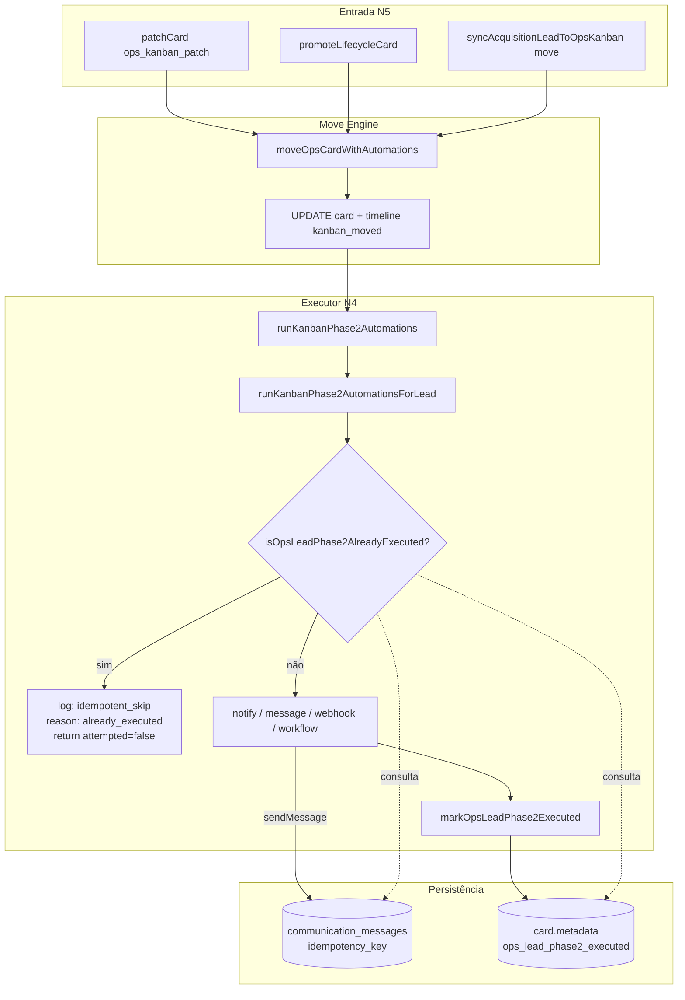

# AUDIT_OPS_LEAD_PHASE2_IDEMPOTENCY

**Modo:** READ ONLY  
**Data:** 2026-05-24  
**Escopo:** Mecanismo de idempotência de `runKanbanPhase2AutomationsForLead()` (Sprint N4) e impacto em movimentos manuais/automáticos do Ops Kanban (Sprint N5).

---

## Resumo executivo

O executor Ops Phase2 usa uma chave **permanente** baseada apenas em **`leadId + columnId`**, verificada em **dois storages SQL** (`communication_messages` e `chat_kanban_cards.metadata`), e marcada **após** a execução das ações — **independentemente de sucesso ou falha do envio**.

No cenário reportado (drag manual para **Dia 2** com `idempotent_skip` / `phase2Executed: false`), o comportamento é **consistente com a implementação atual**: a automação foi bloqueada porque o sistema considera que aquela combinação lead+coluna **já foi executada** em algum momento anterior.

**Veredicto:**

| Hipótese | Avaliação |
|----------|-----------|
| **A)** Mensagem não enviada porque já havia sido enviada (ou tentada) anteriormente | **Provável** — se existir registro em `communication_messages` ou `metadata.ops_lead_phase2_executed` para aquele `columnId` |
| **B)** Bug estrutural bloqueando execuções válidas | **Também provável em cenários específicos** — reentrada na mesma coluna, novo ciclo de trial, falha de envio com marcação gravada, ou persistência em `communication_messages` antes do envio real |

As duas hipóteses não são mutuamente exclusivas: o log observado pode ser **A** no caso concreto, enquanto **B** descreve fragilidades reais do desenho.

---

## 1. Localização da idempotência

### Geração da chave

```130:133:packages/backend/src/services/kanbanAutomationContext.ts
/** Idempotência Sprint N4 — uma execução Phase2 por lead+coluna. */
export function buildOpsLeadPhase2IdempotencyKey(leadId: string, columnId: string): string {
  return `ops-lead-phase2:${leadId}:${columnId}`;
}
```

### Verificação (leitura)

```70:93:packages/backend/src/services/kanbanLeadPhase2AutomationService.ts
export async function isOpsLeadPhase2AlreadyExecuted(
  leadId: string,
  columnId: string,
  cardId: string,
): Promise<boolean> {
  const idemKey = buildOpsLeadPhase2IdempotencyKey(leadId, columnId);
  const comm = await pool.query(`SELECT 1 FROM communication_messages WHERE idempotency_key = $1 LIMIT 1`, [
    idemKey,
  ]);
  if (comm.rows.length > 0) return true;

  const card = await pool.query<{ metadata: unknown }>(
    `SELECT metadata FROM chat_kanban_cards WHERE id = $1 AND tenant_id = $2 LIMIT 1`,
    [cardId, SUPERADMIN_OPS_KANBAN_TENANT_ID],
  );
  const meta = card.rows[0]?.metadata;
  if (meta && typeof meta === 'object' && !Array.isArray(meta)) {
    const executed = (meta as Record<string, unknown>).ops_lead_phase2_executed;
    if (executed && typeof executed === 'object' && !Array.isArray(executed)) {
      if ((executed as Record<string, unknown>)[columnId]) return true;
    }
  }
  return false;
}
```

### Marcação (escrita)

```95:127:packages/backend/src/services/kanbanLeadPhase2AutomationService.ts
export async function markOpsLeadPhase2Executed(
  leadId: string,
  columnId: string,
  cardId: string,
  actorUserId: string,
): Promise<void> {
  // ...
  await client.query(
    `UPDATE chat_kanban_cards
     SET metadata = jsonb_set(
       COALESCE(metadata, '{}'::jsonb),
       '{ops_lead_phase2_executed}',
       COALESCE(metadata->'ops_lead_phase2_executed', '{}'::jsonb) || jsonb_build_object($1::text, to_jsonb(now())),
       true
     ),
     updated_at = now()
     WHERE id = $2 AND tenant_id = $3`,
    [columnId, cardId, SUPERADMIN_OPS_KANBAN_TENANT_ID],
  );
}
```

### Onde **não** está

| Mecanismo | Usado? |
|-----------|--------|
| Tabela SQL dedicada de idempotência Ops | Não |
| `communication_messages` | **Sim** (leitura) |
| `chat_kanban_cards.metadata.ops_lead_phase2_executed` | **Sim** (leitura + escrita) |
| Timeline operacional | Não (apenas log de eventos; não bloqueia) |
| Redis / cache em memória | Não |
| `ops_lifecycle_transitions` | Não |

---

## 2. Forma exata da chave

### Chave base (gate global)

```text
ops-lead-phase2:{leadId}:{columnId}
```

### Derivadas por ação (não usadas no gate global)

| Ação | Chave |
|------|-------|
| `auto_message_text` | `ops-lead-phase2:{leadId}:{columnId}` |
| `whatsapp_model_sequence` item *i* | `ops-lead-phase2:{leadId}:{columnId}:item:{i}` |
| `workflow` | `ops-lead-phase2:{leadId}:{columnId}:workflow` (como `execution_id`) |

### O que **não** entra na chave base

- `cardId` — usado só para ler metadata do card na verificação
- `boardId`
- `correlationId`
- `eventType` (ex.: `trial.engagement.day2`)
- `cycleId` / número do trial
- `tenantId` do lead (implícito via lead)

---

## 3. Persistência

| Pergunta | Resposta |
|----------|----------|
| A chave expira? | **Não** |
| Existe TTL? | **Não** |
| É permanente? | **Sim** — até limpeza manual ou migração |
| Sobrevive restart do backend? | **Sim** |
| Sobrevive restart do banco? | **Sim** |

### Detalhes por storage

**`communication_messages.idempotency_key`**

- Inserido por `sendMessage()` → `persistShadowMessage()` → `insertCommunicationMessage()` **antes** do envio real ao provider.
- `ON CONFLICT (idempotency_key) DO NOTHING` — registro permanente.
- Qualquer tentativa futura com a mesma chave base faz `isOpsLeadPhase2AlreadyExecuted` retornar `true`, mesmo que o envio original tenha falhado depois.

**`chat_kanban_cards.metadata.ops_lead_phase2_executed`**

- Mapa `{ [columnId]: ISO timestamp }`.
- Gravado por `markOpsLeadPhase2Executed()` ao final de `runKanbanPhase2AutomationsForLead`.
- Permanente no metadata do card; sobrevive movimentação entre colunas/boards no mesmo card.

---

## 4. Momento em que a marcação é gravada

### Ordem real no executor

```text
isOpsLeadPhase2AlreadyExecuted()     ← gate (already_executed aqui)
↓
runLeadNotifyOperator()
runLeadNotifyTeam()
runLeadAutoMessageText() / runLeadWhatsappModelSequence()   ← sendMessage dentro
runLeadWebhook()
runLeadWorkflow()
↓
markOpsLeadPhase2Executed()          ← sempre, se passou o gate e há ações configuradas
```

**Não é** `mark → send`.  
**Não é** `try send / finally mark`.  
**É** `send (best effort) → mark incondicional no final`.

Trecho decisivo:

```597:615:packages/backend/src/services/kanbanLeadPhase2AutomationService.ts
  const idempotencyKey = buildOpsLeadPhase2IdempotencyKey(leadId, ctx.columnId);

  await runLeadNotifyOperator(ctx, parsed, lead);
  await runLeadNotifyTeam(ctx, parsed, lead);
  // ... auto_message, webhook, workflow ...
  await markOpsLeadPhase2Executed(leadId, ctx.columnId, ctx.cardId, ctx.actorUserId);

  return { attempted: true };
```

### Ordem no envio de mensagem (camada gateway)

```text
insertCommunicationMessage(idempotency_key)   ← ANTES do bridge send
↓
executeBridgeSend()                           ← envio real (pode falhar)
↓
updateCommunicationMessageState()             ← sent | failed
```

Ou seja: a tabela `communication_messages` pode bloquear reexecuções **mesmo quando o WhatsApp nunca foi entregue**.

---

## 5. Cenário de falha

### Se `sendMessage` retorna `failed`

- `runLeadAutoMessageText` loga `status: 'failed'` e **não relança exceção**.
- `markOpsLeadPhase2Executed` **ainda é chamado**.
- Próxima entrada na coluna → `already_executed`.

### Se `sendMessage` lança exceção

- Catch interno loga `failed`; fluxo continua.
- `markOpsLeadPhase2Executed` **ainda é chamado**.

### Se gateway está desligado (`gateway_v1_off`)

- `sendMessage` retorna `outcome: 'skipped'`.
- Código trata `skipped` como **success** para log (`status === 'success'`).
- `markOpsLeadPhase2Executed` **ainda é chamado**.
- Usuário não recebe mensagem; reentrada bloqueada.

### Se apenas `notify_operator` / `webhook` falham

- Falhas são logadas individualmente; `markOpsLeadPhase2Executed` **ainda roda** no final.

**Conclusão:** falha de mensagem **não impede** a marcação global. Novas tentativas na mesma coluna ficam bloqueadas.

---

## 6. Reexecução manual (Trial iniciado → Dia 2 → Trial iniciado → Dia 2)

```text
1ª entrada em Dia 2  → executa Phase2, marca leadId+columnId(Dia2)
Saída para Trial iniciado → sem automação (salvo se coluna tiver Phase2)
2ª entrada em Dia 2  → isOpsLeadPhase2AlreadyExecuted = true
                     → idempotent_skip / already_executed
                     → nenhuma mensagem
```

**Resposta:** na implementação atual, **não** reenvia. Comportamento **by design** da chave `leadId + columnId`.

---

## 7. Novos ciclos de trial

Cenário: lead faz trial em junho (recebe Dia 2), cancela, meses depois novo trial, volta a Dia 2.

| Condição | Comportamento |
|----------|---------------|
| Mesmo `acquisition_lead_id` | **Bloqueado** — chave idêntica |
| Mesmo `columnId` do board Engajamento Trial | **Bloqueado** |
| Registro em `communication_messages` ainda presente | **Bloqueado** |
| Metadata `ops_lead_phase2_executed[columnId]` no card | **Bloqueado** |

**Resposta:** automação **não dispara novamente** no segundo ciclo, salvo limpeza manual de metadata e/ou `communication_messages`, ou recriação do lead com novo UUID.

Não há conceito de `trial cycle` no código auditado.

---

## 8. Compatibilidade com Sprint N5 (Unified Move Engine)

Todos os movimentos Ops convergem para o mesmo executor Phase2:

```text
moveOpsCardWithAutomations()
  → runKanbanPhase2Automations()
    → runKanbanPhase2AutomationsForLead()   [subjectKind = acquisition_lead]
      → isOpsLeadPhase2AlreadyExecuted()
```

### Fluxos afetados (mesma chave)

| Origem | Evento / source típico | Coluna exemplo |
|--------|------------------------|----------------|
| Drag manual Ops | `ops_kanban_patch` | Dia 2, Dia 4, … |
| Trial Engagement | `trial_engagement_lifecycle` / `trial.engagement.day2` | Dia 2, Dia 4, Dia 6, Trial finalizando |
| Trial Recovery | `trial_recovery_lifecycle` / `trial.recovery.*` | Dia 1, Dia 3, Dia 7, Última tentativa |
| Onboarding | `onboarding.started`, `onboarding.completed` | Provisionado, Onboarding concluído |
| Billing | `subscription.activated`, `trial.expired` | Novo Cliente, Trial expirado |
| Sync lead | `syncAcquisitionLeadToOpsKanban` | colunas do board Aquisição |

**Manual e automático compartilham exatamente o mesmo gate.** N5 não introduziu chave diferente; apenas unificou o caminho até o executor N4.

### `phase2Executed: false` no log `[ops_move_engine]`

```195:196:packages/backend/src/services/moveOpsCardWithAutomations.ts
  const result = await runKanbanPhase2Automations(phase2Ctx);
  return result.attempted;
```

Quando ocorre `idempotent_skip`, `attempted = false` → `phase2Executed: false` **mesmo com card movido com sucesso**. Isso é esperado e **não significa** que o move falhou.

---

## 9. Avaliação arquitetural das opções de chave

### Estratégia atual: `leadId + columnId`

| Pró | Contra |
|-----|--------|
| Simples; evita spam em reprocessamento do job | Bloqueia reentrada legítima (manual ou novo ciclo) |
| Idempotente para retries do mesmo evento | Marca mesmo com falha de envio |
| Alinhado a “uma mensagem por coluna por lead, ever” | Incompatível com múltiplos trials do mesmo lead |

### Opção A — `leadId + columnId + cardId`

- Permitiría novo card (novo UUID) reexecutar.
- **Não resolve** novo ciclo no mesmo card (caso mais comum no Ops).
- `communication_messages` com chave antiga ainda bloquearia se gate continuar checando chave sem `cardId`.

### Opção B — `leadId + columnId + correlationId`

- Cada movimento com `correlationId` distinto reexecutaria.
- **Perde** proteção contra duplicata em retries do mesmo evento (job + move, double void, etc.).
- Risco alto de mensagens duplicadas em N5.

### Opção C — `leadId + columnId + lifecycle event`

- Adequado para Trial Engagement / Recovery / Billing (eventos distintos por coluna).
- Drag manual precisaria de `source` ou evento sintético.
- Reentrada manual na mesma coluna ainda ambígua.

### Opção D — `leadId + columnId + trial cycle`

- Modelo mais correto para negócio (novo trial = novo ciclo).
- Exige campo de ciclo em `acquisition_leads` ou sessão de trial — **não existe hoje**.

### Opção E — Separação gate vs dedupe de mensagem

- Gate curto (ex.: por `correlationId` ou janela TTL) para evitar double-fire no mesmo request.
- Dedupe de mensagem via `communication_messages` apenas quando `outcome = sent`.
- Marcação em metadata **condicional ao sucesso** das ações críticas.
- Mais robusto, porém mais complexo.

**Recomendação analítica (sem implementar):** a chave atual é **insuficiente** para reentrada e multi-ciclo; é **excessivamente agressiva** em falhas. Opção **E** ou **D** seriam mais adequadas ao domínio Ops; **B** é arriscada para duplicatas.

---

## 10. Timeline completa do pipeline



### Onde ocorre `already_executed`

**Único ponto:** início de `runKanbanPhase2AutomationsForLead`, linhas 569–577, **antes** de qualquer ação.

O card **já foi movido** (UPDATE em `moveOpsCardWithAutomations`) quando esse skip acontece em fluxos N5.

---

## 11. Diagnóstico do caso reportado

```text
leadId: 591a0100-2f5e-45e2-af50-9167efe4612d
column: Dia 2
action: idempotent_skip
reason: already_executed
phase2Executed: false
```

### Verificações sugeridas (SQL read-only)

```sql
-- 1) Chave em communication_messages
SELECT id, delivery_state, created_at, correlation_id, metadata_json
FROM communication_messages
WHERE idempotency_key = 'ops-lead-phase2:591a0100-2f5e-45e2-af50-9167efe4612d:<COLUMN_ID_DIA_2>';

-- 2) Marca no metadata do card
SELECT id, column_id, metadata->'ops_lead_phase2_executed' AS executed
FROM chat_kanban_cards
WHERE acquisition_lead_id = '591a0100-2f5e-45e2-af50-9167efe4612d'
  AND archived_at IS NULL;

-- 3) Histórico de promoções lifecycle
SELECT event_type, result, created_at, metadata_json
FROM ops_lifecycle_transitions
WHERE acquisition_lead_id = '591a0100-2f5e-45e2-af50-9167efe4612d'
ORDER BY created_at DESC
LIMIT 20;
```

Substituir `<COLUMN_ID_DIA_2>` pelo UUID real da coluna no board Engajamento Trial.

### Causas prováveis (ordenadas)

1. **Entrada anterior em Dia 2** — trial engagement automático (N3), drag manual prévio, ou teste Sprint N4.
2. **Tentativa falha com marcação** — `sendMessage` falhou ou gateway off, mas `markOpsLeadPhase2Executed` e/ou `communication_messages` foram gravados.
3. **Reentrada após sair da coluna** — drag Dia 2 → Trial iniciado → Dia 2 (comportamento esperado da chave atual, porém indesejado operacionalmente).

---

## 12. Impacto por sprint

| Sprint | Impacto |
|--------|---------|
| **N2/N3 Trial Engagement** | Job move para Dia 2/4/6/finalizing dispara Phase2 **uma vez por lead+coluna**; retries do job ou reprocessamento bloqueados |
| **K Trial Recovery** | Mesmo padrão para colunas de Reativação |
| **N4 Phase2 Lead** | Define o gate auditado |
| **N5 Unified Move** | Manual = automático; não altera chave; amplifica visibilidade do problema em drag manual |
| **G/H/I Lifecycle** | `ops_lifecycle_transitions` audita moves mas **não participa** da idempotência Phase2 |

---

## 13. Bugs estruturais identificados

| # | Severidade | Descrição |
|---|------------|-----------|
| 1 | **Alta** | `markOpsLeadPhase2Executed` roda após falha/skipped de mensagem — bloqueia retry |
| 2 | **Alta** | `communication_messages` persistido **antes** do envio — falha posterior impede reenvio |
| 3 | **Média** | Chave sem ciclo de trial — segundo trial do mesmo lead não recebe automações |
| 4 | **Média** | Reentrada na mesma coluna (manual ou automática) nunca reenvia |
| 5 | **Baixa** | `phase2Executed: false` após move bem-sucedido confunde operação vs automação |
| 6 | **Baixa** | `notify_operator` não tem idempotência própria, mas é suprimido pelo gate global |

---

## 14. Resposta explícita

### A) A mensagem não foi enviada porque realmente já havia sido enviada anteriormente?

**Provavelmente sim**, se houver registro prévio em `communication_messages` com a chave `ops-lead-phase2:{leadId}:{columnId}` **ou** timestamp em `metadata.ops_lead_phase2_executed[columnId]`. Isso inclui tentativas anteriores que falharam no provider mas passaram pelo gateway de persistência.

### B) Existe bug na estratégia de idempotência bloqueando execuções válidas?

**Sim, em cenários estruturais:**

- Reentrada legítima na mesma coluna (Trial iniciado → Dia 2 → Trial iniciado → Dia 2).
- Novo ciclo de trial do mesmo `acquisition_lead_id`.
- Retry após falha de envio ou gateway desligado.

O log observado **pode ser A ou B** dependendo do histórico do lead `591a0100-…`; a auditoria de código confirma que **ambos os comportamentos são possíveis** com a implementação atual.

---

## Referências de código

| Arquivo | Responsabilidade |
|---------|------------------|
| `packages/backend/src/services/kanbanAutomationContext.ts` | `buildOpsLeadPhase2IdempotencyKey()` |
| `packages/backend/src/services/kanbanLeadPhase2AutomationService.ts` | Gate, execução, marcação |
| `packages/backend/src/services/kanbanColumnAutomationService.ts` | Roteamento `acquisition_lead` → executor lead |
| `packages/backend/src/services/moveOpsCardWithAutomations.ts` | N5 — move + Phase2 |
| `packages/backend/src/communication/channelProviderGateway/channelProviderGateway.ts` | Persistência pré-envio |
| `packages/backend/src/communication/channelProviderGateway/communicationMessageRepository.ts` | `ON CONFLICT (idempotency_key)` |
| `packages/backend/src/controllers/chatKanbanController.ts` | `patchCard` → `moveOpsCardWithAutomations` para leads Ops |
| `packages/backend/src/lifecycle/lifecyclePromotionService.ts` | Promotion → `moveOpsCardWithAutomations` |

---

**Fim do audit — READ ONLY. Nenhum código, migration ou comportamento foi alterado.**
