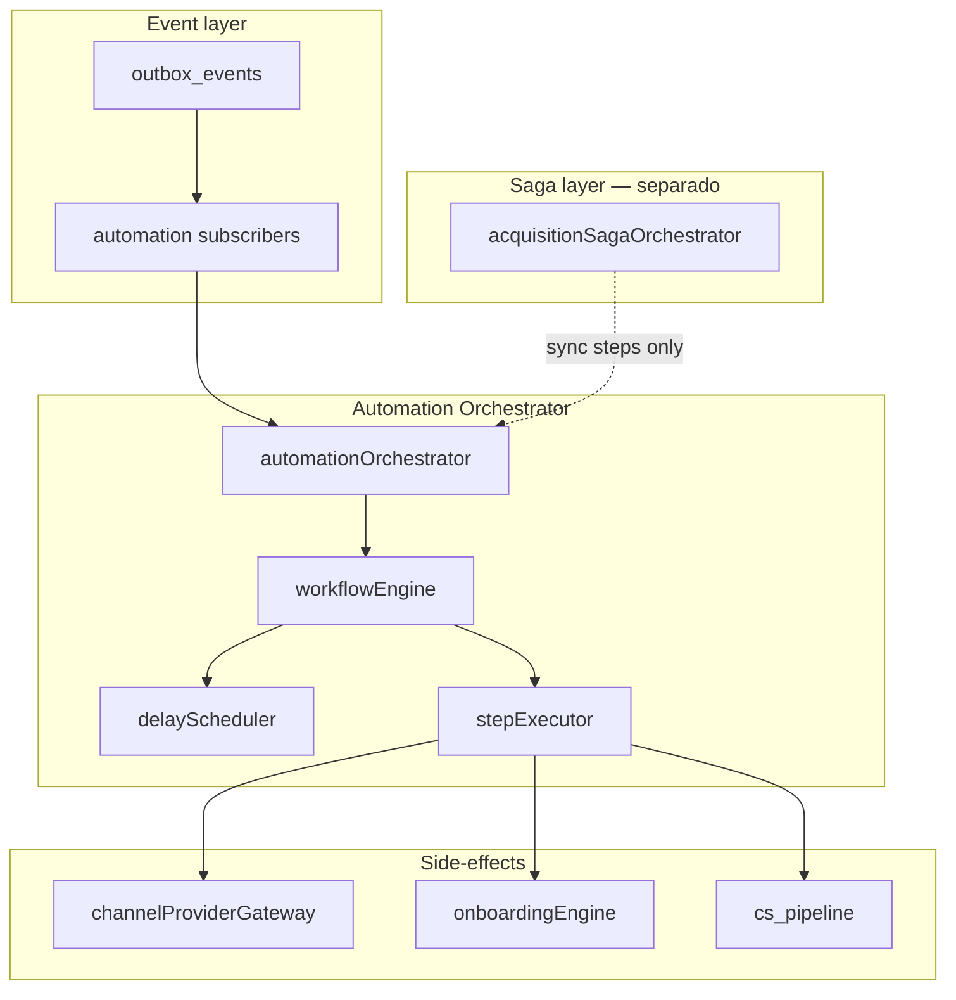
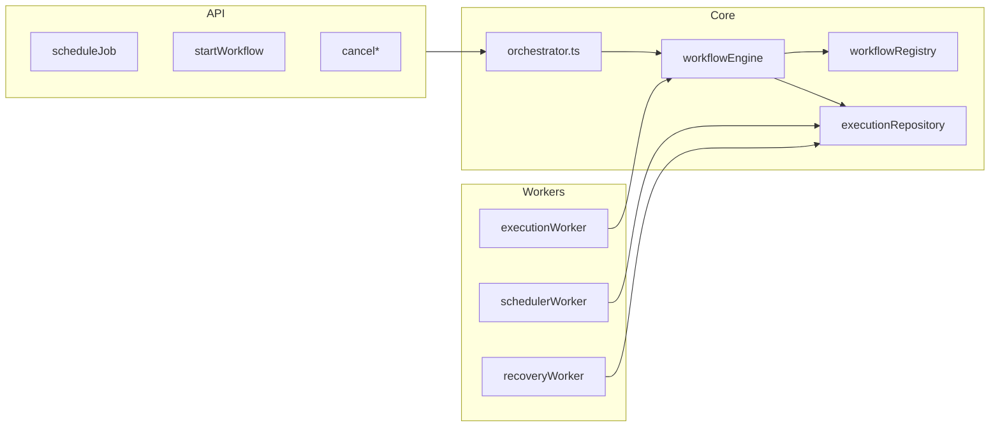
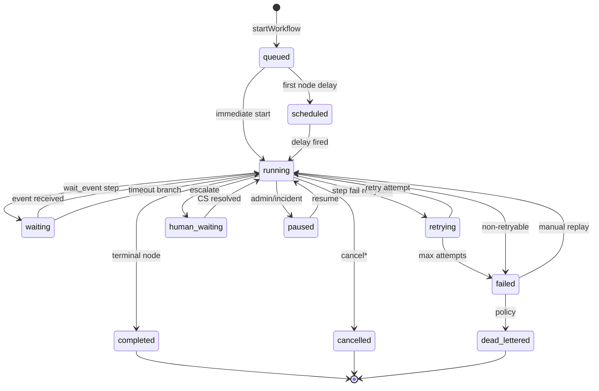
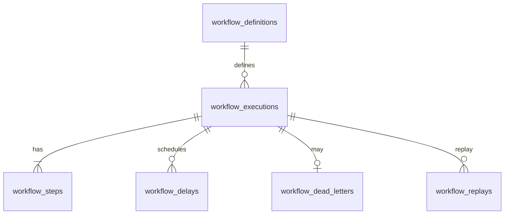

# Automation Orchestrator Architecture (PainelCRM)

**Tipo:** documentação arquitetural oficial — workflow engine, scheduling, retries, saga coordination, execução resiliente.  
**Versão:** 1.0  
**Data:** maio/2026  
**Status:** planejamento — **não implementar** código sem sign-off P0.

**Bounded context:** Automation (ver [`../ARCHITECTURE_SYSTEM_CONTEXT_MAP.md`](../ARCHITECTURE_SYSTEM_CONTEXT_MAP.md) §3.7).

**Documentos relacionados:**

| Documento | Relação |
|-----------|---------|
| [`../MASTER_PLAN_SIGNUP_TRIAL_ONBOARDING_CONVERSION.md`](../MASTER_PLAN_SIGNUP_TRIAL_ONBOARDING_CONVERSION.md) | §36 Orchestrator, §45 Saga (complementar) |
| [`DOMAIN_EVENT_AND_OUTBOX_ARCHITECTURE.md`](./DOMAIN_EVENT_AND_OUTBOX_ARCHITECTURE.md) | Outbox, subscribers, idempotência |
| [`../communication/COMMUNICATION_PLATFORM_ARCHITECTURE.md`](../communication/COMMUNICATION_PLATFORM_ARCHITECTURE.md) | Side-effects via gateway |
| [`../onboarding/ONBOARDING_ENGINE_ARCHITECTURE.md`](../onboarding/ONBOARDING_ENGINE_ARCHITECTURE.md) | Workflows onboarding/recovery |
| [`../../BILLING_RECOVERY_ENGINE.md`](../../BILLING_RECOVERY_ENGINE.md) | Recovery operacional billing (paralelo, não substituto) |

**Código alvo (futuro):**

```text
packages/backend/src/services/automation/
  automationOrchestrator/           # API pública — alias conceitual: workflowExecutionEngine
    orchestrator.ts               # schedule, cancel, startWorkflow
    workflowEngine.ts             # graph execution
    stepExecutor.ts
    delayScheduler.ts
    workflowRegistry.ts
    executionRepository.ts
    policies.ts                   # retry, backoff
    workers/
      executionWorker.ts
      schedulerWorker.ts
      recoveryWorker.ts
  acquisitionSagaOrchestrator.ts  # sagas transacionais (§9 — separado)
```

---

## Índice

1. [Visão geral](#1-visão-geral)
2. [Automation philosophy](#2-automation-philosophy)
3. [Automation orchestrator](#3-automation-orchestrator)
4. [Workflow engine](#4-workflow-engine)
5. [Workflow lifecycle](#5-workflow-lifecycle)
6. [Workflow step model](#6-workflow-step-model)
7. [Delay & scheduling engine](#7-delay--scheduling-engine)
8. [Retry & recovery strategy](#8-retry--recovery-strategy)
9. [Saga orchestration](#9-saga-orchestration)
10. [Event integration](#10-event-integration)
11. [Workflow ownership](#11-workflow-ownership)
12. [Human-in-the-loop](#12-human-in-the-loop)
13. [Automation analytics](#13-automation-analytics)
14. [Execution storage model](#14-execution-storage-model)
15. [Worker architecture](#15-worker-architecture)
16. [Observability](#16-observability)
17. [Security & safety](#17-security--safety)
18. [Failure & degraded mode](#18-failure--degraded-mode)
19. [Future evolution](#19-future-evolution)
20. [Anti-patterns proibidos](#20-anti-patterns-proibidos)
21. [Conclusão](#21-conclusão)

---

## 1. Visão geral

### 1.1 Por que automações não podem ficar espalhadas

**AS-IS (fragmentação):**

| Fonte | Problema |
|-------|----------|
| Cron scripts soltos | Sem cancelamento quando usuário converte |
| `setTimeout` / `setImmediate` | Perdidos em restart |
| Notification engine | Acoplada a provider |
| Billing workers | Fila própria sem visão unificada |
| Controllers com “enviar depois” | Sem audit, sem retry uniforme |

**Consequências:** duplicata de recovery, workflows invisíveis, impossível pausar em incidente, IA futura sem substrate.

### 1.2 Problemas específicos

| Problema | Sintoma | Solução orchestrator |
|----------|---------|----------------------|
| **Acoplamento** | Recovery chama UazAPI no controller | Step → Communication gateway |
| **Retries locais** | Cada módulo com política diferente | `policies.ts` central |
| **Delays improvisados** | `setTimeout(24h)` | `workflow_delays` + scheduler |
| **Workflows invisíveis** | Ninguém sabe o que está pendente | `workflow_executions` + dashboards |
| **Sem cancelamento** | Usuário pagou mas ainda recebe abandono | cancel on `checkout.completed` |

### 1.3 Arquitetura alvo



### 1.4 Orchestrator vs choreography

| Padrão | Uso no PainelCRM |
|--------|------------------|
| **Orchestration** | Workflows com grafo, delays, branches — **automationOrchestrator** |
| **Choreography** | Múltiplos subscribers reagem ao mesmo evento sem coordenador central — Analytics |
| **Saga (orchestrated)** | Transações multi-contexto com compensação — **acquisitionSagaOrchestrator** (§9) |

**Regra:** tarefa agendada no tempo → orchestrator; commit transacional multi-serviço → saga.

### 1.5 Eventual consistency

- Workflow **inicia** após evento outbox processado (fato commitado).
- Steps de comunicação são **async**; workflow entra em `waiting` até evento `communication.conversation.replied` ou timeout.

---

## 2. Automation philosophy

### 2.1 Princípios

| Princípio | Significado |
|-----------|-------------|
| **Event-driven workflows** | Gatilho = domain event, não polling de negócio |
| **Orchestrated automation** | Um motor executa o grafo |
| **Deterministic** | Mesmo input + versão workflow → mesmo plano de steps |
| **Resumable** | Persistência após cada step; crash-safe |
| **Replay-safe** | Idempotency em execution e steps |
| **Observable** | Logs, audit, métricas por workflow |
| **Human-assisted** | Estado `human_waiting` — não falha silenciosa |

### 2.2 Classes de automação

| Classe | `workflow_domain` | Exemplos |
|--------|-------------------|----------|
| **Operacional plataforma** | `platform` | orphan scan triggers |
| **Onboarding** | `onboarding` | reminders, stalled recovery |
| **Acquisition / recovery** | `acquisition` | checkout abandon, trial offer |
| **Billing** | `billing` | overdue notify, reconcile trigger |
| **Communication** | `communication` | fan-out WA+email (sub-workflow) |
| **Support** | `support` | ticket SLA reminders |
| **Provisioning** | `tenant` | retry provision steps (async) |
| **IA** (futuro) | `ai` | adaptive nudges |

### 2.3 O que o orchestrator NÃO faz

| Não faz | Quem faz |
|---------|----------|
| Publicar domain events de negócio | Producers + outbox |
| Enviar WhatsApp direto | Communication gateway |
| Calcular activation score | Onboarding engine |
| `activatePlanFromBilling` | Billing |
| Substituir saga sync transacional | acquisitionSagaOrchestrator |

---

## 3. Automation orchestrator

### 3.1 Nome canônico

| Nome | Uso |
|------|-----|
| **`automationOrchestrator`** | API pública, pacote, logs |
| `workflowExecutionEngine` | Alias interno do motor de grafo (`workflowEngine.ts`) |

### 3.2 Responsabilidades

| Responsabilidade | Componente |
|------------------|------------|
| Iniciar workflows | `startWorkflow(definitionId, context)` |
| Executar steps | `workflowEngine.tick(executionId)` |
| Controlar delays | `delayScheduler` |
| Controlar retries | `policies.applyRetry(step)` |
| Persistir estado | `executionRepository` |
| Escalar falhas | `escalateToHuman()` → CS |
| Emitir eventos | `automation.workflow.*` → outbox |
| Coordenar sagas | Invoca saga orchestrator; **não** funde motores |
| Compensações workflow | `compensationRunner` (§6) — distinto saga compensate |

### 3.3 API pública (conceitual)

| Método | Descrição |
|--------|-----------|
| `scheduleJob(input)` | Job único (legado §36 `automation_jobs`) — evolui para step `delay` |
| `startWorkflow(definitionId, ctx)` | Nova execução |
| `cancelJobs(filter)` | Por entity/session/tenant |
| `cancelExecution(executionId, reason)` | Cancela workflow |
| `pauseExecution(executionId)` | Incidente / degraded |
| `resumeExecution(executionId)` | Admin |
| `replayExecution(executionId, actor)` | Audit obrigatório |

### 3.4 Diagrama de componentes



---

## 4. Workflow engine

### 4.1 Workflow definitions

**Tabela:** `workflow_definitions` (§14)

| Campo | Descrição |
|-------|-----------|
| `id` | `wf.checkout_abandon_recovery` |
| `version` | semver |
| `domain` | §2.2 |
| `graph` | jsonb — nodes + edges |
| `default_timeout` | interval |
| `max_concurrent_per_entity` | 1 |

**Registry:** `workflowRegistry.get(id, version)` — suporta A/B via feature flag.

### 4.2 Execution graph

```json
{
  "nodes": [
    { "id": "wait_10m", "type": "delay", "params": { "duration": "10m" } },
    { "id": "send_recovery", "type": "action", "action": "communication.send", "params": { "template_key": "recovery.checkout.abandon_1" } },
    { "id": "wait_response", "type": "wait_event", "params": { "event": "communication.conversation.replied", "timeout": "48h" } },
    { "id": "branch", "type": "condition", "params": { "expr": "context.replied" } },
    { "id": "retry_send", "type": "action", "action": "communication.send", "params": { "template_key": "recovery.checkout.abandon_2" } },
    { "id": "escalate_cs", "type": "action", "action": "cs.create_task" }
  ],
  "edges": [
    { "from": "wait_10m", "to": "send_recovery" },
    { "from": "send_recovery", "to": "wait_response" },
    { "from": "wait_response", "to": "branch" },
    { "from": "branch", "to": "retry_send", "condition": "no_reply" },
    { "from": "branch", "to": "completed", "condition": "replied" },
    { "from": "retry_send", "to": "escalate_cs" }
  ]
}
```

### 4.3 Step engine

| `step.type` | Executor |
|-------------|----------|
| `delay` | Insere `workflow_delays` |
| `action` | Delega handler registrado |
| `wait_event` | `waiting` até evento ou timeout |
| `condition` | Avalia context; escolhe edge |
| `parallel` | Fan-out sub-steps (futuro) |
| `human_gate` | `human_waiting` |

### 4.4 Resumable execution

Após cada step:

1. UPDATE `workflow_steps` status.
2. UPDATE `workflow_executions.current_node_id`.
3. COMMIT.
4. Se próximo node não é delay → enqueue tick (worker).

Crash entre 2–4 → recovery worker reclaim `running` stale.

### 4.5 Tipos de workflow (catálogo inicial)

| `workflow_id` | Domínio | Gatilho |
|---------------|---------|---------|
| `wf.trial_onboarding` | onboarding | `trial.activated` |
| `wf.checkout_abandon_recovery` | acquisition | `checkout.abandoned` |
| `wf.onboarding_stalled_recovery` | onboarding | `onboarding.stalled` |
| `wf.billing_overdue_notify` | billing | `billing.invoice.overdue` |
| `wf.support_ticket_sla` | support | `support.ticket.created` |
| `wf.communication_failover` | communication | `communication.message.failed` |
| `wf.provisioning_retry` | tenant | `tenant.provisioning.failed` |
| `wf.ai_nudge` (futuro) | ai | `health.score.critical` |

---

## 5. Workflow lifecycle

### 5.1 Estados da execução (`workflow_executions.status`)

| Status | Significado | Mapeamento usuário |
|--------|-------------|-------------------|
| `queued` | Criado; aguarda worker | queued |
| `scheduled` | Primeiro step é delay futuro | scheduled |
| `running` | Executando step | running |
| `waiting` | Aguardando evento externo | waiting |
| `retrying` | Step falhou; backoff | retrying |
| `failed` | Esgotou retries; não dead ainda | failed |
| `cancelled` | Cancelado por evento negativo | cancelled |
| `completed` | Grafo terminou com sucesso | completed |
| `dead_lettered` | Irrecuperável | dead_lettered |
| `paused` | Pausa operacional | paused |
| `human_waiting` | Escalado CS | human_waiting |

### 5.2 Diagrama de estados



### 5.3 Timeout handling

| Timeout | Ação |
|---------|------|
| Step `timeout` | Marca step `timed_out`; segue edge default |
| Execution `max_duration` | Force `failed` + alert |
| `waiting` &gt; SLA | Escalate ou branch “no response” |

### 5.4 Stuck workflow detection

**Job:** `stuckWorkflowScanner` (cron 15 min)

| Condição | Ação |
|----------|------|
| `running` &gt; 30 min sem step update | reclaim → `queued` tick |
| `waiting` &gt; 2× wait timeout | alert + branch timeout |
| `scheduled` com delay passado &gt; 1h | force scheduler tick |

### 5.5 Replay & recovery

| Tipo | Uso |
|------|-----|
| **Replay step** | Admin re-run one step pós-fix |
| **Replay execution** | Novo `execution_id` com mesmo context (audit) |
| **Resume** | `paused` / `failed` → `running` |

---

## 6. Workflow step model

### 6.1 Step execution record

**Tabela:** `workflow_steps` (§14)

| Campo | Uso |
|-------|-----|
| `execution_id` | FK |
| `node_id` | graph node |
| `status` | pending, running, completed, failed, skipped, compensated |
| `attempts` | int |
| `started_at` / `finished_at` | |
| `input` / `output` | jsonb |
| `error` | text |

### 6.2 Step retries

| Política | Default |
|----------|---------|
| Max attempts | 5 (communication), 3 (CS task) |
| Backoff | 30s, 2m, 10m, 1h, 4h |
| Retryable errors | timeout, 5xx, rate limit |
| Non-retryable | policy violation, 4xx logic |

### 6.3 Step compensation

| Quando | Ação |
|--------|------|
| Workflow cancelado mid-flight | Run `compensation` handlers registrados para steps `completed` |
| Saga compensate | **Saga layer** — não duplicar aqui |

**Exemplo:** step `communication.send` compensação = publicar evento `*.cancelled` (não “unsend”).

### 6.4 Conditional branches & gates

| Construct | Avaliação |
|-----------|-----------|
| `condition` | CEL-like expr on `context` |
| `gate` | Aguarda `context.flag` (ex. payment confirmed) |

### 6.5 Exemplo completo: checkout.abandoned

Ver grafo §4.2 — implementação:

1. Subscriber `checkout.abandoned` → `startWorkflow('wf.checkout_abandon_recovery', { signup_session_id, correlation_id })`.
2. `wait_10m` → delay row.
3. `send_recovery` → action handler chama `channelProviderGateway.sendAutomationMessage`.
4. `wait_response` → aguarda `communication.conversation.replied` com match `correlation_id`.
5. `branch` → se não replied após 48h → `retry_send` → `escalate_cs`.

---

## 7. Delay & scheduling engine

### 7.1 `delayScheduler`

| Responsabilidade | Detalhe |
|------------------|---------|
| Persistir delays | `workflow_delays` |
| Poll due delays | `schedulerWorker` |
| Fire | TRANSITION execution `scheduled` → `running`; enqueue tick |

### 7.2 Modelos de agendamento

| Tipo | Mecanismo |
|------|-----------|
| **Relative delay** | `run_at = now() + interval` |
| **Absolute** | `run_at = specific timestamptz` |
| **Cron workflow** | `workflow_definitions.cron` → cria execuções periódicas |
| **Retry scheduling** | step `retrying` → novo delay row |
| **Replay scheduling** | admin → `run_at = now()` |

### 7.3 Relação `automation_jobs` (legado)

| Fase | Estratégia |
|------|------------|
| C0 | `automation_jobs` = implementation of simple delay |
| C2 | Jobs migrados para `workflow_executions` + graph node `delay` |
| Bridge | `scheduleJob` cria workflow single-node |

Campos legados (MASTER §36): `job_type`, `entity_type`, `entity_id`, `run_at`, `idempotency_key`.

### 7.4 Cron workflows

| Cron | Workflow |
|------|----------|
| `0 * * * *` | `wf.onboarding_inactivity_scan` (delega scanner) |
| `*/15 * * * *` | `wf.stuck_workflow_scan` |

Registrados no orchestrator — **não** `node-cron` espalhado.

---

## 8. Retry & recovery strategy

### 8.1 Exponential backoff (padrão)

| Attempt | Delay |
|---------|-------|
| 1 | 30s |
| 2 | 2m |
| 3 | 10m |
| 4 | 1h |
| 5 | 4h |

Configurável por `workflow_definitions` / step override.

### 8.2 Dead-letter workflows

- Execution `dead_lettered` + row `workflow_dead_letters`.
- Superadmin UI: replay, cancel, assign CS.

### 8.3 Stuck execution recovery

`recoveryWorker` + `stuckWorkflowScanner` (§5.4).

### 8.4 Compensation workflows

`workflow_compensations` — append-only log de ações compensatórias.

### 8.5 Auto-healing

| Sistema | Integração |
|---------|------------|
| **billingRecoveryService** | Diagnóstico financeiro; pode **disparar** `startWorkflow('wf.billing_reconcile')` — não merge filas |
| **Notification recovery** | Converge para Communication + workflow `communication_failover` |
| **Orchestrator self-heal** | Reclaim stale locks; requeue delays missed |

### 8.6 Retry storm protection

| Mecanismo | Limite |
|-----------|--------|
| Max retries global / tenant / hora | 100 |
| Circuit breaker communication | pause workflows `communication.*` |
| Degraded mode | §18 |

---

## 9. Saga orchestration

### 9.1 Separação saga vs workflow

| Aspecto | **Saga** (`acquisitionSagaOrchestrator`) | **Workflow** (`automationOrchestrator`) |
|---------|----------------------------------------|----------------------------------------|
| Objetivo | Consistência transacional multi-contexto | Tempo, retries, comunicação, CS |
| Duração | Segundos–minutos | Minutos–dias |
| Compensação | Rollback negócio | Cancel jobs / soft notify |
| Persistência | `saga_instances`, `saga_step_log` | `workflow_executions` |
| Side-effects | Via outbox após commit | Via step actions |

**Coordenação:** saga passo final pode `scheduleJob` ou `startWorkflow` — saga **não** executa delays longos inline.

### 9.2 Sagas obrigatórias

#### Signup / trial (`saga.trial_activation`)

| Step | Sync/async | Compensação |
|------|------------|-------------|
| resolveIdentity | sync | — |
| create tenant | sync | cancel tenant |
| create user | sync | suspend user |
| provisioning | sync | provisioning.rollback |
| onboarding init | sync | — |
| outbox trial.activated | sync | event compensated |
| schedule recovery workflow | **async** → orchestrator | cancel workflow |

#### Onboarding saga (leve)

Coordena `onboardingEngine.initialize` pós-provisioning — sub-saga chamada de `saga.trial_activation` / `saga.paid_conversion`.

#### Tenant provisioning saga

`tenantProvisioningService` steps — falha → compensate + `wf.provisioning_retry` workflow.

#### Billing recovery saga (operacional)

Não confundir com `billingRecoveryService` (SQL diagnose). Saga = orquestrar **ações** pós diagnóstico:

`detect overdue` → workflow notify → wait payment event.

#### Communication recovery saga (lógico)

Workflow `wf.communication_failover` — **não** saga PG; fila de automação.

### 9.3 Failure handling (saga)

| Falha | Ação |
|-------|------|
| Retryable | Retry step; saga `running` |
| Non-retryable | `compensating` → compensate map MASTER §45 |
| Partial | Impossível se 1 TX por step sync |

### 9.4 Eventos saga

| Evento | Emissor |
|--------|---------|
| `saga.step.completed` | saga orchestrator |
| `saga.failed` | saga orchestrator |
| `saga.compensated` | compensation runner |

Owner: **Acquisition** (ver DOMAIN_EVENT doc).

---

## 10. Event integration

### 10.1 Fluxo padrão

```text
domain command → outbox (business event)
  → automationSubscriber
  → automationOrchestrator.startWorkflow / scheduleJob
  → steps → outbox (automation.workflow.*, communication.*)
  → other subscribers
```

### 10.2 Mapa evento → workflow

| Domain event | Workflow / ação |
|--------------|-----------------|
| `signup.completed` | — (aguarda tenant) |
| `tenant.provisioning.completed` | `wf.trial_onboarding` ou init only |
| `trial.activated` | `wf.trial_onboarding` |
| `checkout.abandoned` | `wf.checkout_abandon_recovery` |
| `checkout.completed` | **cancel** `wf.checkout_abandon_recovery` |
| `onboarding.started` | opcional nudges |
| `onboarding.stalled` | `wf.onboarding_stalled_recovery` |
| `onboarding.completed` | cancel onboarding workflows |
| `billing.invoice.overdue` | `wf.billing_overdue_notify` |
| `billing.invoice.paid` | cancel billing recovery workflows |
| `support.ticket.created` | `wf.support_ticket_sla` |
| `communication.message.failed` | `wf.communication_failover` |
| `tenant.provisioning.failed` | `wf.provisioning_retry` + saga compensate |
| `first_value.achieved` | cancel aggressive recovery (opcional) |

### 10.3 Eventos emitidos pelo orchestrator

| Evento | Quando |
|--------|--------|
| `automation.workflow.started` | execution created |
| `automation.workflow.completed` | terminal success |
| `automation.workflow.failed` | failed |
| `automation.workflow.cancelled` | cancel |
| `automation.workflow.dead_lettered` | dead |
| `automation.workflow.human_waiting` | HITL |

### 10.4 Wait event integration

Step `wait_event` registra **subscription**:

| Campo | Valor |
|-------|-------|
| `event_name` | `communication.conversation.replied` |
| `match` | `correlation_id` or `signup_session_id` in payload |

Subscriber genérico `workflowEventMatcher` → resume execution.

---

## 11. Workflow ownership

### 11.1 Três dimensões

| Dimensão | Owner |
|----------|-------|
| **Workflow definition** | Squad do `workflow_domain` (Growth, Billing, Platform) |
| **Domain event trigger** | Bounded context emissor (ver DOMAIN_EVENT §8) |
| **Execution runtime** | Platform / Automation squad |
| **Escalation** | CS Operations |

### 11.2 Tabela workflow → owner

| workflow_id | Definition owner | Trigger owner |
|-------------|------------------|---------------|
| `wf.checkout_abandon_recovery` | Growth | Acquisition |
| `wf.trial_onboarding` | Growth | Acquisition |
| `wf.onboarding_stalled_recovery` | Product Growth | Onboarding |
| `wf.billing_overdue_notify` | Billing | Billing |
| `wf.support_ticket_sla` | Support | Support |
| `wf.provisioning_retry` | Platform | Tenant Core |
| `wf.communication_failover` | Platform Messaging | Communication |

### 11.3 Registro de novos workflows

1. PR adiciona definição em `workflowRegistry` + doc §4.5.  
2. Subscriber explícito — **proibido** “magic” start sem evento.  
3. Feature flag `automation.workflow.{id}` para rollout.

---

## 12. Human-in-the-loop

### 12.1 Triggers

| Condição | Workflow action |
|----------|-----------------|
| Onboarding travado ≥ 72h | `human_waiting` + CS task |
| Recovery 3+ falhas communication | escalate |
| Workflow `running` stale reclaim failed | P1 eng |
| Billing P0 overdue | AM + CS |
| Provisioning failed pós-saga | eng on-call |
| Step `human_gate` explícito | aguarda aprovação CS |

### 12.2 Escalation queues

| Fila | Entidade |
|------|----------|
| `cs_onboarding_stalled` | tenant |
| `cs_recovery_failed` | signup_session |
| `eng_workflow_dead` | execution_id |

Criadas via action handler `cs.create_task` — integra §33 MASTER.

### 12.3 SLA

| Prioridade | SLA resposta |
|------------|--------------|
| P0 billing/provisioning | 4h úteis |
| P1 trial recovery | 8h |
| P2 onboarding stall | 24h |

### 12.4 Intervention workflows

`wf.manual_intervention` — CS completa step via API:

`POST /superadmin/workflows/executions/:id/resolve-human` → `human_waiting` → `running`.

---

## 13. Automation analytics

### 13.1 `automationAnalyticsService`

**Localização:** `packages/backend/src/services/automation/automationAnalyticsService.ts`

### 13.2 Métricas

| Métrica | Uso |
|---------|-----|
| **Workflow success rate** | completed / started |
| **Retry rate** | steps com attempts &gt; 1 |
| **Recovery conversion** | acquisition workflows → paid/trial |
| **Activation impact** | onboarding workflows → score delta |
| **Execution latency** | p50/p95 duration |
| **Stuck workflows** | count running &gt; threshold |
| **Dead-letter frequency** | por workflow_id |
| **Automation ROI** (futuro) | revenue attributed |

### 13.3 Storage

| Tabela | Granularidade |
|--------|---------------|
| `automation_metrics_daily` | workflow_id, domain, date |
| `workflow_execution_stats` | rollup horário |

Ingestão: subscriber em `automation.workflow.*` + poll `workflow_executions`.

---

## 14. Execution storage model

### 14.1 Entidades

#### `workflow_definitions`

Definição versionada do grafo (§4.1).

#### `workflow_executions`

| Coluna | Tipo |
|--------|------|
| `id` | uuid |
| `definition_id` | text |
| `definition_version` | text |
| `status` | §5.1 |
| `entity_type` / `entity_id` | signup_session, tenant, … |
| `tenant_id` | nullable |
| `correlation_id` | uuid |
| `context` | jsonb |
| `current_node_id` | text |
| `idempotency_key` | UNIQUE |
| `started_at` / `finished_at` | timestamptz |

#### `workflow_steps`

§6.1 — histórico por node.

#### `workflow_delays`

| Coluna | Tipo |
|--------|------|
| `execution_id` | uuid |
| `node_id` | text |
| `run_at` | timestamptz |
| `fired_at` | nullable |

#### `workflow_dead_letters`

`execution_id`, `reason`, `dead_at`, `replay_allowed`.

#### `workflow_replays`

`original_execution_id`, `new_execution_id`, `actor`, `at`.

#### `workflow_compensations`

`execution_id`, `step_id`, `action`, `at`.

#### `workflow_audit`

Append-only: state transitions, actor, diff.

#### `automation_jobs` (legado)

Mantido até migração completa — bridge §7.3.

### 14.2 ER diagram



---

## 15. Worker architecture

### 15.1 Tipos de worker

| Worker | Função | Poll |
|--------|--------|------|
| **executionWorker** | `tick` running executions | queue / SKIP LOCKED |
| **schedulerWorker** | Fire due delays | `workflow_delays` |
| **recoveryWorker** | Stuck reclaim, dead-letter scan | cron |
| **replayWorker** | Admin replay queue | optional |

### 15.2 Concurrency & partitioning

| Parâmetro | Valor |
|-----------|-------|
| executionWorker instances | N |
| Lock | `workflow_executions.locked_by`, `locked_at` |
| Stale reclaim | 10 min |
| Partition key (futuro) | `hash(tenant_id) % P` |

### 15.3 Heartbeat

`automation_worker_heartbeats` — alert se stale &gt; 2× interval.

### 15.4 Queue prioritization

| Prioridade | workflow_domain |
|------------|-----------------|
| P0 | billing, provisioning |
| P1 | acquisition recovery |
| P2 | onboarding |
| P3 | analytics cron |

Integra MASTER §51 backpressure.

---

## 16. Observability

### 16.1 Log prefixes

| Prefixo | Conteúdo |
|---------|----------|
| `[WORKFLOW]` | start, complete, cancel |
| `[ORCHESTRATOR]` | schedule, policy |
| `[STEP]` | step start/end |
| `[RETRY]` | backoff |
| `[SAGA]` | saga events (cross-ref) |
| `[COMPENSATION]` | compensate |
| `[DEAD_LETTER]` | dead |

### 16.2 Correlation & tracing

- `correlation_id` em execution context obrigatório para fluxos aquisição.
- Trace: `workflow.execute` → `step.{node_id}` → `communication.send`.

### 16.3 Timeline

UI superadmin: `workflow_steps` + `workflow_audit` + related `outbox_events` — visão única do funil operacional.

### 16.4 Dashboards

| Painel | Métricas |
|--------|----------|
| Orchestrator health | workers, queue depth, stuck count |
| Workflow performance | success rate, latency |
| Dead-letter inbox | replay actions |

---

## 17. Security & safety

### 17.1 Tenant isolation

- `tenant_id` em executions tenant-scoped.
- Platform workflows (`tenant_id null`) — allowlist definições.
- Handlers validam entity pertence ao tenant.

### 17.2 Replay authorization

| Ação | Permissão |
|------|-----------|
| Replay execution | `platform.saga.replay` ou `platform.automation.replay` |
| Pause/resume | superadmin automation |

### 17.3 Execution limits

| Limite | Valor |
|--------|-------|
| Max concurrent workflows / tenant | 10 |
| Max steps / execution | 100 |
| Max duration | 30 dias (recovery long) |

### 17.4 Runaway protection

- Detectar loop no grafo (compile-time validation).
- Max step count per tick = 20.
- Circuit breaker pause domain.

---

## 18. Failure & degraded mode

### 18.1 Degraded orchestration

| Modo | Comportamento |
|------|---------------|
| **Normal** | Full execution |
| **Degraded** | Pause P2/P3; só P0/P1 |
| **Paused global** | `ACQUISITION_MASTER_OFF` — stop new starts |
| **Read-only** | Complete running; no new |

### 18.2 Queue overload

| Sinal | Ação |
|-------|------|
| Delay backlog &gt; 50k | Scale scheduler workers |
| Execution queue &gt; 10k | Throttle new starts |

### 18.3 Worker unavailable

- Executions remain `scheduled` / `queued` — durable.
- Alert heartbeat missing.

### 18.4 Retry storm

Global rate limiter per tenant (§8.6).

---

## 19. Future evolution

| Capacidade | Preparação |
|------------|------------|
| **Visual workflow builder** | Export/import `workflow_definitions.graph` |
| **AI workflow generation** | Sugestão grafo — human approve |
| **AI orchestration** | Step type `ai.decide` → branch |
| **Adaptive workflows** | Context features → dynamic edges |
| **Multi-region workers** | Executions region tag; delays UTC |
| **Distributed execution** | Partition workers; PG still source of truth |
| **Workflow marketplace** | Tenant-scoped defs (CRM automations) |
| **Customer automation builder** | Sandbox + strict policy engine |

---

## 20. Anti-patterns proibidos

| # | Anti-pattern | Correção |
|---|--------------|----------|
| 1 | Automação fora orchestrator | `scheduleJob` / `startWorkflow` |
| 2 | `setTimeout` para delay 24h | `workflow_delays` |
| 3 | Retries locais em controller | `policies.ts` |
| 4 | Workflow sem persistência | `workflow_executions` |
| 5 | Compensação manual sem audit | `workflow_compensations` + audit |
| 6 | Worker sem heartbeat | `automation_worker_heartbeats` |
| 7 | Lógica de negócio no scheduler | scheduler só dispara tick |
| 8 | Saga com delay 48h inline | saga → orchestrator workflow |
| 9 | Step chama provider direto | action → Communication gateway |
| 10 | Múltiplos starts mesmo evento | idempotency_key on execution |

---

## 21. Conclusão

O **Automation Orchestrator** é o **cérebro operacional** das automações do PainelCRM:

| Papel | Benefício |
|-------|-----------|
| **Coordenador** | Um lugar para delays, retries, cancelamentos |
| **Fundação onboarding** | Workflows §8 onboarding engine |
| **Fundação recovery** | Checkout/trial/onboarding abandon |
| **Resiliência** | Resumable, dead-letter, replay, degraded |
| **IA futura** | Grafo + context + event waits |

Trabalha **em parceria** com:

- **Outbox** — gatilhos e fatos ([DOMAIN_EVENT doc](./DOMAIN_EVENT_AND_OUTBOX_ARCHITECTURE.md)).
- **Communication Platform** — side-effects ([COMMUNICATION doc](../communication/COMMUNICATION_PLATFORM_ARCHITECTURE.md)).
- **Saga orchestrator** — transações curtas com compensação (Acquisition).

**P0 implementação:**

1. `workflow_executions` + `workflow_delays` + `executionWorker`.  
2. Bridge `automation_jobs` → single-node workflow.  
3. Subscriber `checkout.abandoned` → `wf.checkout_abandon_recovery`.  
4. Cancel on `checkout.completed`.  
5. Métricas + `[WORKFLOW]` logs.

**Próximo documento sugerido:** `acquisition/ARCHITECTURE_ACQUISITION.md` ou `observability/ARCHITECTURE_OBSERVABILITY.md`.

---

*Documento oficial v1.0 — Automation Orchestrator — PainelCRM — maio/2026. Não implementar código sem sign-off P0.*
