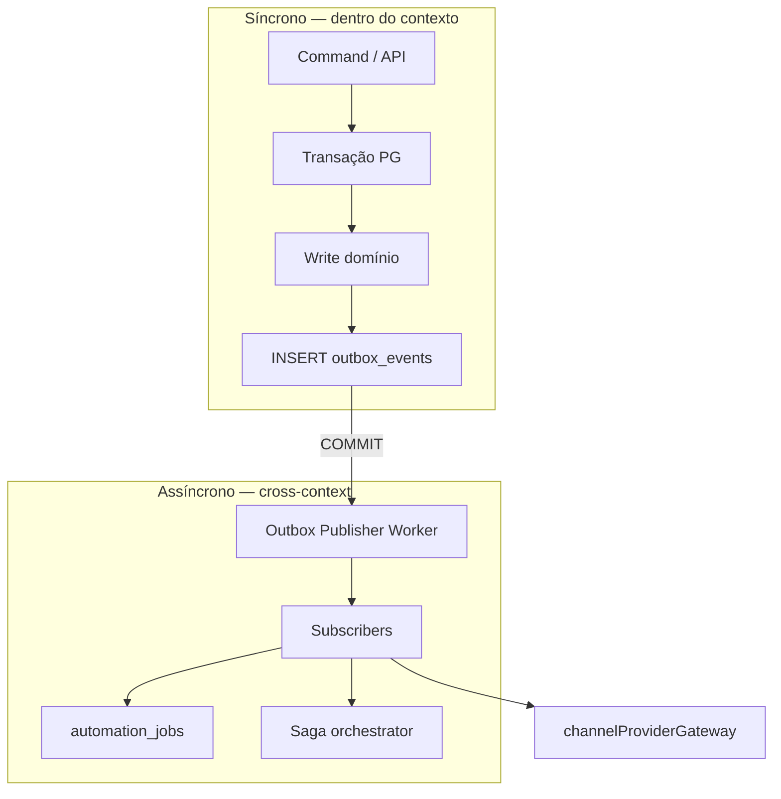
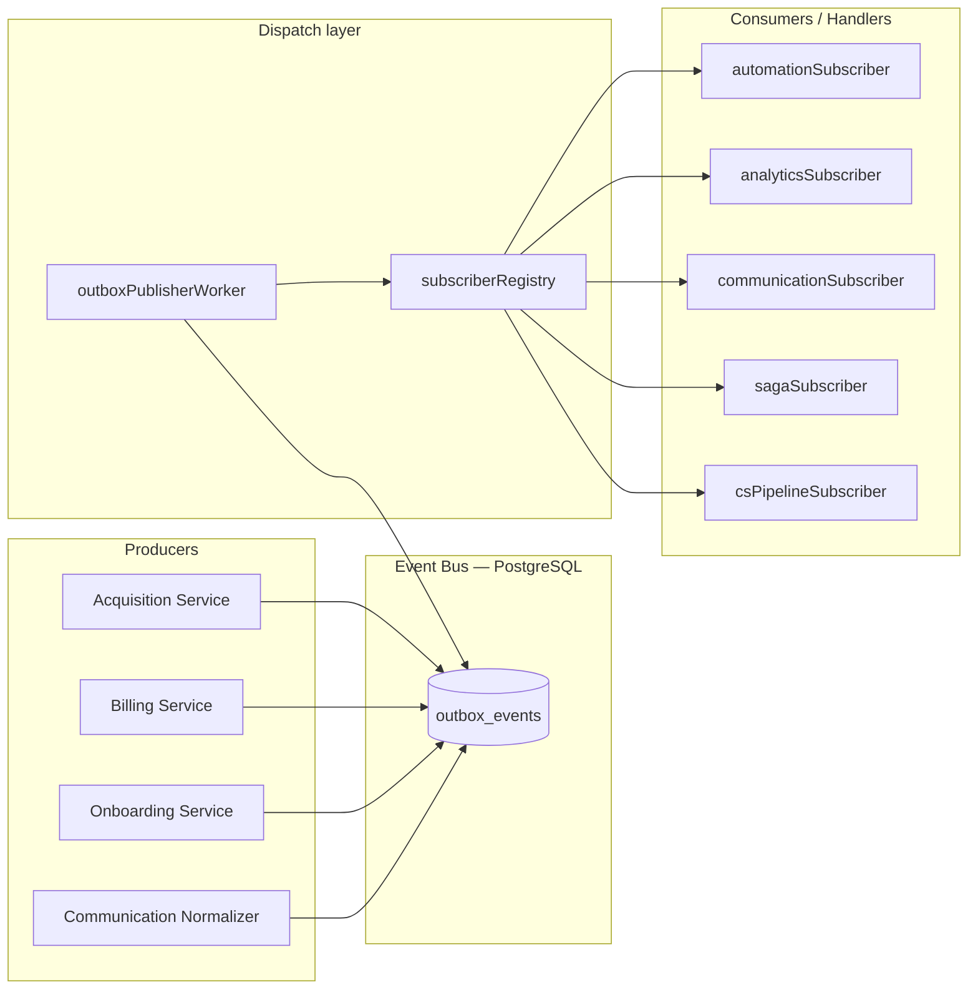
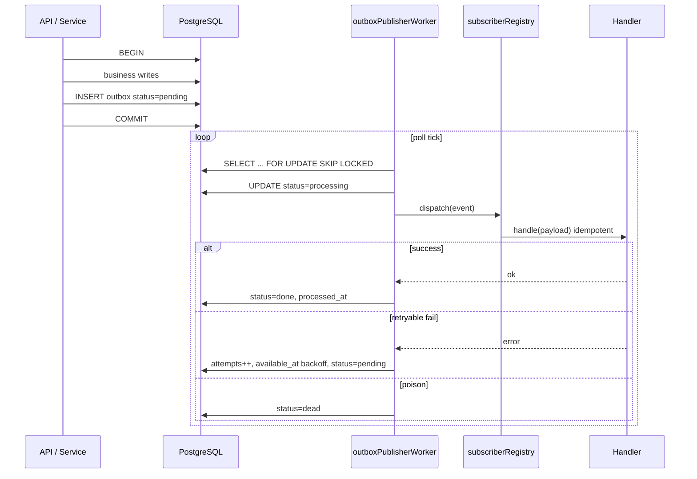
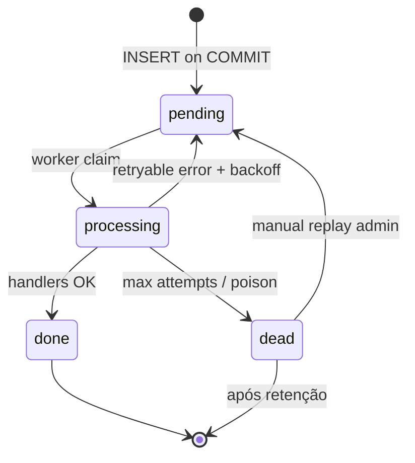
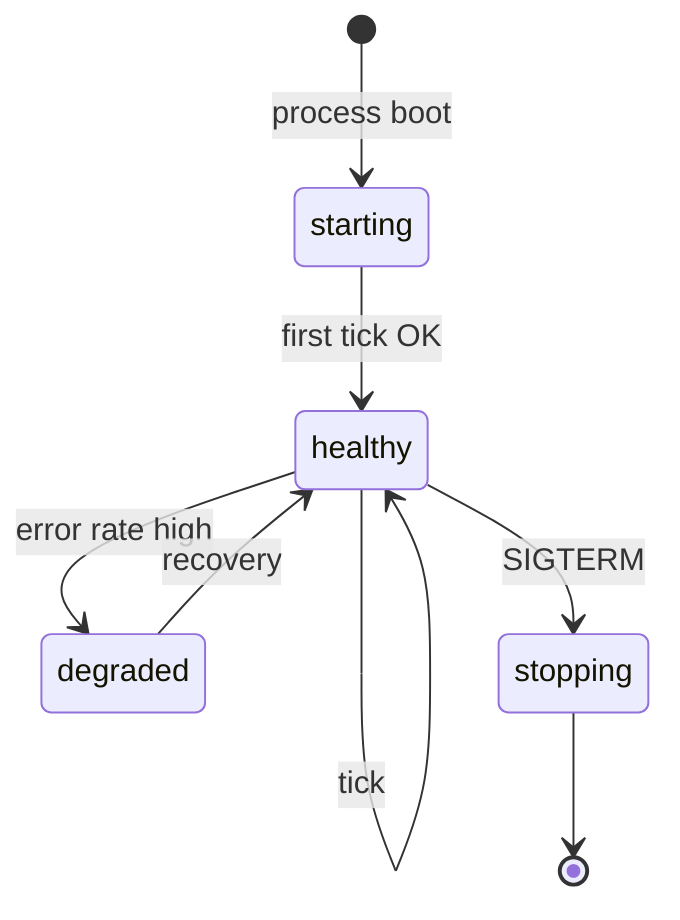
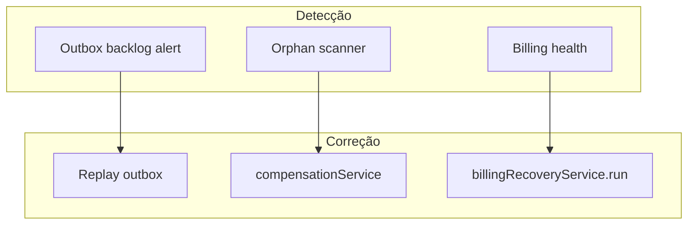
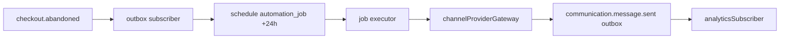

# Domain Event & Outbox Architecture (PainelCRM)

**Tipo:** documentação arquitetural oficial — barramento interno, outbox transacional, orquestração e workers.  
**Versão:** 1.0  
**Data:** maio/2026  
**Status:** planejamento — **não implementar** código sem sign-off P0.

**Documentos relacionados:**

| Documento | Relação |
|-----------|---------|
| [`../ARCHITECTURE_SYSTEM_CONTEXT_MAP.md`](../ARCHITECTURE_SYSTEM_CONTEXT_MAP.md) | Bounded contexts, matriz de dependências, catálogo resumido §5 |
| [`../MASTER_PLAN_SIGNUP_TRIAL_ONBOARDING_CONVERSION.md`](../MASTER_PLAN_SIGNUP_TRIAL_ONBOARDING_CONVERSION.md) | Outbox §44, Saga §45, Automation §36, Communication events §68 |
| [`../../BILLING_RECOVERY_ENGINE.md`](../../BILLING_RECOVERY_ENGINE.md) | Recovery operacional billing (AS-IS) — integra §12 |
| [`../../BILLING_NOTIFICATION_HARDENING.md`](../../BILLING_NOTIFICATION_HARDENING.md) | Notify billing → Communication |

**Localização de código alvo (futuro):**

```text
packages/backend/src/domainEvents/
  types.ts
  publisher.ts              # publishDomainEvent() → INSERT outbox
  outboxRepository.ts
  outboxPublisherWorker.ts
  subscriberRegistry.ts
  subscribers/
packages/backend/src/services/automation/     # automation_jobs, workflows
packages/backend/src/services/acquisition/   # sagas
```

---

## Índice

1. [Visão geral](#1-visão-geral)
2. [Domain event philosophy](#2-domain-event-philosophy)
3. [Event bus architecture](#3-event-bus-architecture)
4. [Transactional outbox pattern](#4-transactional-outbox-pattern)
5. [Event lifecycle](#5-event-lifecycle)
6. [Idempotency strategy](#6-idempotency-strategy)
7. [Orchestration model](#7-orchestration-model)
8. [Event ownership](#8-event-ownership)
9. [Event catalog](#9-event-catalog)
10. [Event versioning](#10-event-versioning)
11. [Worker architecture](#11-worker-architecture)
12. [Failure & recovery model](#12-failure--recovery-model)
13. [Observability](#13-observability)
14. [Performance & scalability](#14-performance--scalability)
15. [Relação com Communication Platform](#15-relação-com-com-communication-platform)
16. [Relação com Automation Engine](#16-relação-com-automation-engine)
17. [Anti-patterns proibidos](#17-anti-patterns-proibidos)
18. [Future evolution](#18-future-evolution)
19. [Conclusão](#19-conclusão)

---

## 1. Visão geral

### 1.1 Por que event-driven internamente

O PainelCRM é um **modular monolith** com múltiplos bounded contexts (Acquisition, Billing, Communication, Onboarding, etc.). A integração por **chamadas síncronas diretas** entre serviços internos gera:

- Acoplamento oculto (import de implementação alheia).
- Transações “esticadas” entre domínios.
- Side-effects (WhatsApp, e-mail) executados antes do COMMIT.
- Dificuldade de escalar workers e adicionar consumidores (analytics, IA).

**Event-driven internally** significa: o **fato de negócio** é persistido de forma atômica com o estado; a **reação** aos fatos é assíncrona, idempotente e observável.

### 1.2 Benefícios do transactional outbox

| Benefício | Descrição |
|-----------|-----------|
| **Atomicidade** | Estado + evento na mesma transação PostgreSQL |
| **Durabilidade** | Evento não se perde se o processo cair após COMMIT |
| **Desacoplamento** | Producers não conhecem consumers |
| **Retry uniforme** | Política central no publisher |
| **Auditoria** | Fila inspecionável (`outbox_events`) |
| **Evolução** | Novos subscribers sem alterar producer |

### 1.3 Problemas que queremos evitar

| Problema | Sintoma | Mitigação |
|----------|---------|-----------|
| **Eventos perdidos** | Commit OK, publish falhou | Outbox na mesma TX |
| **Notify duplicado** | Retry sem idempotência | `idempotency_key` + subscriber idempotent |
| **Automações inconsistentes** | Dois jobs para mesmo abandono | Automation orchestrator + keys |
| **Race conditions** | Dois workers criam tenant | Advisory lock + UNIQUE keys |
| **Acoplamento síncrono** | Controller chama WA + billing + onboarding | Outbox → subscribers |
| **Poison message** | Subscriber falha sempre | Dead-letter + replay controlado |

### 1.4 Modelo alvo (resumo)



- **Eventual consistency controlada:** atraso aceitável em analytics, kanban, health score; inaceitável em dinheiro sem reconciliação.
- **Orchestration interna:** sagas para fluxos multi-passo com compensação; jobs para tempo e retries.

---

## 2. Domain event philosophy

### 2.1 Tipos de evento

| Tipo | Definição | Exemplo | Transporte |
|------|-----------|---------|------------|
| **Domain event** | Algo relevante aconteceu no domínio; linguagem ubíqua | `checkout.abandoned` | `outbox_events` |
| **Integration event** | Domain event com contrato estável para outro contexto | `billing.invoice.paid` → Acquisition fecha sessão | Outbox + ACL no subscriber |
| **Internal event** | Sinal técnico dentro do mesmo módulo | `outbox.dispatch.started` | Logs / métricas apenas |
| **Orchestration event** | Passo de saga ou workflow | `saga.step.completed`, `workflow.failed` | `saga_step_log` + outbox opcional |
| **Notification event** | Intenção de comunicar (não substitui envio) | Subscriber reage a `checkout.abandoned` agendando comm | Outbox → Automation → Gateway |

### 2.2 Evento de negócio vs evento técnico

| Critério | Negócio | Técnico |
|----------|---------|---------|
| Nome | Verbo no domínio (`trial.activated`) | Infra (`worker.tick`, `outbox.poll`) |
| Payload | Dados de negócio + `schema_version` | Métricas, timings |
| Persistência | `outbox_events` | Logs / Prometheus |
| Ownership | Bounded context dono | Platform / SRE |
| Replay | Sim, com governança | Não |

**Regra:** se um PM/CS entende o nome, é **negócio**. Se só eng entende, é **técnico**.

### 2.3 Princípios de nomenclatura

| Regra | Formato |
|-------|---------|
| Namespace | `{context}.{entity?}.{verb}` |
| Tempo verbal | Passado para fatos (`completed`, `paid`, `failed`) |
| Presente | Apenas comandos internos não publicados (`Processing` em status DB) |
| Comunicação | Prefixo `communication.` (MASTER §68) |
| Billing plataforma | Prefixo `billing.` (não confundir com faturas CRM tenant) |

### 2.4 Fatos vs comandos

| Publicar no outbox | Não publicar |
|--------------------|--------------|
| “Checkout foi abandonado” | “Enviar WhatsApp agora” |
| “Fatura foi paga” | “Criar job recovery” (subscriber cria job) |
| “Onboarding completou passo X” | “Chamar Meta API” |

Comandos de side-effect ficam em **subscribers** ou **automation_jobs**, nunca como substituto do fato.

---

## 3. Event bus architecture

### 3.1 Visão do barramento

O “event bus” do PainelCRM **não** é Kafka na fase inicial. É:

1. **Escrita transacional** em `outbox_events`.
2. **Dispatcher** (publisher worker) que entrega a **handlers** registrados.
3. **Opcional:** fan-out futuro para stream externo (read-only).



### 3.2 Papéis

| Papel | Responsabilidade | Artefato alvo |
|-------|------------------|---------------|
| **Producer** | INSERT outbox na TX do comando | `publishDomainEvent()` |
| **Outbox repository** | CRUD + claim + status | `outboxRepository.ts` |
| **Dispatcher** | Poll, lock, invoke handlers | `outboxPublisherWorker.ts` |
| **Handler / Subscriber** | Reação idempotente a um `event_name` | `subscribers/*.ts` |
| **Registry** | Mapa `event_name` → handlers[] | `subscriberRegistry.ts` |
| **Worker (genérico)** | Loop de poll ou cron | Processo Node dedicado ou mesmo app |

### 3.3 Fluxo completo (emissão → processamento)



### 3.4 Retries no barramento

Retries ocorrem no **nível outbox** (dispatcher) e podem ter **retry secundário** no handler (ex. HTTP ao provider — Communication). Política outbox é a **fonte da verdade** para entrega do evento ao subscriber.

### 3.5 Replay

Replay **não** reexecuta a transação de negócio original. Reentrega o **mesmo fato** (ou cópia com nova `idempotency_key`) aos handlers, que devem ser idempotentes.

---

## 4. Transactional outbox pattern

### 4.1 Tabela canônica: `outbox_events`

Unifica `domain_event_outbox` (legado em docs). **Um** nome em implementação.

| Coluna | Tipo | Obrigatório | Descrição |
|--------|------|-------------|-----------|
| `id` | uuid | PK | |
| `event_name` | text | sim | ex. `billing.invoice.paid` |
| `event_version` | int | sim | default `1` — §10 |
| `aggregate_type` | text | sim | `signup_session`, `tenant`, `invoice`, … |
| `aggregate_id` | uuid/text | sim | ID da entidade raiz |
| `payload` | jsonb | sim | Dados + `schema_version`; sem secrets |
| `idempotency_key` | text | UNIQUE | Ver §6 |
| `correlation_id` | uuid | recomendado | Fluxo ponta a ponta (MASTER §54) |
| `causation_id` | uuid | opcional | `outbox_events.id` que causou este evento |
| `priority` | smallint | sim | P0–P3 (MASTER §51) |
| `status` | enum | sim | Ver §5 |
| `available_at` | timestamptz | sim | Delay / backoff |
| `attempts` | int | sim | default 0 |
| `max_attempts` | int | sim | default 8 |
| `last_error` | text | nullable | truncado 2kb |
| `locked_by` | text | nullable | worker instance id |
| `locked_at` | timestamptz | nullable | stale reclaim |
| `created_at` | timestamptz | sim | Momento do COMMIT origem |
| `processed_at` | timestamptz | nullable | |

**Índices:**

- `(status, available_at, priority) WHERE status IN ('pending','processing')`
- `(correlation_id)`
- `(aggregate_type, aggregate_id, created_at DESC)`
- UNIQUE `(idempotency_key)`

### 4.2 Persistência transacional

```text
publishDomainEvent(ctx, event):
  assert ctx.db.inTransaction()
  INSERT outbox_events (... status=pending, available_at=now())
  // NÃO chamar subscribers aqui
```

**Proibido:** `setImmediate(() => notify())` após COMMIT sem outbox.

### 4.3 Polling workers (dispatch seguro)

| Parâmetro | Valor inicial |
|-----------|---------------|
| Batch size | 50–200 |
| Poll interval | 1–5 s |
| Lock | `FOR UPDATE SKIP LOCKED` |
| Stale reclaim | `processing` &gt; 5 min sem heartbeat → `pending` |

### 4.4 Replay seguro

| Campo replay | Valor |
|--------------|-------|
| `idempotency_key` original | bloqueia duplicata |
| Replay manual | `{original_key}:replay:{uuid}` |
| `causation_id` | aponta evento que disparou replay admin |

Subscriber **deve** checar tabelas de idempotência de negócio antes de efeitos irreversíveis.

### 4.5 Retention (alinhado MASTER §49)

| Status | Retenção hot | Arquivo |
|--------|--------------|---------|
| `done` | 90 dias | `outbox_events_archive` |
| `dead` | 1 ano | arquivo + audit |
| `pending` &gt; 7 dias | alerta + auto-requeue | — |

---

## 5. Event lifecycle

### 5.1 Estados canônicos (DB)

| Status DB | Significado lifecycle | Visível como |
|-----------|----------------------|--------------|
| `pending` | Criado, aguardando dispatch | **queued** |
| `processing` | Worker claim ativo | **processing** |
| `pending` + `attempts` &gt; 0 + `available_at` futuro | Backoff | **retrying** |
| `done` | Handlers concluíram | **processed** |
| `dead` | Esgotou tentativas | **dead_lettered** |

**created:** instante do INSERT (implícito em `created_at` antes do primeiro poll).

**replayed:** evento novo ou requeue manual; marcar `payload.replay_of = uuid` ou key sufixo `:replay:`.

### 5.2 Diagrama de estados



### 5.3 Backoff strategy

| Tentativa `attempts` | `available_at` offset |
|----------------------|------------------------|
| 1 | +30s |
| 2 | +2m |
| 3 | +10m |
| 4 | +1h |
| 5 | +4h |
| 6–8 | +4h (ou política por `priority`) |
| &gt; `max_attempts` | `dead` |

**P0** (billing): backoff mais agressivo no reclaim, alerta em 3 falhas.

### 5.4 Poison events

Evento **poison** quando:

- Payload inválido (schema mismatch irreparável).
- Bug determinístico no handler (sempre 500).
- Referência a aggregate inexistente (dados corrompidos).

**Tratamento:** `dead` + ticket eng; replay só após fix + novo `event_version`.

### 5.5 Stuck events

| Condição | Ação |
|----------|------|
| `processing` &gt; 5 min | stale reclaim → `pending` |
| `pending` &gt; 7 dias | alerta `[OUTBOX]` + runbook |
| Handler deadlock | timeout por handler (30s default) |

---

## 6. Idempotency strategy

### 6.1 Camadas de idempotência

| Camada | Mecanismo | Escopo |
|--------|-----------|--------|
| **Outbox insert** | UNIQUE `idempotency_key` | Evita duplicar **fato** |
| **Command** | `acquisition_idempotency_keys` | Evita duplicar **efeito** (tenant, onboarding init) |
| **Subscriber** | `subscriber_processed_events` (proposta) | `(subscriber_id, idempotency_key)` |
| **External** | Provider message id | Communication |

### 6.2 Formato `idempotency_key` (outbox)

```text
{aggregate_type}:{aggregate_id}:{event_name}:{transition_id}
```

| Exemplo evento | `idempotency_key` |
|----------------|-------------------|
| `billing.invoice.paid` | `invoice:{uuid}:billing.invoice.paid:webhook_{payment_id}` |
| `trial.activated` | `signup_session:{uuid}:trial.activated:token_{token_id}` |
| `onboarding.completed` | `tenant:{uuid}:onboarding.completed:v1` |
| `communication.message.sent` | `comm_msg:{uuid}:communication.message.sent:1` |

### 6.3 Exactly-once semantics (simulada)

PostgreSQL + at-least-once delivery → **exactly-once effect** apenas se:

1. Outbox key UNIQUE no fato.
2. Handler idempotente no efeito.
3. Efeitos irreversíveis protegidos por `acquisition_idempotency_keys` ou estado (ex. tenant já existe).

### 6.4 Replay safety

| Cenário | Seguro? | Condição |
|---------|---------|----------|
| Reprocessar `checkout.abandoned` | Sim | Recovery job key UNIQUE |
| Reprocessar `trial.activated` | Condicional | Activation key existe → no-op |
| Reprocessar `billing.invoice.paid` | Condicional | Billing já aplicou → no-op |
| Reprocessar `onboarding.completed` | Sim | Estado terminal onboarding |

### 6.5 Safe retry (checklist handler)

- [ ] Ler estado atual do aggregate antes de mutar.
- [ ] Usar INSERT … ON CONFLICT ou advisory lock.
- [ ] Não chamar gateway se mensagem já `sent` para mesma key.
- [ ] Registrar em `subscriber_processed_events`.

---

## 7. Orchestration model

### 7.1 Orchestration vs choreography

| Padrão | Quando usar | PainelCRM |
|--------|-------------|-----------|
| **Choreography** | Reações simples em cadeia; poucos passos | Analytics, métricas |
| **Orchestration (saga)** | Multi-contexto, compensação, estado | Trial activation, paid conversion, provisioning |
| **Workflow (jobs)** | Tempo, delays, fan-out canais | Recovery 24h/48h, onboarding nudge |

### 7.2 Quando usar o quê

| Situação | Mecanismo |
|----------|-----------|
| Fato único, N reações independentes | Outbox + múltiplos subscribers |
| Passos ordenados com rollback parcial | **Saga** (`saga_instances`, `saga_step_log`) |
| “Daqui 24 horas, se ainda abandonado” | **automation_jobs** |
| Webhook externo (Asaas) | Billing persiste + outbox na mesma TX |
| Resposta WhatsApp muda signup | Communication → outbox → Acquisition SM subscriber |

### 7.3 Sagas mapeadas

| Saga | Tipo | Passos (resumo) | Compensação |
|------|------|-----------------|-------------|
| **TrialActivationSaga** | orchestration | identity → tenant → user → provisioning → onboarding init → outbox | cancel tenant, eventos `*.compensated` |
| **PaidConversionSaga** | orchestration | webhook → activate billing → tenant active → provisioning → onboarding | reconciliação billing (existente) |
| **TenantProvisioningSaga** | sub-saga | limites → roles → modules → WA quota → onboarding init | `provisioning.rollback` |
| **CheckoutAbandonRecoverySaga** | choreography + jobs | evento `checkout.abandoned` → job → comm | cancel jobs se `checkout.completed` |

Coordenador: `acquisitionSagaOrchestrator.ts` (MASTER §45).

### 7.4 Communication flows (não são saga completos)

Fluxos de mensagem são **subscribers + gateway**:

```text
checkout.abandoned (outbox)
  → automationSubscriber schedules job
  → job executor → channelProviderGateway
  → communication.message.sent (outbox)
```

---

## 8. Event ownership

### 8.1 Regra

**Somente o bounded context dono do aggregate** publica eventos sobre esse aggregate. Exceção: **Communication** publica eventos sobre `communication_messages` / conversas; **Audit** não publica eventos de negócio.

### 8.2 Tabela evento → owner

| Evento (namespace) | Owner | Pode consumir (exemplos) |
|--------------------|-------|--------------------------|
| `signup.*`, `checkout.*`, `trial.*` | **Acquisition** | Automation, Analytics, CS |
| `identity.*` | **Identity** | Acquisition, CS, Audit |
| `tenant.*`, `tenant.provisioning.*` | **Tenant Core** | Billing, Onboarding, Communication, Analytics |
| `billing.*`, `invoice.*`, `subscription.*`, `payment.*` | **Billing** | Tenant, Acquisition, Communication, Automation |
| `onboarding.*`, `activation.*`, `first_value.*` | **Onboarding** | Automation, Analytics, CS |
| `communication.*` | **Communication** | Onboarding, Acquisition, Analytics, Automation |
| `automation.*`, `workflow.*` | **Automation** | Analytics, Audit, CS |
| `support.ticket.*` | **Support** | Communication, Audit |
| `saga.*` | **Acquisition** (orchestrator) | Audit, CS |
| `analytics.*`, `health.*` | **Analytics** | CS (read) |
| `cs.*` | **Customer Success** | Communication (interno) |

### 8.3 Evitar duplicação

| Anti-padrão | Correção |
|-------------|----------|
| Billing e Acquisition publicam `trial.activated` | Um evento; Billing publica `billing.invoice.paid`, Acquisition deriva trial se aplicável |
| Dois handlers agendam recovery no mesmo abandono | Um subscriber `checkout.abandoned` → orchestrator |
| Communication publica `checkout.abandoned` | Só publica `communication.conversation.replied` |

### 8.4 Registro de novos eventos

1. PR atualiza este documento §9 + [`ARCHITECTURE_SYSTEM_CONTEXT_MAP.md`](../ARCHITECTURE_SYSTEM_CONTEXT_MAP.md) §5.  
2. Define owner na tabela §8.  
3. Registra handler em `subscriberRegistry`.

---

## 9. Event catalog

### 9.1 Convenções do catálogo

| Coluna | Significado |
|--------|-------------|
| **Nome canônico** | Nome a implementar |
| **Alias / legado** | Nomes em MASTER PLAN ou AS-IS |
| **Versão** | `event_version` inicial |
| **Prioridade** | P0–P3 |

---

### 9.2 Acquisition

| Nome canônico | Alias MASTER | Versão | Prioridade | Payload mínimo |
|---------------|--------------|--------|------------|----------------|
| `signup.started` | `signup.pre_created` | 1 | P2 | `session_id`, `identifiers_hash` |
| `signup.completed` | — (novo) | 1 | P1 | `session_id`, `outcome` |
| `checkout.started` | `checkout.started` | 1 | P3 | `session_id`, `plan_id` |
| `checkout.abandoned` | `checkout.abandoned` | 1 | P2 | `session_id`, `last_step` |
| `checkout.completed` | `checkout.completed` | 1 | P1 | `session_id`, `billing_metadata` |
| `trial.requested` | `trial.offered` | 1 | P2 | `session_id`, `channel` |
| `trial.activated` | `trial.activated` | 1 | P1 | `session_id`, `tenant_id` |

---

### 9.3 Billing

| Nome canônico | Alias MASTER / AS-IS | Versão | Prioridade | Payload mínimo |
|---------------|------------------------|--------|------------|----------------|
| `billing.invoice.created` | `billing.invoice.created` | 1 | P2 | `invoice_id`, `tenant_id`, `amount` |
| `billing.invoice.paid` | `billing.payment_confirmed` | 1 | **P0** | `invoice_id`, `tenant_id`, `payment_id` |
| `billing.invoice.overdue` | `billing.overdue` | 1 | P1 | `invoice_id`, `tenant_id`, `due_at` |
| `billing.subscription.renewed` | `billing.subscription.changed` | 1 | P1 | `tenant_id`, `period_end` |
| `billing.payment.failed` | `billing.payment_failed` | 1 | P1 | `tenant_id`, `reason` |

> **Nota:** catálogo público pode usar `invoice.*`; implementação interna unifica sob namespace `billing.` para ownership claro.

---

### 9.4 Communication

| Nome canônico | Versão | Prioridade | Payload mínimo |
|---------------|--------|------------|----------------|
| `communication.message.sent` | 1 | P2 | `communication_message_id`, `intent` |
| `communication.message.delivered` | 1 | P2 | `external_message_id` |
| `communication.message.failed` | 1 | P1 | `reason`, `intent` |
| `communication.conversation.started` | 1 | P2 | `conversation_id`, `channel` |
| `communication.conversation.replied` | 1 | P1 | `conversation_id`, `inbound_preview` |

---

### 9.5 Onboarding

| Nome canônico | Alias | Versão | Prioridade | Payload mínimo |
|---------------|-------|--------|------------|----------------|
| `onboarding.started` | `onboarding.started` | 1 | P2 | `tenant_id` |
| `onboarding.step_completed` | `onboarding.step_completed` | 1 | P2 | `tenant_id`, `step_id` |
| `onboarding.completed` | `onboarding.completed` | 1 | P2 | `tenant_id` |
| `onboarding.stalled` | `onboarding.stalled` | 1 | P2 | `tenant_id`, `stalled_hours` |
| `activation.score_changed` | `activation.score.updated` | 1 | P3 | `tenant_id`, `score`, `components` |
| `first_value.achieved` | `first_value.achieved` | 1 | P2 | `tenant_id`, `milestone` |

---

### 9.6 Automation

| Nome canônico | Alias | Versão | Prioridade | Payload mínimo |
|---------------|-------|--------|------------|----------------|
| `automation.workflow.started` | `automation.job` → running | 1 | P3 | `job_id`, `job_type` |
| `automation.workflow.completed` | `automation.job.completed` | 1 | P3 | `job_id`, `result` |
| `automation.workflow.failed` | `automation.job.failed` | 1 | P2 | `job_id`, `error` |

---

### 9.7 Support

| Nome canônico | Alias | Versão | Prioridade | Payload mínimo |
|---------------|-------|--------|------------|----------------|
| `support.ticket.created` | `support.ticket.created` | 1 | P2 | `ticket_id`, `tenant_id` |
| `support.ticket.replied` | `support.ticket.replied` | 1 | P2 | `ticket_id`, `public` |
| `support.ticket.closed` | `support.ticket.status_changed` | 1 | P2 | `ticket_id`, `resolution` |

---

### 9.8 Eventos de plataforma (referência cruzada)

| Evento | Owner | Ver System Context Map |
|--------|-------|------------------------|
| `tenant.created` | Tenant Core | §5.2 |
| `tenant.provisioning.completed` | Tenant Core | §5.2 |
| `saga.failed` | Acquisition | §5.2 |
| `health.score.critical` | Analytics | §5.2 |

Catálogo completo expandido: futuro `ARCHITECTURE_EVENT_CATALOG.md` (versão versionada).

---

## 10. Event versioning

### 10.1 Schema versioning

Payload **obrigatório:**

```json
{
  "schema_version": 1,
  "data": { }
}
```

Coluna `event_version` na tabela = versão do **contrato** do evento (incrementa em breaking change).

### 10.2 Compatibilidade

| Mudança | Tipo | Ação |
|---------|------|------|
| Campo opcional novo | Backward compatible | Mesmo `event_version` |
| Campo obrigatório novo | Breaking | `event_version++`, subscriber dual-read |
| Renomear evento | Breaking | Novo `event_name`; período de dual-publish |

### 10.3 Nomenclatura versionada (alternativa)

Para contratos externos ou export:

```text
billing.invoice.paid.v2
```

Internamente preferir `event_name` + coluna `event_version` (normalização SQL mais simples).

### 10.4 Replay compatibility

| Regra | Detalhe |
|-------|---------|
| Handler deve aceitar todas `event_version` suportadas | Tabela `supported_versions[]` no registry |
| Replay de v1 após deploy v2 | Handler v1 branch até fila esvaziar |
| Arquivo outbox | Preserva `event_version` original |

### 10.5 Migration strategy

1. Deploy subscriber que entende v1 e v2.  
2. Deploy producer v2 (dual-write opcional por 24h).  
3. Métrica: contagem outbox por version.  
4. Remover branch v1 quando zero.

---

## 11. Worker architecture

### 11.1 Tipos de worker

| Tipo | Exemplo | Loop |
|------|---------|------|
| **Loop worker** | `outboxPublisherWorker` | poll contínuo |
| **One-shot** | `runBillingReconciliation.ts` | cron / manual |
| **Cron worker** | health recalc, retention | schedule |
| **Reconciliation** | `billingRecoveryService`, orphan scan | periodic |

### 11.2 Lifecycle do worker



| Fase | Comportamento |
|------|---------------|
| **starting** | Registrar `worker_name`, versão deploy |
| **healthy** | Processar batches; heartbeat DB ou Redis |
| **degraded** | Reduzir batch; pausar P2/P3 (backpressure) |
| **stopping** | Finish in-flight; release locks |

### 11.3 Polling e concorrência

| Parâmetro | Outbox publisher |
|-----------|------------------|
| Concorrência | N instâncias (SKIP LOCKED) |
| Batch | 50–200 |
| Lock column | `locked_by`, `locked_at` |
| Stale reclaim | 5 min |

### 11.4 Lock strategy

```sql
SELECT id FROM outbox_events
WHERE status = 'pending' AND available_at <= now()
ORDER BY priority ASC, created_at ASC
LIMIT $batch
FOR UPDATE SKIP LOCKED;
```

### 11.5 Healthcheck & heartbeat

| Worker | Heartbeat |
|--------|-----------|
| Outbox publisher | UPDATE `worker_heartbeats` a cada tick |
| Billing financial | AS-IS `BILLING_RECOVERY_ENGINE` |
| Automation executor | `automation_jobs.locked_at` |

Alerta se heartbeat &gt; 2× intervalo esperado.

---

## 12. Failure & recovery model

### 12.1 Retry policy (resumo)

| Camada | Política |
|--------|----------|
| Outbox dispatch | §5.3 backoff, max 8 |
| Automation job | max 5 (MASTER §36) |
| Communication adapter | gateway retry + failover |
| Billing recovery | operacional AS-IS |

### 12.2 Dead-letter queue

- Status `dead` em `outbox_events`.
- UI superadmin: lista, filtro, replay (permissão `platform.saga.replay`).
- Audit obrigatório em replay manual.

### 12.3 Stuck recovery

| Job | Responsável |
|-----|-------------|
| Outbox stale `processing` | publisher reclaim |
| `pending` &gt; 7d | alert + runbook `PB-OUTBOX-BACKLOG` |
| automation_jobs stuck | orchestrator reclaim (lease) |

### 12.4 Replay manual

1. Eng/CS identifica `id` dead.  
2. Valida fix deployado.  
3. `replayOutboxEvent(id, actor)` → nova key ou requeue.  
4. Audit `auditTrailService` + log `[REPLAY]`.

### 12.5 Reconciliation & auto-healing

| Sistema | Integração |
|---------|------------|
| **billingRecoveryService** | Diagnóstico ciclos/jobs/notify AS-IS; **não** substitui outbox; complementa com `[BILLING_ORPHAN]` |
| **notification recovery** | `BILLING_NOTIFY_RECOVERY` → após Communication C2, alinhar a `communication.message.failed` + retry |
| **worker recovery** | Heartbeat + reclaim; compensação MASTER §40 `compensationService.detectOrphans()` |



---

## 13. Observability

### 13.1 correlation_id

- Gerado no primeiro touch de aquisição (MASTER §54).
- Propagado: outbox, saga, automation_jobs, communication_messages, audit.

### 13.2 Tracing (futuro)

Span root = `correlation_id`; filhos: `outbox.dispatch`, `subscriber.{name}`, `saga.step`.

### 13.3 Structured logs

| Prefixo | Uso |
|---------|-----|
| `[EVENT]` | publishDomainEvent |
| `[OUTBOX]` | poll, claim, status change |
| `[WORKER]` | tick, heartbeat |
| `[REPLAY]` | admin replay |
| `[SAGA]` | step, compensate, failed |

Campos obrigatórios: `correlation_id`, `event_name`, `outbox_id`, `aggregate_type`, `aggregate_id`, `attempts`.

### 13.4 Event audit trail

| O quê | Onde |
|-------|------|
| Mutação de negócio | `platform_audit_trail` |
| Entrega outbox | `outbox_events` + opcional `outbox_dispatch_log` |
| Replay admin | audit action `outbox.replayed` |

### 13.5 Métricas

| Métrica | Alerta |
|---------|--------|
| `outbox_pending_count` | &gt; 10k |
| `outbox_pending_age_p95_seconds` | &gt; 300 |
| `outbox_dead_count_1h` | &gt; 50 |
| `subscriber_error_rate` | &gt; 5% |
| `worker_heartbeat_lag_seconds` | &gt; 120 |

---

## 14. Performance & scalability

### 14.1 Multi-worker

- Outbox: horizontal com SKIP LOCKED (sem coordenador central).
- Particionamento futuro: `partition_key = tenant_id` ou `aggregate_type`.

### 14.2 Backpressure (MASTER §51)

| Sinal | Ação |
|-------|------|
| pending &gt; 10k | Pausar dispatch P2/P3 |
| DB pool wait | Reduzir batch |
| subscriber lento | timeout + dead |

### 14.3 Event prioritization

| Prioridade | Exemplos |
|------------|----------|
| P0 | `billing.invoice.paid`, `saga.failed`, `tenant.provisioning.failed` |
| P1 | trial activated, communication failed |
| P2 | checkout abandoned, onboarding stalled |
| P3 | analytics-bound events |

ORDER BY `priority ASC, created_at ASC` no claim.

### 14.4 Throughput futuro

| Fase | Throughput |
|------|------------|
| Atual alvo | 100–500 eventos/s com 2–4 workers outbox |
| Streaming | Fan-out read-only para analytics/IA sem mover source of truth |

**Sem Kafka/RabbitMQ** na fase 1 — PostgreSQL outbox é suficiente até limite de load test documentado.

---

## 15. Relação com Communication Platform

### 15.1 Princípio

Communication **não** substitui o outbox. Fluxo:

1. Fato de negócio → `outbox_events`.  
2. Subscriber agenda envio ou chama gateway.  
3. Gateway persiste `communication_messages` + publica `communication.message.*` no outbox.

### 15.2 Fluxos por domínio

| Origem | Evento gatilho | Communication |
|--------|----------------|---------------|
| Onboarding | `onboarding.stalled` | subscriber → template `onboarding.*` |
| Recovery | `checkout.abandoned` | automation job → `recovery.checkout` |
| Billing | `billing.invoice.paid` | `transactional.billing` |
| Support | `support.ticket.replied` | `support.platform_ticket` |

### 15.3 Webhooks inbound

```text
Provider webhook
  → communicationWebhookNormalizer
  → UPDATE communication_messages
  → INSERT outbox communication.message.delivered|failed|conversation.replied
  → subscribers (Acquisition SM, Analytics, ...)
```

**Proibido:** normalizer chamar Acquisition diretamente.

---

## 16. Relação com Automation Engine

### 16.1 Divisão outbox vs automation_jobs

| Artefato | Semântica |
|----------|-----------|
| `outbox_events` | **Fato** já aconteceu (passado) |
| `automation_jobs` | **Intenção futura** (run_at) |

### 16.2 Cadeia típica: checkout abandonado



### 16.3 Workflow naming

| `job_type` | Evento gatilho |
|------------|----------------|
| `recovery_checkout` | `checkout.abandoned` |
| `recovery_trial_offer` | `trial.requested` |
| `onboarding_reminder` | `onboarding.stalled` |
| `conversion_nudge` | `activation.score_changed` (threshold) |

Publicar `automation.workflow.*` no outbox quando job inicia/termina (observabilidade).

### 16.4 Cancelamento

Subscriber em `checkout.completed` / `trial.activated` cancela jobs pendentes da mesma `entity_id` (session).

---

## 17. Anti-patterns proibidos

| # | Anti-pattern | Consequência |
|---|--------------|--------------|
| 1 | Notify direto (WA/email) sem outbox + gateway | Perda, duplicata, acoplamento |
| 2 | Lógica síncrona cross-domain no controller | Transação frágil, testes impossíveis |
| 3 | Worker/subscriber sem idempotência | Duplicata em retry |
| 4 | Retries infinitos | Poison, custo, spam |
| 5 | Evento sem owner definido | Handlers duplicados |
| 6 | Bypass do outbox (`setImmediate`, fila em memória) | Eventos perdidos |
| 7 | Automação fora do orchestrator (cron ad hoc) | Sem cancelamento, sem métricas |
| 8 | Subscriber que chama outro subscriber síncrono em cadeia longa | Falha em cascata — usar outbox intermediário |
| 9 | Publicar evento antes do COMMIT | Race |
| 10 | Replay sem audit em produção | Compliance |

---

## 18. Future evolution

### 18.1 Roadmap técnico (sem migração prematura)

| Capacidade | Evolução |
|------------|----------|
| **IA** | Consumir stream de `outbox_events` / timelines; nunca mutar via modelo |
| **Streaming** | Debezium ou poll export → NATS/Kafka read replica |
| **Omnichannel** | Novos eventos `communication.*`; mesmos subscribers pattern |
| **Distributed workers** | Mesmo schema; workers em múltiplos pods |
| **Multi-region** | Outbox por região + global correlation (futuro distante) |
| **Analytics pipeline** | CQRS projections alimentadas por subscribers |
| **Event replay engine** | UI + worker dedicado shadow consumers |
| **Workflow visual** | Compila para `automation_jobs` + saga definitions |

### 18.2 Critérios para message broker externo

Migrar transporte (não source of truth) quando:

- &gt; 2k eventos/s sustentados no outbox PG, ou
- Necessidade de consumidores externos ao monólito &gt; 3, ou
- Equipe dedicada opera cluster messaging.

Até lá: **PostgreSQL outbox + SKIP LOCKED**.

---

## 19. Conclusão

O **domain event bus com transactional outbox** é o **backbone operacional** do PainelCRM SaaS:

| Fundação para | Como |
|---------------|------|
| **Onboarding** | Fatos `onboarding.*` → automações e milestones |
| **Recovery** | `checkout.abandoned` → jobs → Communication |
| **Billing** | `billing.invoice.paid` sem acoplar Acquisition ao core financeiro |
| **Communication** | Inbound/outbound normalizados como eventos |
| **Analytics & IA** | Stream de fatos imutáveis |
| **Escalabilidade** | Workers horizontais, priorização, backpressure |

Implementação futura começa por **P0**:

1. Tabela `outbox_events` + `publishDomainEvent`.  
2. `outboxPublisherWorker` + registry mínimo.  
3. Idempotência subscribers + `acquisition_idempotency_keys`.  
4. Integração Communication C0–C1 (fatos `communication.*`).  

**Próximo documento sugerido:** [`AUTOMATION_ORCHESTRATOR_ARCHITECTURE.md`](./AUTOMATION_ORCHESTRATOR_ARCHITECTURE.md), `ARCHITECTURE_EVENT_CATALOG.md`, ou [`communication/COMMUNICATION_PLATFORM_ARCHITECTURE.md`](../communication/COMMUNICATION_PLATFORM_ARCHITECTURE.md).

---

*Documento oficial v1.0 — Domain Event & Outbox — PainelCRM — maio/2026. Não implementar código sem sign-off P0 e alinhamento ao [System Context Map](../ARCHITECTURE_SYSTEM_CONTEXT_MAP.md).*
