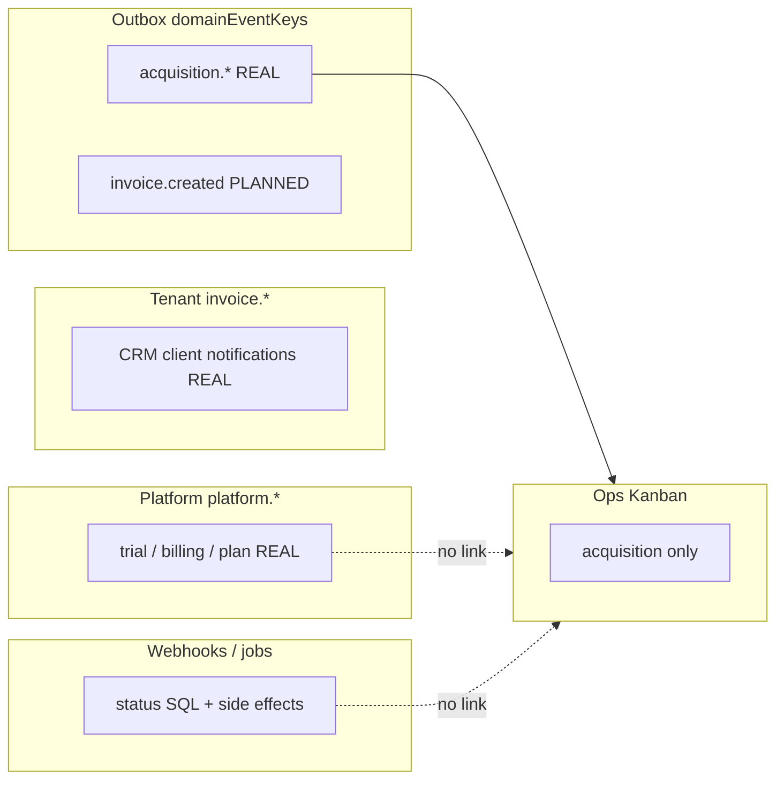

# Lifecycle Router — Foundation Audit (Billing → Lifecycle → Ops Kanban)

**Data:** 2026-06-03  
**Tipo:** Auditoria enterprise read-only  
**Escopo:** Trial, assinaturas, pagamentos, gateways, tenant lifecycle, integração Ops Kanban, fundação do Lifecycle Router  

**Relacionado:** [OPS_KANBAN_LIFECYCLE_EVOLUTION_PLAN.md](./OPS_KANBAN_LIFECYCLE_EVOLUTION_PLAN.md)

**Restrições cumpridas:** nenhuma alteração de código, migrations, banco, eventos ou automações.

---

## 1. Resumo executivo

O PainelCRM possui **três camadas financeiras** (SaaS `tenant_billing`, CRM `customer_invoices`, legado `invoices`) e um **motor de assinaturas** (`subscriptions` + jobs recorrentes). Notificações de negócio funcionam em **dois buses separados**:

1. **Plataforma** (`platform.*`) — WhatsApp/e-mail ao admin do tenant (trial, cobrança, pagamento, plano ativo).  
2. **Tenant** (`invoice.*`) — WhatsApp ao **cliente** do tenant (faturas CRM).

O **outbox de domínio** (`invoice.created`, `onboarding.trial.started`, etc.) está **catalogado mas quase não publicado** para billing — não alimenta Ops Kanban.

**Ops Kanban** reage apenas a eventos **acquisition**; **nenhum** código move card em trial expirado, pagamento aprovado, assinatura ativa ou cancelamento.

**Gateway ativo em produção típica:** **Asaas** (SaaS + tentativas); **Mercado Pago** (CRM paralelo). **Stripe:** não implementado.

**Entidade canônica recomendada para o Lifecycle Router:** **modelo híbrido** com **`tenant_id` como chave de correlação** pós-provision e resolução opcional `acquisition_lead_id` + `subscription_id`.

---

## 2. Mapa completo de billing (Etapa 1)

### 2.1 Entidades principais

| Entidade | Tabela | Responsabilidade |
|----------|--------|------------------|
| Plano comercial | `plans` | Catálogo, preço, `trial_days`, limites |
| Tenant (conta B2B) | `tenants` | Lifecycle comercial: trial, pagamento, ativo, suspenso |
| Assinatura universal | `subscriptions` | Contrato recorrente SaaS (`type=saas`) ou CRM (`type=customer`) |
| Fatura SaaS (plataforma) | `tenant_billing` | Checkout, renovação, upgrade, seat addon |
| Tentativas pagamento SaaS | `tenant_billing_payment_attempts` | PIX/boleto/cartão por fatura |
| Fatura CRM | `customer_invoices` | Cobrança dos clientes do tenant |
| Tentativas CRM | `customer_invoice_payment_attempts` | Gateway por fatura cliente |
| Jobs recorrentes | `billing_recurring_jobs` | Renovação, retry, cancelamento agendado |
| Ciclos | `subscription_cycles` | Máquina de estados por ciclo de cobrança |
| Gateway catálogo | `payment_gateways` | Asaas, Mercado Pago habilitados |
| Config gateway | `payment_gateway_configs` | Credenciais `global` (SaaS) ou `tenant` (CRM) |
| Cliente gateway | `payment_customers` | Mapeamento tenant/cliente ↔ ID no gateway |
| Webhook idempotência | `payment_events` | Dedup multi-gateway |
| Transação financeira | `financial_transactions` | Ledger tenant (receita de fatura CRM paga) |
| Lead aquisição | `acquisition_leads` | Funil pré/pós tenant; stage `trial_started`, etc. |
| Sessão onboarding | `acquisition_onboarding_sessions` | `activation_intent`: trial/payment; `payment_status` |
| Ativação (telemetria) | `acquisition_activation_events` | `trial_started`, `checkout_started`, … |
| Fatura legada | `invoices` | Motor antigo por usuário/projeto |

**Nota:** não existe tabela `payments` nem `trials` — trial é estado em `tenants` + config em `plans.trial_days`.

### 2.2 Status canônicos (referência rápida)

| Domínio | Valores |
|---------|---------|
| `tenants.status` | `trial`, `payment_pending`, `active`, `suspended` |
| `subscriptions.status` | `active`, `cancelled`, `past_due`, `trialing`, `paused` |
| `tenant_billing.status` | `pending`, `waiting_payment`, `processing`, `paid`, `overdue`, `cancelled`, `failed`, `refunded` |
| `billing_recurring_jobs.status` | `pending`, `processing`, `completed`, `failed`, `cancelled` |

---

## 3. Eventos de billing (Etapa 2)

### 3.1 Quatro buses (não integrados entre si)



### 3.2 Tabela — eventos reais vs planejados

| Evento | Arquivo origem | Payload (resumo) | Consumidores | Status |
|--------|----------------|------------------|--------------|--------|
| **Outbox — billing (planejado)** |
| `invoice.created` | *nenhum publisher* | — | shadow log; workflow bridge → `billing.invoice.created.shadow` | **Planejado** |
| `billing.invoice.created` | *nenhum* | — | idem | **Planejado** |
| `onboarding.trial.started` | *nenhum*; `trialOrchestrationService` usa só como `triggerEventKey` | — | workflow passive shadow | **Planejado** |
| `acquisition.trial.recovery` | *nenhum*; `startWorkflow` direto | — | bridge se publicado | **Planejado** |
| **Outbox — acquisition (real)** |
| `acquisition.lead.created` | `acquisitionOutbox.ts` | lead snapshot | Ops Kanban | **Real** |
| `acquisition.stage.changed` | idem | lead + `previous_stage` | Ops Kanban | **Real** |
| **Platform — SaaS admin (real)** |
| `platform.account.created` | `platformBusinessNotifications.ts` ← wizard, auth, plan purchase | `tenant.name`, `auth.login_link` | Motor WA/e-mail plataforma | **Real** |
| `platform.trial.started` | idem ← após Company Step (P0-F.1) | `trial.ends_at`, `tenant.name` | idem | **Real** |
| `platform.trial.ended` | `subscriptionService.expireTrialsPastDue` | `trial.ends_at` | idem | **Real** |
| `platform.trial.expiring` | `platformTrialExpiringNotificationService` (job opcional) | `trial.days_left` | idem | **Real** |
| `platform.billing.charge.created` | `subscribePlan`, `recurringBillingJobService`, `tenantsController` | `billing.amount`, links pagamento | idem + PIX follow-up opcional | **Real** |
| `platform.billing.charge.overdue` | `billingOverdueStatusService` | idem | idem | **Real** |
| `platform.billing.payment_confirmed` | `paymentDomainService`, pay card, gateway charge | `billing.invoice_number`, `plan.name` | idem | **Real** |
| `platform.plan.activated` | `activatePlanFromBilling` | `plan.name`, `tenant.name` | idem | **Real** |
| `platform.billing.due_reminder` | docs only | — | — | **Planejado** |
| `platform.plan.changed` | docs only | — | — | **Planejado** |
| **Tenant motor — CRM cliente (real)** |
| `invoice.created` | `businessTransactionalNotifications.ts` | cliente, valor, link | WA cliente + in-app | **Real** (CRM) |
| `invoice.paid` | `customerInvoiceService` / webhooks | idem | idem | **Real** |
| `invoice.overdue` / `invoice.due_soon` | overdue job + digest | idem | digest opcional | **Real** |
| **Sem evento nomeado** |
| Pagamento recusado | webhook → status `failed` / sem transição paid | SQL apenas | in-app parcial | **Implícito** |
| Renovação SaaS | `recurringBillingJobService` | nova `tenant_billing` | `platform.billing.charge.created` | **Real** (notificação) |
| Upgrade plano | `billing_reason=plan_upgrade` | fatura + `activatePlanFromBilling` | notificações como checkout | **Real** (sem evento lifecycle) |
| Downgrade | agendamento `max_users_scheduled_next_cycle` | SQL tenant | — | **Parcial** (sem evento) |
| Cancelamento assinatura | `billingSubscriptionService` / CRM service | `subscriptions.status=cancelled` | — | **Real** (SQL, sem outbox/Kanban) |
| Suspensão trial | `expireTrialsPastDue` | `tenants.suspended`, `trial_expired` | `platform.trial.ended` | **Real** |

### 3.3 Respostas diretas

| Pergunta | Resposta |
|----------|----------|
| Quais eventos **realmente existem** hoje? | `platform.*` (7+), `invoice.*` tenant (4), `acquisition.*` outbox (4), webhooks + jobs SQL |
| Quais são **apenas planejados**? | Outbox billing/trial (`invoice.created`, `onboarding.trial.started`, …), `platform.due_reminder`, Stripe |
| Quais estão **sem consumidor útil**? | Outbox billing keys (só shadow); `communication.message.delivered/read` |

---

## 4. Trial — lifecycle completo (Etapa 3)

### 4.1 Trial iniciado

| Pergunta | Resposta |
|----------|----------|
| **Endpoint / fluxo** | (1) Acquisition: `provisionWorkspaceFromSession` com `activation_intent=trial`; (2) Legado: `POST /api/plan-purchase/complete-signup-trial`; (3) Funil: `orchestrateTesteGratis` → stage lead `trial_started` **sem tenant** |
| **Service** | `acquisitionProvisioningService.ts`, `planPurchaseController.ts`, `trialOrchestrationService.ts` |
| **Tabela** | `tenants`: `status='trial'`, `trial_ends_at`, `has_used_trial=true`, `trial_consumed_at`; `acquisition_leads.current_stage` |
| **Evento** | Lead: `acquisition.stage.changed`; plataforma: `platform.trial.started` (após Company Step no fluxo acquisition); activation DB: `trial_started` |
| **Kanban** | Coluna **Trial iniciado** se stage `trial_started` ou override wizard |

### 4.2 Trial ativo

| Identificador | Campo / regra |
|---------------|---------------|
| Tenant | `tenants.status IN ('trial','payment_pending')` e `trial_ends_at > now()` |
| Lead | `acquisition_leads.current_stage` ∈ `trial_started`, `onboarding_*` |
| Plano | `plans.trial_days` na criação |
| Assinatura SaaS | Pode não existir até primeiro pagamento (`activated_billing_id IS NULL`) |

### 4.3 Trial expirado

| Mecanismo | Detalhe |
|-----------|---------|
| **Job** | `scripts/runTrialExpiration.ts` → `expireTrialsPastDue()` |
| **Cron** | Agendado em `index.ts` quando `TRIAL_EXPIRATION_JOB=true` |
| **Condição** | `trial_ends_at <= now()`, `activated_billing_id IS NULL`, status `trial` ou `payment_pending` |
| **Efeito SQL** | `status='suspended'`, `suspension_reason='trial_expired'`, `has_used_trial=true` |
| **Evento** | `platform.trial.ended` (notificação admin) — **não** outbox, **não** Kanban |
| **Mudança automática Kanban** | **Não** |

### 4.4 Trial convertido (pagamento)

| Gatilho | Webhook Asaas `PAYMENT_RECEIVED` / cartão → `paymentDomainService.applyPaymentEvent` → `activatePlanFromBilling` |
| **Efeito tenant** | `status='active'`, `plan_period_*`, `activated_billing_id` |
| **Assinatura** | `ensureSaasSubscriptionAfterPaidActivation` |
| **Eventos** | `platform.billing.payment_confirmed` + `platform.plan.activated` |
| **Lead** | **Não** atualizado automaticamente para stage “pago” |
| **Kanban** | **Não** move — card pode permanecer em **Trial iniciado** ou **Ativado** (WhatsApp) |

### 4.5 Diagrama Trial

```text
Trial Created
  ├─ Acquisition provision → tenants.status=trial, trial_ends_at set
  ├─ Lead stage trial_started / onboarding_* (paralelo)
  └─ platform.trial.started (após identidade oficial — fluxo acquisition)
        ↓
Trial Active
  ├─ Identificação: tenants.status + trial_ends_at
  ├─ Ops: coluna "Trial iniciado" (Aquisição) — se stage/sync
  └─ Cobrança opcional: subscribePlan → payment_pending + tenant_billing
        ↓
    ┌───────────────────┴────────────────────┐
    ↓                                        ↓
Trial Expired                          Trial Converted
expireTrialsPastDue                    webhook paid → activatePlanFromBilling
suspended + trial_expired              active + subscription
platform.trial.ended                   platform.payment_confirmed + plan.activated
SEM Kanban                             SEM Kanban
```

---

## 5. Assinaturas (Etapa 4)

### 5.1 Criação

| Contexto | Onde |
|----------|------|
| SaaS pós-pagamento | `ensureSaasSubscriptionAfterPaidActivation` em `subscriptionService.ts` |
| Renovação | `recurringBillingJobService` + `billingSubscriptionService` |
| CRM | `crmSubscriptionsService` / `customerBillingService` |

### 5.2 Ativação

| Evento negócio | `platform.plan.activated` após `activatePlanFromBilling` |
| Evento outbox | **Nenhum** |
| Kanban | **Nenhum** |

### 5.3 Renovação

| Processo | Scheduler `runRecurringScheduler` + worker `runRecurringWorker` |
| Evento | Nova fatura → `platform.billing.charge.created` |
| Lifecycle ops | **Não** |

### 5.4 Upgrade / downgrade

| Tipo | Implementação | Evento lifecycle |
|------|---------------|------------------|
| **Upgrade** | `billing_reason=plan_upgrade` em `tenant_billing`; ativação como compra | Notificações billing/plan; **sem** evento router |
| **Downgrade** | Campos agendados em `tenants` (`max_users_scheduled_next_cycle`); efetivação no ciclo | **Sem** evento nomeado |
| **Seat addon** | `seat_addon` billing reason | Tratamento separado em `activateSeatAddonFromBilling` |

### 5.5 Cancelamento

| Tipo | Service | Workflow |
|------|---------|----------|
| SaaS imediato / fim de período | `billingSubscriptionService` | Job `cancel_subscription`; SQL `cancelled` |
| CRM | `crmSubscriptionsService` | Timeline CRM |
| Evento plataforma/outbox | **Nenhum** | **Nenhum** workflow ops |

### 5.6 Máquina de estados (SaaS — simplificada)

| Estado subscription | Evento entrada típico | Evento saída / efeito |
|---------------------|----------------------|------------------------|
| *(não existe)* | Primeiro `tenant_billing.paid` | Criação `active` |
| `active` | Renovação job | Nova fatura; permanece `active` |
| `active` | `cancel_at_period_end` | Job cancela após `current_period_end` |
| `cancelled` | Cancel imediato | Tenant pode voltar `trial` (regra cancel service) |
| `past_due` | Falha pagamento recorrente | Cobrança overdue + notificações |

---

## 6. Gateways (Etapa 5)

### 6.1 Ativos no ambiente auditado

| Gateway | Catálogo | Config ativa | Uso |
|---------|----------|--------------|-----|
| **Asaas** | `is_enabled=true` | `global` + `tenant` active | **Principal** — SaaS `tenant_billing`, webhooks `/webhooks/asaas` |
| **Mercado Pago** | `is_enabled=true` | tenant scope | **CRM** — `mercadoPagoWebhookService`, checkout cliente |
| **Stripe** | — | — | **Não implementado** |

### 6.2 Fluxo pagamento aprovado (SaaS)

```text
Pagamento aprovado (gateway)
        ↓
POST /webhooks/asaas
        ↓
asaasWebhook.ts → webhookCore.ts
        ↓
Resolve: tenant_billing_payment_attempt OU tenant_billing
        ↓
paymentDomainService.applyPaymentEvent / applyTenantBillingPaymentAttemptEvent
        ↓
tenant_billing.status = paid
        ↓
activatePlanFromBilling(billingId)
        ├─ tenants.status = active
        ├─ subscriptions (saas) active
        ├─ platform.billing.payment_confirmed
        └─ platform.plan.activated
        ↓
(sem passo) Ops Kanban / acquisition.stage / board Expansão
```

---

## 7. Tenant lifecycle (Etapa 6)

### 7.1 Status e quem altera

| Status | Onde definido | Quem altera |
|--------|---------------|-------------|
| `trial` | SQL enum `tenants` | Provision acquisition, complete-signup-trial, revert stale billing |
| `payment_pending` | idem | `subscribePlan` (checkout aguardando pagamento) |
| `active` | idem | `activatePlanFromBilling`, legado register com pagamento |
| `suspended` | idem | `expireTrialsPastDue`, billing settings auto-suspend, `has_used_trial` paths |
| `cancelled` / `archived` | **Não** são status principais de `tenants` no enum auditado | Cancelamento é em `subscriptions.status` |

**`suspension_reason`:** ex. `trial_expired` — setado pelo job de expiração.

### 7.2 Transições e eventos acompanhantes

| Transição | Executor | Evento / notificação |
|-----------|----------|----------------------|
| → `trial` | Provision / signup trial | `acquisition.stage.changed`; `platform.trial.started` (timing depende do fluxo) |
| → `payment_pending` | `subscribePlan` | `platform.billing.charge.created` |
| → `active` | Webhook paid / cartão | `payment_confirmed` + `plan.activated` |
| → `suspended` (trial) | `expireTrialsPastDue` | `platform.trial.ended` |
| → `trial` (revert) | `cancelStalePendingBillings` | Nenhum |

---

## 8. Ops Kanban integration (Etapa 7)

| Evento / marco | Integração Kanban | Implementado? |
|----------------|-------------------|---------------|
| Trial inicia (stage) | `syncAcquisitionLeadToOpsKanban` → coluna Trial iniciado | **Sim** (coluna Aquisição) |
| Trial expira | — | **Não** |
| Pagamento aprovado | — | **Não** |
| Assinatura ativa | — | **Não** |
| Plano ativado (`platform.plan.activated`) | — | **Não** |
| Cancelamento | — | **Não** |
| Renovação / upgrade | — | **Não** |
| Onboarding wizard | Overrides coluna em Aquisição | **Sim** |
| Checkout abandonado | Coluna + automação hardcoded | **Sim** (board Aquisição) |

**Confirmação código:** `subscriptionService.ts` e `modules/payments/**` **não importam** `superadminOpsKanbanLeadService`.

---

## 9. Automações de coluna (Etapa 8)

### 9.1 Gatilhos e ações (phase2 + ops)

| Gatilho | Suporte ops lead card hoje |
|---------|----------------------------|
| Entrada manual em coluna (drag) | Foundation log; checkout abandonado se coluna nome match |
| `auto_move_by_time` (delay seconds→days) | **Conversation cards**; scheduled move com `to_board_id` |
| Webhook coluna | Configurável; execução real pula lead-only |
| WhatsApp auto texto / modelo | Requer conversa no pipeline tenant |

### 9.2 Campanhas Day 1 / 3 / 7 / 15 / 30 sem código?

**Parcialmente teórico, na prática NÃO para lifecycle ops:**

- Seria necessário **5 colunas** ou **5 agendamentos** `auto_move_by_time` por coluna, cada um com delay em dias.  
- Cards **acquisition lead** hoje **não executam** phase2 completo (`leadOnlyCard` + foundation mode).  
- Não há gatilho “desde trial_started + N dias” — só “entrou na coluna + delay”.  
- Não há integração com `trial_ends_at` ou `subscription.current_period_end`.

### 9.3 Lifecycle operacional só com automações de coluna?

**NÃO.**

**Justificativa:** (1) billing não move cards; (2) lead-only excluído do phase2; (3) boards pós-aquisição vazios; (4) sem gatilhos temporais ligados a tenant/subscription; (5) trial convertido e expirado exigem eventos de domínio que hoje só geram notificações `platform.*`.

---

## 10. Identidade canônica do Lifecycle Router (Etapa 9)

### 10.1 Comparativo

| Entidade | Prós | Contras |
|----------|------|---------|
| **acquisition_lead** | Cobre funil completo; já ligado ao card Kanban | Perde relevância após conversão/pagamento; nem todo tenant tem lead |
| **tenant** | Central pós-provision; status trial/active/suspended; billing | Não existe no pré-signup; múltiplos leads raros mas possíveis |
| **subscription** | Correto para receita/renovação/cancel | Pode não existir durante trial puro; CRM vs SaaS `type` |
| **Híbrido** | Mapeia fase por fase | Exige regras de resolução |

### 10.2 Recomendação

**Entidade canônica:** **`tenant_id`** como chave primária do router após provision, com:

- **`acquisition_lead_id`** resolvido por `acquisition_leads.tenant_id` (para card Kanban existente).  
- **`subscription_id`** resolvido por `getActiveSaasSubscriptionByTenant` para eventos de receita.  

**Fases:**

| Fase | Chave primária |
|------|----------------|
| Pré-provision | `acquisition_lead_id` |
| Trial / onboarding / ativo | `tenant_id` + lead opcional |
| Expansão / retenção | `tenant_id` + `subscription_id` |

---

## 11. Dados reais — read-only (Etapa 10)

**Ambiente:** PostgreSQL local `painelcrm` (2026-06-03). Não representa produção.

| Métrica | Valor |
|---------|-------|
| Tenants por status | `active`: **6** |
| Trials ativos (`trial`/`payment_pending`, `trial_ends_at > now`) | **0** |
| Tenants suspensos trial_expired | **0** |
| Assinaturas SaaS `active` | **5** |
| Assinaturas SaaS `cancelled` | **0** |
| `tenant_billing` paid / overdue / pending | **16** / **11** / **1** |
| `acquisition_leads` total | **57** |
| Leads com `tenant_id` | **1** (`onboarding_in_progress`) |
| Cards Kanban Aquisição | **1** (coluna **Trial iniciado**) |
| Gateways habilitados | Asaas, Mercado Pago |

### 11.1 Divergências detectadas

| Divergência | Quantidade | Exemplo |
|-------------|------------|---------|
| Tenant **active** + card em coluna **Trial iniciado** | **1** | Pagamento/conversão ocorreu sem sync Kanban |
| Trial expirado + card sem movimentação | **0** (sem trials expirados no DB) |
| Assinatura ativa + card parado em aquisição | Incluído no caso acima | Board Expansão vazio |

**Interpretação:** confirma gap **pagamento → Kanban**; coluna “Trial iniciado” não reflete `tenants.status=active`.

### 11.2 SQL para reproduzir (produção)

Ver seção 9.6 em [OPS_KANBAN_LIFECYCLE_EVOLUTION_PLAN.md](./OPS_KANBAN_LIFECYCLE_EVOLUTION_PLAN.md) +:

```sql
SELECT COUNT(*) FROM tenants WHERE status = 'trial' AND trial_ends_at > now();
SELECT COUNT(*) FROM tenants WHERE suspension_reason = 'trial_expired';
SELECT t.status, col.name
FROM tenants t
JOIN acquisition_leads al ON al.tenant_id = t.id
JOIN chat_kanban_cards c ON c.acquisition_lead_id = al.id AND c.archived_at IS NULL
JOIN chat_kanban_columns col ON col.id = c.column_id
WHERE t.status = 'active' AND lower(col.name) = 'trial iniciado';
```

---

## 12. Gaps arquiteturais (Etapa 11)

### 12.1 Críticos (P0) — vendas / conversão

| ID | Gap |
|----|-----|
| P0-1 | Pagamento aprovado **não** atualiza lifecycle ops (Kanban, lead stage) |
| P0-2 | Coluna **Ativado** = WhatsApp, **não** pagamento — confusão operacional |
| P0-3 | Sem evento de domínio unificado `billing.tenant.plan_activated` consumível pelo router |
| P0-4 | Outbox billing **não publicado** — router não pode escutar bus único |

### 12.2 Operacionais (P1) — CS

| ID | Gap |
|----|-----|
| P1-1 | Trial expirado notifica admin mas **não** move para Reativação |
| P1-2 | Boards Onboarding/Expansão/Reativação **sem pipeline** |
| P1-3 | Divergência tenant active vs card Trial iniciado |
| P1-4 | `onboarding.completed` (flag tenant) sem evento lifecycle |

### 12.3 Financeiros (P1)

| ID | Gap |
|----|-----|
| P1-5 | Renovação/overdue não refletem em ops |
| P1-6 | Cancelamento subscription sem sinal ops |
| P1-7 | Dois buses de notificação (platform vs invoice.*) sem correlação lifecycle |

### 12.4 Automação / escala (P2)

| ID | Gap |
|----|-----|
| P2-1 | Phase2 não executa em cards lead-only |
| P2-2 | Campanhas temporais (D+1…) exigiriam N colunas manuais |
| P2-3 | Stripe ausente — doc vs código |
| P2-4 | Duplicidade `payment_confirmed` + `plan.activated` sem idempotência router |

---

## 13. Riscos

| Risco | Impacto |
|-------|---------|
| Super Admin opera funil desatualizado após pagamento | Perda de upsell e churn silencioso |
| Dependência de fallback outbox vs worker | Comportamento diferente por ambiente |
| CRM `invoice.*` confundido com SaaS lifecycle | Integrações erradas no router |
| Cancelamento sem board Reativação | Cliente pago cancelado invisível no ops |
| Trial expirado só `suspended` | CS não prioriza reativação no Kanban |

---

## 14. Arquitetura futura — Lifecycle Router (Etapa 12)

### 14.1 Pipeline alvo (sem implementar)

```text
Lead Capturado        → Aquisição / Novo lead
Lead Qualificado      → Aquisição / Qualificado
Trial Iniciado        → Aquisição / Trial iniciado  (ou Onboarding se política)
Onboarding            → Onboarding board / Em progresso
Cliente Ativo (pago)  → Expansão / Oportunidade (ou Aquisição / Cliente ativo)
Expansão              → Expansão / Negociação → Expandido
Cancelado             → Reativação / Inativo detectado
Reativação            → Reativação / Campanha → Reativado
Recovery checkout     → Recovery / Novo caso
```

### 14.2 Eventos — existentes vs a criar

| Evento router (proposto) | Existe hoje? | Fonte atual / ação |
|--------------------------|--------------|-------------------|
| `lifecycle.lead.captured` | Parcial | `acquisition.lead.created` |
| `lifecycle.trial.started` | Parcial | `platform.trial.started` + stage; **criar** outbox unificado |
| `lifecycle.onboarding.progress` | Parcial | wizard + `acquisition.stage.changed` |
| `lifecycle.onboarding.completed` | **Não** | Criar ao setar `tenants.onboarding_completed` |
| `lifecycle.billing.charge_created` | Parcial | `platform.billing.charge.created` |
| `lifecycle.billing.payment_confirmed` | Parcial | `platform.billing.payment_confirmed` |
| `lifecycle.subscription.activated` | Parcial | `platform.plan.activated` / `activatePlanFromBilling` |
| `lifecycle.subscription.renewed` | **Não** | Emitir no recurring job |
| `lifecycle.subscription.cancelled` | **Não** | Emitir em `billingSubscriptionService` |
| `lifecycle.trial.expired` | Parcial | `expireTrialsPastDue` + `platform.trial.ended` |
| `lifecycle.trial.converted` | **Não** | Emitir após `activatePlanFromBilling` |
| `lifecycle.tenant.suspended` | **Não** | Billing auto-suspend |

### 14.3 Contrato router (conceitual)

```typescript
// Conceitual — não implementado
type LifecycleRouterInput = {
  eventKey: string;
  tenantId?: string;
  acquisitionLeadId?: string;
  subscriptionId?: string;
  correlationId: string;
  payload?: Record<string, unknown>;
};

type LifecycleRouterDecision = {
  targetBoard: 'Aquisição' | 'Recovery' | 'Onboarding' | 'Expansão' | 'Reativação';
  targetColumn: string;
  runColumnAutomations: boolean;
  idempotencyKey: string;
};
```

---

## 15. Plano de implementação (Sprints G–J)

Alinhado a [OPS_KANBAN_LIFECYCLE_EVOLUTION_PLAN.md](./OPS_KANBAN_LIFECYCLE_EVOLUTION_PLAN.md), com foco billing.

### Sprint G — Lifecycle Router (fundação)

| # | Entrega |
|---|---------|
| G1 | Spec `OpsLifecycleRouter` + tabela/config de transições (evento → board + coluna) |
| G2 | Resolver identidade: `tenant_id` → `acquisition_lead_id` → card |
| G3 | Publicar eventos mínimos: `lifecycle.trial.converted`, `lifecycle.onboarding.completed`, `lifecycle.trial.expired` |
| G4 | Outbox estável + métricas; reduzir dependência só de fallback |
| G5 | Documentar semântica **Cliente ativo (pago)** vs **Ativado (WhatsApp)** |

**Aceite:** pagamento em staging dispara decisão router (log), mesmo que ainda só mova coluna em Aquisição.

### Sprint H — Billing Integration

| # | Entrega |
|---|---------|
| H1 | Hook pós-`activatePlanFromBilling` → router (`lifecycle.trial.converted`) |
| H2 | Hook `expireTrialsPastDue` → router (`lifecycle.trial.expired`) |
| H3 | Hook `subscribePlan` / overdue → router (cobrança pendente) |
| H4 | Hook cancelamento `subscriptions` → router |
| H5 | Unificar emissão: um evento interno por transição tenant status |

**Aceite:** alteração de `tenants.status` sempre gera evento lifecycle consumível.

### Sprint I — Board Promotion Engine

| # | Entrega |
|---|---------|
| I1 | `promoteOpsLeadCard(boardId, columnId)` idempotente |
| I2 | Regra: pago → board **Expansão**; onboarding empresa → **Onboarding** |
| I3 | Regra: trial expirado / cancelado → **Reativação** |
| I4 | Backfill report (read-only) + migração controlada |
| I5 | Corrigir divergência active + coluna Trial iniciado |

**Aceite:** tenant active pós-pagamento não permanece em Trial iniciado.

### Sprint J — Lifecycle Automations

| # | Entrega |
|---|---------|
| J1 | Phase2 executável para subject `acquisition_lead` |
| J2 | Automações temporais baseadas em **data do evento** (não só column enter) |
| J3 | Migrar checkout abandonado para config de coluna |
| J4 | Campanhas D+1…D+30 via router + jobs (não N hardcodes) |
| J5 | Dashboard: lag billing vs Kanban, divergências |

**Aceite:** CS configura sequência pós-pagamento sem deploy de `if` por campanha.

---

## 16. Estado atual consolidado (entrega §1–§6)

| Área | Estado atual |
|------|----------------|
| **Billing** | Três camadas de fatura; SaaS via `tenant_billing` + Asaas; 16 paid / 11 overdue no dev |
| **Assinaturas** | 5 SaaS `active`; motor recorrente com jobs; cancelamento SQL sem ops |
| **Trials** | Colunas em `tenants`; job expiração; notificações `platform.trial.*`; 0 trials ativos no dev |
| **Kanban** | 1 card; só Aquisição automatizado; sem billing hooks |
| **Eventos existentes** | `platform.*`, `invoice.*` CRM, `acquisition.*`, webhooks |
| **Eventos ausentes** | Outbox billing, `lifecycle.*` unificado, Kanban em pagamento/expiração/cancelamento |

---

## 17. Índice de arquivos

| Domínio | Caminho |
|---------|---------|
| Assinaturas / trial job | `packages/backend/src/services/subscriptionService.ts` |
| Webhook pagamento | `packages/backend/src/modules/payments/webhook/paymentDomainService.ts` |
| Recorrência | `packages/backend/src/services/recurringBillingJobService.ts` |
| Cancelamento SaaS | `packages/backend/src/services/billingSubscriptionService.ts` |
| Notificações plataforma | `packages/backend/src/services/platformNotifications/platformBusinessNotifications.ts` |
| Notificações CRM | `packages/backend/src/services/notificationsEngine/businessTransactionalNotifications.ts` |
| Outbox catálogo | `packages/backend/src/outbox/domainEventKeys.ts` |
| Provision trial | `packages/backend/src/acquisition/acquisitionProvisioningService.ts` |
| Ops Kanban sync | `packages/backend/src/services/superadminOpsKanbanLeadService.ts` |
| Asaas webhook | `packages/backend/src/modules/gateways/asaas/webhooks/asaasWebhook.ts` |
| Trial expiration script | `packages/backend/src/scripts/runTrialExpiration.ts` |

---

*Auditoria read-only — nenhum arquivo de aplicação, migration ou dado foi modificado.*
