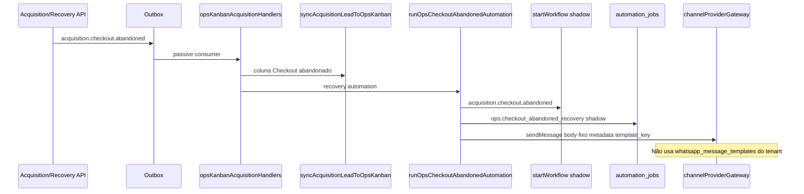

# Auditoria read-only — Kanban Operacional (Super Admin) e Automações

**Data:** 2026-05-28  
**Escopo:** Investigação apenas — sem alteração de código, migrations ou banco.

**Componentes centrais:** `superadminOpsKanbanSeedService`, `superadminOpsKanbanLeadService`, `opsKanbanAcquisitionHandlers`, `acquisitionOnboardingOrchestration`, `activationTrackingService`, `orchestrationService`, `outboxWorkflowBridge`, `kanbanColumnAutomationService` (tenant), `superadminOpsColumnAutomationService` (ops).

---

## 1. Resumo executivo

O **Kanban Operacional** reutiliza `chat_kanban_*` em um **tenant virtual** (`SUPERADMIN_OPS_KANBAN_TENANT_ID`). Apenas o board **Aquisição** recebe cards automaticamente a partir de `acquisition_leads` (`chat_kanban_cards.acquisition_lead_id`, sem `conversation_id`).

A movimentação automática é **determinística**: estágio do lead + overrides de evento → nome da coluna. A única **automação de coluna com efeito de negócio** implementada para ops é **Checkout abandonado** (workflow shadow + job + WhatsApp shadow).

O pipeline depende de **outbox + passive consumers** ou **fallback síncrono** quando `outbox.write_v1` está off. Com flags P0 default **OFF**, muito do comportamento só roda via fallback direto ou chamadas `syncAcquisitionLeadToOpsKanban` no código HTTP.

**Boards** Recovery, Onboarding, Expansão e Reativação são **seedados** mas **não recebem cards** automaticamente hoje.

---

## 2. Como os cards entram no Kanban

### 2.1 Origem dos cards

| Origem | Descrição |
|--------|-----------|
| **`acquisition_leads`** | Entidade de domínio; um card por lead no board Aquisição |
| **Tabela** | `chat_kanban_cards` com `acquisition_lead_id` preenchido, `conversation_id = NULL` |
| **Tenant** | `SUPERADMIN_OPS_KANBAN_TENANT_ID` (`packages/backend/src/config/superadminOpsKanban.ts`) |
| **Board** | Sempre **Aquisição** (`getAcquisitionBoardId` / `ACQUISITION_BOARD_NAME`) |

### 2.2 Serviço principal

**`syncAcquisitionLeadToOpsKanban`** (`superadminOpsKanbanLeadService.ts`):

1. Valida migration `260` (`acquisition_lead_id` em cards).
2. Carrega lead; resolve ator super admin (`SUPERADMIN_OPS_KANBAN_SYSTEM_USER_ID` ou primeiro `is_super_admin`).
3. Garante seed de boards/colunas (`ensureSuperadminOpsKanbanSeed`, sem backfill).
4. Resolve coluna: `columnNameOverride` **ou** `resolveOpsColumnForLead` (mapa estágio/step).
5. INSERT card novo ou UPDATE `column_id` + metadata enriquecida.
6. Timeline em `metadata` do card (`superadminOpsLeadTimelineService`).

### 2.3 Caminhos que disparam sync

| Caminho | Mecanismo |
|---------|-----------|
| **Outbox (preferencial)** | `publishAcquisition*` → `publishDomainEventDetached` → worker → `opsKanbanAcquisitionHandlers` |
| **Fallback** | Se outbox write skipped → `syncLeadToOpsKanbanFallback` em `acquisitionOutbox.ts` |
| **Direto (sem outbox)** | `emitOnboardingWizardEvent`, `provisionWorkspaceFromSession`, `acquisitionOnboardingWizardService` (complete/skip), backfill bootstrap |

### 2.4 Eventos outbox → handlers

| `event_key` | Handler | Efeito |
|-------------|---------|--------|
| `acquisition.lead.created` | `handleOpsKanbanAcquisitionLeadCreated` | Sync → coluna por estágio (tipicamente **Novo lead**) |
| `acquisition.signup.started` | `handleOpsKanbanAcquisitionSignupStarted` | Sync com `payload.step` → coluna contact/plan/checkout |
| `acquisition.stage.changed` | `handleOpsKanbanAcquisitionStageChanged` | Sync por `current_stage` |
| `acquisition.checkout.abandoned` | `handleOpsKanbanAcquisitionCheckoutAbandoned` | Sync forçado **Checkout abandonado** + `runOpsCheckoutAbandonedAutomation` |

### 2.5 Publicadores de eventos (quem cria o gatilho)

| Serviço / fluxo | Eventos publicados |
|----------------|-------------------|
| `signupOrchestrationService` | `acquisition.lead.created`, `acquisition.signup.started`, `acquisition.stage.changed` |
| `trialOrchestrationService` | `acquisition.stage.changed` |
| `acquisitionRecoveryService.markAcquisitionAbandoned` | `acquisition.stage.changed`, `acquisition.checkout.abandoned` |
| `acquisitionProvisioningService` | `acquisition.stage.changed` + sync direto |
| `acquisitionActivationPrepareService` | `acquisition.stage.changed` |
| `acquisitionOnboardingOrchestration` | `acquisition.stage.changed` (se mudou stage) + sync direto com override |
| Bootstrap / backfill | `backfillAcquisitionLeadsToOpsKanban` → sync direto |

### 2.6 Seed e primeiro acesso

- **`ensureSuperadminOpsKanbanSeed`**: 5 boards + colunas idempotentes.
- **`POST /api/superadmin/ops/kanban/bootstrap`** e listagem de boards disparam seed + backfill (até 150 leads).
- Colunas ops nascem com `automation_config.enabled: false` e `kanban_phase2` vazio (sem automações phase2 tenant ativas).

---

## 3. Movimentação automática — regras

### 3.1 Por estágio do lead (`STAGE_TO_COLUMN`)

| `current_stage` (lead) | Coluna destino (board Aquisição) |
|------------------------|----------------------------------|
| `pre_signup` | Novo lead |
| `contact_captured` | Novo lead |
| `plan_selected` | Qualificado |
| `checkout_started` | Checkout |
| `checkout_abandoned` | Checkout abandonado |
| `activation_prepared` | Onboarding incompleto |
| `onboarding_in_progress` | Onboarding incompleto |
| `trial_started` | Trial iniciado |
| `onboarding_kickoff` | Onboarding incompleto |
| `onboarding_active` | Onboarding incompleto |
| `converted` | Ativado |
| *(desconhecido)* | Novo lead (default) |

**Nota:** Coluna seed **Iniciou cadastro** existe no board, mas **não há mapeamento automático** no código — só movimentação manual (drag) ou futuro override.

### 3.2 Por passo de signup (`SIGNUP_STEP_TO_COLUMN`)

| `payload.step` (evento `acquisition.signup.started`) | Coluna |
|------------------------------------------------------|--------|
| `contact` | Novo lead |
| `plan` | Qualificado |
| `checkout` | Checkout |

### 3.3 Overrides explícitos (wizard / eventos)

| Gatilho | Coluna forçada | Arquivo |
|---------|----------------|---------|
| `onboarding.company.completed` | Onboarding incompleto | `acquisitionOnboardingOrchestration` |
| `onboarding.users.completed` | Trial iniciado | idem |
| `whatsapp.connected` | Ativado | idem |
| Provision workspace | Onboarding incompleto | `acquisitionProvisioningService` |
| `acquisition.checkout.abandoned` (evento) | Checkout abandonado | `opsKanbanAcquisitionHandlers` + fallback outbox |
| Complete wizard WhatsApp (sync direto) | Ativado | `acquisitionOnboardingWizardService` |

### 3.4 Movimentação manual

- Drag/drop via `chatKanbanController` (rotas `/api/superadmin/ops/kanban/*` reutilizam o mesmo controller).
- Se card lead-only entra em coluna **Checkout abandonado** → `runOpsCheckoutAbandonedAutomation` (`trigger: kanban_column_enter`).

### 3.5 Tabela consolidada evento → coluna

| Evento / condição | Origem lógica | Coluna típica anterior | Coluna destino |
|-------------------|---------------|------------------------|----------------|
| Lead criado | `acquisition.lead.created` | — | Por estágio (Novo lead) |
| Signup step contact | `acquisition.signup.started` | variável | Novo lead |
| Signup step plan | idem | variável | Qualificado |
| Signup step checkout | idem | variável | Checkout |
| Stage `checkout_abandoned` | `acquisition.stage.changed` | Checkout | Checkout abandonado |
| Stage `trial_started` | stage changed | variável | Trial iniciado |
| Stage `converted` | stage changed / wizard | variável | Ativado |
| Wizard empresa | sync override | variável | Onboarding incompleto |
| Wizard equipe | sync override | variável | Trial iniciado |
| Wizard WhatsApp | sync override | variável | Ativado |
| Abandono checkout | `acquisition.checkout.abandoned` | variável | Checkout abandonado |
| Drag manual | UI | qualquer | coluna escolhida |

---

## 4. Eventos disponíveis (nomes reais)

### 4.1 Catálogo outbox (`domainEventKeys.ts`)

```
signup.completed
onboarding.signup.started
onboarding.trial.started
acquisition.lead.created
acquisition.signup.started
acquisition.stage.changed
acquisition.checkout.abandoned
acquisition.trial.recovery
onboarding.kickoff
onboarding.first_access
invoice.created
billing.invoice.created
ticket.created
support.ticket.created
workflow.started
communication.message.sent
communication.message.received
communication.message.delivered
communication.message.read
communication.message.failed
```

### 4.2 Workflow keys usados diretamente (`startWorkflow`)

| workflowKey | Onde |
|-------------|------|
| `acquisition.signup.started` | `signupOrchestrationService` |
| `acquisition.checkout.abandoned` | recovery, ops column automation |
| `acquisition.trial.recovery` | `acquisitionRecoveryService` |
| `onboarding.kickoff` | `onboardingKickoffService` |
| `onboarding.first_access` | idem |
| `onboarding.company.completed` | `acquisitionOnboardingOrchestration` |
| `onboarding.users.completed` | idem |
| `whatsapp.connected` | idem |

### 4.3 Bridge outbox → workflow shadow (`outboxWorkflowBridge.ts`)

| event_key | workflowKey mapeado |
|-----------|---------------------|
| `ticket.created` / `support.ticket.created` | `support.ticket.created.shadow` |
| `invoice.created` / `billing.invoice.created` | `billing.invoice.created.shadow` |
| `communication.message.received` | `communication.inbound.shadow` |
| `communication.message.failed` | `communication.failed.shadow` |
| `onboarding.trial.started` | `onboarding.trial.shadow` |
| `onboarding.signup.started` | `onboarding.signup.shadow` |
| `acquisition.signup.started` | `acquisition.signup.started.shadow` |
| `acquisition.checkout.abandoned` | `acquisition.checkout.abandoned.shadow` |
| `acquisition.trial.recovery` | `acquisition.trial.recovery.shadow` |
| `onboarding.kickoff` | `onboarding.kickoff.shadow` |
| `onboarding.first_access` | `onboarding.first_access.shadow` |
| `signup.completed` | `onboarding.signup.completed.shadow` |
| `workflow.started` | `workflow.echo.shadow` |

**Sem bridge:** `acquisition.lead.created`, `acquisition.stage.changed` (apenas consumer ops kanban).

### 4.4 Wizard / tracking (não são event_keys outbox)

| Nome | Tipo |
|------|------|
| `onboarding.company.completed` | Wizard + workflow direto |
| `onboarding.users.completed` | idem |
| `whatsapp.connected` | idem |
| `signup_started`, `checkout_started`, `first_message`, etc. | `acquisition_activation_events.event_type` |

### 4.5 Timeline no card (tipos internos)

`lead_created`, `signup_started`, `stage_changed`, `kanban_sync`, `kanban_moved`, `kanban_card_created`, `checkout_abandoned_automation`, `recovery_whatsapp`, `onboarding_company_completed`, etc. (`superadminOpsLeadTimelineService`).

---

## 5. Automações de coluna — status

### 5.1 Kanban tenant (phase2) — `kanbanColumnAutomationService.ts`

| Tipo | Status no ops kanban |
|------|----------------------|
| Ao entrar na coluna | **Desligado** no seed (`automation_config.enabled: false`) |
| Ao sair | Não aplicável (desligado) |
| Permanência / delays | Engine existe para tenants; **não configurado** nas colunas ops seed |
| Webhooks phase2 | Disponível no engine tenant; **off** no metadata ops |
| Mensagens automáticas phase2 | idem |
| Sync estágio CRM | idem |
| Jobs deferred após move | Só para cards **com conversa** (`conversation_id`); cards lead-only **não** disparam `runDeferredKanbanEntryAutomationsAfterCommit` |

### 5.2 Automação ops dedicada — `superadminOpsColumnAutomationService.ts`

| Gatilho | Coluna | Ações |
|---------|--------|-------|
| `acquisition.checkout.abandoned` (outbox) | Checkout abandonado | `startWorkflow('acquisition.checkout.abandoned')`, `scheduleAutomationJob('ops:checkout_abandoned_recovery')`, `sendMessage` WhatsApp (corpo fixo), timeline |
| Drag para coluna | Checkout abandonado | Mesma função (`trigger: kanban_column_enter`) |

**Não implementado:** automações ao entrar/sair em Trial iniciado, Ativado, Recovery board, etc.

---

## 6. Execução — o que roda hoje

### 6.1 Tabela de execução

| Capacidade | Executa de fato? | Condição |
|------------|------------------|----------|
| Criar/mover card ops | **Sim** | Migration 260 + ator super admin; fallback se outbox off |
| Outbox write | **Shadow/no-op default** | `outbox.write_v1` default OFF → fallback sync |
| Passive consumers ops | **Só se flags ON** | `outbox.passive_consumers_v1` + publisher worker |
| `runOpsCheckoutAbandonedAutomation` | **Sim** (lógica roda) | Disparo em abandono ou drag; comunicação/workflow **shadow** |
| `startWorkflow` (todos) | **Shadow** | `executeWorkflowShadow` + `dryRun: true`; skip se `workflow.orchestration_v1` off |
| `scheduleAutomationJob` | **Persiste job** | `shadowMode: true` na recovery/checkout ops |
| `sendMessage` / `sendTransactionalMessage` | **Shadow ou skip** | Flags communication; ops recovery usa texto hardcoded |
| `trackActivationEvent` | **Só se flag** | `acquisition.activation_tracking_v1` OFF default |
| `kickoffOnboarding` | **Só se flag** | `acquisition.onboarding_kickoff_v1` OFF default |
| Recovery agendado | **Só se flag** | `acquisition.recovery_v1` OFF default |
| Kanban phase2 ops colunas | **Não** | `enabled: false` no seed |

### 6.2 Workers

| Worker | Papel |
|--------|------|
| `runOutboxPublisherWorker` | Publica `outbox_events` → `dispatchPassiveConsumers` |
| Workers billing/recurring | **Não** ligados ao ops kanban |
| `automation_jobs` | Agendados em recovery/checkout; execução real depende de worker de automação (foundation P0) |

### 6.3 Feature flags relevantes (default OFF / shadow)

**Outbox:** `outbox.write_v1`, `outbox.publisher_worker_v1`, `outbox.passive_consumers_v1`, kill `outbox.master_off`  
**Workflow:** `workflow.orchestration_v1`, `workflow.runtime_v1`, `workflow.passive_consumers_v1`, `workflow.bridge_v1`, kill `workflow.master_off`  
**Acquisition:** `acquisition.*_v1`, kill `acquisition.master_off`  
**Communication:** flags em `communicationFlags.ts` (gateway/uazapi bridge)

---

## 7. Templates — Kanban × Workflow × Mensagem

### Fluxo real (checkout abandonado — único fluxo mensagem ops documentado)



| Camada | Relação com template |
|--------|----------------------|
| **Kanban** | Move card; metadata `template_key` só em timeline/comunicação |
| **Workflow** | Registro shadow em `workflow_executions`; sem steps que renderizam template |
| **Mensagem** | `metadata.template_key: acquisition.checkout_abandoned.recovery` — **não** resolve template DB |
| **Templates tenant** | `ensureWhatsAppTemplateDefaults` — **independente** do kanban ops |

Kickoff onboarding: `sendTransactionalMessage` com corpo `[shadow] Bem-vindo...` — não lê coluna nem template admin.

---

## 8. Tabela de colunas (board Aquisição)

| Posição (seed) | Nome | Mapeamento automático | Automação coluna |
|----------------|------|------------------------|------------------|
| 0 | Novo lead | pre_signup, contact_captured, signup contact | Não |
| 1 | Qualificado | plan_selected, signup plan | Não |
| 2 | Iniciou cadastro | *(nenhum automático)* | Não |
| 3 | Checkout | checkout_started, signup checkout | Não |
| 4 | Checkout abandonado | checkout_abandoned, evento abandono | **Sim** (recovery) |
| 5 | Trial iniciado | trial_started, wizard users | Não |
| 6 | Onboarding incompleto | onboarding_*, activation_prepared, provision | Não |
| 7 | Ativado | converted, whatsapp.connected | Não |
| 8 | Perdido | *(manual / futuro)* | Não |

**Outros boards:** colunas seedadas; **sem sync de leads** no código atual.

---

## 9. Tabela de automações

| ID / nome | Gatilho | Executa? | Shadow? | Depende de |
|-----------|---------|----------|---------|------------|
| Sync card por outbox | 4 event_keys acquisition | Sim (fallback se outbox off) | N/A | migration 260, seed, super admin actor |
| Checkout abandoned (evento) | `acquisition.checkout.abandoned` | Lógica sim; WA real raro | Sim | flags workflow + communication |
| Checkout abandoned (drag) | Enter coluna ops | idem | Sim | tenant virtual + lead card |
| Workflow bridge acquisition | signup/abandoned outbox | Se passive+bridge on | Sim | workflow flags |
| Recovery job throttled | `scheduleRecoveryForLead` | Job inserido | Sim | `acquisition.recovery_v1` |
| Onboarding kickoff | pós-provision/trial | Se flag on | Sim | `acquisition.onboarding_kickoff_v1` |
| Wizard workflows | company/users/whatsapp | Se orchestration on | Sim | `workflow.orchestration_v1` |
| Kanban phase2 (ops) | enter/exit column | **Não** | — | disabled no seed |
| Activation tracking | vários | Se flag on | N/A | `acquisition.activation_tracking_v1` |

---

## 10. Tabela de dependências

| Dependência | Impacto se ausente |
|-------------|-------------------|
| `SUPERADMIN_OPS_KANBAN_TENANT_ID` | Sem isolamento ops |
| Migration `260` (`acquisition_lead_id`) | Sync retorna `migration_260_required` |
| Tabela `acquisition_leads` | Sem cards |
| Usuário super admin (ou env `SUPERADMIN_OPS_KANBAN_SYSTEM_USER_ID`) | `no_superadmin_actor` |
| Seed boards/colunas | `acquisition_board_missing` / `column_not_found` |
| `outbox.write_v1` ON | Usa fallback sync (ainda funciona) |
| `outbox.publisher_worker_v1` + passive ON | Consumers não rodam; depende fallback HTTP |
| `workflow.orchestration_v1` ON | Workflows skipped |
| Communication gateway ON + not shadow | Mensagens reais de recovery |
| Flags acquisition ON | Tracking/kickoff/recovery limitados |

---

## 11. Pontos de falha

| Problema | Evidência |
|----------|-----------|
| Coluna **Iniciou cadastro** nunca recebe lead por automação | Existe no seed; ausente em `STAGE_TO_COLUMN` |
| Boards Recovery/Onboarding/Expansão/Reativação vazios | Sem `sync*` para esses boards |
| Dupla execução checkout abandoned | Outbox handler + bridge workflow + `startWorkflow` direto em recovery |
| Wizard workflows (`onboarding.company.completed`) **sem** entrada em `EVENT_TO_WORKFLOW` | Só shadow via `startWorkflow` direto, não via bridge outbox |
| `acquisition.lead.created` / `stage.changed` sem bridge workflow | Apenas movimenta kanban |
| Automações phase2 tenant **desligadas** no ops | Admin editar coluna no UI não ativa envio real sem mudar metadata |
| Mensagem recovery **não** usa templates editáveis | String fixa em `superadminOpsColumnAutomationService` |
| Flags default OFF | Produção típica: só sync fallback + logs |
| `onboarding.kickoff` / `first_access` no catálogo outbox mas kickoff não publica outbox | Kickoff só `startWorkflow` direto |
| Jobs `automation_jobs` shadow | Sem worker documentado consumindo todos os job keys ops |
| Passive consumers `shadow.*` | Apenas audit log, sem efeito |

---

## 12. Objetivo futuro (respostas explícitas)

### 12.1 É possível usar o Kanban Operacional atual como motor principal de ativação e recuperação?

**Parcialmente.**

- **Já serve** como: espelho visual do funil de aquisição, movimentação por estágio/evento, timeline operacional, gatilho único de recovery (checkout abandonado).
- **Ainda não serve** como motor completo: um board só (Aquisição) automatizado; recovery/expansão/reativação são estrutura sem fluxo; workflows são shadow; mensagens não vêm de configuração de coluna; sem orquestração multi-step production-ready.

### 12.2 É possível o administrador editar textos e estratégias pelas colunas sem alterar código?

**Hoje: não de forma end-to-end.**

- UI de colunas ops reutiliza editores phase2 do kanban tenant, mas colunas seed têm **`automation_config.enabled: false`**.
- Texto de recovery está **hardcoded** no serviço ops, não no metadata da coluna.
- Templates WhatsApp do tenant **não** estão ligados ao kanban super admin.

**Com ajustes mínimos (direção, sem implementar nesta auditoria):**

1. Habilitar `automation_config` / phase2 em colunas ops selecionadas (ou mapear coluna → `template_key` + variáveis lead).
2. Resolver `template_key` via `whatsapp_message_templates` ou config em `metadata` da coluna.
3. Ligar `runOpsCheckoutAbandonedAutomation` ao conteúdo do metadata da coluna em vez de string fixa.
4. Publicar eventos de wizard (`onboarding.*`) no outbox para consumidores únicos.
5. Estender `syncAcquisitionLeadToOpsKanban` para boards Recovery/Onboarding com regras por estágio.
6. Ligar flags (`outbox`, `workflow`, `communication`, `acquisition`) em ambiente staging/prod quando validado.
7. Worker que execute `automation_jobs` não-shadow para jobs ops.

---

## 13. Referências de código

| Área | Caminho |
|------|---------|
| Seed boards/colunas | `packages/backend/src/services/superadminOpsKanbanSeedService.ts` |
| Sync lead → card | `packages/backend/src/services/superadminOpsKanbanLeadService.ts` |
| Consumers outbox | `packages/backend/src/outbox/passiveConsumers/opsKanbanAcquisitionHandlers.ts` |
| Registry consumers | `packages/backend/src/outbox/passiveConsumers/registry.ts` |
| Publicação eventos | `packages/backend/src/acquisition/acquisitionOutbox.ts` |
| Wizard → kanban | `packages/backend/src/acquisition/acquisitionOnboardingOrchestration.ts` |
| Automação coluna ops | `packages/backend/src/services/superadminOpsColumnAutomationService.ts` |
| Drag → automação | `packages/backend/src/controllers/chatKanbanController.ts` (~1640) |
| Bridge workflow | `packages/backend/src/automation/outboxWorkflowBridge.ts` |
| Orchestration | `packages/backend/src/automation/orchestration/orchestrationService.ts` |
| Activation events | `packages/backend/src/acquisition/activationTrackingService.ts` |
| Phase2 tenant | `packages/backend/src/services/kanbanColumnAutomationService.ts` |
| Doc operacional | `docs/architecture/automation/SUPER_ADMIN_OPERATIONAL_LAYER.md` |

---

**Nenhum código foi alterado nesta auditoria.**
