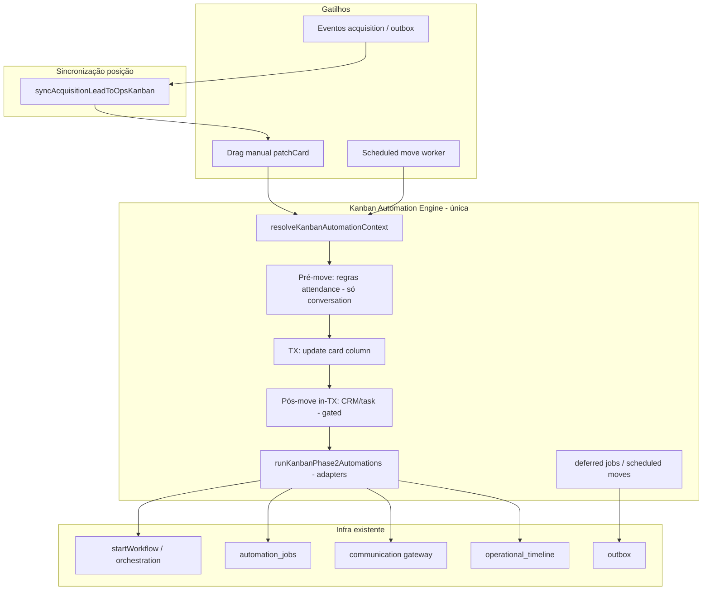
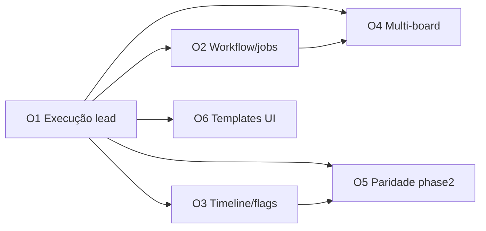

# Plano arquitetural — Ops Kanban Automation Platform

**Data:** 2026-05-28  
**Tipo:** Planejamento técnico (read-only — sem implementação)  
**Base:** [OPS_KANBAN_AND_AUTOMATIONS_AUDIT.md](./OPS_KANBAN_AND_AUTOMATIONS_AUDIT.md), [SUPER_ADMIN_OPERATIONAL_LAYER.md](./SUPER_ADMIN_OPERATIONAL_LAYER.md), [POST_ONBOARDING_ACTIVATION_AUDIT.md](../POST_ONBOARDING_ACTIVATION_AUDIT.md), auditoria de automações de coluna (lead-only vs conversation).

---

## 1. Visão e princípios

### 1.1 Objetivo final

Transformar o **Kanban Operacional do Super Admin** em uma **plataforma de automação configurável** para aquisição, onboarding, recovery e ativação — configurada **nas colunas** (mesma UI/metadata já existente), **sem hardcodes** e **sem motor paralelo**.

### 1.2 Princípios de design

| Princípio | Implicação |
|-----------|------------|
| **Uma engine** | Um pipeline de “entrar na coluna” + “pós-move” + phase2; não `phase2-tenant` vs `phase2-ops` |
| **Reuso máximo** | `kanban_phase2` em `metadata`, `runKanbanPhase2Automations`, outbox, workflow runtime, communication gateway, `automation_jobs`, timeline ops |
| **Subject explícito** | Automação opera sobre um **alvo** (conversa ou acquisition lead), não apenas `conversation_id` |
| **Gating por capacidade** | Ações que exigem chat/atendimento só rodam quando `conversationId` existe |
| **Ops tenant isolado** | `SUPERADMIN_OPS_KANBAN_TENANT_ID` — sem impacto em kanbans de clientes |
| **Idempotência e anti-loop** | Toda ação com `idempotencyKey`; movimentos automáticos com profundidade/cooldown |

### 1.3 O que já funciona (contexto validado)

- Cards de acquisition entram e movem no board **Aquisição** via eventos + `syncAcquisitionLeadToOpsKanban`.
- Colunas **persistem** `metadata` / `automation_config` / `kanban_phase2` via `patchColumn`.
- Motor phase2 **existe e executa** para cards com `conversation_id`.
- Cards **lead-only** (`acquisition_lead_id`, `conversation_id = NULL`) são **excluídos** do pipeline em `patchCard` (`leadOnlyCard`).
- Exceção hardcoded: coluna **Checkout abandonado** → `runOpsCheckoutAbandonedAutomation`.

---

## 2. Reutilização do Phase2

### 2.1 Pergunta: o motor phase2 pode ser adaptado para acquisition leads?

**Resposta: sim, com adaptação estrutural — não é só trocar um ID.**

O **formato de configuração** (`kanban_phase2` em `metadata`) é **reutilizável 100%** para ops: a UI do Super Admin já grava a mesma estrutura que tenants usam.

O **runtime de execução** é **fortemente acoplado a conversa** em várias camadas:

| Camada | Acoplamento a `conversation_id` | Adaptável para lead? |
|--------|----------------------------------|----------------------|
| **Persistência coluna** | Nenhum | Sim |
| **`patchCard` gating** | `leadOnlyCard` pula pipeline inteiro | Remover/rotear (planejamento) |
| **`kanbanInternalCardColumnPipeline`** | `conversationId` obrigatório no input | Generalizar subject |
| **`KanbanPhase2AutomationContext`** | `conversationId: string` obrigatório | Evoluir para subject union |
| **Regras de coluna (attendance/org)** | `applyKanbanColumnEnterRules` → chat | Não aplicável a lead-only; **skip** |
| **CRM in-transaction** | `ensure_client`, `link_lead`, `crm_stage_sync` | Parcial; lead já *é* o CRM de aquisição |
| **Tarefas** | `conversation_id` em tasks | Adaptar: task ligada a `acquisition_lead_id` ou tenant ops |
| **Notificações operator/team** | Notificação de “conversa entrou na coluna” | Adaptar copy + destinatários (super admin / owner lead) |
| **Auto mensagem texto** | `sendKanbanAutomationOutboundText` → conversa | **Novo adapter:** `sendMessage` via gateway usando `lead.phone` |
| **WhatsApp model sequence** | `sendWhatsappModelSequence` → conversa | Adapter: envio transacional por telefone do lead |
| **Webhook payload** | Inclui `conversation_id` | Incluir `acquisition_lead_id` no payload |
| **Audit** | `chat_conversation_assignment_history` | Ops: timeline em card + opcional tabela audit ops |
| **Scheduled move** | `chat_kanban_scheduled_moves` + `conversation_id` | Generalizar para `card_id` + subject opcional |
| **Entry automation** | `applyKanbanAutomationForConversation` | Não aplicável (cria card por conversa) |

### 2.2 Conclusão Phase2

- **Config:** reutilizar `kanban_phase2` + `automation_config` sem novo schema de coluna no MVP.
- **Execução:** extrair **núcleo** (`parseKanbanPhase2` + `runKanbanPhase2Automations`) para operar sobre um **AutomationSubject** resolvido, com **adapters** por tipo de ação e por subject.

Não duplicar `superadminOpsColumnAutomationService` por ação — mantê-lo apenas como **facade fina** ou deprecar após migração de “Checkout abandonado” para config de coluna.

---

## 3. Contexto de execução

### 3.1 Estado atual: `KanbanPhase2AutomationContext`

```typescript
// Conceitual — estado atual
{
  tenantId, actorUserId, boardId, boardName, columnId, columnName, cardId,
  conversationId: string,  // obrigatório
  conversationDisplayName, conversationClientId, conversationLeadId,
  assignedToUserId, assignedTeamId, queueId, attendanceStatus,
  columnMetadata,
}
```

Construído em `applyKanbanDestColumnEnterSideEffectsBeforeCardUpdate` apenas com `conversationId`.

### 3.2 Evolução recomendada

**Opção A (recomendada): Subject union + contexto enriquecido**

```typescript
type KanbanAutomationSubject =
  | { kind: 'conversation'; conversationId: string }
  | { kind: 'acquisition_lead'; acquisitionLeadId: string };

type KanbanAutomationContext = {
  tenantId: string;
  actorUserId: string;
  boardId: string;
  boardName: string | null;
  columnId: string;
  columnName: string;
  cardId: string;
  subject: KanbanAutomationSubject;
  columnMetadata: unknown;
  // Campos opcionais resolvidos por loader
  conversation?: ConversationSnapshot | null;
  acquisitionLead?: AcquisitionLeadSnapshot | null;
  correlationId: string;
};
```

**Por que não só `conversationId?` + `acquisitionLeadId?` opcionais?**

- Evita estados inválidos (ambos null, ambos preenchidos sem regra).
- Facilita `switch (subject.kind)` em adapters.
- Loaders explícitos: `resolveConversationSnapshot` / `resolveAcquisitionLeadSnapshot`.

**Opção B (menor diff, mais débito):** manter `KanbanPhase2AutomationContext` e adicionar campos opcionais + asserts. Funciona para MVP, mas propaga `if (!conversationId)` por todo o arquivo (~2400 linhas).

**Recomendação:** Opção A em **duas etapas** — (1) adicionar `subject` paralelo ao contexto legado; (2) migrar callers e remover `conversationId` obrigatório.

### 3.3 Resolver de contexto (novo componente planejado)

`resolveKanbanAutomationContext({ tenantId, card, destColumn, actorUserId, correlationId })`

- Se `card.conversation_id` → subject conversation + enrich via `loadEnrichedKanbanCard`.
- Se `card.acquisition_lead_id` && ops tenant → subject lead + load `acquisition_leads` + metadata do card.
- Falha clara se nenhum subject.

### 3.4 Ponto de entrada unificado (substituir short-circuit)

Em `patchCard` (e `kanbanScheduledMoveService`):

```
columnChanged →
  ctx = resolveKanbanAutomationContext(...)
  if subject.kind === 'conversation' → pipeline atual (attendance, CRM, etc.)
  if subject.kind === 'acquisition_lead' && tenantId === OPS → pipeline ops (subset + phase2)
  runKanbanColumnAutomations(ctx)  // unificado
```

Remover bloco especial único de Checkout abandonado **após** ação equivalente existir em `kanban_phase2` + registry de workflow por coluna.

---

## 4. Arquitetura recomendada (definitiva)

### 4.1 Diagrama lógico



### 4.2 Módulos (planejados — não implementados)

| Módulo | Responsabilidade |
|--------|------------------|
| `kanbanAutomationContext.ts` | Subject union, resolvers, enrich |
| `kanbanColumnAutomationEngine.ts` | Orquestra pré/TX/pós/phase2 (extrai de controller + internal pipeline) |
| `kanbanAutomationAdapters/` | `conversation/*`, `acquisitionLead/*`, `shared/*` |
| `kanbanAutomationActions.ts` | Registry: `send_message`, `start_workflow`, `schedule_job`, `move_card`, … |
| `opsKanbanAutomationPolicy.ts` | Limites ops: max chain depth, forbidden targets, rate limits |

**Deprecação planejada:** lógica ad-hoc em `superadminOpsColumnAutomationService` → ações registradas no engine.

### 4.3 O que NÃO criar

- Novo board engine ou tabelas `ops_automations_*` no MVP.
- Duplicar UI de configuração — reutilizar editor phase2 do kanban.
- Motor só outbox para ops (eventos continuam **movendo** card; automações disparam no **enter column**).

---

## 5. Automações suportadas — classificação

Legenda: **MVP** = primeiro valor configurável sem hardcode; **F2** = expansão natural; **F3** = avançado / risco alto.

| Ação | Descrição | Reuso | Fase | Notas |
|------|-----------|-------|------|-------|
| **Enviar mensagem (texto livre)** | `auto_message_text` phase2 | `sendMessage` / gateway | **MVP** | Lead: `lead.phone`; sem conversa |
| **Enviar modelo WhatsApp** | `whatsapp_model` phase2 | `sendWhatsappModelSequence` adaptado | **F2** | Template tenant vs template ops a definir |
| **Webhook outbound** | phase2 webhook | HTTP existente | **F2** | Payload estendido com lead |
| **Notificar operador/equipe** | phase2 notify | `createNotification` | **F2** | Destinatários = super admins |
| **Iniciar workflow** | Novo bloco em metadata ou convenção | `startWorkflow` | **MVP** | `workflow_key` + payload lead; substitui checkout hardcoded |
| **Agendar automation job** | Novo bloco | `scheduleAutomationJob` | **F2** | Delays, recovery cooldown |
| **Mover para coluna** | `auto_move_by_time` | `kanbanScheduledMoveService` | **F2** | Generalizar lead-only |
| **Mover para outro board** | `auto_move_by_time.to_board_id` | Mesmo serviço | **F3** | Card único: UPDATE `board_id` |
| **Criar tarefa** | phase2 productivity | `runKanbanTaskAutomation` | **F2** | Vincular a lead/tenant ops |
| **Alterar score** | Novo | `refreshActivationScoreForLead` | **F3** | Regra explícita anti-spam |
| **Adicionar tag** | metadata lead / card | `mergeAcquisitionLeadMetadata` | **F2** | `operational_tags` |
| **CRM ensure client / link lead** | phase2 crm | Pipeline TX | **F3** | Só quando existir conversa ou pós-conversão |
| **Sync estágio funil** | phase2 crm | CRM | **F3** | Ops board sem funil na maioria |
| **Criar proposta automática** | proposals | auto proposal | **F3** | Conversation-only hoje |

### 5.1 MVP mínimo (recomendação de produto)

1. Entrar na coluna (drag ou sync que muda coluna) dispara automações para **lead cards**.
2. **Mensagem** configurável na coluna (texto livre; variáveis `{{contact_name}}`, `{{email}}`, etc. via contexto lead).
3. **Workflow** configurável por coluna (chave + idempotência por lead+column).
4. **Timeline** registra tentativa, sucesso, falha, shadow.
5. Remover dependência do hardcode **Checkout abandonado** (migrar para config).

---

## 6. Multi-board

### 6.1 Cenários

| Transição | Comportamento desejado |
|-----------|------------------------|
| Aquisição → Recovery | Mesmo lead, coluna de recovery |
| Aquisição → Onboarding | Lead convertido / em onboarding |
| Recovery → Reativação | Campanha de retorno |

### 6.2 Problema: duplicação de cards

Hoje: **um card por `acquisition_lead_id`** no tenant ops (UNIQUE implícito via sync). Não criar segundo card ao mudar de board.

### 6.3 Estratégia recomendada: **card canônico único**

- **Um** `chat_kanban_cards` por `acquisition_lead_id` (tenant ops).
- “Mover para outro board” = `UPDATE board_id, column_id` (mesmo `card.id`).
- Metadata do card mantém `operational_timeline` contínua.
- Automação `auto_move_by_time` com `to_board_id` já existe no schema phase2 — validar destino no **mesmo tenant ops**.

### 6.4 Sync por estágio vs board

| Abordagem | Prós | Contras |
|-----------|------|---------|
| **A) Um board Aquisição só** | Simples; já implementado | Recovery/Onboarding só como colunas |
| **B) Multi-board, card único** | Alinha seeds (5 boards) | Exige regras de roteamento estágio→board |
| **C) Multi-card por board** | — | Duplicação, timeline fragmentada — **não recomendado** |

**Recomendação:** **B** em Fase 2 — `STAGE_TO_BOARD` opcional além de `STAGE_TO_COLUMN`; sync atualiza board+coluna.

### 6.5 Mapeamento planejado (ilustrativo)

| `current_stage` / evento | Board | Coluna |
|------------------------|-------|--------|
| checkout_abandoned | Aquisição | Checkout abandonado |
| (recovery job) | Recovery | Novo caso |
| onboarding_* | Onboarding | Em progresso |
| converted | Aquisição ou Onboarding | Ativado |

---

## 7. Timeline operacional

### 7.1 Armazenamento atual

- `chat_kanban_cards.metadata.operational_timeline[]`
- `appendOperationalTimelineByCardId` / `appendOperationalTimelineForLead`

### 7.2 Eventos a padronizar (extensão planejada)

| `type` | Quando |
|--------|--------|
| `column_automation_started` | Antes de executar ações da coluna |
| `column_automation_completed` | Sucesso agregado |
| `column_automation_failed` | Falha com `error_code` |
| `message_sent` / `message_skipped` | Gateway |
| `workflow_started` | `startWorkflow` retorno |
| `job_scheduled` | `automation_jobs` |
| `auto_move_scheduled` | scheduled move criado |
| `auto_move_executed` | worker moveu |
| `tag_added` | metadata lead |

Cada entrada: `correlation_id`, `column_id`, `automation_key`, `shadow: boolean`, `duration_ms` (opcional).

### 7.3 Relação com audit conversation

- Tenant CRM: manter `chat_conversation_assignment_history` para conversas.
- Ops: **timeline no card é source of truth** para UI Super Admin; evitar duplicar em duas estruturas no MVP.

---

## 8. Feature flags

### 8.1 Obrigatórias para execução real (produção)

| Flag | Namespace | Motivo |
|------|-----------|--------|
| `outbox.write_v1` | outbox | Eventos movimentam card de forma confiável |
| `outbox.publisher_worker_v1` | outbox | Consumers rodam |
| `outbox.passive_consumers_v1` | outbox | Handlers ops + bridge |
| `workflow.orchestration_v1` | workflow | Workflows configuráveis |
| `workflow.runtime_v1` | workflow | Execução não skipped |
| `communication.gateway_v1` + bridge | communication | Mensagens reais |
| **`ops.kanban.column_automation_v1`** *(nova — planejada)* | ops | Kill switch dedicado ops automations |

### 8.2 Opcionais (rollout gradual)

| Flag | Uso |
|------|-----|
| `acquisition.activation_tracking_v1` | Score/tags automáticos |
| `acquisition.recovery_v1` | Jobs recovery |
| `acquisition.onboarding_kickoff_v1` | Kickoff |
| `workflow.bridge_v1` | Bridge outbox→workflow |
| `workflow.saga_foundation_v1` | Sagas |

### 8.3 Futuro

| Flag | Uso |
|------|-----|
| `ops.kanban.multi_board_routing_v1` | STAGE_TO_BOARD |
| `ops.kanban.admin_editable_templates_v1` | Templates por coluna referenciando biblioteca |
| Shadow flags OFF globalmente | `workflow.shadow_execution_v1` desligado em prod |

### 8.4 Estratégia de ativação

1. **Staging:** todas ON, `shadow_mode` false para ops tenant apenas.
2. **Prod:** `ops.kanban.column_automation_v1` ON → mensagem + workflow em 1–2 colunas piloto.
3. Expandir colunas e desligar hardcode checkout.

---

## 9. Riscos

| Risco | Severidade | Mitigação planejada |
|-------|------------|---------------------|
| **Loop movimento** (coluna A→B→A via auto_move) | Alta | Max hops por `correlation_id`; grafo de colunas proibidas; cooldown por card |
| **Duplicação evento** (outbox + sync direto) | Média | Idempotency keys; consumer dedupe já existe |
| **Mensagem duplicada** | Alta | Idempotency `ops-col:${leadId}:${columnId}:${action}` |
| **WhatsApp sem opt-in** | Alta | Política recovery; rate limit; flag kill |
| **Executar automação tenant em card ops por bug** | Alta | Assert `tenantId === SUPERADMIN_OPS_KANBAN_TENANT_ID` |
| **Regressão kanban tenant** | Alta | Testes contract conversation-only; feature flag ops |
| **Shadow acreditado como “funcionando”** | Média | Timeline marca `shadow: true`; dashboard ops |
| **Conversation actions em lead** | Média | Capability matrix por `subject.kind` |
| **Performance patchCard** | Média | Phase2 async pós-commit (padrão atual); limitar ações síncronas |
| **Coluna “Iniciou cadastro” sem sync** | Baixa | Completar `STAGE_TO_COLUMN` (débito atual) |

---

## 10. Roadmap por sprints

Estimativa relativa: **P** (pequeno), **M** (médio), **G** (grande).

### Sprint O1 — Desbloquear execução lead-only (MVP técnico)

| Item | Detalhe |
|------|---------|
| **Objetivo** | Lead card executa automações ao entrar na coluna (sem hardcode único) |
| **Entregas** | `KanbanAutomationSubject`; remover short-circuit `leadOnlyCard` para ops; resolver contexto lead; rodar `runKanbanPhase2Automations` com adapter mensagem texto via gateway |
| **Impacto** | Super Admin vê efeito ao configurar mensagem na coluna |
| **Risco** | Regressão conversation — mitigar com testes |
| **Dependências** | Nenhuma migration |
| **Estimativa** | **M** |

### Sprint O2 — Workflow e jobs por coluna

| Item | Detalhe |
|------|---------|
| **Objetivo** | Configurar `workflow_key` na coluna; agendar job com delay |
| **Entregas** | Extensão metadata (ex.: `kanban_phase2.ops_actions[]`); registry de ações; migrar checkout abandonado |
| **Impacto** | Recovery/onboarding sem código novo por coluna |
| **Risco** | Explosão de combinações — validar schema |
| **Dependências** | O1 |
| **Estimativa** | **M** |

### Sprint O3 — Timeline, observabilidade e flags produção

| Item | Detalhe |
|------|---------|
| **Objetivo** | Operador vê o que executou/falhou; shadow visível |
| **Entregas** | Tipos timeline padronizados; UI card timeline; runbook flags staging→prod |
| **Impacto** | Confiança operacional |
| **Risco** | Baixo |
| **Dependências** | O1 |
| **Estimativa** | **P–M** |

### Sprint O4 — Multi-board e scheduled moves para leads

| Item | Detalhe |
|------|---------|
| **Objetivo** | Aquisição→Recovery sem duplicar card |
| **Entregas** | `STAGE_TO_BOARD`; `auto_move_by_time` com lead; worker sem `conversation_id` |
| **Impacto** | Pipelines separados visualmente |
| **Risco** | Médio — loops |
| **Dependências** | O1, O2 |
| **Estimativa** | **G** |

### Sprint O5 — Notificações, webhooks, tarefas, tags

| Item | Detalhe |
|------|---------|
| **Objetivo** | Paridade phase2 tenant onde fizer sentido |
| **Entregas** | Adapters notify/webhook/task/tag para subject lead |
| **Impacto** | Plataforma completa |
| **Risco** | Médio |
| **Dependências** | O1–O3 |
| **Estimativa** | **G** |

### Sprint O6 — Templates admin e biblioteca mensagens

| Item | Detalhe |
|------|---------|
| **Objetivo** | Editar textos sem deploy; referência a templates |
| **Entregas** | Resolver `template_key` por coluna; UI seleção template; variáveis lead |
| **Impacto** | “Configurável” de verdade |
| **Risco** | Escopo produto |
| **Dependências** | O1, gateway real |
| **Estimativa** | **M** |

### Diagrama de dependências



---

## 11. Menor caminho (recomendação final)

### 11.1 Resposta direta

O **menor caminho** para o Super Admin configurar automações de aquisição **pelas colunas**, sem novo sistema:

1. **Manter** UI e persistência atuais (`patchColumn` + `kanban_phase2`).
2. **Eliminar** o bloqueio `leadOnlyCard` **apenas** quando `tenantId === SUPERADMIN_OPS_KANBAN_TENANT_ID`.
3. **Introduzir** `KanbanAutomationSubject` + loader de lead (nome, email, phone, stage, score).
4. **Reutilizar** `runKanbanPhase2Automations` com **um adapter de mensagem** que chama `channelProviderGateway.sendMessage` usando `lead.phone` (em vez de `sendKanbanAutomationOutboundText`).
5. **Adicionar** bloco mínimo em metadata para `workflow_key` na coluna (ou convenção em `kanban_phase2` estendido) chamando `startWorkflow` — substitui `runOpsCheckoutAbandonedAutomation`.
6. **Registrar** tudo em `operational_timeline` com `shadow` explícito até flags de produção.
7. **Ativar** flags em staging: `ops.kanban.column_automation_v1` + communication + workflow.

Isso **não** exige novo motor, nova tabela de colunas, nem UI nova no MVP — apenas **destravar o pipeline existente** e **desacoplar** envio de mensagem de `conversation_id`.

### 11.2 O que adiar

- Multi-board (O4) até card único mover entre boards com segurança.
- Paridade total CRM/tarefas/propostas (conversation-only).
- Novo catálogo de eventos além dos já publicados.

### 11.3 Critério de sucesso do MVP

- Coluna **Checkout abandonado** configurada só via UI (sem hardcode).
- Mensagem de recovery editável na coluna (texto livre).
- Timeline mostra execução ao mover lead manualmente ou por evento.
- Zero regressão em kanban de tenant com conversa.

---

## 12. Referências

| Documento / código | Uso |
|-------------------|-----|
| [OPS_KANBAN_AND_AUTOMATIONS_AUDIT.md](./OPS_KANBAN_AND_AUTOMATIONS_AUDIT.md) | Estado atual |
| [SUPER_ADMIN_OPERATIONAL_LAYER.md](./SUPER_ADMIN_OPERATIONAL_LAYER.md) | Visão operacional |
| `chatKanbanController.ts` | `leadOnlyCard`, `patchCard` |
| `kanbanInternalCardColumnPipeline.ts` | Pré/pós move |
| `kanbanColumnAutomationService.ts` | Phase2 + `runKanbanPhase2Automations` |
| `superadminOpsColumnAutomationService.ts` | Hardcode checkout |
| `superadminOpsKanbanLeadService.ts` | Sync posição |
| `utils/kanbanPhase2.ts` | Schema config |

---

**Nenhuma implementação, migration ou patch foi realizada neste documento.**
