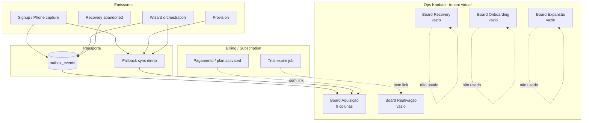
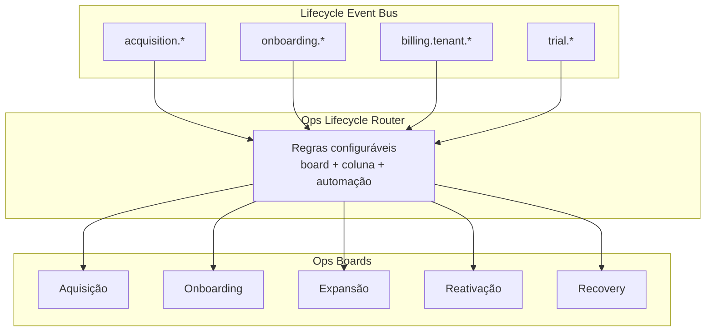

# Ops Kanban — Lifecycle Architecture Evolution Plan

**Data:** 2026-06-03  
**Tipo:** Auditoria enterprise read-only (sem alteração de código, migrations, dados ou automações)  
**Objetivo:** Mapear o estado real do ciclo de vida operacional e recomendar evolução antes dos sprints G–J.

**Documentos relacionados:** [OPS_KANBAN_AND_AUTOMATIONS_AUDIT.md](./OPS_KANBAN_AND_AUTOMATIONS_AUDIT.md), [OPS_KANBAN_AUTOMATION_PLATFORM_PLAN.md](./OPS_KANBAN_AUTOMATION_PLATFORM_PLAN.md), [SUPER_ADMIN_OPERATIONAL_LAYER.md](./SUPER_ADMIN_OPERATIONAL_LAYER.md)

---

## 1. Estado atual (resumo executivo)

| Dimensão | Realidade hoje |
|----------|----------------|
| **Boards** | 5 boards seedados (Aquisição, Recovery, Onboarding, Expansão, Reativação) + possíveis boards manuais extras (ex.: `teste` em dev) |
| **Cards automáticos** | **Somente no board Aquisição**, 1 card por `acquisition_lead_id` |
| **Movimentação** | **Apenas entre colunas** do mesmo board (`UPDATE column_id`); **não há** promoção automática entre boards |
| **Identidade do card** | **Modelo híbrido:** entidade primária = **lead de aquisição**; após provision, `acquisition_leads.tenant_id` vincula o tenant; card **não** referencia `subscription_id` nem `customer_id` |
| **Billing → Kanban** | **Sem integração** — pagamento, trial expirado, cancelamento e upgrade **não** alteram card nem board |
| **Outbox** | Catálogo P0 com 20 chaves; **apenas 5 eventos** publicados em produção (`acquisition.*` ×4 + `ticket.created`); em dev auditado: **`outbox_events` = 0** → sync via **fallback síncrono** |
| **Automações de coluna** | Phase2 **desligado** para cards lead-only; única automação ops com efeito = **Checkout abandonado** (hardcoded) |
| **Dúvida do produto** | Trial e pagamento **permanecem em Aquisição** porque o desenho atual **intencionalmente** concentra o pipeline num único board |

---

## 2. Mapa de eventos (Etapa 1)

### 2.1 Legenda

- **Outbox** = linha em `outbox_events` + worker + passive consumers  
- **Direto** = `startWorkflow`, `syncAcquisitionLeadToOpsKanban`, activation DB, notificações plataforma (fora do catálogo outbox)

### 2.2 Catálogo outbox (`domainEventKeys.ts`)

| Evento | Publicado hoje? | Origem principal | Payload (resumo) | Consumidores |
|--------|-----------------|------------------|------------------|--------------|
| `acquisition.lead.created` | Sim | `signupOrchestrationService`, `acquisitionPhoneCaptureService`, `acquisitionContactIntelligenceService` | lead snapshot + `acquisition_lead_id` | `ops.kanban.acquisition.lead.created`; fallback sync |
| `acquisition.signup.started` | Sim | `signupOrchestrationService` (`step`: contact/plan/checkout) | lead + `step` | `ops.kanban.acquisition.signup.started`; `workflow.bridge.acquisition.signup.started`; **também** `startWorkflow` direto (duplicidade) |
| `acquisition.stage.changed` | Sim | signup, trial, provision, activation prepare, recovery, wizard orchestration | lead + `previous_stage` | `ops.kanban.acquisition.stage.changed`; fallback sync |
| `acquisition.checkout.abandoned` | Sim | `acquisitionRecoveryService` | lead snapshot | `ops.kanban.*` + `runOpsCheckoutAbandonedAutomation`; workflow bridge |
| `ticket.created` | Sim | `platformSupportRepository` | `ticket_id`, subject, category | shadow log; `support.ticket.created` → workflow bridge |
| `signup.completed` | **Não** | — | — | shadow log; bridge se publicado |
| `onboarding.signup.started` | **Não** | — | — | workflow passive (shadow) |
| `onboarding.trial.started` | **Não** | trial usa só como `triggerEventKey` em `startWorkflow` | — | workflow passive (shadow) |
| `acquisition.trial.recovery` | **Não** | recovery usa `startWorkflow` com esta key | — | bridge mapeado, sem publisher |
| `onboarding.kickoff` | **Não** | `onboardingKickoffService` → `startWorkflow` | — | bridge se publicado |
| `onboarding.first_access` | **Não** | `onboardingKickoffService` | — | bridge se publicado |
| `invoice.created` | **Não** | motor tenant usa nome parecido, **não** outbox | — | shadow + `billing.invoice.created` passive |
| `billing.invoice.created` | **Não** | alias | — | idem |
| `support.ticket.created` | **Não** | alias de ticket | — | mesmo handler que `ticket.created` |
| `workflow.started` | **Não** | — | — | shadow log |
| `communication.message.sent` | **Não** | tipos em webhooks | — | shadow log |
| `communication.message.received` | **Não** | — | — | workflow passive |
| `communication.message.delivered` | **Não** | — | — | *(sem consumer)* |
| `communication.message.read` | **Não** | — | — | *(sem consumer)* |
| `communication.message.failed` | **Não** | — | — | workflow passive |

### 2.3 Eventos wizard (fora do catálogo outbox)

| Evento | Origem | Efeitos colaterais | Kanban |
|--------|--------|-------------------|--------|
| `onboarding.company.completed` | `acquisitionOnboardingWizardService` → `emitOnboardingWizardEvent` | stage → `onboarding_in_progress`; `acquisition.stage.changed`; activation `signup_started`; `startWorkflow` | override coluna **Onboarding incompleto** |
| `onboarding.users.completed` | idem | stage → `onboarding_active`; activation `first_team_member` | override **Trial iniciado** *(sobrescreve mapa `onboarding_active` → Onboarding incompleto)* |
| `whatsapp.connected` | idem | stage → `converted`; activation `first_message` | override **Ativado** |

### 2.4 Activation tracking (`acquisition_activation_events`)

| `eventType` | Origem típica | Consumer Kanban |
|-----------|---------------|-----------------|
| `signup_started` | wizard company | Não (só score/relatórios) |
| `checkout_started` | signup/checkout | Não |
| `checkout_completed` | *(reservado)* | Não |
| `trial_started` | trial orchestration | Não direto; stage → coluna via `stage.changed` |
| `first_login` | kickoff | Não |
| `first_message` | whatsapp connected | Não |
| `first_team_member` | users step | Não |
| `onboarding_completed` | score service | Não |

### 2.5 Notificações plataforma (paralelo — não alimenta Ops Kanban)

| Evento negócio | Origem | Kanban |
|----------------|--------|--------|
| `platform.account.created` | `completeWizardCompanyStep` | Não |
| `platform.trial.started` | idem (P0-F.1) | Não |
| `platform.trial.ended` | `expireTrialsPastDue` / subscription | Não |
| `platform.plan.activated` | `subscriptionService` pós-pagamento | Não |
| `platform.billing.*` | billing gateway / recurring | Não |

### 2.6 Eventos esperados pelo briefing — status

| Evento esperado | Existe? | Observação |
|-----------------|---------|------------|
| `lead_created` | Como `acquisition.lead.created` | OK |
| `contact_captured` | Implícito em stage `contact_captured` | Sem evento dedicado |
| `plan_selected` | Stage + signup step `plan` | OK |
| `trial_started` | Stage `trial_started` + activation `trial_started` | OK; coluna **Trial iniciado** |
| `onboarding_started` | `onboarding.kickoff` workflow, stage `onboarding_kickoff` | Parcial |
| `onboarding_completed` | Flag `tenants.onboarding_completed` + activation type | **Sem** evento outbox nem sync Kanban |
| `payment_confirmed` | `platform.billing.payment_confirmed` (plataforma) | **Sem** vínculo acquisition lead / ops card |
| `subscription_activated` | `platform.plan.activated` | **Sem** Kanban |
| `subscription_cancelled` | Lógica subscription/billing | **Sem** Kanban |
| `trial_expired` | Job `expireTrialsPastDue` → `suspension_reason=trial_expired` | **Sem** Kanban |
| `reactivation_started` | Metadata `reactivated_trial` no provision | **Sem** evento nem board Reativação |

### 2.7 Eventos mortos / duplicados (riscos)

1. **16 chaves de catálogo sem publisher** — consumers e bridge prontos, pipeline “fantasma”.  
2. **`acquisition.signup.started`** — publicado no outbox **e** `startWorkflow` imediato (risco de execução dupla quando worker ativo).  
3. **`onboarding.trial.started` vs `acquisition.trial.recovery`** — chaves cruzadas no trial flow.  
4. **Wizard events** — não estão no catálogo; dependem de `stage.changed` + sync direto.  
5. **Dev: outbox vazio** — todo o comportamento observado vem de **fallback** em `acquisitionOutbox.ts` e chamadas diretas a `syncAcquisitionLeadToOpsKanban`.

---

## 3. Ops Kanban real por board (Etapa 2)

**Tenant virtual:** `1f1a0f0a-0000-4000-8000-000000000001`  
**Seed:** `superadminOpsKanbanSeedService.ts` — não está em SQL `259` (só cria tenant ops).

### 3.1 Aquisição

**Colunas (9):** Novo lead → Qualificado → Iniciou cadastro → Checkout → Checkout abandonado → Trial iniciado → Onboarding incompleto → Ativado → Perdido

| Aspecto | Detalhe |
|---------|---------|
| **Cria cards?** | Sim — único board com sync automático |
| **Eventos que criam** | `acquisition.lead.created`, primeiro sync em qualquer `stage.changed` / fallback |
| **Eventos que movem** | `signup.started` (por step), `stage.changed`, overrides wizard, provision direto |
| **Automações** | `runOpsCheckoutAbandonedAutomation` na coluna Checkout abandonado; foundation log em drag manual |
| **Gaps** | Coluna **Iniciou cadastro** sem mapa; **Perdido** sem mapa de stage |

### 3.2 Recovery

| Pergunta | Resposta |
|----------|----------|
| Recebe cards? | **Não** automaticamente |
| Eventos? | Nome usado em job `ops:checkout_abandoned_recovery`, mas card permanece em **Aquisição** |
| Cards ativos? | **0** no ambiente auditado (exceto boards manuais) |
| Fluxo ativo? | Automação de **recuperação de checkout** sim; board Recovery **não** |

### 3.3 Onboarding

| Pergunta | Resposta |
|----------|----------|
| Recebe cards? | **Não** |
| Eventos que alimentariam? | Nenhum implementado; wizard usa colunas **no board Aquisição** (Onboarding incompleto / Trial iniciado) |
| Cards ativos? | **0** no board Onboarding |

### 3.4 Expansão

| Pergunta | Resposta |
|----------|----------|
| Recebe cards? | **Não** |
| Integração billing/upsell? | **Não** |
| Utilizado por fluxo? | **Não** — estrutura UI/seed apenas |

### 3.5 Reativação

| Pergunta | Resposta |
|----------|----------|
| Trial expirado? | **Não** — job suspende tenant, sem sync |
| Cancelamentos? | **Não** |
| Clientes suspensos? | **Não** |
| Cards? | **0** |

---

## 4. Identidade do card (Etapa 3)

### 4.1 Resposta: **D) Modelo híbrido**

| Fase lifecycle | O card representa | Identificadores |
|----------------|-------------------|-----------------|
| Pré-provision | **Lead** (`acquisition_lead_id`) | `metadata.entity_type = acquisition_lead` |
| Pós-provision | **Lead + tenant** (lead row ganha `tenant_id`) | Card **não** duplica; mesmo `acquisition_lead_id` |
| Pós-conversão WhatsApp | Lead em stage `converted` | Coluna **Ativado**; tenant pode estar `trial` ou `active` |
| Billing maduro | Card **ainda** é o lead | **Sem** `subscription_id` no card |

**Constraint DB (260):** um card ativo por `(board_id, acquisition_lead_id)`; `conversation_id` XOR `acquisition_lead_id`.

### 4.2 Transição lead → tenant

1. `provisionWorkspaceFromSession` cria tenant e seta `acquisition_leads.tenant_id`.  
2. Mesmo card em Aquisição é atualizado (coluna/metadata), não recriado em outro board.  
3. `converted` / `Ativado` reflete ativação operacional (WhatsApp), **não** pagamento.

---

## 5. Movimentação entre boards (Etapa 4)

### 5.1 Hoje

| Mecanismo | Existe? |
|-----------|---------|
| Mudança automática de **board** | **Não** (ops lead cards) |
| Mudança automática de **coluna** (Aquisição) | **Sim** |
| Movimentação manual cross-board | **Não suportada** — `patchCard` exige coluna do mesmo `board_id` |

### 5.2 Matriz evento → board (implementado?)

| Evento / marco | Board origem | Board destino | Implementado? |
|----------------|--------------|---------------|---------------|
| Lead criado | — | Aquisição | **Sim** (coluna por stage) |
| Trial iniciado (stage) | Aquisição | Aquisição (col. Trial iniciado) | **Sim** |
| Onboarding empresa | Aquisição | Aquisição (Onboarding incompleto) | **Sim** |
| Onboarding concluído (wizard) | Aquisição | Onboarding board | **Não** |
| Trial convertido (pagamento) | Aquisição | Expansão / Ativo | **Não** |
| Pagamento aprovado | Aquisição | Aquisição | **Não** (card não move) |
| Trial expirado | Aquisição | Reativação | **Não** |
| Cancelamento assinatura | — | Reativação | **Não** |
| Renovação / upgrade | — | Expansão | **Não** |
| Checkout abandonado | Aquisição | Recovery | **Não** (fica em Aquisição) |
| Reativação campanha | — | Reativação | **Não** |

**Cross-board no produto tenant:** `kanban_phase2.automations.auto_move_by_time.to_board_id` existe para **conversas**, não para ops lead cards.

---

## 6. Billing e Kanban (Etapa 5)

| Marco | Evento de domínio / negócio | Consumer Ops Kanban | Sync Kanban | Automação coluna |
|-------|----------------------------|---------------------|-------------|------------------|
| **Pagamento aprovado** | `platform.billing.payment_confirmed` (plataforma); tenant billing `invoice.paid` | **Nenhum** | **Não** | **Não** |
| **Plano ativado** | `platform.plan.activated` via `subscriptionService` | **Nenhum** | **Não** | **Não** |
| **Trial expirado** | `expireTrialsPastDue` → tenant `suspended`, `trial_expired` | **Nenhum** | **Não** | **Não** |
| **Cancelamento** | subscription/billing services | **Nenhum** | **Não** | **Não** |
| **Upgrade plano** | billing recurring / plan change | **Nenhum** | **Não** | **Não** |

**Conclusão:** O Kanban operacional cobre **aquisição e ativação inicial**, não **receita nem retenção**. Por isso, após pagamento aprovado, o card **permanece** na coluna onde estava (ex.: Trial iniciado ou Ativado).

---

## 7. Automações de coluna (Etapa 6)

### 7.1 Mecanismo

| Camada | Suporte ops lead card |
|--------|----------------------|
| `metadata.automation_config` | Persistido; default **disabled** no seed |
| `kanban_phase2` (tenant) | Parseado; execução via `runKanbanPhase2Automations` |
| `patchCard` lead-only | **Pula** pipeline conversation; chama `executeOpsLeadColumnAutomationFoundation` (timeline + log, **sem** side effects reais) |
| Hardcoded | `runOpsCheckoutAbandonedAutomation` — workflow shadow, job, WhatsApp shadow |

### 7.2 Ações phase2 (tenant — referência para ops futuro)

| Ação | Requer conversa hoje | Adaptável lead? |
|------|---------------------|-----------------|
| WhatsApp texto / modelo | Sim | Sim (via `lead.phone` + gateway) |
| Webhook | Sim | Sim (payload com `acquisition_lead_id`) |
| CRM link/create client | Sim | Parcial |
| Criar tarefa | Sim | Adaptar assignee |
| Notificar operador/equipe | Sim | Adaptar destinatários super admin |
| Mover coluna/board agendado | Sim | Generalizar para `card_id` |
| Mover card (auto_move_by_time) | Sim (conversation) | Possível com extensão |

### 7.3 Automações atuais substituem lifecycle hardcoded?

**NÃO** — justificativa técnica:

1. Cards ops **não executam** phase2 real (`leadOnlyCard` + foundation mode).  
2. Mapeamento `STAGE_TO_COLUMN` está **hardcoded** em `superadminOpsKanbanLeadService.ts` e duplicado por **overrides** em `acquisitionOnboardingOrchestration.ts`.  
3. Promoção entre boards **não existe** na API ops (`patchCard` sem `board_id`).  
4. Billing/trial jobs **não emitem** eventos do catálogo acquisition/outbox.  
5. Uma automação de negócio (checkout abandonado) já prova que regras críticas estão **fora** do metadata de coluna.

**Pré-requisito para SIM:** lifecycle router + phase2 subject `acquisition_lead` + eventos billing publicados no outbox (ou router dedicado).

---

## 8. Compatibilidade com estratégia futura (Etapa 7)

### 8.1 Pipeline desejado

```
Aquisição → Onboarding → Expansão → Reativação
```

### 8.2 Avaliação

| Critério | Avaliação |
|----------|-----------|
| **Escala sem regra por campanha?** | **Não hoje** — cada marco novo exigiria código em `STAGE_TO_COLUMN` ou override wizard |
| **Dívida técnica** | Alta: 5 boards vazios, dual path outbox/fallback, eventos catálogo sem publisher, wizard fora do catálogo, billing desconectado |
| **Pontos corretos** | Tenant virtual reutilizando `chat_kanban_*`; card 1:1 lead; outbox+fallback resiliente; timeline em metadata; seed idempotente; guard dedup boards (264) |
| **Reorganizar agora** | Contrato único de **lifecycle transitions** (evento → board opcional + coluna); publicar eventos billing; habilitar outbox em staging com worker |

---

## 9. Análise de dados reais (Etapa 8)

**Fonte:** consultas read-only em ambiente local (`debugOpsKanbanPipeline.ts`, 2026-06-03).  
**Nota:** amostra de desenvolvimento; repetir SQL em produção antes de decisões de capacidade.

### 9.1 Snapshot

| Métrica | Valor observado |
|---------|-----------------|
| `outbox_events` total | **0** |
| `outbox_events` acquisition | **0** |
| Cards ops com `acquisition_lead_id` | **1** (coluna **Trial iniciado**, lead `591a0100-…`) |
| Boards ops tenant | 6 (5 canônicos + board manual **`teste`**) |
| Leads recentes (amostra 5) | Todos `current_stage = contact_captured` |
| Migration 260 | Coluna `acquisition_lead_id` presente |
| Flags acquisition/outbox | Maioria **shadow_mode: true**; `outbox.write_v1` enabled |

### 9.2 Cards por board (inferido)

| Board | Cards ativos (estimado) |
|-------|-------------------------|
| Aquisição | ≥ 1 |
| Recovery | 0 |
| Onboarding | 0 |
| Expansão | 0 |
| Reativação | 0 |
| teste (não canônico) | desconhecido |

### 9.3 Cards por coluna (Aquisição)

| Coluna | Cards |
|--------|-------|
| Trial iniciado | 1 |
| Demais | 0 (na amostra) |

### 9.4 Leads / tenants

| Métrica | Observação |
|---------|------------|
| Leads em trial (stage) | Poucos/nenhum na amostra recente; card trial pode ser lead mais antigo |
| Tenants ativos | Consultar `SELECT status, COUNT(*) FROM tenants GROUP BY status` em prod |
| Cards órfãos | Não verificado (script analytics interrompido) |
| Leads sem card | Provável para leads `contact_captured` recentes se sync só após evento completo |

### 9.5 Cards que “deveriam” estar em outro board

| Situação | Board atual | Board esperado (produto futuro) |
|----------|-------------|----------------------------------|
| Lead em **Trial iniciado** com onboarding em andamento | Aquisição | Onboarding (se política = board por fase) |
| Lead **converted** + tenant **active** (pago) | Aquisição / Ativado | Expansão |
| Tenant **suspended** trial_expired | Aquisição (inalterado) | Reativação |
| Checkout abandonado com automação recovery | Aquisição | Recovery (nome vs realidade) |

### 9.6 SQL recomendado (read-only, produção)

```sql
-- Cards por board
SELECT b.name, COUNT(c.id) AS cards
FROM chat_kanban_boards b
LEFT JOIN chat_kanban_cards c ON c.board_id = b.id AND c.archived_at IS NULL
WHERE b.tenant_id = '1f1a0f0a-0000-4000-8000-000000000001'
GROUP BY b.name ORDER BY b.name;

-- Cards por coluna (Aquisição)
SELECT col.name, COUNT(c.id) AS cards
FROM chat_kanban_columns col
JOIN chat_kanban_boards b ON b.id = col.board_id
LEFT JOIN chat_kanban_cards c ON c.column_id = col.id AND c.archived_at IS NULL
WHERE col.tenant_id = '1f1a0f0a-0000-4000-8000-000000000001' AND b.name = 'Aquisição'
GROUP BY col.name, col.position ORDER BY col.position;

-- Leads por stage
SELECT current_stage, COUNT(*) FROM acquisition_leads GROUP BY 1 ORDER BY 2 DESC;

-- Tenants por status
SELECT status, COUNT(*) FROM tenants GROUP BY 1;

-- Leads sem card
SELECT COUNT(*) FROM acquisition_leads al
WHERE NOT EXISTS (
  SELECT 1 FROM chat_kanban_cards c
  WHERE c.acquisition_lead_id = al.id AND c.archived_at IS NULL
);
```

---

## 10. Diagramas

### 10.1 Estado atual



### 10.2 Estado recomendado (alvo)



---

## 11. Arquitetura recomendada (Etapa 9)

### 11.1 Decisão: **Opção C — Modelo híbrido**

| Opção | Prós | Contras | Veredito |
|-------|------|---------|----------|
| **A — Board por etapa** | Clareza visual por fase | Exige mover `board_id`; 4 boards vazios hoje | **Alvo de médio prazo** |
| **B — Board único + colunas** | Já implementado; baixo risco | Não escala para Expansão/Reativação; mistura funções | **Manter como subcamada** dentro de Aquisição até router existir |
| **C — Híbrido** | Aquisição detalha funil; boards posteriores para pós-venda/retention; migração incremental | Exige router + promote API | **Adotar** |

**Justificativa:** O código e o seed já assumem **5 boards**, mas só **Aquisição** tem pipeline. O híbrido preserva o investimento (colunas de funil em Aquisição) e adiciona **promoção explícita** de card para Onboarding / Expansão / Reativação quando eventos de domínio (billing, trial end) forem publicados — sem hardcode por campanha.

### 11.2 Princípios de implementação (futuro — não nesta auditoria)

1. **`OpsLifecycleRouter`** — entrada única: `(eventKey, acquisitionLeadId, tenantId?)` → `{ targetBoard, targetColumn, runAutomations }`.  
2. **Substituir** `STAGE_TO_COLUMN` + overrides espalhados por tabela/config versionada.  
3. **Publicar** eventos billing/trial no outbox (ou router escuta jobs).  
4. **Promote card API** — `board_id` + `column_id` com idempotência e timeline.  
5. **Phase2 ops** — subject `acquisition_lead`; deprecar `superadminOpsColumnAutomationService` ad hoc.  
6. **Manter fallback** até outbox estável em todos os ambientes.

---

## 12. Gaps e riscos

| # | Gap / risco | Severidade |
|---|-------------|------------|
| G1 | Trial e pagamento não movem card — expectativa de produto vs implementação | Alta |
| G2 | Boards Onboarding/Expansão/Reativação/Recovery sem sync | Média |
| G3 | Billing desconectado do lifecycle ops | Alta |
| G4 | Outbox vazio em dev → só fallback testado | Média |
| G5 | Override wizard `users.completed` → Trial iniciado conflita com stage `onboarding_active` | Média |
| G6 | `converted` ≠ pagamento — coluna Ativado engana operação | Alta |
| G7 | 16 eventos catálogo sem publisher — falsa sensação de cobertura | Média |
| G8 | Board duplicado `teste` — mitigado por 264 para canônicos | Baixa |
| G9 | Automações coluna insuficientes para lifecycle | Alta |

---

## 13. Roadmap sugerido (Sprints G–J)

### Sprint G — Contrato de lifecycle e outbox confiável

| Entrega | Detalhe |
|---------|---------|
| G1 | Documentar e implementar **`OpsLifecycleRouter`** (spec + interface; ainda pode delegar a sync atual) |
| G2 | Unificar mapa coluna/stage em **config única** (remover overrides duplicados) |
| G3 | Publicadores faltantes mínimos: `billing.tenant.plan_activated`, `billing.tenant.trial_expired`, `onboarding.completed` |
| G4 | Outbox habilitado em staging + worker; métricas de fallback vs consumer |
| G5 | Corrigir semântica **Ativado** vs **Pago** (rótulos/colunas) |

**Aceite:** evento de pagamento em staging move coluna ou dispara promote (mesmo que para coluna renomeada em Aquisição).

### Sprint H — Promoção entre boards (Onboarding + Recovery)

| Entrega | Detalhe |
|---------|---------|
| H1 | API/service **`promoteOpsLeadCard(boardId, columnId)`** com RLS ops tenant |
| H2 | Após `onboarding.company.completed` ou kickoff → card **Onboarding** board |
| H3 | Checkout abandonado → opção: card **Recovery** board (config) |
| H4 | Backfill script read-only report + migrate cards por regra |

**Aceite:** card visível no board Onboarding após empresa salva; Recovery recebe abandonados.

### Sprint I — Billing → Expansão + automações phase2 ops

| Entrega | Detalhe |
|---------|---------|
| I1 | Consumer: `platform.plan.activated` / tenant paid → promote **Expansão** |
| I2 | Phase2 executável para `acquisition_lead` (WhatsApp por telefone do lead) |
| I3 | Migrar checkout abandonado para **automation_config** de coluna |
| I4 | Upgrade de plano → coluna Negociação / Expandido |

**Aceite:** pagamento aprovado altera board ou coluna sem deploy de `if` novo por campanha.

### Sprint J — Reativação + trial expirado + observabilidade

| Entrega | Detalhe |
|---------|---------|
| J1 | `expireTrialsPastDue` publica evento → **Reativação** board |
| J2 | Cancelamento subscription → Reativação ou Perdido |
| J3 | Dashboard ops: contagem por board/coluna, leads sem card, lag outbox |
| J4 | Remover boards não canônicos; documentar runbooks |

**Aceite:** tenant trial_expired gera card em Reativação; operação vê funil completo Aquisição→…→Reativação.

---

## 14. Referências de código

| Tema | Caminho |
|------|---------|
| Catálogo eventos | `packages/backend/src/outbox/domainEventKeys.ts` |
| Publicação acquisition | `packages/backend/src/acquisition/acquisitionOutbox.ts` |
| Consumers ops | `packages/backend/src/outbox/passiveConsumers/opsKanbanAcquisitionHandlers.ts` |
| Sync lead → card | `packages/backend/src/services/superadminOpsKanbanLeadService.ts` |
| Wizard + overrides | `packages/backend/src/acquisition/acquisitionOnboardingOrchestration.ts` |
| Seed boards/colunas | `packages/backend/src/services/superadminOpsKanbanSeedService.ts` |
| Automação checkout | `packages/backend/src/services/superadminOpsColumnAutomationService.ts` |
| Phase2 / automações | `packages/backend/src/services/kanbanColumnAutomationService.ts`, `kanbanAutomationContext.ts` |
| Billing trial expire | `packages/backend/src/services/subscriptionService.ts` (`expireTrialsPastDue`) |
| Schema cards lead | `database/init/260_chat_kanban_operational_lead_cards.sql` |
| Diagnóstico local | `packages/backend/src/scripts/debugOpsKanbanPipeline.ts` |

---

## 15. Conclusão para decisão de produto

1. **Hoje:** estratégia efetiva = **movimentação automática entre colunas no board Aquisição**; **não** entre boards.  
2. **Trial após início** e **pagamento após aprovação** permanecem no mesmo lugar **por ausência de integração**, não por bug isolado.  
3. **Próximos sprints** devem introduzir **router de lifecycle + promoção de board** antes de preencher automações em 4 boards vazios.  
4. **Automações de coluna atuais não substituem** lógica hardcoded — investir em phase2 ops + eventos billing é pré-requisito.  
5. **Opção C (híbrido)** alinha código existente, expectativa de negócio e escalabilidade sem regra por campanha no código-fonte.

---

*Auditoria read-only — nenhum arquivo de produção, migration ou dado foi alterado.*
