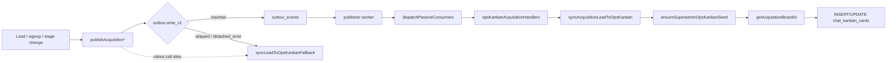

# Auditoria read-only — Ops Kanban pós Sprint O1

**Data:** 2026-06-02  
**Escopo:** Sintomas reportados após Sprint O1 (foundation de automação de coluna). **Nenhum código, dado ou migration foi alterado** nesta auditoria.  
**Evidência runtime (ambiente local Docker `painelcrm_postgres`):** consultas SQL read-only; pode divergir de produção/staging.

---

## Resumo executivo

| Sintoma | Causa raiz principal | Severidade |
|--------|----------------------|------------|
| Dropdown com boards duplicados | Corrida em `ensureSuperadminOpsKanbanSeed()` sem UNIQUE em `(tenant_id, nome)`; `listBoards` lista todos | P2 visual / P1 operacional |
| Leads não caem no Kanban | (a) Sync falhou quando tenant/board ainda não existiam; (b) Outbox vazio + fallback só em `outcome === 'skipped'`; (c) Worker/passive não reprocessa falhas passadas | P0 aquisição |
| Log `chat_kanban_boards_tenant_id_fkey` + `acquisition_board_missing` | Tenant virtual ausente **no momento do INSERT** do seed; depois `getAcquisitionBoardId()` sem board ativo | P0 |
| “Continuando de onde você parou” sem continuidade | `resume_path` / estágio do lead desalinhados de sessão (`plan_selected` sem sessão; `onboarding_in_progress` com sessão `completed`); ordem no frontend (`postSignupStep` antes do redirect) | P0 aquisição |

**Sprint O1 (3.1)** alterou automação de coluna em `chatKanbanController` / `kanbanAutomationContext` — **não** alterou seed, tenant 259, sync nem outbox. A correlação temporal com O1 é provavelmente **deploy/migrate/restart** ou **primeiro acesso concorrente** ao Ops Kanban, não a foundation em si.

---

## ETAPA 1 — Tenant virtual Ops

### 1.1 Valor de `SUPERADMIN_OPS_KANBAN_TENANT_ID`

```9:9:packages/backend/src/config/superadminOpsKanban.ts
export const SUPERADMIN_OPS_KANBAN_TENANT_ID = '1f1a0f0a-0000-4000-8000-000000000001';
```

### 1.2 Registro em `tenants` (ambiente local)

| Campo | Valor |
|-------|--------|
| `id` | `1f1a0f0a-0000-4000-8000-000000000001` |
| `name` | Super Admin Ops |
| `slug` | `superadmin-ops` |
| `status` | `active` |
| `created_at` | `2026-06-02 20:04:22 UTC` |

**Conclusão local:** tenant **existe** e está ativo.

### 1.3 Quando o tenant **não** existe (cenário dos logs do usuário)

| Mecanismo | Arquivo / comportamento |
|-----------|-------------------------|
| Migration | `database/init/259_superadmin_ops_tenant_p0.sql` — INSERT idempotente; **falha** se não houver plano ativo em `plans` |
| Registro em migrate | `packages/backend/src/migrate.ts` inclui `259_superadmin_ops_tenant_p0.sql` |
| Bootstrap HTTP | **Não** cria tenant; apenas `ensureSuperadminOpsKanbanSeed()` assume tenant já presente |

Se `259` não rodou (DB antigo sem arquivo, migrate parcial, ou `plans` vazio na primeira execução), o seed tenta:

```184:196:packages/backend/src/services/superadminOpsKanbanSeedService.ts
        await client.query(
          `INSERT INTO chat_kanban_boards (
             id, tenant_id, name, ...
           ) VALUES ($1, $2, $3, ...`,
          [boardId, SUPERADMIN_OPS_KANBAN_TENANT_ID, ...],
```

→ **FK `chat_kanban_boards_tenant_id_fkey`** com `reason` derivado de falha de seed / sync (`acquisition_board_missing` quando `getAcquisitionBoardId()` retorna null).

**Remoção:** não há código que delete o tenant ops; causas plausíveis: restore de backup sem 259, DB novo sem migrate completo, ou tenant nunca criado por exceção em 259.

### 1.4 Referências no código (amostra representativa)

| Área | Uso |
|------|-----|
| `middleware/superadminOpsTenant.ts` | Injeta `req.tenantId` nas rotas `/api/superadmin/ops/kanban/*` |
| `superadminOpsKanbanSeedService.ts` | Seed + `getAcquisitionBoardId()` |
| `superadminOpsKanbanLeadService.ts` | Sync de cards |
| `outbox/passiveConsumers/opsKanbanAcquisitionHandlers.ts` | Consumers outbox → sync |
| `chatKanbanController.ts` | Automação foundation só se `tenantId === OPS` |
| Scripts | `debugOpsKanbanPipeline.ts`, `testOpsKanbanSync.ts` |

---

## ETAPA 2 — Seed `ensureSuperadminOpsKanbanSeed()`

### 2.1 O seed executa?

Sim, em:

- `POST /api/superadmin/ops/kanban/bootstrap`
- `GET /api/superadmin/ops/kanban/boards` → chama seed **antes** de `listBoards` (por request autenticado)
- Todo `syncAcquisitionLeadToOpsKanban()` → seed com `backfillLeads: false`

### 2.2 Falha antes de criar boards?

- Com tenant ausente: **sim**, INSERT em `chat_kanban_boards` falha (FK); transação faz ROLLBACK; retorno `{ ok: false, reason: ... }`.
- Com tenant presente: loop cria até 5 boards.

### 2.3 Cria boards duplicados?

**Sim, observado no ambiente local:** 11 boards para 5 nomes lógicos (3× Aquisição, 2× cada outro).

Timestamps de criação **no mesmo milissegundo** (ex.: `20:04:25.945031` e `.945897`) indicam **múltiplas execuções paralelas** do seed na mesma transação lógica de “primeiro acesso”, não reexecuções espaçadas no tempo.

### 2.4 Idempotência

| Aspecto | Implementação | Lacuna |
|---------|---------------|--------|
| Detecção de board | `findBoardByName`: `tenant_id` + `lower(trim(name))` + `archived_at IS NULL` + **`LIMIT 1`** | Sem lock; duas TX paralelas podem ambas ver “não existe” e INSERT |
| Constraint DB | Não há UNIQUE em `(tenant_id, lower(name))` para boards ativos | Duplicatas persistem |
| Colunas | Idempotente por `(board_id, lower(name))` dentro de cada board duplicado | Colunas triplicadas em 3 boards “Aquisição” |

**Regra de detecção:** **nome** (case-insensitive), não `id` nem `slug` (`chat_kanban_boards` não possui slug).

### 2.5 Boards encontrados (local, `archived_at IS NULL`)

| Nome | Qtd | IDs (amostra) |
|------|-----|----------------|
| Aquisição | 3 | `44a7786a-...`, `dbd8f515-...`, `86a4f1a7-...` |
| Recovery | 2 | `be70fb2f-...`, `f10f5c13-...` |
| Onboarding | 2 | `780bc22d-...`, `ce68c46e-...` |
| Expansão | 2 | `0c7010b5-...`, `5872eeb0-...` |
| Reativação | 2 | `6d46aed3-...`, `43b368f9-...` |

---

## ETAPA 3 — Boards duplicados e uso pelo sistema

### 3.1 `getAcquisitionBoardId()`

```269:277:packages/backend/src/services/superadminOpsKanbanSeedService.ts
export async function getAcquisitionBoardId(): Promise<string | null> {
  const r = await pool.query<{ id: string }>(
    `SELECT id::text FROM chat_kanban_boards
     WHERE tenant_id = $1 AND archived_at IS NULL AND lower(trim(name)) = lower($2)
     LIMIT 1`,
    [SUPERADMIN_OPS_KANBAN_TENANT_ID, ACQUISITION_BOARD_NAME],
  );
  return r.rows[0]?.id ?? null;
}
```

- **Sem `ORDER BY`** → board “efetivo” é **não determinístico** entre duplicatas.
- Local: retorna `44a7786a-4406-4d78-a94d-165f2d363d30` (um dos três).

### 3.2 Board usado pela UI Super Admin

`listSuperadminOpsBoards` → `listBoards` retorna **todos** os boards visíveis ao usuário, `ORDER BY sort_order, created_at` → **dropdown mostra cada duplicata** (sintoma 2).

### 3.3 Cards de lead (`acquisition_lead_id`)

Local: **`COUNT = 0`** para `tenant_id = ops` e `acquisition_lead_id IS NOT NULL`.

Boards órfãos: **2 boards “Aquisição”** (e demais pares) sem cards; apenas o board escolhido por `LIMIT 1` receberia cards se o sync tivesse sucesso.

### 3.4 Ordenação temporal relevante (local)

| Evento | Timestamp |
|--------|-----------|
| Lead `kssantoss@hotmail.com` (`plan_selected`) | `20:03:51` |
| Tenant ops criado | `20:04:22` |
| Boards seed (triplicados) | `20:04:25` |

Leads criados **antes** do tenant/board existirem falham sync com `acquisition_board_missing` (ou FK no seed). **Não há fila de retry** automática após o seed posterior, salvo `backfillLeads: true` no bootstrap explícito.

---

## ETAPA 4 — Colunas

### 4.1 Por board “Aquisição” (esperado: 9 colunas do seed)

Cada um dos 3 boards possui as 9 colunas padrão (`Novo lead` … `Perdido`) — **sem nomes duplicados dentro do mesmo `board_id`**, mas **triplicação estrutural** entre boards.

### 4.2 Board efetivo do sync

Colunas resolvidas via `findColumnIdByName(client, boardId, columnName)` no **board_id** retornado por `getAcquisitionBoardId()` — consistente com um dos três boards, desde que existam colunas (sim, no board `44a7786a-...`).

### 4.3 Falta de coluna

Não é a causa primária local; falha típica é **board_id null** ou **sync nunca bem-sucedido**.

---

## ETAPA 5 — Fluxo do lead → card

### 5.1 Mapa do pipeline



### 5.2 O método é chamado?

Sim, via:

- `acquisitionOutbox.ts` (fallback se publish skipped)
- `signupOrchestrationService`, `acquisitionProvisioningService`, `acquisitionActivationPrepareService`, `acquisitionOnboardingWizardService`, orquestrações, etc.
- Consumers: `opsKanbanAcquisitionHandlers.ts`

### 5.3 Pontos de falha (código)

| `reason` | Condição |
|----------|----------|
| `migration_260_required` | Coluna `chat_kanban_cards.acquisition_lead_id` ausente |
| `lead_not_found` | ID inválido |
| `no_superadmin_actor` | Sem `SUPERADMIN_OPS_KANBAN_SYSTEM_USER_ID` e sem user `is_super_admin` |
| `seed_failed` / FK | Tenant inexistente no INSERT do seed |
| `acquisition_board_missing` | Nenhum board “Aquisição” ativo (seed falhou ou ainda não rodou) |
| `column_not_found:{nome}` | Coluna ausente no board escolhido |

Sync **não aborta** se `seed.ok === false` — apenas loga e segue; depois falha em `acquisition_board_missing` se board null.

### 5.4 Outbox vs fallback (causa importante de cards ausentes)

```61:63:packages/backend/src/acquisition/acquisitionOutbox.ts
  if (result.outcome === 'skipped') {
    await syncLeadToOpsKanbanFallback(lead, { timelineType: 'lead_created' });
  }
```

- Fallback **somente** quando `outcome === 'skipped'`.
- Quando publish **insere** evento (`inserted`), sync depende de **worker + passive consumers**.
- Ambiente local: **`outbox_events` count = 0** (nenhum evento `acquisition.%`) → ou publishes nunca persistiram, ou DB foi resetado; em qualquer caso **não há trilha outbox para reprocessar**.

**Gap de produto:** falha de sync por `acquisition_board_missing` **não** gera evento de compensação; lead fica sem card permanentemente até backfill manual (`bootstrap` com `backfill: true` ou script `testOpsKanbanSync.ts`).

### 5.5 Evidência: lead sem card após infra pronta

Lead `5d0e980d-...` (`kssantoss@hotmail.com`, `plan_selected`) criado **antes** do tenant/board; com 0 eventos outbox e `listSuperadminOpsBoards` usando `backfillLeads: false`, **permanece sem card**.

---

## ETAPA 6 — Retomada de cadastro

### 6.1 Mensagem “Continuando de onde você parou.”

Origem: `resolveAcquisitionContact()` → `continue_lead` / `reactivation_eligible` em `acquisitionContactIntelligenceService.ts`.

### 6.2 `resumePathForLead()`

| `current_stage` | `resume_path` | Pré-requisito |
|-----------------|---------------|---------------|
| `plan_selected`, `activation_prepared` | `/cadastro?lead={id}&step=conversion` | Lead com plano no backend |
| `onboarding_in_progress`, `onboarding_kickoff` | `/onboarding/acquisition?session={token}` | `metadata_json.onboarding_session_token` |
| `contact_captured` | `/cadastro?lead={id}&step=plan` | — |
| default | `/cadastro?lead={id}` | — |

### 6.3 `loadSessionWithLead()`

```158:166:packages/backend/src/acquisition/acquisitionOnboardingSessionService.ts
export async function loadSessionWithLead(
  token: string,
): Promise<{ session: OnboardingSessionRow; lead: AcquisitionLeadRow } | null> {
  const session = await findOnboardingSessionByTokenForAccess(token);
  ...
}
```

`findOnboardingSessionByTokenForAccess`: `status IN ('active','completed')` **e** `expires_at > now()`.

**Não** carrega: `expired`, `cancelled`, ou expiradas.

### 6.4 Cenários com mensagem de retomada mas fluxo quebrado

| Cenário | O que o usuário vê | Por quê |
|---------|-------------------|---------|
| `plan_selected` sem sessão (`kssantoss@hotmail.com`) | Banner “Continuando…” → `/cadastro?step=conversion` | Espera onboarding wizard, mas API manda cadastro; OK se plano persistido — **falha** se `postSignupStep('contact')` falhar antes do `navigate` |
| `onboarding_in_progress` + sessão `completed` (`thekiq@sda.com`) | Resume para wizard com token válido | Wizard pode abrir em estado `completed` enquanto lead ainda `onboarding_in_progress` — sensação de “não continua” para o app |
| Token no lead mas sessão `expired`/`cancelled` | Redirect para onboarding → `loadWizard` erro “Sessão expirada” | `resume_path` usa token do metadata; sessão DB inválida |
| `onboarding_in_progress` **sem** `onboarding_session_token` | Resume cai em `/cadastro?lead=…` | Mensagem de retomada, rota genérica |
| Tenant ativo no e-mail | `login_required` (não `continue_lead`) | Mensagem diferente — OK |

### 6.5 Frontend (`AcquisitionSignupFlow.tsx`)

Ordem em `handleNext` (step lead):

1. `POST .../contact/resolve` → pode retornar `continue_lead` + `resume_path`
2. `postSignupStep('contact')` — se falhar, **não navega**
3. Só então `navigate(resume_path)` se `action === 'continue_lead'`

Risco: resolve promete retomada, signup step falha silenciosamente → usuário permanece no passo 1 com banner.

### 6.6 Tabela `acquisition_onboarding_sessions` (local)

- Coluna de vínculo: `acquisition_lead_id` (não `lead_id`)
- `kssantoss@hotmail.com`: **0 sessões** — retomada só via cadastro/conversão, não wizard

---

## Diagnóstico consolidado

### Causa raiz — boards duplicados

**Concorrência** em `ensureSuperadminOpsKanbanSeed()` (múltiplos requests simultâneos no primeiro acesso: list boards + bootstrap + syncs), com idempotência **only-read-then-insert** e **sem constraint única** em nome por tenant.

### Causa raiz — ausência de cards

1. **Ordem de provisionamento:** leads/eventos antes do tenant `259` e do seed.  
2. **Sem retry:** sync falhou uma vez → sem card; outbox vazio impede reprocessamento.  
3. **Desenho outbox/fallback:** sync direto só quando publish é `skipped`, não quando evento foi enfileirado mas worker não consumiu.  
4. **Backfill desligado** no GET de boards (`backfillLeads: false`).

Logs do usuário (`tenant_id_fkey` + `acquisition_board_missing`) combinam: **tenant ausente no seed** + **sync posterior sem board**.

### Causa raiz — retomada quebrada

Desalinhamento **estágio do lead** ↔ **sessão** ↔ **`resume_path`**; token em metadata com sessão expirada; e fluxo frontend que depende de `postSignupStep` após o resolve.

---

## Plano de correção (não implementado)

### P0 — Bloqueia aquisição

1. **Garantir tenant ops antes de qualquer lead/sync**  
   - Rodar/confiar `259` no deploy; healthcheck: `SELECT 1 FROM tenants WHERE id = SUPERADMIN_OPS_KANBAN_TENANT_ID`.  
   - Opcional: seed de tenant no startup (fail-fast se `plans` vazio).

2. **Retry / compensação de sync**  
   - Após seed bem-sucedido: backfill automático de leads sem card (ou job idempotente).  
   - Tratar `seed.ok === false` em `syncAcquisitionLeadToOpsKanban` como falha terminal explícita.  
   - Considerar sync fallback também quando `outcome === 'inserted'` (dual-write) ou garantir worker obrigatório.

3. **Retomada**  
   - `resumePathForLead`: para `plan_selected` sem sessão, validar `selected_plan_id` e mensagem clara.  
   - Reconciliar lead `onboarding_in_progress` + sessão `completed` → redirect login/dashboard.  
   - Persistir/atualizar `onboarding_session_token` em todo `activation_prepared`.  
   - Frontend: navegar para `resume_path` **antes** ou **sem depender** de `postSignupStep` quando `continue_lead`.

### P1 — Bloqueia automações / ops

4. **Deduplicar boards** (migration UNIQUE parcial `tenant_id + lower(name) WHERE archived_at IS NULL` + script de merge).  
5. **`getAcquisitionBoardId`:** `ORDER BY created_at ASC` (canônico = mais antigo) ou flag `is_default` no board ops.  
6. **Serializar seed:** advisory lock `pg_advisory_xact_lock` por tenant ops ou mutex app-level.  
7. **Worker outbox:** garantir `runOutboxPublisherWorker` em produção; alerta se `outbox_events` pending > N.

### P2 — Inconsistência visual

8. **Dropdown Super Admin:** dedupe por `lower(name)` ou filtrar boards canônicos.  
9. **Arquivar** boards duplicados após merge de cards/colunas.

---

## Comandos úteis para reproduzir diagnóstico (read-only)

```sql
-- Tenant ops
SELECT id, name, slug, status, created_at FROM tenants
WHERE id = '1f1a0f0a-0000-4000-8000-000000000001';

-- Boards duplicados
SELECT id, name, created_at, archived_at FROM chat_kanban_boards
WHERE tenant_id = '1f1a0f0a-0000-4000-8000-000000000001'
ORDER BY lower(name), created_at;

-- Cards de aquisição no ops
SELECT COUNT(*) FROM chat_kanban_cards
WHERE tenant_id = '1f1a0f0a-0000-4000-8000-000000000001'
  AND acquisition_lead_id IS NOT NULL;

-- Lead vs sessão (retomada)
SELECT al.email, al.current_stage,
       al.metadata_json->>'onboarding_session_token' AS token,
       s.status, s.expires_at > now() AS valid
FROM acquisition_leads al
LEFT JOIN acquisition_onboarding_sessions s ON s.acquisition_lead_id = al.id
WHERE al.email = '<email>';
```

Script existente: `packages/backend/src/scripts/debugOpsKanbanPipeline.ts`.

---

## Referências

- `docs/architecture/automation/OPS_KANBAN_AND_AUTOMATIONS_AUDIT.md`
- `docs/architecture/automation/OPS_KANBAN_AUTOMATION_PLATFORM_PLAN.md`
- `database/init/259_superadmin_ops_tenant_p0.sql`
- `database/init/260_chat_kanban_operational_lead_cards.sql`
