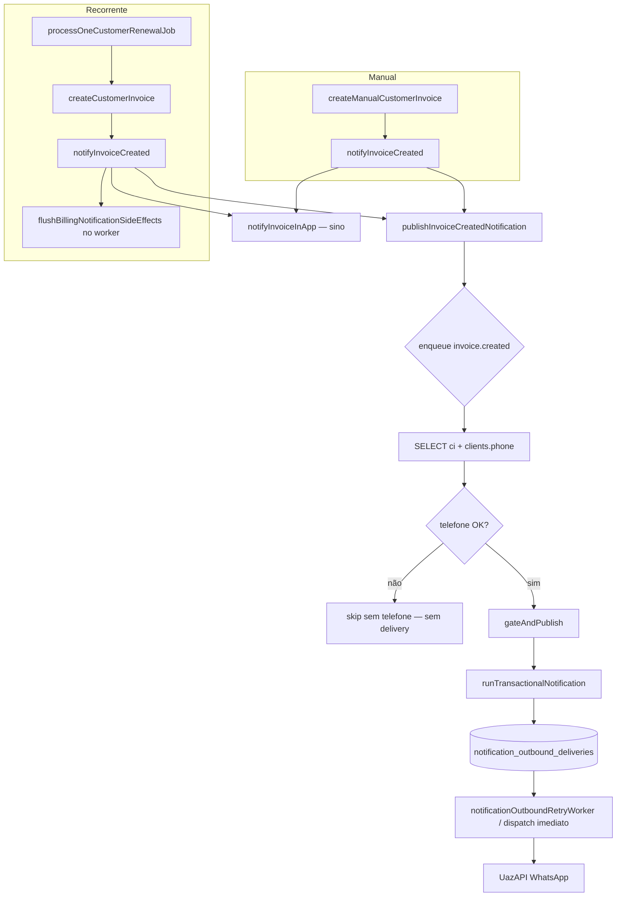

# AUDIT: `notification_outbound_deliveries` — `invoice.created` (faturas recorrentes CRM)

**Modo:** READ ONLY — sem alterações de código  
**Data:** 2026-06-15  
**Escopo:** Pipeline externo (WhatsApp/e-mail) para `invoice.created` em `customer_invoices` recorrentes (`origin=subscription`, `invoice_type=recurring`)

---

## Sintoma confirmado no contexto

| Etapa | Estado |
|-------|--------|
| `customer_invoices` criada | ✓ |
| Sino (in-app) | ✓ |
| `notifyInvoiceCreated()` chamado | ✓ |
| `publishInvoiceCreatedNotification()` chamado | ✓ |
| Recorrência (worker) | ✓ |
| WhatsApp externo ao cliente | ✗ |
| E-mail externo ao cliente | ✗ |

**Objetivo deste documento:** identificar em qual camada o evento `invoice.created` deixa de avançar até o cliente, sem propor correção.

---

## 1. Criação da delivery

### Fluxo real (código)

```
notifyInvoiceCreated()
  └─ publishInvoiceCreatedNotification()          [sync — enfileira async]
       └─ enqueue('invoice.created', fn)          [businessTransactionalNotifications.ts:721]
            └─ scheduleBillingNotificationSideEffect()   [billingNotificationFlush.ts:18]
                 └─ runDetachedFromRequestDb(fn)        [após yield — sem ALS do worker]
                      └─ SELECT customer_invoices + clients
                      └─ gateAndPublish()               [se telefone OK]
                           └─ runTransactionalNotification()
                                └─ insertDelivery() → notification_outbound_deliveries
                                └─ dispatchWhatsAppText() [imediato OU deferido]
  └─ scheduleBillingNotificationSideEffect('invoice_in_app.created', notifyInvoiceInApp)  [sino — pipeline separado]
```

### Onde a delivery é criada

| Item | Valor |
|------|-------|
| **Tabela** | `notification_outbound_deliveries` |
| **Função INSERT** | `insertDelivery()` |
| **Arquivo** | `packages/backend/src/services/notificationsEngine/notificationEngineRepository.ts` |
| **Linhas** | 181–254 |
| **Status inicial** | `'queued'` (passado explicitamente em `runTransactionalNotification`) |
| **Arquivo chamador** | `packages/backend/src/services/notificationsEngine/notificationEngineOrchestrator.ts` |
| **Linhas** | 207–226 |

```207:226:packages/backend/src/services/notificationsEngine/notificationEngineOrchestrator.ts
  const { created, row: deliveryRow } = await insertDelivery(params.pool, {
  ...
    status: 'queued',
  ...
    dispatchNotBefore,
  });
```

```205:218:packages/backend/src/services/notificationsEngine/notificationEngineRepository.ts
    `INSERT INTO notification_outbound_deliveries (
       tenant_id, event_key, entity_type, entity_id, idempotency_key, channel,
       recipient_type, recipient_address, status, rendered_subject, rendered_body,
       error_message, provider_message_id, actor, metadata, event_occurred_at,
       retry_count, next_retry_at, dispatch_sender_user_id, dispatch_not_before
     ) VALUES (...)
     ON CONFLICT (tenant_id, idempotency_key) DO NOTHING
```

### Condições para a delivery existir

A linha em `notification_outbound_deliveries` **só é criada** se **todas** as etapas abaixo passarem:

1. `publishInvoiceCreatedNotification` encontra a fatura no SELECT (linha 741–742)
2. `clients.phone` normaliza para ≥10 dígitos (linhas 743–747)
3. `gateAndPublish` não retorna antecipadamente (linhas 94–127)
4. `runTransactionalNotification` não retorna `ok: false` antes do INSERT (linhas 120–192)
5. Canal resolvido = `whatsapp` (linhas 145–153)
6. Template sistema existe (linhas 155–158)
7. Render strict OK (linhas 171–192)
8. Preferência do tenant **não** está `enabled = false` (linhas 125–143) — neste caso **não há INSERT** (`deliveryId: null`)

### Status possíveis após criação

| Status | Quando |
|--------|--------|
| `queued` | INSERT + envio adiado (`dispatch_not_before` futuro) OU falha transiente aguardando retry |
| `processing` | Worker ou orquestrador iniciou dispatch |
| `sent` | `dispatchWhatsAppText` OK |
| `skipped` | `NOTIFICATIONS_ENGINE_WHATSAPP_SEND_ENABLED=false` (linhas 272–297) ou flag desligada no retry worker |
| `failed` | Erro definitivo ou esgotamento de tentativas |

**Importante:** vários skips ocorrem **antes** do INSERT — nesses casos a delivery **não existe**.

---

## 2. Tabela `notification_outbound_deliveries`

### Query de diagnóstico (operacional)

```sql
SELECT
  id,
  tenant_id,
  event_key,
  channel,
  status,
  dispatch_not_before,
  next_retry_at,
  error_message,
  recipient_address,
  idempotency_key,
  entity_type,
  entity_id,
  created_at,
  updated_at,
  sent_at
FROM notification_outbound_deliveries
WHERE entity_type = 'customer_invoice'
  AND entity_id = '<INVOICE_UUID>'
  AND event_key = 'invoice.created';
```

### Query usada pelo recovery para detectar ausência

`packages/backend/src/services/billingRecoveryService.ts` linhas 827–837:

```sql
SELECT ci.id::text, ci.tenant_id::text
FROM customer_invoices ci
WHERE ci.subscription_id IS NOT NULL
  AND ci.invoice_type IS DISTINCT FROM 'child'
  AND ci.created_at < now() - (15 * interval '1 minute')
  AND NOT EXISTS (
    SELECT 1 FROM notification_outbound_deliveries d
    WHERE d.entity_type = 'customer_invoice'
      AND d.entity_id = ci.id::text
      AND d.event_key = 'invoice.created'
  )
```

### Query usada pelo worker para consumir deliveries

`packages/backend/src/services/notificationsEngine/notificationEngineRepository.ts` linhas 507–518:

```sql
SELECT id::text AS id
FROM notification_outbound_deliveries
WHERE status = 'queued'
  AND (dispatch_not_before IS NULL OR dispatch_not_before <= now())
  AND (
    (next_retry_at IS NOT NULL AND next_retry_at <= now())
    OR (next_retry_at IS NULL)
  )
ORDER BY COALESCE(next_retry_at, dispatch_not_before, created_at) ASC
LIMIT $1
```

### Árvore de classificação por registro

| Cenário | Classificação |
|---------|---------------|
| Nenhuma linha | **A** — delivery não existe |
| `status = 'queued'`, `dispatch_not_before` futuro | **C** — aguardando horário |
| `status = 'queued'`, `dispatch_not_before` passado | **B** — worker deveria consumir |
| `status = 'skipped'` | **D/E** — skip por flag ou preferência pós-criação |
| `status = 'failed'` | **D/F** — falha no provider ou sem sender no retry |
| `status = 'sent'` | **E** — enviada (problema pode ser downstream do provider) |

---

## 3. Gates e skips silenciosos

### 3.1 `publishInvoiceCreatedNotification`

**Arquivo:** `packages/backend/src/services/notificationsEngine/businessTransactionalNotifications.ts`

| Linhas | Condição | Log |
|--------|----------|-----|
| 741–742 | SELECT não retorna fatura | **Nenhum** |
| 743–746 | `normalizeWhatsappPhone(client_phone)` = null | `[notifications-engine/business] skip invoice.created: sem telefone de cliente` |

### 3.2 `gateAndPublish`

**Arquivo:** `packages/backend/src/services/notificationsEngine/businessTransactionalNotifications.ts` linhas 77–167

| Linhas | Condição | Log |
|--------|----------|-----|
| 94 | `!isNotificationsEngineEnabled()` | **Nenhum** |
| 95 | `!isNotificationsEngineBusinessEventsEnabled()` | **Nenhum** |
| 96–98 | Pilot tenant não permitido (`NOTIFICATIONS_ENGINE_BUSINESS_EVENTS_TENANT_IDS`) | `[notifications-engine] business_pilot_skip` (warn) |
| 100–106 | Event key fora da allowlist env | `[notifications-engine] business_event_key_allowlist_skip` (warn) |
| 109–114 | Telefone não normaliza | `[notifications-engine/business] skip {eventKey}: sem telefone normalizado (tenant …)` |
| 122–126 | Sem remetente WhatsApp no tenant | `[notifications-engine/business] skip {eventKey}: sem remetente WhatsApp no tenant …` |
| 145–147 | `!result.ok` | `[notifications-engine/business] {eventKey} falhou` + error |
| 149–150 | `isSkippedByTenantPreference(result)` | **Nenhum** em `gateAndPublish` |

**Flags master (env + Super Admin DB):** `packages/backend/src/config/notificationsEngineEnv.ts`

- `NOTIFICATIONS_ENGINE_ENABLED` — kill switch env
- `NOTIFICATIONS_ENGINE_BUSINESS_EVENTS_ENABLED` — kill switch env
- `NOTIFICATIONS_ENGINE_BUSINESS_EVENTS_KEYS` — allowlist CSV (vazio = todos)
- `NOTIFICATIONS_ENGINE_BUSINESS_EVENTS_TENANT_IDS` — pilot CSV (vazio = todos)
- `NOTIFICATIONS_ENGINE_WHATSAPP_SEND_ENABLED` — kill switch env para envio real

### 3.3 `runTransactionalNotification`

**Arquivo:** `packages/backend/src/services/notificationsEngine/notificationEngineOrchestrator.ts` linhas 105–372

| Linhas | Condição | Log | Delivery criada? |
|--------|----------|-----|------------------|
| 121–122 | Evento inativo/ausente no catálogo | retorna `ok: false` | Não |
| 126–142 | `tenant_preference.enabled = false` | `notification_skipped_by_tenant_preference` — **só se `NOTIFICATIONS_ENGINE_VERBOSE_LOG=true`** | Não |
| 147–152 | Canal ≠ `whatsapp` (ex.: tenant configurou `email`) | retorna `ok: false` | Não |
| 156–157 | Template sistema ausente | retorna `ok: false` | Não |
| 178–191 | Render strict falhou | `[notifications-engine] render_strict_failed` (warn) | Não |
| 252–269 | `dispatch_not_before` futuro | `outbound_first_dispatch_deferred` — **só se verbose** | **Sim**, `queued` |
| 272–297 | `NOTIFICATIONS_ENGINE_WHATSAPP_SEND_ENABLED=false` | `send_skipped_flag` — **só se verbose** | **Sim**, depois `skipped` |
| 308–354 | `dispatchWhatsAppText` falha | `send_failed_final` / `send_transient_retry_scheduled` (warn) | **Sim**, `failed` ou `queued` |

### 3.4 `notificationOutboundRetryWorker`

**Arquivo:** `packages/backend/src/services/notificationsEngine/notificationOutboundRetryWorker.ts`

| Linhas | Condição | Log |
|--------|----------|-----|
| 174–175 | `!isNotificationsEngineEnabled()` | retorno `{ processed: 0 }` — **sem log** |
| 37 | `channel !== 'whatsapp'` | return silencioso |
| 39–45 | `dispatch_not_before` ainda futuro | `[notifications-engine] outbound_worker_skip_not_yet_due` (warn) |
| 48–64 | WhatsApp send flag off no retry | delivery → `skipped` |
| 70–86 | Sem sender no retry | delivery → `failed`, `[notifications-engine] retry_no_sender` (warn) |

### Mapa resumo — pode ocorrer skip por?

| Causa | Antes do INSERT? | Log visível em prod? |
|-------|------------------|----------------------|
| Telefone vazio / inválido | Sim | Sim (`skip invoice.created: sem telefone`) |
| Cliente sem WhatsApp (mesmo critério: phone) | Sim | Sim |
| Sender WhatsApp inexistente no tenant | Sim | Sim |
| Allowlist `NOTIFICATIONS_ENGINE_BUSINESS_EVENTS_KEYS` | Sim | Sim (warn engine) |
| Pilot tenant | Sim | Sim (warn engine) |
| Tenant preference `enabled=false` | Sim | **Não** (verbose only) |
| Master flag motor off | Sim | **Não** |
| Master flag business events off | Sim | **Nenhum** |
| `NOTIFICATIONS_ENGINE_WHATSAPP_SEND_ENABLED=false` | Não (após INSERT) | Verbose only na 1ª tentativa |
| `dispatch_not_before` futuro | Não (após INSERT `queued`) | Verbose only |
| Canal `email` na preferência | Sim | Sim (`falhou` — canal não suportado) |

---

## 4. `dispatch_not_before`

### Função responsável

**Arquivo:** `packages/backend/src/services/notificationsEngine/notificationTenantOutboundDispatchSchedule.ts`  
**Função:** `resolveInvoiceTransactionalDispatchNotBefore()` — linhas 69–98

### Campos do tenant (origem)

Lidos via `getTenantBillingPreferences` / `resolveTenantBillingPreferences`:

- `invoice_notify_same_as_generation` → `invoice_notify_same_as_generation_effective`
- `invoice_notify_time_local` → `invoice_notify_time_local_effective`
- `timezone` → `timezone_effective`
- (Relacionado à geração, não ao dispatch direto) `recurring_generate_time_local`

### Regra

```82:97:packages/backend/src/services/notificationsEngine/notificationTenantOutboundDispatchSchedule.ts
  if (resolved.invoice_notify_same_as_generation_effective) {
    return null;  // envio imediato
  }
  ...
  const targetUtc = utcInstantForLocalWallClock(ymd, notifyHhmm, resolved.timezone_effective);
  if (targetUtc.getTime() <= nowMs) {
    return new Date(nowMs);  // horário já passou hoje → envia agora
  }
  return targetUtc;  // agenda para hoje no horário configurado
```

### Resposta direta

**Sim** — a delivery pode ficar `queued` com `dispatch_not_before` futuro.

**Exemplo:** fatura gerada às 09:00 (`recurring_generate_time_local`), `invoice_notify_same_as_generation = false`, `invoice_notify_time_local = 18:00` → delivery criada às 09:00 com `dispatch_not_before = 18:00` local. O sino dispara imediatamente; o WhatsApp só é elegível após 18:00.

**Efeito observado:** parece que “a notificação falhou” se o operador verifica antes do horário ou se o worker de retry não está rodando após o horário.

**Eventos afetados:** `invoice.created` e `invoice.paid` (`TENANT_SCHEDULED_INVOICE_NOTIFICATION_EVENT_KEYS`, linha 11).

---

## 5. Worker

### Arquivo principal

`packages/backend/src/services/notificationsEngine/notificationOutboundRetryWorker.ts`

### Quem chama `processNotificationOutboundRetriesBatch()`

| Chamador | Arquivo | Linhas | Frequência |
|----------|---------|--------|------------|
| API server (`index.ts`) | `packages/backend/src/index.ts` | 565–570 | `setInterval` — default **30s** (`NOTIFICATIONS_ENGINE_OUTBOUND_RETRY_POLL_MS`) |
| Billing recurring worker | `packages/backend/src/scripts/runRecurringWorker.ts` | 31–32 | A cada execução do cron (~1–2 min), batch 50 |
| Billing recovery | `billingRecoveryService.ts` | `repairRequeueNotifications` (deliveries stuck) | Sob demanda / cron reconciliation |

### Flags que desligam o worker

| Flag / condição | Efeito |
|-----------------|--------|
| `NOTIFICATIONS_ENGINE_ENABLED=false` (env kill) ou Super Admin OFF | `processNotificationOutboundRetriesBatch` retorna `{ processed: 0 }` imediatamente (linha 174–175) |
| Processo API parado e só cron billing one-shot | Retry depende do tick do `runRecurringWorker` |

### Early returns no batch

```173:189:packages/backend/src/services/notificationsEngine/notificationOutboundRetryWorker.ts
export async function processNotificationOutboundRetriesBatch(limit: number) {
  if (!isNotificationsEngineEnabled()) return { processed: 0 };
  ...
  const ids = await listDeliveriesDueForRetry(pool, limit);
  for (const row of ids) {
    await redispatchOne(pool, row.id);
  }
}
```

### Processa `invoice.created`?

**Sim** — não há filtro por `event_key`. Qualquer delivery `queued` elegível é processada.

### Fluxo completo

```
setInterval (index.ts, ~30s)
  OR runRecurringWorker (cron, ~1–2 min)
    ↓
processNotificationOutboundRetriesBatch(limit)
    ↓
listDeliveriesDueForRetry()
  WHERE status = 'queued'
    AND (dispatch_not_before IS NULL OR dispatch_not_before <= now())
    ↓
redispatchOne(deliveryId)
    ↓
getOutboundDeliveryForDispatch()
    ↓
dispatchWhatsAppText()  [whatsappChannelDispatcher.ts]
    ↓
updateDeliveryOutcome → status 'sent' | 'failed' | retry scheduled
```

**Respeita `dispatch_not_before`:** sim — na SELECT (linha 511) e novamente em `redispatchOne` (linhas 39–45).

---

## 6. Logs

### Mapa completo (ordem típica — recorrência CRM)

| Ordem | Tag / prefixo | Arquivo | Função | Linhas | Quando |
|-------|---------------|---------|--------|--------|--------|
| 1 | `[BILLING_NOTIFY_ENQUEUED]` | `billingNotificationFlush.ts` | `scheduleBillingNotificationSideEffect` | 34–37 | Ao enfileirar `invoice.created` e `invoice_in_app.created` |
| 2 | `[notifications-engine/business] skip invoice.created: sem telefone de cliente` | `businessTransactionalNotifications.ts` | `publishInvoiceCreatedNotification` | 745 | Telefone ausente — **último log se parar aqui** |
| 3 | `[notifications-engine/business] skip …` | `businessTransactionalNotifications.ts` | `gateAndPublish` | 111–125 | Gates de telefone/sender |
| 4 | `[notifications-engine/business] invoice.created falhou` | `businessTransactionalNotifications.ts` | `gateAndPublish` | 146 | Orquestrador retornou erro |
| 5 | `[BILLING_NOTIFY_DELIVERY_CREATED]` | `businessTransactionalNotifications.ts` | `gateAndPublish` | 153–165 | Delivery criada (não duplicata) |
| 6 | `[notifications-engine] outbound_first_dispatch_deferred` | `notificationEngineOrchestrator.ts` | `runTransactionalNotification` | 253–258 | **Verbose only** |
| 7 | `[BILLING_NOTIFY_FLUSH]` | `billingNotificationFlush.ts` | `flushBillingNotificationSideEffects` | 70 | Fim do batch do `runRecurringWorker` |
| 8 | `[notifications-engine] outbound_worker_dispatch_start` | `notificationOutboundRetryWorker.ts` | `redispatchOne` | 98–104 | **Verbose only** |
| 9 | `[notifications-engine] outbound_worker_skip_not_yet_due` | `notificationOutboundRetryWorker.ts` | `redispatchOne` | 40–44 | `dispatch_not_before` futuro no worker |
| 10 | `[notifications-engine] retry_batch_item` | `notificationOutboundRetryWorker.ts` | batch catch | 185 | Erro não tratado no item |

### Como inferir o último log para uma invoice recorrente

| Último log observado | Camada onde parou |
|--------------------|-------------------|
| Só `[BILLING_NOTIFY_ENQUEUED]` + `[BILLING_NOTIFY_FLUSH]`, sem delivery no BD | Skip entre enqueue e INSERT (telefone, sender, flags, preferência, canal email) |
| `[BILLING_NOTIFY_DELIVERY_CREATED]` com `status: queued` | Delivery criada; envio adiado ou aguardando worker |
| `[notifications-engine/business] skip invoice.created: sem telefone` | **Antes de `gateAndPublish`** — sem registro na tabela |
| Nenhum log de engine, delivery `queued` + `dispatch_not_before` futuro | **Camada de agendamento** — comportamento esperado até o horário |
| Delivery `sent` no BD, cliente não recebeu | **Camada provider** (UazAPI) — fora do escopo deste pipeline de criação |

**Nota:** logs `[notifications-engine]` via `neLogInfo` exigem `NOTIFICATIONS_ENGINE_VERBOSE_LOG=true`. Em produção sem verbose, vários passos intermediários são **invisíveis nos logs**.

---

## 7. Comparação manual × recorrente

### Entrada de notificação — idêntica

| Função | Manual | Recorrente |
|--------|--------|------------|
| `notifyInvoiceCreated()` | `createManualCustomerInvoice` L376–380 | `createCustomerInvoice` L178–182 |
| `publishInvoiceCreatedNotification()` | via `notifyInvoiceCreated` | via `notifyInvoiceCreated` |
| `preferredSenderUserId` | `null` | `null` |
| `idempotencyKey` | `invoice.created:{invoiceId}` | `invoice.created:{invoiceId}` |

### Divergências após `notifyInvoiceCreated`

| Aspecto | Manual | Recorrente |
|---------|--------|------------|
| Origem da invoice | `origin=manual`, `invoice_type=manual` | `origin=subscription`, `invoice_type=recurring` |
| `subscription_id` no INSERT | NULL | preenchido |
| `flushBillingNotificationSideEffects` | Não no controller API | **Sim** em `runRecurringWorker.ts` L31 |
| `processNotificationOutboundRetriesBatch` | Só via `index.ts` interval | Worker cron + `index.ts` |
| Horário típico de criação | Horário do usuário na UI | `recurring_generate_time_local` do tenant |
| Impacto em `dispatch_not_before` | Se criada após `invoice_notify_time_local`, envia na hora | Se criada antes, pode agendar para mais tarde no mesmo dia |

**Conclusão:** não há divergência de código no pipeline de notificação após `notifyInvoiceCreated`. A diferença operacional relevante é o **horário de criação** (afeta `dispatch_not_before`) e o **flush explícito** no worker (que favorece a recorrência, não a prejudica).

### Fluxograma comparativo



---

## 8. E-mail

### Catálogo e seed

**Arquivo:** `database/init/129_notifications_engine_core.sql`

```193:194:database/init/129_notifications_engine_core.sql
  ('invoice.created', 'invoices', 'Fatura criada', 'whatsapp',
```

```220:221:database/init/129_notifications_engine_core.sql
  ('invoice.created', 'whatsapp', 'pt-BR', NULL,
```

Não existe seed `invoice.created` + `email` no motor do tenant.

### Implementação no orquestrador

```147:152:packages/backend/src/services/notificationsEngine/notificationEngineOrchestrator.ts
  if (channel !== 'whatsapp') {
    return {
      ok: false,
      error: 'Motor: apenas canal whatsapp suportado para processamento.',
```

`sendTransactionalEmail` em `businessTransactionalNotifications.ts` é usado apenas em `contract.sent` (linha 561), **não** em `invoice.created`.

### Classificação e-mail

| Opção | Aplica? |
|-------|---------|
| **A** E-mail implementado | Não |
| **B** E-mail inexistente | **Sim** — para `invoice.created` no motor tenant |
| **C** E-mail desabilitado | N/A — canal não existe no catálogo |

**Expectativa correta para faturas CRM:** apenas WhatsApp via motor tenant. E-mail ao cliente **não faz parte deste pipeline**. Se o operador espera e-mail, a ausência é **comportamento do produto atual**, não falha da recorrência.

---

## 9. Recovery

### Função

`repairMissingInvoiceNotifications()` — `packages/backend/src/services/billingRecoveryService.ts` linhas 823–879

### Quando executa

| Modo | Como |
|------|------|
| Cron | `npm run billing:ops-reconciliation` → `runBillingReconciliation.ts` → `runBillingRecovery()` |
| Manual Super Admin | `superadminBillingController.ts` L183 → `runBillingRecovery({ dry_run })` |
| Automático aplicado? | **Somente se `BILLING_RECOVERY_DRY_RUN=false`** (default = dry run, linha 107–108) |

### Critério de seleção

- `customer_invoices.subscription_id IS NOT NULL` (inclui recorrentes CRM)
- `invoice_type IS DISTINCT FROM 'child'`
- Criada há mais de **15 minutos** (`NOTIFICATION_MISSING_MINUTES`)
- **Ausência** de `notification_outbound_deliveries` com `event_key = 'invoice.created'`

### Consegue recuperar recorrência sem notificação?

| Cenário | Recovery ajuda? |
|---------|-----------------|
| Delivery nunca criada (skip pré-INSERT) | Chama `notifyInvoiceCreated` de novo — **só resolve se a causa raiz foi transitória**; se telefone/sender/flag, falha de novo |
| Delivery `queued` com `dispatch_not_before` futuro | **Não** — delivery já existe, critério `NOT EXISTS` não casa |
| Delivery `failed` / `skipped` | **Não** diretamente — usa `repairRequeueNotifications` (outra função, deliveries stuck) |
| Dry run default | **Não aplica** — apenas audita |

---

## 10. Classificação final

Com base no código (sem dados de produção de uma invoice específica), as hipóteses ordenadas por probabilidade dado o sintoma (**sino OK, externo não**):

| Código | Hipótese | Evidência no código |
|--------|----------|---------------------|
| **D** | Skip silencioso (telefone, sender, flags, preferência) | Sino não exige telefone; externo exige. Vários skips sem log em prod. |
| **C** | `dispatch_not_before` futuro | Recorrência gera cedo; notificação pode agendar para `invoice_notify_time_local`. Sino imediato. |
| **B** | Delivery `queued` mas worker não consome | Possível se API parada e cron billing não roda após horário; menos provável se `index.ts` ativo. |
| **A** | Delivery nunca criada | Compatível com skip pré-INSERT; verificar BD com query §2. |
| **E** | Canal não configurado | E-mail: **sempre** inexistente (B). WhatsApp: seed existe. |
| **F** | Worker parado | `NOTIFICATIONS_ENGINE_ENABLED=false` ou processo API down. |
| **H** | Recovery não executado | Default dry run; não repara automaticamente. |
| **G** | Regressão recente | Recovery `repairMissingInvoiceNotifications` sugere cenário conhecido; requer git blame fora deste escopo. |

### Camada mais provável de ruptura (dado o sintoma)

```
Esperado: cliente recebe WhatsApp
Observado: sino OK, externo não

Ruptura mais provável ENTRE:
  publishInvoiceCreatedNotification (enfileirado ✓)
  E
  notification_outbound_deliveries (linha persistida ✓/✗)
```

**Primeiro passo de confirmação em produção:** executar a query do §2.

| Resultado BD | Camada que quebra |
|--------------|-------------------|
| Sem linha | **Pré-INSERT** — `publishInvoiceCreatedNotification` / `gateAndPublish` / `runTransactionalNotification` (§3) |
| `queued` + `dispatch_not_before` > now() | **Agendamento** — §4 (não é falha; é defer) |
| `queued` + `dispatch_not_before` <= now() | **Worker** — §5 |
| `skipped` / `failed` | **Pós-criação** — flags, sender, provider |
| `sent` | **Provider** — UazAPI / número do cliente |

### Sobre e-mail

A ruptura do e-mail externo ao cliente em faturas CRM recorrentes ocorre na camada de **produto**: **canal inexistente** (classificação **E/B** do §8), não na recorrência.

---

## Referências de arquivos

| Papel | Caminho |
|-------|---------|
| Entrada notificação | `packages/backend/src/services/invoiceNotificationsService.ts` |
| Publicação invoice.created | `packages/backend/src/services/notificationsEngine/businessTransactionalNotifications.ts` |
| Orquestrador + INSERT delivery | `packages/backend/src/services/notificationsEngine/notificationEngineOrchestrator.ts` |
| Repositório deliveries | `packages/backend/src/services/notificationsEngine/notificationEngineRepository.ts` |
| Agendamento dispatch | `packages/backend/src/services/notificationsEngine/notificationTenantOutboundDispatchSchedule.ts` |
| Flush worker | `packages/backend/src/services/notificationsEngine/billingNotificationFlush.ts` |
| Worker retry/outbound | `packages/backend/src/services/notificationsEngine/notificationOutboundRetryWorker.ts` |
| Worker recorrência | `packages/backend/src/scripts/runRecurringWorker.ts` |
| Criação invoice recorrente | `packages/backend/src/services/recurringBillingJobService.ts` |
| Criação invoice + notify | `packages/backend/src/services/customerInvoiceService.ts` |
| Recovery | `packages/backend/src/services/billingRecoveryService.ts` |
| Catálogo/seed | `database/init/129_notifications_engine_core.sql` |
| Flags | `packages/backend/src/config/notificationsEngineEnv.ts` |
| Intervalo retry API | `packages/backend/src/index.ts` |

---

*Documento gerado em modo READ ONLY. Nenhuma alteração de comportamento foi aplicada.*
