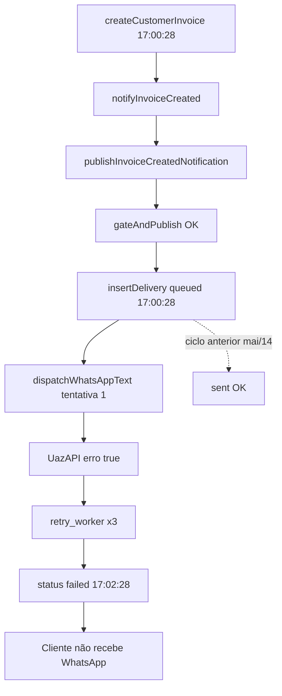

# AUDIT: Entrega real — `invoice.created` (fatura recorrente CRM)

**Modo:** READ ONLY  
**Data:** 2026-06-15  
**Fonte:** PostgreSQL local (`localhost:5433`, DB `painelcrm`)  
**Invoice investigada:** mais recente com `invoice_type = 'recurring'` e delivery `invoice.created`

---

## 1. Invoice recorrente selecionada

| Campo | Valor |
|-------|-------|
| **invoice_id** | `c9747fa1-5bdd-4c56-8479-74c4f5dd2a3a` |
| **tenant_id** | `4ecc0b33-aecd-4489-a5ae-0d7c6395c35d` |
| **client_id** | `b23f6718-f326-4e98-a827-57af31376957` |
| **subscription_id** | `fa1fd410-d107-4bad-a9e5-e58189b0a273` |
| **created_at** | `2026-06-07 17:00:28.876207+00` |
| **invoice_type** | `recurring` |
| **origin** | `subscription` |
| **invoice_number** | `CINV-4ECC0B33-MQ412V64` |
| **client_phone** | `11920079901` |

**Confirmação fluxo recorrente:** `origin = 'subscription'`, `invoice_type = 'recurring'`, `subscription_id` preenchido. Job em `billing_recurring_jobs` com `result_invoice_id` = esta invoice e `cycle_key = 2026-06-14`.

**Referência de comparação (ciclo anterior, mesmo cliente):** invoice `97704d29-270b-4a68-b0b0-54848a07705a` (2026-05-14) — delivery `invoice.created` com **`status = sent`**.

---

## 2. `notification_outbound_deliveries`

### Query executada

```sql
SELECT id, status, channel, dispatch_not_before, retry_count AS attempt_count,
       next_retry_at, error_message, created_at, updated_at, sent_at,
       provider_message_id AS message_id, recipient_address
FROM notification_outbound_deliveries
WHERE entity_type = 'customer_invoice'
  AND entity_id = 'c9747fa1-5bdd-4c56-8479-74c4f5dd2a3a'
  AND event_key = 'invoice.created';
```

### Registro encontrado

| Campo | Valor |
|-------|-------|
| **id** | `7c082911-eb68-43b5-9e74-4c59817c25fd` |
| **event_key** | `invoice.created` |
| **channel** | `whatsapp` |
| **status** | **`failed`** |
| **dispatch_not_before** | `NULL` |
| **attempt_count** (`retry_count`) | `3` |
| **error_message** | `true` |
| **created_at** | `2026-06-07 17:00:28.921156+00` |
| **updated_at** | `2026-06-07 17:02:28.25102+00` |
| **sent_at** | `NULL` |
| **message_id** | `NULL` |
| **recipient_address** | `11920079901` |

### Classificação

**D) `failed`**

A delivery **existe**. Não é ausência de pipeline nem fila pendente.

---

## 3. Status `queued` — não aplicável

`dispatch_not_before = NULL` → envio imediato (sem agendamento).

### Preferências do tenant (confirmadas no BD)

| Campo | Valor |
|-------|-------|
| **timezone** | `America/Sao_Paulo` |
| **recurring_generate_time_local** | `14:00:00` |
| **invoice_notify_same_as_generation** | `true` |
| **invoice_notify_time_local** | `NULL` |

Com `invoice_notify_same_as_generation = true`, `resolveInvoiceTransactionalDispatchNotBefore()` retorna `null` (envio imediato).

**Arquivo:** `packages/backend/src/services/notificationsEngine/notificationTenantOutboundDispatchSchedule.ts`  
**Função:** `resolveInvoiceTransactionalDispatchNotBefore` — linhas 82–84

**Conclusão:** **não** é cenário B/C (fila aguardando horário). A fatura foi criada às 14:00 local (17:00 UTC) e a delivery foi disparada na hora.

---

## 4. Status `skipped` — não aplicável

Status final é `failed`, não `skipped`.

Hipóteses de skip **descartadas** para esta invoice (dados reais):

| Causa | Evidência |
|-------|-----------|
| WhatsApp send disabled | Delivery criada e 4 tentativas executadas (não `skipped` na criação) |
| Tenant preference off | Delivery criada com corpo renderizado |
| Sender ausente | `dispatch_sender_user_id = 459afc5e-79bb-418e-b65c-94d7fe360d4f`, instância `connected` |
| Telefone inválido | `recipient_address = 11920079901` — passou normalização |

---

## 5. Status `failed` — detalhe

### Tentativas (`notification_outbound_delivery_attempts`)

| # | status | error_message | via | duration_ms | created_at (UTC) |
|---|--------|---------------|-----|-------------|------------------|
| 1 | `failed_transient` | `true` | orquestrador (1ª dispatch) | 2628 | 17:00:31 |
| 2 | `failed_transient` | `true` | `retry_worker` | 2616 | 17:00:50 |
| 3 | `failed_transient` | `true` | `retry_worker` | 2739 | 17:01:24 |
| 4 | `failed_transient` | `true` | `retry_worker` | 2631 | 17:02:28 |

### Quem gerou o `failed` final

**Arquivo:** `packages/backend/src/services/notificationsEngine/notificationEngineOrchestrator.ts`  
**Função:** `recordAttemptAndHandleSendFailure` — linhas 90–101

Após a 4ª tentativa (`failedAttemptNumber >= maxAttempts`, default 4), `updateDeliveryOutcome` define `status = 'failed'`.

### Cadeia de falha

```
runTransactionalNotification() [L308 dispatchWhatsAppText]
  OR notificationOutboundRetryWorker.redispatchOne() [L107]
    → whatsappChannelDispatcher.dispatchWhatsAppText() [L64-83]
      → uazapiService.sendTextMessage() [L247]
        → uazapi.request() [L118-135] — HTTP !ok
          → new Error(payload?.error || ...)  [L119]
```

### `error_message = "true"` — origem provável

**Arquivo:** `packages/backend/src/services/uazapi.ts` linha 119:

```typescript
const error = new Error(payload?.error || payload?.message || response.statusText || 'UazAPI request failed');
```

Se a UazAPI devolver JSON com `{ "error": true }` (booleano), `Error.message` vira a string **`"true"`**.  
`classifyWhatsAppDispatchError("true")` classifica como **`transient`** (linha 24 — default), gerando 4 retries.

**Payload renderizado (enviado ao provider):**

```
Olá, *11920079901*.
Criamos a fatura *CINV-4ECC0B33-MQ412V64*.
Valor: R$ 90,00
Vencimento: 14/06/2026
Consulte ou pague aqui:
http://localhost:8081/pay/23eda8a6-6c68-424a-b9bf-0d80e1e4bfb4
Agência Dev
```

**Sender:** `kaique@agenciadev.com.br`, WhatsApp `connected`, token presente.

---

## 6. Status `sent` — não aplicável nesta invoice

A delivery **não** chegou a `sent`.

**Prova de que o motor funciona no mesmo tenant/cliente:** invoice anterior `97704d29` → delivery `fa9c574b-a699-4e3a-9e75-12971a0b61d7` com **`status = sent`** (2026-05-14).

O problema desta invoice está **após** criação da delivery — na camada **provider (UazAPI)**.

---

## 7. Worker

### `processNotificationOutboundRetriesBatch()` — ativo

| Item | Valor |
|------|-------|
| **Scheduler API** | `packages/backend/src/index.ts` L565–570 — `setInterval`, default **30s** |
| **Scheduler billing** | `packages/backend/src/scripts/runRecurringWorker.ts` L31–32 — a cada execução do cron |
| **Batch size (API)** | 25 |
| **Batch size (billing worker)** | 50 |
| **Flag desligar** | `NOTIFICATIONS_ENGINE_ENABLED=false` → retorno imediato `{ processed: 0 }` (`notificationOutboundRetryWorker.ts` L174–175) |

### Última execução (heartbeat real)

**Tabela:** `billing_ops_heartbeat`

| process_key | last_run_at (UTC) | age_minutes | outbound_retry.processed |
|-------------|-------------------|-------------|--------------------------|
| **worker** | 2026-06-15 16:38:35 | ~0.25 | **0** (nada elegível agora) |
| **scheduler** | 2026-06-15 16:38:01 | ~0.81 | — |

### Evidência de consumo nesta invoice

Tentativas 2–4 têm `provider_response.via = "retry_worker"` → o worker **consumiu** a delivery `queued` após retries agendados.

**Deliveries `queued` elegíveis agora:** `0`

**Arquivo SELECT:** `notificationEngineRepository.ts` `listDeliveriesDueForRetry` — linhas 507–518

---

## 8. Sino (in-app) — achado adicional

Para esta invoice, **não há** registro `notifications.type = 'invoice_created'`.

Existe apenas:

| type | created_at | title |
|------|------------|-------|
| `invoice_overdue` | 2026-06-15 13:49:48 UTC | Fatura vencida |

O sino que o operador pode ter visto é o de **vencimento** (digest/overdue), não o de **criação** — ou refere-se a outro ambiente/invoice.

---

## 9. Timeline completa (invoice `c9747fa1`)

```
2026-06-07 17:00:28.876 UTC
  └─ INSERT customer_invoices (recurring, subscription)
       └─ createCustomerInvoice() → notifyInvoiceCreated()
            └─ [BILLING_NOTIFY_ENQUEUED] invoice.created + invoice_in_app.created

2026-06-07 17:00:28.921 UTC  (+45ms)
  └─ INSERT notification_outbound_deliveries
       id=7c082911, status=queued, channel=whatsapp, dispatch_not_before=NULL
       [BILLING_NOTIFY_DELIVERY_CREATED] (se log ativo)

2026-06-07 17:00:31.565 UTC  (tentativa 1)
  └─ runTransactionalNotification → dispatchWhatsAppText → UazAPI
       └─ FALHA error_message="true" → failed_transient → schedule retry

2026-06-07 17:00:50 UTC  (tentativa 2)
  └─ processNotificationOutboundRetriesBatch → redispatchOne
       └─ FALHA "true" → retry

2026-06-07 17:01:24 UTC  (tentativa 3)
  └─ retry worker → FALHA "true" → retry

2026-06-07 17:02:28 UTC  (tentativa 4)
  └─ retry worker → FALHA "true"
       └─ recordAttemptAndHandleSendFailure → status=failed (final)

2026-06-07 18:00:42 UTC
  └─ billing_recurring_jobs completed (idempotent_existing_customer_invoice)
```

**E-mail:** nenhuma delivery `invoice.created` + `channel=email` — canal inexistente no motor tenant (ver auditoria anterior).

---

## 10. Comparação manual × recorrente (mesmo tenant)

| Ciclo | Invoice | Delivery `invoice.created` | Resultado |
|-------|---------|---------------------------|-----------|
| 1º recorrente (mai/2026) | `97704d29` | `fa9c574b` | **`sent`** |
| 2º recorrente (jun/2026) | `c9747fa1` | `7c082911` | **`failed`** |

Mesmo `client_id`, mesmo telefone, mesmo sender WhatsApp conectado.  
**Divergência não está no código de recorrência** — está na **resposta da UazAPI** neste envio específico.

### Fluxograma do caso real



---

## 11. Classificação final

| Código | Aplica nesta invoice? |
|--------|----------------------|
| A) delivery nunca criada | **Não** — existe `7c082911` |
| B) queued aguardando horário | **Não** — `dispatch_not_before` NULL |
| C) worker não consumiu | **Não** — 3 retries via worker |
| D) skip telefone/sender/prefs | **Não** — delivery criada, sender connected |
| E) canal não configurado | E-mail: sim (inexistente). WhatsApp: configurado e usado |
| F) worker parado | **Não** — heartbeat ativo; retries executados em jun/07 |
| G) regressão | Parcial — ciclo anterior **sent**; este ciclo **failed** no provider |
| H) recovery não executado | Irrelevante — delivery existe (recovery só para ausência) |

### Resposta direta

**Em qual ponto exato a invoice deixa de avançar?**

## **E) Provider falhou** — subclasse **D) Worker consumiu e falhou**

| Camada | Estado |
|--------|--------|
| Antes da delivery | ✓ Passou |
| Delivery criada | ✓ `queued` → tentativas |
| Worker | ✓ Consumiu (tentativas 2–4) |
| Provider UazAPI | ✗ 4 falhas, `error_message = "true"` |
| Estado final | `failed`, `sent_at = NULL` |

### Arquivos, funções e linhas envolvidos na ruptura

| Arquivo | Função | Linhas | Papel |
|---------|--------|--------|-------|
| `notificationEngineOrchestrator.ts` | `runTransactionalNotification` | 308–354 | 1ª dispatch |
| `whatsappChannelDispatcher.ts` | `dispatchWhatsAppText` | 64–83 | Chama UazAPI |
| `uazapi.ts` | `request` | 118–135 | HTTP erro → `throw Error("true")` |
| `notificationEngineOrchestrator.ts` | `recordAttemptAndHandleSendFailure` | 53–101 | Retries + `failed` final |
| `notificationOutboundRetryWorker.ts` | `redispatchOne` | 107–170 | Retries 2–4 |
| `whatsappDispatchErrorClassifier.ts` | `classifyWhatsAppDispatchError` | 7–24 | `"true"` → `transient` (4 tentativas) |

**O motor de notificações cumpriu o fluxo.** O cliente não recebeu WhatsApp porque a UazAPI rejeitou o envio em todas as tentativas. Investigação adicional (fora deste escopo READ ONLY) requer logs UazAPI do momento `2026-06-07 17:00–17:02 UTC` e o body JSON completo da resposta HTTP com `error: true`.

---

*Auditoria READ ONLY. Nenhuma alteração de código ou dados.*
