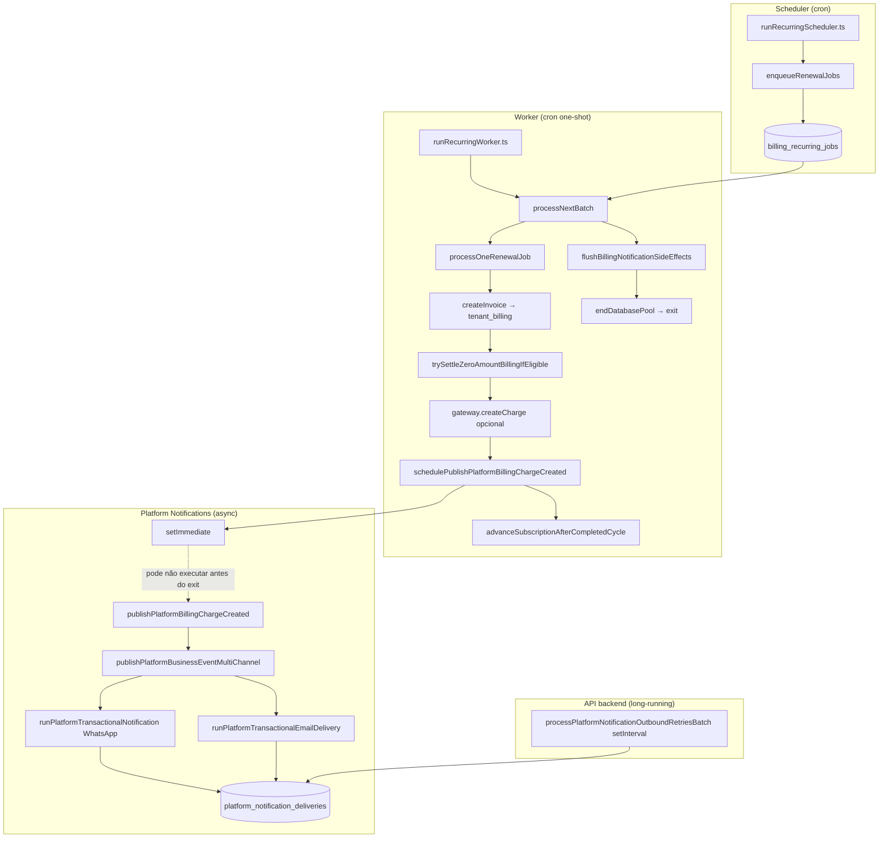

# AUDIT_RECURRING_BILLING_NOTIFICATIONS

**Modo:** READ ONLY  
**Data:** 2026-06-09  
**Objetivo:** Explicar por que faturas recorrentes **SaaS** (`tenant_billing`, `billing_reason = plan_renewal`) são geradas normalmente, mas **não disparam** notificações WhatsApp e/ou E-mail.

---

## Resumo executivo

| Pergunta | Resposta |
|----------|----------|
| A renovação publica evento de notificação? | **Sim, no código** — `schedulePublishPlatformBillingChargeCreated(billing.id)` |
| O evento é o mesmo da cobrança manual? | **Sim** — `platform.billing.charge.created` |
| Por que manual “funciona” e renovação não? | **Processo:** manual roda na **API HTTP** (processo longo); renovação roda no **billing-worker one-shot** que **encerra antes** do `setImmediate` completar a publicação |
| Causa raiz | **B** — publicação agendada mas **não concluída** no worker; secundário: replay idempotente **não re-notifica** |
| Motor usado | **Platform Notifications** (`platform_notification_deliveries`) — **não** o motor do tenant (`notification_deliveries` / `invoice.created`) |

---

## 1. Pipeline completo — renovação SaaS



### Arquivos e papéis

| Camada | Arquivo | Função / papel |
|--------|---------|------------------|
| Scheduler | `packages/backend/src/scripts/runRecurringScheduler.ts` | One-shot; chama `enqueueRenewalJobs()` |
| Scheduler core | `packages/backend/src/services/recurringBillingJobService.ts` | `enqueueRenewalJobs()` — enfileira em `billing_recurring_jobs` |
| Worker | `packages/backend/src/scripts/runRecurringWorker.ts` | One-shot; batch + `flushBillingNotificationSideEffects()` + exit |
| Worker core | `recurringBillingJobService.ts` | `processNextBatch()` → SaaS: `processOneRenewalJob()` |
| Fatura | `packages/backend/src/services/invoiceService.ts` | `createInvoice()` → `INSERT tenant_billing` |
| Preço M1–M4 | `calculateSaasRenewalInvoiceAmount` + overrides | Valor final (inclui waive → R$ 0) |
| Zero amount M4 | `commercial/zeroAmountSettlementService.ts` | Liquidação R$ 0; **pula** notificação de cobrança |
| Gateway | `modules/payments/gatewayProvider.ts` | `createCharge` na renovação (se não zero) |
| **Notificação SaaS** | `platformNotifications/platformBusinessNotifications.ts` | `schedulePublishPlatformBillingChargeCreated` → `publishPlatformBillingChargeCreated` |
| Orquestração | `platformNotifications/platformBusinessEventMultiChannel.ts` | WhatsApp + E-mail em paralelo |
| Entrega WA | `platformNotifications/platformNotificationEngineOrchestrator.ts` | `runPlatformTransactionalNotification` |
| Entrega E-mail | | `runPlatformTransactionalEmailDelivery` |
| Persistência | `platformNotifications/platformNotificationEngineRepository.ts` | `platform_notification_deliveries` + attempts |
| Retry WA plataforma | `platformNotifications/platformNotificationOutboundRetryWorker.ts` | Só no **index.ts** da API |
| Flush worker | `notificationsEngine/billingNotificationFlush.ts` | Drena fila do **motor do tenant** — **não** cobre platform `setImmediate` |
| Outbox domínio | `outbox/outboxPublisherWorker.ts` | Automação/workflows — **não** participa de `tenant_billing` SaaS |
| Lifecycle | `lifecycle/lifecycleBillingObserver.ts` | `observeFutureBillingLifecycleEvent('subscription.renewed')` — shadow only |

**Nota:** Não existe `processOneSaasRenewalJob()` — o nome real é `processOneRenewalJob()` (tipo `saas`).

---

## 2. Eventos de notificação

### Evento esperado para nova fatura SaaS

| Campo | Valor |
|-------|-------|
| **event_key** | `platform.billing.charge.created` |
| **entity_type** | `tenant_billing` |
| **entity_id** | `billing.id` |
| **Canais** | WhatsApp + E-mail (default em `publishPlatformBusinessEventMultiChannel`) |

### Outros eventos relacionados (não substituem “cobrança criada”)

| event_key | Quando | Renovação? |
|-----------|--------|------------|
| `platform.billing.payment_confirmed` | Fatura `paid` | Só se liquidada (ex.: zero amount M4) |
| `platform.billing.charge.overdue` | Status `overdue` | Não na criação |
| `platform.plan.activated` | Primeira ativação | Não na renovação |
| `subscription.renewed` (lifecycle) | Shadow observer | **Sem** notificação |

### O motor do tenant **não** cobre `tenant_billing`

- `notificationsEngine/businessTransactionalNotifications.ts` → `invoice.created` aponta para **`customer_invoices`** (CRM).
- `invoiceNotificationsService.ts` → `FROM customer_invoices` — irrelevante para SaaS.

### Publicação

```375:380:packages/backend/src/services/platformNotifications/platformBusinessNotifications.ts
export function schedulePublishPlatformBillingChargeCreated(billingId: string): void {
  setImmediate(() => {
    void publishPlatformBillingChargeCreated(billingId).catch((e) =>
      console.error('[platform-notifications/business] charge.created', e),
    );
  });
}
```

### Consumo

1. `publishPlatformBillingChargeCreated` → `publishPlatformBusinessEventMultiChannel`
2. WhatsApp: `runPlatformTransactionalNotification` → insert `platform_notification_deliveries` → envio síncrono (se flags OK)
3. E-mail: `runPlatformTransactionalEmailDelivery` → insert + SMTP
4. Retry WhatsApp falhas: `processPlatformNotificationOutboundRetriesBatch` em `packages/backend/src/index.ts` (poll ~30s)

---

## 3. Auditoria — `processOneRenewalJob()`

Trecho após criar `tenant_billing`:

```1861:1923:packages/backend/src/services/recurringBillingJobService.ts
  const billing = await createInvoice(invoiceData);

  const zeroSettlement = await trySettleZeroAmountBillingIfEligible({
    billingId: billing.id,
    amountCents,
    source: 'renewal',
  });

  const gateway = zeroSettlement
    ? null
    : await getActiveGateway({ billingType: 'saas', tenantId: subscription.tenant_id });
  if (gateway) {
    // ... createCharge + updateInvoiceGatewayData ...
  }

  if (!zeroSettlement) {
    schedulePublishPlatformBillingChargeCreated(billing.id);
  }

  // lifecycle shadow observation
  void import('../lifecycle/lifecycleBillingObserver.js').then(({ observeFutureBillingLifecycleEvent }) =>
    observeFutureBillingLifecycleEvent(
      'subscription.renewed',
      { tenantId: subscription.tenant_id, subscriptionId: subscription.id, invoiceId: billing.id },
      { source: 'recurring_renewal_invoice' },
    ),
  );

  await advanceSubscriptionAfterCompletedCycle(client, { ... });
```

| Pergunta | Resposta |
|----------|----------|
| Publica notificação? | **Sim**, se `!zeroSettlement` |
| Chama scheduler de notificação? | `setImmediate` — fire-and-forget |
| Cria outbox (`outbox_events`)? | **Não** |
| Cria WhatsApp? | Só se `publishPlatformBillingChargeCreated` **completar** |
| Cria E-mail? | Idem |
| `await` na publicação? | **Não** |

### Worker após o batch

```28:40:packages/backend/src/scripts/runRecurringWorker.ts
    execute: async () => {
      const child = await processChildItemDueInvoices();
      const result = await processNextBatch(workerId);
      const notifyFlush = await flushBillingNotificationSideEffects();
      const outboundRetry = await processNotificationOutboundRetriesBatch(50);
      return { ... };
    },
```

- `flushBillingNotificationSideEffects` → fila `scheduleBillingNotificationSideEffect` (**motor tenant**).
- **Não** aguarda `setImmediate` de `schedulePublishPlatformBillingChargeCreated`.
- Processo chama `endDatabasePool()` e **termina** — callbacks pendentes podem ser descartados.

### Replay idempotente (sem notificação)

Se já existe fatura para o período, o worker **reutiliza** a invoice e **não** chama `processOneRenewalJob` nem notificação:

```1639:1679:packages/backend/src/services/recurringBillingJobService.ts
        if (subscription.type === 'saas') {
          const existingInvoice = await findInvoiceBySubscriptionAndPeriod(
            job.subscription_id,
            periodStartYmd
          );
          if (existingInvoice) {
            // advance cycle + complete job — SEM schedulePublishPlatformBillingChargeCreated
            ...
            continue;
          }
          await processOneRenewalJob(client, job, subscription, periodStartYmd);
```

Cenário: 1ª execução criou `tenant_billing` mas notificação morreu no exit → 2ª execução idempotente → **nunca notifica**.

---

## 4. Manual vs Renovação automática

| Aspecto | A) Cobrança manual Superadmin | B) Renovação automática SaaS |
|---------|--------------------------------|------------------------------|
| Entrada | `POST .../billing/charge` → `tenantsController.createTenantCharge` | `billing_recurring_jobs` → `processOneRenewalJob` |
| Cria fatura | `createInvoice()` | `createInvoice()` |
| `billing_reason` | `manual_charge` | `plan_renewal` |
| Overrides M1–M4 | `calculateInvoiceAmount` + tenantId | `calculateSaasRenewalInvoiceAmount` + tenantId |
| Zero amount M4 | `trySettleZeroAmountBillingIfEligible` — **pula** notify se liquidou | Idem |
| Evento notify | `schedulePublishPlatformBillingChargeCreated` | **Mesma função** (se `!zeroSettlement`) |
| Processo host | **API HTTP** (`painelcrm-backend`) — vivo minutos/horas | **Billing worker** one-shot — exit rápido |
| `await` publish? | Não (também `setImmediate`) | Não |
| Probabilidade publish completar | **Alta** (event loop ativo) | **Baixa** (processo encerra) |
| Flush no fim | Não aplicável (request HTTP) | `flushBillingNotificationSideEffects` — **não cobre platform** |
| Retry WA plataforma | `index.ts` setInterval | Worker **não** roda retry; depende da API |
| Motor tenant `invoice.created` | **Não** (SaaS) | **Não** (SaaS) |
| Lifecycle Kanban | Não | `subscription.renewed` shadow only |

**Conclusão:** A chamada de notificação **existe** em ambos. A diferença crítica é **ambiente de execução + ausência de drain** para publicações platform no worker.

---

## 5. Templates

### Catálogo (`platform_notification_event_catalog`)

| event_key | Ativo (seed) | Módulo |
|-----------|--------------|--------|
| `platform.billing.charge.created` | `true` (migration 139) | `platform_billing` |

### WhatsApp (`platform_notification_template_system`)

| event_key | Canal | Locale | Ativo |
|-----------|-------|--------|-------|
| `platform.billing.charge.created` | whatsapp | pt-BR | `true` |
| Corpo atualizado em `145_platform_notification_billing_platform_invoice_url.sql` | | | |

Merge fields: `billing.platform_invoice_url`, `billing.payment_link`, etc.

### E-mail (`platform_notification_template_system`)

| event_key | Canal | Locale | Ativo |
|-----------|-------|--------|-------|
| `platform.billing.charge.created` | email | pt-BR | `true` (migration 229) |

### Uso no código

Templates são lidos em `runPlatformTransactionalNotification` / `runPlatformTransactionalEmailDelivery`. **Se a publicação nunca roda, os templates nunca são consultados.**

### Bloqueios pós-template (se publicação rodar)

| Bloqueio | Efeito |
|----------|--------|
| `platform_notifications_enabled = false` | Skip total em `publishPlatformBusinessEventMultiChannel` |
| `platform_notifications_business_events_enabled = false` | Skip eventos reais |
| Evento `is_active = false` | Erro no orquestrador |
| WhatsApp: instância não designada / desconectada | `resolvePlatformWhatsAppOutboundReady` → falha ou skip |
| `platform_notifications_whatsapp_send_enabled = false` | Delivery `skipped` |
| E-mail: SMTP Super Admin não pronto | `isSmtpReadyForSystemEmail` → falha/skip |
| Admin sem telefone | Skip WhatsApp (`no_whatsapp_number`) |
| Admin sem e-mail válido | Skip e-mail |

---

## 6. Outbox / filas

| Tabela / conceito | Usado na renovação SaaS? |
|-------------------|--------------------------|
| `notification_outbox` / `outbox_events` | **Não** para cobrança SaaS |
| `notification_deliveries` (motor tenant) | **Não** — só `customer_invoices` |
| **`platform_notification_deliveries`** | **Sim** — destino esperado |
| `platform_notification_delivery_attempts` | Tentativas WA/e-mail |
| `message_queue` | Não identificado no fluxo SaaS |

### O que deveria aparecer após renovação bem-notificada

```sql
SELECT id, event_key, entity_type, entity_id, channel, status, recipient_address,
       error_message, created_at
FROM platform_notification_deliveries
WHERE entity_type = 'tenant_billing'
  AND entity_id = '<billing_uuid>'
  AND event_key = 'platform.billing.charge.created'
ORDER BY created_at;
```

Esperado: 2 linhas (whatsapp + email) ou skips documentados em `status` / `error_message`.

### Evidência típica do bug

- `tenant_billing` com `billing_reason = 'plan_renewal'` **existe**
- **Zero** linhas em `platform_notification_deliveries` para esse `billing_id`
- Logs do container **billing-worker** sem `platform_notification_multichannel_started`

---

## 7. Workers

| Worker | Onde roda | Processa renovação SaaS? |
|--------|-----------|--------------------------|
| `runRecurringWorker` | Container `painelcrm-billing-worker` | Cria fatura; **agenda** notify via `setImmediate` |
| `runRecurringScheduler` | `painelcrm-billing-scheduler` | Só enfileira jobs |
| `processPlatformNotificationOutboundRetriesBatch` | **`index.ts` API only** | Retry WA **após** delivery criada |
| `processNotificationOutboundRetriesBatch` | Worker + API | Motor **tenant** — CRM invoices |
| `notificationInvoiceDigestWorker` | API | `due_soon` / `overdue` digest — CRM |
| `outboxPublisherWorker` | Separado | Workflows — não billing SaaS |

Workers estão **preparados** para `platform.billing.charge.created` (templates + orquestrador). O gap é **invocação confiável** a partir do billing-worker, não ausência de handler.

---

## 8. Auditoria de dados reais (queries)

Substituir `:tenant_id` / investigar produção:

### 8.1 Última fatura de renovação

```sql
SELECT id AS billing_id, tenant_id, billing_reason, status, amount_cents,
       invoice_number, created_at, subscription_id, period_start, period_end
FROM tenant_billing
WHERE billing_reason = 'plan_renewal'
  AND tenant_id = :tenant_id
ORDER BY created_at DESC
LIMIT 5;
```

### 8.2 Job de recorrência ligado

```sql
SELECT id, subscription_id, status, completion_outcome, result_invoice_id,
       created_at, updated_at
FROM billing_recurring_jobs
WHERE tenant_id = :tenant_id
ORDER BY updated_at DESC
LIMIT 5;
```

### 8.3 Entregas platform (deveria existir)

```sql
SELECT *
FROM platform_notification_deliveries
WHERE entity_id = '<billing_id>'
ORDER BY created_at;
```

### 8.4 Flags Super Admin

```sql
SELECT key, value
FROM superadmin_settings
WHERE key LIKE 'platform_notifications%';
```

### 8.5 Checklist interpretação

| Observação | Interpretação |
|------------|---------------|
| Fatura existe, 0 deliveries | Publicação não completou (causa B) ou flags OFF antes do insert |
| Deliveries `skipped` + `send_disabled_by_flag` | WhatsApp send desligado |
| Deliveries `failed` + remetente indisponível | Instância WA não conectada |
| Job `completed_idempotent_existing_saas_invoice` | Notificação nunca re-disparada |
| `amount_cents = 0` + paid | M4 zero settlement — notify **intencionalmente omitido** |

---

## 9. Causa raiz

### Classificação

| Opção | Aplica? |
|-------|---------|
| **A** Evento não é publicado (código) | **Parcial** — chamada existe, mas `setImmediate` pode não executar |
| **B** Evento agendado mas não cria delivery | **Principal (SIM)** |
| **C** Delivery criada mas worker ignora | Secundário — retry só na API |
| **D** Template inexistente | **Não** — seeds 139/229 |
| **E** Template desativado | Improvável (verificar DB) |
| **F** WhatsApp não conectado | Pode afetar **envio**, não explica **zero deliveries** |
| **G** E-mail não conectado | Idem |
| **H** Outro | Replay idempotente sem re-notify; zero amount M4 skip |

### Causa raiz exata (objetiva)

> **B + ciclo de vida do billing-worker:** `schedulePublishPlatformBillingChargeCreated` usa `setImmediate` sem `await`. O script `runRecurringWorker.ts` termina e fecha o pool **antes** de `publishPlatformBillingChargeCreated` persistir em `platform_notification_deliveries`. O `flushBillingNotificationSideEffects()` do worker **não** inclui publicações do motor da plataforma.

**Agravante:** jobs subsequentes com fatura já existente (`completed_idempotent_existing_saas_invoice`) **nunca** reinvocam notificação.

**Casos especiais (não bug de pipeline):**
- Override **waive** / valor **R$ 0** → liquidação automática M4 → **sem** `charge.created` (by design).
- Flags `platform_notifications_*` desligadas → publish retorna cedo (sem delivery).

---

## 10. Proposta de correção (sem implementar)

### Sprint N.1 — Recurring Billing Notifications

#### Objetivo

Garantir que toda `tenant_billing` com `billing_reason IN ('plan_renewal', 'manual_charge', 'plan_purchase')` dispare `platform.billing.charge.created` de forma **awaitável** e **idempotente** no worker.

#### Arquivos tocados (proposta)

| Arquivo | Mudança proposta |
|---------|------------------|
| `platformBusinessNotifications.ts` | `await publishPlatformBillingChargeCreated` no worker; manter `schedule*` na API ou unificar |
| `recurringBillingJobService.ts` | `await publishPlatformBillingChargeCreated(billing.id)` após `createInvoice` (ou wrapper drain) |
| `runRecurringWorker.ts` | `await flushPlatformNotificationSideEffects()` novo helper |
| `billingNotificationFlush.ts` ou novo `platformNotificationFlush.ts` | Fila awaitável para eventos platform (espelhar tenant flush) |
| `recurringBillingJobService.ts` (idempotente) | Opcional: `notifyIfMissingDelivery(billingId)` no path `existingInvoice` |
| Testes | Worker integration: após batch mock, deliveries count ≥ 1 |

#### Pontos de integração

1. **Pós-`createInvoice`** em `processOneRenewalJob` — ponto canônico.
2. **Não duplicar** chamada em gateway webhook.
3. Manter skip em **zero settlement** M4 (ou emitir evento diferente `payment_confirmed` apenas — já ocorre em `zeroAmountSettlementService`).

#### Riscos

| Risco | Mitigação |
|-------|-----------|
| Duplicar WhatsApp em retry manual | Idempotency key `platform:tenant_billing:{id}:charge_created:{channel}` já existe |
| Aumentar latência do worker | Publish é I/O bound; batch ≤ 100 |
| ENV divergente worker vs API | Documentar: flags platform devem ser iguais (já em EASYPANEL-SERVICOS.md) |
| Waive R$ 0 sem “nova cobrança” | Comunicar via `payment_confirmed` ou novo evento `platform.billing.renewal.zero` (produto) |

#### Compatibilidade

| Área | Impacto |
|------|---------|
| Billing Engine | Baixo — só torna side-effect síncrono no worker |
| Lifecycle | Nenhum — shadow `subscription.renewed` inalterado |
| Commercial M1–M4 | Respeitar skip `zeroSettlement`; documentar |
| Analytics M3 | Sem mudança em métricas |
| CRM `customer_invoices` | Fora de escopo — motor tenant separado |

#### Critérios de aceite N.1

- [ ] Renovação SaaS gera linhas em `platform_notification_deliveries` (WA + email ou skip explícito)
- [ ] Billing-worker one-shot drena publicações antes de `endDatabasePool`
- [ ] Cobrança manual continua funcionando
- [ ] Idempotência: segundo job para mesmo período não duplica mensagens
- [ ] Teste automatizado cobrindo worker path

---

## Referências no repositório

- `docs/INVESTIGACAO_RECORRENCIA_POS_FIX_WORKER.md` — problema análogo no motor **tenant** (CRM)
- `docs/MAPA_TECNICO_HORARIO_RECORRENCIA_E_NOTIFICACAO.md`
- `docs/platform-notifications/PHASE-03-platform-events.md`
- `docs/architecture/automation/LIFECYCLE_ROUTER_FOUNDATION_AUDIT.md` — mapeamento `platform.billing.charge.created`
- `EASYPANEL-SERVICOS.md` — billing-worker ENV deve espelhar backend

---

## Fluxograma resumido (causa raiz)

```
Renovação OK → tenant_billing INSERT ✓
              → schedulePublishPlatformBillingChargeCreated (setImmediate)
              → worker flush (só motor tenant) ✓
              → endDatabasePool / process.exit
              → publishPlatformBillingChargeCreated NÃO roda ✗
              → platform_notification_deliveries vazio ✗
              → tenant sem WhatsApp/E-mail ✗

Manual Superadmin → mesma schedulePublish...
                  → processo API continua vivo
                  → setImmediate executa ✓
                  → deliveries criadas ✓
```
