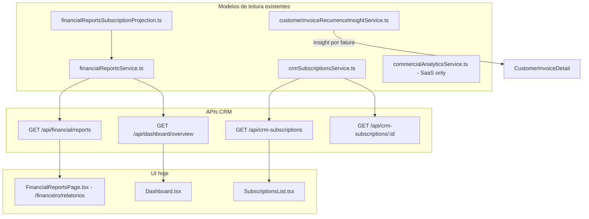

# AUDIT_SUBSCRIPTIONS_ANALYTICS_R1

**Sprint:** R1 — Analytics de Assinaturas CRM  
**Modo:** READ ONLY (Fase 1)  
**Data:** 2026-06-15  
**Escopo:** `subscriptions.type = 'customer'` — visão gerencial, MRR/ARR, projeções, crescimento, churn.  
**Fora do escopo desta auditoria:** SaaS (`commercialAnalyticsService`, `superadminDashboardService`, checkout, planos).

---

## Resumo executivo

O CRM **já possui um motor de projeção de receita de assinaturas** (`financialReportsSubscriptionProjection.ts`) integrado ao relatório financeiro enterprise (`financialReportsService.ts`). Esse é o **principal artefato reutilizável** para R1.

**Não existe** hoje um endpoint ou serviço dedicado a **MRR/ARR de portfólio CRM**, churn, crescimento líquido ou evolução histórica de MRR. Parte disso pode ser **derivada** sem novo motor, estendendo consultas sobre `subscriptions`, `customer_invoices` e funções já exportadas (`normalizeCrmSubscriptionAmountToMonthlyCents`, `buildSubscriptionsProjection`).

A tela `/crm-subscriptions` (`SubscriptionsList.tsx`) tem **cards operacionais** (ativas, soma bruta de `amount_cents`, próximas 7 dias em contagem), **não** MRR/ARR gerencial.

**Recomendação R1:** criar um **único serviço fino** `crmSubscriptionsAnalyticsService.ts` que **compõe** `buildSubscriptionsProjection` + agregações SQL leves — **sem** duplicar `calculateNextBillingDate` nem o loop de projeção.

---

## Mapa de artefatos existentes



---

## 1. MRR (Monthly Recurring Revenue)

### Já existe?

| Contexto | Existe? | Onde |
|----------|---------|------|
| **CRM — portfólio** | **Parcial** | `normalizeCrmSubscriptionAmountToMonthlyCents()` em `financialReportsSubscriptionProjection.ts` (Sprint S1) |
| **CRM — agregado exposto** | **Não** | Nenhum campo `mrr_cents` em API |
| **CRM — UI** | **Não** | `SubscriptionsList` soma `amount_cents` bruto (não é MRR) |
| **SaaS** | Sim | `commercialAnalyticsService` (`mrrCatalog`, `mrrContracted`) — **não reutilizar para CRM** |

### Como é calculado hoje (CRM)

```40:55:packages/backend/src/services/financialReportsSubscriptionProjection.ts
/** MRR equivalente para assinaturas CRM (weekly → × 52/12). Demais intervalos: valor do ciclo. */
export function normalizeCrmSubscriptionAmountToMonthlyCents(
  amountCents: number,
  billingInterval: string,
): number {
  const amount = Math.max(0, Math.round(amountCents));
  if (billingInterval === 'weekly') {
    return Math.floor((amount * 52) / 12);
  }
  return amount;
}
```

**Gap importante:** para `quarterly`, `semi_annual` e `yearly`, o valor retornado é o **valor do ciclo inteiro**, não o equivalente mensal. O campo `amount_recurring` na tabela de projeção usa essa função — portanto **MRR de portfólio está correto só para `monthly` e `weekly`** até normalização completa (decisão de produto para R1).

### Pode ser reaproveitado?

**Sim.** Para R1:

```typescript
mrr_cents = sum(
  normalizeCrmSubscriptionAmountToMonthlyCents(sub.amount_cents, sub.billing_interval)
  for sub in active customer subscriptions
)
```

Fonte de dados: mesma query de `buildSubscriptionsProjection` (assinaturas `active`, `type = 'customer'`) ou `GET /api/crm-subscriptions` + normalização no serviço analytics.

**Não reutilizar** `commercialAnalyticsService.normalizeAmountToMonthlyCents` — é SaaS/tenant billing e não inclui `weekly` da mesma forma.

---

## 2. ARR (Annual Recurring Revenue)

### Existe?

| Item | Status |
|------|--------|
| Função helper CRM | **Sim** — `crmSubscriptionArrFromMonthlyCents(monthlyCents) = monthlyCents × 12` |
| Exposto em API/UI | **Não** |
| SaaS superadmin | MRR × 12 implícito em gráficos — fora do escopo CRM |

### É derivado do MRR?

**Sim**, no CRM a intenção Sprint S1 é `ARR = MRR × 12` via `crmSubscriptionArrFromMonthlyCents`.

---

## 3. Projeção futura (3 / 6 / 12 meses)

### Já há lógica?

**Sim** — `buildSubscriptionsProjection(tenantId, { from, to }, monthlyMonthKeys)`:

- Projeta ciclos futuros com `calculateNextBillingDate` até `to` (guard 480 iterações/assinatura).
- Separa: `subscription_revenue_realized` (paid_at), `pending` (due no período), `projected` (ciclos sem fatura).
- Integrado em `getFinancialEnterpriseReport` com `from`/`to` arbitrários.

### Presets de período existentes

`financialController.resolveSummaryRange`:

| Preset | Alcance |
|--------|---------|
| `current_month` | mês corrente |
| `last_month` | mês anterior |
| `ytd` | ano até hoje |
| `full_year` / `current_year` | ano civil |
| `next_month` | próximo mês |
| custom | `from` + `to` query params |

**12 meses:** `runLoad({ from: hoje, to: hoje + 12 meses })` ou `full_year` — **sem endpoint dedicado** “próximos 12 meses”.

### Reaproveitamento R1

- **Próximos 12 meses:** chamar `buildSubscriptionsProjection` com `to = addMonths(from, 12)` — **mesmo motor**.
- **Não** criar segundo loop de datas.

---

## 4. Histórico mensal (série temporal)

### Existe?

**Sim**, em dois níveis:

1. **`subscriptions_projection.by_month[]`** — realizada / pendente / projetada por mês (`YYYY-MM`).
2. **`FinancialEnterpriseReport.monthly[]`** — mesmas métricas mescladas com receita/despesa geral (`subscription_revenue_*`).

### Gráficos?

**Parcial** — `FinancialReportsPage.tsx`:

- `subscriptionChartRows()` monta série a partir de `monthly[]` (receita recebida + ganhos previstos de assinaturas).
- Gráfico de barras/área no relatório **financeiro geral**, não página “Assinaturas”.
- Tabela de assinaturas ativas com `amount_recurring` e link para detalhe.

**É possível montar gráficos MRR/ARR?** Sim, derivando série mensal de MRR exigiria **snapshot por mês** (não existe hoje) ou proxy via `subscription_revenue_realized` + assinaturas ativas no fim do mês — **lacuna para evolução histórica de MRR** (ver §5).

---

## 5. Crescimento (novas / cancelamentos / saldo líquido)

### Existe cálculo pronto?

**Não.**

### Dados disponíveis

| Campo | Tabela | Uso |
|-------|--------|-----|
| `created_at` | `subscriptions` | novas assinaturas por mês |
| `cancelled_at` | `subscriptions` | cancelamentos por mês |
| `status` | `subscriptions` | ativa / cancelada |

**Gap:** `listCrmCustomerSubscriptions` **não retorna** `created_at` nem `cancelled_at` — precisam ser adicionados ao DTO do analytics ou query dedicada (sem nova tabela).

### Saldo líquido

`novas_no_periodo - cancelamentos_no_periodo` — **calculável**, não implementado.

---

## 6. Churn

### Existe cálculo?

**Não** — nem taxa nem contagem por período em API CRM.

### Informação suficiente?

**Sim**, com ressalvas:

- Churn **logo** = assinaturas com `status = 'cancelled'` e `cancelled_at` no período.
- Churn **rate** clássico = cancelamentos / base no início do período — requer query agregada; base ativa no início pode ser aproximada por snapshot ou contagem retroativa.
- `cancel_at_period_end` gera churn futuro, não imediato.

**Não confundir** com churn SaaS em `superadminDashboardService` (tenants/planos).

---

## 7. Ticket médio

### Pode ser obtido?

**Sim:** `MRR total / assinaturas ativas` (após normalização correta por intervalo).

Hoje `SubscriptionsList` exibe “Receita recorrente prevista” = **soma bruta** de `amount_cents` das ativas — **não é ticket médio nem MRR** (especialmente com weekly/quarterly/yearly).

`crmSubscriptionsService.computeStats` por assinatura: total faturado/pago/pendente — **ticket por cliente no detalhe**, não portfólio.

---

## 8. Próximos recebimentos

### Consultas prontas

| Fonte | O quê | Granularidade |
|-------|-------|---------------|
| `SubscriptionsList` summary | contagem `next_billing_date` em 7 dias | contagem, não R$ |
| `dashboardController` | `SUM(amount_cents)` faturas `pending/overdue` com `due_date` em 7 dias | **valor em R$** (faturas, não só assinaturas) |
| `buildSubscriptionsProjection` | `pending_subscription_revenue` + `projected_subscription_revenue` no período | período configurável |
| `customer_invoices` | `due_date`, `status` | SQL direto |

**Reaproveitar:** para card “Recebimentos previstos (7 dias)” — query existente do dashboard (linhas 632–640) ou filtrar `customer_invoices` com `subscription_id IS NOT NULL`.

---

## 9. Último pagamento recebido

### Existe no dashboard?

**Não** como card “cliente + valor + horário”.

### O que existe

| Local | Dado |
|-------|------|
| `dashboardController` | agregado `COUNT` + `SUM` faturas pagas no **período** do overview |
| `getCrmSubscriptionDetail` | `latest_paid_invoice_id`, stats `total_paid_cents` |
| `customer_invoices` | `paid_at`, `amount_cents`, `client_id` |

**Implementação R1:** uma query `ORDER BY paid_at DESC LIMIT 1` em `customer_invoices` com `subscription_id IS NOT NULL` + join cliente — **sem novo motor**.

---

## 10. Top clientes (receita recorrente)

### Existe?

| Artefato | Escopo |
|----------|--------|
| `financialReportsService.billing_by_client` | faturas **pagas no período** (cash), não MRR |
| `subscriptions_projection.rows` | uma linha por assinatura com `client_name`, `amount_recurring` (MRR parcial) |

**Top por MRR recorrente:** agregar `rows` por `client_id` somando `amount_recurring` — **reaproveita projeção existente**.

**Top por receita histórica:** `billing_by_client` no enterprise report.

---

## 11. Distribuição por periodicidade

### Existe agregação?

**Não** em API.

### Dados

Cada assinatura tem `billing_interval` (`weekly`, `monthly`, `quarterly`, `semi_annual`, `yearly`) — listagem CRM e `subscriptions_projection.rows`.

**R1:** `GROUP BY billing_interval` em query leve ou reduce no serviço analytics sobre lista ativa.

Labels PT já centralizados em `crmSubscriptionsService.billingIntervalLabelPt` / `financialReportsSubscriptionProjection`.

---

## 12. APIs existentes

### CRM Assinaturas

| Método | Rota | Permissão | Retorno relevante |
|--------|------|-----------|-------------------|
| GET | `/api/crm-subscriptions` | `billing.view_subscriptions` | lista: valor, intervalo, próxima data, status |
| GET | `/api/crm-subscriptions/:id` | idem | detalhe, timeline, stats, jobs |
| PATCH | `.../next-billing` | `billing.edit_subscription` | operacional |
| POST | `.../cancel` | idem | cancelamento |

**Sem** endpoint analytics.

### Financeiro / Relatórios

| Método | Rota | Permissão | Retorno relevante |
|--------|------|-----------|-------------------|
| GET | `/api/financial/reports?preset=&from=&to=` | `finance.view_reports` | `FinancialEnterpriseReport` completo incl. `subscriptions_projection` |
| GET | `/api/financial/summary` | finance | resumo sem bloco assinaturas dedicado |

### Dashboard

| Método | Rota | Métricas assinatura |
|--------|------|---------------------|
| GET | `/api/dashboard/overview` | `active_subscriptions`, `projected_subscription_income` (via enterprise report), faturas 7 dias |

### Outros (referência, não CRM analytics)

| Serviço | Uso |
|---------|-----|
| `GET /api/customer-invoices/.../recurrence-insight` | insight **por fatura** (`customerInvoiceRecurrenceInsightService`) |
| `commercialAnalyticsService` | MRR SaaS superadmin |
| `reportsController` | planos/tenants superadmin |

### OpenAPI interno

Não há spec OpenAPI para APIs CRM/financeiro.

---

## Inventário por arquivo pesquisado

| Arquivo | Papel para R1 |
|---------|----------------|
| `financialReportsSubscriptionProjection.ts` | **Núcleo** — projeção, `by_month`, `rows`, normalização weekly MRR |
| `financialReportsService.ts` | Orquestra projeção + `billing_by_client` + `monthly[]` |
| `crmSubscriptionsService.ts` | Listagem/detalhe operacional, labels PT |
| `customerInvoiceRecurrenceInsightService.ts` | Ciclo **por fatura** — não substitui analytics de portfólio |
| `commercialAnalyticsService.ts` | SaaS only — **não usar** |
| `superadminDashboardService.ts` | MRR estimado por plano SaaS — **não usar** |
| `dashboardController.ts` | Overview executivo, contagens, faturas 7d |
| `SubscriptionsList.tsx` | Cards operacionais (não MRR) |
| `FinancialReportsPage.tsx` | Relatório financeiro com seção assinaturas |
| `financial.ts` (frontend) | Cliente `getEnterpriseReport` |

---

## Lacunas vs. requisitos R1 (Fase 2 e 3)

| Requisito | Status | Reaproveitamento sugerido |
|-----------|--------|---------------------------|
| Card MRR | ❌ | `sum(normalizeCrmSubscription…)` sobre ativas |
| Card ARR | ❌ | `crmSubscriptionArrFromMonthlyCents(mrr)` |
| Assinaturas ativas | ✅ parcial | já em list + dashboard |
| Novas do período | ❌ | SQL `created_at` |
| Cancelamentos do período | ❌ | SQL `cancelled_at` |
| Crescimento líquido | ❌ | derivado |
| Último pagamento | ❌ | SQL `paid_at DESC` |
| Recebimentos 7 dias (R$) | ⚠️ | dashboard query faturas |
| Filtros mês/trimestre/ano | ⚠️ | `resolveSummaryRange` no financeiro — **não** em `/assinaturas` |
| Gráfico crescimento assinaturas | ❌ | série `created_at` / `cancelled_at` |
| Evolução MRR/ARR | ❌ | precisa série mensal MRR (snapshot ou proxy) |
| Distribuição periodicidade | ❌ | group by `billing_interval` |
| Top clientes MRR | ⚠️ | agregar `projection.rows` |
| Projeção 12 meses | ⚠️ | `buildSubscriptionsProjection` range estendido |
| Churn | ❌ | SQL cancelamentos |
| Ticket médio | ❌ | MRR / ativas |
| Receita acumulada | ⚠️ | `paid_subscription_revenue` no período |

---

## Classificação de reutilização

| Letra | Significado | R1 |
|-------|-------------|-----|
| **A** | Pronto para usar | `buildSubscriptionsProjection`, `normalizeCrmSubscriptionAmountToMonthlyCents`, `crmSubscriptionArrFromMonthlyCents`, enterprise report |
| **B** | Estender sem motor novo | DTO analytics, agregações SQL, cards UI |
| **C** | Lacuna de produto/dado | Evolução histórica de MRR (sem snapshots) |
| **D** | Não usar | `commercialAnalyticsService`, `superadminDashboardService` |
| **E** | Não tocar | worker, notificações, overdue, `subscriptionService` |

---

## Proposta técnica mínima (Fase 2–3, sem implementar)

### 1. Serviço único (leitura)

`crmSubscriptionsAnalyticsService.ts`:

```typescript
getCrmSubscriptionsAnalytics(tenantId, range: { from, to })
```

**Compõe:**

- `buildSubscriptionsProjection` → MRR, projeção, `by_month`, top por linha
- Queries SQL adicionais leves: `created_at`, `cancelled_at`, último `paid_at`, distribuição `billing_interval`, recebíveis 7 dias (faturas de assinatura)

**Exporta:** `mrr_cents`, `arr_cents`, `active_count`, `new_count`, `cancelled_count`, `net_growth`, `last_payment`, `upcoming_7d_cents`, `by_interval[]`, `top_clients[]`, `monthly_growth[]`, `projection_12m` (delegando range).

### 2. API

`GET /api/crm-subscriptions/analytics?from=&to=&preset=`  
Permissão: `billing.view_subscriptions` ou `finance.view_reports` (alinhar com produto).

### 3. UI

- **Fase 2:** cards em `SubscriptionsList.tsx` consumindo novo endpoint (ou expandir list response — preferível endpoint dedicado para não inflar listagem).
- **Fase 3:** rota `/financeiro/relatorios/assinaturas` ou submenu em `FinancialReportsPage` — **reutilizar** componentes de gráfico de `FinancialReportsPage` + dados do analytics service.

### 4. Normalização MRR completa (decisão)

Para MRR gerencial correto em todos os intervalos:

| Intervalo | Fator sugerido (alinhado a SaaS) |
|-----------|----------------------------------|
| weekly | × 52/12 (já existe) |
| monthly | × 1 |
| quarterly | ÷ 3 |
| semi_annual | ÷ 6 |
| yearly | ÷ 12 |

Estender `normalizeCrmSubscriptionAmountToMonthlyCents` **sem** alterar motor de cobrança (apenas camada analytics).

---

## Riscos

1. **“Receita recorrente prevista” atual** na listagem confunde com MRR — corrigir label ou substituir por MRR normalizado.
2. **MRR histórico** não é persistido — gráfico “evolução MRR” pode usar proxy (receita realizada de assinaturas) ou exigir snapshot mensal futuro.
3. **Projeção vs. cash:** `subscription_revenue_projected` é valor de **ciclo**, não MRR normalizado — gráficos devem declarar métrica.
4. **Permissões:** analytics financeiro vs. billing — definir gate único.
5. **Performance:** `buildSubscriptionsProjection` O(subs × ciclos) — aceitável para CRM; cache opcional depois.

---

## Conclusão

A Sprint R1 **não precisa de novo motor de recorrência**. O caminho de menor risco é:

1. **Auditar** (este documento) ✅  
2. **Expor** métricas agregadas reutilizando `financialReportsSubscriptionProjection` + SQL pontual em `subscriptions` / `customer_invoices`  
3. **Enriquecer UI** `/crm-subscriptions` e submenu Relatórios → Assinaturas  

Nenhuma migration ou alteração em worker/notificações/overdue é necessária para analytics de leitura.
