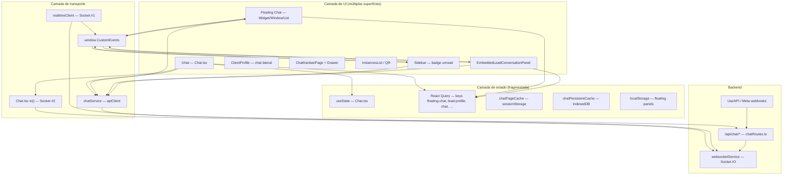
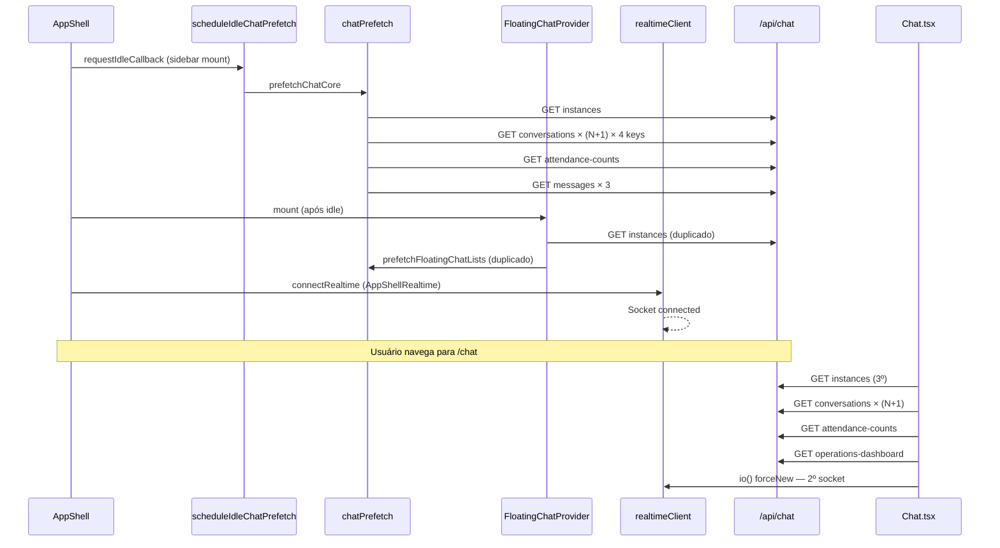
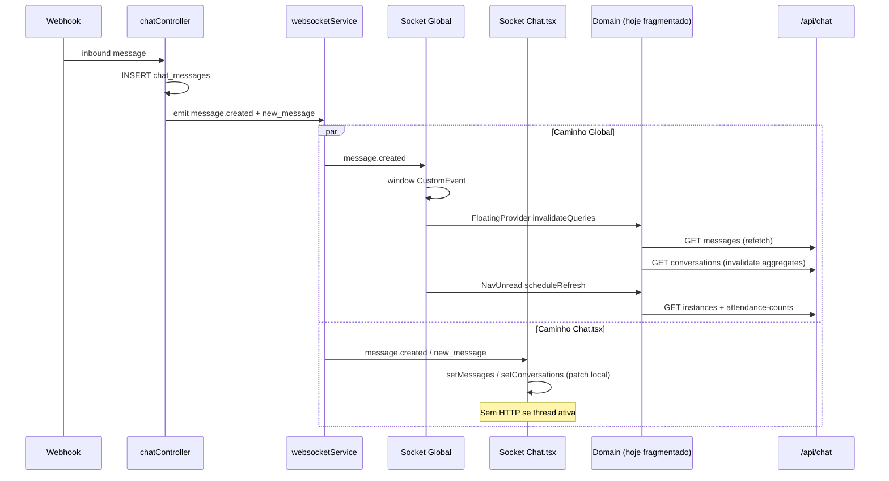
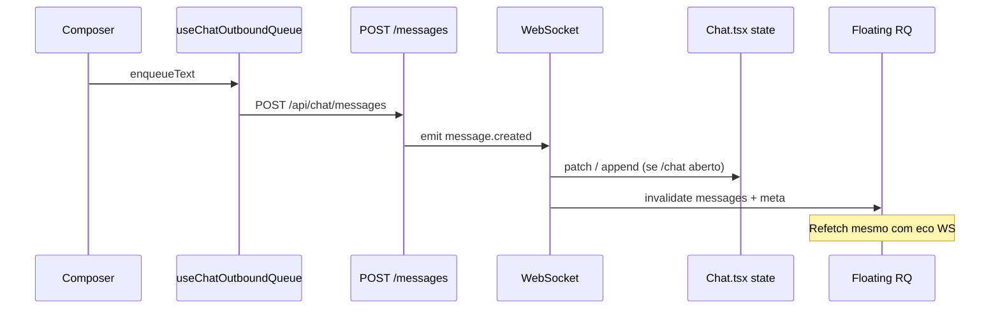
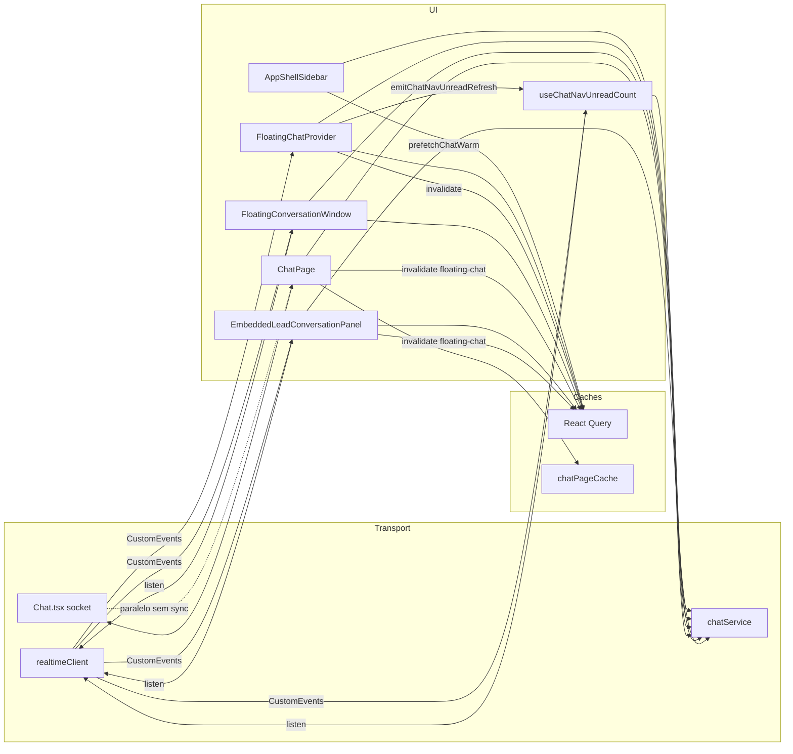
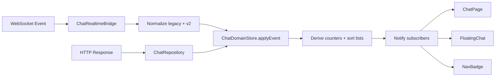

# Auditoria Arquitetural — Chat Realtime

| Campo | Valor |
|---|---|
| **Task** | `AUDIT_CHAT_REALTIME_ARCHITECTURE` v1.0 |
| **Tipo** | Investigação arquitetural (somente leitura) |
| **Depende de** | `AUDIT_CHAT_REQUEST_OPTIMIZATION` |
| **Data** | 2026-07-07 |
| **Escopo** | Frontend (`src/`), backend (`packages/backend/`), WebSocket (Socket.IO) |
| **Restrições** | Nenhuma alteração de código, comportamento, WebSocket ou React Query |

---

## 1. Propósito deste documento

Este documento estabelece:

1. **A arquitetura atual** do módulo Chat — como está implementada hoje.
2. **As violações arquiteturais** que explicam o excesso de requisições HTTP identificado na auditoria anterior.
3. **A arquitetura de referência** que deve orientar todas as futuras evoluções.
4. **A Source of Truth (SoT) oficial** recomendada para cada domínio de dados.
5. **Os riscos de migração** para a arquitetura proposta.

**Resultado esperado:** um guia definitivo para que novas funcionalidades (novos canais, novos módulos, escala) sejam adicionadas **sem reintroduzir** duplicação de sockets, caches paralelos ou refetch desnecessário.

---

## 2. Resumo executivo

### 2.1 Diagnóstico em uma frase

O Chat opera hoje como um **sistema híbrido não unificado**: a página `/chat` usa estado React local + socket dedicado; o Floating Chat e módulos satélite usam React Query + socket global via `window` CustomEvents; ambos compartilham o mesmo `chatService` mas **não compartilham estado nem estratégia de atualização realtime**.

### 2.2 Problema arquitetural raiz

Não existe uma **camada de domínio Chat** que centralize:

- carregamento HTTP inicial,
- normalização de payloads,
- aplicação de eventos WebSocket ao estado,
- propagação para todas as superfícies de UI (página, float, nav, kanban, CRM lateral).

Cada superfície implementou sua própria solução. Isso viola **Single Source of Truth**, **Single Responsibility** e gera **acoplamento por efeitos colaterais** (`invalidateQueries` globais, `emitChatNavUnreadRefresh`, invalidação cruzada com `clients`/`leads`).

### 2.3 Princípio da arquitetura de referência

> **HTTP carrega; WebSocket atualiza; uma camada de domínio decide; múltiplas UIs observam.**

O WebSocket **não deve ser gatilho de refetch HTTP** para dados cujo payload já está no evento. HTTP é reservado para: bootstrap, paginação/histórico, ações do usuário com efeito no servidor, e reconciliação periódica de baixa frequência.

---

## 3. Mapa da arquitetura atual

### 3.1 Visão em camadas



### 3.2 Árvore de Providers e Contexts (mount)

```
AppShell
├── FloatingChatDeferred          ← lazy load; stub até idle/interação
│   └── FloatingChatBundle
│       └── FloatingChatProvider  ← estado UI float + invalidate RQ + listInstances
│           └── FloatingChatWidget / Windows / MobileOverlay
├── ChatNavUnreadScope
│   └── ChatNavUnreadProvider     ← useChatNavUnreadCount (poll 120s + WS)
├── AppShellRealtime (lazy)
│   └── HeaderRealtimeBridge
│       └── useRealtimeEvents     ← connectRealtime (Socket global)
└── {children} — rotas (/chat, /leads, …)

Chat.tsx (rota /chat)             ← FORA do FloatingChatProvider; socket próprio
KanbanServiceProvider             ← injeção API kanban (tenant vs ops)
```

**Arquivos de referência:**

| Provider / Context | Arquivo |
|---|---|
| `FloatingChatProvider` | `src/features/floating-chat/FloatingChatProvider.tsx` |
| `FloatingChatContext` | `src/features/floating-chat/floatingChatContext.tsx` |
| `ChatNavUnreadProvider` | `src/hooks/chatNavUnreadContext.tsx` |
| `HeaderRealtimeBridge` | `src/components/layout/HeaderRealtimeBridge.tsx` |
| `KanbanServiceProvider` | `src/components/chat-kanban/KanbanServiceContext.tsx` |
| `AppShell` | `src/layouts/shell/AppShell.tsx` |

### 3.3 Backend

| Componente | Responsabilidade |
|---|---|
| `packages/backend/src/routes/chatRoutes.ts` | ~88 rotas REST `/api/chat/*` |
| `packages/backend/src/routes/chatKanbanRoutes.ts` | Kanban de conversas |
| `packages/backend/src/controllers/chatController.ts` | Inbox, mensagens, instâncias, webhooks |
| `packages/backend/src/services/websocketService.ts` | Socket.IO — salas `user:{id}`, `tenant:{id}` |
| Webhooks UazAPI / Meta | Ingestão → DB → emissão WS |

O backend **já segue** um modelo claro: **persistência no DB + push via WebSocket**. A fragmentação está no **frontend**.

### 3.4 React Query — uso atual no Chat

| Query key prefix | Consumidor | staleTime típico |
|---|---|---|
| `floating-chat` | Float, prefetch | 2–5 min |
| `lead-profile` | Lead embed | 5–30 s |
| `chat` | Prefetch instances/unread | 10 s – 2 min |
| `chat-runtime-config` | Chat.tsx | 60 s |
| `chat-scheduled-messages` | Strip agendadas | 15 s |
| `client-profile` / `entity-drawer` | CRM lateral | 30 s |

A página `/chat` **não usa RQ** para conversas nem mensagens — usa `useState` + `chatPageCache`.

### 3.5 Caches independentes (além do RQ)

| Cache | Arquivo | Dados | Escopo |
|---|---|---|---|
| `chatPageCache` | `src/lib/chatPageCache.ts` | conversas, mensagens, última conversa | sessão `/chat` |
| `chatPersistentCache` | `src/lib/chatPersistentCache.ts` | queries RQ persistidas | IndexedDB |
| `localStorage` | `src/features/floating-chat/persist.ts` | painéis float abertos | browser |
| `conversationKanbanTagsCache` | `src/features/floating-chat/conversationKanbanTagsCache.ts` | tags kanban | memória |
| `queryCache` helpers | `src/features/floating-chat/queryCache.ts` | lookup conversa em cache RQ | memória |

---

## 4. Source of Truth — relatório

### 4.1 Tabela consolidada

| Tipo de dado | SoT atual (implementação) | Problemas | SoT recomendada |
|---|---|---|---|
| **Conversas (lista)** | **3 fontes:** `Chat.tsx` useState, RQ `floating-chat/conversations`, `chatPageCache` | Listas divergem; N+1 HTTP; WS patch só em `/chat` | **Chat Domain Store** — mapa normalizado `conversationId → Conversation`; uma query de lista por escopo |
| **Conversa (meta unitária)** | RQ `conversation-meta` + estado local `/chat` + cache page | Meta refetch por loop de instâncias | Entrada no mapa do Domain Store; derivada da lista ou `GET` pontual só se ausente |
| **Mensagens (thread)** | **3 fontes:** `Chat.tsx` useState, RQ `floating-chat/messages`, `chatPageCache` | Float refetch em todo WS; `/chat` patch local | **Chat Domain Store** — `conversationId → Message[]` ordenado; WS faz merge |
| **Instâncias WhatsApp** | **5+ fontes:** `Chat.tsx`, `FloatingChatProvider`, RQ `connected-instances`, `chatPrefetch`, `useChatNavUnreadCount` | `listInstances` repetido sem cache unificado | **Instance Registry** — RQ key única `['chat','instances', tenantId, userId]` consumida por todos |
| **Contadores (attendance/unread)** | **3 fontes:** estado `attendanceCounts` em Chat.tsx, `useChatNavUnreadCount`, prefetch `chat/nav-unread` | Poll 120s + refetch em cada WS; `loadConversations` sempre chama counts | **Counter Slice** derivado do mapa de conversas + reconcile HTTP a cada 2–5 min ou em ações de attendance |
| **Perfil CRM da conversa** | RQ `conversation-crm-profile`, `GET /conversations/:id/profile` | Duplicado em CompactProfile e `useFloatingConversationIdentity` | RQ key única por `conversationId`; invalidar só em link/unlink |
| **Notificações in-app** | Sistema global (`notifications`) + WS `notification.created` | Float invalida aggregates em `notificationCreated` | Módulo Notifications existente; Chat só incrementa badge se notification type = chat |
| **Runtime config** | RQ `chat-runtime-config` | OK — dado lento | Manter RQ; TTL longo (5–15 min) |
| **Kanban cards/tags** | `chatKanbanService` + estado local página | Poll 20s em ops kanban | Kanban Domain com WS `conversation.updated` patch; poll só fallback |
| **Estado UI (painéis float)** | `FloatingChatProvider` + localStorage | Correto ser local | Manter no Provider de UI — **não é dado de domínio** |

### 4.2 Múltiplas Sources of Truth — confirmado

**Sim.** Para conversas, mensagens e instâncias existem **pelo menos três representações simultâneas** na sessão de um usuário que abre `/chat` com float ativo:

1. Estado local (`Chat.tsx`)
2. React Query (`floating-chat/*`)
3. Caches de sessão (`chatPageCache`, eventualmente `chatPersistentCache`)

Não há sincronização automática entre (1) e (2). Eventos WS atualizam (1) diretamente e (2) via `invalidateQueries` → HTTP.

---

## 5. Matriz de responsabilidades

| Componente | Responsabilidade atual | Duplicada? | Observações |
|---|---|---|---|
| `Chat.tsx` | Inbox principal: load instances/conversations/messages; socket dedicado; patch WS em useState; CRM lateral; operações SLA | **Sim** — espelha float + nav | ~7400 linhas; acumula domínio + UI + realtime |
| `FloatingChatProvider` | UI float; `listInstances`; prefetch; invalidate RQ em WS; persist localStorage; probe conversas F5 | **Sim** — realtime + data fetching | Deveria ser só UI + comandos ao domínio |
| `FloatingConversationWindow` | RQ messages/meta; sync+get; invalidate WS (duplicado com Provider) | **Sim** | Listener WS redundante com Provider |
| `realtimeClient` + `useRealtimeEvents` | Socket global; bridge → CustomEvents; reset cache instância | Parcial | Correto como **único** ponto de conexão — mas não é o único hoje |
| `Chat.tsx` socket | Segunda conexão; handlers legacy + v2; patch local | **Sim** | `forceNew: true` impede reuso |
| `useChatNavUnreadCount` | Poll 120s; `listInstances` + `attendance-counts`; escuta WS | **Sim** | Deveria ler contador derivado, não refetch |
| `chatPrefetch` / `AppShellSidebar` | Prefetch agressivo idle + hover | **Sim** | Dispara mesmas queries que Provider |
| `chatService` | Client HTTP único (bom) | Não | Todos os componentes chamam diretamente — sem camada de domínio |
| `chatConversationsFetch` | Merge N+1 instâncias | Não | Utilitário correto mas usado em excesso |
| `chatPageCache` | Cache sessão `/chat` | Paralelo ao RQ | SoT shadow para F5 na rota chat |
| `EmbeddedLeadConversationPanel` | Chat embutido leads; RQ próprio; WS invalidate | **Sim** | Keys `lead-profile` separadas de `floating-chat` |
| `ClientProfile` | Socket próprio legado + RQ instances | **Sim** | Terceiro padrão de realtime em perfil cliente |
| `InstancesList` | Gestão instâncias; poll QR/bootstrap | Não (escopo settings) | Poll justificável durante conexão |
| `ChatKanbanPage` | Board + poll ops 20s + socket refresh | Parcial | Domínio kanban separado do inbox — OK se fronteira clara |
| `websocketService` (backend) | Emissão eventos tenant/user | Não | Fonte autoritativa de push |

---

## 6. HTTP — centralização e pontos de entrada

### 6.1 Existe centralização?

**Parcial.** Todo HTTP passa por `src/services/chat.ts` (`apiClient`), mas **não há camada que controle quando e por que** as chamadas ocorrem. Qualquer componente importa `chatService` e chama diretamente.

### 6.2 Componentes com acesso direto à API (amostra representativa)

| Módulo | Métodos chamados diretamente |
|---|---|
| `Chat.tsx` | `listInstances`, `getConversations`, `getConversationMessages`, `syncConversationMessages`, `sendMessage`, `markConversationRead`, `getConversationAttendanceCounts`, `getOperationsDashboard`, … |
| `FloatingChatProvider` | `listInstances`, `markConversationRead`, `probeFloatingChatConversationPersist` |
| `FloatingConversationWindow` | `getConversations`, `getConversationMessages`, `syncConversationMessages`, `listInstances`, `send*` |
| `useChatNavUnreadCount` | `listInstances`, `getConversationAttendanceCounts` |
| `chatPrefetch` | `listInstances`, `getConversations`, `getConversationMessages`, `getConversationAttendanceCounts` |
| `EmbeddedLeadConversationPanel` | `listInstances`, `getConversations`, `syncConversationMessages`, `getConversationMessages`, `prepareLeadConversation` |
| `InstancesList` | `listInstances`, `connectInstance`, `getInstanceStatus` |
| `ChatKanbanConversationDrawer` | `syncConversationMessages`, `getConversationMessages` |

### 6.3 Conclusão HTTP

**Qualquer componente pode consultar endpoints diretamente** — não há guarda arquitetural. Isso é a principal causa de regressões ao adicionar features.

---

## 7. WebSocket — mapa completo

### 7.1 Conexões no frontend

| # | Origem | Arquivo | Escopo | `forceNew` |
|---|---|---|---|---|
| 1 | Global | `realtimeClient.ts` ← `useRealtimeEvents` | App inteiro | Não |
| 2 | Chat página | `Chat.tsx` ~1459 | Rota `/chat` | **Sim** |
| 3 | Client Profile | `ClientProfile.tsx` ~997 | Perfil cliente | Sim/Não |
| 4 | Onboarding | `useWhatsappOnboardingConnection.ts` | Wizard WhatsApp | Via `connectRealtime` |

**Duplicação crítica:** (#1) + (#2) coexistem quando o usuário está em `/chat`.

### 7.2 Eventos consumidos — por conexão

**Socket global → `window` CustomEvents:**

| Evento socket | Window event | Consumidores |
|---|---|---|
| `message.created` | `painelcrm:realtime:message.created` | FloatingProvider, FloatingWindow, LeadEmbed, NavUnread |
| `conversation.updated` | `painelcrm:realtime:conversation.updated` | idem |
| `conversation.deleted` / `conversation_deleted` | `painelcrm:realtime:conversation.deleted` | FloatingProvider, Chat invalidate |
| `notification.created` | `painelcrm:realtime:notification.created` | NavUnread, FloatingProvider |
| `channel.status_changed` | `painelcrm:realtime:channel.status_changed` | InstancesList |
| `whatsapp.instance_removed` | `painelcrm:realtime:whatsapp.instance_removed` | `useRealtimeEvents` → cache reset |

**Socket Chat.tsx (direto, sem bridge):**

| Evento | Ação |
|---|---|
| `message.created` / `new_message` | `handleNewMessage` → `setMessages` / `setConversations` |
| `conversation.updated` / `conversation_updated` | `handleConversationUpdated` → patch lista; debounce `loadMessages` |
| `message_updated` | patch mensagem |
| `conversation_attendance_updated` | patch + `getConversationAttendanceCounts` |
| `conversation.deleted` / `conversation_deleted` | remove + invalidate RQ |
| `chat.message_comment.created` | merge comment |
| `crm.note.created` | reload notas |

### 7.3 Quem deveria gerenciar realtime (recomendado)

**Um único `ChatRealtimeBridge`** (evolução do `realtimeClient`) que:

1. Mantém **uma conexão** Socket.IO por sessão autenticada.
2. Normaliza eventos legacy + v2 para **DTOs de domínio**.
3. Chama **`ChatDomainStore.applyEvent(event)`** — nunca `invalidateQueries` diretamente.
4. Emite eventos de UI de baixa frequência (`chat:unread-changed`) se necessário.

---

## 8. Diagramas de fluxo de eventos

### 8.1 Inicialização do Chat (usuário com permissão, shell montado)



### 8.2 Mensagem recebida (incoming)



### 8.3 Mensagem enviada (outgoing)



### 8.4 Atualização de conversa (preview, unread, ordem)

| Caminho | Comportamento atual | HTTP extra? |
|---|---|---|
| `/chat` | `handleConversationUpdated` → `setConversations` sort | Só se conversa selecionada e preview mudou → `loadMessages` debounced 650ms |
| Floating | `invalidateFloatingChatAggregates` + meta | **Sim** — refetch listas |
| Nav | `emitChatNavUnreadRefresh` | **Sim** — após 900ms debounce |

### 8.5 Atualização de instância (conexão / remoção)

| Evento | Handler | Ação |
|---|---|---|
| `channel.status_changed` | InstancesList | `loadInstances()` |
| `whatsapp.instance_removed` | `useRealtimeEvents` | `resetWhatsAppIntegrationCaches` — invalidate/remove RQ |
| Conexão QR | InstancesList poll 15s | `getInstanceStatus` |

### 8.6 Atualização de contador (badge nav)

**Hoje:** `useChatNavUnreadCount` combina poll 120s + listeners WS + `CHAT_NAV_UNREAD_REFRESH_EVENT` (emitido por `loadConversations` e FloatingProvider).

**Problema:** o contador é **reconsultado inteiro** em vez de derivado do mapa de conversas.

---

## 9. Grafo de dependências



### 9.1 Dependências circulares e efeitos colaterais

| Ciclo / efeito | Descrição |
|---|---|
| **Chat → RQ → HTTP → Chat** | `Chat.tsx` invalida `floating-chat` após ações CRM; float refetch pode disparar `emitChatNavUnreadRefresh` |
| **Float → Nav → HTTP → Float** | Nav unread refetch não atualiza RQ float, mas atualiza badge que incentiva prefetch no hover |
| **WS duplo → estado divergente** | Mesmo evento processado com patch (Chat) e invalidate (Float) — UIs inconsistentes entre página e float |
| **Prefetch → Provider → Prefetch** | Idle prefetch e Provider mount disparam mesmas `queryFn` |

**Não há import circular** entre módulos TypeScript, mas há **ciclo comportamental** via eventos window e invalidação RQ.

---

## 10. Respostas às perguntas obrigatórias

| Pergunta | Resposta |
|---|---|
| Quem deveria ser o dono das **conversas**? | **`ChatDomainStore`** (camada única) com mapa normalizado; UIs são observers |
| Quem deveria ser o dono das **mensagens**? | **`ChatDomainStore`** — `messagesByConversationId`; paginação como sub-resource |
| Quem deveria abrir **WebSocket**? | **`ChatRealtimeBridge`** único — evolução de `realtimeClient` + remoção socket em `Chat.tsx` |
| Quem deveria **consumir** eventos WS? | Somente a **camada de domínio**; UIs não escutam socket nem CustomEvents para dados |
| Quem deveria **atualizar o cache**? | **`ChatDomainStore.applyEvent`** e **`ChatDomainStore` query handlers** — não componentes |
| Quem deveria fazer **chamadas HTTP**? | **`ChatRepository`** (thin wrapper sobre `chatService`) chamado apenas pelo domínio |
| Quem deveria **propagar** alterações? | **Store reativa** (Zustand/RTK/RQ com `setQueryData`) notifica todos os subscribers |
| Existe mais de uma SoT para o mesmo dado? | **Sim** — ver seção 4 |
| Componentes assumem responsabilidades de outros módulos? | **Sim** — `Chat.tsx` faz CRM, SLA, realtime; `FloatingChatProvider` faz data fetching |
| Violação de responsabilidade única? | **Sim** — especialmente `Chat.tsx` e `FloatingChatProvider` |
| Duplicação arquitetural? | **Sim** — dual socket, dual state, dual realtime strategy |
| Acoplamento excessivo? | **Sim** — via `invalidateQueries(['floating-chat'])` global e keys CRM cruzadas |
| Risco de regressões em novas features? | **Alto** — sem contrato de domínio, cada feature adiciona listeners e HTTP ad hoc |

---

## 11. Violações arquiteturais

| # | Violação | Impacto | Risco | Componentes |
|---|---|---|---|---|
| V1 | **Dual Socket.IO** na mesma sessão | 2× conexões; eventos duplicados; custo servidor | Alto | `realtimeClient`, `Chat.tsx` |
| V2 | **Dual Source of Truth** conversas/mensagens | Inconsistência UI; HTTP redundante | Crítico | `Chat.tsx`, RQ float, `chatPageCache` |
| V3 | **WS como gatilho de refetch** em vez de merge | 7–9 HTTP por mensagem no float | Crítico | `FloatingChatProvider`, `FloatingConversationWindow`, `EmbeddedLeadConversationPanel` |
| V4 | **Invalidação duplicada** Provider + Window | Refetch em dobro | Alto | Float Provider + Window |
| V5 | **N+1 getConversations** sem API agregada | Escala linear com instâncias | Crítico | `chatConversationsFetch`, `Chat.tsx`, prefetch |
| V6 | **Prefetch sem coordenação** | Rajada no idle + hover | Alto | `chatPrefetch`, `AppShellSidebar`, `FloatingChatProvider` |
| V7 | **Componentes chamam API diretamente** | Sem governança; impossível medir/otimizar | Alto | Todos os consumidores de `chatService` |
| V8 | **Contadores como endpoint isolado** reconsultado | Poll + WS + pós-load | Médio | `useChatNavUnreadCount`, `Chat.tsx` |
| V9 | **Realtime legacy + v2 em paralelo** no mesmo socket | Handler duplicado se fallback ativo | Médio | `Chat.tsx` env flags |
| V10 | **God component `Chat.tsx`** | Manutenção; testes; acoplamento | Alto | `Chat.tsx` |
| V11 | **Keys RQ fragmentadas** (`floating-chat`, `lead-profile`, `chat`) | Mesmo dado, múltiplas caches | Médio | Float, Lead embed, prefetch |
| V12 | **sync + get messages** não coordenados | 2 HTTP por abertura | Médio | Float, Lead, Chat select |

---

## 12. Arquitetura de referência (conceitual)

### 12.1 Princípios

1. **Single Connection** — um Socket.IO por sessão.
2. **Single Domain Store** — um módulo de domínio Chat no frontend.
3. **HTTP for Bootstrap & Commands** — GET inicial, POST ações, sync explícito do usuário.
4. **WS for Delta** — eventos aplicam patch no store; refetch só como fallback/reconcile.
5. **UI Dumb** — componentes leem selectors; não importam `chatService`.
6. **Channel Adapter Pattern** — `channel: 'uazapi' | 'official' | 'instagram' | …` no modelo; adapters no backend; frontend agnóstico ao canal.
7. **Instance Registry** — instâncias como entidade de primeira classe; conversas referenciam `instanceId` ou `channelAccountId`.

### 12.2 Camadas propostas

```
┌─────────────────────────────────────────────────────────────┐
│  UI Layer                                                    │
│  ChatPage, FloatingChat, LeadEmbed, Kanban, NavBadge       │
│  (somente selectors + dispatch actions)                      │
├─────────────────────────────────────────────────────────────┤
│  Chat UI State (local)                                       │
│  painéis abertos, drafts, scroll, seleção — não domínio      │
├─────────────────────────────────────────────────────────────┤
│  Chat Domain Store                                           │
│  conversations, messages, instances, counters, sync state    │
│  applyEvent(), loadInbox(), sendMessage(), selectThread()    │
├─────────────────────────────────────────────────────────────┤
│  Chat Repository                                             │
│  wrapper tipado sobre chatService / futuros endpoints        │
├─────────────────────────────────────────────────────────────┤
│  Chat Realtime Bridge                                        │
│  socket único → normaliza → store.applyEvent()             │
├─────────────────────────────────────────────────────────────┤
│  Transport: apiClient + Socket.IO                            │
└─────────────────────────────────────────────────────────────┘
```

### 12.3 Modelo de dados conceitual (frontend)

```typescript
// Conceitual — não implementar nesta auditoria

type ChatDomainState = {
  instances: Record<string, ChatInstance>;
  conversations: Record<string, ChatConversation>;
  conversationIdsByScope: Record<InboxScopeKey, string[]>; // ordenado
  messagesByConversation: Record<string, ChatMessage[]>;
  attendanceCounts: AttendanceCounts; // derivado + reconciled
  syncMeta: Record<string, { lastSyncAt: number; inFlight: boolean }>;
  realtimeStatus: 'connecting' | 'connected' | 'disconnected';
};
```

### 12.4 Fluxo ideal de atualização realtime



**Regras:**

| Evento | Ação no store | HTTP permitido |
|---|---|---|
| `message.created` | Upsert mensagem; atualizar preview na conversa; ajustar unread | Não (exceto mídia não inline no payload) |
| `conversation.updated` | Merge campos na conversa; reordenar lista | Não |
| `conversation_attendance_updated` | Patch attendance; recalcular counts | Reconcile opcional 1× debounced |
| `conversation.deleted` | Remover do mapa | Não |
| `channel.status_changed` | Patch instance status | Não |
| Abrir thread | — | `GET messages` + `POST sync` sequencial |
| F5 / reconnect | — | `GET inbox` agregado + reconcile counts |

### 12.5 Comunicação entre módulos

| De → Para | Mecanismo recomendado | Evitar |
|---|---|---|
| Realtime → Inbox | `store.applyEvent` | `invalidateQueries`, CustomEvents |
| Chat → CRM (link cliente) | action `linkConversation` + invalidar só `crm-profile` | invalidate `floating-chat` inteiro |
| Chat → Kanban | evento domínio `conversation.kanbanTagsChanged` | refetch board inteiro |
| Nav badge → Inbox | selector `selectUnreadTotal` | poll `attendance-counts` |
| Float UI → Store | `dispatch(selectConversation)` | `getConversations` loop |

### 12.6 Escalabilidade (dezenas de milhares de conversas)

| Preocupação | Estratégia na arquitetura de referência |
|---|---|
| Lista de inbox grande | **Virtualização** (já existe parcial) + **paginação cursor** no backend (`GET /conversations?cursor=`) |
| Múltiplas instâncias | **Endpoint agregado** `GET /conversations?instanceIds=a,b,c` — elimina N+1 |
| Múltiplos canais | `channel` + `channelAccountId` no modelo; adapters backend; UI filtra por `channelOrigin` |
| Memória frontend | Store mantém **janela quente** (conversas visíveis + N recentes); mensagens paginadas por thread |
| WS fan-out | Manter salas `tenant:{id}`; store filtra por `instanceId` / permissão |
| Novos módulos | Integram via **selectors públicos** do `ChatDomainStore` — não duplicam RQ |

### 12.7 Onde React Query se encaixa (sem substituí-lo)

React Query permanece como **mecanismo de cache/subscription**, mas com:

- **Keys unificadas** sob `['chat', …]` — eliminar `floating-chat` / `lead-profile` para dados de domínio.
- **`setQueryData`** como caminho primário pós-WS; `invalidateQueries` apenas para erros/reconcile.
- **Uma `queryFn` por recurso** — nunca loop N+1 dentro de `queryFn`.

Alternativa equivalente: **Zustand/RTK** como store primário e RQ só para dados CRM satélite (faturas, grupos cliente).

---

## 13. Responsáveis por domínio (arquitetura alvo)

| Domínio | Owner | HTTP | WS | Consumers |
|---|---|---|---|---|
| Instâncias | `InstanceRegistry` | `GET /instances` | `channel.status_changed`, `whatsapp.instance_removed` | Settings, Chat, Float, Nav |
| Inbox / Conversas | `ChatDomainStore` | `GET /conversations` agregado | `conversation.updated`, `conversation.deleted` | Chat, Float, Kanban picker |
| Mensagens | `ChatDomainStore` | `GET /messages`, `POST /messages` | `message.created`, `message_updated` | Chat, Float, Lead embed |
| Contadores | derivado + `CounterReconciler` | `GET /attendance-counts` a cada 2–5 min | patch via conversas | Nav, tabs Chat |
| Perfil conversa | `ConversationProfileQuery` | `GET /profile` | — | Profile sheets |
| UI Float | `FloatingChatUIProvider` | — | — | painéis, drafts, persist |
| Kanban | `KanbanDomain` separado | próprio | `conversation.updated` para cards | Kanban page |
| Notificações | módulo Notifications | próprio | `notification.created` | Bell, não inbox |

---

## 14. Riscos de migração

| Área | Complexidade | Impacto | Risco | Dependências |
|---|---|---|---|---|
| Unificar socket (remover de `Chat.tsx`) | Média | Alto positivo | Médio — testar reconnect, legacy events | `realtimeClient`, flags v2/legacy |
| Extrair `ChatDomainStore` de `Chat.tsx` | **Alta** | Crítico | **Alto** — regressão realtime | refatoração incremental por slice |
| Migrar Float de invalidate → `setQueryData` | Média | Alto positivo | Médio | normalizers de mensagem/conversa |
| Unificar keys RQ | Média | Médio | Baixo | coordenação com Lead embed |
| Eliminar N+1 (endpoint agregado) | Média (backend + frontend) | Crítico | Baixo | `chatController.getConversations` |
| Remover `chatPageCache` em favor do store | Média | Médio | Médio | paridade F5 |
| Reduzir prefetch agressivo | Baixa | Médio | Baixo | métricas de perceived perf |
| God component `Chat.tsx` split | **Alta** | Manutenção | Alto | dividir por features (inbox, composer, CRM sheet) |
| Novos canais (Instagram, etc.) | Alta sem adapter | — | **Bloqueante sem arquitetura** | channel adapter no backend + modelo unificado |
| Kanban ops poll 20s | Baixa | Baixo | Baixo | WS refresh já parcial |

### 14.1 Ordem de migração sugerida (futuro — não executar agora)

1. **Fase 0 — Contrato:** documentar normalizers (`normalizeChatMessage`, `normalizeConversation`) como API interna do domínio.
2. **Fase 1 — Socket único:** `Chat.tsx` consome CustomEvents; remove `io()` local.
3. **Fase 2 — Quick wins Float:** merge WS payload via `setQueryData`; remover listener duplicado Window.
4. **Fase 3 — Instance Registry:** key RQ única; Nav unread lê selector.
5. **Fase 4 — Endpoint agregado conversas:** eliminar N+1.
6. **Fase 5 — ChatDomainStore:** extrair estado de `Chat.tsx` gradualmente.
7. **Fase 6 — Deprecar `chatPageCache`** quando store tiver persist equivalente.

---

## 15. Relação com a auditoria anterior

| Achado `AUDIT_CHAT_REQUEST_OPTIMIZATION` | Causa arquitetural (este documento) |
|---|---|
| Excesso de requisições | Sem domínio único; WS → invalidate |
| Múltiplos consumidores de `listInstances` | Sem Instance Registry |
| Invalidações redundantes | Listeners duplicados Provider + Window |
| Polling 120s nav | Contadores não derivados do store |
| Prefetch agressivo | Sem coordenador de bootstrap |
| Arquitetura híbrida RQ + useState | Decisão histórica não unificada |

---

## 16. Glossário

| Termo | Definição |
|---|---|
| **SoT** | Source of Truth — fonte autoritativa de um dado |
| **Domain Store** | Módulo que detém estado de negócio e regras de merge |
| **Realtime Bridge** | Adaptador único Socket → domínio |
| **Reconcile** | HTTP periódico para corrigir drift entre cliente e servidor |
| **N+1** | Padrão onde N instâncias geram N chamadas `getConversations` |

---

## 17. Referências de código (implementação atual)

| Artefato | Caminho |
|---|---|
| Página Chat | `src/pages/Chat.tsx` |
| Merge conversas N+1 | `src/lib/chatConversationsFetch.ts` |
| Prefetch | `src/lib/chatPrefetch.ts` |
| Socket global | `src/services/realtimeClient.ts` |
| API client | `src/services/chat.ts` |
| Float Provider | `src/features/floating-chat/FloatingChatProvider.tsx` |
| Nav unread | `src/hooks/useChatNavUnreadCount.ts` |
| Shell mount | `src/layouts/shell/AppShell.tsx` |
| Backend routes | `packages/backend/src/routes/chatRoutes.ts` |
| WebSocket server | `packages/backend/src/services/websocketService.ts` |
| Query defaults | `src/lib/queryClient.ts` |
| Cache página | `src/lib/chatPageCache.ts` |

---

## 18. Critérios de aceite — verificação

| Critério | Status |
|---|---|
| Nenhuma alteração de código | ✅ |
| Nenhuma implementação / otimização | ✅ |
| Conclusões baseadas na arquitetura real | ✅ |
| Diagramas refletem implementação atual | ✅ |
| Arquitetura proposta escalável (multi-canal, multi-instância) | ✅ |
| Documento serve como referência futura | ✅ |

---

*Documento gerado como entrega da task `AUDIT_CHAT_REALTIME_ARCHITECTURE`. Para implementação, usar este documento como ADR mestre e abrir tasks derivadas por fase (seção 14.1).*
