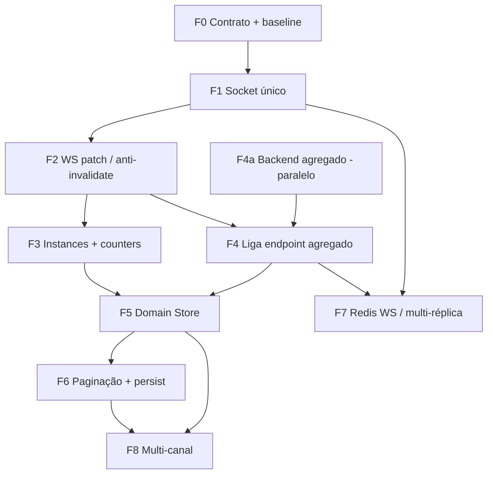

# Auditoria Enterprise — Chat Scale Readiness & Migration Plan

| Campo | Valor |
|---|---|
| **Task** | `AUDIT_CHAT_SCALE_READINESS` v1.0 |
| **Tipo** | Enterprise architecture & migration audit (somente leitura) |
| **Depende de** | `AUDIT_CHAT_REQUEST_OPTIMIZATION`, `AUDIT_CHAT_REALTIME_ARCHITECTURE` |
| **Data** | 2026-07-08 |
| **Escopo** | Plano de migração, certificação de escala, dívida técnica, governança futura |
| **Restrições** | Nenhuma alteração de código, arquitetura existente, comportamento ou componentes |

**Documentos-base:**

- Inventário HTTP / polling / WS→refetch: auditoria de otimização de requests
- Arquitetura atual + SoT + arquitetura de referência: [`AUDIT_CHAT_REALTIME_ARCHITECTURE.md`](./AUDIT_CHAT_REALTIME_ARCHITECTURE.md)

---

## 1. Propósito

Este documento é o **plano oficial de migração enterprise** do módulo Chat. Ele responde:

1. **Em que ordem** migrar, sem regressão funcional.
2. **Quais riscos** existem e como fazer rollback.
3. **Até que carga** a arquitetura atual aguenta — e o que falha primeiro.
4. **Como** a arquitetura alvo evita nova refatoração estrutural nos próximos anos.
5. **Quais regras** toda feature futura deve seguir.

**Resultado esperado:** roadmap executável, certificação de readiness e governança, para que implementação futura (fora desta auditoria) seja gradual, segura e reversível.

---

## 2. Resumo executivo

### 2.1 Veredicto

| Dimensão | Nota atual (0–10) | Após migração alvo |
|---|---|---|
| Correção funcional (poucos usuários) | **7** | 8–9 |
| Eficiência HTTP / realtime | **3** | 8–9 |
| Fonte única da verdade (frontend) | **2** | 9 |
| Multi-tenant (segurança de dados) | **7** | 8–9 |
| Escala horizontal WebSocket | **2** | 8 |
| Observabilidade operacional | **4** | 8 |
| Extensibilidade multi-canal | **3** | 8–9 |
| **Readiness enterprise geral** | **3.5 / 10** | **8.5 / 10** |

**Conclusão:** o Chat **já entrega valor** em escala pequena/média de tenant, mas **não está certificado** para milhares de empresas com dezenas de milhares de usuários simultâneos **sem** concluir as fases deste roadmap. O primeiro teto não é “falta de feature” — é **amplificação de requisições e sockets** somada a **Socket.IO single-node sem adapter Redis**.

### 2.2 Princípio norteador da migração

> **Contrato → transporte → cache → store → API de lista → paginação → escala horizontal → extensões de canal.**

Nunca inverter: extrair Domain Store **antes** de unificar socket e contrato de eventos cria store alimentada por duas fontes inconsistentes. Otimizar HTTP N+1 **sem** governança de WS→refetch apenas reduz um sintoma enquanto o float continua invalidando.

### 2.3 Ganho esperado ao final do roadmap (ordem de magnitude)

Com base nos fluxos medidos nas auditorias anteriores (N instâncias ≈ 4, float + shell ativos):

| Métrica | Hoje (sessão típica) | Após fases 0–6 |
|---|---|---|
| HTTP por mensagem recebida (float ativo) | ~7–9 | **0–1** (reconcile raro) |
| HTTP no idle/prefetch shell | ~20–25 (N+1 × 4) | **~3–5** (instances + 1 lista + counts) |
| Sockets por usuário em `/chat` | **2** | **1** |
| Fontes de conversas/mensagens | **3** | **1** |

---

## 3. Respostas obrigatórias

| Pergunta | Resposta |
|---|---|
| **Primeira mudança?** | **Fase 0 — Contrato de domínio** (eventos normalizados, regras SoT, checklist ADR, métricas baseline). Sem código de comportamento; só contrato + telemetria mínima. |
| **O que depende de quê?** | Socket único (F1) → merge WS no cache (F2) → Instance Registry + counters (F3) → endpoint agregado (F4) → Domain Store / extração Chat.tsx (F5) → paginação + persist unificado (F6) → WS horizontal / Redis (F7). F4 pode **preparar-se em paralelo** a F2/F3 no backend. |
| **O que pode em paralelo?** | Backend `GET /conversations` multi-instance (F4a); redução/coordenação de prefetch (F2b); observabilidade HTTP/WS (F0b); docs/ADR checklist. **Não** paralelo: F5 com F1 incompleto. |
| **Maior risco?** | Extração do Domain Store / split de `Chat.tsx` (F5); unificar socket se legacy+v2 double-fire não for coberto (F1). |
| **Maior ganho / menor esforço?** | F2 (merge `setQueryData` + remover listener duplicado); F3 (cache único de instances + counters derivados); coordenação de prefetch; F4 (fim do N+1). |
| **Arquitetura final?** | Ver §8 — Domain Store + Realtime Bridge único + Repository + UI observers; RQ como cache com keys unificadas; canal via adapters. |
| **Suporta anos de crescimento?** | **Sim, após F0–F7**; antes disso, crescimento multiplica custo linearmente e WS fica preso a 1 processo Node. |
| **Primeiro gargalo ao crescer?** | **(A)** Rajadas HTTP frontend × N usuários; **(B)** CPU/DB em `getConversations` N+1; **(C)** Socket.IO em processo único (sem Redis adapter). |
| **O que deve ser reestruturado?** | Dual socket; WS→invalidate; N+1 listas; SoT fragmentada; prefetch não coordenado; God component. Kanban/settings podem permanecer satélites. |
| **Risco de regressão arquitetural futura?** | **Alto sem governança** (§11). Com checklist + SoT única, risco cai para médio/baixo. |
| **Como obrigar novas features a seguir a arquitetura?** | ADR mestre + checklist de PR + proibição de `chatService` em UI + proibição de novo `io()` + keys só sob `['chat', …]`. |

---

## 4. Roadmap de migração (fases)

Cada fase: objetivo, mudanças, dependências, pré-requisitos, **critérios de início/conclusão**, rollback.

### Fase 0 — Contrato, baseline e governança

| Campo | Conteúdo |
|---|---|
| **Objetivo** | Congelar o contrato do domínio Chat e medição do “antes”. |
| **Mudanças** | Documentar DTO de eventos (v2 + mapeamento legacy); listar normalizers oficiais; checklist de PR; métricas baseline (HTTP/session, sockets/user, p95 lista). Sem mudança de runtime. |
| **Dependências** | Auditorias 1 e 2 (já existentes). |
| **Pré-requisitos** | Acesso a logs/ambiente com tráfego representativo. |
| **Início** | Kickoff + ADR apontando este doc. |
| **Conclusão** | Contrato publicado; baseline numérica anexada; checklist aprovado pelo time. |
| **Rollback** | Remover docs auxiliares; ADR marca fase como cancelada. Sem impacto runtime. |

### Fase 1 — Socket único (transporte)

| Campo | Conteúdo |
|---|---|
| **Objetivo** | Uma conexão Socket.IO por sessão; `Chat.tsx` consome bridge (`CustomEvents` / store), não `io({ forceNew })`. |
| **Mudanças** | Migrar listeners de `Chat.tsx` para o bridge global; feature flag `CHAT_SINGLE_SOCKET`; manter legacy+v2 com dedupe por `message_id` / signature. |
| **Dependências** | Fase 0 (contrato de eventos). |
| **Pré-requisitos** | Testes manuais reconnect, mobile, dual-tab. |
| **Início** | Flag off por default; canário interno. |
| **Conclusão** | Flag on; 0 sockets dedicados na página Chat; zero regressão de mensagem/lista em QA. |
| **Rollback** | Flag off → reativa `io()` local (caminho antigo). |

### Fase 2 — Realtime por patch (não por invalidate)

| Campo | Conteúdo |
|---|---|
| **Objetivo** | Float/Lead aplicam payload WS via `setQueryData` / store; um único listener de domínio. |
| **Mudanças** | Remover invalidate duplicado Provider+Window; merge message/conversation; invalidação só em gap/erro; coordenar prefetch (1× merge, não 4×). |
| **Dependências** | Fase 1 (eventos de uma fonte). |
| **Pré-requisitos** | Normalizers cobertos por testes unitários. |
| **Início** | Flag `CHAT_WS_PATCH`. |
| **Conclusão** | ≤1 HTTP excepcional por mensagem no float; preview/unread corretos. |
| **Rollback** | Flag off → invalidate (comportamento atual). |

### Fase 3 — Instance Registry + Contadores

| Campo | Conteúdo |
|---|---|
| **Objetivo** | Uma SoT de instâncias; unread derivado + reconcile raro. |
| **Mudanças** | Key RQ única `['chat','instances', tenantId, userId]`; NavUnread deixa de `listInstances` a cada refresh; counters derivados do mapa + reconcile 2–5 min ou pós-attendance. |
| **Dependências** | Fase 2 (patches mantêm unread no mapa). |
| **Pré-requisitos** | Seletores de unread estáveis. |
| **Conclusão** | 1× `listInstances` por sessão até invalidação; badge ≈ counts API no reconcile. |
| **Rollback** | Hook unread volta ao poll/refetch atual. |

### Fase 4 — API de lista agregada (fim do N+1)

| Campo | Conteúdo |
|---|---|
| **Objetivo** | Um HTTP para N instâncias (+ canal oficial). |
| **Mudanças** | Backend: `instanceIds[]` / omit = all enabled; Frontend: `fetchMerged` e Chat page usam endpoint único; indexes/EXPLAIN. |
| **Dependências** | Pode **desenvolver** em paralelo a F2/F3; **ligar** após F2 para não amplificar consumers ruins. |
| **Pré-requisitos** | Paridade de filtros (attendance, channelOrigin, groups). |
| **Conclusão** | 1 request/lista; latência p95 ≤ p95 atual do pior loop. |
| **Rollback** | Query param → legacy loop; frontend flag. |

### Fase 5 — Chat Domain Store + desacoplar `Chat.tsx`

| Campo | Conteúdo |
|---|---|
| **Objetivo** | SoT única; UI só observa/comando. |
| **Mudanças** | Introduzir store (RQ unificado e/ou Zustand); migrar slices: messages → conversations → instances; lead-profile sob keys `chat`; reduzir god-component. |
| **Dependências** | F1–F4 estáveis em produção. |
| **Pré-requisitos** | Paridade F5; suite E2E inbox/send/receive/float. |
| **Conclusão** | 0 estado paralelo de mensagens/conversas; CRM satélite separado. |
| **Rollback** | Feature flag por fatia; manter caminho useState até fatias verdes. |

### Fase 6 — Paginação, memória e persistência

| Campo | Conteúdo |
|---|---|
| **Objetivo** | Suportar dezenas de milhares de conversas/tenant no cliente sem dump completo. |
| **Mudanças** | Cursor no backend; janela quente no store; unificar `chatPageCache`/`persistentCache` ou deprecação controlada; virtualização lista (além de mensagens). |
| **Dependências** | Fase 5. |
| **Conclusão** | Inbox inicial ≤ K conversas (ex. 50–100); scroll carrega mais; F5 restaura via store. |
| **Rollback** | `?legacy=full` temporário (interno). |

### Fase 7 — Escala horizontal WebSocket & ops

| Campo | Conteúdo |
|---|---|
| **Objetivo** | Multi-réplica backend com fan-out consistente. |
| **Mudanças** | `@socket.io/redis-adapter` (ou pub/sub equivalente); sticky sessions no proxy **ou** adapter; métricas sockets/tenant; limites de reconnect. |
| **Dependências** | F1 (socket único no client). Recomendado após estabilizar tráfego HTTP (F2–F4). |
| **Pré-requisitos** | Redis HA; playbook reconnect storm. |
| **Conclusão** | 2+ réplicas Node; mensagem entregue em qualquer nó; dashboards. |
| **Rollback** | Escala 1 réplica + sticky; adapter off. |

### Fase 8 — Extensão multi-canal (quando produto exigir)

| Campo | Conteúdo |
|---|---|
| **Objetivo** | Novos canais sem nova árvore UI/HTTP. |
| **Mudanças** | Adapter backend por canal; `channel` + `channelAccountId`; UI filtro por canal; sem novo socket. |
| **Dependências** | F5+F6 (modelo unificado). |
| **Conclusão** | Segundo canal em produção sem fork de FloatingChat/Chat.tsx. |

---

## 5. Ordem de execução obrigatória



### 5.1 Nunca faça antes de…

| Evitar | Antes de concluir |
|---|---|
| Extrair Domain Store (F5) | F1 + F2 (fonte de eventos única e merge) |
| Deprecar `chatPageCache` | F5 com paridade F5 |
| Desligar poll unread completamente | F3 reconcile validado |
| Multi-réplica WS sem adapter | F7 (senão miss de eventos cross-node) |
| Novo canal Instagram/Telegram como cópia de UI | F5 (modelo unificado) |
| “Só otimizar prefetch” como projeto isolado sem F2 | F0 checklist — senão reaparece com invalidações |

### 5.2 Paralelo seguro

| Trabalho A | Trabalho B |
|---|---|
| F4a API agregada (backend) | F1 / F2 (frontend) |
| Observabilidade / métricas (F0b contínua) | Qualquer fase |
| Checklist ADR / CI lint de antipadrões | Qualquer fase |
| Prefetch coordinator (parte F2b) | F4a |

### 5.3 Bloqueantes

| Bloqueante | Bloqueia |
|---|---|
| F0 sem baseline | Não medir “done” de F2–F4 |
| F1 incompleto | F5 confiável |
| F2 incompleto | Desligar polls (F3) |
| F7 ausente | Claim de 10k+ CCU multi-host |

---

## 6. Matriz de riscos

| Mudança | Complexidade | Impacto | Risco | Rollback | Contingência |
|---|---|---|---|---|---|
| F0 Contrato | Baixa | Governança | Baixo | N/A docs | — |
| F1 Socket único | Média | Alto | **Médio-Alto** | Flag off | Dual-tab, reconnect, legacy fallback QA |
| F2 WS patch | Média | Crítico (HTTP↓) | Médio | Flag off → invalidate | Se miss: invalidate pontual só na thread |
| F3 Registry/counters | Baixa-Média | Alto | Médio | Hook legado | Badge drift → reconcile forçado |
| F4 Lista agregada | Média | Crítico | Baixo-Médio | Loop N+1 | Shadow: comparar counts merge vs agregado |
| F5 Domain Store | **Alta** | Crítico | **Alto** | Flags por fatia | Migração vertical (só messages) primeiro |
| F6 Paginação | Média-Alta | Alto escala | Médio | Full dump flag | Cursor buggy → limit fixo + “carregar mais” |
| F7 Redis WS | Média-Alta | Bloqueia CCU | Médio | 1 réplica | Sticky até adapter estável |
| F8 Multi-canal | Alta | Produto | Médio | Canal disabled | Feature flag por canal |

---

## 7. Estimativa de benefícios por etapa

Estimativas **relativas** (sessão com float + shell, N≈4). Não substituem baseline F0.

| Mudança | HTTP ↓ | CPU app ↓ | SQL ↓ | Memória client ↓ | UX |
|---|---|---|---|---|---|
| F1 Socket único | baixo (menos handshake) | médio WS | baixo | baixo | Menos reconnect glitch |
| F2 WS patch | **alto (−70–90% por msg)** | **alto** | **alto** | baixo | Mensagens mais “instant” no float |
| F2b Prefetch | **médio (−50% idle)** | médio | médio | médio | Menos cold contention |
| F3 Instances/counters | **médio (−30–50% no nav)** | médio | médio | baixo | Badge estável |
| F4 Agregado | **alto (−N× listas)** | **alto** | **alto** | baixo | Abertura inbox mais rápida |
| F5 Store | médio (elimina duplo estado) | médio | baixo | médio | Consistência página↔float |
| F6 Paginação | alto no load inicial | médio | alto | **alto** | Scroll inbox saudável em tenants grandes |
| F7 Redis | n/a HTTP | n/a | n/a | server mem ↔ Redis | Escala multi-host |

---

## 8. Arquitetura final de referência (enterprise)

### 8.1 Camadas

```
UI (ChatPage | Float | LeadEmbed | Nav | Kanban UI)
        ↓ selectors / actions apenas
Chat UI State (painéis, drafts, foco) — não domínio
        ↓
Chat Domain Store (SoT: instances, conversations, messages, derived counters)
        ↑ applyEvent()          ↑ commands
Chat Realtime Bridge (1× Socket)     Chat Repository (único HTTP)
        ↓                                  ↓
   Socket.IO (+ Redis adapter)         /api/chat/*
        ↑
   Webhooks / workers (UazAPI, Meta, futuros adapters)
```

### 8.2 Fluxo de atualização oficial

1. **Bootstrap:** Repository → Store (`loadInstances`, `loadInbox(cursor)`, `hydrateThread`).
2. **Realtime:** Bridge → `normalize` → `store.applyEvent` → selectors → UI.
3. **Comando:** UI → Store command → Repository → HTTP → eventual WS eco → applyEvent (idempotente).
4. **Reconcile:** Timer lento ou reconnect → Repository diffs → Store merge.

### 8.3 Modelo de escalabilidade

| Eixo | Estratégia |
|---|---|
| Usuários (CCU) | 1 socket/user; sticky **ou** Redis adapter; reconnect com backoff |
| Tenants | Rooms `tenant:{id}` + `user:{id}`; queries sempre com `tenant_id` |
| Conversas | Cursor + janela quente; virtualização |
| Instâncias | Registry; lista agregada |
| Canais | Adapters server-side; envelope único no cliente |
| Nodes | Stateless HTTP + shared Redis/pubsub para WS |

### 8.4 Modelo de expansão

Nova feature = **action + selector + (opcional) endpoint**.  
Nova UI = **observer**.  
Novo canal = **adapter + mapeamento para Conversation/Message**.  
Proibido: novo `io()`, novo `useQuery` de inbox fora de `['chat']`, novo `invalidateQueries(['floating-chat'])`.

---

## 9. Avaliação de escalabilidade (CCU)

Premissas: média 1–2 sockets/user hoje; float prefetch ligado; lista sem cursor; **1 processo Node** para WS (sem Redis adapter detectado no código).

| CCU | Estado atual (certificação) | Após F0–F4 + F1–F2 | Após F0–F7 |
|---|---|---|---|
| **100** | **OK** com folga operacional | Excelente | Excelente |
| **1.000** | **Viável** se tenants pequenos; hotspots em lista N+1 e float refetch | **OK** | Excelente |
| **5.000** | **Risco alto** — HTTP amplicado + WS single-node | Marginal se 1 node | **OK** com 2+ nodes + Redis |
| **10.000** | **Não certificado** | Não certificado (WS) | **Certificável** com ops + paginação (F6) |
| **50.000** | Impossível sem redesign transporte+dados | Impossível | Exige shards/tenancy partitioning + rate limits + media CDN — **planejar F9+** |
| **100.000** | Fora do desenho atual | Fora | Arquitetura cloud-native chat (serviço WS dedicado, filas) — **além deste roadmap core** |

### 9.1 Primeiros gargalos (ordem típica)

1. **Rajada HTTP** (prefetch + invalidate + N+1) → satura API e pool SQL.
2. **Queries de lista** sem cursor / scans por instância.
3. **Socket.IO em um processo** — CPU event loop + memória de rooms; miss cross-replica.
4. **Memória browser** com dump completo de conversas/mensagens.
5. **Workers sync/webhook** sob pico de mensagens (observável via `chatObservability` logs, sem métricas Prometheus dedicadas de chat CCU).

### 9.2 Multi-tenant

| Aspecto | Avaliação |
|---|---|
| Isolamento de dados REST | **Bom** — `tenant_id` nos controllers/acesso |
| Isolamento WS | **Bom** — salas `tenant:` / `user:` |
| Noisy neighbor HTTP | **Fraco** — um tenant com prefetch/float agressivo impacta pool compartilhado |
| Particionamento futuro | Provável por `tenant_id` (DB) + shard de rooms; não urgente antes de 5–10k CCU |
| LB | HTTP stateless OK; WS exige sticky **ou** Redis adapter (F7) |

---

## 10. Certificação enterprise (por área)

| Área | Nota atual | Bloqueios | Após roadmap | Certificado? |
|---|---|---|---|---|
| Realtime (correção em 1 página) | 7 | Dual path | 9 | Condicional |
| WebSocket (produto único node) | 4 | Sem Redis adapter; dual client socket | 8 | F7 |
| HTTP | 3 | N+1, invalidate, prefetch | 8–9 | F2–F4 |
| Cache | 3 | 3 SoTs | 9 | F5–F6 |
| React Query | 5 | Keys fragmentadas; uso como refetch bus | 8 | F2–F5 |
| Source of Truth | 2 | Fragmentação | 9 | F5 |
| Escalabilidade | 3 | Ver §9 | 8 | F4–F7 |
| Multi-tenant | 7 | noisy neighbor | 8–9 | F4 + rate limits |
| Observabilidade | 4 | Logs Uaz/opt-in; pouco CCU/queue | 8 | F0b contínua |
| Resiliência | 5 | Flag/reconnect ok; dual path confunde | 8 | F1–F2 |
| Manutenibilidade | 3 | Chat.tsx god; acoplamento | 8 | F5 |
| Extensibilidade | 3 | Canal = fork risco | 8–9 | F8 |

**Certificação “enterprise scale-ready”:** **NÃO** no estado atual.  
**Certificação “enterprise scale-ready”:** **SIM** após **F0–F7** com gates de QA e métricas verdes (§12).

---

## 11. Dívida técnica arquitetural

| Item | Impacto | Prioridade | Consequência futura | Urgência |
|---|---|---|---|---|
| Dual Socket.IO | Alto | P0 | Contagem CCU errada; bugs duplos | Imediata (F1) |
| WS → invalidateQueries | Crítico | P0 | Custo HTTP explode com usuários | Imediata (F2) |
| N+1 `getConversations` | Crítico | P0 | DB/API wall com multi-instance | Alta (F4) |
| SoT tripla (state/RQ/pageCache) | Crítico | P0 | Bugs “só no float / só no /chat” | Alta (F5) |
| Prefetch não coordenado | Alto | P1 | Cold start satura | Alta (F2b) |
| `listInstances` em cada unread | Médio | P1 | Tráfego constante | Média (F3) |
| God component `Chat.tsx` | Alto | P1 | Velocidade de feature → 0 | Média (F5) |
| Sem Redis WS adapter | Crítico p/ multi-host | P1 | Escala horizontal quebrada | Antes de 2ª réplica (F7) |
| Sem cursor inbox | Alto | P2 | Tenants grandes crash/slow UI | Pós F5 (F6) |
| Legacy+v2 paralelo | Médio | P2 | Double apply | F0/F1 |
| Keys `floating-chat` vs `lead-profile` | Médio | P2 | Cache drift | F5 |
| Observabilidade Chat fraca (métricas) | Médio | P1 | Voar cego em incidente | F0 contínua |
| Ops kanban poll 20s | Baixo | P3 | Ruído API | Quando ops crescer |

---

## 12. Operational readiness

| Capacidade | Hoje | Gap | Ação no roadmap |
|---|---|---|---|
| Logging integração | `chatObservability` / Uaz JSON stdout | Sem correlator request-id end-to-end padronizado no float | F0: correlation ids |
| Logging realtime FE | flags `VITE_CHAT_*`, logs em Chat.tsx | Pouco no float/bridge | F1: logs no bridge único |
| Métricas | parcial (`chatMetrics`, ops dashboard) | Sem series: sockets abertos, HTTP/chat/min, invalidate rate | F0b + F7 dashboards |
| Diagnóstico lista | `CHAT_LIST_LOG` / `VITE_CHAT_LIST_DIAG` | Opt-in, não produto | Manter + adicionar counters store |
| Troubleshooting multi-replica | N/A / sticky docs em outros módulos | Adapter ausente | F7 runbooks |
| Alertas | Não evidenciados para CCU chat | — | Definir SLOs: delivery lag, error rate send, WS disconnect rate |

**SLO sugeridos (após F2):**

- Delivery lag WS (server emit → client apply) p95 < 1s.
- HTTP `/conversations` p95 < orçamento definido pós-F4.
- Taxa de refetch pós-`message.created` → 0 (exceto reconcile).

---

## 13. Implementation guidelines (obrigatórias)

### 13.1 Princípios

1. HTTP carrega; WS atualiza.
2. Uma SoT de domínio no frontend.
3. Um socket por sessão.
4. UI não importa `chatService` (após F5; até lá, minimizar novos usos).
5. Idempotência em applyEvent.
6. Channel-agnostic no cliente.

### 13.2 Responsabilidades permitidas

| Camada | Pode | Não pode |
|---|---|---|
| UI | Render, input, abrir painel | `io()`, HTTP inbox, invalidate global |
| UI State Provider | Persist painéis/drafts | SoT de mensagens |
| Domain Store | Merge, selectors, commands | JSX |
| Realtime Bridge | Conectar, normalizar, applyEvent | Refetch HTTP |
| Repository | Chamadas API tipadas | Conocer React |

### 13.3 Padrões obrigatórios

- Keys: `['chat', resource, …scope]`.
- Pós-WS: `setQueryData` / `applyEvent`.
- Lista: endpoint agregado (pós-F4).
- Contadores: derivados + reconcile.
- Feature flags por fase.

### 13.4 Antipadrões proibidos

- Novo `io()` / `forceNew` em páginas.
- `invalidateQueries({ queryKey: ['floating-chat'] })` em reação a mensagem.
- Loop `for (instanceId)` de `getConversations` em UI (pós-F4).
- Segundo unread poller (respeitar `ChatNavUnreadProvider`).
- Prefetch sem `ensureQueryData` / stale check.
- Cópia de FloatingChat para “InstagramChat” paralelo.

### 13.5 Checklist PR (nova feature Chat)

- [ ] Altera domínio? → mudança no Store/Repository/Bridge, não só UI.
- [ ] Consome realtime? → via Bridge/Store, não socket novo.
- [ ] Novo HTTP? → justificado (bootstrap/comando/reconcile); sem N+1.
- [ ] Invalida cache? → escopo mínimo; nunca árvore inteira por mensagem.
- [ ] Multi-tenant? → `tenant_id` / inboxScope revisados.
- [ ] Observabilidade? → log/métrica em caminho crítico.
- [ ] Rollback? → flag ou caminho legado se fase ainda aberta.
- [ ] Conforme ADR [`AUDIT_CHAT_REALTIME_ARCHITECTURE`](./AUDIT_CHAT_REALTIME_ARCHITECTURE.md) + este doc?

---

## 14. Facilitação para novos desenvolvedores

| Problema hoje | Após roadmap |
|---|---|
| “Onde ponho o listener?” | Só no Bridge |
| “Por que float refetch?” | Não refetch — applyEvent |
| “Por que dois sockets?” | Não existem |
| Onboarding | Ler §8 + checklist; mapear fatias Store |

**Risco de complexidade:** F5 aumenta abstração no curto prazo; **reduz** complexidade operacional no longo prazo. Sem F5, complexidade cresce **supralinear** com cada superfície (Lead, Kanban, canal).

---

## 15. Certificação final

| Campo | Valor |
|---|---|
| **Nota atual** | **3.5 / 10** enterprise scale-ready |
| **Nota após migração (F0–F7)** | **8.5 / 10** |
| **Principais riscos** | Dual path realtime; amplify HTTP; WS single-node; god component |
| **Pontos críticos** | F1, F2, F4, F7 antes de CCU alto; F5 antes de multi-canal |
| **Obrigatório antes de “produção enterprise multi-host”** | F1 + F2 + F4 estáveis; **F7** se >1 réplica; F3 para não saturar counts; observability baseline |
| **Obrigatório antes de “mega-tenants / 10k+ conversas UI”** | F5 + F6 |
| **Conclusão executiva** | O Chat é **apto para crescimento controlado** sob a arquitetura atual, mas **não** como plataforma multi-tenant de alta concorrência sem o roadmap. A ordem **Contrato → Socket → Patch → Registry → Lista agregada → Store → Paginação → Redis** minimiza regressão e evita refatoração estrutural futura se a governança (§13) for aplicada. |

---

## 16. Mapa rápido: dívida ↔ fase

| Dívida (§11) | Fase que extingue |
|---|---|
| Dual socket | F1 |
| WS invalidate | F2 |
| Prefetch caótico | F2b |
| Instances/counters | F3 |
| N+1 | F4 |
| SoT / Chat.tsx / keys | F5 |
| Dump inbox / caches shadow | F6 |
| Multi-host WS | F7 |
| Multi-canal limpo | F8 |

---

## 17. Critérios de aceite desta auditoria

| Critério | Status |
|---|---|
| Sem alteração de código | ✅ |
| Sem implementação/otimização | ✅ |
| Roadmap com início/conclusão e rollback | ✅ |
| Ordem e paralelos explícitos | ✅ |
| Matriz de risco e benefícios | ✅ |
| Avaliação CCU 100→100k | ✅ |
| Arquitetura final + guidelines | ✅ |
| Certificação enterprise | ✅ |
| Fundamentado nas auditorias + código (WS single-node, N+1, dual socket, observabilidade parcial) | ✅ |

---

## 18. Próximo passo operacional (fora desta task)

1. Aprovar este documento como **ADR de migração Chat**.
2. Abrir épico por fase (F0…F7) com flags e QA gates.
3. Coletar **baseline F0** em staging/prod amostral antes de qualquer PR de F1.

*Documento oficial `AUDIT_CHAT_SCALE_READINESS`. Implementação somente após autorização explícita por fase.*
