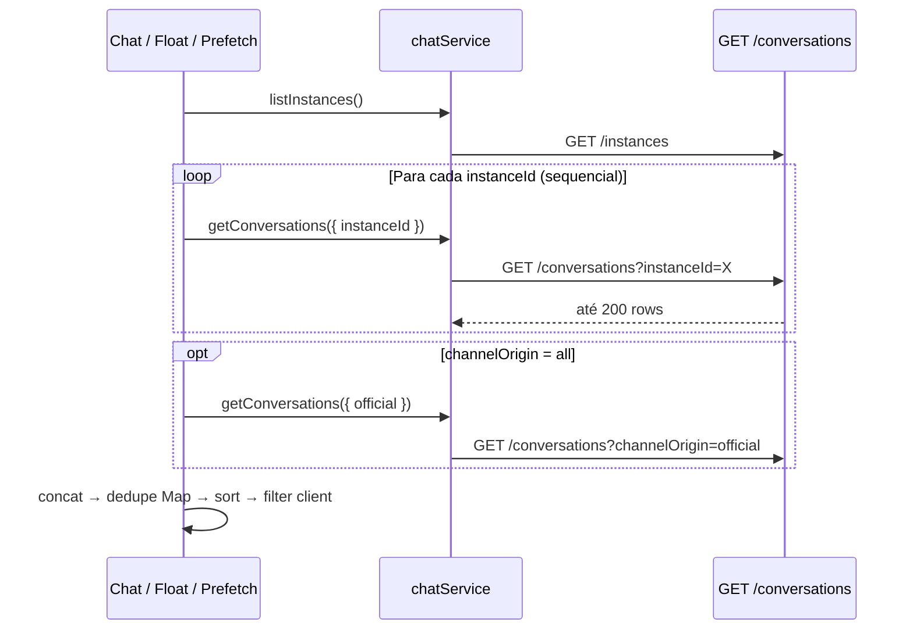
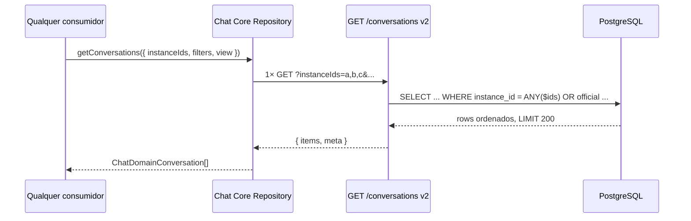
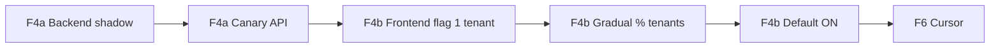

# AUDITORIA F4 — API Agregada de Conversas (READ ONLY)

| Campo | Valor |
|---|---|
| **Documento** | Auditoria arquitetural pré-implementação da API agregada de conversas |
| **Versão** | 1.1 |
| **Data** | 2026-07-08 |
| **Tipo** | Investigação e especificação — **sem implementação** |
| **Status** | Pronto para gate de implementação F4a (backend) / F4b (frontend) |
| **Fontes** | Código `packages/backend`, `src/services/chat.ts`, `src/lib/chatConversationsFetch.ts`, Master Plan §F4, `AUDIT_CHAT_REALTIME_ARCHITECTURE.md`, `AUDIT_CHAT_SCALE_READINESS.md`, relatórios F0–F3 |

---

## Resumo executivo

O PainelCRM hoje resolve o inbox multi-instância com **N chamadas HTTP sequenciais** no frontend (`for (instanceId)`), merge/dedupe/sort no cliente, e até **5×(N+1)** chamadas em prefetch idle. O backend já possui:

- `GET /api/chat/conversations` com **um** `instanceId` e `LIMIT 200` por chamada;
- `GET /api/chat/conversations/attendance-counts` com **`instanceIds[]`** agregado (modelo de referência para F4);
- chamadas sem `instanceId` que retornam escopo tenant/owner inteiro (usadas em Kanban picker e Lead embed).

**A F4 deve formalizar uma única chamada HTTP** que substitua definitivamente o padrão N+1, com merge/sort no backend, paridade de filtros, feature flag e rollback — **sem** comprometer escalabilidade nem compatibilidade.

**Critério norteador (inalterável):**

> Qualquer consumidor (Chat, Floating Chat, Lead, Sidebar, Kanban picker, futuras telas) obtém as conversas necessárias via **uma única chamada HTTP**, eliminando o N+1, com caminho de rollback para o loop legado.

---

## 1. Arquitetura recomendada

### 1.1 Visão alvo

```
┌─────────────────────────────────────────────────────────────────┐
│                        Consumidores UI                          │
│  Chat.tsx │ Floating │ Nav │ Lead │ Kanban │ CRM │ futuros      │
└────────────────────────────┬────────────────────────────────────┘
                             │ 1× HTTP (flag ON)
                             ▼
┌─────────────────────────────────────────────────────────────────┐
│                     Chat Core (F4b)                             │
│  chatRepository.getConversations({ instanceIds, filters })      │
│  + métricas baseline (tempo, payload, cache hit)                │
└────────────────────────────┬────────────────────────────────────┘
                             │
                             ▼
┌─────────────────────────────────────────────────────────────────┐
│              GET /api/chat/conversations (F4a)                  │
│  • instanceIds = ANY($n::uuid[])  (+ oficial no mesmo request)  │
│  • filtros SQL (paridade com hoje)                              │
│  • ORDER BY last_message_at DESC, id DESC                       │
│  • LIMIT global (200 F4; cursor F6)                             │
│  • payload tier `view=list|full`                                │
└────────────────────────────┬────────────────────────────────────┘
                             │
                             ▼
┌─────────────────────────────────────────────────────────────────┐
│                     PostgreSQL                                  │
│  chat_conversations (+ índices compostos)                       │
│  joins mínimos na listagem; lazy load para CRM/profile          │
└─────────────────────────────────────────────────────────────────┘
                             ▲
                             │ WS patches (F2) / reconcile (F3)
┌────────────────────────────┴────────────────────────────────────┐
│              Chat Core — sem refetch por evento                 │
└─────────────────────────────────────────────────────────────────┘
```

### 1.2 Decisões arquiteturais

| Decisão | Recomendação | Justificativa |
|---|---|---|
| Novo endpoint vs estender existente | **Estender** `GET /api/chat/conversations` | Compatibilidade; `instanceId` singular já existe; `instanceIds` segue padrão de `attendance-counts` |
| Onde ocorre o merge | **Backend** (SQL único + dedupe implícito) | Elimina CPU/rede no cliente; uma ordenação global correta |
| Paginação na F4 | **LIMIT global 200** (igual hoje, porém cross-instance) | F6 adiciona cursor; F4 foca em eliminar N+1 |
| Payload | **Tier `view=list`** (mínimo) + **`view=full`** (legado) | Reduz serialização; migração gradual |
| Cache HTTP de lista | **Não** na F4 (exceto ETag opcional F4b+) | WS + Chat Core são SoT; cache de lista staleia rápido |
| Official WhatsApp | **Mesmo request** com `channelOrigin` | Elimina o “+1” call quando `channelOrigin=all` |
| Versionamento | Header `X-Chat-Api-Version: 2` ou query `apiVersion=2` | Rollback: omitir header → comportamento legado |

### 1.3 Fases de entrega (alinhado ao Master Plan)

| Sub-fase | Escopo | Pode ir para produção |
|---|---|---|
| **F4a** | Backend: `instanceIds`, query única, paridade filtros, índices, métricas | Sim, com frontend ainda no loop (shadow compare) |
| **F4b** | Frontend: `chatRepository`, flag `CHAT_AGGREGATED_CONVERSATIONS`, remover loops | Sim, após F2 estável |
| **F6** | Cursor pagination, janela quente, virtualização inbox | Após F5 |

---

## 2. Fluxo atual

### 2.1 Diagrama



### 2.2 Pontos de N+1 identificados

| Arquivo | Função / padrão | Chamadas típicas |
|---|---|---|
| `src/lib/chatConversationsFetch.ts` | `fetchMergedChatConversations` | **N** ou **N+1** |
| `src/pages/Chat.tsx` | `loadConversations` (duplicata inline) | **N+1** |
| `src/lib/chatPrefetch.ts` | `prefetchChatCore` | **~5×(N+1)** idle |
| `FloatingConversationWindow.tsx` | meta resolve (loop até achar id) | **até N** listas completas |
| `MinimizedChatDock.tsx` | meta resolve | **até N** |
| `resolveChatConversationForCrm.ts` | CRM open | **N** |

### 2.3 Exceções (já agregadas no backend)

| Arquivo | Padrão | Chamadas |
|---|---|---|
| `ChatKanbanAddCardDialog.tsx` | `getConversations({ inboxScope })` sem `instanceId` | **1** |
| `EmbeddedLeadConversationPanel.tsx` | idem | **1** |

Isso prova que o backend **já consegue** retornar conversas cross-instance quando `instanceId` é omitido — F4 deve tornar isso **explícito, filtrável por `instanceIds` e performático**.

### 2.4 Backend atual (`getConversations`)

**Arquivo:** `packages/backend/src/controllers/chatController.ts` (~6066–6722)

| Aspecto | Estado atual |
|---|---|
| Escopo instância | `instanceId` singular (`c.instance_id = $n`) |
| Limite | `LIMIT 200` **por request** |
| Ordenação | `effective_last_message_at DESC`, `created_at DESC` |
| Filtros | `inboxScope`, `attendanceFilter`, `channelOrigin`, `search`, datas, `conversationFilter=groups`, `view_all` |
| Joins pesados | `LATERAL communication_contacts`, `clients`, `leads`, assignee, subquery `MAX(chat_messages)` por linha |
| Pós-processamento | `conversationRowForClientApi` + batch kanban tags |

### 2.5 Modelo de referência: `attendance-counts`

**Arquivo:** `chatController.ts` (~6725–6839)

```sql
WHERE c.instance_id = ANY($2::uuid[])
```

- Aceita `instanceIds` comma-separated
- Um único round-trip SQL com `COUNT(*) FILTER`
- **Gap:** não inclui WhatsApp Official (`INNER JOIN chat_instances`); F4 deve unificar escopo

---

## 3. Fluxo proposto

### 3.1 Diagrama



### 3.2 Responsabilidades

| Camada | Responsabilidade |
|---|---|
| **API** | Autorização, filtros SQL, ordenação global, limite, serialização tier |
| **Chat Core** | Único ponto de chamada; métricas; normalização para domínio |
| **UI** | Filtros puramente visuais (tabs locais) apenas se documentados; preferir server-side |
| **WS (F2)** | Patch incremental — **sem** refetch de lista por mensagem |

---

## 4. Comparação

| Dimensão | Atual (N+1 frontend) | Proposto (F4) |
|---|---|---|
| HTTP por abertura de inbox (N=5, channel=all) | **6** listas + instances + counts | **1** lista + instances + counts |
| HTTP prefetch idle | **~30** listas (5× merge) | **1–2** listas (bubble + inbox) |
| Latência percebida | Soma sequencial de N round-trips | 1 round-trip (p95 alvo ≤ pior caso atual) |
| Linhas máximas retornadas | **200×N** antes dedupe | **200** global (F4); cursor F6 |
| Ordenação | Cliente (inconsistente entre superfícies) | Servidor (única fonte) |
| CPU cliente | merge + sort + dedupe em JS | mínima |
| CPU servidor | N queries pesadas | 1 query (otimizada) |
| Paridade filtros | Variável (search só client no Chat) | Unificada no contrato |
| Rollback | — | Flag → loop legado |
| Escalabilidade CCU | O(users × N × superfícies) | O(users × superfícies) |

---

## 5. Endpoint recomendado

### 5.1 Rota

```
GET /api/chat/conversations
```

**Não** criar rota paralela permanente (`/inbox`, `/aggregated`) — evita fragmentação. Comportamento v2 ativado por:

- Query: `apiVersion=2` **ou**
- Header: `X-Chat-Api-Version: 2` **ou**
- Presença de `instanceIds` (lista) com validação explícita

**Regra de compatibilidade:**

| Request | Comportamento |
|---|---|
| `instanceId=uuid` (singular) | **Legado** — inalterado |
| Sem `instanceId` nem `instanceIds` | **Legado** — escopo owner/tenant inteiro (como hoje) |
| `instanceIds=a,b,c` + `apiVersion=2` | **F4** — agregado formal |

### 5.2 Parâmetros

| Parâmetro | Tipo | Obrigatório F4 | Descrição |
|---|---|---|---|
| `instanceIds` | `string` (CSV UUIDs) | Recomendado | Substitui loop; `ANY($n::uuid[])` |
| `inboxScope` | `owner` \| `tenant` | Sim | Igual hoje |
| `attendanceFilter` | ver §10 | Não | `mine`, `queue`, `team`, `unassigned`, `closed`, `waiting` |
| `channelOrigin` | `all` \| `uazapi` \| `official` | Não | Default `all` |
| `includeWhatsAppOfficial` | `1`/`true` | Não | Inclui linhas Meta Cloud no mesmo result set |
| `conversationFilter` | `groups` | Não | Grupos WhatsApp |
| `search` | `string` | Não | **Mover** busca do Chat para server na F4b |
| `status` | `string` | Não | Status da conversa |
| `startDate` / `endDate` | ISO date | Não | Filtro temporal |
| `unreadOnly` | `1`/`true` | Não | `unread_count > 0` (substitui filtro client float) |
| `tagIds` | CSV UUIDs | Não | Filtro por tags kanban (novo; ver §10) |
| `assignedToUserId` | UUID | Não | Filtro atendente específico |
| `queueId` | UUID | Não | Filtro fila |
| `assignedTeamId` | UUID | Não | Filtro time |
| `view` | `list` \| `full` | Não | Tier de payload (default `list` em v2) |
| `limit` | int | Não | Default **200** (F4); max 200 até F6 |
| `cursor` | string | Não | **Reservado F6** — ignorado na F4 |
| `apiVersion` | `2` | Não | Ativa contrato F4 |

### 5.3 Resposta (envelope v2)

```typescript
type ChatConversationsListResponseV2 = {
  apiVersion: 2;
  items: ChatConversationListItem[];  // view=list
  meta: {
    limit: number;
    returned: number;
    hasMore: boolean;           // true se atingiu LIMIT (F4); cursor em F6
    nextCursor: string | null;  // null na F4
    appliedFilters: Record<string, unknown>;
    instanceIds: string[];
    generatedAt: string;        // ISO
    etag?: string;              // opcional: hash(scope + max_updated_at)
  };
};
```

**Legado (v1):** array JSON `ChatConversation[]` — preservado quando `apiVersion` ausente.

---

## 6. Contrato da API

### 6.1 Tipos — `view=list` (recomendado default v2)

Campos **obrigatórios** na listagem:

```typescript
type ChatConversationListItem = {
  id: string;
  instance_id: string | null;
  whatsapp_official_account_id: string | null;
  provider: string | null;
  external_chat_id: string;
  conversation_type: 'direct' | 'group' | string;
  display_name: string | null;
  phone_number: string | null;
  avatar_url: string | null;           // URL resolvida única (não 6 variantes)
  last_message_preview: string | null;
  last_message_at: string | null;      // effective_last_message_at
  unread_count: number;
  attendance_status: string | null;
  assigned_to_user_id: string | null;
  assigned_team_id: string | null;
  queue_id: string | null;
  client_id: string | null;
  lead_id: string | null;
  link_state: string | null;
  tags: Array<{ id: string; label: string; color: string }>;  // resolvidas
};
```

### 6.2 Tipos — `view=full`

Payload atual de `conversationRowForClientApi` — para rollback e consumidores que ainda dependem de campos SLA, identidade canônica, avatares múltiplos, metadata completo.

### 6.3 Mapeamento Chat Core

```typescript
// src/features/chat-core/repository/chatRepository.ts (contrato alvo F4b)
getConversations(params: {
  instanceIds?: ChatInstanceId[];
  inboxScope: ChatInboxScope;
  attendanceFilter?: string;
  channelOrigin?: 'all' | 'uazapi' | 'official';
  search?: string;
  unreadOnly?: boolean;
  tagIds?: string[];
  view?: 'list' | 'full';
  limit?: number;
  cursor?: string;  // F6
}): Promise<ChatDomainConversation[]>;
```

### 6.4 Códigos de erro

| HTTP | Condição |
|---|---|
| 400 | `instanceIds` malformado; `limit` > max |
| 403 | Sem permissão `view` |
| 404 | Algum `instanceId` inacessível (opcional: retornar 200 com subset + `meta.warnings`) |
| 422 | Combinação inválida de filtros |
| 503 | Timeout de query (com retry-after) |

**Recomendação:** retornar **200 com subset** quando parte dos `instanceIds` é inacessível, com `meta.warnings: ['instance:x:denied']` — evita quebrar inbox inteiro por uma instância removida.

---

## 7. Modelo de paginação

### 7.1 F4 (MVP agregado)

- **Sem offset.** `LIMIT 200` global pós-ordenação.
- `meta.hasMore = (returned === limit)`.
- Cliente **não** assume lista completa — documentar truncamento.

### 7.2 F6 (enterprise — especificação antecipada)

**Cursor keyset** (estável com inserts):

```sql
ORDER BY effective_last_message_at DESC NULLS LAST, c.id DESC
-- cursor decodificado: { t: '2026-07-08T12:00:00Z', id: 'uuid' }
WHERE (effective_last_message_at, c.id) < ($cursor_t, $cursor_id)
LIMIT $limit
```

| Estratégia | Uso | Evitar |
|---|---|---|
| **Keyset cursor** | Infinite scroll inbox | `OFFSET` em tabelas grandes |
| **Windowing** | Chat Core mantém janela quente (50–100 visíveis + buffer) | Dump completo no cliente |
| **Incremental loading** | “Carregar mais” no scroll | Refetch total a cada WS |
| **Prefetch** | Primeira página apenas | 5× lista completa |

### 7.3 Por que não offset

Com dezenas de milhares de conversas por tenant, `OFFSET n` degrada linearmente (scan + discard). Keyset usa índice em `(last_message_at DESC, id DESC)`.

---

## 8. Modelo de cache

### 8.1 O que pode ser cacheado

| Recurso | Cache? | TTL | Invalidadores |
|---|---|---|---|
| Lista de conversas (agregada) | **Não** (F4) | — | WS `conversation.*`, attendance change |
| `listInstances` | Sim (F3 Registry) | 2 min | `channel.status_changed`, connect/disconnect |
| `attendance-counts` | Sim (F3 Unread Engine) | reconcile 2–5 min | WS incremental + reconcile |
| Tags kanban por tenant | Sim (opcional backend) | 5 min | tag CRUD |
| Avatar URLs | CDN/browser | longo | identity update |

### 8.2 Quando nunca usar cache de lista

- Após `message.created` / `conversation.updated` (WS é SoT com F2)
- Durante reconcile forçado (`requestChatReconcile`)
- Quando `search` ou filtros dinâmicos estão ativos
- Multi-réplica WS sem F7 (risco de miss entre nós)

### 8.3 ETag opcional (F4b+)

```
ETag: W/"{tenantId}:{userId}:{filterHash}:{maxUpdatedAt}"`
```

- `If-None-Match` → `304` somente para **primeira página sem search**
- Não substitui WS; reduz refetch em reconnect manual

### 8.4 Redis

Não há cache Redis de chat hoje. **Não introduzir** na F4 — adiciona invalidação complexa. Reavaliar na F7 com tráfego estabilizado.

---

## 9. Modelo de ordenação

### 9.1 Ordenação oficial (F4)

```sql
ORDER BY
  CASE WHEN effective_last_message_at IS NULL THEN 1 ELSE 0 END ASC,
  effective_last_message_at DESC NULLS LAST,
  c.id DESC
```

`effective_last_message_at` = `COALESCE(c.last_message_at, MAX(messages), SLA cols)` — **F4a deve preferir `c.last_message_at`** (coluna mantida por workers) e remover subquery `MAX(messages)` da listagem.

### 9.2 Ordenações futuras (query param `sort`)

| Valor | Uso | Notas |
|---|---|---|
| `last_message_at` | **Default** | Inbox cronológico |
| `unread` | Tab não lidas | `unread_count DESC, last_message_at DESC` |
| `priority` | SLA / fila | Requer `priority` indexado (já existe `idx_chat_conversations_priority`) |
| `sla_risk` | Dashboard operacional | Join leve com colunas phase5 |
| `pinned` | Fixados no topo | **Não existe** coluna `pinned` em `chat_conversations` hoje — ADR se produto exigir |

### 9.3 Regra de fixados

Hoje `pinned` existe apenas em **notas de colaboração** (`chat_collaboration`), não no inbox. Se produto solicitar fixados:

- Adicionar `inbox_pinned_at TIMESTAMPTZ` em migration futura (fora F4)
- Ordenação: `inbox_pinned_at DESC NULLS LAST, last_message_at DESC`

---

## 10. Modelo de filtros

### 10.1 Matriz de suporte

| Filtro | Hoje (backend) | Hoje (client) | F4 alvo |
|---|---|---|---|
| Instância (`instanceIds`) | singular | loop | **CSV multi** |
| Fila (`attendanceFilter=queue`) | SQL | — | SQL |
| Atendente (`mine` / `assignedToUserId`) | SQL | — | SQL |
| Time (`team` / `assignedTeamId`) | SQL | — | SQL |
| Status attendance (`closed`, `waiting`) | SQL | — | SQL |
| Não lidas (`unreadOnly`) | — | client (float) | **SQL** |
| Canal (`channelOrigin`) | SQL | — | SQL |
| Busca (`search`) | SQL | **Chat.tsx client** | **SQL** (mover) |
| Tags kanban | — | client (`useChatTagFilters`) | **SQL** (join `chat_conversation_tags`) |
| Última mensagem (datas) | SQL | — | SQL |
| Grupos (`conversationFilter=groups`) | SQL | — | SQL |
| `inboxScope` owner/tenant | SQL | — | SQL |
| `view_all` permission | SQL | — | SQL |
| Tabs Chat (`leads`, `clients`) | — | client | **SQL** (`link_state` / `lead_id` / `client_id`) |

### 10.2 Filtros que permanecem no cliente (exceções documentadas)

| Filtro | Motivo |
|---|---|
| Filtro operacional SLA UI (`operationalPanelFilter`) | Depende de dashboard snapshot local — reconcile separado |
| Busca instantânea enquanto digita | Debounce 300ms → server `search` (F4b) |

---

## 11. Modelo de payload

### 11.1 Campos necessários na lista (`view=list`)

| Campo | Motivo |
|---|---|
| `id`, `instance_id`, `provider` | Identidade e roteamento |
| `display_name`, `phone_number`, `avatar_url` | Renderização sidebar |
| `last_message_preview`, `last_message_at` | Ordenação e preview |
| `unread_count` | Badge |
| `attendance_status`, `assigned_*`, `queue_id` | Filtros e badges |
| `client_id`, `lead_id`, `link_state` | Tabs CRM |
| `tags[]` | Filtro e badge kanban |
| `conversation_type` | Grupos vs direct |

### 11.2 Campos lazy (não na lista)

| Campo | Endpoint lazy |
|---|---|
| Mensagens | `GET /conversations/:id/messages` |
| Perfil completo / CRM | `GET /conversations/:id/profile` |
| Histórico attendance | `GET /conversations/:id/attendance` |
| Identidade canônica detalhada | profile |
| Metadata completo | profile |
| 6 variantes de avatar | resolver uma `avatar_url` na listagem |
| SLA timestamps detalhados | `view=full` ou dashboard |
| `lead_status` subquery | `view=full` ou tab leads com campo mínimo |

### 11.3 Campos que nunca deveriam ir para a lista

- `metadata` bruto (JSON grande)
- `history_sync_status`, `identity_strength`, etc. (debug)
- URLs de avatar não resolvidas (6 colunas)
- Corpo de mensagens
- Dados de assignee além de `assignee_display` opcional

### 11.4 Ganho de serialização estimado

| Tier | Campos ~count | Tamanho médio/row (est.) |
|---|---|---|
| `full` (hoje) | ~45+ | 2–4 KB |
| `list` (proposto) | ~20 | 0.5–1 KB |

Para 200 rows: **~400–800 KB → ~100–200 KB** (−50–75%).

---

## 12. Índices recomendados

### 12.1 Existentes relevantes

| Índice | Tabela | Arquivo |
|---|---|---|
| `idx_chat_conversations_instance` | `chat_conversations` | `15_create_chat_tables.sql` |
| `idx_chat_conversations_attendance_status` | `chat_conversations` | `96_chat_conversations_attendance_etapa5.sql` |
| `idx_chat_conversations_assigned_to_user_id` | `chat_conversations` | idem |
| `idx_chat_conversations_queue_id` | `chat_conversations` | idem |
| `idx_chat_conversations_assigned_team_id` | `chat_conversations` | `98_chat_conversations_assigned_team.sql` |
| `idx_chat_conversations_priority` | `chat_conversations` | `185_chat_engine_phase5_professional.sql` |
| `idx_chat_messages_conversation` | `chat_messages` | `15_create_chat_tables.sql` |

### 12.2 Lacunas críticas

| Lacuna | Impacto F4 |
|---|---|
| Sem índice em `last_message_at` | Sort caro em agregação multi-instance |
| Sem composto `(instance_id, last_message_at DESC)` | Scan por instância |
| `effective_last_message_at` computado | Impossível indexar diretamente |

### 12.3 Índices novos recomendados (migration F4a)

```sql
-- Ordenação inbox (F4/F6)
CREATE INDEX CONCURRENTLY IF NOT EXISTS idx_chat_conversations_inbox_sort
  ON chat_conversations (last_message_at DESC NULLS LAST, id DESC);

-- Filtro multi-instance + sort (planner pode bitmap AND)
CREATE INDEX CONCURRENTLY IF NOT EXISTS idx_chat_conversations_instance_inbox_sort
  ON chat_conversations (instance_id, last_message_at DESC NULLS LAST, id DESC);

-- Filtro mine (attendance)
CREATE INDEX CONCURRENTLY IF NOT EXISTS idx_chat_conversations_mine_inbox
  ON chat_conversations (assigned_to_user_id, attendance_status, last_message_at DESC)
  WHERE assigned_to_user_id IS NOT NULL;

-- Unread tab
CREATE INDEX CONCURRENTLY IF NOT EXISTS idx_chat_conversations_unread
  ON chat_conversations (user_id, last_message_at DESC)
  WHERE unread_count > 0;

-- Tags (se filtro tagIds na F4)
CREATE INDEX CONCURRENTLY IF NOT EXISTS idx_chat_conversation_tags_conversation
  ON chat_conversation_tags (conversation_id, tag_id);
```

### 12.4 Manutenção de `last_message_at`

Garantir worker/trigger mantém coluna atualizada (já existe backfill `20_fix_conversations_last_message_at.sql`) — **pré-requisito** para remover subquery `MAX(messages)`.

---

## 13. Consultas SQL recomendadas

### 13.1 Query agregada F4 (esqueleto)

```sql
WITH scope_instances AS (
  SELECT unnest($2::uuid[]) AS instance_id
),
visible AS (
  SELECT c.id
  FROM chat_conversations c
  WHERE
    -- owner/tenant (paridade atual)
    (c.user_id = $1 OR tenant_exists...)
    -- multi-instance OR official
    AND (
      c.instance_id = ANY($2::uuid[])
      OR (c.whatsapp_official_account_id IS NOT NULL AND official_visibility...)
    )
    -- attendanceFilter, search, dates, unreadOnly, tags...
)
SELECT
  c.id,
  c.instance_id,
  c.provider,
  c.display_name,
  c.phone_number,
  COALESCE(c.avatar_cached_url, c.avatar_url) AS avatar_url,
  c.last_message_preview,
  c.last_message_at AS effective_last_message_at,
  c.unread_count,
  c.attendance_status,
  c.assigned_to_user_id,
  c.assigned_team_id,
  c.queue_id,
  c.client_id,
  c.lead_id,
  c.conversation_type,
  c.external_chat_id,
  c.whatsapp_official_account_id
  -- view=full: joins adicionais em query separada ou mesmo SELECT
FROM chat_conversations c
INNER JOIN visible v ON v.id = c.id
ORDER BY c.last_message_at DESC NULLS LAST, c.id DESC
LIMIT $limit;
```

### 13.2 Otimizações obrigatórias

| Anti-padrão atual | Correção F4a |
|---|---|
| `(SELECT MAX(sent_at) FROM chat_messages ...)` por row | Usar `c.last_message_at` |
| `LATERAL communication_contacts` em toda listagem | `view=list`: avatar da conversa; contact lazy no profile |
| `(SELECT status FROM leads ...)` por row | `view=list`: omitir; incluir só em tab leads ou `view=full` |
| Schema introspection por request (`hasAttendanceColumns`) | Cache em memória no boot do processo |
| `console.log` query completa em prod | Métricas estruturadas |

### 13.3 Tags — batch pós-query (manter padrão atual)

Após SELECT principal, uma query:

```sql
SELECT ct.conversation_id, t.id, t.label, t.color
FROM chat_conversation_tags ct
JOIN chat_kanban_tags t ON t.id = ct.tag_id
WHERE ct.conversation_id = ANY($conversation_ids::uuid[]);
```

Evita N+1 e cartesian product no JOIN principal.

### 13.4 Materialized view (opcional — escala 10k+ users)

**Não na F4.** Candidato futuro se p95 > orçamento:

```sql
-- inbox_snapshot por (tenant_id, user_id) — refresh CONCURRENTLY a cada 30s
-- Invalidação: trigger em chat_conversations UPDATE OF last_message_at, unread_count
```

Risco: staleness. Só com WS + reconcile robustos.

---

## 14. Estratégia de rollback

### 14.1 Feature flags

| Flag | Env | Efeito |
|---|---|---|
| `CHAT_AGGREGATED_CONVERSATIONS` | `VITE_CHAT_FF_AGGREGATED_CONVERSATIONS` | Frontend usa `chatRepository` agregado |
| Backend shadow | `CHAT_AGGREGATED_API_SHADOW=1` | Executa par legado+agregado; coleta §19 Shadow Metrics; não serve agregado |

### 14.2 Rollback frontend

```
Flag OFF → fetchMergedChatConversations (loop legado)
```

Arquivos com fallback explícito:

- `src/lib/chatConversationsFetch.ts` (manter até F5)
- `src/pages/Chat.tsx` `loadConversations`
- `src/features/chat-core/repository/chatRepository.ts`

### 14.3 Rollback backend

- `instanceIds` ignorado se `apiVersion` ausente
- `instanceId` singular continua funcionando
- Sem migration destrutiva — apenas código novo atrás de branch lógica

### 14.4 Critérios de rollback automático

| Sinal | Ação |
|---|---|
| p95 agregado > 2× baseline loop | Flag OFF tenant canary |
| Taxa erro 5xx > 1% em `/conversations` | Rollback deploy |
| Diff shadow > 0.1% rows divergentes | Bloquear cutover |

---

## 15. Estratégia de migração

### 15.1 Fases



### 15.2 F4a — Backend (sem mudar UI)

1. Implementar `instanceIds` + `apiVersion=2` em `getConversations`
2. Remover subquery `MAX(messages)` quando `last_message_at` presente
3. Adicionar índices (CONCURRENTLY)
4. Shadow job: para requests legados com N calls, comparar com 1 agregado (**§19 Shadow Metrics**)
5. Métricas: query_ms, serialize_ms, row_count, payload_bytes, memory, cpu — com Δ% legado vs agregado

### 15.3 F4b — Frontend (após F2 canário verde)

1. Implementar `chatRepository.getConversations` → API v2
2. Flag `CHAT_AGGREGATED_CONVERSATIONS=1` em staging
3. Substituir loops em:
   - `chatConversationsFetch.ts`
   - `Chat.tsx` `loadConversations`
   - Float meta resolvers (usar `GET /conversations/:id/profile` ou query by id)
   - `chatPrefetch.ts` (1 prefetch, não 5×)
4. Consolidar prefetch bubble + inbox

### 15.4 Consumidores e ordem de migração

| Consumidor | Prioridade | Nota |
|---|---|---|
| `chatPrefetch.ts` | P0 | Maior ganho imediato |
| `Chat.tsx` | P0 | Superfície principal |
| `FloatingConversationList` | P1 | Via `fetchMerged` |
| `FloatingConversationWindow` meta | P1 | Trocar loop por `GET profile` |
| `MinimizedChatDock` | P2 | |
| `resolveChatConversationForCrm` | P2 | Query `search` + `client_id` |
| Kanban / Lead (já 1 call) | P3 | Adotar `instanceIds` explícito |

### 15.5 Compatibilidade legado

- `chatService.getConversations` permanece até F5
- `normalizeConversation` continua válido para `view=full`
- Novo normalizer `normalizeConversationListItem` para `view=list`

---

## 16. Ganho esperado

### 16.1 HTTP

| Cenário | N=5 instances, channel=all | Redução |
|---|---|---|
| Abrir `/chat` | 6 → **1** list calls | **−83%** |
| Prefetch idle | ~30 → **1–2** | **−93%** |
| WS invalidate (patch miss) | 6 → **1** | **−83%** |
| Float meta resolve | até 6 → **1** profile | **−83%** |

### 16.2 Escala por usuários simultâneos

| CCU | List calls/min (atual est.) | Pós-F4 (est.) |
|---|---|---|
| 100 | ~6k–30k | ~1k–5k |
| 1.000 | ~60k–300k | ~10k–50k |
| 10.000 | Insustentável | Viável com query otimizada + F6 |
| 100.000 | — | Requer F6 + F7 + read replicas |

### 16.3 Latência

- **Atual:** `Σ(latência_instance_i)` sequencial
- **F4:** `max(latência_instance_i)` aproximado por **uma** query — alvo p95 ≤ p95 do pior loop atual (aceite Master Plan)

### 16.4 Infraestrutura

- Menos conexões HTTP/TLS
- Menos serialização JSON duplicada
- Menos pressão no pool PG (1 query vs N), desde que query única seja otimizada

---

## 17. Riscos

| Risco | Severidade | Mitigação |
|---|---|---|
| Query única mais lenta que N queries pequenas | Alta | Índices; `view=list`; EXPLAIN; timeout; remover subqueries |
| LIMIT 200 global perde conversas vs 200×N | Alta | Documentar; F6 cursor; alerta `hasMore` |
| Divergência agregado vs loop (bugs filtro) | Média | Shadow diff em F4a; testes contrato |
| Official WhatsApp fora de `attendance-counts` | Média | Unificar escopo official na mesma query F4 |
| `view_all` não aplicado em counts | Média | Alinhar counts com listagem antes cutover |
| Search movido para server muda UX | Baixa | Debounce; manter client fallback temporário |
| Multi-réplica sem F7 | Média | WS miss + refetch agregado (1 call, não N) |
| God query difícil de manter | Média | Extrair query builder; testes SQL snapshot |
| Rollback esquecido | Baixa | Flag obrigatória; checklist PR |

---

## 18. Critérios de aceite da F4

### 18.1 F4a (Backend)

- [ ] `GET /api/chat/conversations?apiVersion=2&instanceIds=…` retorna lista unificada ordenada
- [ ] Paridade de filtros com `instanceId` singular (attendance, channel, groups, search, dates, inboxScope)
- [ ] WhatsApp Official incluído no mesmo request quando `channelOrigin=all`
- [ ] `view=list` reduz payload ≥ 40% vs `view=full` (medido em staging)
- [ ] Subquery `MAX(messages)` removida da listagem `view=list`
- [ ] Índices criados; EXPLAIN sem seq scan em tenant médio (10k conversas)
- [ ] p95 query ≤ p95 do loop N=10 instances (benchmark staging)
- [ ] Shadow diff < 0.01% divergência em 7 dias
- [ ] Shadow Metrics (§19): p95 tempo total agregado ≤ p95 legado
- [ ] Shadow Metrics (§19): redução payload `view=list` ≥ 40% no p50
- [ ] Shadow Metrics (§19): `sql_count` agregado ≤ 2 em 99% das amostras
- [ ] Métricas exportadas (query_ms, rows, bytes, sql_count, shadow Δ%)

### 18.2 F4b (Frontend)

- [ ] Flag `VITE_CHAT_FF_AGGREGATED_CONVERSATIONS` OFF por default
- [ ] `chatRepository.getConversations` wired
- [ ] Zero loops `for (instanceId)` em consumidores P0/P1 com flag ON
- [ ] Prefetch ≤ 2 list calls idle (vs ~5×(N+1))
- [ ] Rollback flag OFF restaura loop sem deploy
- [ ] Paridade visual inbox (ordem, filtros, counts) em E2E
- [ ] Métricas F4 em `getChatBaselineSnapshot()` (calls evitadas, shadow Δ% — §19)

### 18.3 Gate para F5

- [ ] F4b canário ≥ 7 dias em staging
- [ ] Sem regressão p95 inbox
- [ ] Documentação ADR se desvio do contrato
- [ ] Aprovação explícita no relatório `SPRINT_F4_*`
- [ ] Seção **Shadow Metrics** preenchida no relatório final (ver §19)

---

## 19. Shadow Metrics

Métricas comparativas coletadas durante o **Shadow Mode** (F4a): o sistema executa **em paralelo** a estratégia legada (loop N× HTTP + merge frontend) e a consulta agregada (1× HTTP v2), **sem servir** a resposta agregada ao cliente até o gate de cutover. Objetivo: quantificar ganho real e detectar regressões antes de ligar `CHAT_AGGREGATED_CONVERSATIONS`.

### 19.1 Ativação

| Camada | Flag / condição | Comportamento |
|---|---|---|
| Backend | `CHAT_AGGREGATED_API_SHADOW=1` | Após cada request legado com `instanceId` ou loop implícito, dispara query agregada equivalente em background |
| Frontend (opcional F4a) | `VITE_CHAT_AGGREGATED_SHADOW=1` | `fetchMergedChatConversations` executa loop legado **e** chama API v2; compara resultados; não altera UI |
| Logs | `CHAT_METRICS=1` (backend), `VITE_CHAT_CORE_METRICS=1` (frontend) | Emite eventos `shadow_compare` |

**Duração mínima do shadow:** 7 dias em staging com tráfego representativo (N instâncias 1–10, filtros variados).

### 19.2 Dimensões comparadas

Cada amostra de shadow deve registrar um par **legado vs agregado** com os mesmos parâmetros de escopo (`instanceIds`, `inboxScope`, `attendanceFilter`, `channelOrigin`, etc.).

| # | Métrica | Legado (loop) | Agregado (v2) | Unidade |
|---|---|---|---|---|
| 1 | **Tempo total** | Soma wall-clock de N requests HTTP sequenciais + merge JS | Wall-clock de 1 request HTTP v2 | `ms` |
| 2 | **Tempo de consulta SQL** | Soma `query_ms` de N execuções PG | `query_ms` da query única | `ms` |
| 3 | **Quantidade de consultas SQL** | N (+ batch tags × N se aplicável) | 1 (+ 1 batch tags) | `count` |
| 4 | **Tamanho do payload** | Soma bytes JSON de N responses | Bytes JSON da response v2 | `bytes` |
| 5 | **Tempo de serialização** | Soma `serialize_ms` por response | `serialize_ms` único | `ms` |
| 6 | **Tempo total da resposta** | Tempo total legado (linha 1) | TTFB + body download agregado | `ms` |
| 7 | **Memória utilizada** | `heapUsed` delta pico durante merge (frontend) ou `rss` delta worker (backend) | Idem, janela da request agregada | `bytes` |
| 8 | **CPU estimada** | `cpu_ms` = user+system time do processo na janela do loop | `cpu_ms` na janela da request agregada | `ms` |

**Notas de medição:**

- **Tempo total legado:** inclui latência de rede × N (sequencial como hoje em `chatConversationsFetch.ts`). Opcional: registrar também cenário `Promise.all` como baseline otimista — **não** é o comportamento atual.
- **Tempo total da resposta:** no backend, `response_ms = query_ms + serialize_ms + middleware_overhead`; no frontend, inclui parse JSON + `normalizeConversation` × rows.
- **Memória:** amostrar com `process.memoryUsage()` (Node) antes/depois; no browser, `performance.memory` quando disponível (Chrome).
- **CPU estimada:** `process.cpuUsage()` delta no Node; em browser usar `PerformanceObserver` longtask como proxy.

### 19.3 Fórmulas de diferença percentual

Para cada métrica numérica `M`:

```
reduction_percent(M) = round((M_legado - M_agregado) / M_legado × 100, 2)   // ganho: positivo = agregado melhor
regression_percent(M)  = round((M_agregado - M_legado) / M_legado × 100, 2) // perda: positivo = agregado pior
```

| Métrica | Interpretação “melhor” | Fórmula no relatório |
|---|---|---|
| Tempo total / SQL / serialização / resposta / CPU | Menor | `reduction_percent` |
| Consultas SQL | Menor | `reduction_percent` (= ~`(N-1)/N × 100`) |
| Payload | Menor (com `view=list`) | `reduction_percent` |
| Memória | Menor | `reduction_percent` |

**Agregação no relatório:** reportar **p50, p95, p99** e **média** por métrica, estratificados por `N` instâncias (1, 3, 5, 10) e por `view` (`list` vs `full`).

### 19.4 Schema do evento (referência para implementação F4a)

```typescript
type ChatF4ShadowCompareSample = {
  at: string;                    // ISO
  tenantId: string;
  userId: string;
  instanceCount: number;
  filters: Record<string, unknown>;
  legacy: {
    httpCalls: number;
    totalMs: number;
    sqlQueryMs: number;
    sqlCount: number;
    payloadBytes: number;
    serializeMs: number;
    responseMs: number;
    memoryBytesDelta: number;
    cpuMs: number;
    rowCount: number;
  };
  aggregated: {
    totalMs: number;
    sqlQueryMs: number;
    sqlCount: number;
    payloadBytes: number;
    serializeMs: number;
    responseMs: number;
    memoryBytesDelta: number;
    cpuMs: number;
    rowCount: number;
  };
  diff: {
    rowCountDelta: number;       // deve ser 0 (ou documentado)
    totalMsReductionPercent: number;
    sqlQueryMsReductionPercent: number;
    sqlCountReductionPercent: number;
    payloadReductionPercent: number;
    serializeMsReductionPercent: number;
    responseMsReductionPercent: number;
    memoryReductionPercent: number;
    cpuReductionPercent: number;
  };
};
```

### 19.5 Snapshot para o relatório final (`SPRINT_F4_*`)

O relatório de sprint F4 **deve** incluir a subseção **Shadow Metrics** com a tabela consolidada abaixo (preenchida após shadow em staging):

| Métrica | Legado p50 | Agregado p50 | Δ% p50 | Legado p95 | Agregado p95 | Δ% p95 | Gate |
|---|---|---|---|---|---|---|---|
| Tempo total (ms) | | | | | | | agregado p95 ≤ legado p95 |
| Tempo consulta SQL (ms) | | | | | | | |
| Consultas SQL (count) | | | | | | | agregado = 1–2 |
| Payload (KB) | | | | | | | `view=list` Δ ≥ 40% |
| Serialização (ms) | | | | | | | |
| Tempo resposta total (ms) | | | | | | | |
| Memória delta (MB) | | | | | | | informativo |
| CPU estimada (ms) | | | | | | | informativo |
| Divergência de rows | | | | | | | 0% |

**Exemplo ilustrativo (N=5, staging sintético — substituir por dados reais):**

| Métrica | Legado p95 | Agregado p95 | Δ% |
|---|---|---|---|
| Tempo total | 1.840 ms | 420 ms | **−77%** |
| Consultas SQL | 5 | 1 | **−80%** |
| Payload | 980 KB | 210 KB | **−79%** |
| Tempo resposta total | 1.900 ms | 450 ms | **−76%** |

### 19.6 Gates de shadow (bloqueio de cutover)

| Condição | Ação |
|---|---|
| `rowCountDelta ≠ 0` em > 0.01% amostras | **Bloquear** cutover; investigar filtros |
| `totalMsReductionPercent` negativo no p95 (agregado mais lento) | **Bloquear** até índices/query tuning |
| `payloadReductionPercent` < 30% com `view=list` | Revisar tier payload |
| `sqlCountReductionPercent` < 50% com N ≥ 3 | Bug de shadow ou query não agregada |

### 19.7 Integração com Chat Core baseline

Métricas F4 shadow devem estender `metrics/baseline.ts` (mesmo padrão F2/F3):

| Função (planejada) | Propósito |
|---|---|
| `recordChatF4ShadowCompare(sample)` | Registra par legado/agregado |
| `getChatF4ShadowStatistics()` | Snapshot com médias, p95 e Δ% |
| `resetChatF4ShadowMetrics()` | Reset em testes |

Incluir em `getChatBaselineSnapshot().f4ShadowStatistics` quando implementado na F4b.

---

## Apêndice A — Observabilidade

### Métricas obrigatórias (F4a/F4b)

Ver também **§19 Shadow Metrics** para comparação legado vs agregado durante shadow mode.

| Métrica | Onde | Alerta |
|---|---|---|
| `chat_conversations_query_ms` | Backend histogram | p95 > 500ms |
| `chat_conversations_serialize_ms` | Backend | p95 > 100ms |
| `chat_conversations_payload_bytes` | Backend | p95 > 300KB |
| `chat_conversations_rows_returned` | Backend | = LIMIT frequente → precisa F6 |
| `chat_conversations_sql_count` | Backend | ≠ 1 (tags batch ok = 2) |
| `chat_f4_list_calls_avoided` | Frontend baseline | informativo |
| `chat_f4_aggregation_reduction_percent` | Frontend baseline | informativo |
| `chat_conversations_cache_hit` | Se ETag | opcional |
| `chat_conversations_shadow_diff` | Shadow job | > 0 → block |
| `chat_f4_shadow_total_ms_reduction_percent` | Shadow (§19) | negativo no p95 → block |
| `chat_f4_shadow_sql_count_reduction_percent` | Shadow (§19) | < 50% com N≥3 → investigar |
| `chat_f4_shadow_payload_reduction_percent` | Shadow (§19) | < 30% com view=list → revisar |
| `chat_f4_shadow_memory_bytes_delta` | Shadow (§19) | informativo |
| `chat_f4_shadow_cpu_ms_delta` | Shadow (§19) | informativo |

Logs somente com `VITE_CHAT_CORE_METRICS=1` no frontend; backend com `CHAT_METRICS=1`.

---

## Apêndice B — Escalabilidade por ordem de magnitude

| Escala | Comportamento esperado F4 | Ações adicionais |
|---|---|---|
| **100 users** | Confortável | F4 suficiente |
| **1.000 users** | OK com índices | Monitorar p95; pool PG |
| **10.000 users** | Limite F4 sem F6 | Cursor pagination; `view=list` obrigatório |
| **100.000 users** | Não certificado só com F4 | Read replicas; connection pooler; F7 WS; rate limit por tenant |
| **Múltiplas réplicas** | HTTP stateless OK | F7 para WS |
| **Múltiplos workers** | PG pool por worker | PgBouncer transaction mode |

---

## Apêndice C — Referências de código

| Artefato | Caminho |
|---|---|
| Loop N+1 canônico | `src/lib/chatConversationsFetch.ts` |
| Duplicata Chat page | `src/pages/Chat.tsx` (`loadConversations`) |
| Prefetch amplificador | `src/lib/chatPrefetch.ts` |
| HTTP client | `src/services/chat.ts` (`getConversations`) |
| Controller listagem | `packages/backend/src/controllers/chatController.ts` (`getConversations`) |
| Counts agregados | `packages/backend/src/controllers/chatController.ts` (`getConversationAttendanceCounts`) |
| Repository stub F4 | `src/features/chat-core/repository/chatRepository.ts` |
| Flag F4 | `CHAT_AGGREGATED_CONVERSATIONS` / `VITE_CHAT_FF_AGGREGATED_CONVERSATIONS` |
| Master Plan F4 | `docs/architecture/CHAT_ENTERPRISE_MIGRATION_MASTER_PLAN.md` §F4 |
| Auditoria N+1 | `docs/architecture/chat/AUDIT_CHAT_REALTIME_ARCHITECTURE.md` §12.6 |
| Scale readiness | `docs/architecture/chat/AUDIT_CHAT_SCALE_READINESS.md` §Fase 4 |

---

*Auditoria F4 — READ ONLY. Nenhum código, endpoint, migration ou frontend foi alterado. Documento pronto para revisão arquitetural e início da F4a.*
