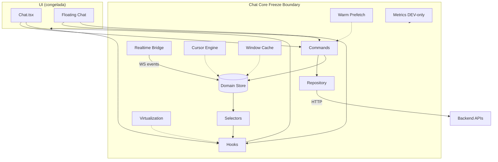

# F6.8 — Architecture Freeze Report

| Campo | Valor |
|---|---|
| **Sprint** | F6.8 |
| **Nome** | Architecture Freeze |
| **Data** | 2026-07-13 |
| **Tipo** | Hardening / documentação (sem novas funcionalidades) |
| **Código funcional alterado** | **Nenhum** |
| **Phase marker (código)** | `chatCore.phase = 'F6.6'` (último feature freeze) |
| **Certificação** | F6.7 + este freeze |

---

## Veredito

### Arquitetura F1–F6 **congelada**

A partir desta data, alterações estruturais em Chat Core, Domain Store, Commands, Repository, Realtime Bridge, Cursor, Window Cache, Virtualization e Performance Layer **exigem ADR**.

A F7 (Redis Distributed Realtime) evolui **sobre** esta base — não **dentro** dela.

---

## Arquitetura final



---

## Módulos e responsabilidades

| Módulo | Path | Responsabilidade | Freeze |
|---|---|---|---|
| Chat Core façade | `core/chatCore.ts` | API agregada + phase | 🔒 |
| Commands | `core/commands.ts`, `load*.ts` | Hidratação + mutations | 🔒 |
| Command Bridge | `core/chatCommandBridge.ts` | UI → command/legado | 🔒 (rollback) |
| Repository | `repository/*` | HTTP → domain | 🔒 |
| Domain Store | `store/*` | SoT estado | 🔒 |
| Realtime Bridge | `realtime/bridge.ts` | Socket único F1 | 🔒 |
| WS normalize/patch | `realtime/*`, `ws-patch/*` | Eventos → store/RQ | 🔒 |
| Cursor | F6.0–F6.1 | Paginação mensagens | 🔒 |
| Window Cache | F6.2 | Janela residente | 🔒 |
| Virtualization | F6.3–F6.4 | DOM viewport | 🔒 |
| Render opt | F6.5 | Selectors/batch/memo | 🔒 |
| Warm Prefetch | F6.6 | Idle prefetch | 🔒 |
| Metrics | `metrics/*` | DEV + `CHAT_CORE_METRICS` | 🔒 |

---

## Fluxos oficiais (sem bypass)

### HTTP

```text
UI / Bootstrap
    → Commands (loadInbox | loadMessages | loadMessagesCursor | …)
        → Repository / chatService
            → Domain Store (write)
                → Selectors → Hooks → UI
```

### Realtime

```text
Socket.IO
    → ChatRealtimeBridge.subscribe
        → syncStoreFromSocketEvent (+ dispatchBatch F6.5)
            → Reducers
                → Domain Store
                    → Hooks (useStableSelector) → UI
```

### Store → UI

```text
Domain Store
    → Selectors (chat / message / window / virt / cursor)
        → Hooks (useChat* / useFloating* / use*Virtualization / useConversationWarmup)
            → Components
```

### Commands → Reducers

```text
chatCoreCommands.*
    → optimistic: commands/begin + domain patch
    → HTTP (quando aplicável)
    → commands/confirm | commands/rollback
```

---

## Contratos congelados

Ver detalhe em:

| Doc | Conteúdo |
|---|---|
| [`PUBLIC_API_FREEZE.md`](./PUBLIC_API_FREEZE.md) | Commands + parâmetros |
| [`DOMAIN_STORE_FREEZE.md`](./DOMAIN_STORE_FREEZE.md) | State / actions / selectors / hooks |
| [`DEPENDENCY_GRAPH.md`](./DEPENDENCY_GRAPH.md) | Diagramas oficiais |
| [`FEATURE_FLAGS_AUDIT.md`](./FEATURE_FLAGS_AUDIT.md) | Flags |
| [`STATIC_DEPENDENCY_REPORT.md`](./STATIC_DEPENDENCY_REPORT.md) | Dívida / shadow / console |
| [`ADR-010-CHAT-ARCHITECTURE-FREEZE.md`](./ADR-010-CHAT-ARCHITECTURE-FREEZE.md) | Decisões |

---

## Residuais conscientes (não são bypass ativos)

| Residual | Quando STORE ON | Classificação |
|---|---|---|
| `Chat.tsx` `useState` | Muted (no-op set / leitura via hooks) | ROLLBACK |
| Floating `latestPage: false` | Dump integral ainda | ROLLBACK / Float sprint |
| TanStack virtual | Floating + STORE OFF | ROLLBACK |
| WS patch RQ | STORE OFF only | ROLLBACK |
| Satélites Kanban/Lead | Fora SoT Chat | ACTIVE satélite |
| `ui/patch` action | Sem creator | DEBT — reservado |
| `messages/evictPage` creator | Eviction interna | INTERNAL |

---

## Validação

| Check | Resultado |
|---|---|
| Suite store | **202/202** (2026-07-13) |
| HTTP pipeline único (STORE ON) | ✅ Commands → Store |
| Realtime pipeline único (STORE ON) | ✅ Bridge → Store |
| UI pipeline | ✅ Store → Selectors → Hooks |
| Telemetria prod | ✅ gated DEV + `CHAT_CORE_METRICS` |
| F7 liberada | ✅ [`F7_READINESS_REPORT.md`](./F7_READINESS_REPORT.md) |

---

## Regra pós-freeze

> Qualquer mudança em Commands, Repository, Store schema, Bridge contracts, Cursor, Window Cache, Virtualization engines ou Public Hooks **requer ADR** e revisão explícita de impacto em rollback flags.

F7 permitida: Redis adapter, multi-réplica, fan-out, flags `CHAT_REDIS_WS` — **sem** mudar o modelo de domínio frontend.
