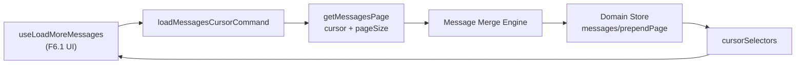

# Sprint F6.0 — Cursor Engine (Pagination Foundation)

| Campo | Valor |
|---|---|
| **Sprint** | F6.0 |
| **Nome** | Cursor Engine — Pagination Foundation |
| **Data** | 2026-07-13 |
| **Objetivo** | Fundação de paginação por cursor no Domain Store (sem mudança de UX) |
| **Feature Flag** | `CHAT_CORE_STORE` (escrita); telemetria `CHAT_CORE_METRICS` |
| **UX** | **Inalterada** — Chat continua com dump integral via `loadMessagesCommand` |

---

## Resumo executivo

A F6.0 adiciona a infraestrutura definitiva de **cursor pagination** para mensagens, sem botão Load More, infinite scroll ou virtualização.

```
[ F5 hoje ]  Repository → loadMessagesCommand → messages/set → UI
[ F6.0    ]  Repository → getMessagesPage → loadMessagesCursorCommand
              → messages/prependPage + cursor metadata → hooks (prontos)
```

`loadMessagesCommand` permanece o pipeline oficial de abertura de conversa.

---

## Pipeline Cursor



---

## Domain Store — novo estado

| Campo | Função |
|---|---|
| `cursorByConversationId` | Cursor ativo (alias de next) |
| `nextCursorByConversationId` | Próxima página (mais antiga) |
| `previousCursorByConversationId` | Página anterior |
| `hasMoreByConversationId` | Ainda há histórico |
| `loadingMoreByConversationId` | Load-more em voo |
| `loadedPagesByConversationId` | Páginas aplicadas |
| `lastLoadedCursorByConversationId` | Compat F5 |

### Actions novas / estendidas

| Action | Comportamento |
|---|---|
| `messages/prependPage` | Prepend + dedupe + atualiza cursor/hasMore/pages |
| `messages/setCursor` | Atualiza next/previous/hasMore (compat `cursor`) |
| `messages/setHasMore` | Flag hasMore |
| `messages/setLoadingMore` | Loading incremental |
| `messages/resetCursor` | Limpa metadados |
| `messages/set` | **Reset** de paginação (dump F5 = 1 página, hasMore=false) |

---

## Commands

| Command | Responsabilidade |
|---|---|
| `loadMessagesCursorCommand` | Busca página + prepend/set no store |
| `resetConversationCursorCommand` | Limpa cursor da conversa |
| `loadMessagesCommand` | **Inalterado** (hidratação integral) |

---

## Repository

- `getMessages()` — **inalterado**
- `getMessagesPage({ conversationId, cursor?, pageSize? })` — novo
  - Envelope cursor (`items`/`nextCursor`/`hasMore`) → `source: 'cursor'`
  - Array legado → dump integral, `hasMore: false` (`source: 'legacy'`)
  - Cursor legado client-side quando API ainda não pagina

---

## Selectors & Hooks

| API | Uso |
|---|---|
| `selectConversationCursor` | Snapshot completo |
| `selectConversationHasMore` | hasMore |
| `selectConversationLoadingMore` | loading |
| `selectConversationLoadedPages` | páginas |
| `selectConversationCanLoadMore` | hasMore && !loading |
| `useConversationCursor` | Hook de estado |
| `useLoadMoreMessages` | Dispara `loadMessagesCursorCommand` |

---

## Scroll Preservation Foundation

`store/scrollPreservation.ts`:

- `captureScrollAnchor` / `restoreScrollAnchor`
- Persistência em memória por conversa (pronto para F6.1)

---

## Diagnósticos

`metrics/cursorMetrics.ts` (DEV + `CHAT_CORE_METRICS`):

- `cursorRequests`, `cursorLatency`, `messagesPrepended`
- `duplicateMessagesDiscarded`, `cursorLoadTime`, `scrollPreservationTime`
- Logs: `[Cursor] load|prepend|merge|duplicate|hasMore|nextCursor|reset`

---

## Fora de escopo (próximas sprints)

- F6.1 — Botão Load More / Infinite Scroll
- F6.2 — Window Cache
- F6.3 — Conversation Virtualization
- F6.4 — Message Virtualization

---

## Testes

`store.f6.0.cursor-engine.test.ts` — **14 casos**:

- Primeira / intermediária / última página
- Sem mensagens / cursor inválido
- Merge ordem + duplicatas
- LoadingMore / HasMore / Reset
- Rollback `CHAT_CORE_STORE=OFF`
- Compat F5 (`messages/set` reseta cursor)
- Scroll foundation + métricas + legado

Suite store: **132 testes** passando.

---

## Critérios de aceite

| Critério | Status |
|---|---|
| Cursor no Domain Store | ✅ |
| Sem regressão UX | ✅ |
| Pipeline F5 intacto | ✅ |
| Infra pronta para Load More | ✅ |
| Infra pronta para Virtualização | ✅ |
| Rollback completo | ✅ |
| Testes verdes | ✅ |

---

## Arquivos principais

| Área | Path |
|---|---|
| Merge | `store/messageMerge.ts` |
| Actions/state | `store/actions.ts`, `store/state.ts`, `store/types.ts` |
| Fetch | `core/messagesPageFetch.ts` |
| Commands | `core/loadMessagesCursor.ts` |
| Selectors | `store/cursorSelectors.ts` |
| Hooks | `store/hooks/useConversationCursor.ts`, `useLoadMoreMessages.ts` |
| Scroll | `store/scrollPreservation.ts` |
| Metrics | `metrics/cursorMetrics.ts` |
