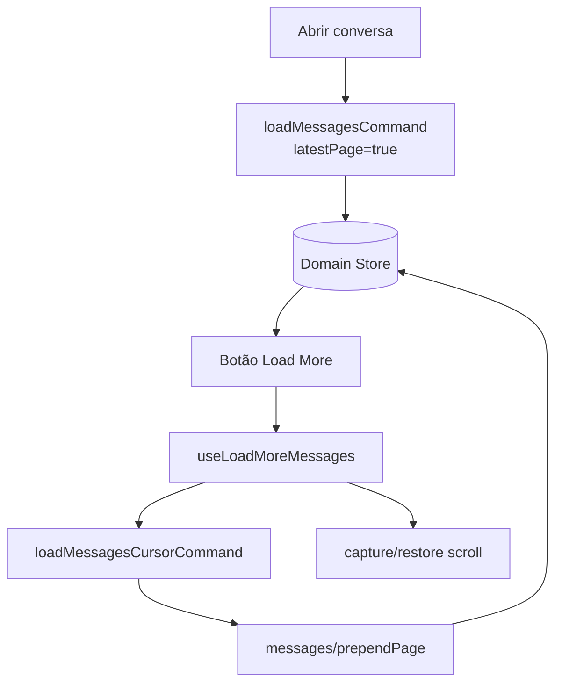

# Sprint F6.1 — Incremental Load More

| Campo | Valor |
|---|---|
| **Sprint** | F6.1 |
| **Nome** | Incremental Load More |
| **Data** | 2026-07-13 |
| **Objetivo** | Carregar histórico incrementalmente com botão Load More, preservando scroll |
| **Feature Flag** | `CHAT_CORE_STORE` (UI + última página); telemetria `CHAT_CORE_METRICS` |
| **Superfície** | Chat principal (`/chat`) — Floating sem botão nesta sprint |

---

## Resumo executivo

A F6.1 consome a Cursor Engine (F6.0) e ativa a primeira UX de paginação:

```text
Abrir conversa (store ON)
        │
        ▼
loadMessagesCommand → última página (pageSize=50)
        │
        ▼
Botão "Carregar mensagens anteriores" (se hasMore)
        │
        ▼
useLoadMoreMessages → loadMessagesCursorCommand
        │
        ▼
messages/prependPage + restore scroll
```

Com `CHAT_CORE_STORE=OFF`, comportamento legado (dump integral, sem botão).

---

## Fluxo



---

## Mudanças principais

| Área | Mudança |
|---|---|
| `loadMessagesCommand` | Store ON: `getMessagesPage({ latestPage: true })` + cursor metadata |
| Floating | `loadMessagesCommand(..., { latestPage: false })` — dump integral (sem botão) |
| `VirtualizedMessageList` | Prop opcional `loadMore` + barra no topo |
| `ChatLoadMoreMessagesBar` | Botão Idle / Loading / oculto |
| `Chat.tsx` | Wire `useLoadMoreMessages` + scroll container |
| `useLoadMoreMessages` | Guards + scroll + telemetria `[LoadMore]` |
| `messagesPageFetch` | Modo `latestPage` no fallback legado |

---

## Estados UI

| Estado | Condição |
|---|---|
| Idle | `hasMore && !loadingMore` — botão ativo |
| Loading More | `loadingMore` — botão desabilitado + spinner |
| No More Messages | `hasMore=false` — botão oculto |

---

## Guards

| Guard | Comportamento |
|---|---|
| Loading | Bloqueia se `loadingMore` / in-flight |
| HasMore | Bloqueia se `hasMore=false` |
| Cursor | Bloqueia cursor ausente ou repetido preso |
| inFlight (command) | Dedupa mesma página |

---

## Scroll

1. `captureScrollAnchor` antes do request  
2. `prependPage`  
3. 2× `requestAnimationFrame` + `restoreScrollAnchor`  
4. Modo virtualizado: ajuste existente em `useVirtualizedMessages` (prepend)

---

## Telemetria

`metrics/loadMoreMetrics.ts` (DEV + `CHAT_CORE_METRICS`):

- `loadMoreClicks`, `pagesLoaded`, `messagesPrepended`
- `scrollRestoreLatency`, `duplicateRequestsPrevented`, `loadMoreDuration`
- Logs: `[LoadMore] click|request|prepend|restore-scroll|completed|blocked`

---

## Fora de escopo

- Infinite scroll automático  
- Virtualização nova  
- Window cache / warm window  
- Floating Load More UI  

---

## Testes

`store.f6.1.incremental-load-more.test.ts` — **11 casos**

Suite store: **143 testes** passando.

---

## Critérios de aceite

| Critério | Status |
|---|---|
| Botão Load More funcional | ✅ |
| Mensagens antigas via prepend | ✅ |
| Sem replace completo da thread | ✅ |
| Scroll estável | ✅ |
| Sem request duplicado | ✅ |
| Rollback OFF | ✅ |
| Testes verdes | ✅ |

---

## Próximo

**F6.2 — Window Cache** / Infinite Scroll pode substituir o botão sem mudar o Domain Store.
