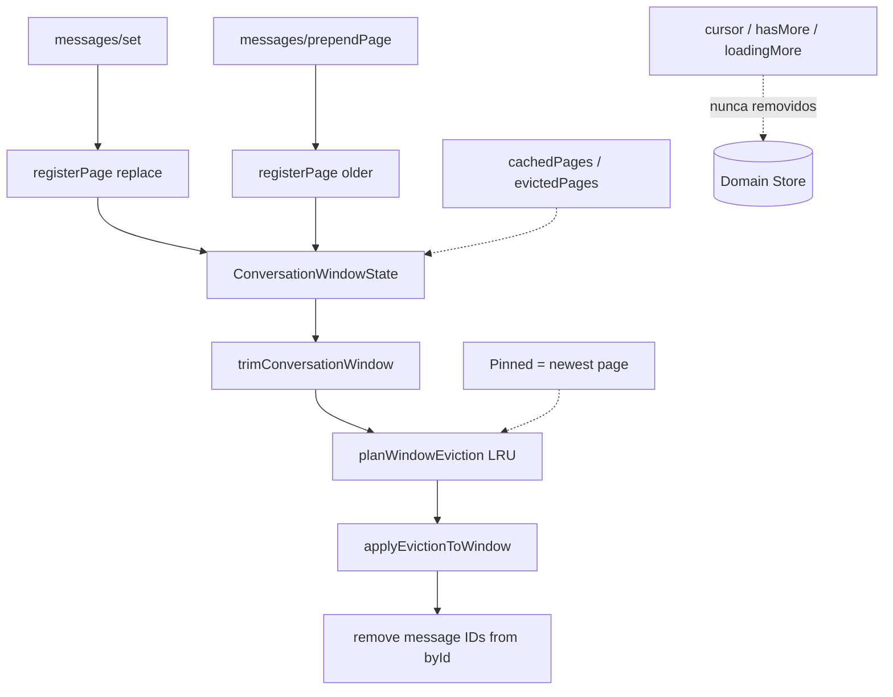

# Sprint F6.2 — Window Cache (Sliding Window Engine)

| Campo | Valor |
|---|---|
| **Sprint** | F6.2 |
| **Nome** | Window Cache / Sliding Window Engine |
| **Data** | 2026-07-13 |
| **Objetivo** | Manter apenas uma janela residente de páginas no Domain Store (~5 páginas / ~250 msgs) |
| **Feature Flag** | `CHAT_CORE_STORE` (rollback completo OFF); telemetria `CHAT_CORE_METRICS` |
| **UX** | Inalterada — sem virtualização nesta sprint |

---

## Resumo executivo

A F6.2 introduz o **Sliding Window Cache** por conversa. Páginas registradas em Load More / hidratação passam a residir numa janela limitada; páginas fora do limite são **evicted** (mensagens saem de `byId` / `byConversationId`), enquanto **cursor**, **metadata de página** e **estado de loading** permanecem.

```text
Abrir conversa
        │
        ▼
Página mais recente residente (pinned)
        │
        ▼
Load More → registerPage (older)
        │
        ▼
updateWindow + trim automático
        │
        ▼
Se exceder maxResidentPages / maxMessagesEstimate
        │
        ▼
Evict LRU (nunca pinned / viewport)
        │
        ▼
Store com tamanho praticamente constante
```

---

## Arquitetura



### Componentes

| Deliverable | Local |
|---|---|
| Sliding Window Cache | `store/windowCacheEngine.ts`, `windowCacheTypes.ts` |
| Page Registry | `cachedPagesByConversationId`, `residentPagesByConversationId` |
| Page Eviction Engine | `planWindowEviction` + `applyEvictionToWindow` + reducer `messages/evictPage` |
| Pinned Window | Newest page pinned por default; `messages/updateWindow` aceita `pinnedPageIds` |
| Memory Controller | `maxResidentPages=5`, `maxMessagesEstimate=250` |
| Window Diagnostics | `metrics/windowMetrics.ts`, hooks `useConversationWindow` / `useWindowMemory` |

### Estado novo (`MessageState`)

- `residentPagesByConversationId`
- `windowStartByConversationId` / `windowEndByConversationId`
- `cachedPagesByConversationId`
- `evictedPagesByConversationId`
- `memoryFootprintByConversationId`

### Actions

- `messages/registerPage`
- `messages/evictPage`
- `messages/updateWindow`
- `messages/rehydratePage`
- `messages/trimWindow`

Integração automática: `messages/set` registra a 1ª página; `messages/prependPage` registra + trim.

### Selectors / Hooks

- `selectResidentPages`, `selectWindowBounds`, `selectConversationMemoryUsage`, `selectEvictedPages`, `selectPinnedPages`
- `useConversationWindow`, `useWindowMemory`

---

## Limites

| Limite | Default | Override testes |
|---|---|---|
| `maxResidentPages` | 5 | `setWindowCacheLimitsForTests` |
| `maxMessagesEstimate` | 250 | idem |
| `bytesPerMessage` | 400 (estimativa) | idem |

Estratégia: **Sliding Window** + **LRU** entre páginas não pinned. Viewport default = página mais recente (fim da thread).

---

## Telemetria (`CHAT_CORE_METRICS`)

Logs: `[Window] register | move | pin | evict | reload | trim`

Métricas: `residentPages`, `evictedPages`, `windowMoves`, `windowHits`, `windowMisses`, `memorySavedBytes`, `pageReloads`, `averageResidentMessages`

---

## Compatibilidade

| Superfície | Impacto |
|---|---|
| Chat | Window ativo via store (sem mudança de UI) |
| Floating | Sem alterações de UX |
| Mobile / CRM / Kanban | Sem alterações |
| Cursor Engine (F6.0) | Intacto |
| Load More (F6.1) | Compatível — prepend dispara window + trim |
| Message Merge / Realtime | Não alterados |
| Rollback `CHAT_CORE_STORE=OFF` | Completo |

---

## Fora de escopo (próximas sprints)

- Conversation / Message Virtualization (F6.3 / F6.4)
- Infinite Scroll, Warm Window, Prefetch
- React.memo / render optimization
- Redis / Realtime Memory Sync

---

## Testes

Suite: `store.f6.2.window-cache.test.ts` (11 casos)

- Registrar página, mover janela, evict automático, pinned preservado, LRU, reload, cursor/metadata/scroll, rollback OFF, compat F6.1, stress 100 páginas

Suite store completa: **154** testes verdes.

---

## Critérios de aceite

| Critério | Status |
|---|---|
| Window Cache funcionando | ✅ |
| Janela residente limitada | ✅ |
| Eviction automática | ✅ |
| Sem perda de mensagens pinned / viewport default | ✅ |
| Cursor preservado | ✅ |
| Scroll helpers F6.0/F6.1 preservados | ✅ |
| Rollback OFF | ✅ |
| Testes verdes | ✅ |

---

## Próximo passo

**F6.3 — Conversation Virtualization**: renderizar apenas itens visíveis, usando a janela residente e rehydrate de páginas evicted sob demanda.
