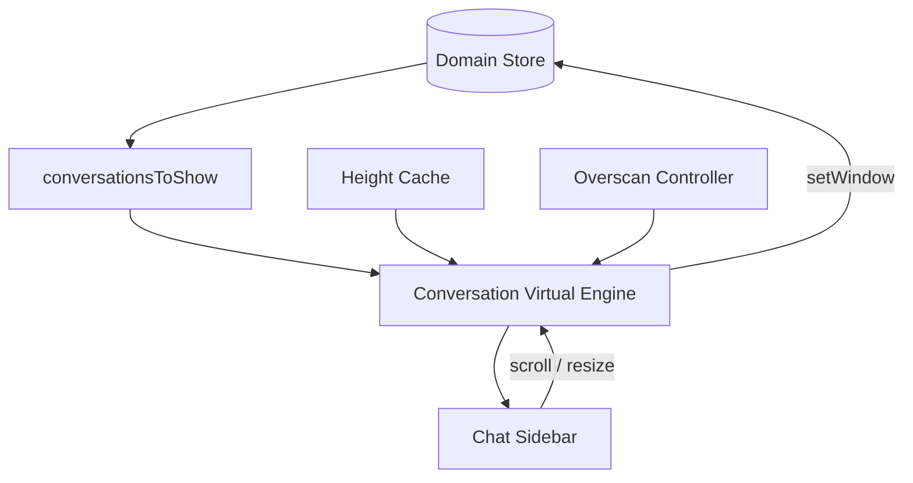

# Sprint F6.3 — Conversation Virtualization

| Campo | Valor |
|---|---|
| **Sprint** | F6.3 |
| **Nome** | Conversation Virtualization |
| **Data** | 2026-07-13 |
| **Objetivo** | Virtualizar a sidebar de conversas do Chat (viewport + overscan) |
| **Feature Flag** | `CHAT_CORE_STORE` (ON = virtualiza; OFF = `.map()` legado) |
| **Telemetria** | `CHAT_CORE_METRICS` |
| **UX** | Inalterada |

---

## Resumo executivo

Com `CHAT_CORE_STORE=ON`, a sidebar do Chat deixa de montar todas as conversas no DOM. O **Conversation Virtual Engine** calcula a janela visível + overscan; apenas esses itens são renderizados. O restante permanece no Domain Store.

```text
Domain Store
      │
      ▼
Conversation Selectors / lista filtrada (Chat.tsx)
      │
      ▼
Conversation Virtual Engine
      │
      ▼
Visible Window + Overscan
      │
      ▼
Sidebar (DOM constante)
```

Floating, Mobile overlay list path, Commands, Repository, Cursor Engine e Window Cache (F6.2) **não foram alterados**.

---

## Arquitetura



### Deliverables

| Item | Arquivo |
|---|---|
| Virtual Engine | `virtualization/conversationVirtualEngine.ts` |
| Visible Window | `virtualization/conversationWindow.ts` |
| Overscan | `virtualization/conversationOverscan.ts` |
| Height Cache | `virtualization/conversationHeightCache.ts` |
| Hooks | `useConversationVirtualization.ts`, `useConversationScroll.ts` |
| Metrics | `metrics/conversationVirtualizationMetrics.ts` |
| Store slice | `conversationVirtualization` em `ChatDomainState` |
| Selectors | `conversationVirtualSelectors.ts` |
| UI | `pages/Chat.tsx` (store ON) |

### Defaults

| Parâmetro | Valor |
|---|---|
| `estimatedRowHeight` | 76 |
| `overscan` | 10 |
| Override testes | `setConversationVirtualConfigForTests` |

---

## Store

```ts
conversationVirtualization: {
  enabled, visibleStart, visibleEnd,
  overscanStart, overscanEnd,
  scrollTop, viewportHeight
}
```

Actions: `conversationVirtualization/setWindow`, `conversationVirtualization/setEnabled`.

Selectors (nota: `selectConversationWindow` permanece o selector F6.2 de **mensagens**; a janela virtual de conversas é `selectConversationVirtualWindow`):

- `selectVisibleConversations`
- `selectConversationVirtualWindow`
- `selectConversationOverscan`
- `selectConversationRenderCount`

---

## Comportamento

- Scroll idêntico (altura total = soma das rows).
- Seleção / preview / realtime inalterados (lista filtrada continua vindo do store).
- Atualização realtime não reconstrói a lista inteira no DOM — só itens na janela.
- Viewport e scrollTop sincronizados no store (throttled via rAF).
- Rollback: `CHAT_CORE_STORE=OFF` → renderização completa legada.

---

## Telemetria

Logs: `[ConversationVirtual] render | move | overscan | recycle | cache-hit | cache-miss`

Métricas: `visibleRows`, `overscanRows`, `virtualizedRows`, `renderSavings`, `averageRenderTime`, `scrollFPS`, `windowMoves`, `heightCacheHits`, `heightCacheMisses`

---

## Testes

Suite: `store.f6.3.conversation-virtualization.test.ts` (12 casos)

Lista pequena/grande, overscan, scroll, realtime, seleção, resize, height cache, rollback OFF, stress 10k, performance constante, selectors.

Suite store: **166** testes verdes.

---

## Critérios de aceite

| Critério | Status |
|---|---|
| Apenas conversas visíveis + overscan renderizadas | ✅ |
| Scroll preservado | ✅ |
| Realtime / seleção OK | ✅ |
| Sem mudança visual intencional | ✅ |
| Renderização limitada (constante) | ✅ |
| Compatível com Window Cache F6.2 | ✅ |
| Rollback OFF | ✅ |
| Testes verdes | ✅ |

---

## Próximo passo

**F6.4 — Message Virtualization**: aplicar o mesmo padrão à thread de mensagens (além do `@tanstack/react-virtual` legado), alinhado ao Window Cache.
