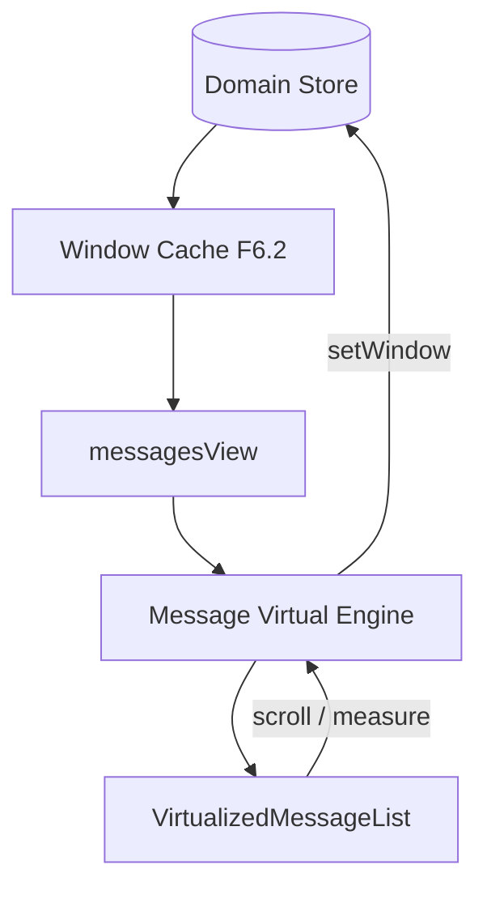

# Sprint F6.4 — Message Virtualization

| Campo | Valor |
|---|---|
| **Sprint** | F6.4 |
| **Nome** | Message Virtualization |
| **Data** | 2026-07-13 |
| **Objetivo** | Virtualizar a thread de mensagens via Domain Store (viewport + overscan) |
| **Feature Flag** | `CHAT_CORE_STORE` (ON = Message Virtual Engine; OFF = TanStack legado) |
| **Telemetria** | `CHAT_CORE_METRICS` |
| **UX** | Inalterada |

---

## Resumo executivo

Com `CHAT_CORE_STORE=ON` no Chat principal, a thread usa o **Message Virtual Engine** (F6.4) em vez de renderizar a lista inteira ou depender só do `@tanstack/react-virtual`. Floating permanece no caminho legado TanStack (sem alterações nesta sprint).

```text
Domain Store
      │
      ▼
Message Selectors / messagesView
      │
      ▼
Window Cache (F6.2 — resident pages)
      │
      ▼
Message Virtual Engine
      │
      ▼
Visible Message Window + Overscan
      │
      ▼
VirtualizedMessageList (mode: core)
```

---

## Arquitetura



### Deliverables

| Item | Arquivo |
|---|---|
| Message Virtual Engine | `virtualization/messageVirtualEngine.ts` |
| Height Cache | `virtualization/messageHeightCache.ts` |
| Overscan | `virtualization/messageOverscan.ts` |
| Hooks | `useMessageVirtualization.ts`, `useMessageScroll.ts` |
| Metrics | `metrics/messageVirtualizationMetrics.ts` |
| Store slice | `messageVirtualization` |
| Selectors | `messageVirtualSelectors.ts` |
| UI bridge | `useVirtualizedMessages` + `VirtualizedMessageList` |

### Defaults

| Parâmetro | Valor |
|---|---|
| `estimatedRowHeight` | 92 |
| `overscan` | 12 |
| Override testes | `setMessageVirtualConfigForTests` |

---

## Integração UI

| Condição | `mode` | Motor |
|---|---|---|
| Chat + `CHAT_CORE_STORE` ON + threshold | `core` | F6.4 Message Virtual Engine |
| Floating / store OFF | `legacy` | `@tanstack/react-virtual` |
| Abaixo do threshold | `off` | `.map()` integral |

Rollback: `CHAT_CORE_STORE=OFF` → caminho legado TanStack.

---

## Store

```ts
messageVirtualization: {
  enabled, visibleStart, visibleEnd,
  overscanStart, overscanEnd,
  scrollTop, viewportHeight, conversationId
}
```

Selectors: `selectVisibleMessages`, `selectMessageVirtualWindow`, `selectMessageOverscan`, `selectMessageRenderCount`.

---

## Comportamento

- Prepend (Load More): preserva scroll via delta de altura (âncora superior).
- Append realtime perto do fim: mantém bottom anchor.
- Update de status/edição: não reseta a janela virtual.
- Compatível com Cursor Engine (F6.0), Load More (F6.1) e Window Cache (F6.2).

---

## Telemetria

Logs: `[MessageVirtual] render | move | recycle | cache-hit | cache-miss | prepend | append`

Métricas: `visibleMessages`, `virtualizedMessages`, `overscanMessages`, `renderSavings`, `renderTime`, `scrollFPS`, `heightCacheHits`, `heightCacheMisses`, `messageRecycleCount`

---

## Testes

Suite: `store.f6.4.message-virtualization.test.ts` (12 casos)

Thread pequena/gigante, realtime append/update, Load More scroll, resize, height cache, rollback OFF, stress 50k, performance, Window Cache integrado, selectors.

Suite store: **178** testes verdes.

---

## Critérios de aceite

| Critério | Status |
|---|---|
| Somente mensagens visíveis + overscan | ✅ |
| Realtime sem reset de viewport | ✅ |
| Load More / scroll preservados | ✅ |
| Compatível Cursor + Window Cache | ✅ |
| DOM limitado (constante) | ✅ |
| Rollback OFF | ✅ |
| Floating intacto | ✅ |
| Testes verdes | ✅ |

---

## Situação F6 após esta sprint

| Sprint | Status |
|---|---|
| F6.0 Cursor Engine | ✅ |
| F6.1 Incremental Load More | ✅ |
| F6.2 Sliding Window Cache | ✅ |
| F6.3 Conversation Virtualization | ✅ |
| F6.4 Message Virtualization | ✅ |
| F6.5 Realtime Render Optimization | 🔜 |
