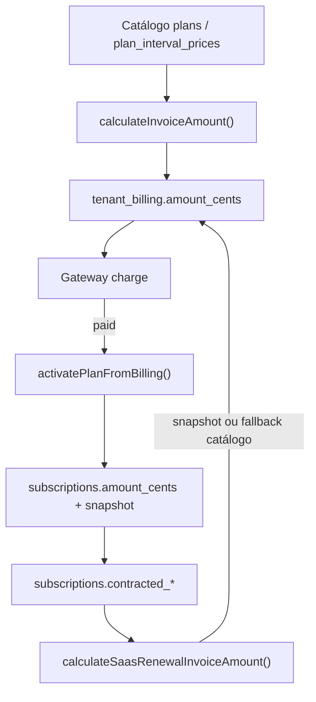

# AUDIT_TENANT_COMMERCIAL_OVERRIDES

**Modo:** READ ONLY  
**Objetivo:** Mapear a arquitetura comercial e de billing atual do PainelCRM e identificar o ponto seguro para introduzir **Tenant Commercial Overrides** (Sprint M), sem quebrar Billing, Subscription, Lifecycle ou relatórios.

**Escopo:** Plataforma SaaS (tenant paga o PainelCRM). CRM B2B2C (`customer_invoices`) é citado apenas onde há risco de confusão.

---

## Resumo executivo

O PainelCRM já separa **catálogo** (`plans`, `plan_interval_prices`) de **valor cobrado** (`tenant_billing.amount_cents`) e **contrato congelado** (`subscriptions.contracted_*`). Overrides comerciais por tenant devem entrar **antes da persistência da fatura**, num único motor de precificação, e propagar naturalmente para snapshot e renovação.

| Camada | Fonte de preço hoje | Override futuro |
|--------|---------------------|-----------------|
| Checkout | `calculateInvoiceAmount()` → catálogo | **Aplicar aqui** |
| Renovação SaaS | `calculateSaasRenewalInvoiceAmount()` → snapshot, fallback catálogo | **Aplicar após snapshot, antes da fatura** |
| Seat addon | Snapshot `contracted_price_per_user_cents` ou catálogo | Herda do contrato já overrideado |
| Superadmin charge manual | `amount_cents` opcional no body | Já permite override pontual; Sprint M formaliza |
| Lifecycle / Kanban | **Não lê preço** | **Não tocar** |
| MRR dashboard | `plans.price_cents` × tenants ativos | **Risco de distorção** — precisa camada analítica |

**Recomendação principal:** **Modelo B (override comercial por tenant)** integrado ao motor existente (`billingService.ts`), não plano gratuito separado nem bypass paralelo de billing.

---

# Parte 1 — Mapeamento da arquitetura atual

## 1.1 Planos

### Tabelas e migrations

| Tabela | Migration base | Papel |
|--------|----------------|-------|
| `plans` | `24_plans_and_plan_features.sql`, `38`, `42`, `43`, `90` | Catálogo comercial global |
| `plan_interval_prices` | `39_plan_interval_prices.sql` | Preço por assento/intervalo (planos `custom`) |
| `plan_features` | `24_*` | Features por plano |
| `tenant_plan` | histórico de mudanças de plano | Auditoria de troca |
| `tenants.plan_id` | vínculo atual | Plano atribuído ao tenant |

### Campos de valor

| Campo | Onde | Significado |
|-------|------|-------------|
| `plans.price_cents` | `plans` | Preço do ciclo para plano **standard** |
| `plan_interval_prices.price_per_user_cents` | por `billing_interval` | Preço unitário para plano **custom** |
| `plans.billing_interval` | `plans` | Intervalo default do plano (`monthly` / `yearly` no schema original) |
| `plans.is_free`, `free_access_days`, `trial_days` | `plans` | Acesso gratuito / trial de conversão (não é override por tenant) |
| `plans.plan_type` | `plans` | `standard` \| `custom` |

### Serviços e controllers

| Arquivo | Papel |
|---------|-------|
| `packages/backend/src/controllers/plansController.ts` | CRUD Superadmin |
| `packages/backend/src/routes/plansRoutes.ts` | `/api/superadmin/plans/*` |
| `packages/backend/src/services/billingService.ts` | **`calculateInvoiceAmount`**, validação de compra |
| `GET /api/plans` | Catálogo público |

### Respostas — Planos

| # | Pergunta | Resposta |
|---|----------|----------|
| 1 | Onde os planos são armazenados? | `plans` + `plan_interval_prices` (custom) |
| 2 | Qual campo representa valor? | `price_cents` (standard); `price_per_user_cents` (custom) |
| 3 | Existe suporte a múltiplos ciclos? | **Sim** — `monthly`, `quarterly`, `semi_annual`, `yearly` em faturas e `plan_interval_prices`; checkout escolhe intervalo |
| 4 | Existe suporte a addons? | **Parcial** — único addon SaaS formal: **seat addon** (`billing_reason = seat_addon`), prorata em `calculateSeatAddonProrata`. Sem catálogo de produtos addon |

---

## 1.2 Billing

### Tabelas centrais (SaaS)

| Tabela | Papel | Campos de preço |
|--------|-------|-----------------|
| `tenant_billing` | Fatura da plataforma | `amount_cents`, `plan_price_snapshot`, `plan_name_snapshot`, `billing_interval`, `users_count`, `billing_reason` |
| `subscriptions` | Contrato recorrente | `amount_cents`, `contracted_plan_price_cents`, `contracted_price_per_user_cents`, `pricing_snapshot_source` |
| `billing_recurring_jobs` | Fila de renovação | — |
| `subscription_cycles` | Ciclos e reconciliação | — |
| `tenant_billing_payment_attempts` | Tentativas multi-método | — |

### De onde vem o valor cobrado?



| Fluxo | Origem do valor | Persistido em |
|-------|-----------------|---------------|
| Checkout (`subscribePlan`) | Recalculado do catálogo | `tenant_billing.amount_cents` |
| Renovação worker | Snapshot contratado → fallback catálogo | Nova linha `tenant_billing` |
| Superadmin `POST .../billing/charge` | Catálogo ou **`body.amount_cents`** | `tenant_billing` |
| Troca de método de pagamento | Valor já na fatura | Sem recálculo |
| Seat addon | Prorata (snapshot ou catálogo) | `tenant_billing` |

### Respostas — Billing

| # | Pergunta | Resposta |
|---|----------|----------|
| 1 | De onde vem o valor cobrado? | Motor em `billingService.ts`; checkout/renovação recalculam; manual pode fixar |
| 2 | O valor é copiado do plano? | **No checkout, sim** (catálogo vigente). **Na renovação, preferencialmente do snapshot** |
| 3 | O valor é recalculado? | **Sim** em checkout e renovação; **não** ao trocar método de pagamento |
| 4 | O valor é persistido na assinatura? | **Sim** — `subscriptions.amount_cents` + `contracted_*` após pagamento via `persistContractSnapshotFromPaidBilling` |

Política documentada: `docs/BILLING_CONTRACTED_PRICING_POLICY.md`

---

## 1.3 Subscription

### Funções-chave

| Função | Arquivo | Papel |
|--------|---------|-------|
| `activatePlanFromBilling` | `subscriptionService.ts` | Ativa tenant; gate: `status === 'paid'` |
| `ensureSaasSubscriptionAfterPaidActivation` | `subscriptionService.ts` | Cria/atualiza `subscriptions` |
| `persistContractSnapshotFromPaidBilling` | `billingSubscriptionService.ts` | Congela preço contratado |
| `changeSubscriptionPlan` | `billingSubscriptionService.ts` | Upgrade/downgrade diferido |
| `cancelSubscription` / `expireCancelledSubscriptions` | `billingSubscriptionService.ts` | Cancelamento |
| `processOneSaasRenewalJob` | `recurringBillingJobService.ts` | Renovação + gateway |

### Respostas — Subscription

| # | Pergunta | Resposta |
|---|----------|----------|
| 1 | O plano é a única fonte de verdade? | **Não.** Hierarquia: **fatura paga** → **snapshot contratado** → **catálogo** (fallback) |
| 2 | Existe valor congelado na assinatura? | **Sim** — `contracted_plan_price_cents`, `contracted_price_per_user_cents` (migration `221`) |
| 3 | Onde um override teria impacto? | **`calculateInvoiceAmount` / `calculateSaasRenewalInvoiceAmount`**, preview checkout, `createTenantCharge` (opcional), propagação para snapshot no pagamento |

---

# Parte 2 — Fluxo financeiro completo

## Diagrama ponta a ponta

```text
┌─────────────────────────────────────────────────────────────────────────┐
│ CATÁLOGO GLOBAL                                                          │
│ plans.price_cents  |  plan_interval_prices.price_per_user_cents         │
└───────────────────────────────────┬─────────────────────────────────────┘
                                    │
                    ┌───────────────▼───────────────┐
                    │  calculateInvoiceAmount()      │  ← PONTO IDEAL OVERRIDE (checkout)
                    │  billingService.ts             │
                    └───────────────┬───────────────┘
                                    │
┌───────────────────────────────────▼─────────────────────────────────────┐
│ CHECKOUT                                                               │
│ PlanCheckout.tsx → POST /api/plan-purchase → subscribePlan()          │
│ createInvoice() → tenant_billing.amount_cents                          │
│ gateway.createCharge()                                                 │
└───────────────────────────────────┬─────────────────────────────────────┘
                                    │ webhook / polling → status=paid
┌───────────────────────────────────▼─────────────────────────────────────┐
│ SUBSCRIPTION ACTIVATION                                                │
│ activatePlanFromBilling()                                              │
│   → tenants.status=active, activated_billing_id                        │
│   → subscriptions.amount_cents = billing.amount_cents                  │
│   → persistContractSnapshotFromPaidBilling()                           │
│   → observeBillingLifecycleEvent + promoteLifecycleCard                │
│       (subscription.activated)                                         │
└───────────────────────────────────┬─────────────────────────────────────┘
                                    │
┌───────────────────────────────────▼─────────────────────────────────────┐
│ RECORRÊNCIA                                                            │
│ billing:scheduler → billing_recurring_jobs                             │
│ billing:worker → calculateSaasRenewalInvoiceAmount()                     │
│                  ← PONTO IDEAL OVERRIDE (renovação)                    │
│               → tenant_billing (plan_renewal)                            │
│               → advanceSubscriptionAfterCompletedCycle                   │
│ Pagamento → activatePlanFromBilling (re-emite subscription.activated)  │
└───────────────────────────────────┬─────────────────────────────────────┘
                                    │
┌───────────────────────────────────▼─────────────────────────────────────┐
│ TRIAL / OVERDUE / CANCEL                                               │
│ trial: expireTrialsPastDue → trial.expired (sem preço)                 │
│ overdue: syncOverdueBillingStatuses → subscription.overdue (shadow)    │
│ cancel: subscription.cancelled                                         │
└─────────────────────────────────────────────────────────────────────────┘
```

## Onde o preço é lido / persistido / usado

| Etapa | Lido de | Persistido em | Usado para |
|-------|---------|---------------|------------|
| Checkout preview | Catálogo | — | Exibição UI |
| Criação fatura | `calculateInvoiceAmount` | `tenant_billing.amount_cents` | Cobrança gateway |
| Ativação | `tenant_billing` pago | `subscriptions.*`, snapshot | Contrato futuro |
| Renovação | Snapshot → catálogo | Nova `tenant_billing` | Cobrança recorrente |
| Upgrade diferido | `calculateInvoiceAmount` | `subscriptions` (sem fatura imediata) | Próximo ciclo |
| Seat addon | Snapshot unitário | `tenant_billing` prorata | Expansão assentos |
| Trial conversion | Igual checkout pago | Igual ativação | `subscription.activated` |
| Overdue | Não recalcula preço | `tenant_billing.status` | Bloqueio / notificação |
| Superadmin MRR | **`plans.price_cents`** | — | **Não usa override nem snapshot** |

---

# Parte 3 — Compatibilidade com Lifecycle

## Sprints existentes

| Sprint | Componente | Dependência de preço? |
|--------|------------|----------------------|
| **G** | `lifecycleRouter`, `lifecycleDefaultRoutes` | **Nenhuma** |
| **H** | `lifecycleBillingObserver` | **Nenhuma** — shadow observe |
| **I** | `promoteLifecycleCard` | **Nenhuma** — move por `tenantId` / lead |
| **J** | Dashboard `ops_lifecycle_transitions` | **Nenhuma** |
| **K** | `trialRecoveryLifecycleService` + job | **Nenhuma** — tempo em colunas |
| **K.2** | `trialExpirationJob` | **Nenhuma** |
| **L** | **Não existe** no repositório | — |

## Cenário: Pro R$99 com override R$0

| Evento | Continua gerando? | Condição real |
|--------|-------------------|---------------|
| `subscription.activated` | **Sim** | `tenant_billing.status === 'paid'` — **não verifica amount > 0** |
| `trial.expired` | **Sim** (se trial sem pagamento) | `activated_billing_id IS NULL`, `trial_ends_at` vencido |
| `subscription.overdue` | **Sim** (shadow) | Fatura vencida com `amount_cents` qualquer (inclui R$0) |
| `subscription.cancelled` | **Sim** | Cancelamento de assinatura / fim de período |

**Conclusão:** Lifecycle **não presume valor > 0**. Tenant R$0 ativo via fatura paga zero (ou manual) ainda promove para Expansão / Novo Cliente.

**Atenção operacional:** `subscription.activated` **re-dispara em toda renovação paga** — relevante para tenants em board Reativação (Sprint K).

---

# Parte 4 — Parceiros gratuitos — comparação de modelos

| Critério | A) Plano gratuito especial (`is_free`) | B) Override 100% no plano Pro | C) Billing bypass |
|----------|----------------------------------------|----------------------------------|-------------------|
| Impacto arquitetural | Médio — segundo plano no catálogo, features distintas | **Baixo** — estende motor existente | Alto — fluxo paralelo, exceções em gateway |
| Lifecycle | OK se ativar via pagamento ou trial path | **OK** — mesmo `plan_id`, eventos normais | Risco — ativação sem fatura padrão |
| Snapshot / renovação | Preço catálogo R$0 | **Override → fatura R$0 → snapshot R$0** | Inconsistente se não passar por `tenant_billing` |
| Relatórios MRR | Conta como plano free (preço catálogo) | **Distorção** se MRR usar `plans.price_cents` | Alta distorção |
| Refatoração futura | Duplicar planos por parceiro | **Uma tabela de override** | Muitos `if (partner)` espalhados |
| Já existe no código? | **Parcial** (`is_free`, `free_access_days`) | **Parcial** (`amount_cents` manual no charge) | Não formalizado |

### Recomendação

**Modelo B (override comercial)** com suporte a:

- preço fixo por tenant (`final_amount_cents`)
- desconto percentual / absoluto
- isenção temporária (`valid_until`)
- vitalício (`valid_until = null` + flag)

Usar **plano gratuito (A)** apenas para produto “Free tier” público, não para parceiros negociados individualmente no Pro.

**Evitar Modelo C** — quebraria `BILLING_CONTRACTED_PRICING_POLICY` e auditoria de `tenant_billing`.

---

# Parte 5 — Relatórios e métricas

## Como métricas são calculadas hoje

| Métrica | Arquivo | Fórmula | Usa override? |
|---------|---------|---------|---------------|
| **MRR** | `superadminDashboardService.ts` | Σ `plans.price_cents` normalizado / tenant `active` | **Não** |
| **Recebido no mês** | idem | Σ `tenant_billing.amount_cents` WHERE `paid` | **Sim** (valor real) |
| **Reports “receita estimada”** | `reportsController.ts` | `COUNT(active) × price_cents` | **Não** |
| **Platform billings list** | `superadminPlatformBillingsController.ts` | Linhas reais | **Sim** |

## Tenant Pro R$99 → override R$0

| Visão | Aparece como |
|-------|--------------|
| Cliente ativo | **Sim** (`tenants.status = active`) |
| Cliente pagante (MRR) | **Sim, como R$99** (catálogo) — **distorção** |
| Receita caixa | **R$0** se faturas pagas forem zero |
| Receita estimada (reports) | **R$99** por tenant — **distorção** |

### Risco de distorção

| Área | Risco |
|------|-------|
| MRR / adoption reports | **Alto** — ignoram `contracted_*` e overrides |
| Cash / platform billings | **Baixo** — reflete `amount_cents` real |
| Export CSV plans | **Médio** — usa catálogo |

**Sprint M deve incluir** (fase analítica, não bloqueante): métricas “MRR contratado” vs “MRR catálogo” usando `subscriptions.contracted_*` ou override ativo.

---

# Parte 6 — Estrutura recomendada (Sprint M — proposta, sem implementar)

## 6.1 Nova tabela sugerida

```text
tenant_commercial_overrides
```

| Campo | Tipo | Descrição |
|-------|------|-----------|
| `id` | uuid | PK |
| `tenant_id` | uuid FK | Tenant alvo |
| `plan_id` | uuid FK nullable | Se null, aplica ao plano atual do tenant |
| `override_type` | enum | `fixed_price`, `percent_discount`, `amount_discount`, `waive` |
| `value_cents` | int nullable | Preço final ou desconto absoluto |
| `percent_off` | numeric nullable | 0–100 |
| `billing_interval` | enum nullable | Restringir a um intervalo |
| `valid_from` | timestamptz | Início |
| `valid_until` | timestamptz nullable | null = vitalício |
| `reason` | text | Parceiro, afiliado, negociação |
| `created_by` | uuid | Superadmin |
| `is_active` | boolean | Soft disable |
| `metadata_json` | jsonb | Auditoria |

Índice único parcial: um override “ativo” principal por tenant + plano + intervalo.

## 6.2 Onde aplicar override

| Local | Aplicar? |
|-------|----------|
| `calculateInvoiceAmount()` | **SIM** — após catálogo, antes do return |
| `calculateSaasRenewalInvoiceAmount()` | **SIM** — após snapshot, se política exigir override permanente; ou re-aplicar override ativo sobre snapshot |
| `calculateSeatAddonProrata()` | **SIM** — base unitária já overrideada no contrato |
| `createTenantCharge` (superadmin) | **SIM** — default calculado com override; `body.amount_cents` continua como escape manual |
| Checkout preview / `checkout-context` | **SIM** — transparência |
| `activatePlanFromBilling` | **NÃO** — lê fatura já calculada |
| Lifecycle / Kanban | **NÃO** |
| `expireTrialsPastDue` | **NÃO** |
| `trialRecoveryLifecycleJob` | **NÃO** |
| Gateway webhooks | **NÃO** |

### Função única proposta (Sprint M)

```text
resolveTenantCommercialPrice({
  tenantId, planId, billingInterval, usersCount,
  catalogAmountCents,
  context: 'checkout' | 'renewal' | 'seat_addon_preview'
}) → { finalAmountCents, overrideId?, source }
```

Chamada **somente** de dentro de `billingService.ts` (e testes).

## 6.3 Compatibilidade com billing atual

1. Override altera **valor da linha**, não o `plan_id` — tenant continua “Pro”.
2. Pagamento confirma → `persistContractSnapshotFromPaidBilling` grava **valor já overrideado** — renovações seguem contrato (política atual).
3. Alteração de override **não retroativa** em faturas pagas; vale para próxima emissão (checkout/renovação).
4. `TRIAL_EXPIRATION_JOB`, recovery K, promotion I — inalterados.
5. Zero-cent: gateway deve aceitar ativação `paid` — validar path de boleto/PIX R$0 (risco médio em integrações).

## 6.4 Onde NÃO aplicar

- Catálogo global `plans` (preço público permanece R$99).
- Lifecycle Router / Promotion Engine.
- CRM `customer_invoices` (domínio separado).
- Feature flags / limit overrides (já existem para entitlements, não preço).

---

# Parte 7 — Superadmin (futuro)

## Estrutura existente aproveitável

```text
Superadmin
├── Comercial (/superadmin/comercial)     ← hub já existe
│   ├── Planos (/superadmin/plans)
│   └── Recursos (/superadmin/features)
├── Empresas (/superadmin/clients)
│   └── :id
│       ├── Resumo
│       ├── Faturamento    ← cobrança manual, histórico
│       ├── Configurações  ← plano, trial, trial_ends_at
│       ├── Limites        ← max_users_override
│       └── Recursos       ← feature overrides
└── Financeiro (/superadmin/financeiro)  ← caixa, jobs, reports
```

### Onde incluir “Comercial” por tenant

| Opção | Rota sugerida | Prós |
|-------|---------------|------|
| **A (recomendada)** | `/superadmin/clients/:id/comercial` | Coeso com negociação por empresa |
| B | Card no hub `/superadmin/comercial` | Overrides globais / políticas |
| C | Estender `SuperAdminClientFaturamento.tsx` | Menos navegação |

**Telas reutilizáveis:**

- `SuperAdminClientLayout.tsx` — adicionar aba “Comercial”
- `SuperAdminClientFaturamento.tsx` — exibir preço efetivo vs catálogo
- `SuperAdminPlans.tsx` — referência de preço lista
- `SuperAdminHubPage.tsx` + `superadminHubConfig.ts` — padrão de hub

**API existente relacionada:**

- `POST /api/superadmin/tenants/:id/billing/charge` — já aceita `amount_cents`
- `GET /api/superadmin/tenants/:id/billing`
- `PATCH` subscription via tenant config

---

# Parte 8 — Riscos

| Área | Nível | Motivo |
|------|-------|--------|
| **Billing** | **Médio** | Ponto único de cálculo facilita, mas renovação + snapshot + gateway R$0 precisam teste E2E |
| **Subscription** | **Médio** | `changeSubscriptionPlan` pode sobrescrever snapshot com catálogo sem passar override |
| **Lifecycle** | **Baixo** | Sem acoplamento de preço |
| **Trial Recovery (K)** | **Baixo** | Temporal em Kanban |
| **Trial Expiration (K.2)** | **Baixo** | Independente de preço |
| **Kanban** | **Baixo** | Promotion por evento |
| **Relatórios / MRR** | **Alto** | Métricas atuais ignoram overrides e snapshot |
| **Parceiros / R$0** | **Médio** | Ativação e gateway; relatórios contam como pagantes de catálogo |

---

# Plano seguro para Sprint M

## Fase M1 — Fundação (baixo risco)

1. Tabela `tenant_commercial_overrides` + migration idempotente.
2. `resolveTenantCommercialPrice()` em `billingService.ts`.
3. Integrar em `calculateInvoiceAmount` e `calculateSaasRenewalInvoiceAmount`.
4. Testes unitários A–E (trial válido, vencido, override fixo, idempotência renovação, R$0).
5. **Não alterar** lifecycle, trial jobs, promotion.

## Fase M2 — Superadmin UI

1. Aba **Comercial** em `clients/:id`.
2. CRUD override + preview “catálogo vs efetivo”.
3. Botão “simular próxima fatura”.
4. Log `[tenant_commercial_override]` em mudanças.

## Fase M3 — Observabilidade

1. Dashboard: MRR contratado (snapshot/override) vs MRR catálogo.
2. Campo em `tenant_billing.metadata_json`: `override_id`, `catalog_amount_cents`.
3. Lifecycle dashboard — sem mudança (eventos iguais).

## Fase M4 — Casos especiais

1. Parceiro vitalício R$0 — fluxo checkout com fatura zero + confirmação automática `paid` (se necessário).
2. Isenção temporária — `valid_until` + retorno ao catálogo.
3. Afiliado premium R$59 — `fixed_price` permanente.

## Critérios de pronto Sprint M

- [ ] Pro R$99 + override R$59 cobra R$59 no checkout e renovação.
- [ ] Override R$0 ativa tenant e gera `subscription.activated`.
- [ ] Lifecycle e Trial Recovery sem regressão.
- [ ] `ops_lifecycle_transitions` inalterado em semântica.
- [ ] Relatório de caixa correto; MRR documentado como “catálogo” até M3.
- [ ] Superadmin vê override sem editar plano global.

---

# Referências de código

| Domínio | Caminho |
|---------|---------|
| Cálculo de preço | `packages/backend/src/services/billingService.ts` |
| Checkout | `packages/backend/src/services/subscriptionService.ts` |
| Snapshot contratual | `packages/backend/src/services/billingSubscriptionService.ts` |
| Renovação | `packages/backend/src/services/recurringBillingJobService.ts` |
| Charge manual | `packages/backend/src/controllers/tenantsController.ts` |
| Lifecycle | `packages/backend/src/lifecycle/` |
| Trial expiration | `packages/backend/src/jobs/trialExpirationJob.ts` |
| Trial recovery | `packages/backend/src/jobs/trialRecoveryLifecycleJob.ts` |
| MRR dashboard | `packages/backend/src/services/superadminDashboardService.ts` |
| Política preço | `docs/BILLING_CONTRACTED_PRICING_POLICY.md` |
| Trial pipeline audit | `docs/architecture/lifecycle/AUDIT_TRIAL_EXPIRED_PIPELINE.md` |

---

# Conclusão

A arquitetura atual **já suporta preço por tenant de forma implícita** via `tenant_billing.amount_cents` e `subscriptions.contracted_*`, mas **não possui camada formal de override comercial**. O encaixe correto para Sprint M é **um resolvedor de preço tenant-aware no motor `billingService.ts`**, propagando para faturas e snapshots, **sem tocar Lifecycle (G–K)**.

O maior risco não é billing operacional — é **relatórios de MRR/receita estimada**, que hoje leem apenas o catálogo global. Sprint M deve tratar overrides como **primeira classe no cálculo** e, em seguida, **na camada analítica**.
