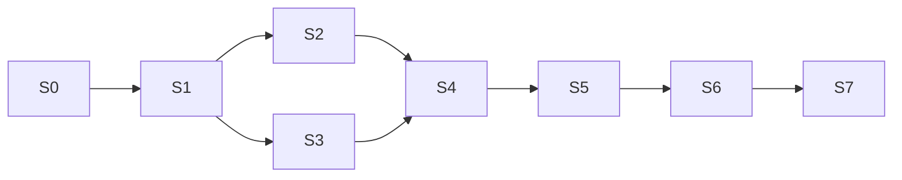

# Plano de sprints — M5 Partner Program (White-label + Vendedores)

| Campo | Valor |
|-------|-------|
| **Data** | 2026-08-12 |
| **Tipo** | Plano de implementação (produto + arquitetura + sprints) |
| **Base** | M1–M4 Commercial Overrides · M4.1 Hardening · Acquisition · Billing Platform · Branding tenant |
| **Nome** | **M5 — Partner White-label (canal + vendedores + comissão)** |
| **Escopo** | Revenda white-label: Partner com painel próprio, programas comerciais, planos/licenças, gateway próprio, carteira, vendedores com regras de comissão; Platform governa piso/envelope e cria Partners |
| **Princípio** | Platform **fora** da árvore; **sem** L2; Partner compra/revende; **marca 100% Partner**; vendedor = user do Partner com **painel próprio** (link + ganhos) |
| **Status** | **S7 feito** (2026-08-18) · S0–S7 ok · aberto: NF (D19), `revenue_share` |
| **MVP** | **S4** (fechado) · `license_pool` · 1 licença = 1 usuário · gateway Asaas |
| **Pós-MVP** | **S5** comissões (**feito**) · **S6** suspensão/migração (**feito**) · `revenue_share` |
| **S0** | [`SPRINT_M5_S0_INVENTORY_AND_SCHEMA.md`](./SPRINT_M5_S0_INVENTORY_AND_SCHEMA.md) |
| **S1** | [`SPRINT_M5_S1_PARTNER_FOUNDATION.md`](./SPRINT_M5_S1_PARTNER_FOUNDATION.md) |
| **S2** | [`SPRINT_M5_S2_WHITELABEL_BRAND.md`](./SPRINT_M5_S2_WHITELABEL_BRAND.md) |
| **S3** | [`SPRINT_M5_S3_PLANS_GATEWAY.md`](./SPRINT_M5_S3_PLANS_GATEWAY.md) |
| **S4** | [`SPRINT_M5_S4_WALLET_ACQUISITION.md`](./SPRINT_M5_S4_WALLET_ACQUISITION.md) |
| **S5** | [`SPRINT_M5_S5_COMMISSIONS.md`](./SPRINT_M5_S5_COMMISSIONS.md) |
| **S6** | [`SPRINT_M5_S6_SUSPENSION_MIGRATION.md`](./SPRINT_M5_S6_SUSPENSION_MIGRATION.md) |
| **S7** | [`SPRINT_M5_S7_PARTNER_CHANNEL_CHECKOUT.md`](./SPRINT_M5_S7_PARTNER_CHANNEL_CHECKOUT.md) — cadastro/checkout exclusivo do canal |
| **Próximo** | Soften UX WL · NF (D19) · `revenue_share` |

---

## 1. Meta

Permitir que a Platform (PainelCRM) opere um **canal de revenda white-label**:

1. **Superadmin cria Partner manualmente** e escolhe o **programa** comercial.
2. **Partner** opera com marca 100% própria (domínio custom, login, checkout, e-mails, app).
3. Partner **compra licenças** (ou opera no programa %), **revende**, e **cobra o cliente final no próprio gateway**.
4. Partner cria planos de venda (conforme regras do programa) e gerencia carteira.
5. Partner cadastra **vendedores** (Central de Vendedores) com regras de comissão por equipe/pessoa.
6. Platform continua **venda direta** em paralelo; suporte WL = Platform atende **somente Partners**.

**Fora de escopo deste plano:** L2/L3, MLM, comissão por indicação sem atribuição, payout automático PIX/TED (MVP/pós-MVP S5 = extrato + marcar pago), emissão de NF (decidir depois).

---

## 2. Diagnóstico — como está hoje

| Peça | Comportamento atual | Gap vs meta M5 |
|------|---------------------|----------------|
| **Tenants** | Flat: Platform → Tenant | Sem Partner / licenças / programas |
| **Papéis** | superadmin + roles de tenant | Sem `partner_admin` / `partner_seller` |
| **Planos** | Catálogo global Superadmin | Sem programas Partner nem pool de licenças |
| **Billing SaaS** | Platform fatura tenant | Sem atacado de licenças nem gateway por Partner |
| **Overrides** | Preço especial / waive (M1–M4) | Não cobre comissão de vendedor nem pool de seats |
| **Analytics** | Tags `white_label` (M3) | Não é domínio de canal |
| **Branding** | Logos do tenant no CRM B2B | Sem WL de plataforma (host + marca 100%) |
| **Acquisition** | Lead → provision | Sem `partner_id` / `seller_id` |
| **Gateway** | Conta Platform (ex.: Asaas) | Sem multi-gateway por Partner |
| **Comissão** | Inexistente | Central de vendedores + ledger |

**Conclusão:** reaproveitar multi-tenant, billing V2, overrides e acquisition. Construir **domínio de canal**, **pool de licenças**, **gateway por Partner** e **Central de Vendedores**.

---

## 3. Visão do modelo (fechado)

```
┌──────────────────────────────────────────────────────────┐
│ PLATFORM (PainelCRM) — fora da árvore                    │
│  · cria Partner manualmente (superadmin)                 │
│  · programas ( % | licenças fixas ) + piso de preço      │
│  · venda direta em paralelo                              │
│  · suporte WL: atende somente Partners                   │
└────────────────────────────┬─────────────────────────────┘
                             │ programa + licenças / %
┌────────────────────────────▼─────────────────────────────┐
│ PARTNER — white-label 100%                               │
│  · domínio próprio + marca completa                      │
│  · gateway de cobrança próprio (obrigatório)             │
│  · planos / revenda conforme programa                    │
│  · carteira de customer_tenants + trial (banca ele)      │
│  · Central de Vendedores (regras equipe + por pessoa)    │
└───────┬───────────────────────────────┬──────────────────┘
        │ link de venda                 │ cobra no gateway
        ▼                               ▼
┌───────────────────┐         ┌─────────────────────────────┐
│ VENDEDOR          │         │ CUSTOMER TENANT             │
│ painel próprio:   │  atrib. │ · usa o CRM (marca Partner) │
│  · link de venda  │────────►│ · não vê que é PainelCRM    │
│  · ganhos/extrato │         │ · seller opcional (casa OK) │
│ NÃO vê clientes   │         │                             │
│ NÃO vê billing    │         │                             │
└───────────────────┘         └─────────────────────────────┘
```

### O que **não** existe

- Sub-partner / L2.
- Vendedor em mais de um Partner.
- Comissão só por indicação (sem atribuição de venda/regra).
- Platform como nó da pirâmide.

---

## 4. Programas Partner (Platform → Partner)

Superadmin, ao criar o Partner, associa **um programa** (extensível depois):

| Programa | Como o Partner paga a Platform | Preço dos planos de venda | Observação |
|----------|--------------------------------|---------------------------|------------|
| **`license_pool`** (fixo / licenças) — **MVP** | Pool de **licenças-usuário** alocado/cobrado pela Platform | Pode **criar planos com o valor que desejar**, desde que **≥ piso** (por Partner) | **1 licença = 1 usuário** nos customer_tenants; trial consome e é bancado pelo Partner |
| **`revenue_share`** (%) — pós-MVP | % sobre o que o Partner vender | **Não pode alterar valores** dos planos Platform | Schema `program_type` já aceita; UI/apuração depois |

> Na criação de planos (`license_pool`), a UI deve mostrar **projeção de ganhos** (receita estimada − custo de licença − comissões simuladas).

**Licença (D20/D26):** unidade = **usuário** ativo em tenants `customer_tenant` do Partner. Staff do Partner (admin/seller) **não** consome no MVP. Detalhe: [`SPRINT_M5_S0_INVENTORY_AND_SCHEMA.md`](./SPRINT_M5_S0_INVENTORY_AND_SCHEMA.md) §2.

**Aberto:** emissão de NF (D19) — **decidir depois**.

---

## 5. Decisões de produto — **fechadas** (2026-08-12)

| ID | Decisão | Fechado | Status |
|----|---------|---------|--------|
| **D1** | Hierarquia | Platform → Partner → (Seller) → Customer Tenant. **Sem L2** | **Fechado** |
| **D2** | Papel do vendedor | User do Partner (`partner_seller`); **não** é tenant separado; tem **painel próprio** (link de venda + ganhos) | **Fechado** |
| **D3** | Forma da comissão | **Híbrido**: % e/ou valor fixo (R$). **Sem teto** Platform; valor **sai do lucro** do Partner (venda − custo). Opções: **recorrente** ou **ciclos personalizados**. Central de Vendedores: regras de **equipe** + por **vendedor** | **Fechado** |
| **D4** | Base da comissão | **Definida pelo Partner** na Central de Vendedores (inclui se 1ª venda e/ou renovações) | **Fechado** |
| **D5** | Cobrança canal | Partner **compra licenças / opera programa**, **revende** e **faz a cobrança** do cliente final | **Fechado** |
| **D5b** | Gateway | **Cada Partner configura o próprio gateway** (obrigatório para cobrar) | **Fechado** |
| **D6** | Planos | `license_pool`: cria planos com preço livre **≥ piso**. `revenue_share`: **não altera** valores dos planos Platform | **Fechado** |
| **D7** | Venda direta | Mantida em paralelo; tenant sem `partner_id` = direto | **Fechado** |
| **D8** | White-label | **Domínio próprio**; marca em **tudo** (login, checkout, e-mails, app); **100% marca Partner** | **Fechado** |
| **D9** | Atribuição | `partner_id` obrigatório no canal; `seller_id` opcional → carteira **casa** | **Fechado** |
| **D10** | Reatribuição | Partner tem **controle total** dos vendedores; pode reatribuir; ledger futuro muda, passado congelado | **Fechado** |
| **D11** | Payout | MVP/S5: extrato + marcar pago. Frequência de repasse: **Partner escolhe**. Quem paga seller: **sempre o Partner** | **Fechado** |
| **D12** | Escopo do seller | Painel: **link + ganhos**. **Não** visualiza clientes. **Não** visualiza billing. Vendedor **único** (1 Partner) | **Fechado** |
| **D13** | Trial | Partner compra/aloca licença e **banca** o trial | **Fechado** |
| **D14** | Indicação pura | **Não** há comissão só por indicar sem regra/atribuição de venda | **Fechado** |
| **D15** | Suspensão Partner | Clientes **continuam ativos**, **migram para a Platform**; **preços que estão pagando permanecem** | **Fechado** |
| **D16** | Suporte | WL: Platform atende **somente Partners**; Partner atende clientes finais / sellers | **Fechado** |
| **D17** | MVP | Entrega até **S4**; S5/S6 pós-MVP | **Fechado** |
| **D18** | Onboarding Partner | **Superadmin cria manualmente** | **Fechado** |
| **D19** | NF | **Decidir depois** | **Aberto** |
| **D20** | Unidade de licença | **1 licença = 1 usuário** | **Fechado** (S0) |
| **D21** | Programa MVP | Só **`license_pool`**; `revenue_share` depois | **Fechado** (S0) |
| **D22** | Gateway MVP | **Asaas**; `payment_gateway_configs` no tenant Partner | **Fechado** (S0) |
| **D23** | Compra de licenças MVP | Superadmin **aloca** pool; top-up self-serve opcional no S3 | **Fechado** (S0) |
| **D24** | Piso de preço | **Por Partner** na criação (superadmin) | **Fechado** (S0) |
| **D25** | Seller no MVP | Link de venda no S4; comissões no **S5** | **Fechado** (S0) |
| **D26** | Consumo do pool | COUNT users dos customer_tenants; staff Partner **não** consome | **Fechado** (S0) |
| **D27** | Feature flag | `partner.channel_v1` | **Fechado** (S0) |

---

## 6. Papéis e permissões

| Papel | Escopo | Pode |
|-------|--------|------|
| **Platform superadmin** | Global | Criar/editar/suspender Partner; escolher programa; piso/envelope; métricas; migração pós-suspensão |
| **partner_admin** | Seu Partner | Marca/domínio, gateway, planos (se programa permitir), licenças, clientes, Central de Vendedores, comissões (marcar pago), frequência de repasse |
| **partner_seller** | Painel seller | Ver **link de venda** + **ganhos/extrato**; **não** vê clientes; **não** vê billing; não edita planos/regras |
| **customer tenant admin** | Seu tenant | Uso normal do CRM sob marca do Partner |

**Unicidade:** um user `partner_seller` pertence a **no máximo um** Partner (`UNIQUE(user_id)` entre memberships seller ativos).

---

## 7. Modelo de dados

> Draft SQL completo e inventário: [`SPRINT_M5_S0_INVENTORY_AND_SCHEMA.md`](./SPRINT_M5_S0_INVENTORY_AND_SCHEMA.md) §4. Resumo abaixo.

### 7.1 Extensões em `tenants`

| Campo | Tipo | Uso |
|-------|------|-----|
| `account_type` | `platform_customer \| partner \| customer_tenant` | Default atual = venda direta |
| `partner_id` | UUID nullable | Customer do canal → Partner |
| `seller_user_id` | UUID nullable | Vendedor atribuído (opcional; null = casa) |

### 7.2 Tabelas novas (conceitual)

```
partner_profiles
  partner_tenant_id
  program_type (license_pool | revenue_share)
  program_config_json          -- % share, min licenses, piso, etc.
  public_name, product_name
  custom_domain, domain_status (pending|verified|active)
  logo_url, theme_json
  support_policy              -- Platform→Partner only
  status (active|suspended)
  payout_cadence_preference   -- partner escolhe (ex.: monthly|biweekly|on_demand)

partner_license_pool            -- license_pool; 1 seat = 1 USUÁRIO (D20)
  partner_tenant_id
  purchased_seats
  used_seats_cache              -- derivado: COUNT users nos customer_tenants
  unit_cost_cents
  -- trial consome usuário/licença; staff Partner não consome (D26)
  -- gateway: payment_gateway_configs scope=tenant no partner (sem tabela nova)

partner_sell_plans
  partner_tenant_id
  source_platform_plan_id nullable  -- obrigatório em revenue_share
  name, slug
  price_cents                   -- ≥ piso (license_pool); fixo catálogo (revenue_share)
  interval, features ≤ envelope
  status

partner_memberships
  partner_tenant_id
  user_id                       -- seller: unique global ativo
  role (partner_admin|partner_seller)
  status

-- Central de Vendedores (S5)
partner_commission_rule_sets    -- regras de equipe (default)
partner_commission_rules        -- por seller ou override
  type (percent|fixed|hybrid)
  percent, fixed_cents
  base_definition               -- definido pelo partner
  cycle_mode (recurring|custom_cycles)
  custom_cycle_config_json
  applies_to (first_only|renewals|both)  -- partner define

partner_commission_ledger
  snapshots da regra no accrual
  base_amount_cents, commission_amount_cents
  status (pending|available|paid|clawed_back)
  -- commission NÃO pode exceder lucro do ciclo (venda − custo licença/share)

partner_commission_payouts
  marcar pago + reference; frequência operacional = preferência do Partner
```

### 7.3 Acquisition

- `partner_id`, `seller_user_id` opcional, `referral_code` do seller.
- Sem código de seller → **carteira casa** (`seller_user_id` null).
- Provisionamento propaga IDs; trial no canal = custo/licença do Partner (D13).

---

## 8. Fluxos de dinheiro

### 8.1 Cliente final (obrigatório desde o canal ativo)

```
Cliente final paga
   → Gateway CONFIGURADO DO PARTNER
   → Partner reconhece receita
   → Consome 1 licença do pool (license_pool) ou registra base p/ revenue_share
   → (S5) Accrual de comissão do seller a partir do LUCRO
         lucro = preço cobrado − custo (licença ou share Platform)
```

### 8.2 Platform ← Partner

| Programa | Fluxo |
|----------|--------|
| `license_pool` | Partner compra/renova **N licenças** (mínimo contratado); Platform fatura o Partner pelo pool |
| `revenue_share` | Platform recebe **% do vendido** (apuração sobre pagamentos confirmados no gateway do Partner / relatório) |

### 8.3 Seller ← Partner

- Sempre o **Partner** paga o vendedor.
- S5: extrato + marcar pago; Partner escolhe cadência.
- Comissão **híbrida**, sem teto Platform, mas **cap operacional = lucro** do ciclo; se regra estourar lucro → validar na configuração / truncar com alerta (definir no S5).

### 8.4 Suspensão (D15)

```
Partner status = suspended
  → bloqueia novas vendas / login WL do Partner (detalhe S6)
  → customer_tenants migram para Platform (partner_id limpo / flagged migrated)
  → contracted price / preço que pagavam PERMANECE (override ou snapshot)
  → cobrança futura passa ao fluxo Platform (gateway Platform)
```

---

## 9. White-label de superfície

| Superfície | Comportamento |
|------------|---------------|
| Domínio | **Custom domain** do Partner (verificação DNS TXT/CNAME) |
| Marca | **100% Partner** — sem menção PainelCRM nas superfícies do canal |
| Cobertura | Login, checkout, e-mails, **app logado** do customer |
| Resolução | `Host` → `partner_profiles` |
| Superadmin / venda direta | Marca Platform |

---

## 10. UX — superfícies

### 10.1 Superadmin

- Criar Partner **manualmente** (programa, piso, licenças mínimas ou %, admin inicial).
- Suspender → dispara política de migração (S6).
- Métricas canal vs direto.

### 10.2 Painel Partner (`/partner/*`)

| Área | Função | MVP |
|------|--------|-----|
| Dashboard | Clientes, licenças usadas/disponíveis, saúde do gateway | S4 |
| Programa / licenças | Comprar/ver pool; (share) ver % | S3–S4 |
| Planos de venda | CRUD + **projeção de ganhos** (`license_pool`) | S3 |
| Gateway | Configurar credenciais + testar webhook | S3 |
| Clientes | Carteira, atribuição seller, trial | S4 |
| Marca / domínio | Logo, tema, domínio custom | S2 |
| Central de Vendedores | Regras equipe + por seller; híbrido; ciclos | **S5** |
| Comissões | Extrato + marcar pago; cadência | **S5** |

### 10.3 Painel do Vendedor (`/partner/seller/*`)

| Pode ver | Não pode |
|----------|----------|
| Link pessoal de venda | Lista de clientes |
| Ganhos / extrato de comissão | Billing / faturas / gateway |
| (S5) status pending/available/paid | Editar regras ou % de outros |

---

## 11. Reaproveitamento do código atual

| Existente | Uso no M5 |
|-----------|-----------|
| RLS + `tenantScope` | Escopo Partner; seller sem acesso a customers API |
| `plans` / billing V2 | Catálogo envelope + `partner_sell_plans` + fatura de pool |
| Commercial overrides | Preservar preço na migração D15; acordos Platform↔Partner |
| Acquisition | `partner_id` / `seller_user_id` / referral |
| Branding tenant | Estender para host + tema app completo |
| Gateway Asaas | Reusar `payment_gateway_configs` (`scope=tenant` no Partner); cobrança canal resolve pelo Partner pai |

---

## 12. Visão dos sprints

| Sprint | Nome | Objetivo | MVP? |
|--------|------|----------|------|
| **S0** | Inventário + schema | **Feito** — [`SPRINT_M5_S0_…`](./SPRINT_M5_S0_INVENTORY_AND_SCHEMA.md) | Sim (doc) |
| **S1** | Fundação | **Feito** — [`SPRINT_M5_S1_…`](./SPRINT_M5_S1_PARTNER_FOUNDATION.md) | Sim |
| **S2** | White-label 100% | **Feito** — [`SPRINT_M5_S2_…`](./SPRINT_M5_S2_WHITELABEL_BRAND.md) | Sim |
| **S3** | Programa + planos + gateway | **Feito** — [`SPRINT_M5_S3_…`](./SPRINT_M5_S3_PLANS_GATEWAY.md) | Sim |
| **S4** | Carteira + acquisition | Links, atribuição casa/seller, UI clientes Partner, isolamento | Sim (**fim MVP**) |
| **S5** | Central de Vendedores | Regras equipe/pessoa, híbrido, ciclos, ledger, extrato, marcar pago, painel seller ganhos | Pós-MVP |
| **S6** | Ops + suspensão | Métricas, suspender + migrar clientes preservando preço, hardening | Pós-MVP |
| **S7** | Checkout canal Partner | Cadastro/checkout exclusivo `/{slug}/cadastro` (UX `/checkout`), independente de `exclusive_signup` | Pós-MVP |



**Go-live canal (MVP):** Partner criado no superadmin, domínio + marca, gateway próprio, licenças/planos, vende e cobra, carteira ok. **Comissões de vendedores não bloqueiam o MVP** (S5).

---

## 13. Detalhe por sprint

### S0 — Inventário — **FEITO** (2026-08-13)

Entrega: [`SPRINT_M5_S0_INVENTORY_AND_SCHEMA.md`](./SPRINT_M5_S0_INVENTORY_AND_SCHEMA.md).

- D20–D27 fechadas (licença = usuário; MVP = license_pool + Asaas; etc.).
- Inventário: tenants, `payment_gateway_configs`, acquisition, superadmin, marca hardcoded, flags, `tenantLimitService`.
- Draft SQL + API + checklist S1.

### S1 — Fundação de domínio — **FEITO** (2026-08-13)

Entrega: [`SPRINT_M5_S1_PARTNER_FOUNDATION.md`](./SPRINT_M5_S1_PARTNER_FOUNDATION.md).

- Migration `318_partner_channel_s1.sql`, APIs, shell `/partner`, UI superadmin Partners.
- Ativar: flag `partner.channel_v1` ou `PARTNER_CHANNEL_V1=true`.

### S2 — White-label 100% — **FEITO** (2026-08-13)

Entrega: [`SPRINT_M5_S2_WHITELABEL_BRAND.md`](./SPRINT_M5_S2_WHITELABEL_BRAND.md).

- Domínio custom + TXT/CNAME/bypass; marca em login/checkout/app/e-mails.

### S3 — Programa + planos + gateway Partner — **FEITO** (2026-08-13)

Entrega: [`SPRINT_M5_S3_PLANS_GATEWAY.md`](./SPRINT_M5_S3_PLANS_GATEWAY.md).

- Licenças, sell-plans (≥ piso + projeção), gateway Asaas no Partner.

### S4 — Carteira + acquisition (fecha MVP)

- Checkout/link com partner + seller code opcional.
- Sem seller → casa.
- UI Partner: clientes, filtrar/reatribuir vendedor (controle total).
- Isolamento entre Partners.
- Seller: no MVP pode existir membership + **link de venda**; extrato completo em S5 (link pode já apontar acquisition).

**DoD:** fluxo completo Partner vende/cobra/provisiona sem S5; venda direta intacta.

### S5 — Central de Vendedores + comissões

- CRUD sellers (unicidade global).
- Rule sets equipe + overrides por seller (híbrido, ciclos, base, 1ª vs renovação).
- Validação: comissão não come além do **lucro**.
- Ledger + clawback; extrato; marcar pago; cadência preferida do Partner.
- Painel seller: **somente** link + ganhos.

**DoD:** pagamento gera accrual conforme regra; Partner marca pago; seller não acessa customers/billing APIs.

### S6 — Superadmin + suspensão/migração

- Dashboard canal vs direto.
- Suspender Partner → migração para Platform **preservando preço**.
- Auditoria, e2e, runbook de suporte (Platform → só Partner).

**DoD:** migração D15 testada; regressão direta verde.

### S7 — Cadastro/checkout exclusivo do canal Partner — **FEITO** (2026-08-18)

Entrega: [`SPRINT_M5_S7_PARTNER_CHANNEL_CHECKOUT.md`](./SPRINT_M5_S7_PARTNER_CHANNEL_CHECKOUT.md).

- Página dedicada em `/{partnerSlug}/cadastro` (e seller/WL) — **sem** gate “Cadastro em manutenção”.
- UX espelhando `/checkout`: planos `partner_sell_plans`, marca Partner, pagamento no gateway do Partner.
- Provision `customer_tenant` com `partner_sell_plan_id` + attribution.
- Origin do sale-link alinhado à porta real do FE (`PUBLIC_APP_URL` / Origin).
- Hardening: rate-limit, honeypot, `gateway_ready`, regressão automatizada.

**DoD:** link do painel Partner abre checkout do canal; `/checkout` Platform intacto.

---

## 14. APIs (contrato alvo — draft)

| Método | Rota | Quem | Sprint |
|--------|------|------|--------|
| `POST/GET/PATCH` | `/api/superadmin/partners` | Platform | S1 |
| `POST` | `/api/superadmin/partners/:id/suspend` | Platform (migração S6) | S6 |
| `GET/PATCH` | `/api/partner/profile` | partner_admin | S1–S2 |
| `POST` | `/api/partner/domain/verify` | partner_admin | S2 |
| `CRUD` | `/api/partner/gateway` | partner_admin | S3 |
| `GET/POST` | `/api/partner/licenses` | partner_admin | S3 |
| `CRUD` | `/api/partner/sell-plans` | partner_admin | S3 |
| `GET` | `/api/partner/sell-plans/projection` | partner_admin | S3 |
| `GET/PATCH` | `/api/partner/customers` | partner_admin | S4 |
| `CRUD` | `/api/partner/seller-rules` | partner_admin | S5 |
| `CRUD` | `/api/partner/sellers` | partner_admin | S5 |
| `GET/POST` | `/api/partner/commissions` (+ payouts) | partner_admin | S5 |
| `GET` | `/api/partner/seller/me/link` | partner_seller | S4/S5 |
| `GET` | `/api/partner/seller/me/commissions` | partner_seller | S5 |
| `GET` | `/api/public/partner-brand` | anônimo (host) | S2 |

**Removido do escopo seller:** `GET .../seller/me/customers` (D12).

---

## 15. Segurança e isolamento

- `partner_id` / credenciais de gateway: nunca só do body; contexto autenticado + host.
- Seller: **deny** em APIs de customers e billing.
- Credenciais de gateway: criptografia at-rest; rotação; webhooks assinados por Partner.
- Domínio custom: verificação DNS antes de `active`.
- Comissão: snapshot imutável em linhas `paid`; jobs de clawback auditáveis.
- Suspensão: job de migração idempotente preservando `contracted_*` / override de preço.

---

## 16. Riscos e mitigações

| Risco | Mitigação |
|-------|-----------|
| Complexidade **multi-gateway** (D5b no MVP) | S3 dedicado; checklist provider; Partner não vende sem gateway `active` |
| Estouro de comissão vs lucro | Validação na Central + cap no accrual (S5) |
| Migração D15 quebrar preço | Usar snapshot/`tenant_commercial_overrides` na migração (S6) |
| Domínio / phishing de marca | DNS verify + suspend |
| Vazamento de marca Platform no canal | QA visual S2 em todas as superfícies |
| Regressão venda direta | Flag + testes em todo sprint |
| NF indefinida (D19) | Não bloquear MVP; feature fiscal depois |

---

## 17. Critérios de aceite

### MVP (S4)

1. Superadmin cria Partner manualmente com programa.
2. Partner verifica domínio e opera 100% com sua marca (login/checkout/e-mail/app).
3. Partner configura gateway próprio e cobra cliente final nele.
4. `license_pool`: compra licenças, cria planos ≥ piso, vê projeção; trial bancado pelo Partner.
5. `revenue_share`: não altera preços dos planos Platform.
6. Lead sem seller → casa; com seller code → atribuído (mesmo sem UI rica de comissão).
7. Venda direta Platform intacta.
8. Sem L2 / sem API de sub-partner.

### Pós-MVP (S5–S6)

9. Central de Vendedores com regras equipe + pessoa (híbrido, ciclos, base).
10. Seller vê só link + ganhos; Partner marca comissão paga.
11. Suspender Partner migra clientes à Platform **mantendo preço**.

---

## 18. Decisões abertas

| ID | Tema | Nota |
|----|------|------|
| **D19** | Quem emite NF no canal | Decidir depois — não bloqueia S1–S4 |
| **S5.cap** | Truncar comissão no lucro (`commission_capped`) | **Fechado** (S5) |
| **Share apuração** | Auditar % no gateway do Partner | Quando implementar `revenue_share` (pós-MVP) |

---

## 19. Referências

- `docs/architecture/commercial/SPRINT_M1_TENANT_COMMERCIAL_OVERRIDES_FOUNDATION.md`
- `docs/architecture/commercial/SPRINT_M2_COMMERCIAL_MANAGEMENT_UI.md`
- `docs/architecture/commercial/SPRINT_M3_COMMERCIAL_ANALYTICS_AND_CONTRACTED_REVENUE.md`
- `docs/architecture/commercial/SPRINT_M4_1_HARDENING_ZERO_AMOUNT_ACTIVATION.md`
- `docs/architecture/commercial/AUDIT_TENANT_COMMERCIAL_OVERRIDES.md`
- `docs/billing/BILLING_PLATFORM_ARCHITECTURE.md`
- `docs/PADROES-TENANT-SCOPE.md`
- Acquisition: `docs/architecture/acquisition/*`
- Branding tenant: migrations `125_*`, `127_*`

---

## 20. Changelog do plano

| Data | Mudança |
|------|---------|
| 2026-08-12 | Versão inicial: Partner WL + vendedores; sem L2; S0–S6 |
| 2026-08-12 | **Decisões fechadas:** programas `license_pool` + `revenue_share`; Partner cobra no **próprio gateway**; comissão híbrida sem teto (do lucro), Central de Vendedores; seller painel link+ganhos (sem clientes/billing); domínio próprio + marca 100%; MVP **até S4**; suspensão migra clientes preservando preço; NF aberta (D19) |
| 2026-08-13 | **S0 fechado:** D20 **1 licença = 1 usuário**; D21–D27 (MVP license_pool, Asaas, alocação superadmin, piso por Partner, seller link no S4, staff não consome, flag); doc [`SPRINT_M5_S0_INVENTORY_AND_SCHEMA.md`](./SPRINT_M5_S0_INVENTORY_AND_SCHEMA.md); próximo = **S1** |
| 2026-08-13 | **S1 feito:** migration 318, APIs `/api/superadmin/partners` + `/api/partner/*`, FE Partners + shell `/partner`; [`SPRINT_M5_S1_PARTNER_FOUNDATION.md`](./SPRINT_M5_S1_PARTNER_FOUNDATION.md); próximo = **S2** |
| 2026-08-13 | **S2 feito:** brand por Host, DNS verify, Auth/Checkout/App/e-mails WL; [`SPRINT_M5_S2_WHITELABEL_BRAND.md`](./SPRINT_M5_S2_WHITELABEL_BRAND.md); próximo = **S3** |
| 2026-08-13 | **S3 feito:** licenses + sell-plans + gateway Asaas Partner; [`SPRINT_M5_S3_PLANS_GATEWAY.md`](./SPRINT_M5_S3_PLANS_GATEWAY.md); próximo = **S4** |
| 2026-08-13 | **S4 feito (MVP canal):** carteira + attribution acquisition + provision `customer_tenant` + gateway Partner; [`SPRINT_M5_S4_WALLET_ACQUISITION.md`](./SPRINT_M5_S4_WALLET_ACQUISITION.md); próximo = **S5** |
| 2026-08-17 | **S5 feito:** Central de Vendedores + ledger/payouts; S5.cap=truncate; [`SPRINT_M5_S5_COMMISSIONS.md`](./SPRINT_M5_S5_COMMISSIONS.md); próximo = **S6** |
| 2026-08-17 | **S6 feito:** suspend + migração D15 (preço preservado), channel-stats, runbook; [`SPRINT_M5_S6_SUSPENSION_MIGRATION.md`](./SPRINT_M5_S6_SUSPENSION_MIGRATION.md); canal M5 completo |
| 2026-08-17 | **S7 planejado:** checkout/cadastro exclusivo Partner (`/{slug}/cadastro`) independente do gate `exclusive_signup`; [`SPRINT_M5_S7_PARTNER_CHANNEL_CHECKOUT.md`](./SPRINT_M5_S7_PARTNER_CHANNEL_CHECKOUT.md) |
| 2026-08-18 | **S7.0 feito:** inventário PlanCheckout vs canal; contrato API §14; sale-link origin via `resolveSaleLinkOrigin` (Origin/FRONTEND_URL, sem fallback 5173) |
| 2026-08-18 | **S7.1 feito:** `PartnerChannelCheckout` + `CadastroEntry` (WL); rotas `/{slug}/cadastro` sem gate manutenção; pagamento = S7.2 |
| 2026-08-18 | **S7.2 feito:** APIs públicas signup-trial/signup; provision `customer_tenant` + fatura no sell plan; FE passo 5 ligado |
| 2026-08-18 | **S7 completo (S7.3):** honeypot + rate-limit brand; `gateway_ready` / suspenso; regressão sale-link; checklist QA |
| 2026-08-19 | **S7.4 feito:** CPF/CNPJ obrigatório no checkout Partner (paridade Asaas); FE passo pagamento + carteira Partner; [`SPRINT_M5_S7_PARTNER_CHANNEL_CHECKOUT.md`](./SPRINT_M5_S7_PARTNER_CHANNEL_CHECKOUT.md) §S7.4 |
