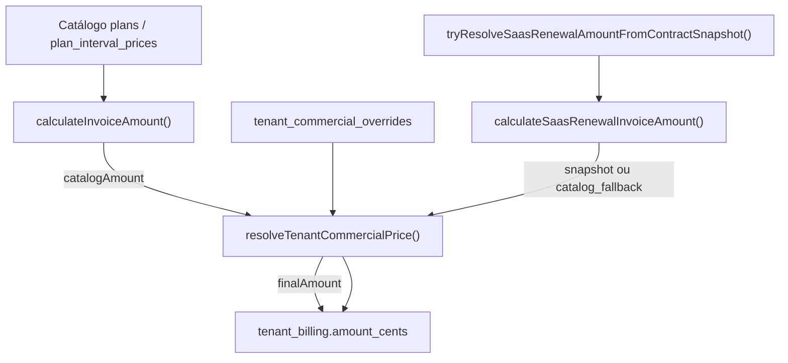

# Sprint M1 — Tenant Commercial Overrides Foundation

## Objetivo

Fundação backend para preços comerciais personalizados por tenant, sem alterar o catálogo global (`plans`) e sem impacto em Lifecycle, Trial jobs ou Promotion Engine.

## Arquitetura implementada



## Componentes

| Artefato | Caminho |
|----------|---------|
| Migration | `database/init/267_tenant_commercial_overrides.sql` |
| Tipos | `packages/backend/src/commercial/tenantCommercialTypes.ts` |
| Repositório | `packages/backend/src/commercial/tenantCommercialOverrideRepository.ts` |
| Serviço | `packages/backend/src/commercial/tenantCommercialOverrideService.ts` |
| Integração | `packages/backend/src/services/billingService.ts` |

## Tabela `tenant_commercial_overrides`

Campos conforme spec Sprint M1. Índices:

- `tenant_id` (parcial `is_active`)
- `(tenant_id, plan_id, billing_interval)` (parcial `is_active`)
- `(tenant_id, valid_from, valid_until)`

## Tipos de override

| `override_type` | Comportamento |
|-----------------|---------------|
| `fixed_price` | `value_cents` substitui o total |
| `percent_discount` | `catalog × (1 - percent_off/100)` arredondado |
| `amount_discount` | `catalog - value_cents`, mínimo 0 |
| `waive` | total 0 |

## `resolveTenantCommercialPrice()`

**Entrada:**

```ts
{
  tenantId,
  planId,
  billingInterval,
  catalogAmountCents,
  context: 'checkout' | 'renewal' | 'seat_addon' | 'manual_charge'
}
```

**Saída:**

```ts
{
  finalAmountCents,
  source: 'catalog' | 'tenant_override',
  overrideId,
  overrideType
}
```

**Prioridade** (maior especificidade vence):

1. `plan_id` + `billing_interval`
2. `plan_id` apenas
3. Global do tenant (`plan_id` null)

Desempate: `created_at` mais recente.

## Integração billing

### `calculateInvoiceAmount(planId, interval, usersCount?, options?)`

- Parâmetro opcional `options.tenantId` + `options.context` — **retrocompatível**.
- Sem `tenantId`: comportamento idêntico ao anterior.
- Com `tenantId`: catálogo → `resolveTenantCommercialPrice()` → valor final.

Chamadores atualizados:

- `subscriptionService.subscribePlan` — `checkout` / `manual_charge`
- `subscriptionService` (reuso de fatura checkout)
- `billingSubscriptionService.changeSubscriptionPlan`

### `calculateSaasRenewalInvoiceAmount(params)`

- Novo campo opcional `tenantId`.
- **Snapshot:** aplica override sobre valor contratado.
- **Fallback catálogo:** delega a `calculateInvoiceAmount` com `tenantId` (evita dupla aplicação).

Chamador atualizado:

- `recurringBillingJobService.processOneSaasRenewalJob`

## Auditoria

Log estruturado quando override é aplicado:

```text
[tenant_commercial_override]
{
  tenantId, planId, overrideId, overrideType,
  catalogAmount, finalAmount, context
}
```

Sem tabela de auditoria nesta sprint.

## Fora do escopo (M2+)

- UI Superadmin / CRUD
- Relatórios MRR contratado
- Seat addon com override direto (herda contrato após checkout)
- CRM `customer_invoices`

## Testes

`packages/backend/src/commercial/tenantCommercialOverrideService.test.ts`

Cobertura: fixed_price, percent_discount, amount_discount, waive, sem override, prioridade, múltiplos overrides, valor não negativo.

## Critérios de aceite

| Cenário | Resultado |
|---------|-----------|
| Tenant sem override | Catálogo inalterado (ex.: R$99) |
| `fixed_price` R$59 | Cobra R$59 |
| `waive` | Cobra R$0 |
| Renovação com `tenantId` | Mesmo resolvedor |
| Lifecycle / Trial / Promotion | Não alterados |

## Referências

- `AUDIT_TENANT_COMMERCIAL_OVERRIDES.md`
- `BILLING_CONTRACTED_PRICING_POLICY.md`
